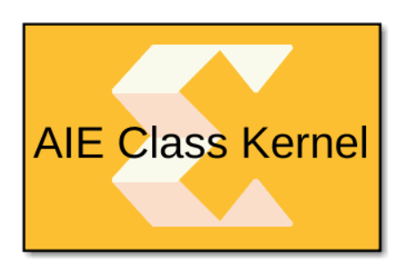

# AIE Class Kernel

This block allows you to import class-based kernels.  
  

## Library

AI Engine/User-Defined Functions

## Description

The AIE Class Kernel block is used to import class-based kernels. This
block also supports importing class templates to define a family of
kernels.

## Parameters

[TABLE]
