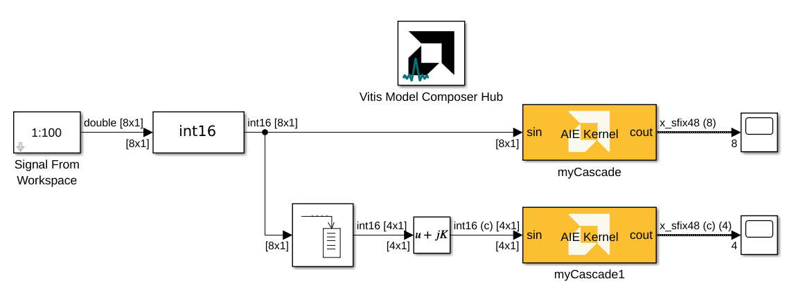

<!-- Library: aieBasic -->

# AIE Kernel

This block allows you to import an AI Engine kernel.  

  

## Library

AI Engine/User-Defined Functions

## Description

The AIE Kernel block enables you to import an AI Engine kernel, which is a C/C++ program. This block supports importing Window, Buffer, Stream, Cascade, and Run time parameter as arguments to the kernel function. Additionally, this block allows you to import a function template with typename template parameter T, and a non-type (integral) template parameter N.

If your kernel is a class based kernel, you should use the 
AIE Class block to import the kernel.

## Parameters
#### Kernel header file
Mandatory string. Name of the header file that contains the kernel function declaration. The string could be just the file name, a relative path to the file or an absolute path of the file. Use the browse button to choose the file.

#### Kernel function
Mandatory string. Name of the kernel function for which the block is to be created. This function should be declared in the kernel header file. 

#### Kernel init function
Optional string. Name of the initialization function used by the kernel function. An initialization function cannot return a value and cannot have input/output arguments, that is,
the function prototype must be as follows:

_void init_function_name(void)_

  The initialization function is called only once before the kernel function is called.

This function can be used to initialize global variables and set or clear rounding and saturation
modes. It cannot use buffer or stream APIs to access memory or stream interfaces, but stream
intrinsics (for example, get_ss() or put_ss()) can be used.

#### Kernel source file
Mandatory string. Name of the source file that contains the kernel function definition. The string could be the file name, a relative path to the file or an absolute path of the file.

#### Kernel search paths
Optional vector of strings. If the kernel header file or the kernel source file are not found using the value provided through the 'Kernel header file' or 'Kernel source file' fields respectively, then the paths provided through 'Kernel search paths' are used to find the files.

This parameter allows use of environment variables while specifying paths for the kernel header file and the kernel source file. The environment variable can be used in either ${ENV} or $ENV format. 

#### Preprocessor options
Optional preprocessor arguments for downstream compilation with specific preprocessor options.

The following two preprocessor option formats are accepted and multiple can be selected: -Dname and -Dname=definition separated by a comma. That is, the optional argument must begin with -D and if the option definition value is not provided, it is assumed to be 1.

## Examples

***Click on the images below to open each model.***

This example shows import of kernel functions with int16 real and complex inputs and outputs.

<!--
DESCRIPTION:
Model: AIE_Kernel_Ex1
Generated: 09-Jan-2026 13:41:13

Vitis Model Composer Configuration:
  Target Device: xcvc1502-nsvg1369-1LHP-i-L

Vitis Model Composer Blocks:
  - AIE: AIE Kernel

Description:
This MATLAB script creates a Vitis Model Composer Simulink model that uses the AI Engine AIE Kernel block.  and the output is converted and visualized for comparison.

-->

<!--
MATLAB CREATION SCRIPT:

% create_AIE_Kernel_Ex1_model.m
% Auto-generated script to recreate the AIE_Kernel_Ex1 Simulink model
% Generated on: 09-Jan-2026 13:41:13

%% Model Configuration
modelName = 'AIE_Kernel_Ex1_recreated';

%% Create New Model
if bdIsLoaded(modelName)
    close_system(modelName, 0);
end

new_system(modelName);
open_system(modelName);
fprintf('Created new model: %s\n', modelName);

%% Add Vitis Model Composer Hub Block
hubBlockPath = [modelName '/Vitis Model Composer Hub'];
add_block('vmcUtilities/Vitis Model Composer Hub', hubBlockPath, ...
    'Position', [322 123 377 176]);

hubBlk = xmcFindHubBlock(modelName);
vmchub_set_param(hubBlk, modelName, 'SelectHardware', 'xcvc1502-nsvg1369-1LHP-i-L');

%% Add Top-Level Blocks
add_block('built-in/Buffer', [modelName '/Buffer'], ...
    'Position', [235 274 285 326]);
set_param([modelName '/Buffer'], ...
    'N', '4', ...
    'V', '0', ...
    'ic', '0', ...
    'OverlapPercent', '0');
add_block('built-in/DataTypeConversion', [modelName '/Data Type Conversion'], ...
    'Position', [120 198 195 232]);
set_param([modelName '/Data Type Conversion'], ...
    'OutMin', '[]', ...
    'OutMax', '[]', ...
    'OutDataTypeStr', 'int16', ...
    'LockScale', 'off', ...
    'ConvertRealWorld', 'Real World Value (RWV)', ...
    'RndMeth', 'Floor', ...
    'SaturateOnIntegerOverflow', 'off', ...
    'SampleTime', '-1');
add_block('built-in/RealImagToComplex', [modelName '/Real-Imag to Complex'], ...
    'Position', [335 285 365 315]);
set_param([modelName '/Real-Imag to Complex'], ...
    'Input', 'Real', ...
    'ConstantPart', '0', ...
    'SampleTime', '-1');
add_block('built-in/Scope', [modelName '/Scope'], ...
    'Position', [605 199 635 231]);
set_param([modelName '/Scope'], ...
    'OpenAtSimulationStart', 'off', ...
    'DisplayFullPath', 'off', ...
    'NumInputPorts', '1', ...
    'LayoutDimensionsString', '[1 1]', ...
    'SampleTime', '-1', ...
    'FrameBasedProcessingString', 'Columns as channels (frame based)', ...
    'MaximizeAxes', 'Off', ...
    'AxesScaling', 'Manual', ...
    'AxesScalingNumUpdates', '10', ...
    'TimeSpan', 'Auto', ...
    'TimeSpanOverrunAction', 'Wrap', ...
    'TimeUnits', 'None', ...
    'TimeDisplayOffset', '0', ...
    'TimeAxisLabels', 'Bottom displays only', ...
    'ShowTimeAxisLabel', 'off', ...
    'ActiveDisplayString', '1', ...
    'Title', '%<SignalLabel>', ...
    'ShowLegend', 'off', ...
    'ShowGrid', 'on', ...
    'PlotAsMagnitudePhase', 'off', ...
    'ActiveDisplayYMinimum', '-14', ...
    'ActiveDisplayYMaximum', '250.8106', ...
    'DataLoggingLimitDataPoints', 'off', ...
    'DataLoggingMaxPoints', '5000', ...
    'DataLoggingDecimateData', 'off', ...
    'DataLoggingDecimation', '2', ...
    'DataLogging', 'off', ...
    'DataLoggingVariableName', 'ScopeData', ...
    'DataLoggingSaveFormat', 'Dataset');
add_block('built-in/Scope', [modelName '/Scope1'], ...
    'Position', [605 284 635 316]);
set_param([modelName '/Scope1'], ...
    'OpenAtSimulationStart', 'off', ...
    'DisplayFullPath', 'off', ...
    'NumInputPorts', '1', ...
    'LayoutDimensionsString', '[1 1]', ...
    'SampleTime', '-1', ...
    'FrameBasedProcessingString', 'Columns as channels (frame based)', ...
    'MaximizeAxes', 'Off', ...
    'AxesScaling', 'Manual', ...
    'AxesScalingNumUpdates', '10', ...
    'TimeSpan', 'Auto', ...
    'TimeSpanOverrunAction', 'Wrap', ...
    'TimeUnits', 'None', ...
    'TimeDisplayOffset', '0', ...
    'TimeAxisLabels', 'Bottom displays only', ...
    'ShowTimeAxisLabel', 'off', ...
    'ActiveDisplayString', '1', ...
    'Title', '%<SignalLabel>', ...
    'ShowLegend', 'off', ...
    'ShowGrid', 'on', ...
    'PlotAsMagnitudePhase', 'off', ...
    'ActiveDisplayYMinimum', '-24', ...
    'ActiveDisplayYMaximum', '216', ...
    'DataLoggingLimitDataPoints', 'off', ...
    'DataLoggingMaxPoints', '5000', ...
    'DataLoggingDecimateData', 'off', ...
    'DataLoggingDecimation', '2', ...
    'DataLogging', 'off', ...
    'DataLoggingVariableName', 'ScopeData1', ...
    'DataLoggingSaveFormat', 'Dataset');
add_block('vmcUtilities/Vitis Model Composer Hub', [modelName '/Vitis Model Composer Hub'], ...
    'Position', [322 123 377 176]);
set_param([modelName '/Vitis Model Composer Hub'], ...
    'CodeGeneration', 'off', ...
    'StartColumn', '1', ...
    'NumberOfColumns', '1', ...
    'TargetDirectory', './code', ...
    'exportDesign', 'off', ...
    'analyzeDesign', 'off', ...
    'validateDesignOnHw', 'off', ...
    'ExportType', 'AI Engines', ...
    'IpVendor', 'xilinx.com', ...
    'IpLibrary', 'hls', ...
    'IpVersion', '1.0', ...
    'IpHWLanguage', 'Verilog', ...
    'AieCompilerOptions', '{}', ...
    'CreateTestbench', 'off', ...
    'TestbenchStackSize', '10', ...
    'RunRtlSim', 'off', ...
    'RunCSim', 'off', ...
    'RunAieSim', 'off', ...
    'AieSimTimeout', '50000', ...
    'RunAieSimProfiling', 'off', ...
    'LaunchVitisAnalyzer', 'off', ...
    'PlotOutput', 'off', ...
    'GenHwImage', 'off', ...
    'GenLibadfXo', 'off', ...
    'GenHwValidationCode', 'off', ...
    'PlatformType', 'Not Specified', ...
    'HwSystemType', 'Baremetal', ...
    'HwValidationTarget', 'hw', ...
    'ProjDevice', 'xcvc1502-nsvg1369-1LHP-i-L', ...
    'SamplePeriod', '-1', ...
    'ClockFrequency', '200', ...
    'DataPathParallelism', '1', ...
    'xilinxfamily', 'versalaicore', ...
    'part', 'xcvc1502', ...
    'speed', '-1LHP-i-L', ...
    'package', 'nsvg1369', ...
    'directory', './code', ...
    'testbench', 'off', ...
    'incr_netlist', 'off', ...
    'synthesis_tool', 'Vivado', ...
    'clock_wrapper', 'Clock Enables', ...
    'dbl_ovrd', 'According to Block Masks', ...
    'dcm_input_clock_period', '10', ...
    'sysclk_period', '10', ...
    'simulink_period', '1', ...
    'eval_field', '0', ...
    'LogFileName', '''''', ...
    'NThreads', '4');
add_block('aieBasic/AIE Kernel', [modelName '/myCascade'], ...
    'Position', [425 192 535 238]);
set_param([modelName '/myCascade'], ...
    'KernelAllAttrs', 's[12;12;9;9;19;14;21;23;21;23;24;21;15;17;12;24;26;26;26;27;28;9;21;23;23;23;24;25;14;19;19;29]@FunctionNameDeclFileNamePortNamesPortTypesPortSerializedTypesPortDirectionsPortWindowSizeEnablesPortWindowMarginEnablesPortBufferSizeEnablesPortBufferMarginEnablesPortSynchronicityEnablesPortSignalSizeEnablesPortBufferSizesPortBufferMarginsFunctionDeclFunctionTemplateSpecKindFunctionTemplateParamNamesFunctionTemplateParamKindsFunctionTemplateParamTypesFunctionTemplateParamValuesFunctionTemplateParamEnablesClassDeclClassTemplateSpecKindClassTemplateParamNamesClassTemplateParamKindsClassTemplateParamTypesClassTemplateParamValuesClassTemplateParamEnablesClassCtorDeclsClassCtorParamNamesClassCtorParamTypesClassCtorParamSerializedTypes[1 1]@C[32 1]@t9@myCascadet17@../../myCascade.hC[2 1]@t3@sint4@coutC[2 1]@t20@input_stream_int16 *t24@output_stream< acc48 > *C[2 1]@t30@{P{Tinput_stream{1{t{Bi16}}}}}t33@{P{Toutput_stream{1{t{Sacc48}}}}}C[2 1]@t5@inputt6@outputC[2 1]@l0@l0@C[2 1]@l0@l0@C[2 1]@l0@l0@C[2 1]@l0@l0@C[2 1]@l0@l0@C[2 1]@l0@l1@C[2 1]@nnC[2 1]@nnt71@void myCascade(input_stream_int16 * sin, output_stream< acc48 > * cout)t4@nonee[0 1]@e[0 1]@e[0 1]@e[0 1]@e[0 1]@nne[0 1]@e[0 1]@e[0 1]@e[0 1]@e[0 1]@e[0 1]@e[0 1]@e[0 1]@e[0 1]@', ...
    'PortNames', '{''sin''; ''cout''}', ...
    'PortSerializedTypes', '{''{P{Tinput_stream{1{t{Bi16}}}}}''; ''{P{Toutput_stream{1{t{Sacc48}}}}}''}', ...
    'PortWindowSizes', '{0.000000000000000000e+00, 0.000000000000000000e+00}', ...
    'PortWindowMargins', '{0.000000000000000000e+00, 0.000000000000000000e+00}', ...
    'PortSynchronicities', '{''auto'', ''auto''}', ...
    'PortSignalSizes', '{0.000000000000000000e+00; 8.000000000000000000e+00}', ...
    'FunctionTemplateSpecKind', 'none', ...
    'FunctionTemplateParamNames', '{}', ...
    'FunctionTemplateParamKinds', '{}', ...
    'FunctionTemplateParamTypes', '{}', ...
    'FunctionTemplateParamValues', '{}', ...
    'FunctionIndex', '1', ...
    'FunctionTabVisible', 'on', ...
    'FunctionTemplateParamsVisible', 'off', ...
    'FunctionDeclTypeOptions', 'C[1 1]@t71@void myCascade(input_stream_int16 * sin, output_stream< acc48 > * cout)', ...
    'FunctionDecl', 'void myCascade(input_stream_int16 * sin, output_stream< acc48 > * cout)', ...
    'FunctionTemplateParams', '{}', ...
    'FunctionTemplateParamsEnables', '{}', ...
    'PortAttrs', '{ ''input'', ''sin'', ''input_stream_int16 *'', '''', '''', '''', ''''; ''output'', ''cout'', ''output_stream< acc48 > *'', '''', '''', '''', ''8'' }', ...
    'PortAttrsEnables', '{''off'', ''off'', ''off'', ''off'', ''off'', ''off'', ''off'';''off'', ''off'', ''off'', ''off'', ''off'', ''off'', ''on''}', ...
    'SampleTime', '-1', ...
    'KernelHeaderFile', 'myCascade.h', ...
    'KernelFunction', 'myCascade', ...
    'KernelSourceFile', 'myCascade.cpp', ...
    'KernelSearchPaths', '{}', ...
    'PreProcOptions', '{}');
add_block('aieBasic/AIE Kernel', [modelName '/myCascade1'], ...
    'Position', [425 277 535 323]);
set_param([modelName '/myCascade1'], ...
    'KernelAllAttrs', 's[12;12;9;9;19;14;21;23;21;23;24;21;15;17;12;24;26;26;26;27;28;9;21;23;23;23;24;25;14;19;19;29]@FunctionNameDeclFileNamePortNamesPortTypesPortSerializedTypesPortDirectionsPortWindowSizeEnablesPortWindowMarginEnablesPortBufferSizeEnablesPortBufferMarginEnablesPortSynchronicityEnablesPortSignalSizeEnablesPortBufferSizesPortBufferMarginsFunctionDeclFunctionTemplateSpecKindFunctionTemplateParamNamesFunctionTemplateParamKindsFunctionTemplateParamTypesFunctionTemplateParamValuesFunctionTemplateParamEnablesClassDeclClassTemplateSpecKindClassTemplateParamNamesClassTemplateParamKindsClassTemplateParamTypesClassTemplateParamValuesClassTemplateParamEnablesClassCtorDeclsClassCtorParamNamesClassCtorParamTypesClassCtorParamSerializedTypes[1 1]@C[32 1]@t11@myCascade_ct17@../../myCascade.hC[2 1]@t3@sint4@coutC[2 1]@t21@input_stream_cint16 *t25@output_stream< cacc48 > *C[2 1]@t33@{P{Tinput_stream{1{t{Scint16}}}}}t34@{P{Toutput_stream{1{t{Scacc48}}}}}C[2 1]@t5@inputt6@outputC[2 1]@l0@l0@C[2 1]@l0@l0@C[2 1]@l0@l0@C[2 1]@l0@l0@C[2 1]@l0@l0@C[2 1]@l0@l1@C[2 1]@nnC[2 1]@nnt75@void myCascade_c(input_stream_cint16 * sin, output_stream< cacc48 > * cout)t4@nonee[0 1]@e[0 1]@e[0 1]@e[0 1]@e[0 1]@nne[0 1]@e[0 1]@e[0 1]@e[0 1]@e[0 1]@e[0 1]@e[0 1]@e[0 1]@e[0 1]@', ...
    'PortNames', '{''sin''; ''cout''}', ...
    'PortSerializedTypes', '{''{P{Tinput_stream{1{t{Scint16}}}}}''; ''{P{Toutput_stream{1{t{Scacc48}}}}}''}', ...
    'PortWindowSizes', '{0.000000000000000000e+00, 0.000000000000000000e+00}', ...
    'PortWindowMargins', '{0.000000000000000000e+00, 0.000000000000000000e+00}', ...
    'PortSynchronicities', '{''auto'', ''auto''}', ...
    'PortSignalSizes', '{0.000000000000000000e+00; 4.000000000000000000e+00}', ...
    'FunctionTemplateSpecKind', 'none', ...
    'FunctionTemplateParamNames', '{}', ...
    'FunctionTemplateParamKinds', '{}', ...
    'FunctionTemplateParamTypes', '{}', ...
    'FunctionTemplateParamValues', '{}', ...
    'FunctionIndex', '1', ...
    'FunctionTabVisible', 'on', ...
    'FunctionTemplateParamsVisible', 'off', ...
    'FunctionDeclTypeOptions', 'C[1 1]@t75@void myCascade_c(input_stream_cint16 * sin, output_stream< cacc48 > * cout)', ...
    'FunctionDecl', 'void myCascade_c(input_stream_cint16 * sin, output_stream< cacc48 > * cout)', ...
    'FunctionTemplateParams', '{}', ...
    'FunctionTemplateParamsEnables', '{}', ...
    'PortAttrs', '{ ''input'', ''sin'', ''input_stream_cint16 *'', '''', '''', '''', ''''; ''output'', ''cout'', ''output_stream< cacc48 > *'', '''', '''', '''', ''4'' }', ...
    'PortAttrsEnables', '{''off'', ''off'', ''off'', ''off'', ''off'', ''off'', ''off'';''off'', ''off'', ''off'', ''off'', ''off'', ''off'', ''on''}', ...
    'SampleTime', '-1', ...
    'KernelHeaderFile', 'myCascade.h', ...
    'KernelFunction', 'myCascade_c', ...
    'KernelSourceFile', 'myCascade.cpp', ...
    'KernelSearchPaths', '{}', ...
    'PreProcOptions', '{}');

%% Create Signal From
Workspace Subsystem
add_block('built-in/SubSystem', [modelName '/Signal From
Workspace'], ...
    'Position', [5 198 60 232]);

% Remove default blocks
defaultBlocks = find_system([modelName '/Signal From
Workspace'], 'SearchDepth', 1, 'Type', 'block');
for i = 1:length(defaultBlocks)
    if ~strcmp(defaultBlocks{i}, [modelName '/Signal From
Workspace'])
        delete_block(defaultBlocks{i});
    end
end

%% Connect Top-Level Blocks
add_line(modelName, 'myCascade1/2', 'Scope1/2', 'autorouting', 'on');
add_line(modelName, 'Real-Imag to Complex/2', 'myCascade1/2', 'autorouting', 'on');
add_line(modelName, 'Buffer/2', 'Real-Imag to Complex/2', 'autorouting', 'on');
add_line(modelName, 'myCascade/2', 'Scope/2', 'autorouting', 'on');
add_line(modelName, 'Data Type Conversion/2', 'myCascade/2', 'autorouting', 'on');
add_line(modelName, 'Data Type Conversion/2', 'Buffer/2', 'autorouting', 'on');
add_line(modelName, 'Data Type Conversion/2', 'Buffer/2', 'autorouting', 'on');
add_line(modelName, 'Signal From Workspace/2', 'Data Type Conversion/2', 'autorouting', 'on');

%% Save Model
save_system(modelName);
fprintf('\nModel saved: %s.slx\n', modelName);
-->

## Related blocks
Use [AIE Class](../AIE_Class_Kernel_Function/README.md) block to import a class based kernel.

Use [AIE Graph](../AIE_Graph_Function/README.md) block to import an AI Engine graph.

--------------
Copyright (C) 2025 Advanced Micro Devices, Inc.
All rights reserved.

SPDX-License-Identifier: MIT
