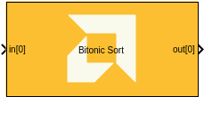
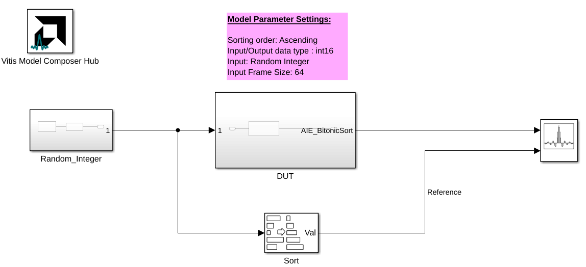
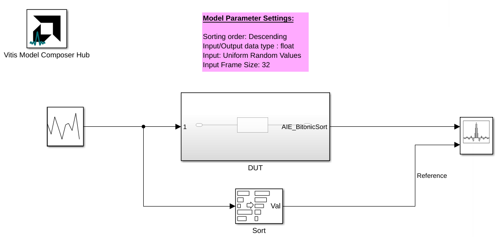

# Bitonic Sort

  
  

## Library

AI Engine/DSP/Buffer IO

## Description

This block implements the Bitonic Sort algorithm targeted for
AI Engines.

Bitonic Sort is a parallel sorting algorithm with an asymptotic complexity of `log2(n) * (log2(n)+1) / 2` (assuming all the operations in each stage occur in one time step).

## Parameters

### Main  
#### Input/Output data type  
Sets the output data type.

#### Input frame size (samples)  
Specifies the number of samples in the input list.

#### Number of frames
Specifies the number of lists to sort per call to the kernel.

In Simulink, the size of this block's input will be equal to the input frame size times the number of frames.

#### Number of cascade stages
Specifies the number of tiles to cascade computation across to increase throughput.

#### Sort order
Describes whether to sort the list in descending or ascending order.

#### SSR
Specifies the number of input ports. The maximum SSR value is 8.

When SSR > 1, the input frame should be split across the multiple SSR paths.

### Constraints
Click on the button given here to access the constraint manager and add or update constraints for each kernel. If you set the "Number of cascade stages" parameter to a value greater than one, multiple kernels will be used to process the input. You can use the constraint manager to optimize the performance of your design by setting specific constraints for each kernel (in this case, you need to first run your design). Adding constraints will not affect the functional simulation in Simulink. Constraints will only affect the generated graph code, cycle approximate AIE simulation (System C), and behavior in hardware.

If you are using non-default constraints for any of the kernels for the block, an asterisk (*) will be displayed next to the button.

## Examples

***Click on the images below to open each model.***

## References
This block uses the Vitis DSP library implementation of Bitonic Sort. For more details on this implementation please click [here](https://docs.amd.com/r/en-US/Vitis_Libraries/dsp/user_guide/L2/func-bitonic-sort.html).

--------------
Copyright (C) 2025 Advanced Micro Devices, Inc.
All rights reserved.

SPDX-License-Identifier: MIT
