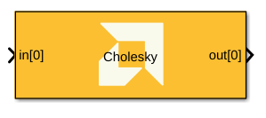
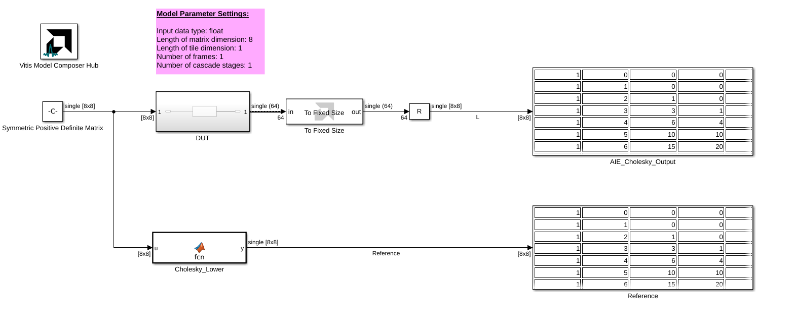
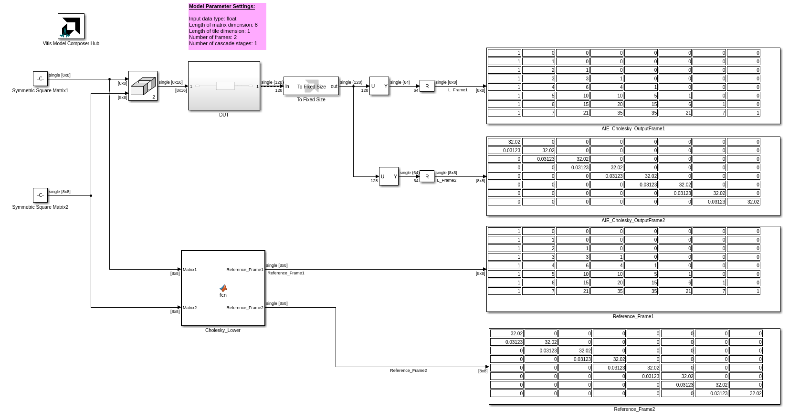
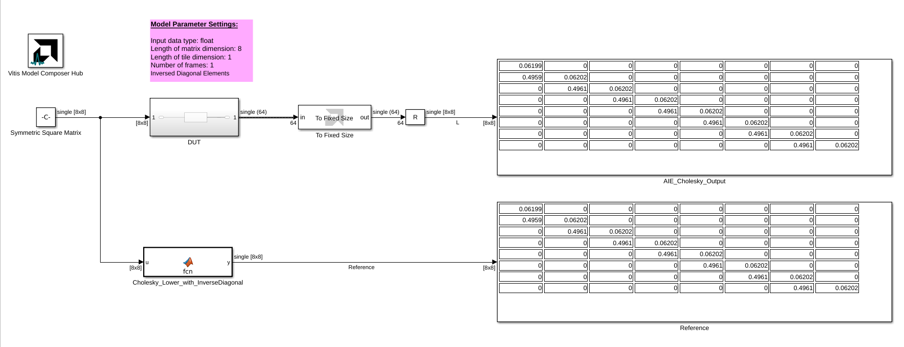
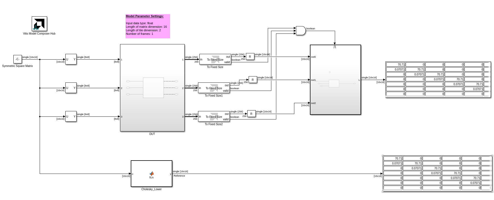

# Cholesky

Implements Cholesky decomposition targeted for AI Engines.

## Library

AI Engine/Solver/Buffer IO

## Description

This block computes the Cholesky factorization of a square Hermitian positive-definite matrix `A`. It returns the lower triangular factor `L` such that `A = L × L^H`, where `L^H` is the conjugate transpose of `L`. For real data, `L^H` is the ordinary transpose. The input must be Hermitian and positive definite.

Input matrices are 2D signals. The block supports configurable matrix dimensions, tiling, multiple frames, and cascade stages. For matrix layout conventions and supported parameter ranges, see *AI Engine Solver Blocks* in the Vitis Model Composer User Guide (UG1483).

## Reconstructing the Input Matrix

To reconstruct the input, connect the Cholesky output `L` directly to one Matrix Multiply input and connect the conjugate transpose of `L` to the other. For real data the conjugate transpose is an ordinary transpose. The multiply computes `A_reconstructed = L × L^H`, which should match the original matrix `A` within numerical precision. Disable **Provide diagonal elements inverse** to output the standard factor `L` required for this reconstruction.

## Parameters

### Main

#### Input data type
Specifies the data type of the input matrix elements. The legal values are `float` and `cfloat`.

#### Length of matrix dimension
Specifies the number of rows and columns in the square input matrix.

#### Length of tile dimension
Specifies the tiling-grid dimension (`TP_GRID_DIM`). The matrix is divided into a grid of this length on each side. The matrix dimension must be divisible by this value. Each tile then has Length of matrix dimension / Length of tile dimension rows and columns. The number of kernels is `N × (N + 1) / 2`, where `N` is this parameter.

#### Number of frames
Specifies the number of input matrices to process per kernel call.

#### Number of cascade stages
Specifies the number of kernels used to divide and cascade the computation.

#### Provide diagonal elements inverse
When enabled, the diagonal elements of the Cholesky factor are provided as their reciprocals. Enable this option when a downstream substitution kernel expects inverse diagonal elements. Disable it to retain the standard factor output.

### Constraints
Use the constraint manager to set per-kernel constraints. When **Number of cascade stages** is greater than one, constraints can be set for each kernel; run the design before configuring them. Constraints affect generated graph code, cycle-approximate AIE simulation (System C), and hardware behavior, but not functional simulation in Simulink.

## Cholesky Block Examples

These examples compare the AI Engine Cholesky block in Vitis Model Composer with the MATLAB Cholesky reference. Click an image to open its model.

--------------
Copyright (C) 2026 Advanced Micro Devices, Inc.
All rights reserved.

SPDX-License-Identifier: MIT
