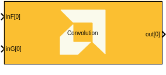
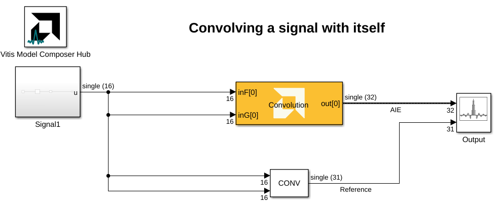
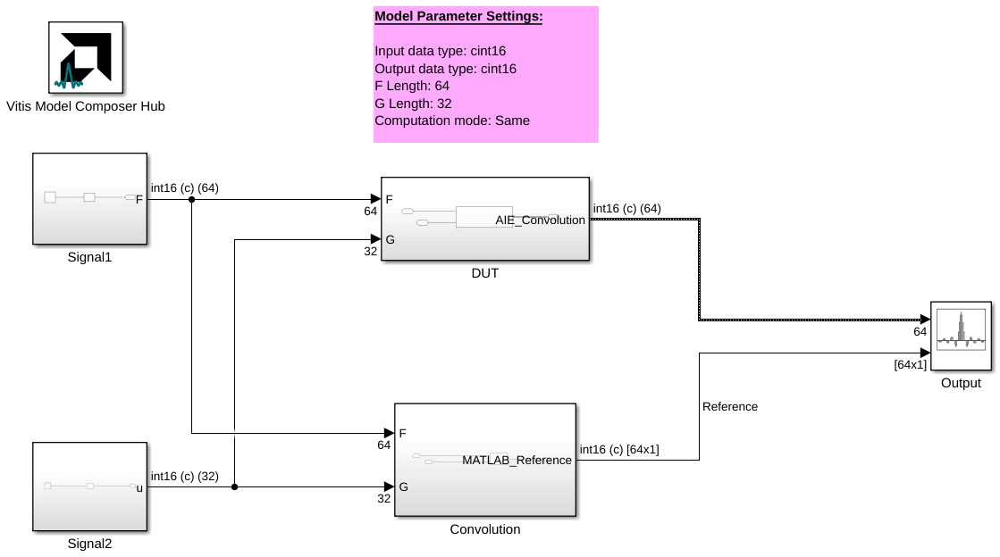
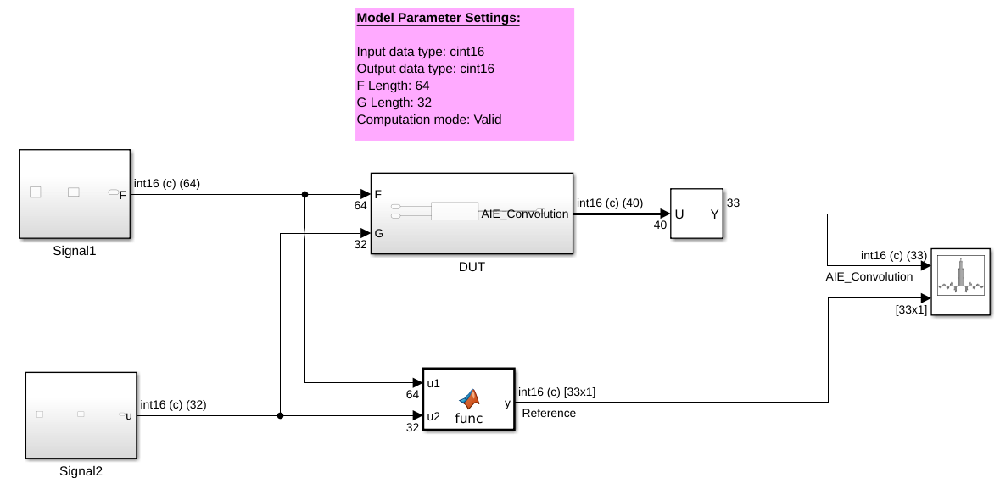

# Convolution

  
  

## Library

AI Engine/DSP/Buffer IO

## Description

This block implements the Convolution algorithm targeted for
AI Engines.

## Parameters

### Main  

#### 

### Constraints
Click on the button given here to access the constraint manager and add or update constraints for each kernel. If you set the "Number of cascade stages" parameter to a value greater than one, multiple kernels will be used to process the input. You can use the constraint manager to optimize the performance of your design by setting specific constraints for each kernel (in this case, you need to first run your design). Adding constraints will not affect the functional simulation in Simulink. Constraints will only affect the generated graph code, cycle approximate AIE simulation (System C), and behavior in hardware.

If you are using non-default constraints for any of the kernels for the block, an asterisk (*) will be displayed next to the button.

## Examples

***Click on the images below to open each model.***

## References
This block uses the Vitis DSP library implementation of Convolution. For more details on this implementation please click [here](https://docs.amd.com/r/en-US/Vitis_Libraries/dsp/user_guide/L2/func-conv-corr.html).

--------------
Copyright (C) 2025 Advanced Micro Devices, Inc.
All rights reserved.

SPDX-License-Identifier: MIT
