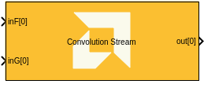
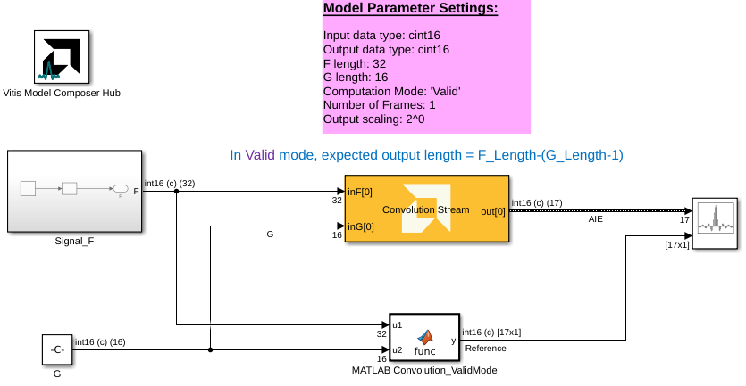

# Convolution Stream

  
  

## Library

AI Engine/DSP/Stream IO

## Description

This block implements the stream-based Convolution algorithm targeted for
AI Engines.

## Parameters

### Main  
#### F input data type
Describes the type of individual data samples of signal F to input to the function.

#### G input data type
Describes the type of individual data samples of signal G to input to the function.

#### Output data type
Describes the type of individual data samples output from the function.

#### Computation mode
Specifies the convolution computation type. Currently, only the `valid` mode is supported.

***Valid***: Produces the correlation result of length `F_length - G_length + 1`.

#### F input length
Specifies the length of the F input signal.

#### G input length
Specifies the length of the G input signal.

#### Specify G input length via input port
When enabled, allows the G input length to be specified via an input port.

#### Number of frames
Specifies the number of frames to be processed.

#### Scale output down by 2^
Specifies the power of 2 shift down applied to the output.

#### Rounding mode
Describes the selection of rounding to be applied during processing.

#### Saturation mode
Describes the selection of saturation to be applied during processing.

#### SSR
Specifies the number of parallel input/output data paths.

#### Number of cascade stages
Specifies the number of kernels to cascade in series to increase throughput.

### Constraints
Click on the button given here to access the constraint manager and add or update constraints for each kernel. If you set the "Number of cascade stages" parameter to a value greater than one, multiple kernels will be used to process the input. You can use the constraint manager to optimize the performance of your design by setting specific constraints for each kernel (in this case, you need to first run your design). Adding constraints will not affect the functional simulation in Simulink. Constraints will only affect the generated graph code, cycle approximate AIE simulation (System C), and behavior in hardware.

If you are using non-default constraints for any of the kernels for the block, an asterisk (*) will be displayed next to the button.

## Examples

***Click on the images below to open each model.***

## References
This block uses the Vitis DSP library implementation of Convolution. For more details on this implementation please click [here](https://docs.amd.com/r/en-US/Vitis_Libraries/dsp/user_guide/L2/func-conv-corr.html).

--------------
Copyright (C) 2025 Advanced Micro Devices, Inc.
All rights reserved.

SPDX-License-Identifier: MIT
