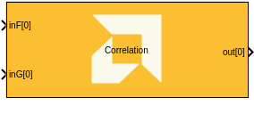
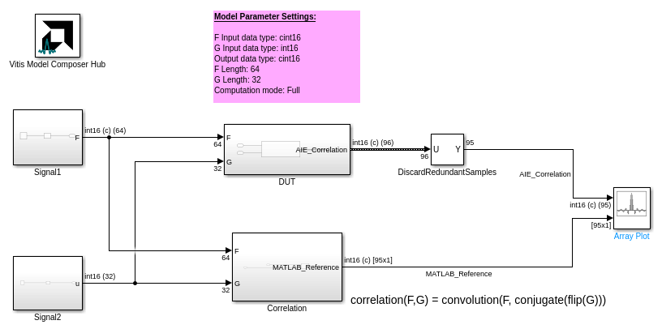
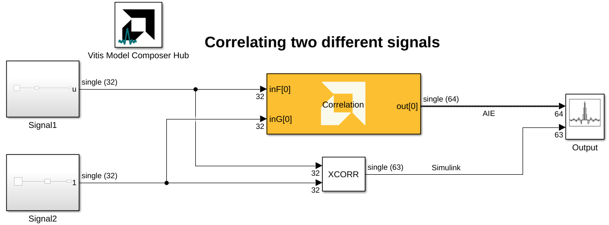
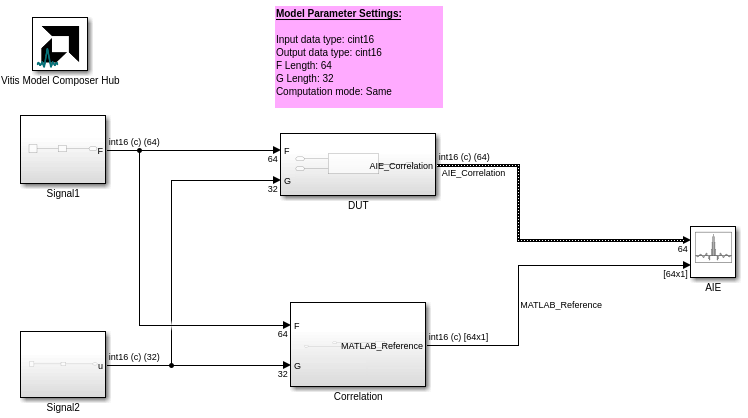
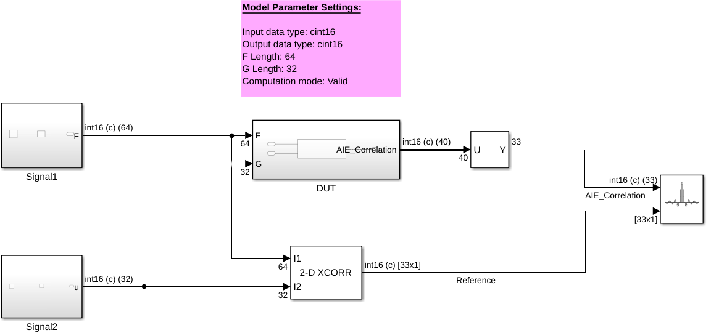

# Correlation

  
  

## Library

AI Engine/DSP/Buffer IO

## Description

This Correlation block computes the correlation between two input signals F and G using AI Engine resources.
It supports both integer and floating-point data types and provides various configuration options for scaling, rounding and computation mode.

## Parameters

### Main  
#### F input data type
Describes the type of individual data samples of signal F to input to the function.

This must be one of the following:
* `int16`, `int32`, `cint16`, `cint32`, `cfloat`, and `float` for AIE
* `int8`, `int16`, `int32`, `cint16`, `cint32`, `float`, and `bfloat16`  for AIE-ML and AIE-MLv2

#### G input data type
Describes the type of individual data samples of signal G to input to the function.

This must be one of the following:
* `int16`, `int32`, `cint16`, `cfloat`, and `float` for AIE
* `int8`, `int16`, `int32`, `cint16`, `float`, and `bfloat16`  for AIE-ML and AIE-MLv2

#### Output data type
Describes the type of individual data samples output from the function.

This must be one of the following:
* `int16`, `int32`, `cint16`, `cint32`, `cfloat`, and `float` for AIE
* `int16`, `int32`, `cint16`, `cint32`, and `float` for AIE-ML and AIE-MLv2

> For a list of valid combinations of **F input data type**, **G input data type**, and **Output data type**, refer to the [Vitis Libraries documentation](https://docs.amd.com/r/en-US/Vitis_Libraries/dsp/user_guide/L2/func-conv-corr.html_2).

#### Computation mode

Specifies the convolution computation type.
Options include:

* ***Full (0)***: Produces the full convolution result of length `F_length + G_length - 1`.

* ***Same (1)***: Produces the convolution result of length `max(F_length, G_length)`.

* ***Valid (2)***: Produces the convolution result of length `F_length - G_length + 1`, zero-padded up to the nearest multiple of 256 bits (the number of samples will vary with data type).

#### F input length
Specifies the length of the F input signal.

#### G input length
Specifies the length of the G input signal.

<!--
#### Specify G input length via input port
When enabled, allows the G input length to be specified via an [asynchronous Run Time Parameter (RTP)](https://github.com/Xilinx/Vitis_Model_Composer/blob/2025.2/Examples/AIENGINE/Run_Time_Parameters/rtp_vector_async) input port.

The exposed RTP expects an `int32` vector of length 2. This vector contains values for the F length and G length. Currently the first element of the vector (`rtpVecLen[0]`) is ignored. The second element of the vector (`rtpVecLen[1]`) is used to specify the G length.

The input length specified at runtime cannot exceed the input length specified in the block parameters. For example, if **G input length** is set to 32, you can set `rtpVecLen[1]` to 16 but not 64. This will not produce an error at runtime, but the block results will be incorrect.
-->

#### Number of frames
Specifies the number of frames to be processed.

#### Scale output down by 2^
Describes the number of bits to downshift the output values.

#### Rounding mode
Describes the selection of rounding to be applied during the shift down stage of processing.

The following modes are available:
* **Floor:** Truncate LSB, always round down (towards negative infinity).
* **Ceiling:** Always round up (towards positive infinity).
* **Round to positive infinity:** Round halfway towards positive infinity.
* **Round to negative infinity:** Round halfway towards negative infinity.
* **Round symmetrical to infinity:** Round halfway towards infinity (away from zero).
* **Round symmetrical to zero:** Round halfway towards zero (away from infinity).
* **Round convergent to even:** Round halfway towards nearest even number.
* **Round convergent to odd:** Round halfway towards nearest odd number.

No rounding is performed on the **Floor** or **Ceiling** modes. Other modes round to the nearest integer. They differ only in how they round for values that are exactly between two integers.

#### Saturation mode
Describes the selection of saturation to be applied during the shift down stage of processing.

The following modes are available:
* **None:** No saturation is performed and the value is truncated on the MSB side.
* **Asymmetric:** Rounds an n-bit signed value in the range `-2^(n-1)` to `2^(n-1)-1`.
* **Symmetric:** Rounds an n-bit signed value in the range `-2^(n-1)-1` to `2^(n-1)-1`.

### Constraints
Click on the button given here to access the constraint manager and add or update constraints for each kernel. If you set the "Number of cascade stages" parameter to a value greater than one, multiple kernels will be used to process the input. You can use the constraint manager to optimize the performance of your design by setting specific constraints for each kernel (in this case, you need to first run your design). Adding constraints will not affect the functional simulation in Simulink. Constraints will only affect the generated graph code, cycle approximate AIE simulation (System C), and behavior in hardware.

If you are using non-default constraints for any of the kernels for the block, an asterisk (*) will be displayed next to the button.

## Examples

***Click on the images below to open each model.***

## References
This block uses the Vitis DSP library implementation of Correlation. For more details on this implementation please click [here](https://docs.amd.com/r/en-US/Vitis_Libraries/dsp/user_guide/L2/func-conv-corr.html).

--------------
Copyright (C) 2025 Advanced Micro Devices, Inc.
All rights reserved.

SPDX-License-Identifier: MIT
