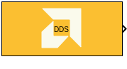
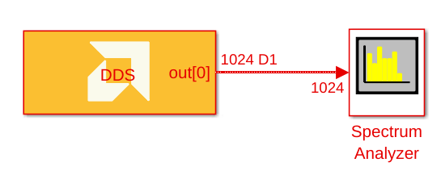
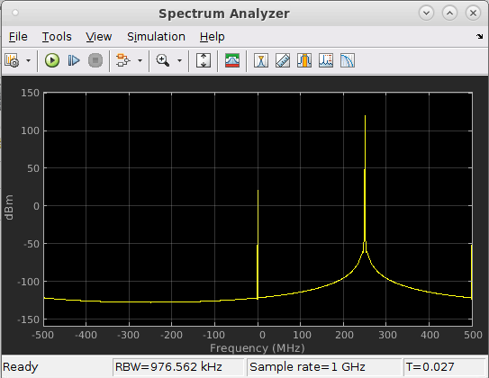
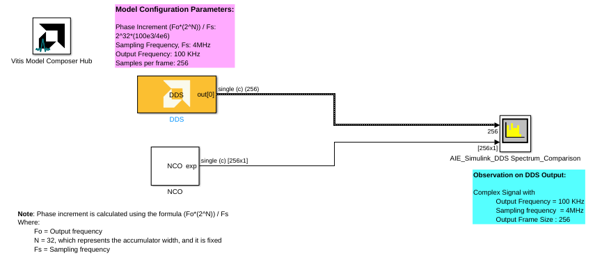
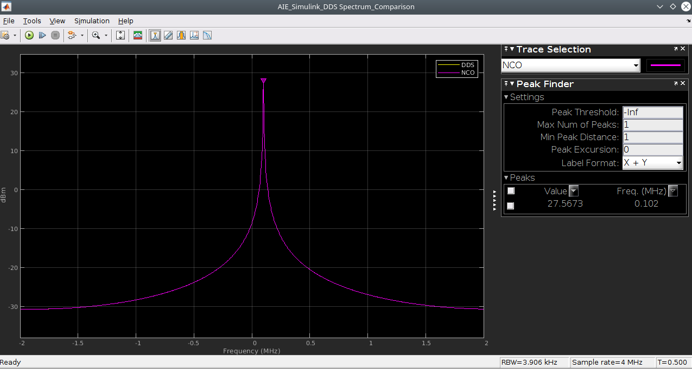
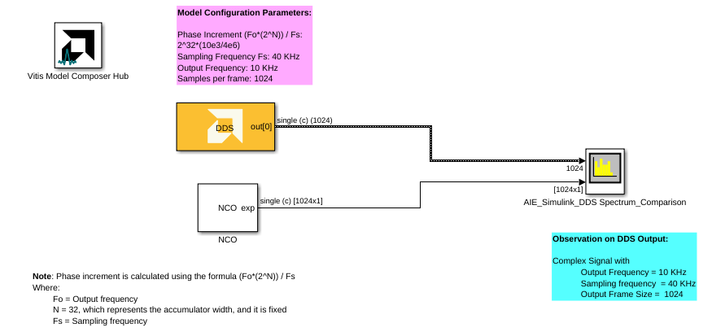
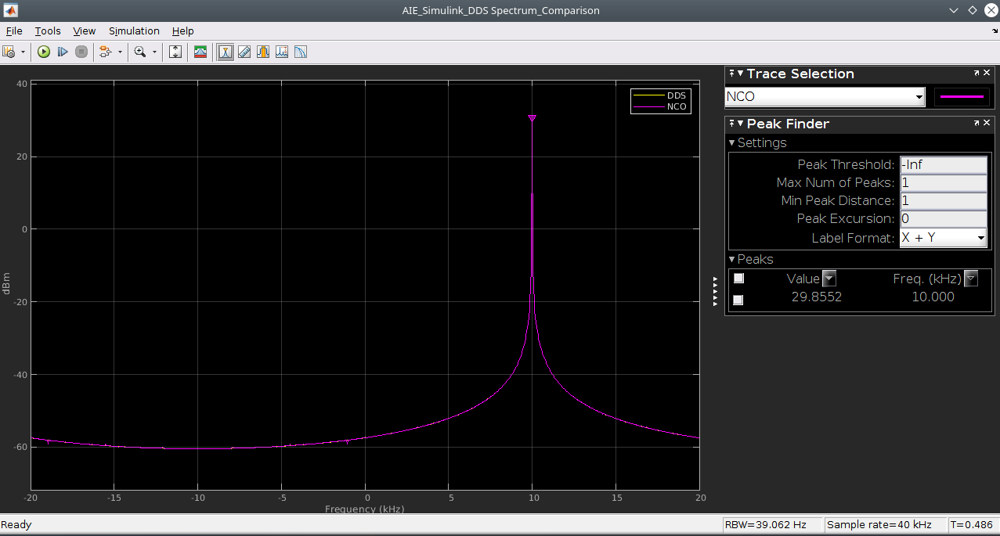

# DDS

  
  

## Library

AI Engine/DSP/Buffer IO

## Description

This block implements the Direct Digital Synthesizer (DDS) targeted for
AI Engines and uses buffer interface.

## Parameters

### Main  
#### Output data type  
Sets the output data type.

#### Samples per frame  
Specifies the number of samples in the output frame. The value must be in the range of 8 to 1024 and the default value is 32.

Increasing the number of samples per frame increases the output throughput.

#### Phase increment  
Specifies the phase increment between samples. The value must be in the
range 0 to 2^31 and the default value is 0.

  Phase increment is calculated using the formula (Fo\*(2^N)) / Fs

  Where:
  - Fo = Output frequency
  - N = 32, which represents the accumulator width, and it is fixed
  - Fs = Sampling frequency

For example, for a sampling frequency of 1 Gsps and output frequency of 100 MHz, the Phase Increment should be 2^32/10.

#### Sample time  
Specifies the sample time for the output signal.

The propagated block sample time in Simulink is equal to "Sample time" multipled by "Samples per frame".

### Constraints
Click on the button given here to access the constraint manager and add or update constraints for each kernel. If you set the "Number of cascade stages" parameter to a value greater than one, multiple kernels will be used to process the input. You can use the constraint manager to optimize the performance of your design by setting specific constraints for each kernel (in this case, you need to first run your design). Adding constraints will not affect the functional simulation in Simulink. Constraints will only affect the generated graph code, cycle approximate AIE simulation (System C), and behavior in hardware.

If you are using non-default constraints for any of the kernels for the block, an asterisk (*) will be displayed next to the button.

## Example
Assume you need the DDS to generate a frequnecy of 250 MHz at 1Gsps. Here is how you set the parameters:
* Output data type: cint16
* Samples per frame : 1024
* Phase increment: 2^30 = 250e6*2^32/1e9
* Sample time = 1e-9

**DDS Block Example2:**

**AIE and Simulink DDS output spectrum comparison:**

**DDS Block Example3:**

**AIE and Simulink DDS output spectrum comparison:**

## Related blocks
[DDS Stream](../DDS_Stream/README.md) is another DDS block that uses stream interface instead of buffer interface and is also SSR capable.

## References
This block uses the Vitis DSP library implementation of DDS. For more details on this implementation please click [here](https://docs.xilinx.com/r/en-US/Vitis_Libraries/dsp/user_guide/L2/func-dds.html).
