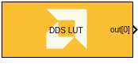

# DDS LUT

  

## Library

AI Engine/DSP/Buffer IO

## Description

This block implements the Direct Digital Synthesizer (DDS) targeted for
AI Engines and uses buffer interface.

## Parameters

### Main  
#### Output data type  
Sets the output data type.

#### SFDR
Specifies the Spurious Free Dynamic Range (in dB) of the output signal. The maximum theoretical SFDR is 96 dB for `cint16`, 180 dB for `cint32`, and 138 dB for `cfloat`.

#### Samples per frame  
Specifies the number of samples in the output frame. This must be a multiple of 'N' in each data loop.
The value of 'N' varies based on the AIE architecture and data type are given in the below table:

|        | AIE | AIE-ML |
| ------ | --- | ------ |
| `cint16` | 64  | 64    |
| `cint32` | 16  | 64    |
| `cfloat` | 4   | N/A   |

#### Reload initial phase via input port
Allows the intial phase to be reloaded during simulation via an input port.

#### Phase increment  
Specifies the phase increment between samples. The value must be in the
range 0 to 2^31 and the default value is 0.

  Phase increment is calculated using the formula `(Fo*(2^N))/Fs`.

  Where:
  - Fo = Output frequency
  - N = 32, which represents the accumulator width, and it is fixed
  - Fs = Sampling frequency

For example, for a sampling frequency of 1 Gsps and output frequency of 100 MHz, the Phase Increment should be `2^32/10`.

#### Initial phase offset
Specifies the initial value of the phase accumulator.

#### Rounding mode

Describes the selection of rounding to be applied during the shift down stage of processing.

The following modes are available:
* **Floor:** Truncate LSB, always round down (towards negative infinity).
* **Ceiling:** Always round up (towards positive infinity).
* **Round to positive infinity:** Round halfway towards positive infinity.
* **Round to negative infinity:** Round halfway towards negative infinity.
* **Round symmetrical to infinity:** Round halfway towards infinity (away from zero).
* **Round symmetrical to zero:** Round halfway towards zero (away from infinity).
* **Round convergent to even:** Round halfway towards nearest even number.
* **Round convergent to odd:** Round halfway towards nearest odd number.

No rounding is performed on the **Floor** or **Ceiling** modes. Other modes round to the nearest integer. They differ only in how they round for values that are exactly between two integers.

#### Saturation mode

Describes the selection of saturation to be applied during the shift down stage of processing.

The following modes are available:
* **None:** No saturation is performed and the value is truncated on the MSB side.
* **Asymmetric:** Rounds an n-bit signed value in the range `-2^(n-1)` to `2^(n-1)-1`.
* **Symmetric:** Rounds an n-bit signed value in the range `-2^(n-1)-1` to `2^(n-1)-1`.

#### Sample time  
Specifies the sample time for the output signal.

The propagated block sample time in Simulink is equal to "Sample time" multipled by "Samples per frame".

## Examples

***Click on the images below to open each model.***

## Related blocks
[DDS](../DDS/README.md)

## References
This block uses the Vitis DSP library implementation of DDS. For more details on this implementation please click [here](https://docs.xilinx.com/r/en-US/Vitis_Libraries/dsp/user_guide/L2/func-dds.html).

--------------
Copyright (C) 2024 Advanced Micro Devices, Inc.
All rights reserved.

SPDX-License-Identifier: MIT
