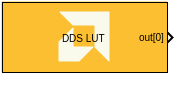

<!-- Library: aieDSP -->

# DDS LUT

  

## Library

AI Engine/DSP/Buffer IO

## Description

This block implements the Direct Digital Synthesizer (DDS) targeted for
AI Engines and uses buffer interface.

## Parameters

### Main  
#### Output data type  
Sets the output data type.

#### SFDR
Specifies the Spurious Free Dynamic Range (in dB) of the output signal. The maximum theoretical SFDR is 96 dB for `cint16`, 180 dB for `cint32`, and 138 dB for `cfloat`.

#### Support output columns based on SSR number
When enabled, the block will output a matrix with the number of columns equal to the SSR number.

#### SSR
This parameter specifies the number of output ports. The number of AI Engine kernels used is equal to the value of SSR parameter.

#### Samples per frame  
Specifies the number of samples in the output frame. This must be a multiple of 'N' in each data loop.
The value of 'N' varies based on the AIE architecture and data type is given in the below table:

|        | AIE | AIE-ML |
| ------ | --- | ------ |
| `cint16` | 64  | 64    |
| `cint32` | 16  | 64    |
| `cfloat` | 4   | N/A   |

#### Initial phase offset
Specifies the initial value of the phase accumulator.

#### Reload initial phase via input port
Allows the initial phase to be reloaded during simulation via an input port. By default the reload port is a Real-Time Parameter (RTP) port that is non-blocking (async).

#### Use iobuffer port for phase offset reload
Reload the phase offset using an iobuffer port, instead of a Real-Time Parameter (RTP) port. The iobuffer port is a blocking (sync) port, whereas the RTP port is a non-blocking (async) port. 

#### Phase increment  
Specifies the phase increment between samples. The value must be in the
range 0 to 2^31 and the default value is 0.

  Phase increment is calculated using the formula `(Fo*(2^N))/Fs`.

  Where:
  - Fo = Output frequency
  - N = 32, which represents the accumulator width, and it is fixed
  - Fs = Sampling frequency

For example, for a sampling frequency of 1 Gsps and output frequency of 100 MHz, the Phase Increment should be `2^32/10`.

#### Reload phase increment via input port
Allows the phase increment to be reloaded during simulation via an input port.

#### Rounding mode

Describes the selection of rounding to be applied during the shift down stage of processing.

The following modes are available:
* **Floor:** Truncate LSB, always round down (towards negative infinity).
* **Ceiling:** Always round up (towards positive infinity).
* **Round to positive infinity:** Round halfway towards positive infinity.
* **Round to negative infinity:** Round halfway towards negative infinity.
* **Round symmetrical to infinity:** Round halfway towards infinity (away from zero).
* **Round symmetrical to zero:** Round halfway towards zero (away from infinity).
* **Round convergent to even:** Round halfway towards nearest even number.
* **Round convergent to odd:** Round halfway towards nearest odd number.

No rounding is performed on the **Floor** or **Ceiling** modes. Other modes round to the nearest integer. They differ only in how they round for values that are exactly between two integers.

#### Saturation mode

Describes the selection of saturation to be applied during the shift down stage of processing.

The following modes are available:
* **None:** No saturation is performed and the value is truncated on the MSB side.
* **Asymmetric:** Rounds an n-bit signed value in the range `-2^(n-1)` to `2^(n-1)-1`.
* **Symmetric:** Rounds an n-bit signed value in the range `-2^(n-1)-1` to `2^(n-1)-1`.

#### Sample time  
Specifies the sample time for the output signal.

The propagated block sample time in Simulink is equal to "Sample time" multipled by "Samples per frame".

## Examples

***Click on the images below to open each model.***

<!--
DESCRIPTION:
Model: DDS_LUT_Ex1
Generated: 09-Jan-2026 13:42:14

Vitis Model Composer Configuration:
  Target Device: xcvc1502-vsva1596-2HP-i-S

Vitis Model Composer Blocks:
  - AIE: DDS LUT
  - AIE: To Fixed Size
  - HDL: Copyright

Description:
This MATLAB script creates a Vitis Model Composer Simulink model that uses the AI Engine DDS LUT block. 

-->

<!--
MATLAB CREATION SCRIPT:

% create_DDS_LUT_Ex1_model.m
% Auto-generated script to recreate the DDS_LUT_Ex1 Simulink model
% Generated on: 09-Jan-2026 13:42:14

%% Model Configuration
modelName = 'DDS_LUT_Ex1_recreated';

%% Create New Model
if bdIsLoaded(modelName)
    close_system(modelName, 0);
end

new_system(modelName);
open_system(modelName);
fprintf('Created new model: %s\n', modelName);

%% Add Vitis Model Composer Hub Block
hubBlockPath = [modelName '/Vitis Model Composer Hub'];
add_block('vmcUtilities/Vitis Model Composer Hub', hubBlockPath, ...
    'Position', [-343 -37 -288 16]);

hubBlk = xmcFindHubBlock(modelName);
vmchub_set_param(hubBlk, modelName, 'SelectHardware', 'xcvc1502-vsva1596-2HP-i-S');

%% Add Top-Level Blocks
add_block('hdlUtilities/Copyright', [modelName '/Copyright'], ...
    'Position', [462 -59 651 29]);
set_param([modelName '/Copyright'], ...
    'copyrighttext', '(c) Copyright 1995-2022 Xilinx, Inc.  (c) Copyright 2022-2026 Advanced Micro Devices, Inc. All rights reserved.  This document  contains proprietary, confidential information that may be used, copied and/or disclosed only as authorized by a valid licensing agreement with Advanced Micro Devices, Inc. This copyright notice must be retained on all authorized copies.   This code is provided "as is". Advanced Micro Devices, Inc. makes, and the end user receives, no warranties or conditions, express, implied, statutory or otherwise, and Advanced Micro Devices, Inc. specifically disclaims any implied warranties of merchantability,  non-infringement, or fitness for a particular purpose. ', ...
    'block_type', 'copyright', ...
    'sg_icon_stat', '199,98,-1,-1,beige,white,0,0,right,', ...
    'sg_mask_display', 'fprintf('''',''COMMENT: begin icon graphics''); patch([0 200 200 0 0 ],[0 0 100 100 0 ],[1 1 1 ]); plot([0 200 200 0 0 ],[0 0 100 100 0 ]); patch([68.85 89.08 103.08 117.08 131.08 103.08 82.85 68.85 ],[65.54 65.54 79.54 65.54 79.54 79.54 79.54 65.54 ],[0.951 0.944 0.902 ]); patch([82.85 103.08 89.08 68.85 82.85 ],[51.54 51.54 65.54 65.54 51.54 ],[0.93 0.92 0.86 ]); patch([68.85 89.08 103.08 82.85 68.85 ],[37.54 37.54 51.54 51.54 37.54 ],[0.951 0.944 0.902 ]); patch([82.85 131.08 117.08 103.08 89.08 68.85 82.85 ],[23.54 23.54 37.54 23.54 37.54 37.54 23.54 ],[0.93 0.92 0.86 ]); fprintf('''',''COMMENT: end icon graphics''); fprintf('''',''COMMENT: begin icon text''); fprintf('''',''COMMENT: end icon text'');disp([''{\fontsize{12pt}(c) Copyright 1995-'' datestr(now, ''yyyy'') '' Xilinx, Inc.}\newline \newline ''],''texmode'',''on''); disp(''{\fontsize{12pt}#-- All rights reserved.}'',''texmode'',''on''); disp(''\newline \newline \newline \newline{\fontsize{12pt}Double Click for Copyright Notice}'',''texmode'',''on''); ');
add_block('aieDSP/DDS LUT', [modelName '/DDS LUT'], ...
    'Position', [-125 88 5 157]);
set_param([modelName '/DDS LUT'], ...
    'data_type', 'cfloat', ...
    'sfdr', '80', ...
    'vmc_ssr_inherit', 'off', ...
    'ssr', '2', ...
    'output_window_size', '1024', ...
    'initial_phase_offset', '0', ...
    'USE_PHASE_RELOAD', 'off', ...
    'PHASE_RELOAD_API', 'off', ...
    'phase_increment', '4.2950e+08', ...
    'phase_increment_reload', 'off', ...
    'rnd_mode', 'Floor', ...
    'sat_mode', '0-None', ...
    'vmc_sample_time', '1/(1e6/2)', ...
    'TP_API', '0', ...
    'MIXER_MODE', '0');
add_block('dspsigops/NCO', [modelName '/NCO'], ...
    'Position', [-95 217 -25 273]);
set_param([modelName '/NCO'], ...
    'AccIncSrc', 'Specify via dialog', ...
    'AccInc', '4.2950e+08', ...
    'PhaseOffsetSrc', 'Specify via dialog', ...
    'PhaseOffset', '0', ...
    'AccumWL', '32', ...
    'HasDither', 'off', ...
    'DitherWL', '4', ...
    'PNgeneratorLength', '19', ...
    'HasPhaseQuantizer', 'on', ...
    'TableDepth', '16', ...
    'HasOutputPhaseError', 'off', ...
    'Formula', 'Complex exponential', ...
    'DataType', 'single', ...
    'OutputWL', '16', ...
    'OutputFL', '15', ...
    'CompMethod', 'Table lookup (no interpolation)', ...
    'SampleTime', '1/1e6', ...
    'SamplesPerFrame', '1024', ...
    'OutputFrames', 'off');
add_block('built-in/SpectrumAnalyzer', [modelName '/Spectrum Analyzer'], ...
    'Position', [420 112 465 163]);
set_param([modelName '/Spectrum Analyzer'], ...
    'NumInputPorts', '2', ...
    'OpenAtSimulationStart', 'on', ...
    'WindowPosition', '[1.000000,1.000000,1280.000000,744.000000,]', ...
    'InputDomain', 'Time', ...
    'SpectrumType', 'Power', ...
    'ViewType', 'Spectrum', ...
    'Method', 'Filter bank', ...
    'SampleRateSource', 'Inherited', ...
    'SampleRate', '10000', ...
    'PlotAsTwoSidedSpectrum', 'on', ...
    'FrequencyScale', 'Linear', ...
    'PlotType', 'Line', ...
    'AxesScaling', 'Auto', ...
    'AxesScalingNumUpdates', '100', ...
    'FrequencyResolutionMethod', 'RBW', ...
    'RBWSource', 'Auto', ...
    'RBW', '9.76', ...
    'WindowInvariantSamplesPerUpdate', 'off', ...
    'WindowLength', '1024', ...
    'FFTLengthSource', 'Auto', ...
    'FFTLength', '1024', ...
    'FilterSharpness', '0.3', ...
    'FrequencySpan', 'Full', ...
    'Span', '10000', ...
    'CenterFrequency', '0', ...
    'StartFrequency', '-5000', ...
    'StopFrequency', '5000', ...
    'InputUnits', 'dBm', ...
    'FrequencyVectorSource', 'Auto', ...
    'FrequencyVector', '[-5000,5000]', ...
    'Window', 'Hann', ...
    'CustomWindow', 'hann', ...
    'SidelobeAttenuation', '60', ...
    'OverlapPercent', '0', ...
    'AveragingMethod', 'VBW', ...
    'SpectralAverages', '1', ...
    'ForgettingFactor', '0.9', ...
    'VBWSource', 'Auto', ...
    'VBW', '9.76', ...
    'SpectrumUnits', 'dBm', ...
    'FullScaleSource', 'Auto', ...
    'FullScale', '1', ...
    'ReferenceLoad', '1', ...
    'FrequencyOffset', '0', ...
    'SpectrogramChannel', '1', ...
    'TimeResolutionSource', 'Auto', ...
    'TimeResolution', '1e-3', ...
    'TimeSpanSource', 'Auto', ...
    'TimeSpan', '0.1', ...
    'MaximizeAxes', 'Auto', ...
    'PlotNormalTrace', 'on', ...
    'PlotMaxHoldTrace', 'off', ...
    'PlotMinHoldTrace', 'off', ...
    'YLimits', '[-37.91126897,34.84558591]', ...
    'ColorLimits', '[-80,20]', ...
    'Colormap', 'jet', ...
    'ShowGrid', 'on', ...
    'ShowLegend', 'on', ...
    'ShowColorbar', 'on', ...
    'ChannelNames', '[]', ...
    'AxesLayout', 'Vertical');
add_block('vmcUtilities/Vitis Model Composer Hub', [modelName '/Vitis Model Composer Hub'], ...
    'Position', [-343 -37 -288 16]);
set_param([modelName '/Vitis Model Composer Hub'], ...
    'CodeGeneration', 'off', ...
    'StartColumn', '1', ...
    'NumberOfColumns', '1', ...
    'TargetDirectory', './code', ...
    'exportDesign', 'off', ...
    'analyzeDesign', 'off', ...
    'validateDesignOnHw', 'off', ...
    'ExportType', 'AI Engines', ...
    'IpVendor', 'xilinx.com', ...
    'IpLibrary', 'hls', ...
    'IpVersion', '1.0', ...
    'IpHWLanguage', 'Verilog', ...
    'AieCompilerOptions', '{}', ...
    'CreateTestbench', 'off', ...
    'TestbenchStackSize', '10', ...
    'RunRtlSim', 'off', ...
    'RunCSim', 'off', ...
    'RunAieSim', 'off', ...
    'AieSimTimeout', '50000', ...
    'RunAieSimProfiling', 'off', ...
    'LaunchVitisAnalyzer', 'off', ...
    'PlotOutput', 'off', ...
    'GenHwImage', 'off', ...
    'GenLibadfXo', 'off', ...
    'GenHwValidationCode', 'off', ...
    'PlatformType', 'Not Specified', ...
    'HwSystemType', 'Baremetal', ...
    'HwValidationTarget', 'hw', ...
    'ProjDevice', 'xcvc1502-vsva1596-2HP-i-S', ...
    'SamplePeriod', '-1', ...
    'ClockFrequency', '200', ...
    'DataPathParallelism', '1', ...
    'xilinxfamily', 'versalaicore', ...
    'part', 'xcvc1502', ...
    'speed', '-2HP-i-S', ...
    'package', 'vsva1596', ...
    'directory', './netlist', ...
    'testbench', 'off', ...
    'incr_netlist', 'off', ...
    'synthesis_tool', 'Vivado', ...
    'clock_wrapper', 'Clock Enables', ...
    'dbl_ovrd', 'According to Block Masks', ...
    'dcm_input_clock_period', '10', ...
    'sysclk_period', '10', ...
    'simulink_period', '1', ...
    'eval_field', '0', ...
    'LogFileName', '''''', ...
    'NThreads', '4');

%% Create Merging Subsystem
add_block('built-in/SubSystem', [modelName '/Merging'], ...
    'Position', [100 86 245 159]);

% Remove default blocks
defaultBlocks = find_system([modelName '/Merging'], 'SearchDepth', 1, 'Type', 'block');
for i = 1:length(defaultBlocks)
    if ~strcmp(defaultBlocks{i}, [modelName '/Merging'])
        delete_block(defaultBlocks{i});
    end
end

add_block('built-in/Inport', [[modelName '/Merging'] '/In1'], ...
    'Position', [30 43 60 57]);
set_param([[modelName '/Merging'] '/In1'], ...
    'Port', '1', ...
    'IconDisplay', 'Port number', ...
    'OutputFunctionCall', 'off', ...
    'OutMin', '[]', ...
    'OutMax', '[]', ...
    'OutDataTypeStr', 'Inherit: auto', ...
    'LockScale', 'off', ...
    'BusOutputAsStruct', 'off', ...
    'BusVirtuality', 'inherit', ...
    'Unit', 'inherit', ...
    'PortDimensions', '-1', ...
    'VarSizeSig', 'Inherit', ...
    'SampleTime', '-1', ...
    'SignalType', 'auto', ...
    'LatchByDelayingOutsideSignal', 'off', ...
    'LatchInputForFeedbackSignals', 'off', ...
    'Interpolate', 'on', ...
    'DataMode', 'inherit', ...
    'MessageQueueUseDefaultAttributes', 'on', ...
    'MessageQueueCapacity', '1', ...
    'MessageQueueType', 'LIFO', ...
    'MessageQueueOverwriting', 'on');
add_block('built-in/Inport', [[modelName '/Merging'] '/In2'], ...
    'Position', [30 133 60 147]);
set_param([[modelName '/Merging'] '/In2'], ...
    'Port', '2', ...
    'IconDisplay', 'Port number', ...
    'OutputFunctionCall', 'off', ...
    'OutMin', '[]', ...
    'OutMax', '[]', ...
    'OutDataTypeStr', 'Inherit: auto', ...
    'LockScale', 'off', ...
    'BusOutputAsStruct', 'off', ...
    'BusVirtuality', 'inherit', ...
    'Unit', 'inherit', ...
    'PortDimensions', '-1', ...
    'VarSizeSig', 'Inherit', ...
    'SampleTime', '-1', ...
    'SignalType', 'auto', ...
    'LatchByDelayingOutsideSignal', 'off', ...
    'LatchInputForFeedbackSignals', 'off', ...
    'Interpolate', 'on', ...
    'DataMode', 'inherit', ...
    'MessageQueueUseDefaultAttributes', 'on', ...
    'MessageQueueCapacity', '1', ...
    'MessageQueueType', 'LIFO', ...
    'MessageQueueOverwriting', 'on');
add_block('built-in/Mux', [[modelName '/Merging'] '/Mux'], ...
    'Position', [485 96 490 134]);
set_param([[modelName '/Merging'] '/Mux'], ...
    'Inputs', '2', ...
    'DisplayOption', 'bar');
add_block('built-in/Reshape', [[modelName '/Merging'] '/Reshape'], ...
    'Position', [585 103 615 127]);
set_param([[modelName '/Merging'] '/Reshape'], ...
    'OutputDimensionality', 'Customize', ...
    'OutputDimensions', '[512, 2]');
add_block('built-in/Reshape', [[modelName '/Merging'] '/Reshape1'], ...
    'Position', [845 103 875 127]);
set_param([[modelName '/Merging'] '/Reshape1'], ...
    'OutputDimensionality', '1-D array', ...
    'OutputDimensions', '[1, 10]');
add_block('built-in/Terminator', [[modelName '/Merging'] '/Terminator'], ...
    'Position', [345 55 365 75]);
add_block('built-in/Terminator', [[modelName '/Merging'] '/Terminator1'], ...
    'Position', [330 145 350 165]);
add_block('aieUtilities/To Fixed Size', [[modelName '/Merging'] '/To Fixed Size'], ...
    'Position', [175 22 290 78]);
set_param([[modelName '/Merging'] '/To Fixed Size'], ...
    'Mode', 'Produce a valid output signal', ...
    'OutputSize', 'Inherit: Same as input', ...
    'CopyMethod', 'Buffer samples to form output', ...
    'HasStatusOutput', 'on');
add_block('aieUtilities/To Fixed Size', [[modelName '/Merging'] '/To Fixed Size1'], ...
    'Position', [175 112 290 168]);
set_param([[modelName '/Merging'] '/To Fixed Size1'], ...
    'Mode', 'Produce a valid output signal', ...
    'OutputSize', 'Inherit: Same as input', ...
    'CopyMethod', 'Buffer samples to form output', ...
    'HasStatusOutput', 'on');
add_block('built-in/Math', [[modelName '/Merging'] '/Transpose'], ...
    'Position', [730 99 760 131]);
set_param([[modelName '/Merging'] '/Transpose'], ...
    'Operator', 'transpose', ...
    'AlgorithmMethod', 'Exact', ...
    'SignedPower', 'off', ...
    'OutputSignalType', 'auto', ...
    'SampleTime', '-1', ...
    'OutMin', '[]', ...
    'OutMax', '[]', ...
    'OutDataTypeStr', 'Inherit: Same as first input', ...
    'LockScale', 'off', ...
    'RndMeth', 'Floor', ...
    'SaturateOnIntegerOverflow', 'on', ...
    'IntermediateResultsDataTypeStr', 'Inherit: Inherit via internal rule', ...
    'AlgorithmType', 'Newton-Raphson', ...
    'Iterations', '3');
add_block('built-in/Outport', [[modelName '/Merging'] '/AIE_DDSOut'], ...
    'Position', [1000 108 1030 122]);
set_param([[modelName '/Merging'] '/AIE_DDSOut'], ...
    'Port', '1', ...
    'StorageClass', 'Auto', ...
    'IconDisplay', 'Port number', ...
    'OutputFunctionCall', 'off', ...
    'OutMin', '[]', ...
    'OutMax', '[]', ...
    'OutDataTypeStr', 'Inherit: auto', ...
    'LockScale', 'off', ...
    'BusOutputAsStruct', 'off', ...
    'BusVirtuality', 'inherit', ...
    'DataMode', 'inherit', ...
    'Unit', 'inherit', ...
    'PortDimensions', '-1', ...
    'VarSizeSig', 'Inherit', ...
    'SampleTime', '-1', ...
    'SignalType', 'auto', ...
    'EnsureOutportIsVirtual', 'off', ...
    'OutputWhenDisabled', 'held', ...
    'InitialOutput', '[]', ...
    'MustResolveToSignalObject', 'off', ...
    'OutputWhenUnConnected', 'off', ...
    'OutputWhenUnconnectedValue', '0', ...
    'VectorParamsAs1DForOutWhenUnconnected', 'on');

% Connect blocks in Merging
add_line([modelName '/Merging'], 'In1/2', 'To Fixed Size/2', 'autorouting', 'on');
add_line([modelName '/Merging'], 'Reshape1/2', 'AIE_DDSOut/2', 'autorouting', 'on');
add_line([modelName '/Merging'], 'Mux/2', 'Reshape/2', 'autorouting', 'on');
add_line([modelName '/Merging'], 'To Fixed Size/2', 'Mux/2', 'autorouting', 'on');
add_line([modelName '/Merging'], 'Transpose/2', 'Reshape1/2', 'autorouting', 'on');
add_line([modelName '/Merging'], 'To Fixed Size/3', 'Terminator/2', 'autorouting', 'on');
add_line([modelName '/Merging'], 'In2/2', 'To Fixed Size1/2', 'autorouting', 'on');
add_line([modelName '/Merging'], 'To Fixed Size1/2', 'Mux/3', 'autorouting', 'on');
add_line([modelName '/Merging'], 'To Fixed Size1/3', 'Terminator1/2', 'autorouting', 'on');
add_line([modelName '/Merging'], 'Reshape/2', 'Transpose/2', 'autorouting', 'on');

%% Connect Top-Level Blocks
add_line(modelName, 'Merging/2', 'Spectrum Analyzer/2', 'autorouting', 'on');
add_line(modelName, 'DDS LUT/3', 'Merging/3', 'autorouting', 'on');
add_line(modelName, 'DDS LUT/2', 'Merging/2', 'autorouting', 'on');
add_line(modelName, 'NCO/2', 'Spectrum Analyzer/3', 'autorouting', 'on');

%% Save Model
save_system(modelName);
fprintf('\nModel saved: %s.slx\n', modelName);
-->

## Related blocks
[DDS](../DDS/README.md)

## References
This block uses the Vitis DSP library implementation of DDS LUT. For more details on this implementation please click [here](https://docs.xilinx.com/r/en-US/Vitis_Libraries/dsp/user_guide/L2/func-dds_mixer_lut.html).

--------------
Copyright (C) 2025 Advanced Micro Devices, Inc.
All rights reserved.

SPDX-License-Identifier: MIT
