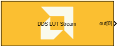

<!-- Library: aieDSP -->

# DDS LUT Stream

  

## Library

AI Engine/DSP/Buffer IO

## Description

This block implements the Direct Digital Synthesizer (DDS) targeted for
AI Engines and uses buffer interface.

## Parameters

### Main  
#### Output data type  
Sets the output data type.

#### SFDR
Specifies the Spurious Free Dynamic Range (in dB) of the output signal. The maximum theoretical SFDR is 96 dB for `cint16`, 180 dB for `cint32`, and 138 dB for `cfloat`.

#### Support output columns based on SSR number
When enabled, the block will output a matrix with the number of columns equal to the SSR number.

#### SSR
This parameter specifies the number of output ports. The number of AI Engine kernels used is equal to the value of SSR parameter.

#### Samples per frame  
Specifies the number of samples in the output frame. This must be a multiple of 'N' in each data loop.
The value of 'N' varies based on the AIE architecture and data type is given in the below table:

|        | AIE | AIE-ML |
| ------ | --- | ------ |
| `cint16` | 64  | 64    |
| `cint32` | 16  | 64     |
| `cfloat` | 4   | N/A    |

#### Initial phase offset
Specifies the initial value of the phase accumulator.

#### Reload initial phase via input port
Allows the initial phase to be reloaded during simulation via an input port. By default the reload port is a Real-Time Parameter (RTP) port that is non-blocking (async).

#### Use iobuffer port for phase offset reload
Reload the phase offset using an iobuffer port, instead of a Real-Time Parameter (RTP) port. The iobuffer port is a blocking (sync) port, whereas the RTP port is a non-blocking (async) port. 

#### Phase increment  
Specifies the phase increment between samples. The value must be in the
range 0 to 2^31 and the default value is 0.

  Phase increment is calculated using the formula `(Fo*(2^N))/Fs`.

  Where:
  - Fo = Output frequency
  - N = 32, which represents the accumulator width, and it is fixed
  - Fs = Sampling frequency

For example, for a sampling frequency of 1 Gsps and output frequency of 100 MHz, the Phase Increment should be `2^32/10`.

#### Reload phase increment via input port
Allows the phase increment to be reloaded during simulation via an input port.

#### Rounding mode

Describes the selection of rounding to be applied during the shift down stage of processing.

The following modes are available:
* **Floor:** Truncate LSB, always round down (towards negative infinity).
* **Ceiling:** Always round up (towards positive infinity).
* **Round to positive infinity:** Round halfway towards positive infinity.
* **Round to negative infinity:** Round halfway towards negative infinity.
* **Round symmetrical to infinity:** Round halfway towards infinity (away from zero).
* **Round symmetrical to zero:** Round halfway towards zero (away from infinity).
* **Round convergent to even:** Round halfway towards nearest even number.
* **Round convergent to odd:** Round halfway towards nearest odd number.

No rounding is performed on the **Floor** or **Ceiling** modes. Other modes round to the nearest integer. They differ only in how they round for values that are exactly between two integers.

#### Saturation mode

Describes the selection of saturation to be applied during the shift down stage of processing.

The following modes are available:
* **None:** No saturation is performed and the value is truncated on the MSB side.
* **Asymmetric:** Rounds an n-bit signed value in the range `-2^(n-1)` to `2^(n-1)-1`.
* **Symmetric:** Rounds an n-bit signed value in the range `-2^(n-1)-1` to `2^(n-1)-1`.

#### Sample time  
Specifies the sample time for the output signal.

The propagated block sample time in Simulink is equal to "Sample time" multipled by "Samples per frame".

## Examples

***Click on the images below to open each model.***

<!--
DESCRIPTION:
Model: DDS_LUT_Stream_Ex1
Generated: 13-Jan-2026 15:36:53

Vitis Model Composer Configuration:
  Target Device: xcvc1502-vsva1596-2HP-i-S

Vitis Model Composer Blocks:
  - AIE: DDS LUT Stream
  - AIE: To Fixed Size
  - HDL: Copyright

Model Annotations:
  p, li { white-space: pre-wrap; }
  Observation on DDS LUT Stream Output:
  Complex Signal with
  Output Frequency = 100 KHz
  Sampling frequency  = 1MHz

  p, li { white-space: pre-wrap; }
  Model Configuration Parameters:
  Phase Increment (Fo*(2^N)) / Fs:   2^32*(100e3/1e6)
  Sampling Frequency Fs: 1MHz with SSR = 1
  (Set Sampling Frequency (Fs / SSR) for SSR >1)
  Output Frequency: 100 KHz
  Samples per frame: 1024
  Sample TIme Ts: 1/Fs
  SSR: 2

  p, li { white-space: pre-wrap; }
  Note: Phase increment is calculated using the formula Δθ = (Fo*(2^N)) / Fs
  Where:
  Fo = Output frequency
  N = 32, which represents the accumulator width, and it is fixed
  Fs = Sampling frequency
  Δθ = Phase Increment

Description:
This MATLAB script creates a Vitis Model Composer Simulink model that uses the AI Engine DDS LUT Stream block. 

-->

<!--
MATLAB CREATION SCRIPT:

% Quick Start: DDS_LUT_Stream_Ex1
% Essential setup focusing on critical parameters

modelName = 'DDS_LUT_Stream_Ex1';
new_system(modelName); open_system(modelName);

% Hub Block - Configure target device
add_block('vmcUtilities/Vitis Model Composer Hub', [modelName '/Hub']);
hubBlk = xmcFindHubBlock(modelName);
vmchub_set_param(hubBlk, modelName, 'SelectHardware', 'xcvc1502-vsva1596-2HP-i-S');

% NOTE: Stream blocks use SSR (Super Sample Rate) for parallelism
% Input data is split into SSR parallel streams

% DDS LUT Stream
add_block('aieDSP/DDS LUT Stream', [modelName '/DDS LUT Stream']);
set_param([modelName '/DDS LUT Stream'], ...
    'data_type', 'cfloat', ...
    'ssr', '2');

-->

## Related blocks
[DDS Stream](../DDS_Stream/README.md)

## References
This block uses the Vitis DSP library implementation of DDS LUT. For more details on this implementation please click [here](https://docs.xilinx.com/r/en-US/Vitis_Libraries/dsp/user_guide/L2/func-dds_mixer_lut.html).

--------------
Copyright (C) 2025 Advanced Micro Devices, Inc.
All rights reserved.

SPDX-License-Identifier: MIT
