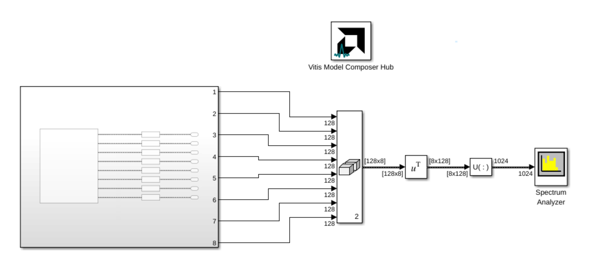
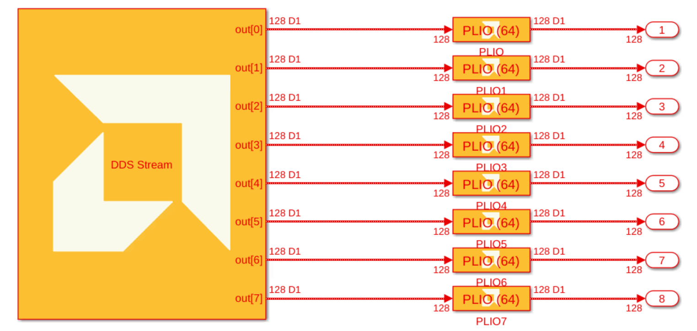
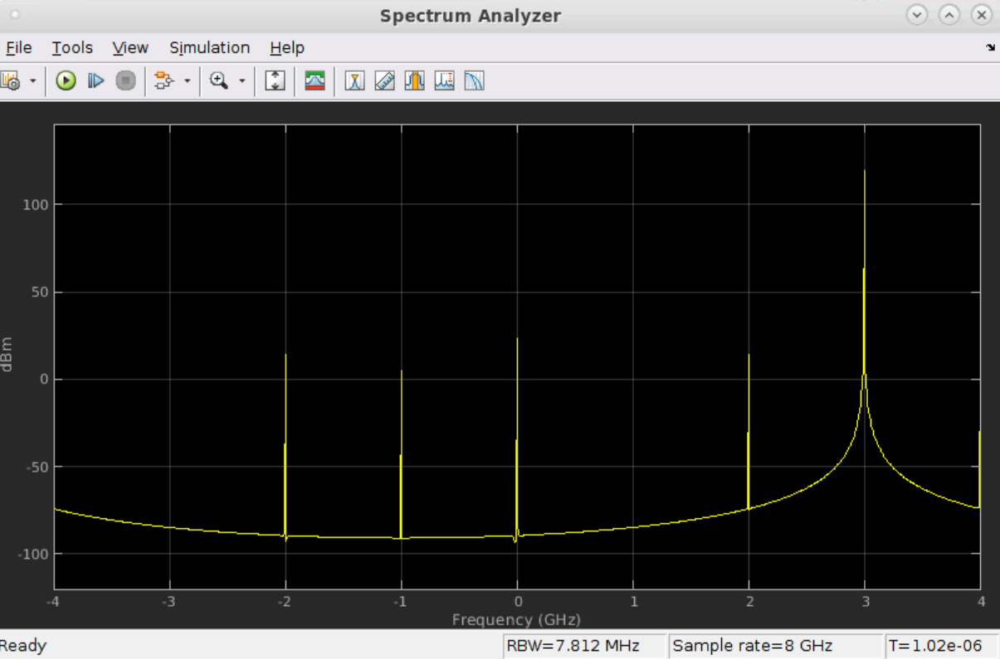

# DDS Stream
  
  

## Library

AI Engine/DSP/Stream IO

## Description

This block implements the stream-based Direct Digital Synthesizer (DDS)
targeted for AI Engines.

## Parameters

### Main  
#### Output Data Type

Sets the output data type.

#### Output Window Size (Number of Samples)

Specifies the number of samples in the output frame. The value must be in the range of 8 to 1024 and the default value is 32. Note that for SSR values greater than one, this value is the sum of the sizes of all the outputs. 

To increase output throughput, you should increase the Output Window Size.

#### Number of Parallel Outputs (SSR)

This parameter specifies the number of output ports and must be of the form 2^N, where N is a non-negative integer. The number of AI Engine kernels used is equal to the value of SSR parameter.

#### Phase Increment

Specifies the phase increment between samples. The value must be in
  the range 0 to 2^31 and the default value is 0. Phase increment is calculated
  using the formula (Fo\*(2^N)) / Fs / SSR where:
  - Fo = Output frequency.
  - N = 32, which represents the accumulator width, and it is fixed.
  - Fs = Sampling frequency.

For example, for a sampling frequency of 1 Gsps and output frequency of 100 MHz, the _Phase Increment_ should be 2^32/10.  

#### Initial Phase Offset

Specifies the initial phase offset. The default value is 0.

#### Sample Time

Specifies the sample time for the block output port. The default value is -1 which will result in inheriting the sample time.

### Constraints
Click on the button given here to access the constraint manager and add or update constraints for each kernel. If you set the "Number of cascade stages" parameter to a value greater than one, multiple kernels will be used to process the input. You can use the constraint manager to optimize the performance of your design by setting specific constraints for each kernel (in this case, you need to first run your design). Adding constraints will not affect the functional simulation in Simulink. Constraints will only affect the generated graph code, cycle approximate AIE simulation (System C), and behavior in hardware.

If you are using non-default constraints for any of the kernels for the block, an asterisk (*) will be displayed next to the button.

### Examples
Assume you need the DDS to generate a frequnecy of 250 MHz at 1Gsps. Here is how you set the parameters:
* Output data type: cint16
* Output Window size: 32
* SSR: 1
* Phase increment: 2^30 = 250e6*2^32/1e9
* Initial Phase Offset = 0
* Sample time = 1e9*(Output Window Size)

We can use SSR to achieve freqencies larger than 1GHz. For example, assume you need to generate a freqency of 3GHz using 8 outputs. Here is how you set the parameters:
* Output data type: cint16
* Output Window Size: 1024
* SSR: 8
* Phase increment: 3\*2^29 = (3e9)\*2^32/1e9/SSR
* Initial Phase Offset = 0
* Sample time = 1e9*(Output Window Size)/SSR = 1e9*128

### References
This block uses the Vitis DSP library implementation of DDS. For more details on this implementation please click [here](https://docs.xilinx.com/r/en-US/Vitis_Libraries/dsp/user_guide/L2/func-dds.html).
