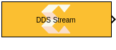
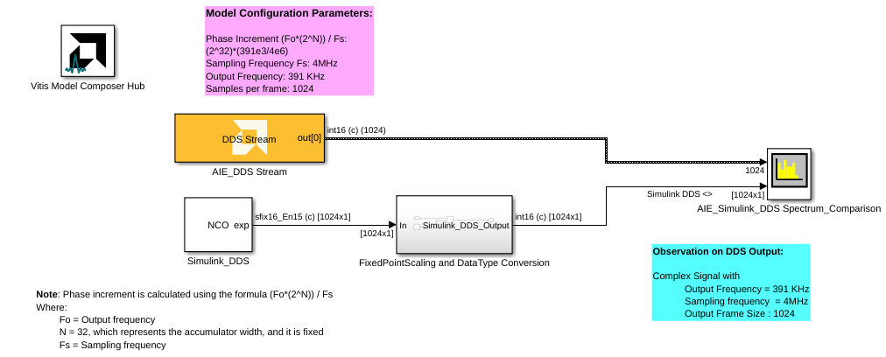
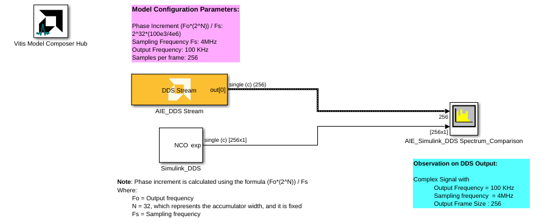

# DDS Stream
  
  

## Library

AI Engine/DSP/Stream IO

## Description

This block implements the Direct Digital Synthesizer (DDS)
targeted for AI Engines and uses stream interface.

## Parameters

### Main  
#### Output Data Type

Sets the output data type.

#### Samples per frame

Specifies the number of samples in the output frame. The value must be in the range of 8 to 1024 and the default value is 32. Note that for SSR values greater than one, this value is the sum of the sizes of all the outputs. 

Increasing the number of samples per frame increases the output throughput.

#### Number of Parallel Outputs (SSR)

This parameter specifies the number of output ports. The number of AI Engine kernels used is equal to the value of SSR parameter.

#### Reload initial phase via input port
Allows the intial phase to be reloaded during simulation via an input port.

#### Phase Increment

Specifies the phase increment between samples. The value must be in
  the range 0 to 2^31 and the default value is 0. Phase increment is calculated
  using the formula `(Fo\*(2^N)) / Fs / SSR` where:
  - Fo = Output frequency.
  - N = 32, which represents the accumulator width, and it is fixed.
  - Fs = Sampling frequency.

For example, for a sampling frequency of 1 Gsps, output frequency of 100 MHz, and SSR of 4, the _Phase Increment_ should be `2^30/10`.  

#### Initial Phase Offset

Specifies the initial phase offset. The default value is 0.

#### Rounding mode

Describes the selection of rounding to be applied during the shift down stage of processing.

The following modes are available:
* **Floor:** Truncate LSB, always round down (towards negative infinity).
* **Ceiling:** Always round up (towards positive infinity).
* **Round to positive infinity:** Round halfway towards positive infinity.
* **Round to negative infinity:** Round halfway towards negative infinity.
* **Round symmetrical to infinity:** Round halfway towards infinity (away from zero).
* **Round symmetrical to zero:** Round halfway towards zero (away from infinity).
* **Round convergent to even:** Round halfway towards nearest even number.
* **Round convergent to odd:** Round halfway towards nearest odd number.

No rounding is performed on the **Floor** or **Ceiling** modes. Other modes round to the nearest integer. They differ only in how they round for values that are exactly between two integers.

#### Saturation mode

Describes the selection of saturation to be applied during the shift down stage of processing.

The following modes are available:
* **None:** No saturation is performed and the value is truncated on the MSB side.
* **Asymmetric:** Rounds an n-bit signed value in the range `-2^(n-1)` to `2^(n-1)-1`.
* **Symmetric:** Rounds an n-bit signed value in the range `-2^(n-1)-1` to `2^(n-1)-1`.

#### Sample Time

Specifies the sample time for the output signal.

The propagated block sample time in Simulink is equal to "Sample time" multipled by "Samples per frame" divided by "SSR".

### Constraints
Click on the button given here to access the constraint manager and add or update constraints for each kernel. If you set the "Number of cascade stages" parameter to a value greater than one, multiple kernels will be used to process the input. You can use the constraint manager to optimize the performance of your design by setting specific constraints for each kernel (in this case, you need to first run your design). Adding constraints will not affect the functional simulation in Simulink. Constraints will only affect the generated graph code, cycle approximate AIE simulation (System C), and behavior in hardware.

If you are using non-default constraints for any of the kernels for the block, an asterisk (*) will be displayed next to the button.

## Examples

***Click on the images below to open each model.***

## Related blocks
[DDS](../DDS/README.md) is another DDS block that uses buffer interface instead of stream interface.

## References
This block uses the Vitis DSP library implementation of DDS. For more details on this implementation please click [here](https://docs.xilinx.com/r/en-US/Vitis_Libraries/dsp/user_guide/L2/func-dds.html).
