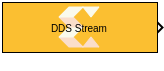
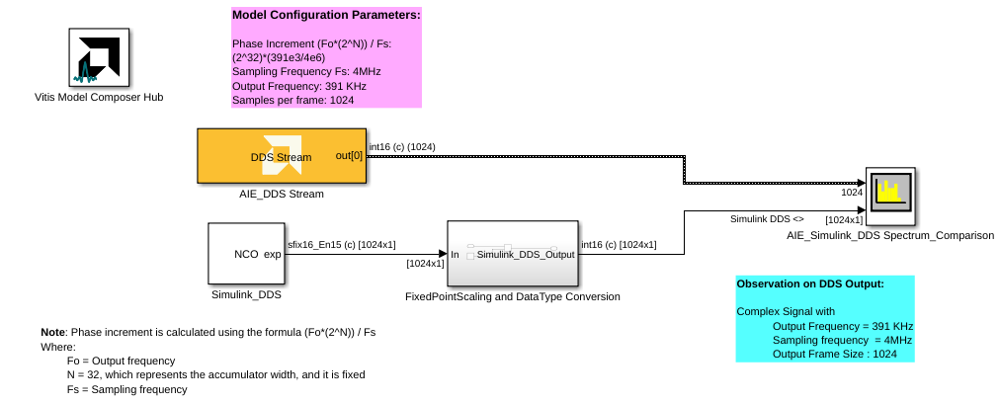
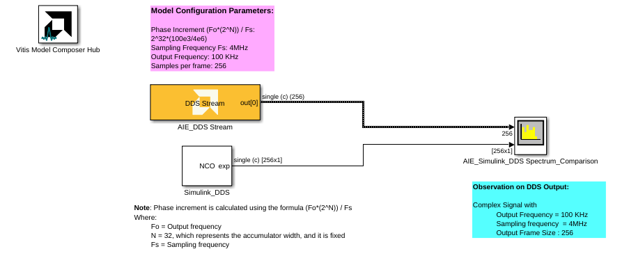

<!-- Library: aieDSP -->

# DDS Stream
  
  

## Library

AI Engine/DSP/Stream IO

## Description

This block implements the Direct Digital Synthesizer (DDS)
targeted for AI Engines and uses stream interface.

## Parameters

### Main  
#### Output data type

Sets the output data type.

#### Samples per frame

Specifies the number of samples in the output frame. The value must be in the range of 8 to 1024 and the default value is 32. Note that for SSR values greater than one, this value is the sum of the sizes of all the outputs. 

Increasing the number of samples per frame increases the output throughput.

#### Support output columns based on SSR number
When enabled, the block will output a matrix with the number of columns equal to the SSR number.

#### SSR

This parameter specifies the number of output ports. The number of AI Engine kernels used is equal to the value of SSR parameter.

#### Initial Phase Offset
Specifies the initial phase offset. The default value is 0.

#### Reload initial phase via input port
Allows the initial phase to be reloaded during simulation via an input port. By default the reload port is a Real-Time Parameter (RTP) port that is non-blocking (async).

#### Use iobuffer port for phase offset reload
Reload the phase offset using an iobuffer port, instead of a Real-Time Parameter (RTP) port. The iobuffer port is a blocking (sync) port, whereas the RTP port is a non-blocking (async) port. 

#### Phase Increment

Specifies the phase increment between samples. The value must be in
  the range 0 to 2^31 and the default value is 0. Phase increment is calculated
  using the formula `(Fo\*(2^N)) / Fs / SSR` where:
  - Fo = Output frequency.
  - N = 32, which represents the accumulator width, and it is fixed.
  - Fs = Sampling frequency.

For example, for a sampling frequency of 1 Gsps, output frequency of 100 MHz, and SSR of 4, the _Phase Increment_ should be `2^30/10`.  

#### Reload phase increment via input port
Allows the phase increment to be reloaded during simulation via an input port.

#### Rounding mode

Describes the selection of rounding to be applied during the shift down stage of processing.

The following modes are available:
* **Floor:** Truncate LSB, always round down (towards negative infinity).
* **Ceiling:** Always round up (towards positive infinity).
* **Round to positive infinity:** Round halfway towards positive infinity.
* **Round to negative infinity:** Round halfway towards negative infinity.
* **Round symmetrical to infinity:** Round halfway towards infinity (away from zero).
* **Round symmetrical to zero:** Round halfway towards zero (away from infinity).
* **Round convergent to even:** Round halfway towards nearest even number.
* **Round convergent to odd:** Round halfway towards nearest odd number.

No rounding is performed on the **Floor** or **Ceiling** modes. Other modes round to the nearest integer. They differ only in how they round for values that are exactly between two integers.

#### Saturation mode

Describes the selection of saturation to be applied during the shift down stage of processing.

The following modes are available:
* **None:** No saturation is performed and the value is truncated on the MSB side.
* **Asymmetric:** Rounds an n-bit signed value in the range `-2^(n-1)` to `2^(n-1)-1`.
* **Symmetric:** Rounds an n-bit signed value in the range `-2^(n-1)-1` to `2^(n-1)-1`.

#### Sample Time

Specifies the sample time for the output signal.

The propagated block sample time in Simulink is equal to "Sample time" multipled by "Samples per frame" divided by "SSR".

### Constraints
Click on the button given here to access the constraint manager and add or update constraints for each kernel. If you set the "Number of cascade stages" parameter to a value greater than one, multiple kernels will be used to process the input. You can use the constraint manager to optimize the performance of your design by setting specific constraints for each kernel (in this case, you need to first run your design). Adding constraints will not affect the functional simulation in Simulink. Constraints will only affect the generated graph code, cycle approximate AIE simulation (System C), and behavior in hardware.

If you are using non-default constraints for any of the kernels for the block, an asterisk (*) will be displayed next to the button.

## Examples

***Click on the images below to open each model.***

<!--
DESCRIPTION:
Model: DDS_Stream_Ex1
Generated: 09-Jan-2026 13:42:20

Vitis Model Composer Configuration:
  Target Device: xcvc1902-vsva2197-1LP-e-S

Vitis Model Composer Blocks:
  - AIE: DDS Stream

Description:
This MATLAB script creates a Vitis Model Composer Simulink model that uses the AI Engine DDS Stream block. 

-->

<!--
MATLAB CREATION SCRIPT:

% create_DDS_Stream_Ex1_model.m
% Auto-generated script to recreate the DDS_Stream_Ex1 Simulink model
% Generated on: 09-Jan-2026 13:42:20

%% Model Configuration
modelName = 'DDS_Stream_Ex1_recreated';

%% Create New Model
if bdIsLoaded(modelName)
    close_system(modelName, 0);
end

new_system(modelName);
open_system(modelName);
fprintf('Created new model: %s\n', modelName);

%% Add Vitis Model Composer Hub Block
hubBlockPath = [modelName '/Vitis Model Composer Hub'];
add_block('vmcUtilities/Vitis Model Composer Hub', hubBlockPath, ...
    'Position', [-293 33 -238 86]);

hubBlk = xmcFindHubBlock(modelName);
vmchub_set_param(hubBlk, modelName, 'SelectHardware', 'xcvc1902-vsva2197-1LP-e-S');

%% Add Top-Level Blocks
add_block('built-in/SpectrumAnalyzer', [modelName '/AIE_Simulink_DDS Spectrum_Comparison'], ...
    'Position', [535 206 580 259]);
set_param([modelName '/AIE_Simulink_DDS Spectrum_Comparison'], ...
    'NumInputPorts', '2', ...
    'OpenAtSimulationStart', 'on', ...
    'WindowPosition', '[878 430 800 500]', ...
    'InputDomain', 'Time', ...
    'SpectrumType', 'Power', ...
    'ViewType', 'Spectrum', ...
    'Method', 'Filter bank', ...
    'SampleRateSource', 'Inherited', ...
    'SampleRate', '10000', ...
    'PlotAsTwoSidedSpectrum', 'on', ...
    'FrequencyScale', 'Linear', ...
    'PlotType', 'Line', ...
    'AxesScaling', 'Auto', ...
    'AxesScalingNumUpdates', '100', ...
    'FrequencyResolutionMethod', 'RBW', ...
    'RBWSource', 'Auto', ...
    'RBW', '9.76', ...
    'WindowInvariantSamplesPerUpdate', 'off', ...
    'WindowLength', '1024', ...
    'FFTLengthSource', 'Auto', ...
    'FFTLength', '1024', ...
    'FilterSharpness', '0.3', ...
    'FrequencySpan', 'Full', ...
    'Span', '10000', ...
    'CenterFrequency', '0', ...
    'StartFrequency', '-5000', ...
    'StopFrequency', '5000', ...
    'InputUnits', 'dBm', ...
    'FrequencyVectorSource', 'Auto', ...
    'FrequencyVector', '[-5000,5000]', ...
    'Window', 'Hann', ...
    'CustomWindow', 'hann', ...
    'SidelobeAttenuation', '60', ...
    'OverlapPercent', '0', ...
    'AveragingMethod', 'Exponential', ...
    'SpectralAverages', '1', ...
    'ForgettingFactor', '0.9', ...
    'VBWSource', 'Auto', ...
    'VBW', '9.76', ...
    'SpectrumUnits', 'dBm', ...
    'FullScaleSource', 'Auto', ...
    'FullScale', '1', ...
    'ReferenceLoad', '1', ...
    'FrequencyOffset', '0', ...
    'SpectrogramChannel', '1', ...
    'TimeResolutionSource', 'Auto', ...
    'TimeResolution', '1e-3', ...
    'TimeSpanSource', 'Auto', ...
    'TimeSpan', '0.1', ...
    'MaximizeAxes', 'Auto', ...
    'PlotNormalTrace', 'on', ...
    'PlotMaxHoldTrace', 'off', ...
    'PlotMinHoldTrace', 'off', ...
    'YLimits', '[-80,20]', ...
    'ColorLimits', '[-80,20]', ...
    'Colormap', 'jet', ...
    'ShowGrid', 'on', ...
    'ShowLegend', 'on', ...
    'ShowColorbar', 'on', ...
    'ChannelNames', '[""]', ...
    'AxesLayout', 'Vertical');
add_block('aieDSP/DDS Stream', [modelName '/DDS Stream'], ...
    'Position', [-75 145 80 195]);
set_param([modelName '/DDS Stream'], ...
    'data_type', 'cfloat', ...
    'output_window_size', '256', ...
    'vmc_ssr_inherit', 'off', ...
    'ssr', '1', ...
    'initial_phase_offset', '0', ...
    'USE_PHASE_RELOAD', 'off', ...
    'PHASE_RELOAD_API', 'off', ...
    'phase_increment', '1.0737e+08', ...
    'phase_increment_reload', 'off', ...
    'rnd_mode', 'Round to positive infinity', ...
    'sat_mode', '0-None', ...
    'vmc_sample_time', '1/4e6', ...
    'TP_API', '1', ...
    'MIXER_MODE', '0');
add_block('dspsigops/NCO', [modelName '/NCO'], ...
    'Position', [-20 232 50 288]);
set_param([modelName '/NCO'], ...
    'AccIncSrc', 'Specify via dialog', ...
    'AccInc', '1.0737e+08', ...
    'PhaseOffsetSrc', 'Specify via dialog', ...
    'PhaseOffset', '0', ...
    'AccumWL', '32', ...
    'HasDither', 'off', ...
    'DitherWL', '4', ...
    'PNgeneratorLength', '19', ...
    'HasPhaseQuantizer', 'on', ...
    'TableDepth', '16', ...
    'HasOutputPhaseError', 'off', ...
    'Formula', 'Complex exponential', ...
    'DataType', 'single', ...
    'OutputWL', '16', ...
    'OutputFL', '14', ...
    'CompMethod', 'Table lookup (no interpolation)', ...
    'SampleTime', '1/4e6', ...
    'SamplesPerFrame', '256', ...
    'OutputFrames', 'off');
add_block('vmcUtilities/Vitis Model Composer Hub', [modelName '/Vitis Model Composer Hub'], ...
    'Position', [-293 33 -238 86]);
set_param([modelName '/Vitis Model Composer Hub'], ...
    'CodeGeneration', 'off', ...
    'StartColumn', '1', ...
    'NumberOfColumns', '1', ...
    'TargetDirectory', './code', ...
    'exportDesign', 'off', ...
    'analyzeDesign', 'off', ...
    'validateDesignOnHw', 'off', ...
    'ExportType', 'AI Engines', ...
    'IpVendor', 'xilinx.com', ...
    'IpLibrary', 'hls', ...
    'IpVersion', '1.0', ...
    'IpHWLanguage', 'Verilog', ...
    'AieCompilerOptions', '{}', ...
    'CreateTestbench', 'off', ...
    'TestbenchStackSize', '10', ...
    'RunRtlSim', 'off', ...
    'RunCSim', 'off', ...
    'RunAieSim', 'off', ...
    'AieSimTimeout', '50000', ...
    'RunAieSimProfiling', 'off', ...
    'LaunchVitisAnalyzer', 'off', ...
    'PlotOutput', 'off', ...
    'GenHwImage', 'off', ...
    'GenLibadfXo', 'off', ...
    'GenHwValidationCode', 'off', ...
    'PlatformType', 'Not Specified', ...
    'HwSystemType', 'Baremetal', ...
    'HwValidationTarget', 'hw', ...
    'ProjDevice', 'xcvc1902-vsva2197-1LP-e-S', ...
    'SamplePeriod', '-1', ...
    'ClockFrequency', '200', ...
    'DataPathParallelism', '1', ...
    'xilinxfamily', 'versalaicore', ...
    'part', 'xcvc1902', ...
    'speed', '-1LP-e-S', ...
    'package', 'vsva2197', ...
    'directory', './netlist', ...
    'testbench', 'off', ...
    'incr_netlist', 'off', ...
    'synthesis_tool', 'Vivado', ...
    'clock_wrapper', 'Clock Enables', ...
    'dbl_ovrd', 'According to Block Masks', ...
    'dcm_input_clock_period', '10', ...
    'sysclk_period', '10', ...
    'simulink_period', '1', ...
    'eval_field', '0', ...
    'LogFileName', '''''', ...
    'NThreads', '4');

%% Connect Top-Level Blocks
add_line(modelName, 'NCO/2', 'AIE_Simulink_DDS Spectrum_Comparison/3', 'autorouting', 'on');
add_line(modelName, 'DDS Stream/2', 'AIE_Simulink_DDS Spectrum_Comparison/2', 'autorouting', 'on');

%% Save Model
save_system(modelName);
fprintf('\nModel saved: %s.slx\n', modelName);
-->

<!--
DESCRIPTION:
Model: DDS_Stream_Ex2
Generated: 09-Jan-2026 13:42:25

Vitis Model Composer Configuration:
  Target Device: xcvc1902-vsva2197-1LP-e-S

Vitis Model Composer Blocks:
  - AIE: DDS Stream

Description:
This MATLAB script creates a Vitis Model Composer Simulink model that uses the AI Engine DDS Stream block. 

-->

<!--
MATLAB CREATION SCRIPT:

% create_DDS_Stream_Ex2_model.m
% Auto-generated script to recreate the DDS_Stream_Ex2 Simulink model
% Generated on: 09-Jan-2026 13:42:25

%% Model Configuration
modelName = 'DDS_Stream_Ex2_recreated';

%% Create New Model
if bdIsLoaded(modelName)
    close_system(modelName, 0);
end

new_system(modelName);
open_system(modelName);
fprintf('Created new model: %s\n', modelName);

%% Add Vitis Model Composer Hub Block
hubBlockPath = [modelName '/Vitis Model Composer Hub'];
add_block('vmcUtilities/Vitis Model Composer Hub', hubBlockPath, ...
    'Position', [-293 33 -238 86]);

hubBlk = xmcFindHubBlock(modelName);
vmchub_set_param(hubBlk, modelName, 'SelectHardware', 'xcvc1902-vsva2197-1LP-e-S');

%% Add Top-Level Blocks
add_block('built-in/SpectrumAnalyzer', [modelName '/AIE_Simulink_DDS Spectrum_Comparison'], ...
    'Position', [585 206 630 259]);
set_param([modelName '/AIE_Simulink_DDS Spectrum_Comparison'], ...
    'NumInputPorts', '2', ...
    'OpenAtSimulationStart', 'on', ...
    'WindowPosition', '[878 430 800 500]', ...
    'InputDomain', 'Time', ...
    'SpectrumType', 'Power', ...
    'ViewType', 'Spectrum', ...
    'Method', 'Filter bank', ...
    'SampleRateSource', 'Inherited', ...
    'SampleRate', '10000', ...
    'PlotAsTwoSidedSpectrum', 'on', ...
    'FrequencyScale', 'Linear', ...
    'PlotType', 'Line', ...
    'AxesScaling', 'Auto', ...
    'AxesScalingNumUpdates', '100', ...
    'FrequencyResolutionMethod', 'RBW', ...
    'RBWSource', 'Auto', ...
    'RBW', '9.76', ...
    'WindowInvariantSamplesPerUpdate', 'off', ...
    'WindowLength', '1024', ...
    'FFTLengthSource', 'Auto', ...
    'FFTLength', '1024', ...
    'FilterSharpness', '0.3', ...
    'FrequencySpan', 'Full', ...
    'Span', '10000', ...
    'CenterFrequency', '0', ...
    'StartFrequency', '-5000', ...
    'StopFrequency', '5000', ...
    'InputUnits', 'dBm', ...
    'FrequencyVectorSource', 'Auto', ...
    'FrequencyVector', '[-5000,5000]', ...
    'Window', 'Hann', ...
    'CustomWindow', 'hann', ...
    'SidelobeAttenuation', '60', ...
    'OverlapPercent', '0', ...
    'AveragingMethod', 'Exponential', ...
    'SpectralAverages', '1', ...
    'ForgettingFactor', '0.9', ...
    'VBWSource', 'Auto', ...
    'VBW', '9.76', ...
    'SpectrumUnits', 'dBm', ...
    'FullScaleSource', 'Auto', ...
    'FullScale', '1', ...
    'ReferenceLoad', '1', ...
    'FrequencyOffset', '0', ...
    'SpectrogramChannel', '1', ...
    'TimeResolutionSource', 'Auto', ...
    'TimeResolution', '1e-3', ...
    'TimeSpanSource', 'Auto', ...
    'TimeSpan', '0.1', ...
    'MaximizeAxes', 'Auto', ...
    'PlotNormalTrace', 'on', ...
    'PlotMaxHoldTrace', 'off', ...
    'PlotMinHoldTrace', 'off', ...
    'YLimits', '[-80,20]', ...
    'ColorLimits', '[-80,20]', ...
    'Colormap', 'jet', ...
    'ShowGrid', 'on', ...
    'ShowLegend', 'on', ...
    'ShowColorbar', 'on', ...
    'ChannelNames', '[""]', ...
    'AxesLayout', 'Vertical');
add_block('aieDSP/DDS Stream', [modelName '/DDS Stream'], ...
    'Position', [-70 145 85 195]);
set_param([modelName '/DDS Stream'], ...
    'data_type', 'cint16', ...
    'output_window_size', '1024', ...
    'vmc_ssr_inherit', 'off', ...
    'ssr', '1', ...
    'initial_phase_offset', '0', ...
    'USE_PHASE_RELOAD', 'off', ...
    'PHASE_RELOAD_API', 'off', ...
    'phase_increment', '4.1983e+08', ...
    'phase_increment_reload', 'off', ...
    'rnd_mode', 'Floor', ...
    'sat_mode', '1-Asymmetric', ...
    'vmc_sample_time', '1/4e6', ...
    'TP_API', '1', ...
    'MIXER_MODE', '0');
add_block('dspsigops/NCO', [modelName '/NCO'], ...
    'Position', [-55 232 15 288]);
set_param([modelName '/NCO'], ...
    'AccIncSrc', 'Specify via dialog', ...
    'AccInc', '4.1983e+08', ...
    'PhaseOffsetSrc', 'Specify via dialog', ...
    'PhaseOffset', '0', ...
    'AccumWL', '32', ...
    'HasDither', 'off', ...
    'DitherWL', '4', ...
    'PNgeneratorLength', '19', ...
    'HasPhaseQuantizer', 'on', ...
    'TableDepth', '16', ...
    'HasOutputPhaseError', 'off', ...
    'Formula', 'Complex exponential', ...
    'DataType', 'Binary point scaling', ...
    'OutputWL', '16', ...
    'OutputFL', '15', ...
    'CompMethod', 'Table lookup (no interpolation)', ...
    'SampleTime', '1/4e6', ...
    'SamplesPerFrame', '1024', ...
    'OutputFrames', 'off');
add_block('vmcUtilities/Vitis Model Composer Hub', [modelName '/Vitis Model Composer Hub'], ...
    'Position', [-293 33 -238 86]);
set_param([modelName '/Vitis Model Composer Hub'], ...
    'CodeGeneration', 'off', ...
    'StartColumn', '1', ...
    'NumberOfColumns', '1', ...
    'TargetDirectory', './code', ...
    'exportDesign', 'off', ...
    'analyzeDesign', 'off', ...
    'validateDesignOnHw', 'off', ...
    'ExportType', 'AI Engines', ...
    'IpVendor', 'xilinx.com', ...
    'IpLibrary', 'hls', ...
    'IpVersion', '1.0', ...
    'IpHWLanguage', 'Verilog', ...
    'AieCompilerOptions', '{}', ...
    'CreateTestbench', 'off', ...
    'TestbenchStackSize', '10', ...
    'RunRtlSim', 'off', ...
    'RunCSim', 'off', ...
    'RunAieSim', 'off', ...
    'AieSimTimeout', '50000', ...
    'RunAieSimProfiling', 'off', ...
    'LaunchVitisAnalyzer', 'off', ...
    'PlotOutput', 'off', ...
    'GenHwImage', 'off', ...
    'GenLibadfXo', 'off', ...
    'GenHwValidationCode', 'off', ...
    'PlatformType', 'Not Specified', ...
    'HwSystemType', 'Baremetal', ...
    'HwValidationTarget', 'hw', ...
    'ProjDevice', 'xcvc1902-vsva2197-1LP-e-S', ...
    'SamplePeriod', '-1', ...
    'ClockFrequency', '200', ...
    'DataPathParallelism', '1', ...
    'xilinxfamily', 'versalaicore', ...
    'part', 'xcvc1902', ...
    'speed', '-1LP-e-S', ...
    'package', 'vsva2197', ...
    'directory', './netlist', ...
    'testbench', 'off', ...
    'incr_netlist', 'off', ...
    'synthesis_tool', 'Vivado', ...
    'clock_wrapper', 'Clock Enables', ...
    'dbl_ovrd', 'According to Block Masks', ...
    'dcm_input_clock_period', '10', ...
    'sysclk_period', '10', ...
    'simulink_period', '1', ...
    'eval_field', '0', ...
    'LogFileName', '''''', ...
    'NThreads', '4');

%% Create FixedPointScaling and DataType Conversion Subsystem
add_block('built-in/SubSystem', [modelName '/FixedPointScaling and DataType Conversion'], ...
    'Position', [170 230 255 290]);

% Remove default blocks
defaultBlocks = find_system([modelName '/FixedPointScaling and DataType Conversion'], 'SearchDepth', 1, 'Type', 'block');
for i = 1:length(defaultBlocks)
    if ~strcmp(defaultBlocks{i}, [modelName '/FixedPointScaling and DataType Conversion'])
        delete_block(defaultBlocks{i});
    end
end

add_block('built-in/Inport', [[modelName '/FixedPointScaling and DataType Conversion'] '/In1'], ...
    'Position', [20 38 50 52]);
set_param([[modelName '/FixedPointScaling and DataType Conversion'] '/In1'], ...
    'Port', '1', ...
    'IconDisplay', 'Port number', ...
    'OutputFunctionCall', 'off', ...
    'OutMin', '[]', ...
    'OutMax', '[]', ...
    'OutDataTypeStr', 'Inherit: auto', ...
    'LockScale', 'off', ...
    'BusOutputAsStruct', 'off', ...
    'BusVirtuality', 'inherit', ...
    'Unit', 'inherit', ...
    'PortDimensions', '-1', ...
    'VarSizeSig', 'Inherit', ...
    'SampleTime', '-1', ...
    'SignalType', 'auto', ...
    'LatchByDelayingOutsideSignal', 'off', ...
    'LatchInputForFeedbackSignals', 'off', ...
    'Interpolate', 'on', ...
    'DataMode', 'inherit', ...
    'MessageQueueUseDefaultAttributes', 'on', ...
    'MessageQueueCapacity', '1', ...
    'MessageQueueType', 'LIFO', ...
    'MessageQueueOverwriting', 'on');
add_block('built-in/Product', [[modelName '/FixedPointScaling and DataType Conversion'] '/Product'], ...
    'Position', [255 37 285 68]);
set_param([[modelName '/FixedPointScaling and DataType Conversion'] '/Product'], ...
    'Inputs', '2', ...
    'Multiplication', 'Element-wise(.*)', ...
    'CollapseMode', 'All dimensions', ...
    'CollapseDim', '1', ...
    'InputSameDT', 'off', ...
    'OutMin', '[]', ...
    'OutMax', '[]', ...
    'OutDataTypeStr', 'int16', ...
    'LockScale', 'off', ...
    'RndMeth', 'Floor', ...
    'SaturateOnIntegerOverflow', 'off', ...
    'SampleTime', '-1');
add_block('built-in/Constant', [[modelName '/FixedPointScaling and DataType Conversion'] '/ScalingValue'], ...
    'Position', [140 60 170 90]);
set_param([[modelName '/FixedPointScaling and DataType Conversion'] '/ScalingValue'], ...
    'Value', '2^(15)', ...
    'VectorParams1D', 'on', ...
    'OutMin', '[]', ...
    'OutMax', '[]', ...
    'OutDataTypeStr', 'Inherit: Inherit from ''Constant value''', ...
    'LockScale', 'off', ...
    'SampleTime', 'inf', ...
    'FramePeriod', 'inf');
add_block('built-in/Outport', [[modelName '/FixedPointScaling and DataType Conversion'] '/Out1'], ...
    'Position', [440 48 470 62]);
set_param([[modelName '/FixedPointScaling and DataType Conversion'] '/Out1'], ...
    'Port', '1', ...
    'StorageClass', 'Auto', ...
    'IconDisplay', 'Port number', ...
    'OutputFunctionCall', 'off', ...
    'OutMin', '[]', ...
    'OutMax', '[]', ...
    'OutDataTypeStr', 'Inherit: auto', ...
    'LockScale', 'off', ...
    'BusOutputAsStruct', 'off', ...
    'BusVirtuality', 'inherit', ...
    'DataMode', 'inherit', ...
    'Unit', 'inherit', ...
    'PortDimensions', '-1', ...
    'VarSizeSig', 'Inherit', ...
    'SampleTime', '-1', ...
    'SignalType', 'auto', ...
    'EnsureOutportIsVirtual', 'off', ...
    'OutputWhenDisabled', 'held', ...
    'InitialOutput', '[]', ...
    'MustResolveToSignalObject', 'off', ...
    'OutputWhenUnConnected', 'off', ...
    'OutputWhenUnconnectedValue', '0', ...
    'VectorParamsAs1DForOutWhenUnconnected', 'on');

% Connect blocks in FixedPointScaling and DataType Conversion
add_line([modelName '/FixedPointScaling and DataType Conversion'], 'Product/2', 'Out1/2', 'autorouting', 'on');
add_line([modelName '/FixedPointScaling and DataType Conversion'], 'In1/2', 'Product/2', 'autorouting', 'on');
add_line([modelName '/FixedPointScaling and DataType Conversion'], 'ScalingValue/2', 'Product/3', 'autorouting', 'on');

%% Connect Top-Level Blocks
add_line(modelName, 'FixedPointScaling and DataType Conversion/2', 'AIE_Simulink_DDS Spectrum_Comparison/3', 'autorouting', 'on');
add_line(modelName, 'NCO/2', 'FixedPointScaling and DataType Conversion/2', 'autorouting', 'on');
add_line(modelName, 'DDS Stream/2', 'AIE_Simulink_DDS Spectrum_Comparison/2', 'autorouting', 'on');

%% Save Model
save_system(modelName);
fprintf('\nModel saved: %s.slx\n', modelName);
-->

## Related blocks
[DDS](../DDS/README.md) is another DDS block that uses buffer interface instead of stream interface.

## References
This block uses the Vitis DSP library implementation of DDS. For more details on this implementation please click [here](https://docs.amd.com/r/en-US/Vitis_Libraries/dsp/user_guide/L2/func-dds_mixer_intrinsic.html).

--------------
Copyright (C) 2025 Advanced Micro Devices, Inc.
All rights reserved.

SPDX-License-Identifier: MIT
