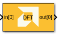
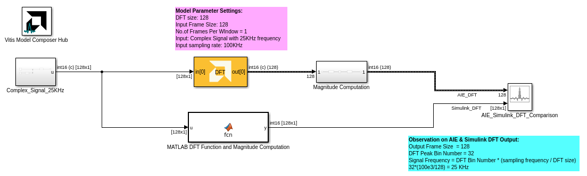
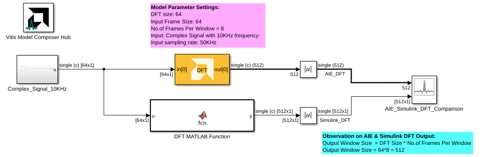
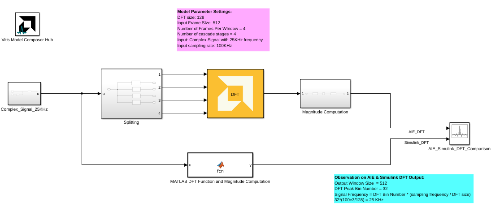
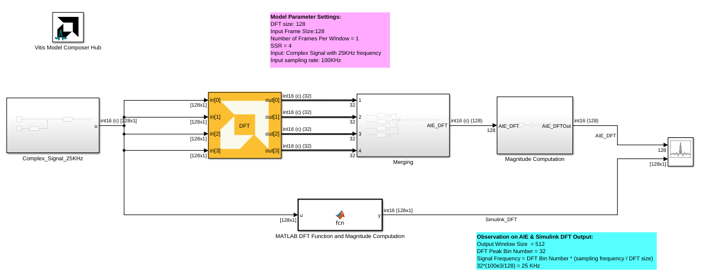
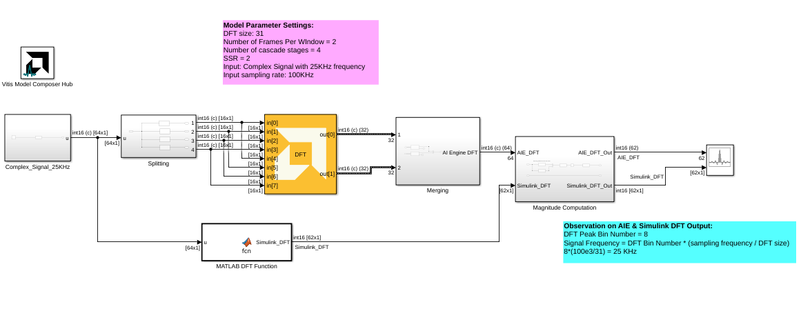

<!-- Library: aieDSP -->

# DFT 
DFT implementation targeted for AI Engines.
  
  

## Library

AI Engine/DSP/Buffer IO

## Description

 DFT implementation targeted for AI Engines.
## Parameters

### Main  
#### Input/Output Data Type
Set the input/output data type.

#### Twiddle factor data type
Describes the data type of the twiddle factors of the transform. It must be one of `cint16`, `cint32`, or `cfloat` and must also satisfy the following rules:
* 32-bit twiddle factors are only supported when the input/output data type is also 32-bit.
* The twiddle factor data type must be an integer type if the input/output data type is an integer type.
* The twiddle factor data type must be `cfloat` if the input/output data type is a float type.

#### DFT size
This is an unsigned integer which describes the point size of the transformation. This must be 2^N, where N is in the range 3 to 7 inclusive.

#### Number of frames per window
Describes the total number of frames used as an input to the DFT block per window.
 
#### Scale output down by 2^
Describes the power of 2 shift down applied before output. For _cfloat_ data type, the value for this parameter must be zero. 

#### Rounding mode

Describes the selection of rounding to be applied during the shift down stage of processing.

The following modes are available:
* **Floor:** Truncate LSB, always round down (towards negative infinity).
* **Ceiling:** Always round up (towards positive infinity).
* **Round to positive infinity:** Round halfway towards positive infinity.
* **Round to negative infinity:** Round halfway towards negative infinity.
* **Round symmetrical to infinity:** Round halfway towards infinity (away from zero).
* **Round symmetrical to zero:** Round halfway towards zero (away from infinity).
* **Round convergent to even:** Round halfway towards nearest even number.
* **Round convergent to odd:** Round halfway towards nearest odd number.

No rounding is performed on the **Floor** or **Ceiling** modes. Other modes round to the nearest integer. They differ only in how they round for values that are exactly between two integers.

#### SSR

This parameter specifies the number of output ports. The number of AI Engine kernels used is equal to the value of SSR parameter.

The DFT/IDFT blocks' behavior in SSR mode differs from that of the FFT/IFFT blocks. Each input port of the DFT/IDFT should receive the same input samples. This differs from the FFT/IFFT blocks, which expect the input samples to be split across the input ports.

#### Saturation mode

Describes the selection of saturation to be applied during the shift down stage of processing.

The following modes are available:
* **None:** No saturation is performed and the value is truncated on the MSB side.
* **Asymmetric:** Rounds an n-bit signed value in the range `-2^(n-1)` to `2^(n-1)-1`.
* **Symmetric:** Rounds an n-bit signed value in the range `-2^(n-1)-1` to `2^(n-1)-1`.

####  Number of Cascade Stages
This determines the number of kernels the DFT will be divided over in series to improve throughput. When cascaded, each kernel will operate on a subset of the input signal and pass a partial result to the next kernel. 

Increasing the number of cascade stages will increase the number of inputs to the DFT block. The input signal should be distributed among the input ports in a round-robin fashion. 

For example, for a cascade length of 2:
* `in[0]` should receive samples `1, 3, 5, ..., n-1` of the input signal 
* `in[1]` should receive samples `2, 4, 6, ..., n` of the input signal

The maximum cascade length is 11. 

### Zero Padding Data for Alignment

It is important to note that the DFT requires that each frame of input data to be aligned and sized according to the following rules for maximal performance.

* **AIE:** The input frame must be a multiple of 256 bits.
* **AIE-ML and AIE-MLv2:** The input frame must be a multiple of 256 bits for `cint16` data and 512 bits for `cint32` or `cfloat` data.

This is also a requirement when using the cascading feature of the DFT. Each cascaded kernel should receive a split of the frame that has a size corresponding to the above rules.

For more information, see the [Vitis DSP library documentation](https://docs.amd.com/r/en-US/Vitis_Libraries/dsp/user_guide/L2/func-dft.html_6_5).

When computing a DFT size that does not follow these rules, it is necessary to do one of the following:

1. Zero-pad each input frame so that its size is one of the bit multiples described above. When zero-padding, there will be no impact on the final numerical result of the transform.
2. Buffer each input frame so that its size is one of the bit multiples described above. When not zero-padding, it is necessary to remove invalid samples from the output.

[This example]((https://github.com/Xilinx/Vitis_Model_Composer/tree/2025.2/Examples/Block_Help/AIE/DFT_Ex5)) illustrates the second approach.

### Constraints
Click on the button given here to access the constraint manager and add or update constraints for each kernel. If you set the "Number of cascade stages" parameter to a value greater than one, multiple kernels will be used to process the input. You can use the constraint manager to optimize the performance of your design by setting specific constraints for each kernel (in this case, you need to first run your design). Adding constraints will not affect the functional simulation in Simulink. Constraints will only affect the generated graph code, cycle approximate AIE simulation (System C), and behavior in hardware.

If you are using non-default constraints for any of the kernels for the block, an asterisk (*) will be displayed next to the button.

## Examples

***Click on the images below to open each model.***

<!--
DESCRIPTION:
Model: DFT_Ex1
Generated: 13-Jan-2026 15:36:55

Vitis Model Composer Configuration:
  Target Device: xcvc1902-vsva2197-1LP-e-S

Vitis Model Composer Blocks:
  - AIE: DFT

Model Annotations:
  p, li { white-space: pre-wrap; }
  Observation on AIE & Simulink DFT Output:
  Output Frame Size  = 128
  DFT Peak Bin Number = 32
  Signal Frequency = DFT Bin Number * (sampling frequency / DFT size)
  32*(100e3/128) = 25 KHz

  p, li { white-space: pre-wrap; }
  Model Parameter Settings:
  DFT size: 128
  Input Frame SIze: 128
  No.of Frames Per WIndow = 1
  Input: Complex Signal with 25KHz frequency
  Input sampling rate: 100KHz

Description:
This MATLAB script creates a Vitis Model Composer Simulink model that uses the AI Engine DFT block. A 25kHz complex input signal is provided to the block,  and the output is visualized for analysis.

-->

<!--
MATLAB CREATION SCRIPT:

% Quick Start: DFT_Ex1
% Essential setup focusing on critical parameters

modelName = 'DFT_Ex1';
new_system(modelName); open_system(modelName);

% Hub Block - Configure target device
add_block('vmcUtilities/Vitis Model Composer Hub', [modelName '/Hub']);
hubBlk = xmcFindHubBlock(modelName);
vmchub_set_param(hubBlk, modelName, 'SelectHardware', 'xcvc1902-vsva2197-1LP-e-S');

% CRITICAL: Twiddle factor data type rules:
%   - Must be cint16/cint32/cfloat
%   - Must match input/output type (int→int, float→float)

% DFT
add_block('aieDSP/DFT', [modelName '/DFT']);
set_param([modelName '/DFT'], ...
    'data_type', 'cint16', ...
    'twiddle_type', 'cint16', ...
    'point_size', '128', ...
    'shift_val', '0', ...
    'ssr', '1');

-->

<!--
DESCRIPTION:
Model: DFT_Ex2
Generated: 13-Jan-2026 15:36:55

Vitis Model Composer Configuration:
  Target Device: xcvc1902-vsva2197-1LP-e-S

Vitis Model Composer Blocks:
  - AIE: DFT

Model Annotations:
  p, li { white-space: pre-wrap; }
  Observation on AIE & Simulink DFT Output:
  Output Window Size  = DFT Size * No.of Frames Per Window
  Output Window Size = 64*8 = 512

  p, li { white-space: pre-wrap; }
  Model Parameter Settings:
  DFT size: 64
  Input Frame SIze: 64
  No.of Frames Per Window = 8
  Input: Complex Signal with 10KHz frequency
  Input sampling rate: 50KHz

Description:
This MATLAB script creates a Vitis Model Composer Simulink model that uses the AI Engine DFT block. A 10kHz complex input signal is provided to the block,  and the output is visualized for analysis.

-->

<!--
MATLAB CREATION SCRIPT:

% Quick Start: DFT_Ex2
% Essential setup focusing on critical parameters

modelName = 'DFT_Ex2';
new_system(modelName); open_system(modelName);

% Hub Block - Configure target device
add_block('vmcUtilities/Vitis Model Composer Hub', [modelName '/Hub']);
hubBlk = xmcFindHubBlock(modelName);
vmchub_set_param(hubBlk, modelName, 'SelectHardware', 'xcvc1902-vsva2197-1LP-e-S');

% CRITICAL: Twiddle factor data type rules:
%   - Must be cint16/cint32/cfloat
%   - Must match input/output type (int→int, float→float)

% DFT
add_block('aieDSP/DFT', [modelName '/DFT']);
set_param([modelName '/DFT'], ...
    'data_type', 'cfloat', ...
    'twiddle_type', 'cfloat', ...
    'point_size', '64', ...
    'shift_val', '0', ...
    'ssr', '1');

-->

<!--
DESCRIPTION:
Model: DFT_Ex3
Generated: 13-Jan-2026 15:36:56

Vitis Model Composer Configuration:
  Target Device: xcvc1902-vsva2197-1LP-e-S

Vitis Model Composer Blocks:
  - AIE: DFT

Model Annotations:
  p, li { white-space: pre-wrap; }
  Observation on AIE & Simulink DFT Output:
  Output Window Size  = 512
  DFT Peak Bin Number = 32
  Signal Frequency = DFT Bin Number * (sampling frequency / DFT size)
  32*(100e3/128) = 25 KHz

  p, li { white-space: pre-wrap; }
  Model Parameter Settings:
  DFT size: 128
  Input Frame SIze: 512
  Number of Frames Per WIndow = 4
  Number of cascade stages = 4
  Input: Complex Signal with 25KHz frequency
  Input sampling rate: 100KHz

Description:
This MATLAB script creates a Vitis Model Composer Simulink model that uses the AI Engine DFT block. A 25kHz complex input signal is provided to the block,  and the output is visualized for analysis.

-->

<!--
MATLAB CREATION SCRIPT:

% Quick Start: DFT_Ex3
% Essential setup focusing on critical parameters

modelName = 'DFT_Ex3';
new_system(modelName); open_system(modelName);

% Hub Block - Configure target device
add_block('vmcUtilities/Vitis Model Composer Hub', [modelName '/Hub']);
hubBlk = xmcFindHubBlock(modelName);
vmchub_set_param(hubBlk, modelName, 'SelectHardware', 'xcvc1902-vsva2197-1LP-e-S');

% CRITICAL: Twiddle factor data type rules:
%   - Must be cint16/cint32/cfloat
%   - Must match input/output type (int→int, float→float)

% DFT
add_block('aieDSP/DFT', [modelName '/DFT1']);
set_param([modelName '/DFT1'], ...
    'data_type', 'cint16', ...
    'twiddle_type', 'cint16', ...
    'point_size', '128', ...
    'shift_val', '0', ...
    'ssr', '1');

-->

<!--
DESCRIPTION:
Model: DFT_Ex4
Generated: 13-Jan-2026 15:36:56

Vitis Model Composer Configuration:
  Target Device: xcvc1902-vsva2197-1LP-e-S

Vitis Model Composer Blocks:
  - AIE: DFT
  - AIE: To Fixed Size

Model Annotations:
  p, li { white-space: pre-wrap; }
  Observation on AIE & Simulink DFT Output:
  Output Window Size  = 512
  DFT Peak Bin Number = 32
  Signal Frequency = DFT Bin Number * (sampling frequency / DFT size)
  32*(100e3/128) = 25 KHz

  p, li { white-space: pre-wrap; }
  Model Parameter Settings:
  DFT size: 128
  Input Frame SIze:128
  Number of Frames Per WIndow = 1
  SSR = 4
  Input: Complex Signal with 25KHz frequency
  Input sampling rate: 100KHz

Description:
This MATLAB script creates a Vitis Model Composer Simulink model that uses the AI Engine DFT block. A 25kHz complex input signal is provided to the block,  and the output is visualized for analysis.

-->

<!--
MATLAB CREATION SCRIPT:

% Quick Start: DFT_Ex4
% Essential setup focusing on critical parameters

modelName = 'DFT_Ex4';
new_system(modelName); open_system(modelName);

% Hub Block - Configure target device
add_block('vmcUtilities/Vitis Model Composer Hub', [modelName '/Hub']);
hubBlk = xmcFindHubBlock(modelName);
vmchub_set_param(hubBlk, modelName, 'SelectHardware', 'xcvc1902-vsva2197-1LP-e-S');

% CRITICAL: Twiddle factor data type rules:
%   - Must be cint16/cint32/cfloat
%   - Must match input/output type (int→int, float→float)

% DFT
add_block('aieDSP/DFT', [modelName '/DFT']);
set_param([modelName '/DFT'], ...
    'data_type', 'cint16', ...
    'twiddle_type', 'cint16', ...
    'point_size', '128', ...
    'shift_val', '0', ...
    'ssr', '4');

-->

<!--
DESCRIPTION:
Model: DFT_Ex5
Generated: 13-Jan-2026 15:36:57

Vitis Model Composer Configuration:
  Target Device: xcvc1902-vsva2197-1LP-e-S

Vitis Model Composer Blocks:
  - AIE: DFT
  - AIE: To Fixed Size

Model Annotations:
  p, li { white-space: pre-wrap; }
  Observation on AIE & Simulink DFT Output:
  DFT Peak Bin Number = 8
  Signal Frequency = DFT Bin Number * (sampling frequency / DFT size)
  8*(100e3/31) = 25 KHz

  p, li { white-space: pre-wrap; }
  Model Parameter Settings:
  DFT size: 31
  Number of Frames Per WIndow = 2
  Number of cascade stages = 4
  SSR = 2
  Input: Complex Signal with 25KHz frequency
  Input sampling rate: 100KHz

Description:
This MATLAB script creates a Vitis Model Composer Simulink model that uses the AI Engine DFT block. A 25kHz complex input signal is provided to the block,  and the output is visualized for analysis.

-->

<!--
MATLAB CREATION SCRIPT:

% Quick Start: DFT_Ex5
% Essential setup focusing on critical parameters

modelName = 'DFT_Ex5';
new_system(modelName); open_system(modelName);

% Hub Block - Configure target device
add_block('vmcUtilities/Vitis Model Composer Hub', [modelName '/Hub']);
hubBlk = xmcFindHubBlock(modelName);
vmchub_set_param(hubBlk, modelName, 'SelectHardware', 'xcvc1902-vsva2197-1LP-e-S');

% CRITICAL: Twiddle factor data type rules:
%   - Must be cint16/cint32/cfloat
%   - Must match input/output type (int→int, float→float)

% DFT
add_block('aieDSP/DFT', [modelName '/DFT']);
set_param([modelName '/DFT'], ...
    'data_type', 'cint16', ...
    'twiddle_type', 'cint16', ...
    'point_size', '31', ...
    'shift_val', '0', ...
    'ssr', '2');

-->

## References
This block uses the Vitis DSP library implementation of DFT. For more details on this implementation please click [here](https://docs.xilinx.com/r/en-US/Vitis_Libraries/dsp/user_guide/L2/func-dft.html).

--------------
Copyright (C) 2025 Advanced Micro Devices, Inc.
All rights reserved.

SPDX-License-Identifier: MIT
