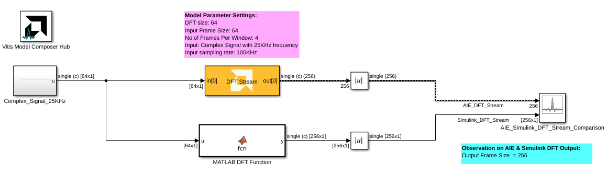

# DFT Stream
Stream-based DFT implementation targeted for AI Engines.
  
  

## Library

AI Engine/DSP/Stream IO

## Description

Stream-based DFT implementation targeted for AI Engines.
## Parameters

### Main  
#### Input/Output Data Type
Set the input/output data type.

#### Twiddle factor data type
Describes the data type of the twiddle factors of the transform. It must be one of `cint16`, `cint32`, or `cfloat` and must also satisfy the following rules:
* 32-bit twiddle factors are only supported when the input/output data type is also 32-bit.
* The twiddle factor data type must be an integer type if the input/output data type is an integer type.
* The twiddle factor data type must be `cfloat` if the input/output data type is a float type.

#### Point Size (DFT Size)
This is an unsigned integer which describes the point size of the transformation. This must be 2^N, where N is in the range 3 to 7 inclusive.

#### Input Window Size
Describes the total number of frames used as an input to the DFT block per window.

The name of this parameter refers to "Number of samples", but this is incorrect. It should refer to the number of frames. For example, for a 256 sample input to a 256-point DFT, the input window size (number of frames) should equal 1.

 
#### Scale Output Down by 2^
Describes the power of 2 shift down applied before output. For _cfloat_ data type, the value for this parameter must be zero. 

#### Rounding mode

Describes the selection of rounding to be applied during the shift down stage of processing.

The following modes are available:
* **Floor:** Truncate LSB, always round down (towards negative infinity).
* **Ceiling:** Always round up (towards positive infinity).
* **Round to positive infinity:** Round halfway towards positive infinity.
* **Round to negative infinity:** Round halfway towards negative infinity.
* **Round symmetrical to infinity:** Round halfway towards infinity (away from zero).
* **Round symmetrical to zero:** Round halfway towards zero (away from infinity).
* **Round convergent to even:** Round halfway towards nearest even number.
* **Round convergent to odd:** Round halfway towards nearest odd number.

No rounding is performed on the **Floor** or **Ceiling** modes. Other modes round to the nearest integer. They differ only in how they round for values that are exactly between two integers.

#### Saturation mode

Describes the selection of saturation to be applied during the shift down stage of processing.

The following modes are available:
* **None:** No saturation is performed and the value is truncated on the MSB side.
* **Asymmetric:** Rounds an n-bit signed value in the range `-2^(n-1)` to `2^(n-1)-1`.
* **Symmetric:** Rounds an n-bit signed value in the range `-2^(n-1)-1` to `2^(n-1)-1`.

####  Number of Cascade Stages
This determines the number of kernels the DFT will be divided over in series to improve throughput. When cascaded, each kernel will operate on a subset of the input signal and pass a partial result to the next kernel. 

Increasing the number of cascade stages will increase the number of inputs to the DFT block. The input signal should be distributed among the input ports in a round-robin fashion. 

For example, for a cascade length of 2:
* `in[0]` should receive samples `1, 3, 5, ..., n-1` of the input signal 
* `in[1]` should receive samples `2, 4, 6, ..., n` of the input signal

The maximum cascade length is 11. 

### Constraints
Click on the button given here to access the constraint manager and add or update constraints for each kernel. If you set the "Number of cascade stages" parameter to a value greater than one, multiple kernels will be used to process the input. You can use the constraint manager to optimize the performance of your design by setting specific constraints for each kernel (in this case, you need to first run your design). Adding constraints will not affect the functional simulation in Simulink. Constraints will only affect the generated graph code, cycle approximate AIE simulation (System C), and behavior in hardware.

If you are using non-default constraints for any of the kernels for the block, an asterisk (*) will be displayed next to the button.

## Examples

***Click on the images below to open each model.***

--------------
Copyright (C) 2023 Advanced Micro Devices, Inc. All rights reserved.
SPDX-License-Identifier: MIT
