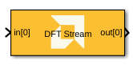
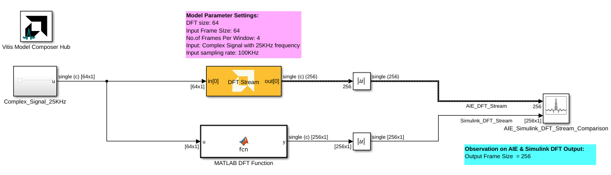

<!-- Library: aieDSP -->

# DFT Stream
Stream-based DFT implementation targeted for AI Engines.
  
  

## Library

AI Engine/DSP/Stream IO

## Description

Stream-based DFT implementation targeted for AI Engines.
## Parameters

### Main  
#### Input/Output data type
Set the input/output data type.

#### Twiddle factor data type
Describes the data type of the twiddle factors of the transform. It must be one of `cint16`, `cint32`, or `cfloat` and must also satisfy the following rules:
* 32-bit twiddle factors are only supported when the input/output data type is also 32-bit.
* The twiddle factor data type must be an integer type if the input/output data type is an integer type.
* The twiddle factor data type must be `cfloat` if the input/output data type is a float type.

#### DFT size
This is an unsigned integer which describes the point size of the transformation. This must be 2^N, where N is in the range 3 to 7 inclusive.

#### Number of frames per window
Describes the total number of frames used as an input to the DFT block per window.

#### Scale output down by 2^
Describes the power of 2 shift down applied before output. For _cfloat_ data type, the value for this parameter must be zero. 

#### Rounding mode

Describes the selection of rounding to be applied during the shift down stage of processing.

The following modes are available:
* **Floor:** Truncate LSB, always round down (towards negative infinity).
* **Ceiling:** Always round up (towards positive infinity).
* **Round to positive infinity:** Round halfway towards positive infinity.
* **Round to negative infinity:** Round halfway towards negative infinity.
* **Round symmetrical to infinity:** Round halfway towards infinity (away from zero).
* **Round symmetrical to zero:** Round halfway towards zero (away from infinity).
* **Round convergent to even:** Round halfway towards nearest even number.
* **Round convergent to odd:** Round halfway towards nearest odd number.

No rounding is performed on the **Floor** or **Ceiling** modes. Other modes round to the nearest integer. They differ only in how they round for values that are exactly between two integers.

#### SSR

This parameter is intended to improve performance by parallelizing the DFT processing. When this parameter is N>1, the block will have N input ports and N output ports.

The DFT/IDFT blocks' behavior in SSR mode differs from that of the FFT/IFFT blocks. Each input port of the DFT/IDFT should receive the same input samples. This differs from the FFT/IFFT blocks, which expect the input samples to be split across the input ports.

#### Saturation mode

Describes the selection of saturation to be applied during the shift down stage of processing.

The following modes are available:
* **None:** No saturation is performed and the value is truncated on the MSB side.
* **Asymmetric:** Rounds an n-bit signed value in the range `-2^(n-1)` to `2^(n-1)-1`.
* **Symmetric:** Rounds an n-bit signed value in the range `-2^(n-1)-1` to `2^(n-1)-1`.

####  Number of Cascade Stages
This determines the number of kernels the DFT will be divided over in series to improve throughput. When cascaded, each kernel will operate on a subset of the input signal and pass a partial result to the next kernel. 

Increasing the number of cascade stages will increase the number of inputs to the DFT block. The input signal should be distributed among the input ports in a round-robin fashion. 

For example, for a cascade length of 2:
* `in[0]` should receive samples `1, 3, 5, ..., n-1` of the input signal 
* `in[1]` should receive samples `2, 4, 6, ..., n` of the input signal

The maximum cascade length is 11. 

### Zero Padding Data for Alignment

It is important to note that the DFT requires that each frame of input data to be aligned and sized according to the following rules for maximal performance.

* **AIE:** The input frame must be a multiple of 256 bits.
* **AIE-ML and AIE-MLv2:** The input frame must be a multiple of 256 bits for `cint16` data and 512 bits for `cint32` or `cfloat` data.

This is also a requirement when using the cascading feature of the DFT. Each cascaded kernel should receive a split of the frame that has a size corresponding to the above rules.

For more information, see the [Vitis DSP library documentation](https://docs.amd.com/r/en-US/Vitis_Libraries/dsp/user_guide/L2/func-dft.html_6_5).

When computing a DFT size that does not follow these rules, it is necessary to do one of the following:

1. Zero-pad each input frame so that its size is one of the bit multiples described above. When zero-padding, there will be no impact on the final numerical result of the transform.
2. Buffer each input frame so that its size is one of the bit multiples described above. When not zero-padding, it is necessary to remove invalid samples from the output.

[This example]((https://github.com/Xilinx/Vitis_Model_Composer/tree/2025.2/Examples/Block_Help/AIE/DFT_Ex5)) illustrates the second approach.

### Constraints
Click on the button given here to access the constraint manager and add or update constraints for each kernel. If you set the "Number of cascade stages" parameter to a value greater than one, multiple kernels will be used to process the input. You can use the constraint manager to optimize the performance of your design by setting specific constraints for each kernel (in this case, you need to first run your design). Adding constraints will not affect the functional simulation in Simulink. Constraints will only affect the generated graph code, cycle approximate AIE simulation (System C), and behavior in hardware.

If you are using non-default constraints for any of the kernels for the block, an asterisk (*) will be displayed next to the button.

## Examples

***Click on the images below to open each model.***

<!--
DESCRIPTION:
Model: DFT_Stream_Ex1
Generated: 09-Jan-2026 13:42:45

Vitis Model Composer Configuration:
  Target Device: xcvc1902-vsva2197-1LP-e-S

Vitis Model Composer Blocks:
  - AIE: DFT Stream
  - AIE: To Fixed Size

Description:
This MATLAB script creates a Vitis Model Composer Simulink model that uses the AI Engine DFT Stream block. A 25kHz complex input signal is provided to the block,  and the output is visualized for analysis.

-->

<!--
MATLAB CREATION SCRIPT:

% create_DFT_Stream_Ex1_model.m
% Auto-generated script to recreate the DFT_Stream_Ex1 Simulink model
% Generated on: 09-Jan-2026 13:42:45

%% Model Configuration
modelName = 'DFT_Stream_Ex1_recreated';

%% Create New Model
if bdIsLoaded(modelName)
    close_system(modelName, 0);
end

new_system(modelName);
open_system(modelName);
fprintf('Created new model: %s\n', modelName);

%% Add Vitis Model Composer Hub Block
hubBlockPath = [modelName '/Vitis Model Composer Hub'];
add_block('vmcUtilities/Vitis Model Composer Hub', hubBlockPath, ...
    'Position', [102 28 157 81]);

hubBlk = xmcFindHubBlock(modelName);
vmchub_set_param(hubBlk, modelName, 'SelectHardware', 'xcvc1902-vsva2197-1LP-e-S');

%% Add Top-Level Blocks
add_block('built-in/ArrayPlot', [modelName '/AIE_Simulink_DFT_Stream_Comparison'], ...
    'Position', [1010 157 1055 208]);
set_param([modelName '/AIE_Simulink_DFT_Stream_Comparison'], ...
    'NumInputPorts', '2', ...
    'OpenAtSimulationStart', 'on', ...
    'WindowPosition', '[215.000000,122.000000,845.000000,423.000000,]', ...
    'XDataMode', 'Sample increment and X-offset', ...
    'SampleIncrement', '1', ...
    'XOffset', '0', ...
    'CustomXData', '[]', ...
    'XScale', 'Linear', ...
    'YScale', 'Linear', ...
    'PlotType', 'Stem', ...
    'PlotBaseValue', '0', ...
    'AxesScaling', 'OnceAtStop', ...
    'AxesScalingNumUpdates', '100', ...
    'MaximizeAxes', 'Auto', ...
    'LayoutDimensions', '[1,1]', ...
    'ActiveDisplay', '1', ...
    'PlotAsMagnitudePhase', 'off', ...
    'YLabel', 'Amplitude', ...
    'YLimits', '[-80,720]', ...
    'ShowGrid', 'on', ...
    'ShowLegend', 'on', ...
    'ChannelNames', '[]');
add_block('aieDSP/DFT Stream', [modelName '/DFT Stream'], ...
    'Position', [345 141 475 194]);
set_param([modelName '/DFT Stream'], ...
    'data_type', 'cfloat', ...
    'twiddle_type', 'cfloat', ...
    'point_size', '64', ...
    'num_frames', '4', ...
    'shift_val', '0', ...
    'rnd_mode', 'Round symmetrical to infinity', ...
    'ssr', '2', ...
    'sat_mode', '0-None', ...
    'casc_length', '1', ...
    'TP_API', '0', ...
    'TP_FFT_NIFFT', '1');
add_block('vmcUtilities/Vitis Model Composer Hub', [modelName '/Vitis Model Composer Hub'], ...
    'Position', [102 28 157 81]);
set_param([modelName '/Vitis Model Composer Hub'], ...
    'CodeGeneration', 'off', ...
    'StartColumn', '1', ...
    'NumberOfColumns', '1', ...
    'TargetDirectory', './code', ...
    'exportDesign', 'off', ...
    'analyzeDesign', 'off', ...
    'validateDesignOnHw', 'off', ...
    'ExportType', 'AI Engines', ...
    'IpVendor', 'xilinx.com', ...
    'IpLibrary', 'hls', ...
    'IpVersion', '1.0', ...
    'IpHWLanguage', 'Verilog', ...
    'AieCompilerOptions', '{}', ...
    'CreateTestbench', 'off', ...
    'TestbenchStackSize', '10', ...
    'RunRtlSim', 'off', ...
    'RunCSim', 'off', ...
    'RunAieSim', 'off', ...
    'AieSimTimeout', '50000', ...
    'RunAieSimProfiling', 'off', ...
    'LaunchVitisAnalyzer', 'off', ...
    'PlotOutput', 'off', ...
    'GenHwImage', 'off', ...
    'GenLibadfXo', 'off', ...
    'GenHwValidationCode', 'off', ...
    'PlatformType', 'Not Specified', ...
    'HwSystemType', 'Baremetal', ...
    'HwValidationTarget', 'hw', ...
    'ProjDevice', 'xcvc1902-vsva2197-1LP-e-S', ...
    'SamplePeriod', '-1', ...
    'ClockFrequency', '200', ...
    'DataPathParallelism', '1', ...
    'xilinxfamily', 'versalaicore', ...
    'part', 'xcvc1902', ...
    'speed', '-1LP-e-S', ...
    'package', 'vsva2197', ...
    'directory', './code', ...
    'testbench', 'off', ...
    'incr_netlist', 'off', ...
    'synthesis_tool', 'Vivado', ...
    'clock_wrapper', 'Clock Enables', ...
    'dbl_ovrd', 'According to Block Masks', ...
    'dcm_input_clock_period', '10', ...
    'sysclk_period', '10', ...
    'simulink_period', '1', ...
    'eval_field', '0', ...
    'LogFileName', '''''', ...
    'NThreads', '4');

%% Create Complex_Signal_25KHz Subsystem
add_block('built-in/SubSystem', [modelName '/Complex_Signal_25KHz'], ...
    'Position', [70 129 145 181]);

% Remove default blocks
defaultBlocks = find_system([modelName '/Complex_Signal_25KHz'], 'SearchDepth', 1, 'Type', 'block');
for i = 1:length(defaultBlocks)
    if ~strcmp(defaultBlocks{i}, [modelName '/Complex_Signal_25KHz'])
        delete_block(defaultBlocks{i});
    end
end

add_block('dspsrcs4/Sine Wave', [[modelName '/Complex_Signal_25KHz'] '/Sine Wave'], ...
    'Position', [-365 13 -320 57]);
set_param([[modelName '/Complex_Signal_25KHz'] '/Sine Wave'], ...
    'Amplitude', '10', ...
    'Frequency', '25e3', ...
    'Phase', '0', ...
    'SampleMode', 'Discrete', ...
    'OutComplex', 'Complex', ...
    'CompMethod', 'Table lookup', ...
    'TableSize', 'Speed', ...
    'SampleTime', '1/100e3', ...
    'SamplesPerFrame', '256', ...
    'ResetState', 'Restart at time zero', ...
    'OutputFrames', 'off', ...
    'additionalParams', 'off', ...
    'allowOverrides', 'on', ...
    'dataType', 'single', ...
    'wordLen', '16', ...
    'udDataType', 'sfix(16)', ...
    'fracBitsMode', 'User-defined', ...
    'numFracBits', '10', ...
    'OutDataTypeStr', 'single', ...
    'LastOutDataTypeStr', 'single');
add_block('built-in/Outport', [[modelName '/Complex_Signal_25KHz'] '/u'], ...
    'Position', [-5 28 25 42]);
set_param([[modelName '/Complex_Signal_25KHz'] '/u'], ...
    'Port', '1', ...
    'StorageClass', 'Auto', ...
    'IconDisplay', 'Port number', ...
    'OutputFunctionCall', 'off', ...
    'OutMin', '[]', ...
    'OutMax', '[]', ...
    'OutDataTypeStr', 'Inherit: auto', ...
    'LockScale', 'off', ...
    'BusOutputAsStruct', 'off', ...
    'BusVirtuality', 'inherit', ...
    'DataMode', 'inherit', ...
    'Unit', 'inherit', ...
    'PortDimensions', '-1', ...
    'VarSizeSig', 'Inherit', ...
    'SampleTime', '-1', ...
    'SignalType', 'auto', ...
    'EnsureOutportIsVirtual', 'off', ...
    'OutputWhenDisabled', 'held', ...
    'InitialOutput', '[]', ...
    'MustResolveToSignalObject', 'off', ...
    'OutputWhenUnConnected', 'off', ...
    'OutputWhenUnconnectedValue', '0', ...
    'VectorParamsAs1DForOutWhenUnconnected', 'on');

% Connect blocks in Complex_Signal_25KHz
add_line([modelName '/Complex_Signal_25KHz'], 'Sine Wave/2', 'u/2', 'autorouting', 'on');

%% Create MATLAB DFT Function Subsystem
add_block('built-in/SubSystem', [modelName '/MATLAB DFT Function'], ...
    'Position', [400 242 550 298]);

% Remove default blocks
defaultBlocks = find_system([modelName '/MATLAB DFT Function'], 'SearchDepth', 1, 'Type', 'block');
for i = 1:length(defaultBlocks)
    if ~strcmp(defaultBlocks{i}, [modelName '/MATLAB DFT Function'])
        delete_block(defaultBlocks{i});
    end
end

%% Create Magnitude_Computation Subsystem
add_block('built-in/SubSystem', [modelName '/Magnitude_Computation'], ...
    'Position', [765 147 885 193]);

% Remove default blocks
defaultBlocks = find_system([modelName '/Magnitude_Computation'], 'SearchDepth', 1, 'Type', 'block');
for i = 1:length(defaultBlocks)
    if ~strcmp(defaultBlocks{i}, [modelName '/Magnitude_Computation'])
        delete_block(defaultBlocks{i});
    end
end

add_block('built-in/Inport', [[modelName '/Magnitude_Computation'] '/DFT'], ...
    'Position', [20 33 50 47]);
set_param([[modelName '/Magnitude_Computation'] '/DFT'], ...
    'Port', '1', ...
    'IconDisplay', 'Port number', ...
    'OutputFunctionCall', 'off', ...
    'OutMin', '[]', ...
    'OutMax', '[]', ...
    'OutDataTypeStr', 'Inherit: auto', ...
    'LockScale', 'off', ...
    'BusOutputAsStruct', 'off', ...
    'BusVirtuality', 'inherit', ...
    'Unit', 'inherit', ...
    'PortDimensions', '-1', ...
    'VarSizeSig', 'Inherit', ...
    'SampleTime', '-1', ...
    'SignalType', 'auto', ...
    'LatchByDelayingOutsideSignal', 'off', ...
    'LatchInputForFeedbackSignals', 'off', ...
    'Interpolate', 'on', ...
    'DataMode', 'inherit', ...
    'MessageQueueUseDefaultAttributes', 'on', ...
    'MessageQueueCapacity', '1', ...
    'MessageQueueType', 'LIFO', ...
    'MessageQueueOverwriting', 'on');
add_block('built-in/Abs', [[modelName '/Magnitude_Computation'] '/Abs'], ...
    'Position', [290 25 320 55]);
set_param([[modelName '/Magnitude_Computation'] '/Abs'], ...
    'ZeroCross', 'on', ...
    'SampleTime', '-1', ...
    'OutMin', '[]', ...
    'OutMax', '[]', ...
    'OutDataTypeStr', 'Inherit: Same as input', ...
    'LockScale', 'off', ...
    'RndMeth', 'Floor', ...
    'SaturateOnIntegerOverflow', 'off');
add_block('built-in/DataTypeConversion', [[modelName '/Magnitude_Computation'] '/Data Type Conversion'], ...
    'Position', [140 23 215 57]);
set_param([[modelName '/Magnitude_Computation'] '/Data Type Conversion'], ...
    'OutMin', '[]', ...
    'OutMax', '[]', ...
    'OutDataTypeStr', 'single', ...
    'LockScale', 'off', ...
    'ConvertRealWorld', 'Real World Value (RWV)', ...
    'RndMeth', 'Floor', ...
    'SaturateOnIntegerOverflow', 'off', ...
    'SampleTime', '-1');
add_block('built-in/DataTypeConversion', [[modelName '/Magnitude_Computation'] '/Data Type Conversion1'], ...
    'Position', [455 23 530 57]);
set_param([[modelName '/Magnitude_Computation'] '/Data Type Conversion1'], ...
    'OutMin', '[]', ...
    'OutMax', '[]', ...
    'OutDataTypeStr', 'int16', ...
    'LockScale', 'off', ...
    'ConvertRealWorld', 'Real World Value (RWV)', ...
    'RndMeth', 'Floor', ...
    'SaturateOnIntegerOverflow', 'off', ...
    'SampleTime', '-1');
add_block('built-in/Outport', [[modelName '/Magnitude_Computation'] '/AIE_DFT'], ...
    'Position', [690 33 720 47]);
set_param([[modelName '/Magnitude_Computation'] '/AIE_DFT'], ...
    'Port', '1', ...
    'StorageClass', 'Auto', ...
    'IconDisplay', 'Port number', ...
    'OutputFunctionCall', 'off', ...
    'OutMin', '[]', ...
    'OutMax', '[]', ...
    'OutDataTypeStr', 'Inherit: auto', ...
    'LockScale', 'off', ...
    'BusOutputAsStruct', 'off', ...
    'BusVirtuality', 'inherit', ...
    'DataMode', 'inherit', ...
    'Unit', 'inherit', ...
    'PortDimensions', '-1', ...
    'VarSizeSig', 'Inherit', ...
    'SampleTime', '-1', ...
    'SignalType', 'auto', ...
    'EnsureOutportIsVirtual', 'off', ...
    'OutputWhenDisabled', 'held', ...
    'InitialOutput', '[]', ...
    'MustResolveToSignalObject', 'off', ...
    'OutputWhenUnConnected', 'off', ...
    'OutputWhenUnconnectedValue', '0', ...
    'VectorParamsAs1DForOutWhenUnconnected', 'on');

% Connect blocks in Magnitude_Computation
add_line([modelName '/Magnitude_Computation'], 'Data Type Conversion1/2', 'AIE_DFT/2', 'autorouting', 'on');
add_line([modelName '/Magnitude_Computation'], 'Abs/2', 'Data Type Conversion1/2', 'autorouting', 'on');
add_line([modelName '/Magnitude_Computation'], 'DFT/2', 'Data Type Conversion/2', 'autorouting', 'on');
add_line([modelName '/Magnitude_Computation'], 'Data Type Conversion/2', 'Abs/2', 'autorouting', 'on');

%% Create Merging Subsystem
add_block('built-in/SubSystem', [modelName '/Merging'], ...
    'Position', [565 140 690 195]);

% Remove default blocks
defaultBlocks = find_system([modelName '/Merging'], 'SearchDepth', 1, 'Type', 'block');
for i = 1:length(defaultBlocks)
    if ~strcmp(defaultBlocks{i}, [modelName '/Merging'])
        delete_block(defaultBlocks{i});
    end
end

add_block('built-in/Inport', [[modelName '/Merging'] '/In1'], ...
    'Position', [20 88 50 102]);
set_param([[modelName '/Merging'] '/In1'], ...
    'Port', '1', ...
    'IconDisplay', 'Port number', ...
    'OutputFunctionCall', 'off', ...
    'OutMin', '[]', ...
    'OutMax', '[]', ...
    'OutDataTypeStr', 'Inherit: auto', ...
    'LockScale', 'off', ...
    'BusOutputAsStruct', 'off', ...
    'BusVirtuality', 'inherit', ...
    'Unit', 'inherit', ...
    'PortDimensions', '-1', ...
    'VarSizeSig', 'Inherit', ...
    'SampleTime', '-1', ...
    'SignalType', 'auto', ...
    'LatchByDelayingOutsideSignal', 'off', ...
    'LatchInputForFeedbackSignals', 'off', ...
    'Interpolate', 'on', ...
    'DataMode', 'inherit', ...
    'MessageQueueUseDefaultAttributes', 'on', ...
    'MessageQueueCapacity', '1', ...
    'MessageQueueType', 'LIFO', ...
    'MessageQueueOverwriting', 'on');
add_block('built-in/Inport', [[modelName '/Merging'] '/In2'], ...
    'Position', [20 118 50 132]);
set_param([[modelName '/Merging'] '/In2'], ...
    'Port', '2', ...
    'IconDisplay', 'Port number', ...
    'OutputFunctionCall', 'off', ...
    'OutMin', '[]', ...
    'OutMax', '[]', ...
    'OutDataTypeStr', 'Inherit: auto', ...
    'LockScale', 'off', ...
    'BusOutputAsStruct', 'off', ...
    'BusVirtuality', 'inherit', ...
    'Unit', 'inherit', ...
    'PortDimensions', '-1', ...
    'VarSizeSig', 'Inherit', ...
    'SampleTime', '-1', ...
    'SignalType', 'auto', ...
    'LatchByDelayingOutsideSignal', 'off', ...
    'LatchInputForFeedbackSignals', 'off', ...
    'Interpolate', 'on', ...
    'DataMode', 'inherit', ...
    'MessageQueueUseDefaultAttributes', 'on', ...
    'MessageQueueCapacity', '1', ...
    'MessageQueueType', 'LIFO', ...
    'MessageQueueOverwriting', 'on');
add_block('built-in/Mux', [[modelName '/Merging'] '/Mux'], ...
    'Position', [485 96 490 134]);
set_param([[modelName '/Merging'] '/Mux'], ...
    'Inputs', '2', ...
    'DisplayOption', 'bar');
add_block('built-in/Reshape', [[modelName '/Merging'] '/Reshape'], ...
    'Position', [585 103 615 127]);
set_param([[modelName '/Merging'] '/Reshape'], ...
    'OutputDimensionality', 'Customize', ...
    'OutputDimensions', '[128, 2]');
add_block('built-in/Reshape', [[modelName '/Merging'] '/Reshape1'], ...
    'Position', [845 103 875 127]);
set_param([[modelName '/Merging'] '/Reshape1'], ...
    'OutputDimensionality', '1-D array', ...
    'OutputDimensions', '[1, 10]');
add_block('built-in/Terminator', [[modelName '/Merging'] '/Terminator'], ...
    'Position', [350 50 370 70]);
add_block('built-in/Terminator', [[modelName '/Merging'] '/Terminator1'], ...
    'Position', [365 140 385 160]);
add_block('aieUtilities/To Fixed Size', [[modelName '/Merging'] '/To Fixed Size'], ...
    'Position', [175 22 290 78]);
set_param([[modelName '/Merging'] '/To Fixed Size'], ...
    'Mode', 'Produce a valid output signal', ...
    'OutputSize', 'Inherit: Same as input', ...
    'CopyMethod', 'Buffer samples to form output', ...
    'HasStatusOutput', 'on');
add_block('aieUtilities/To Fixed Size', [[modelName '/Merging'] '/To Fixed Size1'], ...
    'Position', [175 112 290 168]);
set_param([[modelName '/Merging'] '/To Fixed Size1'], ...
    'Mode', 'Produce a valid output signal', ...
    'OutputSize', 'Inherit: Same as input', ...
    'CopyMethod', 'Buffer samples to form output', ...
    'HasStatusOutput', 'on');
add_block('built-in/Math', [[modelName '/Merging'] '/Transpose'], ...
    'Position', [730 99 760 131]);
set_param([[modelName '/Merging'] '/Transpose'], ...
    'Operator', 'transpose', ...
    'AlgorithmMethod', 'Exact', ...
    'SignedPower', 'off', ...
    'OutputSignalType', 'auto', ...
    'SampleTime', '-1', ...
    'OutMin', '[]', ...
    'OutMax', '[]', ...
    'OutDataTypeStr', 'Inherit: Same as first input', ...
    'LockScale', 'off', ...
    'RndMeth', 'Floor', ...
    'SaturateOnIntegerOverflow', 'on', ...
    'IntermediateResultsDataTypeStr', 'Inherit: Inherit via internal rule', ...
    'AlgorithmType', 'Newton-Raphson', ...
    'Iterations', '3');
add_block('built-in/Outport', [[modelName '/Merging'] '/AI Engine DFT_Stream'], ...
    'Position', [1000 108 1030 122]);
set_param([[modelName '/Merging'] '/AI Engine DFT_Stream'], ...
    'Port', '1', ...
    'StorageClass', 'Auto', ...
    'IconDisplay', 'Port number', ...
    'OutputFunctionCall', 'off', ...
    'OutMin', '[]', ...
    'OutMax', '[]', ...
    'OutDataTypeStr', 'Inherit: auto', ...
    'LockScale', 'off', ...
    'BusOutputAsStruct', 'off', ...
    'BusVirtuality', 'inherit', ...
    'DataMode', 'inherit', ...
    'Unit', 'inherit', ...
    'PortDimensions', '-1', ...
    'VarSizeSig', 'Inherit', ...
    'SampleTime', '-1', ...
    'SignalType', 'auto', ...
    'EnsureOutportIsVirtual', 'off', ...
    'OutputWhenDisabled', 'held', ...
    'InitialOutput', '[]', ...
    'MustResolveToSignalObject', 'off', ...
    'OutputWhenUnConnected', 'off', ...
    'OutputWhenUnconnectedValue', '0', ...
    'VectorParamsAs1DForOutWhenUnconnected', 'on');

% Connect blocks in Merging
add_line([modelName '/Merging'], 'In1/2', 'To Fixed Size/2', 'autorouting', 'on');
add_line([modelName '/Merging'], 'Reshape1/2', 'AI Engine DFT_Stream/2', 'autorouting', 'on');
add_line([modelName '/Merging'], 'Mux/2', 'Reshape/2', 'autorouting', 'on');
add_line([modelName '/Merging'], 'To Fixed Size/2', 'Mux/2', 'autorouting', 'on');
add_line([modelName '/Merging'], 'Transpose/2', 'Reshape1/2', 'autorouting', 'on');
add_line([modelName '/Merging'], 'To Fixed Size/3', 'Terminator/2', 'autorouting', 'on');
add_line([modelName '/Merging'], 'In2/2', 'To Fixed Size1/2', 'autorouting', 'on');
add_line([modelName '/Merging'], 'To Fixed Size1/2', 'Mux/3', 'autorouting', 'on');
add_line([modelName '/Merging'], 'To Fixed Size1/3', 'Terminator1/2', 'autorouting', 'on');
add_line([modelName '/Merging'], 'Reshape/2', 'Transpose/2', 'autorouting', 'on');

%% Connect Top-Level Blocks
add_line(modelName, 'Magnitude_Computation/2', 'AIE_Simulink_DFT_Stream_Comparison/2', 'autorouting', 'on');
add_line(modelName, 'DFT Stream/3', 'Merging/3', 'autorouting', 'on');
add_line(modelName, 'DFT Stream/2', 'Merging/2', 'autorouting', 'on');
add_line(modelName, 'Complex_Signal_25KHz/2', 'MATLAB DFT Function/2', 'autorouting', 'on');
add_line(modelName, 'Complex_Signal_25KHz/2', 'DFT Stream/2', 'autorouting', 'on');
add_line(modelName, 'Complex_Signal_25KHz/2', 'DFT Stream/3', 'autorouting', 'on');
add_line(modelName, 'Complex_Signal_25KHz/2', 'DFT Stream/3', 'autorouting', 'on');
add_line(modelName, 'Complex_Signal_25KHz/2', 'DFT Stream/3', 'autorouting', 'on');
add_line(modelName, 'MATLAB DFT Function/2', 'AIE_Simulink_DFT_Stream_Comparison/3', 'autorouting', 'on');
add_line(modelName, 'Merging/2', 'Magnitude_Computation/2', 'autorouting', 'on');

%% Save Model
save_system(modelName);
fprintf('\nModel saved: %s.slx\n', modelName);
-->

## References
This block uses the Vitis DSP library implementation of DFT. For more details on this implementation please click [here](https://docs.xilinx.com/r/en-US/Vitis_Libraries/dsp/user_guide/L2/func-dft.html).

--------------
Copyright (C) 2025 Advanced Micro Devices, Inc.
All rights reserved.

SPDX-License-Identifier: MIT
