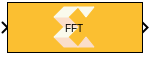
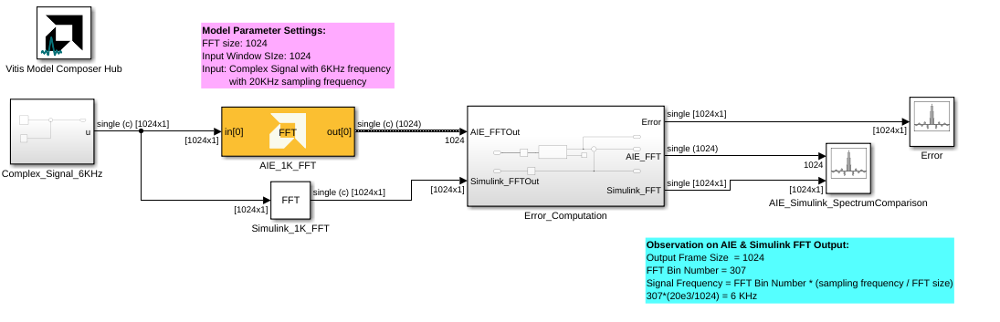
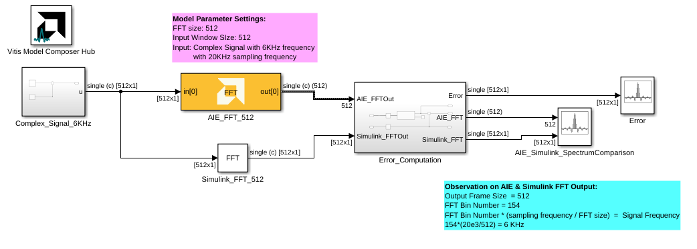

# FFT
  
  

## Library

AI Engine/DSP/Buffer IO

## Description

This block implements FFT targeted for AI Engines.

## Parameters

### Main  
#### Input/Output data type  
Set the input/output data type.

#### Twiddle factor data type
Describes the data type of the twiddle factors of the transform. It must be `cint16` or `cfloat` and must also satisfy the following rules:
* 32-bit twiddle factors are only supported when the input/output data type is also 32-bit.
* The twiddle factor data type must be an integer type if the input/output data type is an integer type.
* The twiddle factor data type must be `cfloat` if the input/output data type is a float type.

#### FFT size  
This is an unsigned integer which describes the point size of the
transformation. This must be 2^N, where N is in the range 4 to 12
inclusive.

#### Input Window Size(Number of Samples)  
Describes the number of samples used as an input to the FFT. This parameter should be an integer multiple of the _Point Size_, in which case multiple FFT iterations will be performed on a given input window. This reduces the number of times the kernel needs to be triggered and as a result the overhead incurred due to triggering the kernel is reduced and overall throughput increases. This parameter must be in the range of 2^4 and 2^12, inclusive.

#### Scale output down by 2^  
Describes the power of 2 to scale the result by prior to output.

#### Rounding mode

Describes the selection of rounding to be applied during the shift down stage of processing.

The following modes are available:
* **Round to positive infinity:** Round halfway towards positive infinity.
* **Round to negative infinity:** Round halfway towards negative infinity.
* **Round symmetrical to infinity:** Round halfway towards infinity (away from zero).
* **Round symmetrical to zero:** Round halfway towards zero (away from infinity).
* **Round convergent to even:** Round halfway towards nearest even number.
* **Round convergent to odd:** Round halfway towards nearest odd number.

These modes round to the nearest integer. They differ only in how they round for values that are exactly between two integers.

#### Saturation mode

Describes the selection of saturation to be applied during the shift down stage of processing.

The following modes are available:
* **None:** No saturation is performed and the value is truncated on the MSB side.
* **Asymmetric:** Rounds an n-bit signed value in the range `-2^(n-1)` to `2^(n-1)-1`.
* **Symmetric:** Rounds an n-bit signed value in the range `-2^(n-1)-1` to `2^(n-1)-1`.

#### Use Widget for SSR Kernels
This parameter is applicable to streaming and parallel (SSR>1) implementations of the FFT. These implementations require stream to window conversions on the hardware.

When this parameter is disabled, stream to window conversion will occur within the FFT kernels themselves.

When this parameter is enabled, stream to window conversion will occur on its own AI Engine tiles. This will improve performance at the expense of additional tiles being used.

####  Number of Cascade Stages
This determines the number of kernels the FFT will be divided over in series to improve throughput. For int data types, and FFT size of 2^N, the maximum cascade length is N/2 when N is even and (N+1)/2 when N is odd. For float data type, the maximum cascade length is N.

### Constraints
Click on the button given here to access the constraint manager and add or update constraints for each kernel. If you set the "Number of cascade stages" parameter to a value greater than one, multiple kernels will be used to process the input. You can use the constraint manager to optimize the performance of your design by setting specific constraints for each kernel (in this case, you need to first run your design). Adding constraints will not affect the functional simulation in Simulink. Constraints will only affect the generated graph code, cycle approximate AIE simulation (System C), and behavior in hardware.

If you are using non-default constraints for any of the kernels for the block, an asterisk (*) will be displayed next to the button.

## FFT Block Examples 
These examples compare the AI Engine FFT block in Vitis Model Composer with the Simulink FFT block.

***Click on the images below to open each model.***

**1024 point FFT:**

**512 point FFT:**

 

## References
This block uses the Vitis DSP library implementation of FFT. For more details on this implementation please click [here](https://docs.xilinx.com/r/en-US/Vitis_Libraries/dsp/user_guide/L2/func-fft.html).

--------------
Copyright (C) 2024 Advanced Micro Devices, Inc. All rights reserved.
SPDX-License-Identifier: MIT
