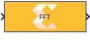
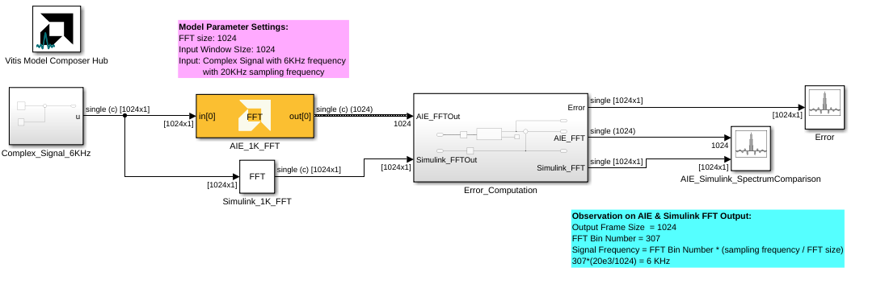
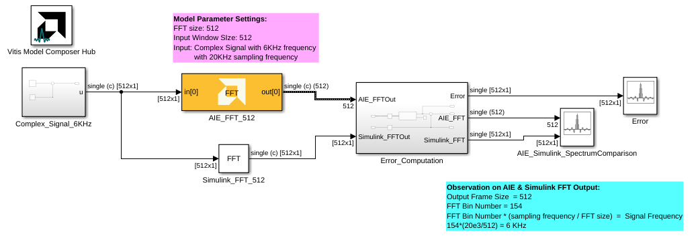

<!-- Library: aieDSP -->

# FFT
FFT implementation targeted for AI Engines.
  
  

## Library

AI Engine/DSP/Buffer IO

## Description

This block implements FFT targeted for AI Engines.

## Parameters

### Main  
#### Input data type  
Set the data type of the block input. The data type of the input signal to the block must match this setting. Valid types are `cint16`, `cint32`, `cfloat`.

#### Output data type
Set the data type of the block output. Valid types are `cint16`, `cint32`, `cfloat`.

#### Twiddle factor data type
Describes the data type of the twiddle factors of the transform. It must be `cint16`, `cint32`, or `cfloat` and must also satisfy the following rules:
* 32-bit twiddle factors are only supported when the input/output data type is also 32-bit.
* The twiddle factor data type must be an integer type if the input/output data type is an integer type.
* The twiddle factor data type must be `cfloat` if the input/output data type is a float type.

#### FFT size  
This is an unsigned integer which describes the point size of the
transformation. This must be 2^N, where N is in the range 4 to 12
inclusive.

#### Input window size (Number of samples)  
Describes the number of samples used as an input to the FFT. This parameter should be an integer multiple of the _Point Size_, in which case multiple FFT iterations will be performed on a given input window. This reduces the number of times the kernel needs to be triggered and as a result the overhead incurred due to triggering the kernel is reduced and overall throughput increases. This parameter must be in the range of 2^4 and 2^12, inclusive.

#### Scale output down by 2^  
Describes the power of 2 to scale the result by prior to output.

#### Rounding mode

Describes the selection of rounding to be applied during the shift down stage of processing.

The following modes are available:
* **Round to positive infinity:** Round halfway towards positive infinity.
* **Round to negative infinity:** Round halfway towards negative infinity.
* **Round symmetrical to infinity:** Round halfway towards infinity (away from zero).
* **Round symmetrical to zero:** Round halfway towards zero (away from infinity).
* **Round convergent to even:** Round halfway towards nearest even number.
* **Round convergent to odd:** Round halfway towards nearest odd number.

These modes round to the nearest integer. They differ only in how they round for values that are exactly between two integers.

#### Saturation mode

Describes the selection of saturation to be applied during the shift down stage of processing.

The following modes are available:
* **None:** No saturation is performed and the value is truncated on the MSB side.
* **Asymmetric:** Rounds an n-bit signed value in the range `-2^(n-1)` to `2^(n-1)-1`.
* **Symmetric:** Rounds an n-bit signed value in the range `-2^(n-1)-1` to `2^(n-1)-1`.

#### SSR
Specify the number of parallel input/output data paths. The specified value should be in the form of 2^N.

#### Twiddle Mode
This parameter controls the amplitude of the twiddle factors. It applies to `cint16` and `cint32` twiddle factors only; it does not apply to `cfloat` twiddle factors.

Twiddle mode 0 means use max amplitude twiddles which saturate at `2^(N-1)-1`, where N is the number of bits in the type (e.g. `cint16` has 16 bits per component).

Twiddle mode 1 means use 1/2 max magnitude twiddles, i.e. `2^(N-1)`. This avoids saturation, but loses 1 bit of precision and so noise overall will be higher.

#### Use Widget for SSR Kernels
This parameter is applicable to streaming and parallel (SSR>1) implementations of the FFT. These implementations require stream to window conversions on the hardware.

When this parameter is disabled, stream to window conversion will occur within the FFT kernels themselves.

When this parameter is enabled, stream to window conversion will occur on its own AI Engine tiles. This will improve performance at the expense of additional tiles being used.

####  Number of Cascade Stages
This determines the number of kernels the FFT will be divided over in series to improve throughput. For int data types, and FFT size of 2^N, the maximum cascade length is N/2 when N is even and (N+1)/2 when N is odd. For float data type, the maximum cascade length is N.

### Constraints
Click on the button given here to access the constraint manager and add or update constraints for each kernel. If you set the "Number of cascade stages" parameter to a value greater than one, multiple kernels will be used to process the input. You can use the constraint manager to optimize the performance of your design by setting specific constraints for each kernel (in this case, you need to first run your design). Adding constraints will not affect the functional simulation in Simulink. Constraints will only affect the generated graph code, cycle approximate AIE simulation (System C), and behavior in hardware.

If you are using non-default constraints for any of the kernels for the block, an asterisk (*) will be displayed next to the button.

## FFT Block Examples 
These examples compare the AI Engine FFT block in Vitis Model Composer with the Simulink FFT block.

***Click on the images below to open each model.***

**1024 point FFT:**

<!--
DESCRIPTION:
Model: FFT_Ex1
Generated: 09-Jan-2026 13:43:06

Vitis Model Composer Configuration:
  Target Device: xcve1752-nsvg1369-1LHP-i-L

Vitis Model Composer Blocks:
  - AIE: FFT
  - AIE: To Fixed Size

Description:
This MATLAB script creates a Vitis Model Composer Simulink model that uses the AI Engine FFT block. A 6kHz complex input signal is provided to the block,  and the block's output is compared to a Simulink golden reference.

-->

<!--
MATLAB CREATION SCRIPT:

% create_FFT_Ex1_model.m
% Auto-generated script to recreate the FFT_Ex1 Simulink model
% Generated on: 09-Jan-2026 13:43:06

%% Model Configuration
modelName = 'FFT_Ex1_recreated';

%% Create New Model
if bdIsLoaded(modelName)
    close_system(modelName, 0);
end

new_system(modelName);
open_system(modelName);
fprintf('Created new model: %s\n', modelName);

%% Add Vitis Model Composer Hub Block
hubBlockPath = [modelName '/Vitis Model Composer Hub'];
add_block('vmcUtilities/Vitis Model Composer Hub', hubBlockPath, ...
    'Position', [72 28 127 81]);

hubBlk = xmcFindHubBlock(modelName);
vmchub_set_param(hubBlk, modelName, 'SelectHardware', 'xcve1752-nsvg1369-1LHP-i-L');

%% Add Top-Level Blocks
add_block('built-in/ArrayPlot', [modelName '/AIE_Simulink_SpectrumComparison'], ...
    'Position', [960 227 1005 278]);
set_param([modelName '/AIE_Simulink_SpectrumComparison'], ...
    'NumInputPorts', '2', ...
    'OpenAtSimulationStart', 'on', ...
    'WindowPosition', '[83.000000,69.000000,1116.000000,539.000000,]', ...
    'XDataMode', 'Sample increment and X-offset', ...
    'SampleIncrement', '1', ...
    'XOffset', '0', ...
    'CustomXData', '[]', ...
    'XScale', 'Linear', ...
    'YScale', 'Linear', ...
    'PlotType', 'Line', ...
    'PlotBaseValue', '0', ...
    'AxesScaling', 'Manual', ...
    'AxesScalingNumUpdates', '100', ...
    'MaximizeAxes', 'Auto', ...
    'LayoutDimensions', '[1,1]', ...
    'ActiveDisplay', '1', ...
    'PlotAsMagnitudePhase', 'off', ...
    'YLabel', 'Amplitude', ...
    'YLimits', '[-100,1100]', ...
    'ShowGrid', 'on', ...
    'ShowLegend', 'on', ...
    'ChannelNames', '[]');
add_block('built-in/ArrayPlot', [modelName '/Error'], ...
    'Position', [1070 180 1115 230]);
set_param([modelName '/Error'], ...
    'NumInputPorts', '1', ...
    'OpenAtSimulationStart', 'on', ...
    'WindowPosition', '[178.000000,4.000000,1038.000000,500.000000,]', ...
    'XDataMode', 'Sample increment and X-offset', ...
    'SampleIncrement', '1', ...
    'XOffset', '0', ...
    'CustomXData', '[]', ...
    'XScale', 'Linear', ...
    'YScale', 'Linear', ...
    'PlotType', 'Stem', ...
    'PlotBaseValue', '0', ...
    'AxesScaling', 'OnceAtStop', ...
    'AxesScalingNumUpdates', '100', ...
    'MaximizeAxes', 'Auto', ...
    'LayoutDimensions', '[1,1]', ...
    'ActiveDisplay', '1', ...
    'PlotAsMagnitudePhase', 'off', ...
    'YLabel', 'Amplitude', ...
    'YLimits', '[-10,10]', ...
    'ShowGrid', 'on', ...
    'ShowLegend', 'off', ...
    'ChannelNames', '[]');
add_block('aieDSP/FFT', [modelName '/FFT'], ...
    'Position', [290 190 425 240]);
set_param([modelName '/FFT'], ...
    'data_type', 'cfloat', ...
    'data_out_type', 'cfloat', ...
    'twiddle_type', 'cfloat', ...
    'point_size', '1024', ...
    'input_window_size', '1024', ...
    'shift_val', '0', ...
    'rnd_mode', 'Round symmetrical to infinity', ...
    'sat_mode', '0-None', ...
    'ssr', '1', ...
    'twiddle_mode', '0', ...
    'use_ssr_widget_kernels', 'off', ...
    'casc_length', '1', ...
    'transform_fft_nifft', '1', ...
    'TP_API', '0', ...
    'TP_DYN_PT_SIZE', '0');
add_block('dspxfrm3/FFT', [modelName '/Simulink_1K_FFT'], ...
    'Position', [335 266 375 304]);
set_param([modelName '/Simulink_1K_FFT'], ...
    'FFTImplementation', 'Auto', ...
    'CompMethod', 'Table lookup', ...
    'TableOpt', 'NEW', ...
    'TableOptActive', 'Speed', ...
    'BitRevOrder', 'off', ...
    'Normalize', 'off', ...
    'InheritFFTLength', 'off', ...
    'FFTLength', '1024', ...
    'WrapInput', 'on', ...
    'roundingMode', 'Floor', ...
    'overflowMode', 'off', ...
    'firstCoeffMode', 'Same word length as input', ...
    'firstCoeffWordLength', '16', ...
    'firstCoeffFracLength', '15', ...
    'firstCoeffDataTypeStr', 'Inherit: Same word length as input', ...
    'firstCoeffLastDataTypeStr', 'Inherit: Same word length as input', ...
    'prodOutputMode', 'Inherit via internal rule', ...
    'prodOutputWordLength', '32', ...
    'prodOutputFracLength', '30', ...
    'prodOutputDataTypeStr', 'Inherit: Inherit via internal rule', ...
    'prodOutputLastDataTypeStr', 'Inherit: Inherit via internal rule', ...
    'accumMode', 'Inherit via internal rule', ...
    'accumWordLength', '32', ...
    'accumFracLength', '30', ...
    'accumDataTypeStr', 'Inherit: Inherit via internal rule', ...
    'accumLastDataTypeStr', 'Inherit: Inherit via internal rule', ...
    'outputMode', 'Inherit via internal rule', ...
    'outputWordLength', '16', ...
    'outputFracLength', '15', ...
    'outputDataTypeStr', 'Inherit: Inherit via internal rule', ...
    'outputMin', '[]', ...
    'outputMax', '[]', ...
    'outputLastDataTypeStr', 'Inherit: Inherit via internal rule', ...
    'LockScale', 'off');
add_block('vmcUtilities/Vitis Model Composer Hub', [modelName '/Vitis Model Composer Hub'], ...
    'Position', [72 28 127 81]);
set_param([modelName '/Vitis Model Composer Hub'], ...
    'CodeGeneration', 'off', ...
    'CompilationType', 'HDLCompilation', ...
    'ExportTypeV2', 'IP Catalog', ...
    'StartColumn', '1', ...
    'NumberOfColumns', '1', ...
    'TargetDirectory', './netlist', ...
    'exportDesign', 'off', ...
    'analyzeDesign', 'off', ...
    'validateDesignOnHw', 'off', ...
    'ExportType', 'AI Engines', ...
    'IpVendor', 'xilinx.com', ...
    'IpLibrary', 'hls', ...
    'IpVersion', '1.0', ...
    'IpHWLanguage', 'Verilog', ...
    'AieCompilerOptions', '{}', ...
    'CreateTestbench', 'off', ...
    'TestbenchStackSize', '10', ...
    'RunRtlSim', 'off', ...
    'RunCSim', 'off', ...
    'RunAieSim', 'off', ...
    'AieSimTimeout', '50000', ...
    'RunAieSimProfiling', 'off', ...
    'LaunchVitisAnalyzer', 'off', ...
    'PlotOutput', 'off', ...
    'GenHwImage', 'off', ...
    'GenLibadfXo', 'off', ...
    'GenHwValidationCode', 'off', ...
    'PlatformType', 'Not Specified', ...
    'HwSystemType', 'Baremetal', ...
    'HwValidationTarget', 'hw', ...
    'ProjDevice', 'xcve1752-nsvg1369-1LHP-i-L', ...
    'SamplePeriod', '-1', ...
    'ClockFrequency', '200', ...
    'DataPathParallelism', '1', ...
    'xilinxfamily', 'versalaiedge', ...
    'part', 'xcve1752', ...
    'speed', '-1LHP-i-L', ...
    'package', 'nsvg1369', ...
    'directory', './netlist', ...
    'testbench', 'off', ...
    'incr_netlist', 'off', ...
    'synthesis_tool', 'Vivado', ...
    'clock_wrapper', 'Clock Enables', ...
    'dbl_ovrd', 'According to Block Masks', ...
    'dcm_input_clock_period', '10', ...
    'sysclk_period', '10', ...
    'simulink_period', '1', ...
    'eval_field', '0', ...
    'LogFileName', '''''', ...
    'NThreads', '4');

%% Create Complex_Signal_6KHz Subsystem
add_block('built-in/SubSystem', [modelName '/Complex_Signal_6KHz'], ...
    'Position', [70 182 155 248]);

% Remove default blocks
defaultBlocks = find_system([modelName '/Complex_Signal_6KHz'], 'SearchDepth', 1, 'Type', 'block');
for i = 1:length(defaultBlocks)
    if ~strcmp(defaultBlocks{i}, [modelName '/Complex_Signal_6KHz'])
        delete_block(defaultBlocks{i});
    end
end

add_block('dspobslib/Random Source', [[modelName '/Complex_Signal_6KHz'] '/Random Noise'], ...
    'Position', [-185 121 -150 159]);
set_param([[modelName '/Complex_Signal_6KHz'] '/Random Noise'], ...
    'SrcType', 'Gaussian', ...
    'NormMethod', 'Ziggurat', ...
    'CltLength', '12', ...
    'MinVal', '0', ...
    'MaxVal', '1', ...
    'MeanVal', '0', ...
    'VarVal', '1e-3', ...
    'RepMode', 'Not repeatable', ...
    'rawSeed', '1', ...
    'IsInherit', 'off', ...
    'SampMode', 'Discrete', ...
    'SampTime', '1/20e3', ...
    'SampFrame', '1024', ...
    'DataType', 'Single', ...
    'OutComplex', 'Real', ...
    'OutputFrames', 'off');
add_block('dspsrcs4/Sine Wave', [[modelName '/Complex_Signal_6KHz'] '/Sine Wave'], ...
    'Position', [-190 23 -145 67]);
set_param([[modelName '/Complex_Signal_6KHz'] '/Sine Wave'], ...
    'Amplitude', '1', ...
    'Frequency', '6e3', ...
    'Phase', '0', ...
    'SampleMode', 'Discrete', ...
    'OutComplex', 'Complex', ...
    'CompMethod', 'Trigonometric fcn', ...
    'TableSize', 'Speed', ...
    'SampleTime', '1/20e3', ...
    'SamplesPerFrame', '1024', ...
    'ResetState', 'Restart at time zero', ...
    'OutputFrames', 'off', ...
    'additionalParams', 'off', ...
    'allowOverrides', 'on', ...
    'dataType', 'single', ...
    'wordLen', '16', ...
    'udDataType', 'sfix(16)', ...
    'fracBitsMode', 'Best precision', ...
    'numFracBits', '15', ...
    'OutDataTypeStr', 'single', ...
    'LastOutDataTypeStr', 'single');
add_block('built-in/Sum', [[modelName '/Complex_Signal_6KHz'] '/Sum'], ...
    'Position', [-40 35 -20 55]);
set_param([[modelName '/Complex_Signal_6KHz'] '/Sum'], ...
    'IconShape', 'round', ...
    'Inputs', '|++', ...
    'CollapseMode', 'All dimensions', ...
    'CollapseDim', '1', ...
    'OutMin', '[]', ...
    'OutMax', '[]', ...
    'OutDataTypeStr', 'Inherit: Inherit via internal rule', ...
    'AccumDataTypeStr', 'Inherit: Inherit via internal rule', ...
    'InputSameDT', 'off', ...
    'LockScale', 'off', ...
    'RndMeth', 'Floor', ...
    'SaturateOnIntegerOverflow', 'off', ...
    'SampleTime', '-1');
add_block('built-in/Outport', [[modelName '/Complex_Signal_6KHz'] '/u'], ...
    'Position', [120 38 150 52]);
set_param([[modelName '/Complex_Signal_6KHz'] '/u'], ...
    'Port', '1', ...
    'StorageClass', 'Auto', ...
    'IconDisplay', 'Port number', ...
    'OutputFunctionCall', 'off', ...
    'OutMin', '[]', ...
    'OutMax', '[]', ...
    'OutDataTypeStr', 'Inherit: auto', ...
    'LockScale', 'off', ...
    'BusOutputAsStruct', 'off', ...
    'BusVirtuality', 'inherit', ...
    'DataMode', 'inherit', ...
    'Unit', 'inherit', ...
    'PortDimensions', '-1', ...
    'VarSizeSig', 'Inherit', ...
    'SampleTime', '-1', ...
    'SignalType', 'auto', ...
    'EnsureOutportIsVirtual', 'off', ...
    'OutputWhenDisabled', 'held', ...
    'InitialOutput', '[]', ...
    'MustResolveToSignalObject', 'off', ...
    'OutputWhenUnConnected', 'off', ...
    'OutputWhenUnconnectedValue', '0', ...
    'VectorParamsAs1DForOutWhenUnconnected', 'on');

% Connect blocks in Complex_Signal_6KHz
add_line([modelName '/Complex_Signal_6KHz'], 'Random Noise/2', 'Sum/3', 'autorouting', 'on');
add_line([modelName '/Complex_Signal_6KHz'], 'Sum/2', 'u/2', 'autorouting', 'on');
add_line([modelName '/Complex_Signal_6KHz'], 'Sine Wave/2', 'Sum/2', 'autorouting', 'on');

%% Create Error_Computation Subsystem
add_block('built-in/SubSystem', [modelName '/Error_Computation'], ...
    'Position', [535 189 735 291]);

% Remove default blocks
defaultBlocks = find_system([modelName '/Error_Computation'], 'SearchDepth', 1, 'Type', 'block');
for i = 1:length(defaultBlocks)
    if ~strcmp(defaultBlocks{i}, [modelName '/Error_Computation'])
        delete_block(defaultBlocks{i});
    end
end

add_block('built-in/Inport', [[modelName '/Error_Computation'] '/AIE_FFTOut'], ...
    'Position', [-10 58 20 72]);
set_param([[modelName '/Error_Computation'] '/AIE_FFTOut'], ...
    'Port', '1', ...
    'IconDisplay', 'Port number', ...
    'OutputFunctionCall', 'off', ...
    'OutMin', '[]', ...
    'OutMax', '[]', ...
    'OutDataTypeStr', 'Inherit: auto', ...
    'LockScale', 'off', ...
    'BusOutputAsStruct', 'off', ...
    'BusVirtuality', 'inherit', ...
    'Unit', 'inherit', ...
    'PortDimensions', '-1', ...
    'VarSizeSig', 'Inherit', ...
    'SampleTime', '-1', ...
    'SignalType', 'auto', ...
    'LatchByDelayingOutsideSignal', 'off', ...
    'LatchInputForFeedbackSignals', 'off', ...
    'Interpolate', 'on', ...
    'DataMode', 'inherit', ...
    'MessageQueueUseDefaultAttributes', 'on', ...
    'MessageQueueCapacity', '1', ...
    'MessageQueueType', 'LIFO', ...
    'MessageQueueOverwriting', 'on');
add_block('built-in/Inport', [[modelName '/Error_Computation'] '/Simulink_FFTOut'], ...
    'Position', [-10 133 20 147]);
set_param([[modelName '/Error_Computation'] '/Simulink_FFTOut'], ...
    'Port', '2', ...
    'IconDisplay', 'Port number', ...
    'OutputFunctionCall', 'off', ...
    'OutMin', '[]', ...
    'OutMax', '[]', ...
    'OutDataTypeStr', 'Inherit: auto', ...
    'LockScale', 'off', ...
    'BusOutputAsStruct', 'off', ...
    'BusVirtuality', 'inherit', ...
    'Unit', 'inherit', ...
    'PortDimensions', '-1', ...
    'VarSizeSig', 'Inherit', ...
    'SampleTime', '-1', ...
    'SignalType', 'auto', ...
    'LatchByDelayingOutsideSignal', 'off', ...
    'LatchInputForFeedbackSignals', 'off', ...
    'Interpolate', 'on', ...
    'DataMode', 'inherit', ...
    'MessageQueueUseDefaultAttributes', 'on', ...
    'MessageQueueCapacity', '1', ...
    'MessageQueueType', 'LIFO', ...
    'MessageQueueOverwriting', 'on');
add_block('built-in/Abs', [[modelName '/Error_Computation'] '/Abs'], ...
    'Position', [100 125 130 155]);
set_param([[modelName '/Error_Computation'] '/Abs'], ...
    'ZeroCross', 'on', ...
    'SampleTime', '-1', ...
    'OutMin', '[]', ...
    'OutMax', '[]', ...
    'OutDataTypeStr', 'Inherit: Same as input', ...
    'LockScale', 'off', ...
    'RndMeth', 'Floor', ...
    'SaturateOnIntegerOverflow', 'off');
add_block('built-in/Abs', [[modelName '/Error_Computation'] '/Abs1'], ...
    'Position', [100 50 130 80]);
set_param([[modelName '/Error_Computation'] '/Abs1'], ...
    'ZeroCross', 'on', ...
    'SampleTime', '-1', ...
    'OutMin', '[]', ...
    'OutMax', '[]', ...
    'OutDataTypeStr', 'Inherit: Same as input', ...
    'LockScale', 'off', ...
    'RndMeth', 'Floor', ...
    'SaturateOnIntegerOverflow', 'off');
add_block('built-in/Sum', [[modelName '/Error_Computation'] '/Sum'], ...
    'Position', [390 40 410 60]);
set_param([[modelName '/Error_Computation'] '/Sum'], ...
    'IconShape', 'round', ...
    'Inputs', '|+-', ...
    'CollapseMode', 'All dimensions', ...
    'CollapseDim', '1', ...
    'OutMin', '[]', ...
    'OutMax', '[]', ...
    'OutDataTypeStr', 'Inherit: Inherit via internal rule', ...
    'AccumDataTypeStr', 'int32', ...
    'InputSameDT', 'off', ...
    'LockScale', 'off', ...
    'RndMeth', 'Floor', ...
    'SaturateOnIntegerOverflow', 'off', ...
    'SampleTime', '-1');
add_block('built-in/Terminator', [[modelName '/Error_Computation'] '/Terminator'], ...
    'Position', [350 65 370 85]);
add_block('aieUtilities/To Fixed Size', [[modelName '/Error_Computation'] '/To Fixed Size'], ...
    'Position', [175 42 290 98]);
set_param([[modelName '/Error_Computation'] '/To Fixed Size'], ...
    'Mode', 'Produce a valid output signal', ...
    'OutputSize', 'Inherit: Same as input', ...
    'CopyMethod', 'Buffer samples to form output', ...
    'HasStatusOutput', 'on');
add_block('built-in/Outport', [[modelName '/Error_Computation'] '/Error'], ...
    'Position', [560 43 590 57]);
set_param([[modelName '/Error_Computation'] '/Error'], ...
    'Port', '1', ...
    'StorageClass', 'Auto', ...
    'IconDisplay', 'Port number', ...
    'OutputFunctionCall', 'off', ...
    'OutMin', '[]', ...
    'OutMax', '[]', ...
    'OutDataTypeStr', 'Inherit: auto', ...
    'LockScale', 'off', ...
    'BusOutputAsStruct', 'off', ...
    'BusVirtuality', 'inherit', ...
    'DataMode', 'inherit', ...
    'Unit', 'inherit', ...
    'PortDimensions', '-1', ...
    'VarSizeSig', 'Inherit', ...
    'SampleTime', '-1', ...
    'SignalType', 'auto', ...
    'EnsureOutportIsVirtual', 'off', ...
    'OutputWhenDisabled', 'held', ...
    'InitialOutput', '[]', ...
    'MustResolveToSignalObject', 'off', ...
    'OutputWhenUnConnected', 'off', ...
    'OutputWhenUnconnectedValue', '0', ...
    'VectorParamsAs1DForOutWhenUnconnected', 'on');
add_block('built-in/Outport', [[modelName '/Error_Computation'] '/AIE_FFT'], ...
    'Position', [560 -7 590 7]);
set_param([[modelName '/Error_Computation'] '/AIE_FFT'], ...
    'Port', '2', ...
    'StorageClass', 'Auto', ...
    'IconDisplay', 'Port number', ...
    'OutputFunctionCall', 'off', ...
    'OutMin', '[]', ...
    'OutMax', '[]', ...
    'OutDataTypeStr', 'Inherit: auto', ...
    'LockScale', 'off', ...
    'BusOutputAsStruct', 'off', ...
    'BusVirtuality', 'inherit', ...
    'DataMode', 'inherit', ...
    'Unit', 'inherit', ...
    'PortDimensions', '-1', ...
    'VarSizeSig', 'Inherit', ...
    'SampleTime', '-1', ...
    'SignalType', 'auto', ...
    'EnsureOutportIsVirtual', 'off', ...
    'OutputWhenDisabled', 'held', ...
    'InitialOutput', '[]', ...
    'MustResolveToSignalObject', 'off', ...
    'OutputWhenUnConnected', 'off', ...
    'OutputWhenUnconnectedValue', '0', ...
    'VectorParamsAs1DForOutWhenUnconnected', 'on');
add_block('built-in/Outport', [[modelName '/Error_Computation'] '/Simulink_FFT'], ...
    'Position', [560 133 590 147]);
set_param([[modelName '/Error_Computation'] '/Simulink_FFT'], ...
    'Port', '3', ...
    'StorageClass', 'Auto', ...
    'IconDisplay', 'Port number', ...
    'OutputFunctionCall', 'off', ...
    'OutMin', '[]', ...
    'OutMax', '[]', ...
    'OutDataTypeStr', 'Inherit: auto', ...
    'LockScale', 'off', ...
    'BusOutputAsStruct', 'off', ...
    'BusVirtuality', 'inherit', ...
    'DataMode', 'inherit', ...
    'Unit', 'inherit', ...
    'PortDimensions', '-1', ...
    'VarSizeSig', 'Inherit', ...
    'SampleTime', '-1', ...
    'SignalType', 'auto', ...
    'EnsureOutportIsVirtual', 'off', ...
    'OutputWhenDisabled', 'held', ...
    'InitialOutput', '[]', ...
    'MustResolveToSignalObject', 'off', ...
    'OutputWhenUnConnected', 'off', ...
    'OutputWhenUnconnectedValue', '0', ...
    'VectorParamsAs1DForOutWhenUnconnected', 'on');

% Connect blocks in Error_Computation
add_line([modelName '/Error_Computation'], 'Abs/2', 'Simulink_FFT/2', 'autorouting', 'on');
add_line([modelName '/Error_Computation'], 'Abs/2', 'Sum/3', 'autorouting', 'on');
add_line([modelName '/Error_Computation'], 'Abs/2', 'Sum/3', 'autorouting', 'on');
add_line([modelName '/Error_Computation'], 'To Fixed Size/3', 'Terminator/2', 'autorouting', 'on');
add_line([modelName '/Error_Computation'], 'To Fixed Size/2', 'Sum/2', 'autorouting', 'on');
add_line([modelName '/Error_Computation'], 'To Fixed Size/2', 'AIE_FFT/2', 'autorouting', 'on');
add_line([modelName '/Error_Computation'], 'To Fixed Size/2', 'AIE_FFT/2', 'autorouting', 'on');
add_line([modelName '/Error_Computation'], 'Abs1/2', 'To Fixed Size/2', 'autorouting', 'on');
add_line([modelName '/Error_Computation'], 'Sum/2', 'Error/2', 'autorouting', 'on');
add_line([modelName '/Error_Computation'], 'Simulink_FFTOut/2', 'Abs/2', 'autorouting', 'on');
add_line([modelName '/Error_Computation'], 'AIE_FFTOut/2', 'Abs1/2', 'autorouting', 'on');

%% Connect Top-Level Blocks
add_line(modelName, 'FFT/2', 'Error_Computation/2', 'autorouting', 'on');
add_line(modelName, 'Error_Computation/4', 'AIE_Simulink_SpectrumComparison/3', 'autorouting', 'on');
add_line(modelName, 'Error_Computation/3', 'AIE_Simulink_SpectrumComparison/2', 'autorouting', 'on');
add_line(modelName, 'Error_Computation/2', 'Error/2', 'autorouting', 'on');
add_line(modelName, 'Simulink_1K_FFT/2', 'Error_Computation/3', 'autorouting', 'on');
add_line(modelName, 'Complex_Signal_6KHz/2', 'Simulink_1K_FFT/2', 'autorouting', 'on');
add_line(modelName, 'Complex_Signal_6KHz/2', 'FFT/2', 'autorouting', 'on');
add_line(modelName, 'Complex_Signal_6KHz/2', 'FFT/2', 'autorouting', 'on');

%% Save Model
save_system(modelName);
fprintf('\nModel saved: %s.slx\n', modelName);
-->

<!--
DESCRIPTION:
Model: FFT_Ex1
Generated: 09-Jan-2026 11:34:32

Vitis Model Composer Configuration:
  Target Device: xcve1752-nsvg1369-1LHP-i-L

Vitis Model Composer Blocks:
  - AIE: FFT
  - AIE: To Fixed Size

Description:
This MATLAB script creates a Vitis Model Composer Simulink model that uses the AI Engine FFT block. A 6kHz complex input is provided to the block, and the block's output is compared to a Simulink golden reference.

-->

<!--
MATLAB CREATION SCRIPT:

% create_FFT_Ex1_model.m
% Auto-generated script to recreate the FFT_Ex1 Simulink model
% Generated on: 09-Jan-2026 11:34:32

%% Model Configuration
modelName = 'FFT_Ex1_recreated';

%% Create New Model
if bdIsLoaded(modelName)
    close_system(modelName, 0);
end

new_system(modelName);
open_system(modelName);
fprintf('Created new model: %s\n', modelName);

%% Add Vitis Model Composer Hub Block
hubBlockPath = [modelName '/Vitis Model Composer Hub'];
add_block('vmcUtilities/Vitis Model Composer Hub', hubBlockPath, ...
    'Position', [72 28 127 81]);

hubBlk = xmcFindHubBlock(modelName);
vmchub_set_param(hubBlk, modelName, 'SelectHardware', 'xcve1752-nsvg1369-1LHP-i-L');

%% Add Top-Level Blocks
add_block('built-in/ArrayPlot', [modelName '/AIE_Simulink_SpectrumComparison'], ...
    'Position', [960 227 1005 278]);
set_param([modelName '/AIE_Simulink_SpectrumComparison'], ...
    'NumInputPorts', '2', ...
    'OpenAtSimulationStart', 'on', ...
    'WindowPosition', '[83.000000,69.000000,1116.000000,539.000000,]', ...
    'XDataMode', 'Sample increment and X-offset', ...
    'SampleIncrement', '1', ...
    'XOffset', '0', ...
    'CustomXData', '[]', ...
    'XScale', 'Linear', ...
    'YScale', 'Linear', ...
    'PlotType', 'Line', ...
    'PlotBaseValue', '0', ...
    'AxesScaling', 'Manual', ...
    'AxesScalingNumUpdates', '100', ...
    'MaximizeAxes', 'Auto', ...
    'LayoutDimensions', '[1,1]', ...
    'ActiveDisplay', '1', ...
    'PlotAsMagnitudePhase', 'off', ...
    'YLabel', 'Amplitude', ...
    'YLimits', '[-100,1100]', ...
    'ShowGrid', 'on', ...
    'ShowLegend', 'on', ...
    'ChannelNames', '[]');
add_block('built-in/ArrayPlot', [modelName '/Error'], ...
    'Position', [1070 180 1115 230]);
set_param([modelName '/Error'], ...
    'NumInputPorts', '1', ...
    'OpenAtSimulationStart', 'on', ...
    'WindowPosition', '[178.000000,33.000000,1038.000000,500.000000,]', ...
    'XDataMode', 'Sample increment and X-offset', ...
    'SampleIncrement', '1', ...
    'XOffset', '0', ...
    'CustomXData', '[]', ...
    'XScale', 'Linear', ...
    'YScale', 'Linear', ...
    'PlotType', 'Stem', ...
    'PlotBaseValue', '0', ...
    'AxesScaling', 'OnceAtStop', ...
    'AxesScalingNumUpdates', '100', ...
    'MaximizeAxes', 'Auto', ...
    'LayoutDimensions', '[1,1]', ...
    'ActiveDisplay', '1', ...
    'PlotAsMagnitudePhase', 'off', ...
    'YLabel', 'Amplitude', ...
    'YLimits', '[-10,10]', ...
    'ShowGrid', 'on', ...
    'ShowLegend', 'off', ...
    'ChannelNames', '[]');
add_block('aieDSP/FFT', [modelName '/FFT'], ...
    'Position', [290 190 425 240]);
set_param([modelName '/FFT'], ...
    'data_type', 'cfloat', ...
    'data_out_type', 'cfloat', ...
    'twiddle_type', 'cfloat', ...
    'point_size', '1024', ...
    'input_window_size', '1024', ...
    'shift_val', '0', ...
    'rnd_mode', 'Round symmetrical to infinity', ...
    'sat_mode', '0-None', ...
    'ssr', '1', ...
    'twiddle_mode', '0', ...
    'use_ssr_widget_kernels', 'off', ...
    'casc_length', '1', ...
    'transform_fft_nifft', '1', ...
    'TP_API', '0', ...
    'TP_DYN_PT_SIZE', '0');
add_block('dspxfrm3/FFT', [modelName '/Simulink_1K_FFT'], ...
    'Position', [335 266 375 304]);
set_param([modelName '/Simulink_1K_FFT'], ...
    'FFTImplementation', 'Auto', ...
    'CompMethod', 'Table lookup', ...
    'TableOpt', 'NEW', ...
    'TableOptActive', 'Speed', ...
    'BitRevOrder', 'off', ...
    'Normalize', 'off', ...
    'InheritFFTLength', 'off', ...
    'FFTLength', '1024', ...
    'WrapInput', 'on', ...
    'roundingMode', 'Floor', ...
    'overflowMode', 'off', ...
    'firstCoeffMode', 'Same word length as input', ...
    'firstCoeffWordLength', '16', ...
    'firstCoeffFracLength', '15', ...
    'firstCoeffDataTypeStr', 'Inherit: Same word length as input', ...
    'firstCoeffLastDataTypeStr', 'Inherit: Same word length as input', ...
    'prodOutputMode', 'Inherit via internal rule', ...
    'prodOutputWordLength', '32', ...
    'prodOutputFracLength', '30', ...
    'prodOutputDataTypeStr', 'Inherit: Inherit via internal rule', ...
    'prodOutputLastDataTypeStr', 'Inherit: Inherit via internal rule', ...
    'accumMode', 'Inherit via internal rule', ...
    'accumWordLength', '32', ...
    'accumFracLength', '30', ...
    'accumDataTypeStr', 'Inherit: Inherit via internal rule', ...
    'accumLastDataTypeStr', 'Inherit: Inherit via internal rule', ...
    'outputMode', 'Inherit via internal rule', ...
    'outputWordLength', '16', ...
    'outputFracLength', '15', ...
    'outputDataTypeStr', 'Inherit: Inherit via internal rule', ...
    'outputMin', '[]', ...
    'outputMax', '[]', ...
    'outputLastDataTypeStr', 'Inherit: Inherit via internal rule', ...
    'LockScale', 'off');
add_block('vmcUtilities/Vitis Model Composer Hub', [modelName '/Vitis Model Composer Hub'], ...
    'Position', [72 28 127 81]);
set_param([modelName '/Vitis Model Composer Hub'], ...
    'CodeGeneration', 'off', ...
    'CompilationType', 'HDLCompilation', ...
    'ExportTypeV2', 'IP Catalog', ...
    'StartColumn', '1', ...
    'NumberOfColumns', '1', ...
    'TargetDirectory', './netlist', ...
    'exportDesign', 'off', ...
    'analyzeDesign', 'off', ...
    'validateDesignOnHw', 'off', ...
    'ExportType', 'AI Engines', ...
    'IpVendor', 'xilinx.com', ...
    'IpLibrary', 'hls', ...
    'IpVersion', '1.0', ...
    'IpHWLanguage', 'Verilog', ...
    'AieCompilerOptions', '{}', ...
    'CreateTestbench', 'off', ...
    'TestbenchStackSize', '10', ...
    'RunRtlSim', 'off', ...
    'RunCSim', 'off', ...
    'RunAieSim', 'off', ...
    'AieSimTimeout', '50000', ...
    'RunAieSimProfiling', 'off', ...
    'LaunchVitisAnalyzer', 'off', ...
    'PlotOutput', 'off', ...
    'GenHwImage', 'off', ...
    'GenLibadfXo', 'off', ...
    'GenHwValidationCode', 'off', ...
    'PlatformType', 'Not Specified', ...
    'HwSystemType', 'Baremetal', ...
    'HwValidationTarget', 'hw', ...
    'ProjDevice', 'xcve1752-nsvg1369-1LHP-i-L', ...
    'SamplePeriod', '-1', ...
    'ClockFrequency', '200', ...
    'DataPathParallelism', '1', ...
    'xilinxfamily', 'versalaiedge', ...
    'part', 'xcve1752', ...
    'speed', '-1LHP-i-L', ...
    'package', 'nsvg1369', ...
    'directory', './netlist', ...
    'testbench', 'off', ...
    'incr_netlist', 'off', ...
    'synthesis_tool', 'Vivado', ...
    'clock_wrapper', 'Clock Enables', ...
    'dbl_ovrd', 'According to Block Masks', ...
    'dcm_input_clock_period', '10', ...
    'sysclk_period', '10', ...
    'simulink_period', '1', ...
    'eval_field', '0', ...
    'LogFileName', '''''', ...
    'NThreads', '4');

%% Create Complex_Signal_6KHz Subsystem
add_block('built-in/SubSystem', [modelName '/Complex_Signal_6KHz'], ...
    'Position', [70 182 155 248]);

% Remove default blocks
defaultBlocks = find_system([modelName '/Complex_Signal_6KHz'], 'SearchDepth', 1, 'Type', 'block');
for i = 1:length(defaultBlocks)
    if ~strcmp(defaultBlocks{i}, [modelName '/Complex_Signal_6KHz'])
        delete_block(defaultBlocks{i});
    end
end

add_block('dspobslib/Random Source', [[modelName '/Complex_Signal_6KHz'] '/Random Noise'], ...
    'Position', [-185 121 -150 159]);
set_param([[modelName '/Complex_Signal_6KHz'] '/Random Noise'], ...
    'SrcType', 'Gaussian', ...
    'NormMethod', 'Ziggurat', ...
    'CltLength', '12', ...
    'MinVal', '0', ...
    'MaxVal', '1', ...
    'MeanVal', '0', ...
    'VarVal', '1e-3', ...
    'RepMode', 'Not repeatable', ...
    'rawSeed', '1', ...
    'IsInherit', 'off', ...
    'SampMode', 'Discrete', ...
    'SampTime', '1/20e3', ...
    'SampFrame', '1024', ...
    'DataType', 'Single', ...
    'OutComplex', 'Real', ...
    'OutputFrames', 'off');
add_block('dspsrcs4/Sine Wave', [[modelName '/Complex_Signal_6KHz'] '/Sine Wave'], ...
    'Position', [-190 23 -145 67]);
set_param([[modelName '/Complex_Signal_6KHz'] '/Sine Wave'], ...
    'Amplitude', '1', ...
    'Frequency', '6e3', ...
    'Phase', '0', ...
    'SampleMode', 'Discrete', ...
    'OutComplex', 'Complex', ...
    'CompMethod', 'Trigonometric fcn', ...
    'TableSize', 'Speed', ...
    'SampleTime', '1/20e3', ...
    'SamplesPerFrame', '1024', ...
    'ResetState', 'Restart at time zero', ...
    'OutputFrames', 'off', ...
    'additionalParams', 'off', ...
    'allowOverrides', 'on', ...
    'dataType', 'single', ...
    'wordLen', '16', ...
    'udDataType', 'sfix(16)', ...
    'fracBitsMode', 'Best precision', ...
    'numFracBits', '15', ...
    'OutDataTypeStr', 'single', ...
    'LastOutDataTypeStr', 'single');
add_block('built-in/Sum', [[modelName '/Complex_Signal_6KHz'] '/Sum'], ...
    'Position', [-40 35 -20 55]);
set_param([[modelName '/Complex_Signal_6KHz'] '/Sum'], ...
    'IconShape', 'round', ...
    'Inputs', '|++', ...
    'CollapseMode', 'All dimensions', ...
    'CollapseDim', '1', ...
    'OutMin', '[]', ...
    'OutMax', '[]', ...
    'OutDataTypeStr', 'Inherit: Inherit via internal rule', ...
    'AccumDataTypeStr', 'Inherit: Inherit via internal rule', ...
    'InputSameDT', 'off', ...
    'LockScale', 'off', ...
    'RndMeth', 'Floor', ...
    'SaturateOnIntegerOverflow', 'off', ...
    'SampleTime', '-1');
add_block('built-in/Outport', [[modelName '/Complex_Signal_6KHz'] '/u'], ...
    'Position', [120 38 150 52]);
set_param([[modelName '/Complex_Signal_6KHz'] '/u'], ...
    'Port', '1', ...
    'StorageClass', 'Auto', ...
    'IconDisplay', 'Port number', ...
    'OutputFunctionCall', 'off', ...
    'OutMin', '[]', ...
    'OutMax', '[]', ...
    'OutDataTypeStr', 'Inherit: auto', ...
    'LockScale', 'off', ...
    'BusOutputAsStruct', 'off', ...
    'BusVirtuality', 'inherit', ...
    'DataMode', 'inherit', ...
    'Unit', 'inherit', ...
    'PortDimensions', '-1', ...
    'VarSizeSig', 'Inherit', ...
    'SampleTime', '-1', ...
    'SignalType', 'auto', ...
    'EnsureOutportIsVirtual', 'off', ...
    'OutputWhenDisabled', 'held', ...
    'InitialOutput', '[]', ...
    'MustResolveToSignalObject', 'off', ...
    'OutputWhenUnConnected', 'off', ...
    'OutputWhenUnconnectedValue', '0', ...
    'VectorParamsAs1DForOutWhenUnconnected', 'on');

% Connect blocks in Complex_Signal_6KHz
add_line([modelName '/Complex_Signal_6KHz'], 'Random Noise/2', 'Sum/3', 'autorouting', 'on');
add_line([modelName '/Complex_Signal_6KHz'], 'Sum/2', 'u/2', 'autorouting', 'on');
add_line([modelName '/Complex_Signal_6KHz'], 'Sine Wave/2', 'Sum/2', 'autorouting', 'on');

%% Create Error_Computation Subsystem
add_block('built-in/SubSystem', [modelName '/Error_Computation'], ...
    'Position', [535 189 735 291]);

% Remove default blocks
defaultBlocks = find_system([modelName '/Error_Computation'], 'SearchDepth', 1, 'Type', 'block');
for i = 1:length(defaultBlocks)
    if ~strcmp(defaultBlocks{i}, [modelName '/Error_Computation'])
        delete_block(defaultBlocks{i});
    end
end

add_block('built-in/Inport', [[modelName '/Error_Computation'] '/AIE_FFTOut'], ...
    'Position', [-10 58 20 72]);
set_param([[modelName '/Error_Computation'] '/AIE_FFTOut'], ...
    'Port', '1', ...
    'IconDisplay', 'Port number', ...
    'OutputFunctionCall', 'off', ...
    'OutMin', '[]', ...
    'OutMax', '[]', ...
    'OutDataTypeStr', 'Inherit: auto', ...
    'LockScale', 'off', ...
    'BusOutputAsStruct', 'off', ...
    'BusVirtuality', 'inherit', ...
    'Unit', 'inherit', ...
    'PortDimensions', '-1', ...
    'VarSizeSig', 'Inherit', ...
    'SampleTime', '-1', ...
    'SignalType', 'auto', ...
    'LatchByDelayingOutsideSignal', 'off', ...
    'LatchInputForFeedbackSignals', 'off', ...
    'Interpolate', 'on', ...
    'DataMode', 'inherit', ...
    'MessageQueueUseDefaultAttributes', 'on', ...
    'MessageQueueCapacity', '1', ...
    'MessageQueueType', 'LIFO', ...
    'MessageQueueOverwriting', 'on');
add_block('built-in/Inport', [[modelName '/Error_Computation'] '/Simulink_FFTOut'], ...
    'Position', [-10 133 20 147]);
set_param([[modelName '/Error_Computation'] '/Simulink_FFTOut'], ...
    'Port', '2', ...
    'IconDisplay', 'Port number', ...
    'OutputFunctionCall', 'off', ...
    'OutMin', '[]', ...
    'OutMax', '[]', ...
    'OutDataTypeStr', 'Inherit: auto', ...
    'LockScale', 'off', ...
    'BusOutputAsStruct', 'off', ...
    'BusVirtuality', 'inherit', ...
    'Unit', 'inherit', ...
    'PortDimensions', '-1', ...
    'VarSizeSig', 'Inherit', ...
    'SampleTime', '-1', ...
    'SignalType', 'auto', ...
    'LatchByDelayingOutsideSignal', 'off', ...
    'LatchInputForFeedbackSignals', 'off', ...
    'Interpolate', 'on', ...
    'DataMode', 'inherit', ...
    'MessageQueueUseDefaultAttributes', 'on', ...
    'MessageQueueCapacity', '1', ...
    'MessageQueueType', 'LIFO', ...
    'MessageQueueOverwriting', 'on');
add_block('built-in/Abs', [[modelName '/Error_Computation'] '/Abs'], ...
    'Position', [100 125 130 155]);
set_param([[modelName '/Error_Computation'] '/Abs'], ...
    'ZeroCross', 'on', ...
    'SampleTime', '-1', ...
    'OutMin', '[]', ...
    'OutMax', '[]', ...
    'OutDataTypeStr', 'Inherit: Same as input', ...
    'LockScale', 'off', ...
    'RndMeth', 'Floor', ...
    'SaturateOnIntegerOverflow', 'off');
add_block('built-in/Abs', [[modelName '/Error_Computation'] '/Abs1'], ...
    'Position', [100 50 130 80]);
set_param([[modelName '/Error_Computation'] '/Abs1'], ...
    'ZeroCross', 'on', ...
    'SampleTime', '-1', ...
    'OutMin', '[]', ...
    'OutMax', '[]', ...
    'OutDataTypeStr', 'Inherit: Same as input', ...
    'LockScale', 'off', ...
    'RndMeth', 'Floor', ...
    'SaturateOnIntegerOverflow', 'off');
add_block('built-in/Sum', [[modelName '/Error_Computation'] '/Sum'], ...
    'Position', [390 40 410 60]);
set_param([[modelName '/Error_Computation'] '/Sum'], ...
    'IconShape', 'round', ...
    'Inputs', '|+-', ...
    'CollapseMode', 'All dimensions', ...
    'CollapseDim', '1', ...
    'OutMin', '[]', ...
    'OutMax', '[]', ...
    'OutDataTypeStr', 'Inherit: Inherit via internal rule', ...
    'AccumDataTypeStr', 'int32', ...
    'InputSameDT', 'off', ...
    'LockScale', 'off', ...
    'RndMeth', 'Floor', ...
    'SaturateOnIntegerOverflow', 'off', ...
    'SampleTime', '-1');
add_block('built-in/Terminator', [[modelName '/Error_Computation'] '/Terminator'], ...
    'Position', [350 65 370 85]);
add_block('aieUtilities/To Fixed Size', [[modelName '/Error_Computation'] '/To Fixed Size'], ...
    'Position', [175 42 290 98]);
set_param([[modelName '/Error_Computation'] '/To Fixed Size'], ...
    'Mode', 'Produce a valid output signal', ...
    'OutputSize', 'Inherit: Same as input', ...
    'CopyMethod', 'Buffer samples to form output', ...
    'HasStatusOutput', 'on');
add_block('built-in/Outport', [[modelName '/Error_Computation'] '/Error'], ...
    'Position', [560 43 590 57]);
set_param([[modelName '/Error_Computation'] '/Error'], ...
    'Port', '1', ...
    'StorageClass', 'Auto', ...
    'IconDisplay', 'Port number', ...
    'OutputFunctionCall', 'off', ...
    'OutMin', '[]', ...
    'OutMax', '[]', ...
    'OutDataTypeStr', 'Inherit: auto', ...
    'LockScale', 'off', ...
    'BusOutputAsStruct', 'off', ...
    'BusVirtuality', 'inherit', ...
    'DataMode', 'inherit', ...
    'Unit', 'inherit', ...
    'PortDimensions', '-1', ...
    'VarSizeSig', 'Inherit', ...
    'SampleTime', '-1', ...
    'SignalType', 'auto', ...
    'EnsureOutportIsVirtual', 'off', ...
    'OutputWhenDisabled', 'held', ...
    'InitialOutput', '[]', ...
    'MustResolveToSignalObject', 'off', ...
    'OutputWhenUnConnected', 'off', ...
    'OutputWhenUnconnectedValue', '0', ...
    'VectorParamsAs1DForOutWhenUnconnected', 'on');
add_block('built-in/Outport', [[modelName '/Error_Computation'] '/AIE_FFT'], ...
    'Position', [560 -7 590 7]);
set_param([[modelName '/Error_Computation'] '/AIE_FFT'], ...
    'Port', '2', ...
    'StorageClass', 'Auto', ...
    'IconDisplay', 'Port number', ...
    'OutputFunctionCall', 'off', ...
    'OutMin', '[]', ...
    'OutMax', '[]', ...
    'OutDataTypeStr', 'Inherit: auto', ...
    'LockScale', 'off', ...
    'BusOutputAsStruct', 'off', ...
    'BusVirtuality', 'inherit', ...
    'DataMode', 'inherit', ...
    'Unit', 'inherit', ...
    'PortDimensions', '-1', ...
    'VarSizeSig', 'Inherit', ...
    'SampleTime', '-1', ...
    'SignalType', 'auto', ...
    'EnsureOutportIsVirtual', 'off', ...
    'OutputWhenDisabled', 'held', ...
    'InitialOutput', '[]', ...
    'MustResolveToSignalObject', 'off', ...
    'OutputWhenUnConnected', 'off', ...
    'OutputWhenUnconnectedValue', '0', ...
    'VectorParamsAs1DForOutWhenUnconnected', 'on');
add_block('built-in/Outport', [[modelName '/Error_Computation'] '/Simulink_FFT'], ...
    'Position', [560 133 590 147]);
set_param([[modelName '/Error_Computation'] '/Simulink_FFT'], ...
    'Port', '3', ...
    'StorageClass', 'Auto', ...
    'IconDisplay', 'Port number', ...
    'OutputFunctionCall', 'off', ...
    'OutMin', '[]', ...
    'OutMax', '[]', ...
    'OutDataTypeStr', 'Inherit: auto', ...
    'LockScale', 'off', ...
    'BusOutputAsStruct', 'off', ...
    'BusVirtuality', 'inherit', ...
    'DataMode', 'inherit', ...
    'Unit', 'inherit', ...
    'PortDimensions', '-1', ...
    'VarSizeSig', 'Inherit', ...
    'SampleTime', '-1', ...
    'SignalType', 'auto', ...
    'EnsureOutportIsVirtual', 'off', ...
    'OutputWhenDisabled', 'held', ...
    'InitialOutput', '[]', ...
    'MustResolveToSignalObject', 'off', ...
    'OutputWhenUnConnected', 'off', ...
    'OutputWhenUnconnectedValue', '0', ...
    'VectorParamsAs1DForOutWhenUnconnected', 'on');

% Connect blocks in Error_Computation
add_line([modelName '/Error_Computation'], 'Abs/2', 'Simulink_FFT/2', 'autorouting', 'on');
add_line([modelName '/Error_Computation'], 'Abs/2', 'Sum/3', 'autorouting', 'on');
add_line([modelName '/Error_Computation'], 'Abs/2', 'Sum/3', 'autorouting', 'on');
add_line([modelName '/Error_Computation'], 'To Fixed Size/3', 'Terminator/2', 'autorouting', 'on');
add_line([modelName '/Error_Computation'], 'To Fixed Size/2', 'Sum/2', 'autorouting', 'on');
add_line([modelName '/Error_Computation'], 'To Fixed Size/2', 'AIE_FFT/2', 'autorouting', 'on');
add_line([modelName '/Error_Computation'], 'To Fixed Size/2', 'AIE_FFT/2', 'autorouting', 'on');
add_line([modelName '/Error_Computation'], 'Abs1/2', 'To Fixed Size/2', 'autorouting', 'on');
add_line([modelName '/Error_Computation'], 'Sum/2', 'Error/2', 'autorouting', 'on');
add_line([modelName '/Error_Computation'], 'Simulink_FFTOut/2', 'Abs/2', 'autorouting', 'on');
add_line([modelName '/Error_Computation'], 'AIE_FFTOut/2', 'Abs1/2', 'autorouting', 'on');

%% Connect Top-Level Blocks
add_line(modelName, 'FFT/2', 'Error_Computation/2', 'autorouting', 'on');
add_line(modelName, 'Error_Computation/4', 'AIE_Simulink_SpectrumComparison/3', 'autorouting', 'on');
add_line(modelName, 'Error_Computation/3', 'AIE_Simulink_SpectrumComparison/2', 'autorouting', 'on');
add_line(modelName, 'Error_Computation/2', 'Error/2', 'autorouting', 'on');
add_line(modelName, 'Simulink_1K_FFT/2', 'Error_Computation/3', 'autorouting', 'on');
add_line(modelName, 'Complex_Signal_6KHz/2', 'Simulink_1K_FFT/2', 'autorouting', 'on');
add_line(modelName, 'Complex_Signal_6KHz/2', 'FFT/2', 'autorouting', 'on');
add_line(modelName, 'Complex_Signal_6KHz/2', 'FFT/2', 'autorouting', 'on');

%% Save Model
save_system(modelName);
fprintf('\nModel saved: %s.slx\n', modelName);
-->

**512 point FFT:**

<!--
DESCRIPTION:
Model: FFT_Ex2
Generated: 09-Jan-2026 13:43:06

Vitis Model Composer Configuration:
  Target Device: xcve1752-nsvg1369-1LHP-i-L

Vitis Model Composer Blocks:
  - AIE: FFT
  - AIE: To Fixed Size

Description:
This MATLAB script creates a Vitis Model Composer Simulink model that uses the AI Engine FFT block. A 6kHz complex input signal is provided to the block,  and the block's output is compared to a Simulink golden reference.

-->

<!--
MATLAB CREATION SCRIPT:

% create_FFT_Ex2_model.m
% Auto-generated script to recreate the FFT_Ex2 Simulink model
% Generated on: 09-Jan-2026 13:43:06

%% Model Configuration
modelName = 'FFT_Ex2_recreated';

%% Create New Model
if bdIsLoaded(modelName)
    close_system(modelName, 0);
end

new_system(modelName);
open_system(modelName);
fprintf('Created new model: %s\n', modelName);

%% Add Vitis Model Composer Hub Block
hubBlockPath = [modelName '/Vitis Model Composer Hub'];
add_block('vmcUtilities/Vitis Model Composer Hub', hubBlockPath, ...
    'Position', [57 108 112 161]);

hubBlk = xmcFindHubBlock(modelName);
vmchub_set_param(hubBlk, modelName, 'SelectHardware', 'xcve1752-nsvg1369-1LHP-i-L');

%% Add Top-Level Blocks
add_block('built-in/ArrayPlot', [modelName '/AIE_Simulink_SpectrumComparison'], ...
    'Position', [1000 312 1045 363]);
set_param([modelName '/AIE_Simulink_SpectrumComparison'], ...
    'NumInputPorts', '2', ...
    'OpenAtSimulationStart', 'on', ...
    'WindowPosition', '[83.000000,185.000000,845.000000,423.000000,]', ...
    'XDataMode', 'Sample increment and X-offset', ...
    'SampleIncrement', '1', ...
    'XOffset', '0', ...
    'CustomXData', '[]', ...
    'XScale', 'Linear', ...
    'YScale', 'Linear', ...
    'PlotType', 'Line', ...
    'PlotBaseValue', '0', ...
    'AxesScaling', 'Manual', ...
    'AxesScalingNumUpdates', '100', ...
    'MaximizeAxes', 'Auto', ...
    'LayoutDimensions', '[1,1]', ...
    'ActiveDisplay', '1', ...
    'PlotAsMagnitudePhase', 'off', ...
    'YLabel', 'Amplitude', ...
    'YLimits', '[-100,1100]', ...
    'ShowGrid', 'on', ...
    'ShowLegend', 'on', ...
    'ChannelNames', '[]');
add_block('built-in/ArrayPlot', [modelName '/Error'], ...
    'Position', [1000 235 1045 285]);
set_param([modelName '/Error'], ...
    'NumInputPorts', '1', ...
    'OpenAtSimulationStart', 'on', ...
    'WindowPosition', '[240.000000,110.000000,800.000000,500.000000,]', ...
    'XDataMode', 'Sample increment and X-offset', ...
    'SampleIncrement', '1', ...
    'XOffset', '0', ...
    'CustomXData', '[]', ...
    'XScale', 'Linear', ...
    'YScale', 'Linear', ...
    'PlotType', 'Stem', ...
    'PlotBaseValue', '0', ...
    'AxesScaling', 'OnceAtStop', ...
    'AxesScalingNumUpdates', '100', ...
    'MaximizeAxes', 'Auto', ...
    'LayoutDimensions', '[1,1]', ...
    'ActiveDisplay', '1', ...
    'PlotAsMagnitudePhase', 'off', ...
    'YLabel', 'Amplitude', ...
    'YLimits', '[-10,10]', ...
    'ShowGrid', 'on', ...
    'ShowLegend', 'off', ...
    'ChannelNames', '[]');
add_block('aieDSP/FFT', [modelName '/FFT'], ...
    'Position', [370 200 505 250]);
set_param([modelName '/FFT'], ...
    'data_type', 'cfloat', ...
    'data_out_type', 'cfloat', ...
    'twiddle_type', 'cfloat', ...
    'point_size', '512', ...
    'input_window_size', '512', ...
    'shift_val', '0', ...
    'rnd_mode', 'Round symmetrical to infinity', ...
    'sat_mode', '0-None', ...
    'ssr', '1', ...
    'twiddle_mode', '1', ...
    'use_ssr_widget_kernels', 'off', ...
    'casc_length', '1', ...
    'transform_fft_nifft', '1', ...
    'TP_API', '0', ...
    'TP_DYN_PT_SIZE', '0');
add_block('dspxfrm3/FFT', [modelName '/FFT1'], ...
    'Position', [420 296 460 334]);
set_param([modelName '/FFT1'], ...
    'FFTImplementation', 'Auto', ...
    'CompMethod', 'Table lookup', ...
    'TableOpt', 'NEW', ...
    'TableOptActive', 'Speed', ...
    'BitRevOrder', 'off', ...
    'Normalize', 'off', ...
    'InheritFFTLength', 'off', ...
    'FFTLength', '512', ...
    'WrapInput', 'on', ...
    'roundingMode', 'Floor', ...
    'overflowMode', 'off', ...
    'firstCoeffMode', 'Same word length as input', ...
    'firstCoeffWordLength', '16', ...
    'firstCoeffFracLength', '15', ...
    'firstCoeffDataTypeStr', 'Inherit: Same word length as input', ...
    'firstCoeffLastDataTypeStr', 'Inherit: Same word length as input', ...
    'prodOutputMode', 'Inherit via internal rule', ...
    'prodOutputWordLength', '32', ...
    'prodOutputFracLength', '30', ...
    'prodOutputDataTypeStr', 'Inherit: Inherit via internal rule', ...
    'prodOutputLastDataTypeStr', 'Inherit: Inherit via internal rule', ...
    'accumMode', 'Inherit via internal rule', ...
    'accumWordLength', '32', ...
    'accumFracLength', '30', ...
    'accumDataTypeStr', 'Inherit: Inherit via internal rule', ...
    'accumLastDataTypeStr', 'Inherit: Inherit via internal rule', ...
    'outputMode', 'Inherit via internal rule', ...
    'outputWordLength', '16', ...
    'outputFracLength', '15', ...
    'outputDataTypeStr', 'Inherit: Inherit via internal rule', ...
    'outputMin', '[]', ...
    'outputMax', '[]', ...
    'outputLastDataTypeStr', 'Inherit: Inherit via internal rule', ...
    'LockScale', 'off');
add_block('vmcUtilities/Vitis Model Composer Hub', [modelName '/Vitis Model Composer Hub'], ...
    'Position', [57 108 112 161]);
set_param([modelName '/Vitis Model Composer Hub'], ...
    'CodeGeneration', 'off', ...
    'CompilationType', 'HDLCompilation', ...
    'ExportTypeV2', 'IP Catalog', ...
    'StartColumn', '1', ...
    'NumberOfColumns', '1', ...
    'TargetDirectory', './netlist', ...
    'exportDesign', 'off', ...
    'analyzeDesign', 'off', ...
    'validateDesignOnHw', 'off', ...
    'ExportType', 'AI Engines', ...
    'IpVendor', 'xilinx.com', ...
    'IpLibrary', 'hls', ...
    'IpVersion', '1.0', ...
    'IpHWLanguage', 'Verilog', ...
    'AieCompilerOptions', '{}', ...
    'CreateTestbench', 'off', ...
    'TestbenchStackSize', '10', ...
    'RunRtlSim', 'off', ...
    'RunCSim', 'off', ...
    'RunAieSim', 'off', ...
    'AieSimTimeout', '50000', ...
    'RunAieSimProfiling', 'off', ...
    'LaunchVitisAnalyzer', 'off', ...
    'PlotOutput', 'off', ...
    'GenHwImage', 'off', ...
    'GenLibadfXo', 'off', ...
    'GenHwValidationCode', 'off', ...
    'PlatformType', 'Not Specified', ...
    'HwSystemType', 'Baremetal', ...
    'HwValidationTarget', 'hw', ...
    'ProjDevice', 'xcve1752-nsvg1369-1LHP-i-L', ...
    'SamplePeriod', '-1', ...
    'ClockFrequency', '200', ...
    'DataPathParallelism', '1', ...
    'xilinxfamily', 'versalaiedge', ...
    'part', 'xcve1752', ...
    'speed', '-1LHP-i-L', ...
    'package', 'nsvg1369', ...
    'directory', './netlist', ...
    'testbench', 'off', ...
    'incr_netlist', 'off', ...
    'synthesis_tool', 'Vivado', ...
    'clock_wrapper', 'Clock Enables', ...
    'dbl_ovrd', 'According to Block Masks', ...
    'dcm_input_clock_period', '10', ...
    'sysclk_period', '10', ...
    'simulink_period', '1', ...
    'eval_field', '0', ...
    'LogFileName', '''''', ...
    'NThreads', '4');

%% Create Complex_Signal_6KHz Subsystem
add_block('built-in/SubSystem', [modelName '/Complex_Signal_6KHz'], ...
    'Position', [155 192 240 258]);

% Remove default blocks
defaultBlocks = find_system([modelName '/Complex_Signal_6KHz'], 'SearchDepth', 1, 'Type', 'block');
for i = 1:length(defaultBlocks)
    if ~strcmp(defaultBlocks{i}, [modelName '/Complex_Signal_6KHz'])
        delete_block(defaultBlocks{i});
    end
end

add_block('dspobslib/Random Source', [[modelName '/Complex_Signal_6KHz'] '/Random Noise'], ...
    'Position', [-185 121 -150 159]);
set_param([[modelName '/Complex_Signal_6KHz'] '/Random Noise'], ...
    'SrcType', 'Gaussian', ...
    'NormMethod', 'Ziggurat', ...
    'CltLength', '12', ...
    'MinVal', '0', ...
    'MaxVal', '1', ...
    'MeanVal', '0', ...
    'VarVal', '1e-3', ...
    'RepMode', 'Not repeatable', ...
    'rawSeed', '1', ...
    'IsInherit', 'off', ...
    'SampMode', 'Discrete', ...
    'SampTime', '1/20e3', ...
    'SampFrame', '512', ...
    'DataType', 'Single', ...
    'OutComplex', 'Real', ...
    'OutputFrames', 'off');
add_block('dspsrcs4/Sine Wave', [[modelName '/Complex_Signal_6KHz'] '/Sine Wave'], ...
    'Position', [-190 23 -145 67]);
set_param([[modelName '/Complex_Signal_6KHz'] '/Sine Wave'], ...
    'Amplitude', '1', ...
    'Frequency', '6e3', ...
    'Phase', '0', ...
    'SampleMode', 'Discrete', ...
    'OutComplex', 'Complex', ...
    'CompMethod', 'Trigonometric fcn', ...
    'TableSize', 'Speed', ...
    'SampleTime', '1/20e3', ...
    'SamplesPerFrame', '512', ...
    'ResetState', 'Restart at time zero', ...
    'OutputFrames', 'off', ...
    'additionalParams', 'off', ...
    'allowOverrides', 'on', ...
    'dataType', 'single', ...
    'wordLen', '16', ...
    'udDataType', 'sfix(16)', ...
    'fracBitsMode', 'Best precision', ...
    'numFracBits', '15', ...
    'OutDataTypeStr', 'single', ...
    'LastOutDataTypeStr', 'single');
add_block('built-in/Sum', [[modelName '/Complex_Signal_6KHz'] '/Sum'], ...
    'Position', [-40 35 -20 55]);
set_param([[modelName '/Complex_Signal_6KHz'] '/Sum'], ...
    'IconShape', 'round', ...
    'Inputs', '|++', ...
    'CollapseMode', 'All dimensions', ...
    'CollapseDim', '1', ...
    'OutMin', '[]', ...
    'OutMax', '[]', ...
    'OutDataTypeStr', 'Inherit: Inherit via internal rule', ...
    'AccumDataTypeStr', 'Inherit: Inherit via internal rule', ...
    'InputSameDT', 'off', ...
    'LockScale', 'off', ...
    'RndMeth', 'Floor', ...
    'SaturateOnIntegerOverflow', 'off', ...
    'SampleTime', '-1');
add_block('built-in/Outport', [[modelName '/Complex_Signal_6KHz'] '/u'], ...
    'Position', [120 38 150 52]);
set_param([[modelName '/Complex_Signal_6KHz'] '/u'], ...
    'Port', '1', ...
    'StorageClass', 'Auto', ...
    'IconDisplay', 'Port number', ...
    'OutputFunctionCall', 'off', ...
    'OutMin', '[]', ...
    'OutMax', '[]', ...
    'OutDataTypeStr', 'Inherit: auto', ...
    'LockScale', 'off', ...
    'BusOutputAsStruct', 'off', ...
    'BusVirtuality', 'inherit', ...
    'DataMode', 'inherit', ...
    'Unit', 'inherit', ...
    'PortDimensions', '-1', ...
    'VarSizeSig', 'Inherit', ...
    'SampleTime', '-1', ...
    'SignalType', 'auto', ...
    'EnsureOutportIsVirtual', 'off', ...
    'OutputWhenDisabled', 'held', ...
    'InitialOutput', '[]', ...
    'MustResolveToSignalObject', 'off', ...
    'OutputWhenUnConnected', 'off', ...
    'OutputWhenUnconnectedValue', '0', ...
    'VectorParamsAs1DForOutWhenUnconnected', 'on');

% Connect blocks in Complex_Signal_6KHz
add_line([modelName '/Complex_Signal_6KHz'], 'Random Noise/2', 'Sum/3', 'autorouting', 'on');
add_line([modelName '/Complex_Signal_6KHz'], 'Sum/2', 'u/2', 'autorouting', 'on');
add_line([modelName '/Complex_Signal_6KHz'], 'Sine Wave/2', 'Sum/2', 'autorouting', 'on');

%% Create Error_Computation Subsystem
add_block('built-in/SubSystem', [modelName '/Error_Computation'], ...
    'Position', [640 252 795 308]);

% Remove default blocks
defaultBlocks = find_system([modelName '/Error_Computation'], 'SearchDepth', 1, 'Type', 'block');
for i = 1:length(defaultBlocks)
    if ~strcmp(defaultBlocks{i}, [modelName '/Error_Computation'])
        delete_block(defaultBlocks{i});
    end
end

add_block('built-in/Inport', [[modelName '/Error_Computation'] '/AIE_FFTOut'], ...
    'Position', [20 68 50 82]);
set_param([[modelName '/Error_Computation'] '/AIE_FFTOut'], ...
    'Port', '1', ...
    'IconDisplay', 'Port number', ...
    'OutputFunctionCall', 'off', ...
    'OutMin', '[]', ...
    'OutMax', '[]', ...
    'OutDataTypeStr', 'Inherit: auto', ...
    'LockScale', 'off', ...
    'BusOutputAsStruct', 'off', ...
    'BusVirtuality', 'inherit', ...
    'Unit', 'inherit', ...
    'PortDimensions', '-1', ...
    'VarSizeSig', 'Inherit', ...
    'SampleTime', '-1', ...
    'SignalType', 'auto', ...
    'LatchByDelayingOutsideSignal', 'off', ...
    'LatchInputForFeedbackSignals', 'off', ...
    'Interpolate', 'on', ...
    'DataMode', 'inherit', ...
    'MessageQueueUseDefaultAttributes', 'on', ...
    'MessageQueueCapacity', '1', ...
    'MessageQueueType', 'LIFO', ...
    'MessageQueueOverwriting', 'on');
add_block('built-in/Inport', [[modelName '/Error_Computation'] '/Simulink_FFTOut'], ...
    'Position', [20 133 50 147]);
set_param([[modelName '/Error_Computation'] '/Simulink_FFTOut'], ...
    'Port', '2', ...
    'IconDisplay', 'Port number', ...
    'OutputFunctionCall', 'off', ...
    'OutMin', '[]', ...
    'OutMax', '[]', ...
    'OutDataTypeStr', 'Inherit: auto', ...
    'LockScale', 'off', ...
    'BusOutputAsStruct', 'off', ...
    'BusVirtuality', 'inherit', ...
    'Unit', 'inherit', ...
    'PortDimensions', '-1', ...
    'VarSizeSig', 'Inherit', ...
    'SampleTime', '-1', ...
    'SignalType', 'auto', ...
    'LatchByDelayingOutsideSignal', 'off', ...
    'LatchInputForFeedbackSignals', 'off', ...
    'Interpolate', 'on', ...
    'DataMode', 'inherit', ...
    'MessageQueueUseDefaultAttributes', 'on', ...
    'MessageQueueCapacity', '1', ...
    'MessageQueueType', 'LIFO', ...
    'MessageQueueOverwriting', 'on');
add_block('built-in/Abs', [[modelName '/Error_Computation'] '/Abs'], ...
    'Position', [130 125 160 155]);
set_param([[modelName '/Error_Computation'] '/Abs'], ...
    'ZeroCross', 'on', ...
    'SampleTime', '-1', ...
    'OutMin', '[]', ...
    'OutMax', '[]', ...
    'OutDataTypeStr', 'Inherit: Same as input', ...
    'LockScale', 'off', ...
    'RndMeth', 'Floor', ...
    'SaturateOnIntegerOverflow', 'off');
add_block('built-in/Abs', [[modelName '/Error_Computation'] '/Abs1'], ...
    'Position', [115 60 145 90]);
set_param([[modelName '/Error_Computation'] '/Abs1'], ...
    'ZeroCross', 'on', ...
    'SampleTime', '-1', ...
    'OutMin', '[]', ...
    'OutMax', '[]', ...
    'OutDataTypeStr', 'Inherit: Same as input', ...
    'LockScale', 'off', ...
    'RndMeth', 'Floor', ...
    'SaturateOnIntegerOverflow', 'off');
add_block('built-in/Sum', [[modelName '/Error_Computation'] '/Sum'], ...
    'Position', [390 40 410 60]);
set_param([[modelName '/Error_Computation'] '/Sum'], ...
    'IconShape', 'round', ...
    'Inputs', '|+-', ...
    'CollapseMode', 'All dimensions', ...
    'CollapseDim', '1', ...
    'OutMin', '[]', ...
    'OutMax', '[]', ...
    'OutDataTypeStr', 'Inherit: Inherit via internal rule', ...
    'AccumDataTypeStr', 'int32', ...
    'InputSameDT', 'off', ...
    'LockScale', 'off', ...
    'RndMeth', 'Floor', ...
    'SaturateOnIntegerOverflow', 'off', ...
    'SampleTime', '-1');
add_block('built-in/Terminator', [[modelName '/Error_Computation'] '/Terminator'], ...
    'Position', [350 65 370 85]);
add_block('aieUtilities/To Fixed Size', [[modelName '/Error_Computation'] '/To Fixed Size'], ...
    'Position', [205 47 320 103]);
set_param([[modelName '/Error_Computation'] '/To Fixed Size'], ...
    'Mode', 'Produce a valid output signal', ...
    'OutputSize', '512*1', ...
    'CopyMethod', 'Buffer samples to form output', ...
    'HasStatusOutput', 'on');
add_block('built-in/Outport', [[modelName '/Error_Computation'] '/Error'], ...
    'Position', [525 43 555 57]);
set_param([[modelName '/Error_Computation'] '/Error'], ...
    'Port', '1', ...
    'StorageClass', 'Auto', ...
    'IconDisplay', 'Port number', ...
    'OutputFunctionCall', 'off', ...
    'OutMin', '[]', ...
    'OutMax', '[]', ...
    'OutDataTypeStr', 'Inherit: auto', ...
    'LockScale', 'off', ...
    'BusOutputAsStruct', 'off', ...
    'BusVirtuality', 'inherit', ...
    'DataMode', 'inherit', ...
    'Unit', 'inherit', ...
    'PortDimensions', '-1', ...
    'VarSizeSig', 'Inherit', ...
    'SampleTime', '-1', ...
    'SignalType', 'auto', ...
    'EnsureOutportIsVirtual', 'off', ...
    'OutputWhenDisabled', 'held', ...
    'InitialOutput', '[]', ...
    'MustResolveToSignalObject', 'off', ...
    'OutputWhenUnConnected', 'off', ...
    'OutputWhenUnconnectedValue', '0', ...
    'VectorParamsAs1DForOutWhenUnconnected', 'on');
add_block('built-in/Outport', [[modelName '/Error_Computation'] '/AIE_FFT'], ...
    'Position', [520 -47 550 -33]);
set_param([[modelName '/Error_Computation'] '/AIE_FFT'], ...
    'Port', '2', ...
    'StorageClass', 'Auto', ...
    'IconDisplay', 'Port number', ...
    'OutputFunctionCall', 'off', ...
    'OutMin', '[]', ...
    'OutMax', '[]', ...
    'OutDataTypeStr', 'Inherit: auto', ...
    'LockScale', 'off', ...
    'BusOutputAsStruct', 'off', ...
    'BusVirtuality', 'inherit', ...
    'DataMode', 'inherit', ...
    'Unit', 'inherit', ...
    'PortDimensions', '-1', ...
    'VarSizeSig', 'Inherit', ...
    'SampleTime', '-1', ...
    'SignalType', 'auto', ...
    'EnsureOutportIsVirtual', 'off', ...
    'OutputWhenDisabled', 'held', ...
    'InitialOutput', '[]', ...
    'MustResolveToSignalObject', 'off', ...
    'OutputWhenUnConnected', 'off', ...
    'OutputWhenUnconnectedValue', '0', ...
    'VectorParamsAs1DForOutWhenUnconnected', 'on');
add_block('built-in/Outport', [[modelName '/Error_Computation'] '/Simulink_FFT'], ...
    'Position', [520 133 550 147]);
set_param([[modelName '/Error_Computation'] '/Simulink_FFT'], ...
    'Port', '3', ...
    'StorageClass', 'Auto', ...
    'IconDisplay', 'Port number', ...
    'OutputFunctionCall', 'off', ...
    'OutMin', '[]', ...
    'OutMax', '[]', ...
    'OutDataTypeStr', 'Inherit: auto', ...
    'LockScale', 'off', ...
    'BusOutputAsStruct', 'off', ...
    'BusVirtuality', 'inherit', ...
    'DataMode', 'inherit', ...
    'Unit', 'inherit', ...
    'PortDimensions', '-1', ...
    'VarSizeSig', 'Inherit', ...
    'SampleTime', '-1', ...
    'SignalType', 'auto', ...
    'EnsureOutportIsVirtual', 'off', ...
    'OutputWhenDisabled', 'held', ...
    'InitialOutput', '[]', ...
    'MustResolveToSignalObject', 'off', ...
    'OutputWhenUnConnected', 'off', ...
    'OutputWhenUnconnectedValue', '0', ...
    'VectorParamsAs1DForOutWhenUnconnected', 'on');

% Connect blocks in Error_Computation
add_line([modelName '/Error_Computation'], 'Abs/2', 'Sum/3', 'autorouting', 'on');
add_line([modelName '/Error_Computation'], 'Abs/2', 'Simulink_FFT/2', 'autorouting', 'on');
add_line([modelName '/Error_Computation'], 'Abs/2', 'Simulink_FFT/2', 'autorouting', 'on');
add_line([modelName '/Error_Computation'], 'To Fixed Size/3', 'Terminator/2', 'autorouting', 'on');
add_line([modelName '/Error_Computation'], 'To Fixed Size/2', 'Sum/2', 'autorouting', 'on');
add_line([modelName '/Error_Computation'], 'To Fixed Size/2', 'AIE_FFT/2', 'autorouting', 'on');
add_line([modelName '/Error_Computation'], 'To Fixed Size/2', 'AIE_FFT/2', 'autorouting', 'on');
add_line([modelName '/Error_Computation'], 'Abs1/2', 'To Fixed Size/2', 'autorouting', 'on');
add_line([modelName '/Error_Computation'], 'Sum/2', 'Error/2', 'autorouting', 'on');
add_line([modelName '/Error_Computation'], 'Simulink_FFTOut/2', 'Abs/2', 'autorouting', 'on');
add_line([modelName '/Error_Computation'], 'AIE_FFTOut/2', 'Abs1/2', 'autorouting', 'on');

%% Connect Top-Level Blocks
add_line(modelName, 'Error_Computation/4', 'AIE_Simulink_SpectrumComparison/3', 'autorouting', 'on');
add_line(modelName, 'Error_Computation/2', 'Error/2', 'autorouting', 'on');
add_line(modelName, 'FFT1/2', 'Error_Computation/3', 'autorouting', 'on');
add_line(modelName, 'Complex_Signal_6KHz/2', 'FFT1/2', 'autorouting', 'on');
add_line(modelName, 'Complex_Signal_6KHz/2', 'FFT/2', 'autorouting', 'on');
add_line(modelName, 'Complex_Signal_6KHz/2', 'FFT/2', 'autorouting', 'on');
add_line(modelName, 'Error_Computation/3', 'AIE_Simulink_SpectrumComparison/2', 'autorouting', 'on');
add_line(modelName, 'FFT/2', 'Error_Computation/2', 'autorouting', 'on');

%% Save Model
save_system(modelName);
fprintf('\nModel saved: %s.slx\n', modelName);
-->

<!--
DESCRIPTION:
Model: FFT_Ex2
Generated: 09-Jan-2026 13:06:40

Vitis Model Composer Configuration:
  Target Device: xcve1752-nsvg1369-1LHP-i-L

Vitis Model Composer Blocks:
  - AIE: FFT
  - AIE: To Fixed Size

Description:
This MATLAB script creates a Vitis Model Composer Simulink model that uses the AI Engine FFT block. A 6kHz complex input signal is provided to the block,  and the block's output is compared to a Simulink golden reference.

-->

<!--
MATLAB CREATION SCRIPT:

% create_FFT_Ex2_model.m
% Auto-generated script to recreate the FFT_Ex2 Simulink model
% Generated on: 09-Jan-2026 13:06:40

%% Model Configuration
modelName = 'FFT_Ex2_recreated';

%% Create New Model
if bdIsLoaded(modelName)
    close_system(modelName, 0);
end

new_system(modelName);
open_system(modelName);
fprintf('Created new model: %s\n', modelName);

%% Add Vitis Model Composer Hub Block
hubBlockPath = [modelName '/Vitis Model Composer Hub'];
add_block('vmcUtilities/Vitis Model Composer Hub', hubBlockPath, ...
    'Position', [57 108 112 161]);

hubBlk = xmcFindHubBlock(modelName);
vmchub_set_param(hubBlk, modelName, 'SelectHardware', 'xcve1752-nsvg1369-1LHP-i-L');

%% Add Top-Level Blocks
add_block('built-in/ArrayPlot', [modelName '/AIE_Simulink_SpectrumComparison'], ...
    'Position', [1000 312 1045 363]);
set_param([modelName '/AIE_Simulink_SpectrumComparison'], ...
    'NumInputPorts', '2', ...
    'OpenAtSimulationStart', 'on', ...
    'WindowPosition', '[83.000000,185.000000,845.000000,423.000000,]', ...
    'XDataMode', 'Sample increment and X-offset', ...
    'SampleIncrement', '1', ...
    'XOffset', '0', ...
    'CustomXData', '[]', ...
    'XScale', 'Linear', ...
    'YScale', 'Linear', ...
    'PlotType', 'Line', ...
    'PlotBaseValue', '0', ...
    'AxesScaling', 'Manual', ...
    'AxesScalingNumUpdates', '100', ...
    'MaximizeAxes', 'Auto', ...
    'LayoutDimensions', '[1,1]', ...
    'ActiveDisplay', '1', ...
    'PlotAsMagnitudePhase', 'off', ...
    'YLabel', 'Amplitude', ...
    'YLimits', '[-100,1100]', ...
    'ShowGrid', 'on', ...
    'ShowLegend', 'on', ...
    'ChannelNames', '[]');
add_block('built-in/ArrayPlot', [modelName '/Error'], ...
    'Position', [1000 235 1045 285]);
set_param([modelName '/Error'], ...
    'NumInputPorts', '1', ...
    'OpenAtSimulationStart', 'on', ...
    'WindowPosition', '[240.000000,110.000000,800.000000,500.000000,]', ...
    'XDataMode', 'Sample increment and X-offset', ...
    'SampleIncrement', '1', ...
    'XOffset', '0', ...
    'CustomXData', '[]', ...
    'XScale', 'Linear', ...
    'YScale', 'Linear', ...
    'PlotType', 'Stem', ...
    'PlotBaseValue', '0', ...
    'AxesScaling', 'OnceAtStop', ...
    'AxesScalingNumUpdates', '100', ...
    'MaximizeAxes', 'Auto', ...
    'LayoutDimensions', '[1,1]', ...
    'ActiveDisplay', '1', ...
    'PlotAsMagnitudePhase', 'off', ...
    'YLabel', 'Amplitude', ...
    'YLimits', '[-10,10]', ...
    'ShowGrid', 'on', ...
    'ShowLegend', 'off', ...
    'ChannelNames', '[]');
add_block('aieDSP/FFT', [modelName '/FFT'], ...
    'Position', [370 200 505 250]);
set_param([modelName '/FFT'], ...
    'data_type', 'cfloat', ...
    'data_out_type', 'cfloat', ...
    'twiddle_type', 'cfloat', ...
    'point_size', '512', ...
    'input_window_size', '512', ...
    'shift_val', '0', ...
    'rnd_mode', 'Round symmetrical to infinity', ...
    'sat_mode', '0-None', ...
    'ssr', '1', ...
    'twiddle_mode', '1', ...
    'use_ssr_widget_kernels', 'off', ...
    'casc_length', '1', ...
    'transform_fft_nifft', '1', ...
    'TP_API', '0', ...
    'TP_DYN_PT_SIZE', '0');
add_block('dspxfrm3/FFT', [modelName '/FFT1'], ...
    'Position', [420 296 460 334]);
set_param([modelName '/FFT1'], ...
    'FFTImplementation', 'Auto', ...
    'CompMethod', 'Table lookup', ...
    'TableOpt', 'NEW', ...
    'TableOptActive', 'Speed', ...
    'BitRevOrder', 'off', ...
    'Normalize', 'off', ...
    'InheritFFTLength', 'off', ...
    'FFTLength', '512', ...
    'WrapInput', 'on', ...
    'roundingMode', 'Floor', ...
    'overflowMode', 'off', ...
    'firstCoeffMode', 'Same word length as input', ...
    'firstCoeffWordLength', '16', ...
    'firstCoeffFracLength', '15', ...
    'firstCoeffDataTypeStr', 'Inherit: Same word length as input', ...
    'firstCoeffLastDataTypeStr', 'Inherit: Same word length as input', ...
    'prodOutputMode', 'Inherit via internal rule', ...
    'prodOutputWordLength', '32', ...
    'prodOutputFracLength', '30', ...
    'prodOutputDataTypeStr', 'Inherit: Inherit via internal rule', ...
    'prodOutputLastDataTypeStr', 'Inherit: Inherit via internal rule', ...
    'accumMode', 'Inherit via internal rule', ...
    'accumWordLength', '32', ...
    'accumFracLength', '30', ...
    'accumDataTypeStr', 'Inherit: Inherit via internal rule', ...
    'accumLastDataTypeStr', 'Inherit: Inherit via internal rule', ...
    'outputMode', 'Inherit via internal rule', ...
    'outputWordLength', '16', ...
    'outputFracLength', '15', ...
    'outputDataTypeStr', 'Inherit: Inherit via internal rule', ...
    'outputMin', '[]', ...
    'outputMax', '[]', ...
    'outputLastDataTypeStr', 'Inherit: Inherit via internal rule', ...
    'LockScale', 'off');
add_block('vmcUtilities/Vitis Model Composer Hub', [modelName '/Vitis Model Composer Hub'], ...
    'Position', [57 108 112 161]);
set_param([modelName '/Vitis Model Composer Hub'], ...
    'CodeGeneration', 'off', ...
    'CompilationType', 'HDLCompilation', ...
    'ExportTypeV2', 'IP Catalog', ...
    'StartColumn', '1', ...
    'NumberOfColumns', '1', ...
    'TargetDirectory', './netlist', ...
    'exportDesign', 'off', ...
    'analyzeDesign', 'off', ...
    'validateDesignOnHw', 'off', ...
    'ExportType', 'AI Engines', ...
    'IpVendor', 'xilinx.com', ...
    'IpLibrary', 'hls', ...
    'IpVersion', '1.0', ...
    'IpHWLanguage', 'Verilog', ...
    'AieCompilerOptions', '{}', ...
    'CreateTestbench', 'off', ...
    'TestbenchStackSize', '10', ...
    'RunRtlSim', 'off', ...
    'RunCSim', 'off', ...
    'RunAieSim', 'off', ...
    'AieSimTimeout', '50000', ...
    'RunAieSimProfiling', 'off', ...
    'LaunchVitisAnalyzer', 'off', ...
    'PlotOutput', 'off', ...
    'GenHwImage', 'off', ...
    'GenLibadfXo', 'off', ...
    'GenHwValidationCode', 'off', ...
    'PlatformType', 'Not Specified', ...
    'HwSystemType', 'Baremetal', ...
    'HwValidationTarget', 'hw', ...
    'ProjDevice', 'xcve1752-nsvg1369-1LHP-i-L', ...
    'SamplePeriod', '-1', ...
    'ClockFrequency', '200', ...
    'DataPathParallelism', '1', ...
    'xilinxfamily', 'versalaiedge', ...
    'part', 'xcve1752', ...
    'speed', '-1LHP-i-L', ...
    'package', 'nsvg1369', ...
    'directory', './netlist', ...
    'testbench', 'off', ...
    'incr_netlist', 'off', ...
    'synthesis_tool', 'Vivado', ...
    'clock_wrapper', 'Clock Enables', ...
    'dbl_ovrd', 'According to Block Masks', ...
    'dcm_input_clock_period', '10', ...
    'sysclk_period', '10', ...
    'simulink_period', '1', ...
    'eval_field', '0', ...
    'LogFileName', '''''', ...
    'NThreads', '4');

%% Create Complex_Signal_6KHz Subsystem
add_block('built-in/SubSystem', [modelName '/Complex_Signal_6KHz'], ...
    'Position', [155 192 240 258]);

% Remove default blocks
defaultBlocks = find_system([modelName '/Complex_Signal_6KHz'], 'SearchDepth', 1, 'Type', 'block');
for i = 1:length(defaultBlocks)
    if ~strcmp(defaultBlocks{i}, [modelName '/Complex_Signal_6KHz'])
        delete_block(defaultBlocks{i});
    end
end

add_block('dspobslib/Random Source', [[modelName '/Complex_Signal_6KHz'] '/Random Noise'], ...
    'Position', [-185 121 -150 159]);
set_param([[modelName '/Complex_Signal_6KHz'] '/Random Noise'], ...
    'SrcType', 'Gaussian', ...
    'NormMethod', 'Ziggurat', ...
    'CltLength', '12', ...
    'MinVal', '0', ...
    'MaxVal', '1', ...
    'MeanVal', '0', ...
    'VarVal', '1e-3', ...
    'RepMode', 'Not repeatable', ...
    'rawSeed', '1', ...
    'IsInherit', 'off', ...
    'SampMode', 'Discrete', ...
    'SampTime', '1/20e3', ...
    'SampFrame', '512', ...
    'DataType', 'Single', ...
    'OutComplex', 'Real', ...
    'OutputFrames', 'off');
add_block('dspsrcs4/Sine Wave', [[modelName '/Complex_Signal_6KHz'] '/Sine Wave'], ...
    'Position', [-190 23 -145 67]);
set_param([[modelName '/Complex_Signal_6KHz'] '/Sine Wave'], ...
    'Amplitude', '1', ...
    'Frequency', '6e3', ...
    'Phase', '0', ...
    'SampleMode', 'Discrete', ...
    'OutComplex', 'Complex', ...
    'CompMethod', 'Trigonometric fcn', ...
    'TableSize', 'Speed', ...
    'SampleTime', '1/20e3', ...
    'SamplesPerFrame', '512', ...
    'ResetState', 'Restart at time zero', ...
    'OutputFrames', 'off', ...
    'additionalParams', 'off', ...
    'allowOverrides', 'on', ...
    'dataType', 'single', ...
    'wordLen', '16', ...
    'udDataType', 'sfix(16)', ...
    'fracBitsMode', 'Best precision', ...
    'numFracBits', '15', ...
    'OutDataTypeStr', 'single', ...
    'LastOutDataTypeStr', 'single');
add_block('built-in/Sum', [[modelName '/Complex_Signal_6KHz'] '/Sum'], ...
    'Position', [-40 35 -20 55]);
set_param([[modelName '/Complex_Signal_6KHz'] '/Sum'], ...
    'IconShape', 'round', ...
    'Inputs', '|++', ...
    'CollapseMode', 'All dimensions', ...
    'CollapseDim', '1', ...
    'OutMin', '[]', ...
    'OutMax', '[]', ...
    'OutDataTypeStr', 'Inherit: Inherit via internal rule', ...
    'AccumDataTypeStr', 'Inherit: Inherit via internal rule', ...
    'InputSameDT', 'off', ...
    'LockScale', 'off', ...
    'RndMeth', 'Floor', ...
    'SaturateOnIntegerOverflow', 'off', ...
    'SampleTime', '-1');
add_block('built-in/Outport', [[modelName '/Complex_Signal_6KHz'] '/u'], ...
    'Position', [120 38 150 52]);
set_param([[modelName '/Complex_Signal_6KHz'] '/u'], ...
    'Port', '1', ...
    'StorageClass', 'Auto', ...
    'IconDisplay', 'Port number', ...
    'OutputFunctionCall', 'off', ...
    'OutMin', '[]', ...
    'OutMax', '[]', ...
    'OutDataTypeStr', 'Inherit: auto', ...
    'LockScale', 'off', ...
    'BusOutputAsStruct', 'off', ...
    'BusVirtuality', 'inherit', ...
    'DataMode', 'inherit', ...
    'Unit', 'inherit', ...
    'PortDimensions', '-1', ...
    'VarSizeSig', 'Inherit', ...
    'SampleTime', '-1', ...
    'SignalType', 'auto', ...
    'EnsureOutportIsVirtual', 'off', ...
    'OutputWhenDisabled', 'held', ...
    'InitialOutput', '[]', ...
    'MustResolveToSignalObject', 'off', ...
    'OutputWhenUnConnected', 'off', ...
    'OutputWhenUnconnectedValue', '0', ...
    'VectorParamsAs1DForOutWhenUnconnected', 'on');

% Connect blocks in Complex_Signal_6KHz
add_line([modelName '/Complex_Signal_6KHz'], 'Random Noise/2', 'Sum/3', 'autorouting', 'on');
add_line([modelName '/Complex_Signal_6KHz'], 'Sum/2', 'u/2', 'autorouting', 'on');
add_line([modelName '/Complex_Signal_6KHz'], 'Sine Wave/2', 'Sum/2', 'autorouting', 'on');

%% Create Error_Computation Subsystem
add_block('built-in/SubSystem', [modelName '/Error_Computation'], ...
    'Position', [640 252 795 308]);

% Remove default blocks
defaultBlocks = find_system([modelName '/Error_Computation'], 'SearchDepth', 1, 'Type', 'block');
for i = 1:length(defaultBlocks)
    if ~strcmp(defaultBlocks{i}, [modelName '/Error_Computation'])
        delete_block(defaultBlocks{i});
    end
end

add_block('built-in/Inport', [[modelName '/Error_Computation'] '/AIE_FFTOut'], ...
    'Position', [20 68 50 82]);
set_param([[modelName '/Error_Computation'] '/AIE_FFTOut'], ...
    'Port', '1', ...
    'IconDisplay', 'Port number', ...
    'OutputFunctionCall', 'off', ...
    'OutMin', '[]', ...
    'OutMax', '[]', ...
    'OutDataTypeStr', 'Inherit: auto', ...
    'LockScale', 'off', ...
    'BusOutputAsStruct', 'off', ...
    'BusVirtuality', 'inherit', ...
    'Unit', 'inherit', ...
    'PortDimensions', '-1', ...
    'VarSizeSig', 'Inherit', ...
    'SampleTime', '-1', ...
    'SignalType', 'auto', ...
    'LatchByDelayingOutsideSignal', 'off', ...
    'LatchInputForFeedbackSignals', 'off', ...
    'Interpolate', 'on', ...
    'DataMode', 'inherit', ...
    'MessageQueueUseDefaultAttributes', 'on', ...
    'MessageQueueCapacity', '1', ...
    'MessageQueueType', 'LIFO', ...
    'MessageQueueOverwriting', 'on');
add_block('built-in/Inport', [[modelName '/Error_Computation'] '/Simulink_FFTOut'], ...
    'Position', [20 133 50 147]);
set_param([[modelName '/Error_Computation'] '/Simulink_FFTOut'], ...
    'Port', '2', ...
    'IconDisplay', 'Port number', ...
    'OutputFunctionCall', 'off', ...
    'OutMin', '[]', ...
    'OutMax', '[]', ...
    'OutDataTypeStr', 'Inherit: auto', ...
    'LockScale', 'off', ...
    'BusOutputAsStruct', 'off', ...
    'BusVirtuality', 'inherit', ...
    'Unit', 'inherit', ...
    'PortDimensions', '-1', ...
    'VarSizeSig', 'Inherit', ...
    'SampleTime', '-1', ...
    'SignalType', 'auto', ...
    'LatchByDelayingOutsideSignal', 'off', ...
    'LatchInputForFeedbackSignals', 'off', ...
    'Interpolate', 'on', ...
    'DataMode', 'inherit', ...
    'MessageQueueUseDefaultAttributes', 'on', ...
    'MessageQueueCapacity', '1', ...
    'MessageQueueType', 'LIFO', ...
    'MessageQueueOverwriting', 'on');
add_block('built-in/Abs', [[modelName '/Error_Computation'] '/Abs'], ...
    'Position', [130 125 160 155]);
set_param([[modelName '/Error_Computation'] '/Abs'], ...
    'ZeroCross', 'on', ...
    'SampleTime', '-1', ...
    'OutMin', '[]', ...
    'OutMax', '[]', ...
    'OutDataTypeStr', 'Inherit: Same as input', ...
    'LockScale', 'off', ...
    'RndMeth', 'Floor', ...
    'SaturateOnIntegerOverflow', 'off');
add_block('built-in/Abs', [[modelName '/Error_Computation'] '/Abs1'], ...
    'Position', [115 60 145 90]);
set_param([[modelName '/Error_Computation'] '/Abs1'], ...
    'ZeroCross', 'on', ...
    'SampleTime', '-1', ...
    'OutMin', '[]', ...
    'OutMax', '[]', ...
    'OutDataTypeStr', 'Inherit: Same as input', ...
    'LockScale', 'off', ...
    'RndMeth', 'Floor', ...
    'SaturateOnIntegerOverflow', 'off');
add_block('built-in/Sum', [[modelName '/Error_Computation'] '/Sum'], ...
    'Position', [390 40 410 60]);
set_param([[modelName '/Error_Computation'] '/Sum'], ...
    'IconShape', 'round', ...
    'Inputs', '|+-', ...
    'CollapseMode', 'All dimensions', ...
    'CollapseDim', '1', ...
    'OutMin', '[]', ...
    'OutMax', '[]', ...
    'OutDataTypeStr', 'Inherit: Inherit via internal rule', ...
    'AccumDataTypeStr', 'int32', ...
    'InputSameDT', 'off', ...
    'LockScale', 'off', ...
    'RndMeth', 'Floor', ...
    'SaturateOnIntegerOverflow', 'off', ...
    'SampleTime', '-1');
add_block('built-in/Terminator', [[modelName '/Error_Computation'] '/Terminator'], ...
    'Position', [350 65 370 85]);
add_block('aieUtilities/To Fixed Size', [[modelName '/Error_Computation'] '/To Fixed Size'], ...
    'Position', [205 47 320 103]);
set_param([[modelName '/Error_Computation'] '/To Fixed Size'], ...
    'Mode', 'Produce a valid output signal', ...
    'OutputSize', '512*1', ...
    'CopyMethod', 'Buffer samples to form output', ...
    'HasStatusOutput', 'on');
add_block('built-in/Outport', [[modelName '/Error_Computation'] '/Error'], ...
    'Position', [525 43 555 57]);
set_param([[modelName '/Error_Computation'] '/Error'], ...
    'Port', '1', ...
    'StorageClass', 'Auto', ...
    'IconDisplay', 'Port number', ...
    'OutputFunctionCall', 'off', ...
    'OutMin', '[]', ...
    'OutMax', '[]', ...
    'OutDataTypeStr', 'Inherit: auto', ...
    'LockScale', 'off', ...
    'BusOutputAsStruct', 'off', ...
    'BusVirtuality', 'inherit', ...
    'DataMode', 'inherit', ...
    'Unit', 'inherit', ...
    'PortDimensions', '-1', ...
    'VarSizeSig', 'Inherit', ...
    'SampleTime', '-1', ...
    'SignalType', 'auto', ...
    'EnsureOutportIsVirtual', 'off', ...
    'OutputWhenDisabled', 'held', ...
    'InitialOutput', '[]', ...
    'MustResolveToSignalObject', 'off', ...
    'OutputWhenUnConnected', 'off', ...
    'OutputWhenUnconnectedValue', '0', ...
    'VectorParamsAs1DForOutWhenUnconnected', 'on');
add_block('built-in/Outport', [[modelName '/Error_Computation'] '/AIE_FFT'], ...
    'Position', [520 -47 550 -33]);
set_param([[modelName '/Error_Computation'] '/AIE_FFT'], ...
    'Port', '2', ...
    'StorageClass', 'Auto', ...
    'IconDisplay', 'Port number', ...
    'OutputFunctionCall', 'off', ...
    'OutMin', '[]', ...
    'OutMax', '[]', ...
    'OutDataTypeStr', 'Inherit: auto', ...
    'LockScale', 'off', ...
    'BusOutputAsStruct', 'off', ...
    'BusVirtuality', 'inherit', ...
    'DataMode', 'inherit', ...
    'Unit', 'inherit', ...
    'PortDimensions', '-1', ...
    'VarSizeSig', 'Inherit', ...
    'SampleTime', '-1', ...
    'SignalType', 'auto', ...
    'EnsureOutportIsVirtual', 'off', ...
    'OutputWhenDisabled', 'held', ...
    'InitialOutput', '[]', ...
    'MustResolveToSignalObject', 'off', ...
    'OutputWhenUnConnected', 'off', ...
    'OutputWhenUnconnectedValue', '0', ...
    'VectorParamsAs1DForOutWhenUnconnected', 'on');
add_block('built-in/Outport', [[modelName '/Error_Computation'] '/Simulink_FFT'], ...
    'Position', [520 133 550 147]);
set_param([[modelName '/Error_Computation'] '/Simulink_FFT'], ...
    'Port', '3', ...
    'StorageClass', 'Auto', ...
    'IconDisplay', 'Port number', ...
    'OutputFunctionCall', 'off', ...
    'OutMin', '[]', ...
    'OutMax', '[]', ...
    'OutDataTypeStr', 'Inherit: auto', ...
    'LockScale', 'off', ...
    'BusOutputAsStruct', 'off', ...
    'BusVirtuality', 'inherit', ...
    'DataMode', 'inherit', ...
    'Unit', 'inherit', ...
    'PortDimensions', '-1', ...
    'VarSizeSig', 'Inherit', ...
    'SampleTime', '-1', ...
    'SignalType', 'auto', ...
    'EnsureOutportIsVirtual', 'off', ...
    'OutputWhenDisabled', 'held', ...
    'InitialOutput', '[]', ...
    'MustResolveToSignalObject', 'off', ...
    'OutputWhenUnConnected', 'off', ...
    'OutputWhenUnconnectedValue', '0', ...
    'VectorParamsAs1DForOutWhenUnconnected', 'on');

% Connect blocks in Error_Computation
add_line([modelName '/Error_Computation'], 'Abs/2', 'Sum/3', 'autorouting', 'on');
add_line([modelName '/Error_Computation'], 'Abs/2', 'Simulink_FFT/2', 'autorouting', 'on');
add_line([modelName '/Error_Computation'], 'Abs/2', 'Simulink_FFT/2', 'autorouting', 'on');
add_line([modelName '/Error_Computation'], 'To Fixed Size/3', 'Terminator/2', 'autorouting', 'on');
add_line([modelName '/Error_Computation'], 'To Fixed Size/2', 'Sum/2', 'autorouting', 'on');
add_line([modelName '/Error_Computation'], 'To Fixed Size/2', 'AIE_FFT/2', 'autorouting', 'on');
add_line([modelName '/Error_Computation'], 'To Fixed Size/2', 'AIE_FFT/2', 'autorouting', 'on');
add_line([modelName '/Error_Computation'], 'Abs1/2', 'To Fixed Size/2', 'autorouting', 'on');
add_line([modelName '/Error_Computation'], 'Sum/2', 'Error/2', 'autorouting', 'on');
add_line([modelName '/Error_Computation'], 'Simulink_FFTOut/2', 'Abs/2', 'autorouting', 'on');
add_line([modelName '/Error_Computation'], 'AIE_FFTOut/2', 'Abs1/2', 'autorouting', 'on');

%% Connect Top-Level Blocks
add_line(modelName, 'Error_Computation/4', 'AIE_Simulink_SpectrumComparison/3', 'autorouting', 'on');
add_line(modelName, 'Error_Computation/2', 'Error/2', 'autorouting', 'on');
add_line(modelName, 'FFT1/2', 'Error_Computation/3', 'autorouting', 'on');
add_line(modelName, 'Complex_Signal_6KHz/2', 'FFT1/2', 'autorouting', 'on');
add_line(modelName, 'Complex_Signal_6KHz/2', 'FFT/2', 'autorouting', 'on');
add_line(modelName, 'Complex_Signal_6KHz/2', 'FFT/2', 'autorouting', 'on');
add_line(modelName, 'Error_Computation/3', 'AIE_Simulink_SpectrumComparison/2', 'autorouting', 'on');
add_line(modelName, 'FFT/2', 'Error_Computation/2', 'autorouting', 'on');

%% Save Model
save_system(modelName);
fprintf('\nModel saved: %s.slx\n', modelName);
--> 

## References
This block uses the Vitis DSP library implementation of FFT. For more details on this implementation please click [here](https://docs.xilinx.com/r/en-US/Vitis_Libraries/dsp/user_guide/L2/func-fft-ifft-aie-only.html).

--------------
Copyright (C) 2025 Advanced Micro Devices, Inc.
All rights reserved.

SPDX-License-Identifier: MIT
