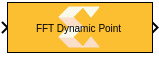
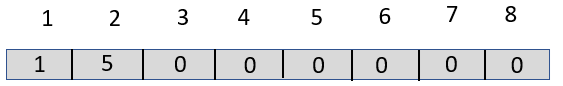

# FFT Dynamic Point

  
  

## Library

AI Engine/DSP/Window IO

## Description

FFT Dynamic Point implementation targeted for AI Engines. This block
supports performing different lengths of FFT on different input data
windows. Each window must be preceded by a 256-bit header which
describes run-time parameters of that window. The format of the header
is described below.

Note:

- Every input frame must be appended by a header.
- If the FFT size (N) is smaller than the frame size, the block takes
  the N point FFT of the first N samples in the input frame, and
  discards the rest of the samples in the frame.
- If the frame size is an integer multiple (M) of max FFT size, M FFT
  iterations will be performed on a given input frame, resulting in
  multiple iterations of output samples, reducing the number of times
  the kernel needs to be triggered to process a given number of input
  data samples. As a result, the overheads incurred during kernel
  triggering are reduced and overall performance is increased

Figure: Header Format


[TABLE]

Table 1. Header Format

## Example Header Format

To implement the 32-point size FFT of '`cint16`' datatype, the format of
the header that should be preceded to the input data window should be as
shown.

  
  

## Example (Input to Dynamic Point FFT)

To implement the FFT of different sizes, say, 64, 32 and 128, of type
`cint32`, the format of the input should be as follows.

``` pre
complex([1 6 0 0 ones(1,64) 1 5 0 0 ones(1,32) 1 7 0 0 ones(1,128)])
```

## Parameters

Main  
Input Data Type/Output Data Type:

- Describes the type of individual data samples input/output of the
  dynamic point FFT. It can be `cint16`, `cint32`, `cfloat` types.

FFT Maximum Size:

- Specifies the maximum FFT size that is supported by Dynamic point FFT.
  You can perform different lengths of FFT on different input data
  windows. It must be a power of `2` with a minimum value of `16`. The
  maximum value supported by the library element is `65536`.

Input Window Size:

- Specifies the number of samples in the input window excluding the
  header. The value must be in the range `8` to `1024` and the default
  value is `64`.

Scale Output down by 2^:

- Describes the power of 2 shift down applied to the accumulation of FIR
  terms before output. It must be in the range `0` to `61`.

Advanced  
Target Output Throughput (MSPS):

- Specifies the output sampling rate of the DDS function in Mega Samples
  per Second (MSPS). The value must be in the range `1` to `1000` and
  the default value is `200`.

Specify the Number of Cascade Stages:

- When this option is not enabled, the tool will determine the FFT
  configuration that best achieves the specified input sampling rate.
  When the option is enabled, the Number of cascade stages can be
  specified (which describes the number of AI Engine processors to split
  the operation over). This allows resources to be traded for higher
  performance, but the specified input sampling rate constraint may not
  be achieved. The value must be in the range of `1` to `9`.
