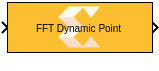
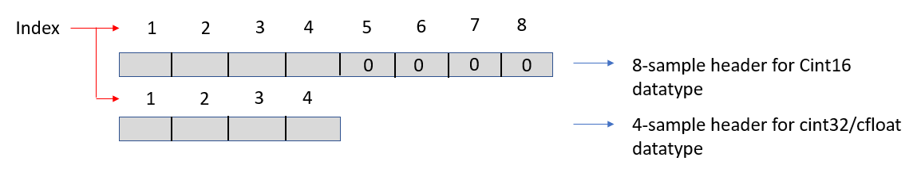
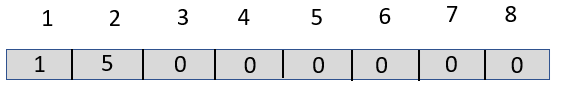
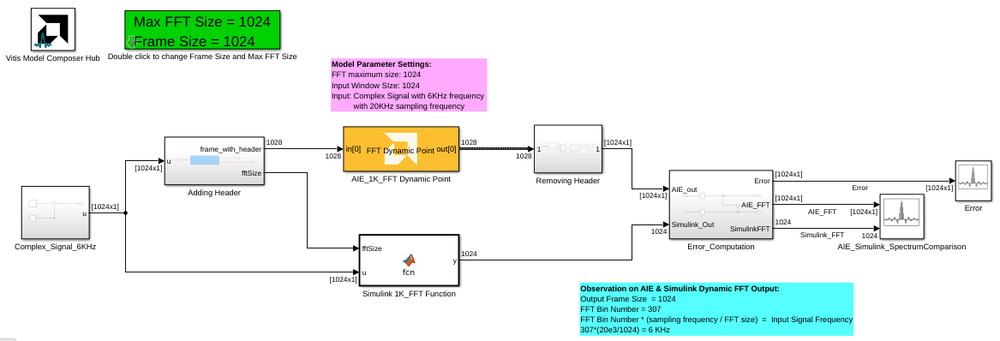
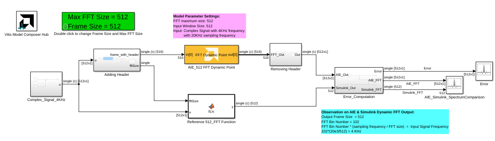

<!-- Library: aieDSP -->

# FFT Dynamic Point
FFT Dynamic Point implementation targeted for AI Engines.
  
  

## Library

AI Engine/DSP/Buffer IO

## Description

FFT Dynamic Point implementation targeted for AI Engines. This block
supports performing different lengths of FFT on different input data
windows. Each window must be preceded by a 256-bit header which
describes run-time parameters of that window. The format of the header
is described below.

**Note**:

- Every input frame must be prepended by a header.
- If the FFT size (N) is smaller than the frame size, the block takes
  the N point FFT of the first N samples in the input frame, and
  discards the rest of the samples in the frame.
- If the frame size is an integer multiple (M) of max FFT size, M FFT
  iterations will be performed on a given input frame, resulting in
  multiple iterations of output samples, reducing the number of times
  the kernel needs to be triggered to process a given number of input
  data samples. As a result, the overheads incurred during kernel
  triggering are reduced and overall performance is increased



| Index      | Field Name          | Description  |
| :------------- |:-------------| :-----|
| 1     | Direction |0 = Inverse FFT <br /> 1= Forward FFT |
| 2      |Point size (radix 2 stages)     |Point size described as power of 2. For example, value '5' describes a point size of '32' |
| 3 |Reserved     |   Reserved |
| 4 |Status (output only)           |0 = Legal point size <br /> 1 = Illegal point size     |


## Parameters

### Main  
#### Input data type  
Set the data type of the block input. The data type of the input signal to the block must match this setting. Valid types are `cint16`, `cint32`, `cfloat`.

#### Output data type
Set the data type of the block output. Valid types are `cint16`, `cint32`, `cfloat`.

#### Twiddle factor data type
Describes the data type of the twiddle factors of the transform. It must be `cint16` or `cfloat` and must also satisfy the following rules:
* 32-bit twiddle factors are only supported when the input/output data type is also 32-bit.
* The twiddle factor data type must be an integer type if the input/output data type is an integer type.
* The twiddle factor data type must be `cfloat` if the input/output data type is a float type.

#### FFT Maximum Size

Specifies the maximum FFT size that is supported by Dynamic point FFT.
  You can perform different lengths of FFT on different input data
  windows. It must be a power of 2 with a minimum value of 16. The
  maximum value supported by the library element is 65536.

#### Input Window Size

Specifies the number of samples in the input window excluding the
  header. The value must be in the range 8 to 1024 and the default
  value is 64.

#### Scale Output down by 2^

Describes the power of 2 shift down applied to output. It must be in the range 0 to 61.

#### Rounding mode

Describes the selection of rounding to be applied during the shift down stage of processing.

The following modes are available:
* **Round to positive infinity:** Round halfway towards positive infinity.
* **Round to negative infinity:** Round halfway towards negative infinity.
* **Round symmetrical to infinity:** Round halfway towards infinity (away from zero).
* **Round symmetrical to zero:** Round halfway towards zero (away from infinity).
* **Round convergent to even:** Round halfway towards nearest even number.
* **Round convergent to odd:** Round halfway towards nearest odd number.

These modes round to the nearest integer. They differ only in how they round for values that are exactly between two integers.

#### Saturation mode

Describes the selection of saturation to be applied during the shift down stage of processing.

The following modes are available:
* **None:** No saturation is performed and the value is truncated on the MSB side.
* **Asymmetric:** Rounds an n-bit signed value in the range `-2^(n-1)` to `2^(n-1)-1`.
* **Symmetric:** Rounds an n-bit signed value in the range `-2^(n-1)-1` to `2^(n-1)-1`.

#### Use Widget for SSR Kernels
This parameter is applicable to streaming and parallel (SSR>1) implementations of the FFT. These implementations require stream to window conversions on the hardware.

When this parameter is disabled, stream to window conversion will occur within the FFT kernels themselves.

When this parameter is enabled, stream to window conversion will occur on its own AI Engine tiles. This will improve performance at the expense of additional tiles being used.

####  Number of Cascade Stages
This determines the number of kernels the FFT will be divided over in series to improve throughput. For int data types, and FFT size of 2^N, the maximum cascade length is N/2 when N is even and (N+1)/2 when N is odd. For float data type, the maximum cascade length is N.

### Constraints
Click on the button given here to access the constraint manager and add or update constraints for each kernel. If you set the "Number of cascade stages" parameter to a value greater than one, multiple kernels will be used to process the input. You can use the constraint manager to optimize the performance of your design by setting specific constraints for each kernel (in this case, you need to first run your design). Adding constraints will not affect the functional simulation in Simulink. Constraints will only affect the generated graph code, cycle approximate AIE simulation (System C), and behavior in hardware.

<div class="noteBox">
If you are using non-default constraints for any of the kernels for the block, an asterisk (*) will be displayed next to the button.
</div>

### Header Format
To implement the 32-point size FFT of 'cint16' datatype, the format of
the header that should be prepended to the input data window is as follows:

 

### Input Format
To implement the FFT of different sizes, say, 64, 32 and 128, of type
cint32, the format of the input should be as follows.

``` pre
complex([1 6 0 0 ones(1,64) 1 5 0 0 ones(1,32) 1 7 0 0 ones(1,128)])
```

The terms "ones(1,X)" in the expression above are just replacements for the data that we are applying the FFT to.

## Examples

***Click on the images below to open each model.***

[](https://github.com/Xilinx/Vitis_Model_Composer/tree/2025.2/Examples/Block_Help/AIE/DynamicFFT_Ex1)


<!--
DESCRIPTION:
Model: DynamicFFT_Ex1
Generated: 09-Jan-2026 13:42:48

Vitis Model Composer Configuration:
  Target Device: xcvc1902-vsva2197-1LP-e-S

Vitis Model Composer Blocks:
  - AIE: FFT Dynamic Point
  - AIE: To Fixed Size

Description:
This MATLAB script creates a Vitis Model Composer Simulink model that uses the AI Engine FFT Dynamic Point block. A 6kHz complex input signal is provided to the block,  and the output is visualized for analysis.

-->

<!--
MATLAB CREATION SCRIPT:

% create_DynamicFFT_Ex1_model.m
% Auto-generated script to recreate the DynamicFFT_Ex1 Simulink model
% Generated on: 09-Jan-2026 13:42:48

%% Model Configuration
modelName = 'DynamicFFT_Ex1_recreated';

%% Create New Model
if bdIsLoaded(modelName)
    close_system(modelName, 0);
end

new_system(modelName);
open_system(modelName);
fprintf('Created new model: %s\n', modelName);

%% Add Vitis Model Composer Hub Block
hubBlockPath = [modelName '/Vitis Model Composer Hub'];
add_block('vmcUtilities/Vitis Model Composer Hub', hubBlockPath, ...
    'Position', [-23 8 32 61]);

hubBlk = xmcFindHubBlock(modelName);
vmchub_set_param(hubBlk, modelName, 'SelectHardware', 'xcvc1902-vsva2197-1LP-e-S');

%% Add Top-Level Blocks
add_block('aieDSP/FFT Dynamic Point', [modelName '/AIE_1K_FFT Dynamic Point'], ...
    'Position', [445 100 590 150]);
set_param([modelName '/AIE_1K_FFT Dynamic Point'], ...
    'data_type', 'cfloat', ...
    'data_out_type', 'cfloat', ...
    'twiddle_type', 'cfloat', ...
    'point_size', '1024', ...
    'input_window_size', '1024', ...
    'shift_val', '0', ...
    'rnd_mode', 'Round symmetrical to infinity', ...
    'sat_mode', '0-None', ...
    'ssr', '1', ...
    'twiddle_mode', '0', ...
    'use_ssr_widget_kernels', 'off', ...
    'casc_length', '1', ...
    'transform_fft_nifft', '1', ...
    'TP_API', '0', ...
    'TP_DYN_PT_SIZE', '1');
add_block('built-in/ArrayPlot', [modelName '/AIE_Simulink_SpectrumComparison'], ...
    'Position', [1125 202 1170 253]);
set_param([modelName '/AIE_Simulink_SpectrumComparison'], ...
    'NumInputPorts', '2', ...
    'OpenAtSimulationStart', 'on', ...
    'WindowPosition', '[83.000000,185.000000,845.000000,423.000000,]', ...
    'XDataMode', 'Sample increment and X-offset', ...
    'SampleIncrement', '1', ...
    'XOffset', '0', ...
    'CustomXData', '[]', ...
    'XScale', 'Linear', ...
    'YScale', 'Linear', ...
    'PlotType', 'Line', ...
    'PlotBaseValue', '0', ...
    'AxesScaling', 'Manual', ...
    'AxesScalingNumUpdates', '100', ...
    'MaximizeAxes', 'Auto', ...
    'LayoutDimensions', '[1,1]', ...
    'ActiveDisplay', '1', ...
    'PlotAsMagnitudePhase', 'off', ...
    'YLabel', 'Amplitude', ...
    'YLimits', '[-100,1100]', ...
    'ShowGrid', 'on', ...
    'ShowLegend', 'on', ...
    'ChannelNames', '[]');
add_block('built-in/ArrayPlot', [modelName '/Error'], ...
    'Position', [1040 145 1085 195]);
set_param([modelName '/Error'], ...
    'NumInputPorts', '1', ...
    'OpenAtSimulationStart', 'on', ...
    'WindowPosition', '[185.000000,41.000000,845.000000,423.000000,]', ...
    'XDataMode', 'Sample increment and X-offset', ...
    'SampleIncrement', '1', ...
    'XOffset', '0', ...
    'CustomXData', '[]', ...
    'XScale', 'Linear', ...
    'YScale', 'Linear', ...
    'PlotType', 'Line', ...
    'PlotBaseValue', '0', ...
    'AxesScaling', 'Manual', ...
    'AxesScalingNumUpdates', '100', ...
    'MaximizeAxes', 'Auto', ...
    'LayoutDimensions', '[1,1]', ...
    'ActiveDisplay', '1', ...
    'PlotAsMagnitudePhase', 'off', ...
    'YLabel', 'Amplitude', ...
    'YLimits', '[-5,5]', ...
    'ShowGrid', 'on', ...
    'ShowLegend', 'on', ...
    'ChannelNames', '[]');
add_block('vmcUtilities/Vitis Model Composer Hub', [modelName '/Vitis Model Composer Hub'], ...
    'Position', [-23 8 32 61]);
set_param([modelName '/Vitis Model Composer Hub'], ...
    'CodeGeneration', 'off', ...
    'StartColumn', '1', ...
    'NumberOfColumns', '1', ...
    'TargetDirectory', './code', ...
    'exportDesign', 'off', ...
    'analyzeDesign', 'off', ...
    'validateDesignOnHw', 'off', ...
    'ExportType', 'AI Engines', ...
    'IpVendor', 'xilinx.com', ...
    'IpLibrary', 'hls', ...
    'IpVersion', '1.0', ...
    'IpHWLanguage', 'Verilog', ...
    'AieCompilerOptions', '{}', ...
    'CreateTestbench', 'off', ...
    'TestbenchStackSize', '10', ...
    'RunRtlSim', 'off', ...
    'RunCSim', 'off', ...
    'RunAieSim', 'off', ...
    'AieSimTimeout', '50000', ...
    'RunAieSimProfiling', 'off', ...
    'LaunchVitisAnalyzer', 'off', ...
    'PlotOutput', 'off', ...
    'GenHwImage', 'off', ...
    'GenLibadfXo', 'off', ...
    'GenHwValidationCode', 'off', ...
    'PlatformType', 'Not Specified', ...
    'HwSystemType', 'Baremetal', ...
    'HwValidationTarget', 'hw', ...
    'ProjDevice', 'xcvc1902-vsva2197-1LP-e-S', ...
    'SamplePeriod', '-1', ...
    'ClockFrequency', '200', ...
    'DataPathParallelism', '1', ...
    'xilinxfamily', 'versalaicore', ...
    'part', 'xcvc1902', ...
    'speed', '-1LP-e-S', ...
    'package', 'vsva2197', ...
    'directory', './netlist', ...
    'testbench', 'off', ...
    'incr_netlist', 'off', ...
    'synthesis_tool', 'Vivado', ...
    'clock_wrapper', 'Clock Enables', ...
    'dbl_ovrd', 'According to Block Masks', ...
    'dcm_input_clock_period', '10', ...
    'sysclk_period', '10', ...
    'simulink_period', '1', ...
    'eval_field', '0', ...
    'LogFileName', '''''', ...
    'NThreads', '4');

%% Create Adding Header Subsystem
add_block('built-in/SubSystem', [modelName '/Adding Header'], ...
    'Position', [210 110 335 170]);

% Remove default blocks
defaultBlocks = find_system([modelName '/Adding Header'], 'SearchDepth', 1, 'Type', 'block');
for i = 1:length(defaultBlocks)
    if ~strcmp(defaultBlocks{i}, [modelName '/Adding Header'])
        delete_block(defaultBlocks{i});
    end
end

add_block('built-in/Inport', [[modelName '/Adding Header'] '/u'], ...
    'Position', [-5 43 25 57]);
set_param([[modelName '/Adding Header'] '/u'], ...
    'Port', '1', ...
    'IconDisplay', 'Port number', ...
    'OutputFunctionCall', 'off', ...
    'OutMin', '[]', ...
    'OutMax', '[]', ...
    'OutDataTypeStr', 'Inherit: auto', ...
    'LockScale', 'off', ...
    'BusOutputAsStruct', 'off', ...
    'BusVirtuality', 'inherit', ...
    'Unit', 'inherit', ...
    'PortDimensions', '-1', ...
    'VarSizeSig', 'Inherit', ...
    'SampleTime', '-1', ...
    'SignalType', 'auto', ...
    'LatchByDelayingOutsideSignal', 'off', ...
    'LatchInputForFeedbackSignals', 'off', ...
    'Interpolate', 'on', ...
    'DataMode', 'inherit', ...
    'MessageQueueUseDefaultAttributes', 'on', ...
    'MessageQueueCapacity', '1', ...
    'MessageQueueType', 'LIFO', ...
    'MessageQueueOverwriting', 'on');
add_block('built-in/SubSystem', [[modelName '/Adding Header'] '/Append Header'], ...
    'Position', [110 18 320 82]);
set_param([[modelName '/Adding Header'] '/Append Header'], ...
    'fftSizeInput', '[128 512 1024]');
add_block('built-in/Outport', [[modelName '/Adding Header'] '/frame_with_header'], ...
    'Position', [440 28 470 42]);
set_param([[modelName '/Adding Header'] '/frame_with_header'], ...
    'Port', '1', ...
    'StorageClass', 'Auto', ...
    'IconDisplay', 'Port number', ...
    'OutputFunctionCall', 'off', ...
    'OutMin', '[]', ...
    'OutMax', '[]', ...
    'OutDataTypeStr', 'Inherit: auto', ...
    'LockScale', 'off', ...
    'BusOutputAsStruct', 'off', ...
    'BusVirtuality', 'inherit', ...
    'DataMode', 'inherit', ...
    'Unit', 'inherit', ...
    'PortDimensions', '-1', ...
    'VarSizeSig', 'Inherit', ...
    'SampleTime', '-1', ...
    'SignalType', 'auto', ...
    'EnsureOutportIsVirtual', 'off', ...
    'OutputWhenDisabled', 'held', ...
    'InitialOutput', '[]', ...
    'MustResolveToSignalObject', 'off', ...
    'OutputWhenUnConnected', 'off', ...
    'OutputWhenUnconnectedValue', '0', ...
    'VectorParamsAs1DForOutWhenUnconnected', 'on');
add_block('built-in/Outport', [[modelName '/Adding Header'] '/fftSize'], ...
    'Position', [550 58 580 72]);
set_param([[modelName '/Adding Header'] '/fftSize'], ...
    'Port', '2', ...
    'StorageClass', 'Auto', ...
    'IconDisplay', 'Port number', ...
    'OutputFunctionCall', 'off', ...
    'OutMin', '[]', ...
    'OutMax', '[]', ...
    'OutDataTypeStr', 'Inherit: auto', ...
    'LockScale', 'off', ...
    'BusOutputAsStruct', 'off', ...
    'BusVirtuality', 'inherit', ...
    'DataMode', 'inherit', ...
    'Unit', 'inherit', ...
    'PortDimensions', '-1', ...
    'VarSizeSig', 'Inherit', ...
    'SampleTime', '-1', ...
    'SignalType', 'auto', ...
    'EnsureOutportIsVirtual', 'off', ...
    'OutputWhenDisabled', 'held', ...
    'InitialOutput', '[]', ...
    'MustResolveToSignalObject', 'off', ...
    'OutputWhenUnConnected', 'off', ...
    'OutputWhenUnconnectedValue', '0', ...
    'VectorParamsAs1DForOutWhenUnconnected', 'on');

% Connect blocks in Adding Header
add_line([modelName '/Adding Header'], 'u/2', 'Append Header/2', 'autorouting', 'on');
add_line([modelName '/Adding Header'], 'Append Header/2', 'frame_with_header/2', 'autorouting', 'on');
add_line([modelName '/Adding Header'], 'Append Header/3', 'fftSize/2', 'autorouting', 'on');

%% Create Complex_Signal_6KHz Subsystem
add_block('built-in/SubSystem', [modelName '/Complex_Signal_6KHz'], ...
    'Position', [30 172 115 238]);

% Remove default blocks
defaultBlocks = find_system([modelName '/Complex_Signal_6KHz'], 'SearchDepth', 1, 'Type', 'block');
for i = 1:length(defaultBlocks)
    if ~strcmp(defaultBlocks{i}, [modelName '/Complex_Signal_6KHz'])
        delete_block(defaultBlocks{i});
    end
end

add_block('dspobslib/Random Source', [[modelName '/Complex_Signal_6KHz'] '/Random Noise'], ...
    'Position', [-185 121 -150 159]);
set_param([[modelName '/Complex_Signal_6KHz'] '/Random Noise'], ...
    'SrcType', 'Gaussian', ...
    'NormMethod', 'Ziggurat', ...
    'CltLength', '12', ...
    'MinVal', '0', ...
    'MaxVal', '1', ...
    'MeanVal', '0', ...
    'VarVal', '1e-3', ...
    'RepMode', 'Not repeatable', ...
    'rawSeed', '1', ...
    'IsInherit', 'off', ...
    'SampMode', 'Discrete', ...
    'SampTime', '1/20e3', ...
    'SampFrame', '1024', ...
    'DataType', 'Single', ...
    'OutComplex', 'Real', ...
    'OutputFrames', 'off');
add_block('dspsrcs4/Sine Wave', [[modelName '/Complex_Signal_6KHz'] '/Sine Wave'], ...
    'Position', [-190 23 -145 67]);
set_param([[modelName '/Complex_Signal_6KHz'] '/Sine Wave'], ...
    'Amplitude', '1', ...
    'Frequency', '6e3', ...
    'Phase', '0', ...
    'SampleMode', 'Discrete', ...
    'OutComplex', 'Complex', ...
    'CompMethod', 'Trigonometric fcn', ...
    'TableSize', 'Speed', ...
    'SampleTime', '1/20e3', ...
    'SamplesPerFrame', '1024', ...
    'ResetState', 'Restart at time zero', ...
    'OutputFrames', 'off', ...
    'additionalParams', 'off', ...
    'allowOverrides', 'on', ...
    'dataType', 'single', ...
    'wordLen', '16', ...
    'udDataType', 'sfix(16)', ...
    'fracBitsMode', 'Best precision', ...
    'numFracBits', '15', ...
    'OutDataTypeStr', 'single', ...
    'LastOutDataTypeStr', 'single');
add_block('built-in/Sum', [[modelName '/Complex_Signal_6KHz'] '/Sum'], ...
    'Position', [-40 35 -20 55]);
set_param([[modelName '/Complex_Signal_6KHz'] '/Sum'], ...
    'IconShape', 'round', ...
    'Inputs', '|++', ...
    'CollapseMode', 'All dimensions', ...
    'CollapseDim', '1', ...
    'OutMin', '[]', ...
    'OutMax', '[]', ...
    'OutDataTypeStr', 'Inherit: Inherit via internal rule', ...
    'AccumDataTypeStr', 'Inherit: Inherit via internal rule', ...
    'InputSameDT', 'off', ...
    'LockScale', 'off', ...
    'RndMeth', 'Floor', ...
    'SaturateOnIntegerOverflow', 'off', ...
    'SampleTime', '-1');
add_block('built-in/Outport', [[modelName '/Complex_Signal_6KHz'] '/u'], ...
    'Position', [120 38 150 52]);
set_param([[modelName '/Complex_Signal_6KHz'] '/u'], ...
    'Port', '1', ...
    'StorageClass', 'Auto', ...
    'IconDisplay', 'Port number', ...
    'OutputFunctionCall', 'off', ...
    'OutMin', '[]', ...
    'OutMax', '[]', ...
    'OutDataTypeStr', 'Inherit: auto', ...
    'LockScale', 'off', ...
    'BusOutputAsStruct', 'off', ...
    'BusVirtuality', 'inherit', ...
    'DataMode', 'inherit', ...
    'Unit', 'inherit', ...
    'PortDimensions', '-1', ...
    'VarSizeSig', 'Inherit', ...
    'SampleTime', '-1', ...
    'SignalType', 'auto', ...
    'EnsureOutportIsVirtual', 'off', ...
    'OutputWhenDisabled', 'held', ...
    'InitialOutput', '[]', ...
    'MustResolveToSignalObject', 'off', ...
    'OutputWhenUnConnected', 'off', ...
    'OutputWhenUnconnectedValue', '0', ...
    'VectorParamsAs1DForOutWhenUnconnected', 'on');

% Connect blocks in Complex_Signal_6KHz
add_line([modelName '/Complex_Signal_6KHz'], 'Random Noise/2', 'Sum/3', 'autorouting', 'on');
add_line([modelName '/Complex_Signal_6KHz'], 'Sum/2', 'u/2', 'autorouting', 'on');
add_line([modelName '/Complex_Signal_6KHz'], 'Sine Wave/2', 'Sum/2', 'autorouting', 'on');

%% Create Double click to change Frame Size and Max FFT Size Subsystem
add_block('built-in/SubSystem', [modelName '/Double click to change Frame Size and Max FFT Size'], ...
    'Position', [115 11 310 59]);

% Remove default blocks
defaultBlocks = find_system([modelName '/Double click to change Frame Size and Max FFT Size'], 'SearchDepth', 1, 'Type', 'block');
for i = 1:length(defaultBlocks)
    if ~strcmp(defaultBlocks{i}, [modelName '/Double click to change Frame Size and Max FFT Size'])
        delete_block(defaultBlocks{i});
    end
end


%% Create Error_Computation Subsystem
add_block('built-in/SubSystem', [modelName '/Error_Computation'], ...
    'Position', [850 160 935 220]);

% Remove default blocks
defaultBlocks = find_system([modelName '/Error_Computation'], 'SearchDepth', 1, 'Type', 'block');
for i = 1:length(defaultBlocks)
    if ~strcmp(defaultBlocks{i}, [modelName '/Error_Computation'])
        delete_block(defaultBlocks{i});
    end
end

add_block('built-in/Inport', [[modelName '/Error_Computation'] '/In1'], ...
    'Position', [20 28 50 42]);
set_param([[modelName '/Error_Computation'] '/In1'], ...
    'Port', '1', ...
    'IconDisplay', 'Port number', ...
    'OutputFunctionCall', 'off', ...
    'OutMin', '[]', ...
    'OutMax', '[]', ...
    'OutDataTypeStr', 'Inherit: auto', ...
    'LockScale', 'off', ...
    'BusOutputAsStruct', 'off', ...
    'BusVirtuality', 'inherit', ...
    'Unit', 'inherit', ...
    'PortDimensions', '-1', ...
    'VarSizeSig', 'Inherit', ...
    'SampleTime', '-1', ...
    'SignalType', 'auto', ...
    'LatchByDelayingOutsideSignal', 'off', ...
    'LatchInputForFeedbackSignals', 'off', ...
    'Interpolate', 'on', ...
    'DataMode', 'inherit', ...
    'MessageQueueUseDefaultAttributes', 'on', ...
    'MessageQueueCapacity', '1', ...
    'MessageQueueType', 'LIFO', ...
    'MessageQueueOverwriting', 'on');
add_block('built-in/Inport', [[modelName '/Error_Computation'] '/y'], ...
    'Position', [20 133 50 147]);
set_param([[modelName '/Error_Computation'] '/y'], ...
    'Port', '2', ...
    'IconDisplay', 'Port number', ...
    'OutputFunctionCall', 'off', ...
    'OutMin', '[]', ...
    'OutMax', '[]', ...
    'OutDataTypeStr', 'Inherit: auto', ...
    'LockScale', 'off', ...
    'BusOutputAsStruct', 'off', ...
    'BusVirtuality', 'inherit', ...
    'Unit', 'inherit', ...
    'PortDimensions', '-1', ...
    'VarSizeSig', 'Inherit', ...
    'SampleTime', '-1', ...
    'SignalType', 'auto', ...
    'LatchByDelayingOutsideSignal', 'off', ...
    'LatchInputForFeedbackSignals', 'off', ...
    'Interpolate', 'on', ...
    'DataMode', 'inherit', ...
    'MessageQueueUseDefaultAttributes', 'on', ...
    'MessageQueueCapacity', '1', ...
    'MessageQueueType', 'LIFO', ...
    'MessageQueueOverwriting', 'on');
add_block('built-in/ArrayPlot', [[modelName '/Error_Computation'] '/AIE_Spectrum'], ...
    'Position', [505 10 550 60]);
set_param([[modelName '/Error_Computation'] '/AIE_Spectrum'], ...
    'NumInputPorts', '1', ...
    'OpenAtSimulationStart', 'on', ...
    'WindowPosition', '[477.000000,81.000000,800.000000,500.000000,]', ...
    'XDataMode', 'Custom', ...
    'SampleIncrement', '1', ...
    'XOffset', '0', ...
    'CustomXData', '[]', ...
    'XScale', 'Linear', ...
    'YScale', 'Linear', ...
    'PlotType', 'Line', ...
    'PlotBaseValue', '0', ...
    'AxesScaling', 'OnceAtStop', ...
    'AxesScalingNumUpdates', '100', ...
    'MaximizeAxes', 'Auto', ...
    'LayoutDimensions', '[1,1]', ...
    'ActiveDisplay', '1', ...
    'PlotAsMagnitudePhase', 'off', ...
    'YLabel', 'Amplitude', ...
    'YLimits', '[-119.6267,1076.9574]', ...
    'ShowGrid', 'on', ...
    'ShowLegend', 'on', ...
    'ChannelNames', '[]');
add_block('built-in/Abs', [[modelName '/Error_Computation'] '/Abs'], ...
    'Position', [130 125 160 155]);
set_param([[modelName '/Error_Computation'] '/Abs'], ...
    'ZeroCross', 'on', ...
    'SampleTime', '-1', ...
    'OutMin', '[]', ...
    'OutMax', '[]', ...
    'OutDataTypeStr', 'Inherit: Same as input', ...
    'LockScale', 'off', ...
    'RndMeth', 'Floor', ...
    'SaturateOnIntegerOverflow', 'off');
add_block('built-in/Abs', [[modelName '/Error_Computation'] '/Abs1'], ...
    'Position', [130 20 160 50]);
set_param([[modelName '/Error_Computation'] '/Abs1'], ...
    'ZeroCross', 'on', ...
    'SampleTime', '-1', ...
    'OutMin', '[]', ...
    'OutMax', '[]', ...
    'OutDataTypeStr', 'Inherit: Same as input', ...
    'LockScale', 'off', ...
    'RndMeth', 'Floor', ...
    'SaturateOnIntegerOverflow', 'off');
add_block('built-in/Sum', [[modelName '/Error_Computation'] '/Sum'], ...
    'Position', [360 210 380 230]);
set_param([[modelName '/Error_Computation'] '/Sum'], ...
    'IconShape', 'round', ...
    'Inputs', '|+-', ...
    'CollapseMode', 'All dimensions', ...
    'CollapseDim', '1', ...
    'OutMin', '[]', ...
    'OutMax', '[]', ...
    'OutDataTypeStr', 'Inherit: Inherit via internal rule', ...
    'AccumDataTypeStr', 'int32', ...
    'InputSameDT', 'off', ...
    'LockScale', 'off', ...
    'RndMeth', 'Floor', ...
    'SaturateOnIntegerOverflow', 'off', ...
    'SampleTime', '-1');
add_block('built-in/Outport', [[modelName '/Error_Computation'] '/Error'], ...
    'Position', [510 213 540 227]);
set_param([[modelName '/Error_Computation'] '/Error'], ...
    'Port', '1', ...
    'StorageClass', 'Auto', ...
    'IconDisplay', 'Port number', ...
    'OutputFunctionCall', 'off', ...
    'OutMin', '[]', ...
    'OutMax', '[]', ...
    'OutDataTypeStr', 'Inherit: auto', ...
    'LockScale', 'off', ...
    'BusOutputAsStruct', 'off', ...
    'BusVirtuality', 'inherit', ...
    'DataMode', 'inherit', ...
    'Unit', 'inherit', ...
    'PortDimensions', '-1', ...
    'VarSizeSig', 'Inherit', ...
    'SampleTime', '-1', ...
    'SignalType', 'auto', ...
    'EnsureOutportIsVirtual', 'off', ...
    'OutputWhenDisabled', 'held', ...
    'InitialOutput', '[]', ...
    'MustResolveToSignalObject', 'off', ...
    'OutputWhenUnConnected', 'off', ...
    'OutputWhenUnconnectedValue', '0', ...
    'VectorParamsAs1DForOutWhenUnconnected', 'on');
add_block('built-in/Outport', [[modelName '/Error_Computation'] '/AIE_FFT'], ...
    'Position', [480 103 510 117]);
set_param([[modelName '/Error_Computation'] '/AIE_FFT'], ...
    'Port', '2', ...
    'StorageClass', 'Auto', ...
    'IconDisplay', 'Port number', ...
    'OutputFunctionCall', 'off', ...
    'OutMin', '[]', ...
    'OutMax', '[]', ...
    'OutDataTypeStr', 'Inherit: auto', ...
    'LockScale', 'off', ...
    'BusOutputAsStruct', 'off', ...
    'BusVirtuality', 'inherit', ...
    'DataMode', 'inherit', ...
    'Unit', 'inherit', ...
    'PortDimensions', '-1', ...
    'VarSizeSig', 'Inherit', ...
    'SampleTime', '-1', ...
    'SignalType', 'auto', ...
    'EnsureOutportIsVirtual', 'off', ...
    'OutputWhenDisabled', 'held', ...
    'InitialOutput', '[]', ...
    'MustResolveToSignalObject', 'off', ...
    'OutputWhenUnConnected', 'off', ...
    'OutputWhenUnconnectedValue', '0', ...
    'VectorParamsAs1DForOutWhenUnconnected', 'on');
add_block('built-in/Outport', [[modelName '/Error_Computation'] '/SimulinkFFT'], ...
    'Position', [485 248 515 262]);
set_param([[modelName '/Error_Computation'] '/SimulinkFFT'], ...
    'Port', '3', ...
    'StorageClass', 'Auto', ...
    'IconDisplay', 'Port number', ...
    'OutputFunctionCall', 'off', ...
    'OutMin', '[]', ...
    'OutMax', '[]', ...
    'OutDataTypeStr', 'Inherit: auto', ...
    'LockScale', 'off', ...
    'BusOutputAsStruct', 'off', ...
    'BusVirtuality', 'inherit', ...
    'DataMode', 'inherit', ...
    'Unit', 'inherit', ...
    'PortDimensions', '-1', ...
    'VarSizeSig', 'Inherit', ...
    'SampleTime', '-1', ...
    'SignalType', 'auto', ...
    'EnsureOutportIsVirtual', 'off', ...
    'OutputWhenDisabled', 'held', ...
    'InitialOutput', '[]', ...
    'MustResolveToSignalObject', 'off', ...
    'OutputWhenUnConnected', 'off', ...
    'OutputWhenUnconnectedValue', '0', ...
    'VectorParamsAs1DForOutWhenUnconnected', 'on');

% Connect blocks in Error_Computation
add_line([modelName '/Error_Computation'], 'Abs/2', 'SimulinkFFT/2', 'autorouting', 'on');
add_line([modelName '/Error_Computation'], 'Abs/2', 'Sum/3', 'autorouting', 'on');
add_line([modelName '/Error_Computation'], 'Abs/2', 'Sum/3', 'autorouting', 'on');
add_line([modelName '/Error_Computation'], 'Sum/2', 'Error/2', 'autorouting', 'on');
add_line([modelName '/Error_Computation'], 'Abs1/2', 'AIE_Spectrum/2', 'autorouting', 'on');
add_line([modelName '/Error_Computation'], 'Abs1/2', 'AIE_FFT/2', 'autorouting', 'on');
add_line([modelName '/Error_Computation'], 'Abs1/2', 'AIE_FFT/2', 'autorouting', 'on');
add_line([modelName '/Error_Computation'], 'Abs1/2', 'Sum/2', 'autorouting', 'on');
add_line([modelName '/Error_Computation'], 'Abs1/2', 'Sum/2', 'autorouting', 'on');
add_line([modelName '/Error_Computation'], 'y/2', 'Abs/2', 'autorouting', 'on');
add_line([modelName '/Error_Computation'], 'In1/2', 'Abs1/2', 'autorouting', 'on');

%% Create Removing Header Subsystem
add_block('built-in/SubSystem', [modelName '/Removing Header'], ...
    'Position', [675 95 760 155]);

% Remove default blocks
defaultBlocks = find_system([modelName '/Removing Header'], 'SearchDepth', 1, 'Type', 'block');
for i = 1:length(defaultBlocks)
    if ~strcmp(defaultBlocks{i}, [modelName '/Removing Header'])
        delete_block(defaultBlocks{i});
    end
end

add_block('built-in/Inport', [[modelName '/Removing Header'] '/In1'], ...
    'Position', [20 48 50 62]);
set_param([[modelName '/Removing Header'] '/In1'], ...
    'Port', '1', ...
    'IconDisplay', 'Port number', ...
    'OutputFunctionCall', 'off', ...
    'OutMin', '[]', ...
    'OutMax', '[]', ...
    'OutDataTypeStr', 'Inherit: auto', ...
    'LockScale', 'off', ...
    'BusOutputAsStruct', 'off', ...
    'BusVirtuality', 'inherit', ...
    'Unit', 'inherit', ...
    'PortDimensions', '-1', ...
    'VarSizeSig', 'Inherit', ...
    'SampleTime', '-1', ...
    'SignalType', 'auto', ...
    'LatchByDelayingOutsideSignal', 'off', ...
    'LatchInputForFeedbackSignals', 'off', ...
    'Interpolate', 'on', ...
    'DataMode', 'inherit', ...
    'MessageQueueUseDefaultAttributes', 'on', ...
    'MessageQueueCapacity', '1', ...
    'MessageQueueType', 'LIFO', ...
    'MessageQueueOverwriting', 'on');
add_block('built-in/Display', [[modelName '/Removing Header'] '/Frame Header'], ...
    'Position', [470 58 560 132]);
set_param([[modelName '/Removing Header'] '/Frame Header'], ...
    'Format', 'short', ...
    'Decimation', '1', ...
    'Floating', 'off');
add_block('matrix_library/Submatrix', [[modelName '/Removing Header'] '/Submatrix'], ...
    'Position', [300 75 350 115]);
set_param([[modelName '/Removing Header'] '/Submatrix'], ...
    'RowSpan', 'Range of rows', ...
    'RowStartMode', 'Index', ...
    'RowStartIndex', '1', ...
    'RowEndMode', 'Index', ...
    'RowEndIndex', '4', ...
    'ColSpan', 'One column', ...
    'ColStartMode', 'First', ...
    'ColStartIndex', '1', ...
    'ColEndMode', 'Last', ...
    'ColEndIndex', '1');
add_block('matrix_library/Submatrix', [[modelName '/Removing Header'] '/Submatrix1'], ...
    'Position', [310 20 360 60]);
set_param([[modelName '/Removing Header'] '/Submatrix1'], ...
    'RowSpan', 'Range of rows', ...
    'RowStartMode', 'Index', ...
    'RowStartIndex', '5', ...
    'RowEndMode', 'Index', ...
    'RowEndIndex', '1028', ...
    'ColSpan', 'One column', ...
    'ColStartMode', 'First', ...
    'ColStartIndex', '1', ...
    'ColEndMode', 'Last', ...
    'ColEndIndex', '1');
add_block('built-in/Terminator', [[modelName '/Removing Header'] '/Terminator'], ...
    'Position', [225 55 245 75]);
add_block('aieUtilities/To Fixed Size', [[modelName '/Removing Header'] '/To Fixed Size'], ...
    'Position', [100 37 215 93]);
set_param([[modelName '/Removing Header'] '/To Fixed Size'], ...
    'Mode', 'Produce a valid output signal', ...
    'OutputSize', '1028*1', ...
    'CopyMethod', 'Buffer samples to form output', ...
    'HasStatusOutput', 'on');
add_block('built-in/Outport', [[modelName '/Removing Header'] '/Out1'], ...
    'Position', [610 33 640 47]);
set_param([[modelName '/Removing Header'] '/Out1'], ...
    'Port', '1', ...
    'StorageClass', 'Auto', ...
    'IconDisplay', 'Port number', ...
    'OutputFunctionCall', 'off', ...
    'OutMin', '[]', ...
    'OutMax', '[]', ...
    'OutDataTypeStr', 'Inherit: auto', ...
    'LockScale', 'off', ...
    'BusOutputAsStruct', 'off', ...
    'BusVirtuality', 'inherit', ...
    'DataMode', 'inherit', ...
    'Unit', 'inherit', ...
    'PortDimensions', '-1', ...
    'VarSizeSig', 'Inherit', ...
    'SampleTime', '-1', ...
    'SignalType', 'auto', ...
    'EnsureOutportIsVirtual', 'off', ...
    'OutputWhenDisabled', 'held', ...
    'InitialOutput', '[]', ...
    'MustResolveToSignalObject', 'off', ...
    'OutputWhenUnConnected', 'off', ...
    'OutputWhenUnconnectedValue', '0', ...
    'VectorParamsAs1DForOutWhenUnconnected', 'on');

% Connect blocks in Removing Header
add_line([modelName '/Removing Header'], 'In1/2', 'To Fixed Size/2', 'autorouting', 'on');
add_line([modelName '/Removing Header'], 'Submatrix1/2', 'Out1/2', 'autorouting', 'on');
add_line([modelName '/Removing Header'], 'To Fixed Size/2', 'Submatrix1/2', 'autorouting', 'on');
add_line([modelName '/Removing Header'], 'To Fixed Size/2', 'Submatrix/2', 'autorouting', 'on');
add_line([modelName '/Removing Header'], 'To Fixed Size/2', 'Submatrix/2', 'autorouting', 'on');
add_line([modelName '/Removing Header'], 'Submatrix/2', 'Frame Header/2', 'autorouting', 'on');
add_line([modelName '/Removing Header'], 'To Fixed Size/3', 'Terminator/2', 'autorouting', 'on');

%% Create Simulink 1K_FFT Function Subsystem
add_block('built-in/SubSystem', [modelName '/Simulink 1K_FFT Function'], ...
    'Position', [455 233 580 297]);

% Remove default blocks
defaultBlocks = find_system([modelName '/Simulink 1K_FFT Function'], 'SearchDepth', 1, 'Type', 'block');
for i = 1:length(defaultBlocks)
    if ~strcmp(defaultBlocks{i}, [modelName '/Simulink 1K_FFT Function'])
        delete_block(defaultBlocks{i});
    end
end


%% Connect Top-Level Blocks
add_line(modelName, 'Error_Computation/4', 'AIE_Simulink_SpectrumComparison/3', 'autorouting', 'on');
add_line(modelName, 'Error_Computation/3', 'AIE_Simulink_SpectrumComparison/2', 'autorouting', 'on');
add_line(modelName, 'AIE_1K_FFT Dynamic Point/2', 'Removing Header/2', 'autorouting', 'on');
add_line(modelName, 'Adding Header/2', 'AIE_1K_FFT Dynamic Point/2', 'autorouting', 'on');
add_line(modelName, 'Simulink 1K_FFT Function/2', 'Error_Computation/3', 'autorouting', 'on');
add_line(modelName, 'Adding Header/3', 'Simulink 1K_FFT Function/2', 'autorouting', 'on');
add_line(modelName, 'Removing Header/2', 'Error_Computation/2', 'autorouting', 'on');
add_line(modelName, 'Error_Computation/2', 'Error/2', 'autorouting', 'on');
add_line(modelName, 'Complex_Signal_6KHz/2', 'Simulink 1K_FFT Function/3', 'autorouting', 'on');
add_line(modelName, 'Complex_Signal_6KHz/2', 'Adding Header/2', 'autorouting', 'on');
add_line(modelName, 'Complex_Signal_6KHz/2', 'Adding Header/2', 'autorouting', 'on');

%% Save Model
save_system(modelName);
fprintf('\nModel saved: %s.slx\n', modelName);
-->

[](https://github.com/Xilinx/Vitis_Model_Composer/tree/2025.2/Examples/Block_Help/AIE/DynamicFFT_Ex2)


<!--
DESCRIPTION:
Model: DynamicFFT_Ex2
Generated: 09-Jan-2026 13:42:52

Vitis Model Composer Configuration:
  Target Device: xcvc1902-vsva2197-1LP-e-S

Vitis Model Composer Blocks:
  - AIE: FFT Dynamic Point
  - AIE: To Fixed Size

Description:
This MATLAB script creates a Vitis Model Composer Simulink model that uses the AI Engine FFT Dynamic Point block. A 4kHz complex input signal is provided to the block,  and the output is visualized for analysis.

-->

<!--
MATLAB CREATION SCRIPT:

% create_DynamicFFT_Ex2_model.m
% Auto-generated script to recreate the DynamicFFT_Ex2 Simulink model
% Generated on: 09-Jan-2026 13:42:52

%% Model Configuration
modelName = 'DynamicFFT_Ex2_recreated';

%% Create New Model
if bdIsLoaded(modelName)
    close_system(modelName, 0);
end

new_system(modelName);
open_system(modelName);
fprintf('Created new model: %s\n', modelName);

%% Add Vitis Model Composer Hub Block
hubBlockPath = [modelName '/Vitis Model Composer Hub'];
add_block('vmcUtilities/Vitis Model Composer Hub', hubBlockPath, ...
    'Position', [22 63 77 116]);

hubBlk = xmcFindHubBlock(modelName);
vmchub_set_param(hubBlk, modelName, 'SelectHardware', 'xcvc1902-vsva2197-1LP-e-S');

%% Add Top-Level Blocks
add_block('aieDSP/FFT Dynamic Point', [modelName '/AIE_512 FFT Dynamic Point'], ...
    'Position', [490 155 635 205]);
set_param([modelName '/AIE_512 FFT Dynamic Point'], ...
    'data_type', 'cfloat', ...
    'data_out_type', 'cfloat', ...
    'twiddle_type', 'cfloat', ...
    'point_size', '512', ...
    'input_window_size', '512', ...
    'shift_val', '0', ...
    'rnd_mode', 'Round symmetrical to infinity', ...
    'sat_mode', '0-None', ...
    'ssr', '1', ...
    'twiddle_mode', '0', ...
    'use_ssr_widget_kernels', 'off', ...
    'casc_length', '1', ...
    'transform_fft_nifft', '1', ...
    'TP_API', '0', ...
    'TP_DYN_PT_SIZE', '1');
add_block('built-in/ArrayPlot', [modelName '/AIE_Simulink_SpectrumComparison'], ...
    'Position', [1220 272 1265 323]);
set_param([modelName '/AIE_Simulink_SpectrumComparison'], ...
    'NumInputPorts', '2', ...
    'OpenAtSimulationStart', 'on', ...
    'WindowPosition', '[5.000000,41.000000,1272.000000,651.000000,]', ...
    'XDataMode', 'Sample increment and X-offset', ...
    'SampleIncrement', '1', ...
    'XOffset', '0', ...
    'CustomXData', '[]', ...
    'XScale', 'Linear', ...
    'YScale', 'Linear', ...
    'PlotType', 'Line', ...
    'PlotBaseValue', '0', ...
    'AxesScaling', 'Manual', ...
    'AxesScalingNumUpdates', '100', ...
    'MaximizeAxes', 'Auto', ...
    'LayoutDimensions', '[1,1]', ...
    'ActiveDisplay', '1', ...
    'PlotAsMagnitudePhase', 'off', ...
    'YLabel', 'Amplitude', ...
    'YLimits', '[-100,1100]', ...
    'ShowGrid', 'on', ...
    'ShowLegend', 'on', ...
    'ChannelNames', '[]');
add_block('built-in/ArrayPlot', [modelName '/Error'], ...
    'Position', [1220 200 1265 250]);
set_param([modelName '/Error'], ...
    'NumInputPorts', '1', ...
    'OpenAtSimulationStart', 'on', ...
    'WindowPosition', '[432.000000,41.000000,845.000000,423.000000,]', ...
    'XDataMode', 'Sample increment and X-offset', ...
    'SampleIncrement', '1', ...
    'XOffset', '0', ...
    'CustomXData', '[]', ...
    'XScale', 'Linear', ...
    'YScale', 'Linear', ...
    'PlotType', 'Line', ...
    'PlotBaseValue', '0', ...
    'AxesScaling', 'Manual', ...
    'AxesScalingNumUpdates', '100', ...
    'MaximizeAxes', 'Auto', ...
    'LayoutDimensions', '[1,1]', ...
    'ActiveDisplay', '1', ...
    'PlotAsMagnitudePhase', 'off', ...
    'YLabel', 'Amplitude', ...
    'YLimits', '[-5,5]', ...
    'ShowGrid', 'on', ...
    'ShowLegend', 'on', ...
    'ChannelNames', '[]');
add_block('vmcUtilities/Vitis Model Composer Hub', [modelName '/Vitis Model Composer Hub'], ...
    'Position', [22 63 77 116]);
set_param([modelName '/Vitis Model Composer Hub'], ...
    'CodeGeneration', 'off', ...
    'StartColumn', '1', ...
    'NumberOfColumns', '1', ...
    'TargetDirectory', './code', ...
    'exportDesign', 'off', ...
    'analyzeDesign', 'off', ...
    'validateDesignOnHw', 'off', ...
    'ExportType', 'AI Engines', ...
    'IpVendor', 'xilinx.com', ...
    'IpLibrary', 'hls', ...
    'IpVersion', '1.0', ...
    'IpHWLanguage', 'Verilog', ...
    'AieCompilerOptions', '{}', ...
    'CreateTestbench', 'off', ...
    'TestbenchStackSize', '10', ...
    'RunRtlSim', 'off', ...
    'RunCSim', 'off', ...
    'RunAieSim', 'off', ...
    'AieSimTimeout', '50000', ...
    'RunAieSimProfiling', 'off', ...
    'LaunchVitisAnalyzer', 'off', ...
    'PlotOutput', 'off', ...
    'GenHwImage', 'off', ...
    'GenLibadfXo', 'off', ...
    'GenHwValidationCode', 'off', ...
    'PlatformType', 'Not Specified', ...
    'HwSystemType', 'Baremetal', ...
    'HwValidationTarget', 'hw', ...
    'ProjDevice', 'xcvc1902-vsva2197-1LP-e-S', ...
    'SamplePeriod', '-1', ...
    'ClockFrequency', '200', ...
    'DataPathParallelism', '1', ...
    'xilinxfamily', 'versalaicore', ...
    'part', 'xcvc1902', ...
    'speed', '-1LP-e-S', ...
    'package', 'vsva2197', ...
    'directory', './netlist', ...
    'testbench', 'off', ...
    'incr_netlist', 'off', ...
    'synthesis_tool', 'Vivado', ...
    'clock_wrapper', 'Clock Enables', ...
    'dbl_ovrd', 'According to Block Masks', ...
    'dcm_input_clock_period', '10', ...
    'sysclk_period', '10', ...
    'simulink_period', '1', ...
    'eval_field', '0', ...
    'LogFileName', '''''', ...
    'NThreads', '4');

%% Create Adding Header Subsystem
add_block('built-in/SubSystem', [modelName '/Adding Header'], ...
    'Position', [245 165 370 225]);

% Remove default blocks
defaultBlocks = find_system([modelName '/Adding Header'], 'SearchDepth', 1, 'Type', 'block');
for i = 1:length(defaultBlocks)
    if ~strcmp(defaultBlocks{i}, [modelName '/Adding Header'])
        delete_block(defaultBlocks{i});
    end
end

add_block('built-in/Inport', [[modelName '/Adding Header'] '/u'], ...
    'Position', [-5 43 25 57]);
set_param([[modelName '/Adding Header'] '/u'], ...
    'Port', '1', ...
    'IconDisplay', 'Port number', ...
    'OutputFunctionCall', 'off', ...
    'OutMin', '[]', ...
    'OutMax', '[]', ...
    'OutDataTypeStr', 'Inherit: auto', ...
    'LockScale', 'off', ...
    'BusOutputAsStruct', 'off', ...
    'BusVirtuality', 'inherit', ...
    'Unit', 'inherit', ...
    'PortDimensions', '-1', ...
    'VarSizeSig', 'Inherit', ...
    'SampleTime', '-1', ...
    'SignalType', 'auto', ...
    'LatchByDelayingOutsideSignal', 'off', ...
    'LatchInputForFeedbackSignals', 'off', ...
    'Interpolate', 'on', ...
    'DataMode', 'inherit', ...
    'MessageQueueUseDefaultAttributes', 'on', ...
    'MessageQueueCapacity', '1', ...
    'MessageQueueType', 'LIFO', ...
    'MessageQueueOverwriting', 'on');
add_block('built-in/SubSystem', [[modelName '/Adding Header'] '/Append Header'], ...
    'Position', [110 18 320 82]);
set_param([[modelName '/Adding Header'] '/Append Header'], ...
    'fftSizeInput', '[128 512]');
add_block('built-in/Display', [[modelName '/Adding Header'] '/Display'], ...
    'Position', [670 75 810 155]);
set_param([[modelName '/Adding Header'] '/Display'], ...
    'Format', 'short', ...
    'Decimation', '1', ...
    'Floating', 'off');
add_block('built-in/Outport', [[modelName '/Adding Header'] '/frame_with_header'], ...
    'Position', [440 28 470 42]);
set_param([[modelName '/Adding Header'] '/frame_with_header'], ...
    'Port', '1', ...
    'StorageClass', 'Auto', ...
    'IconDisplay', 'Port number', ...
    'OutputFunctionCall', 'off', ...
    'OutMin', '[]', ...
    'OutMax', '[]', ...
    'OutDataTypeStr', 'Inherit: auto', ...
    'LockScale', 'off', ...
    'BusOutputAsStruct', 'off', ...
    'BusVirtuality', 'inherit', ...
    'DataMode', 'inherit', ...
    'Unit', 'inherit', ...
    'PortDimensions', '-1', ...
    'VarSizeSig', 'Inherit', ...
    'SampleTime', '-1', ...
    'SignalType', 'auto', ...
    'EnsureOutportIsVirtual', 'off', ...
    'OutputWhenDisabled', 'held', ...
    'InitialOutput', '[]', ...
    'MustResolveToSignalObject', 'off', ...
    'OutputWhenUnConnected', 'off', ...
    'OutputWhenUnconnectedValue', '0', ...
    'VectorParamsAs1DForOutWhenUnconnected', 'on');
add_block('built-in/Outport', [[modelName '/Adding Header'] '/fftSize'], ...
    'Position', [550 58 580 72]);
set_param([[modelName '/Adding Header'] '/fftSize'], ...
    'Port', '2', ...
    'StorageClass', 'Auto', ...
    'IconDisplay', 'Port number', ...
    'OutputFunctionCall', 'off', ...
    'OutMin', '[]', ...
    'OutMax', '[]', ...
    'OutDataTypeStr', 'Inherit: auto', ...
    'LockScale', 'off', ...
    'BusOutputAsStruct', 'off', ...
    'BusVirtuality', 'inherit', ...
    'DataMode', 'inherit', ...
    'Unit', 'inherit', ...
    'PortDimensions', '-1', ...
    'VarSizeSig', 'Inherit', ...
    'SampleTime', '-1', ...
    'SignalType', 'auto', ...
    'EnsureOutportIsVirtual', 'off', ...
    'OutputWhenDisabled', 'held', ...
    'InitialOutput', '[]', ...
    'MustResolveToSignalObject', 'off', ...
    'OutputWhenUnConnected', 'off', ...
    'OutputWhenUnconnectedValue', '0', ...
    'VectorParamsAs1DForOutWhenUnconnected', 'on');

% Connect blocks in Adding Header
add_line([modelName '/Adding Header'], 'u/2', 'Append Header/2', 'autorouting', 'on');
add_line([modelName '/Adding Header'], 'Append Header/2', 'frame_with_header/2', 'autorouting', 'on');
add_line([modelName '/Adding Header'], 'Append Header/3', 'fftSize/2', 'autorouting', 'on');
add_line([modelName '/Adding Header'], 'Append Header/3', 'Display/2', 'autorouting', 'on');
add_line([modelName '/Adding Header'], 'Append Header/3', 'Display/2', 'autorouting', 'on');

%% Create Complex_Signal_4KHz Subsystem
add_block('built-in/SubSystem', [modelName '/Complex_Signal_4KHz'], ...
    'Position', [75 227 160 293]);

% Remove default blocks
defaultBlocks = find_system([modelName '/Complex_Signal_4KHz'], 'SearchDepth', 1, 'Type', 'block');
for i = 1:length(defaultBlocks)
    if ~strcmp(defaultBlocks{i}, [modelName '/Complex_Signal_4KHz'])
        delete_block(defaultBlocks{i});
    end
end

add_block('dspobslib/Random Source', [[modelName '/Complex_Signal_4KHz'] '/Random Noise'], ...
    'Position', [-185 121 -150 159]);
set_param([[modelName '/Complex_Signal_4KHz'] '/Random Noise'], ...
    'SrcType', 'Gaussian', ...
    'NormMethod', 'Ziggurat', ...
    'CltLength', '12', ...
    'MinVal', '0', ...
    'MaxVal', '1', ...
    'MeanVal', '0', ...
    'VarVal', '1e-3', ...
    'RepMode', 'Not repeatable', ...
    'rawSeed', '1', ...
    'IsInherit', 'off', ...
    'SampMode', 'Discrete', ...
    'SampTime', '1/20e3', ...
    'SampFrame', '512', ...
    'DataType', 'Single', ...
    'OutComplex', 'Real', ...
    'OutputFrames', 'off');
add_block('dspsrcs4/Sine Wave', [[modelName '/Complex_Signal_4KHz'] '/Sine Wave'], ...
    'Position', [-190 23 -145 67]);
set_param([[modelName '/Complex_Signal_4KHz'] '/Sine Wave'], ...
    'Amplitude', '1', ...
    'Frequency', '4e3', ...
    'Phase', '0', ...
    'SampleMode', 'Discrete', ...
    'OutComplex', 'Complex', ...
    'CompMethod', 'Trigonometric fcn', ...
    'TableSize', 'Speed', ...
    'SampleTime', '1/20e3', ...
    'SamplesPerFrame', '512', ...
    'ResetState', 'Restart at time zero', ...
    'OutputFrames', 'off', ...
    'additionalParams', 'off', ...
    'allowOverrides', 'on', ...
    'dataType', 'single', ...
    'wordLen', '16', ...
    'udDataType', 'sfix(16)', ...
    'fracBitsMode', 'Best precision', ...
    'numFracBits', '15', ...
    'OutDataTypeStr', 'single', ...
    'LastOutDataTypeStr', 'single');
add_block('built-in/Sum', [[modelName '/Complex_Signal_4KHz'] '/Sum'], ...
    'Position', [-40 35 -20 55]);
set_param([[modelName '/Complex_Signal_4KHz'] '/Sum'], ...
    'IconShape', 'round', ...
    'Inputs', '|++', ...
    'CollapseMode', 'All dimensions', ...
    'CollapseDim', '1', ...
    'OutMin', '[]', ...
    'OutMax', '[]', ...
    'OutDataTypeStr', 'Inherit: Inherit via internal rule', ...
    'AccumDataTypeStr', 'Inherit: Inherit via internal rule', ...
    'InputSameDT', 'off', ...
    'LockScale', 'off', ...
    'RndMeth', 'Floor', ...
    'SaturateOnIntegerOverflow', 'off', ...
    'SampleTime', '-1');
add_block('built-in/Outport', [[modelName '/Complex_Signal_4KHz'] '/u'], ...
    'Position', [120 38 150 52]);
set_param([[modelName '/Complex_Signal_4KHz'] '/u'], ...
    'Port', '1', ...
    'StorageClass', 'Auto', ...
    'IconDisplay', 'Port number', ...
    'OutputFunctionCall', 'off', ...
    'OutMin', '[]', ...
    'OutMax', '[]', ...
    'OutDataTypeStr', 'Inherit: auto', ...
    'LockScale', 'off', ...
    'BusOutputAsStruct', 'off', ...
    'BusVirtuality', 'inherit', ...
    'DataMode', 'inherit', ...
    'Unit', 'inherit', ...
    'PortDimensions', '-1', ...
    'VarSizeSig', 'Inherit', ...
    'SampleTime', '-1', ...
    'SignalType', 'auto', ...
    'EnsureOutportIsVirtual', 'off', ...
    'OutputWhenDisabled', 'held', ...
    'InitialOutput', '[]', ...
    'MustResolveToSignalObject', 'off', ...
    'OutputWhenUnConnected', 'off', ...
    'OutputWhenUnconnectedValue', '0', ...
    'VectorParamsAs1DForOutWhenUnconnected', 'on');

% Connect blocks in Complex_Signal_4KHz
add_line([modelName '/Complex_Signal_4KHz'], 'Random Noise/2', 'Sum/3', 'autorouting', 'on');
add_line([modelName '/Complex_Signal_4KHz'], 'Sum/2', 'u/2', 'autorouting', 'on');
add_line([modelName '/Complex_Signal_4KHz'], 'Sine Wave/2', 'Sum/2', 'autorouting', 'on');

%% Create Double click to change Frame Size and Max FFT Size Subsystem
add_block('built-in/SubSystem', [modelName '/Double click to change Frame Size and Max FFT Size'], ...
    'Position', [160 66 355 114]);

% Remove default blocks
defaultBlocks = find_system([modelName '/Double click to change Frame Size and Max FFT Size'], 'SearchDepth', 1, 'Type', 'block');
for i = 1:length(defaultBlocks)
    if ~strcmp(defaultBlocks{i}, [modelName '/Double click to change Frame Size and Max FFT Size'])
        delete_block(defaultBlocks{i});
    end
end


%% Create Error_Computation Subsystem
add_block('built-in/SubSystem', [modelName '/Error_Computation'], ...
    'Position', [895 215 980 275]);

% Remove default blocks
defaultBlocks = find_system([modelName '/Error_Computation'], 'SearchDepth', 1, 'Type', 'block');
for i = 1:length(defaultBlocks)
    if ~strcmp(defaultBlocks{i}, [modelName '/Error_Computation'])
        delete_block(defaultBlocks{i});
    end
end

add_block('built-in/Inport', [[modelName '/Error_Computation'] '/In1'], ...
    'Position', [20 28 50 42]);
set_param([[modelName '/Error_Computation'] '/In1'], ...
    'Port', '1', ...
    'IconDisplay', 'Port number', ...
    'OutputFunctionCall', 'off', ...
    'OutMin', '[]', ...
    'OutMax', '[]', ...
    'OutDataTypeStr', 'Inherit: auto', ...
    'LockScale', 'off', ...
    'BusOutputAsStruct', 'off', ...
    'BusVirtuality', 'inherit', ...
    'Unit', 'inherit', ...
    'PortDimensions', '-1', ...
    'VarSizeSig', 'Inherit', ...
    'SampleTime', '-1', ...
    'SignalType', 'auto', ...
    'LatchByDelayingOutsideSignal', 'off', ...
    'LatchInputForFeedbackSignals', 'off', ...
    'Interpolate', 'on', ...
    'DataMode', 'inherit', ...
    'MessageQueueUseDefaultAttributes', 'on', ...
    'MessageQueueCapacity', '1', ...
    'MessageQueueType', 'LIFO', ...
    'MessageQueueOverwriting', 'on');
add_block('built-in/Inport', [[modelName '/Error_Computation'] '/y'], ...
    'Position', [20 133 50 147]);
set_param([[modelName '/Error_Computation'] '/y'], ...
    'Port', '2', ...
    'IconDisplay', 'Port number', ...
    'OutputFunctionCall', 'off', ...
    'OutMin', '[]', ...
    'OutMax', '[]', ...
    'OutDataTypeStr', 'Inherit: auto', ...
    'LockScale', 'off', ...
    'BusOutputAsStruct', 'off', ...
    'BusVirtuality', 'inherit', ...
    'Unit', 'inherit', ...
    'PortDimensions', '-1', ...
    'VarSizeSig', 'Inherit', ...
    'SampleTime', '-1', ...
    'SignalType', 'auto', ...
    'LatchByDelayingOutsideSignal', 'off', ...
    'LatchInputForFeedbackSignals', 'off', ...
    'Interpolate', 'on', ...
    'DataMode', 'inherit', ...
    'MessageQueueUseDefaultAttributes', 'on', ...
    'MessageQueueCapacity', '1', ...
    'MessageQueueType', 'LIFO', ...
    'MessageQueueOverwriting', 'on');
add_block('built-in/ArrayPlot', [[modelName '/Error_Computation'] '/AIE_Spectrum'], ...
    'Position', [505 10 550 60]);
set_param([[modelName '/Error_Computation'] '/AIE_Spectrum'], ...
    'NumInputPorts', '1', ...
    'OpenAtSimulationStart', 'on', ...
    'WindowPosition', '[434.000000,41.000000,800.000000,500.000000,]', ...
    'XDataMode', 'Custom', ...
    'SampleIncrement', '1', ...
    'XOffset', '0', ...
    'CustomXData', '[]', ...
    'XScale', 'Linear', ...
    'YScale', 'Linear', ...
    'PlotType', 'Line', ...
    'PlotBaseValue', '0', ...
    'AxesScaling', 'OnceAtStop', ...
    'AxesScalingNumUpdates', '100', ...
    'MaximizeAxes', 'Auto', ...
    'LayoutDimensions', '[1,1]', ...
    'ActiveDisplay', '1', ...
    'PlotAsMagnitudePhase', 'off', ...
    'YLabel', 'Amplitude', ...
    'YLimits', '[-48.2881,436.0459]', ...
    'ShowGrid', 'on', ...
    'ShowLegend', 'on', ...
    'ChannelNames', '[]');
add_block('built-in/Abs', [[modelName '/Error_Computation'] '/Abs'], ...
    'Position', [130 125 160 155]);
set_param([[modelName '/Error_Computation'] '/Abs'], ...
    'ZeroCross', 'on', ...
    'SampleTime', '-1', ...
    'OutMin', '[]', ...
    'OutMax', '[]', ...
    'OutDataTypeStr', 'Inherit: Same as input', ...
    'LockScale', 'off', ...
    'RndMeth', 'Floor', ...
    'SaturateOnIntegerOverflow', 'off');
add_block('built-in/Abs', [[modelName '/Error_Computation'] '/Abs1'], ...
    'Position', [130 20 160 50]);
set_param([[modelName '/Error_Computation'] '/Abs1'], ...
    'ZeroCross', 'on', ...
    'SampleTime', '-1', ...
    'OutMin', '[]', ...
    'OutMax', '[]', ...
    'OutDataTypeStr', 'Inherit: Same as input', ...
    'LockScale', 'off', ...
    'RndMeth', 'Floor', ...
    'SaturateOnIntegerOverflow', 'off');
add_block('built-in/Sum', [[modelName '/Error_Computation'] '/Sum'], ...
    'Position', [360 210 380 230]);
set_param([[modelName '/Error_Computation'] '/Sum'], ...
    'IconShape', 'round', ...
    'Inputs', '|+-', ...
    'CollapseMode', 'All dimensions', ...
    'CollapseDim', '1', ...
    'OutMin', '[]', ...
    'OutMax', '[]', ...
    'OutDataTypeStr', 'Inherit: Inherit via internal rule', ...
    'AccumDataTypeStr', 'int32', ...
    'InputSameDT', 'off', ...
    'LockScale', 'off', ...
    'RndMeth', 'Floor', ...
    'SaturateOnIntegerOverflow', 'off', ...
    'SampleTime', '-1');
add_block('built-in/Outport', [[modelName '/Error_Computation'] '/Error'], ...
    'Position', [510 213 540 227]);
set_param([[modelName '/Error_Computation'] '/Error'], ...
    'Port', '1', ...
    'StorageClass', 'Auto', ...
    'IconDisplay', 'Port number', ...
    'OutputFunctionCall', 'off', ...
    'OutMin', '[]', ...
    'OutMax', '[]', ...
    'OutDataTypeStr', 'Inherit: auto', ...
    'LockScale', 'off', ...
    'BusOutputAsStruct', 'off', ...
    'BusVirtuality', 'inherit', ...
    'DataMode', 'inherit', ...
    'Unit', 'inherit', ...
    'PortDimensions', '-1', ...
    'VarSizeSig', 'Inherit', ...
    'SampleTime', '-1', ...
    'SignalType', 'auto', ...
    'EnsureOutportIsVirtual', 'off', ...
    'OutputWhenDisabled', 'held', ...
    'InitialOutput', '[]', ...
    'MustResolveToSignalObject', 'off', ...
    'OutputWhenUnConnected', 'off', ...
    'OutputWhenUnconnectedValue', '0', ...
    'VectorParamsAs1DForOutWhenUnconnected', 'on');
add_block('built-in/Outport', [[modelName '/Error_Computation'] '/AIE_FFT'], ...
    'Position', [495 103 525 117]);
set_param([[modelName '/Error_Computation'] '/AIE_FFT'], ...
    'Port', '2', ...
    'StorageClass', 'Auto', ...
    'IconDisplay', 'Port number', ...
    'OutputFunctionCall', 'off', ...
    'OutMin', '[]', ...
    'OutMax', '[]', ...
    'OutDataTypeStr', 'Inherit: auto', ...
    'LockScale', 'off', ...
    'BusOutputAsStruct', 'off', ...
    'BusVirtuality', 'inherit', ...
    'DataMode', 'inherit', ...
    'Unit', 'inherit', ...
    'PortDimensions', '-1', ...
    'VarSizeSig', 'Inherit', ...
    'SampleTime', '-1', ...
    'SignalType', 'auto', ...
    'EnsureOutportIsVirtual', 'off', ...
    'OutputWhenDisabled', 'held', ...
    'InitialOutput', '[]', ...
    'MustResolveToSignalObject', 'off', ...
    'OutputWhenUnConnected', 'off', ...
    'OutputWhenUnconnectedValue', '0', ...
    'VectorParamsAs1DForOutWhenUnconnected', 'on');
add_block('built-in/Outport', [[modelName '/Error_Computation'] '/Simulink_FFT'], ...
    'Position', [515 258 545 272]);
set_param([[modelName '/Error_Computation'] '/Simulink_FFT'], ...
    'Port', '3', ...
    'StorageClass', 'Auto', ...
    'IconDisplay', 'Port number', ...
    'OutputFunctionCall', 'off', ...
    'OutMin', '[]', ...
    'OutMax', '[]', ...
    'OutDataTypeStr', 'Inherit: auto', ...
    'LockScale', 'off', ...
    'BusOutputAsStruct', 'off', ...
    'BusVirtuality', 'inherit', ...
    'DataMode', 'inherit', ...
    'Unit', 'inherit', ...
    'PortDimensions', '-1', ...
    'VarSizeSig', 'Inherit', ...
    'SampleTime', '-1', ...
    'SignalType', 'auto', ...
    'EnsureOutportIsVirtual', 'off', ...
    'OutputWhenDisabled', 'held', ...
    'InitialOutput', '[]', ...
    'MustResolveToSignalObject', 'off', ...
    'OutputWhenUnConnected', 'off', ...
    'OutputWhenUnconnectedValue', '0', ...
    'VectorParamsAs1DForOutWhenUnconnected', 'on');

% Connect blocks in Error_Computation
add_line([modelName '/Error_Computation'], 'Abs/2', 'Sum/3', 'autorouting', 'on');
add_line([modelName '/Error_Computation'], 'Abs/2', 'Simulink_FFT/2', 'autorouting', 'on');
add_line([modelName '/Error_Computation'], 'Abs/2', 'Simulink_FFT/2', 'autorouting', 'on');
add_line([modelName '/Error_Computation'], 'Sum/2', 'Error/2', 'autorouting', 'on');
add_line([modelName '/Error_Computation'], 'Abs1/2', 'AIE_Spectrum/2', 'autorouting', 'on');
add_line([modelName '/Error_Computation'], 'Abs1/2', 'AIE_FFT/2', 'autorouting', 'on');
add_line([modelName '/Error_Computation'], 'Abs1/2', 'AIE_FFT/2', 'autorouting', 'on');
add_line([modelName '/Error_Computation'], 'Abs1/2', 'Sum/2', 'autorouting', 'on');
add_line([modelName '/Error_Computation'], 'Abs1/2', 'Sum/2', 'autorouting', 'on');
add_line([modelName '/Error_Computation'], 'y/2', 'Abs/2', 'autorouting', 'on');
add_line([modelName '/Error_Computation'], 'In1/2', 'Abs1/2', 'autorouting', 'on');

%% Create Reference 512_FFT Function Subsystem
add_block('built-in/SubSystem', [modelName '/Reference 512_FFT Function'], ...
    'Position', [500 288 625 352]);

% Remove default blocks
defaultBlocks = find_system([modelName '/Reference 512_FFT Function'], 'SearchDepth', 1, 'Type', 'block');
for i = 1:length(defaultBlocks)
    if ~strcmp(defaultBlocks{i}, [modelName '/Reference 512_FFT Function'])
        delete_block(defaultBlocks{i});
    end
end


%% Create Removing Header Subsystem
add_block('built-in/SubSystem', [modelName '/Removing Header'], ...
    'Position', [720 150 805 210]);

% Remove default blocks
defaultBlocks = find_system([modelName '/Removing Header'], 'SearchDepth', 1, 'Type', 'block');
for i = 1:length(defaultBlocks)
    if ~strcmp(defaultBlocks{i}, [modelName '/Removing Header'])
        delete_block(defaultBlocks{i});
    end
end

add_block('built-in/Inport', [[modelName '/Removing Header'] '/In1'], ...
    'Position', [20 48 50 62]);
set_param([[modelName '/Removing Header'] '/In1'], ...
    'Port', '1', ...
    'IconDisplay', 'Port number', ...
    'OutputFunctionCall', 'off', ...
    'OutMin', '[]', ...
    'OutMax', '[]', ...
    'OutDataTypeStr', 'Inherit: auto', ...
    'LockScale', 'off', ...
    'BusOutputAsStruct', 'off', ...
    'BusVirtuality', 'inherit', ...
    'Unit', 'inherit', ...
    'PortDimensions', '-1', ...
    'VarSizeSig', 'Inherit', ...
    'SampleTime', '-1', ...
    'SignalType', 'auto', ...
    'LatchByDelayingOutsideSignal', 'off', ...
    'LatchInputForFeedbackSignals', 'off', ...
    'Interpolate', 'on', ...
    'DataMode', 'inherit', ...
    'MessageQueueUseDefaultAttributes', 'on', ...
    'MessageQueueCapacity', '1', ...
    'MessageQueueType', 'LIFO', ...
    'MessageQueueOverwriting', 'on');
add_block('built-in/Display', [[modelName '/Removing Header'] '/Frame Header'], ...
    'Position', [470 58 560 132]);
set_param([[modelName '/Removing Header'] '/Frame Header'], ...
    'Format', 'short', ...
    'Decimation', '1', ...
    'Floating', 'off');
add_block('matrix_library/Submatrix', [[modelName '/Removing Header'] '/Submatrix'], ...
    'Position', [300 75 350 115]);
set_param([[modelName '/Removing Header'] '/Submatrix'], ...
    'RowSpan', 'Range of rows', ...
    'RowStartMode', 'Index', ...
    'RowStartIndex', '1', ...
    'RowEndMode', 'Index', ...
    'RowEndIndex', '4', ...
    'ColSpan', 'One column', ...
    'ColStartMode', 'First', ...
    'ColStartIndex', '1', ...
    'ColEndMode', 'Last', ...
    'ColEndIndex', '1');
add_block('matrix_library/Submatrix', [[modelName '/Removing Header'] '/Submatrix1'], ...
    'Position', [310 20 360 60]);
set_param([[modelName '/Removing Header'] '/Submatrix1'], ...
    'RowSpan', 'Range of rows', ...
    'RowStartMode', 'Index', ...
    'RowStartIndex', '5', ...
    'RowEndMode', 'Index', ...
    'RowEndIndex', '516', ...
    'ColSpan', 'One column', ...
    'ColStartMode', 'First', ...
    'ColStartIndex', '1', ...
    'ColEndMode', 'Last', ...
    'ColEndIndex', '1');
add_block('built-in/Terminator', [[modelName '/Removing Header'] '/Terminator'], ...
    'Position', [225 55 245 75]);
add_block('aieUtilities/To Fixed Size', [[modelName '/Removing Header'] '/To Fixed Size'], ...
    'Position', [100 37 215 93]);
set_param([[modelName '/Removing Header'] '/To Fixed Size'], ...
    'Mode', 'Produce a valid output signal', ...
    'OutputSize', '516*1', ...
    'CopyMethod', 'Buffer samples to form output', ...
    'HasStatusOutput', 'on');
add_block('built-in/Outport', [[modelName '/Removing Header'] '/Out1'], ...
    'Position', [610 33 640 47]);
set_param([[modelName '/Removing Header'] '/Out1'], ...
    'Port', '1', ...
    'StorageClass', 'Auto', ...
    'IconDisplay', 'Port number', ...
    'OutputFunctionCall', 'off', ...
    'OutMin', '[]', ...
    'OutMax', '[]', ...
    'OutDataTypeStr', 'Inherit: auto', ...
    'LockScale', 'off', ...
    'BusOutputAsStruct', 'off', ...
    'BusVirtuality', 'inherit', ...
    'DataMode', 'inherit', ...
    'Unit', 'inherit', ...
    'PortDimensions', '-1', ...
    'VarSizeSig', 'Inherit', ...
    'SampleTime', '-1', ...
    'SignalType', 'auto', ...
    'EnsureOutportIsVirtual', 'off', ...
    'OutputWhenDisabled', 'held', ...
    'InitialOutput', '[]', ...
    'MustResolveToSignalObject', 'off', ...
    'OutputWhenUnConnected', 'off', ...
    'OutputWhenUnconnectedValue', '0', ...
    'VectorParamsAs1DForOutWhenUnconnected', 'on');

% Connect blocks in Removing Header
add_line([modelName '/Removing Header'], 'In1/2', 'To Fixed Size/2', 'autorouting', 'on');
add_line([modelName '/Removing Header'], 'Submatrix1/2', 'Out1/2', 'autorouting', 'on');
add_line([modelName '/Removing Header'], 'To Fixed Size/2', 'Submatrix1/2', 'autorouting', 'on');
add_line([modelName '/Removing Header'], 'To Fixed Size/2', 'Submatrix/2', 'autorouting', 'on');
add_line([modelName '/Removing Header'], 'To Fixed Size/2', 'Submatrix/2', 'autorouting', 'on');
add_line([modelName '/Removing Header'], 'Submatrix/2', 'Frame Header/2', 'autorouting', 'on');
add_line([modelName '/Removing Header'], 'To Fixed Size/3', 'Terminator/2', 'autorouting', 'on');

%% Connect Top-Level Blocks
add_line(modelName, 'Error_Computation/4', 'AIE_Simulink_SpectrumComparison/3', 'autorouting', 'on');
add_line(modelName, 'Error_Computation/3', 'AIE_Simulink_SpectrumComparison/2', 'autorouting', 'on');
add_line(modelName, 'Adding Header/2', 'AIE_512 FFT Dynamic Point/2', 'autorouting', 'on');
add_line(modelName, 'Reference 512_FFT Function/2', 'Error_Computation/3', 'autorouting', 'on');
add_line(modelName, 'Removing Header/2', 'Error_Computation/2', 'autorouting', 'on');
add_line(modelName, 'AIE_512 FFT Dynamic Point/2', 'Removing Header/2', 'autorouting', 'on');
add_line(modelName, 'Adding Header/3', 'Reference 512_FFT Function/2', 'autorouting', 'on');
add_line(modelName, 'Error_Computation/2', 'Error/2', 'autorouting', 'on');
add_line(modelName, 'Complex_Signal_4KHz/2', 'Reference 512_FFT Function/3', 'autorouting', 'on');
add_line(modelName, 'Complex_Signal_4KHz/2', 'Adding Header/2', 'autorouting', 'on');
add_line(modelName, 'Complex_Signal_4KHz/2', 'Adding Header/2', 'autorouting', 'on');

%% Save Model
save_system(modelName);
fprintf('\nModel saved: %s.slx\n', modelName);
-->

## Related blocks
[FFT](../FFT/README.md) is another FFT block that uses buffer interface.

[FFT Stream](../FFT_Stream/README.md) is another FFT block that uses stream interface instead of buffer interface and is also SSR capable.

## References
This block uses the Vitis DSP library implementation of FFT. For more details on this implementation please click [here](https://docs.xilinx.com/r/en-US/Vitis_Libraries/dsp/user_guide/L2/func-fft-ifft-aie-only.html).

--------------
Copyright (C) 2025 Advanced Micro Devices, Inc.
All rights reserved.

SPDX-License-Identifier: MIT
