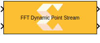
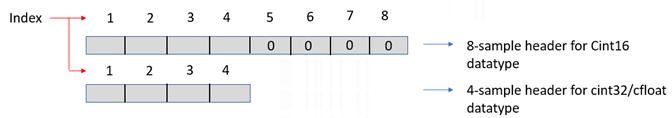
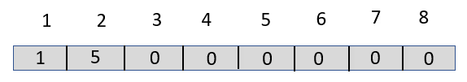
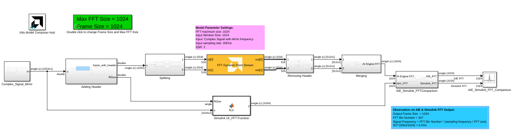

# FFT Dynamic Point Stream
FFT Dynamic Point Stream implementation targeted for AI Engines.
  
  

## Library

AI Engine/DSP/Stream IO

## Description

FFT Dynamic Point Stream implementation targeted for AI Engines. This
block supports performing different lengths of FFT on input data
streams. Each frame must be preceded by a 256-bit header which describes
run-time parameters of that frame. The format of the header is described
below. The block has two stream ports per subframe processor to maximize
performance. The specified value for SSR parameter should be of the form
2^N, where N is a positive integer.

**Note**:

- Every input frame must be appended by a header.
- If the FFT size (N) is smaller than the frame size, the block takes
  the N point FFT of the first N samples in the input frame, and
  discards the rest of the samples in the frame.
- If the frame size is an integer multiple (M) of max FFT size, M FFT
  iterations will be performed on a given input frame, resulting in
  multiple iterations of output samples, reducing the number of times
  the kernel needs to be triggered to process a given number of input
  data samples. As a result, the overheads incurred during kernel
  triggering are reduced and overall performance is increased.





<table>
<colgroup>
<col style="width: 16%" />
<col style="width: 25%" />
<col style="width: 58%" />
</colgroup>
<thead class="thead" style="text-align:left;">
<tr class="header row">
<th id="d117526e90" class="entry cellrowborder"
style="vertical-align: top">Index</th>
<th id="d117526e93" class="entry cellrowborder"
style="vertical-align: top">Field Name</th>
<th id="d117526e96" class="entry cellrowborder"
style="vertical-align: top">Description</th>
</tr>
</thead>
<tbody class="tbody">
<tr class="odd row">
<td class="entry cellrowborder" style="vertical-align: top"
headers="d117526e90 ">1</td>
<td class="entry cellrowborder" style="vertical-align: top"
headers="d117526e93 ">Direction</td>
<td class="entry cellrowborder" style="vertical-align: top"
headers="d117526e96 "><ul>
<li>0 = Inverse FFT</li>
<li>1= Forward FFT</li>
</ul></td>
</tr>
<tr class="even row">
<td class="entry cellrowborder" style="vertical-align: top"
headers="d117526e90 ">2</td>
<td class="entry cellrowborder" style="vertical-align: top"
headers="d117526e93 ">Point size (radix 2 stages)</td>
<td class="entry cellrowborder" style="vertical-align: top"
headers="d117526e96 ">Point size described as power of 2. For example,
value '5' describes a point size of '32'</td>
</tr>
<tr class="odd row">
<td class="entry cellrowborder" style="vertical-align: top"
headers="d117526e90 ">3</td>
<td class="entry cellrowborder" style="vertical-align: top"
headers="d117526e93 ">Reserved</td>
<td class="entry cellrowborder" style="vertical-align: top"
headers="d117526e96 ">Reserved</td>
</tr>
<tr class="even row">
<td class="entry cellrowborder" style="vertical-align: top"
headers="d117526e90 ">4</td>
<td class="entry cellrowborder" style="vertical-align: top"
headers="d117526e93 ">Status (output only)</td>
<td class="entry cellrowborder" style="vertical-align: top"
headers="d117526e96 "><ul>
<li>0 = Legal point size</li>
<li>1 = Illegal point size</li>
</ul></td>
</tr>
</tbody>
</table>


## Example Header Format

To implement the 32-point size FFT of `cint16` datatype, the format of
the header that should be preceded to the input data window should be as
shown in the following figure.




## Example (Input to Dynamic Point FFT)

To implement the FFT of different sizes, say, 64, 32 and 128, of type
`cint32`, the format of the input should be as follows:

``` pre
complex([1 6 0 0 ones(1,64) 1 5 0 0 ones(1,32) 1 7 0 0 ones(1,128)])
```

## Parameters

### Main  
#### Input/Output Data Type

Describes the type of individual data samples input/output of the
  dynamic point FFT. It can be cint16, cint32, cfloat types.

#### Twiddle factor data type
Describes the data type of the twiddle factors of the transform. It must be `cint16` or `cfloat` and must also satisfy the following rules:
* 32-bit twiddle factors are only supported when the input/output data type is also 32-bit.
* The twiddle factor data type must be an integer type if the input/output data type is an integer type.
* The twiddle factor data type must be `cfloat` if the input/output data type is a float type.

#### FFT Maximum Size

Specifies the maximum FFT size that is supported by Dynamic Point FFT.
  You can perform different lengths of FFT on different input data
  frames. It must be a power of 2 with a minimum value of 16. The
  maximum value supported by the library element is 65536.

#### Input Window Size

Specifies the number of samples in the input frame excluding the
  header. The value must be in the range 16 to 65536 and the default
  value is 60.

#### Scale Output down by 2^

Describes the power of 2 shift down applied before output.

#### Rounding mode

Describes the selection of rounding to be applied during the shift down stage of processing.

The following modes are available:
* **Floor:** Truncate LSB, always round down (towards negative infinity).
* **Ceiling:** Always round up (towards positive infinity).
* **Round to positive infinity:** Round halfway towards positive infinity.
* **Round to negative infinity:** Round halfway towards negative infinity.
* **Round symmetrical to infinity:** Round halfway towards infinity (away from zero).
* **Round symmetrical to zero:** Round halfway towards zero (away from infinity).
* **Round convergent to even:** Round halfway towards nearest even number.
* **Round convergent to odd:** Round halfway towards nearest odd number.

No rounding is performed on the **Floor** or **Ceiling** modes. Other modes round to the nearest integer. They differ only in how they round for values that are exactly between two integers.

#### Saturation mode

Describes the selection of saturation to be applied during the shift down stage of processing.

The following modes are available:
* **None:** No saturation is performed and the value is truncated on the MSB side.
* **Asymmetric:** Rounds an n-bit signed value in the range `-2^(n-1)` to `2^(n-1)-1`.
* **Symmetric:** Rounds an n-bit signed value in the range `-2^(n-1)-1` to `2^(n-1)-1`.

#### Use Widget for SSR Kernels
This parameter is applicable to streaming and parallel (SSR>1) implementations of the FFT. These implementations require stream to window conversions on the hardware.

When this parameter is disabled, stream to window conversion will occur within the FFT kernels themselves.

When this parameter is enabled, stream to window conversion will occur on its own AI Engine tiles. This will improve performance at the expense of additional tiles being used.

#### SSR

This parameter is intended to improve performance and support FFT
  sizes beyond the limitations of a single tile. For an SSR value of 'n'
  (which must be of the form 2^N, where N is a positive integer), the
  FFT operation is performed in parallel and the actual FFT size is
  divided by 'n'. For example, a 16384 point FFT with an SSR value of 8
  creates 8 stream inputs and there will be 8 subframe FFTs each of
  point size 2048. The specified FFT size and SSR values should be such
  that FFT size / SSR should not exceed 2048.

####  Number of Cascade Stages
This determines the number of kernels the FFT will be divided over in series to improve throughput. For int data types, and FFT size of 2^N, the maximum cascade length is N/2 when N is even and (N+1)/2 when N is odd. For float data type, the maximum cascade length is N.

## Examples

***Click on the images below to open each model.***

[](https://github.com/Xilinx/Vitis_Model_Composer/tree/2023.2/Examples/Block_Help/AIE/DynamicFFT_Stream_Ex1)


--------------
Copyright (C) 2023 Advanced Micro Devices, Inc. All rights reserved.
SPDX-License-Identifier: MIT
