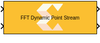
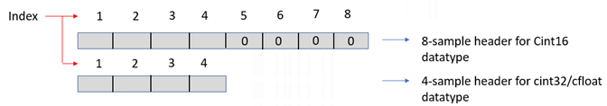
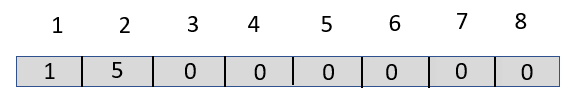
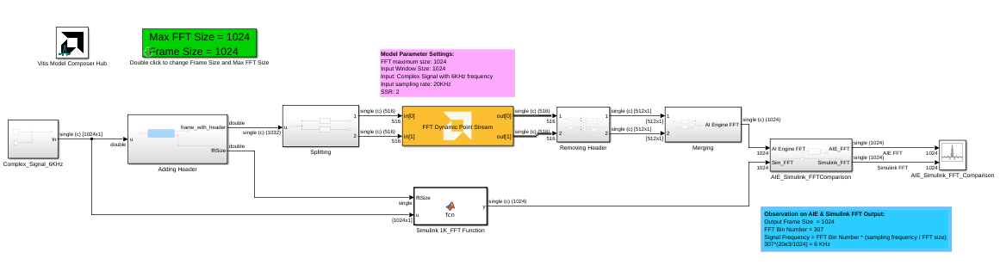

<!-- Library: aieDSP -->

# FFT Dynamic Point Stream
FFT Dynamic Point Stream implementation targeted for AI Engines.
  
  

## Library

AI Engine/DSP/Stream IO

## Description

FFT Dynamic Point Stream implementation targeted for AI Engines. This
block supports performing different lengths of FFT on input data
streams. Each frame must be preceded by a 256-bit header which describes
run-time parameters of that frame. The format of the header is described
below. The block has two stream ports per subframe processor to maximize
performance. The specified value for SSR parameter should be of the form
2^N, where N is a positive integer.

**Note**:

- Every input frame must be appended by a header.
- If the FFT size (N) is smaller than the frame size, the block takes
  the N point FFT of the first N samples in the input frame, and
  discards the rest of the samples in the frame.
- If the frame size is an integer multiple (M) of max FFT size, M FFT
  iterations will be performed on a given input frame, resulting in
  multiple iterations of output samples, reducing the number of times
  the kernel needs to be triggered to process a given number of input
  data samples. As a result, the overheads incurred during kernel
  triggering are reduced and overall performance is increased.





<table>
<colgroup>
<col style="width: 16%" />
<col style="width: 25%" />
<col style="width: 58%" />
</colgroup>
<thead class="thead" style="text-align:left;">
<tr class="header row">
<th id="d117526e90" class="entry cellrowborder"
style="vertical-align: top">Index</th>
<th id="d117526e93" class="entry cellrowborder"
style="vertical-align: top">Field Name</th>
<th id="d117526e96" class="entry cellrowborder"
style="vertical-align: top">Description</th>
</tr>
</thead>
<tbody class="tbody">
<tr class="odd row">
<td class="entry cellrowborder" style="vertical-align: top"
headers="d117526e90 ">1</td>
<td class="entry cellrowborder" style="vertical-align: top"
headers="d117526e93 ">Direction</td>
<td class="entry cellrowborder" style="vertical-align: top"
headers="d117526e96 "><ul>
<li>0 = Inverse FFT</li>
<li>1= Forward FFT</li>
</ul></td>
</tr>
<tr class="even row">
<td class="entry cellrowborder" style="vertical-align: top"
headers="d117526e90 ">2</td>
<td class="entry cellrowborder" style="vertical-align: top"
headers="d117526e93 ">Point size (radix 2 stages)</td>
<td class="entry cellrowborder" style="vertical-align: top"
headers="d117526e96 ">Point size described as power of 2. For example,
value '5' describes a point size of '32'</td>
</tr>
<tr class="odd row">
<td class="entry cellrowborder" style="vertical-align: top"
headers="d117526e90 ">3</td>
<td class="entry cellrowborder" style="vertical-align: top"
headers="d117526e93 ">Reserved</td>
<td class="entry cellrowborder" style="vertical-align: top"
headers="d117526e96 ">Reserved</td>
</tr>
<tr class="even row">
<td class="entry cellrowborder" style="vertical-align: top"
headers="d117526e90 ">4</td>
<td class="entry cellrowborder" style="vertical-align: top"
headers="d117526e93 ">Status (output only)</td>
<td class="entry cellrowborder" style="vertical-align: top"
headers="d117526e96 "><ul>
<li>0 = Legal point size</li>
<li>1 = Illegal point size</li>
</ul></td>
</tr>
</tbody>
</table>


## Example Header Format

To implement the 32-point size FFT of `cint16` datatype, the format of
the header that should be preceded to the input data window should be as
shown in the following figure.




## Example (Input to Dynamic Point FFT)

To implement the FFT of different sizes, say, 64, 32 and 128, of type
`cint32`, the format of the input should be as follows:

``` pre
complex([1 6 0 0 ones(1,64) 1 5 0 0 ones(1,32) 1 7 0 0 ones(1,128)])
```

## Parameters

### Main  
#### Input data type  
Set the data type of the block input. The data type of the input signal to the block must match this setting. Valid types are `cint16`, `cint32`, `cfloat`.

#### Output data type
Set the data type of the block output. Valid types are `cint16`, `cint32`, `cfloat`.

#### Twiddle factor data type
Describes the data type of the twiddle factors of the transform. It must be `cint16` or `cfloat` and must also satisfy the following rules:
* 32-bit twiddle factors are only supported when the input/output data type is also 32-bit.
* The twiddle factor data type must be an integer type if the input/output data type is an integer type.
* The twiddle factor data type must be `cfloat` if the input/output data type is a float type.

#### FFT Maximum Size

Specifies the maximum FFT size that is supported by Dynamic Point FFT.
  You can perform different lengths of FFT on different input data
  frames. It must be a power of 2 with a minimum value of 16. The
  maximum value supported by the library element is 65536.

#### Input Window Size

Specifies the number of samples in the input frame excluding the
  header. The value must be in the range 16 to 65536 and the default
  value is 60.

#### Scale Output down by 2^

Describes the power of 2 shift down applied before output.

#### Rounding mode

Describes the selection of rounding to be applied during the shift down stage of processing.

The following modes are available:
* **Round to positive infinity:** Round halfway towards positive infinity.
* **Round to negative infinity:** Round halfway towards negative infinity.
* **Round symmetrical to infinity:** Round halfway towards infinity (away from zero).
* **Round symmetrical to zero:** Round halfway towards zero (away from infinity).
* **Round convergent to even:** Round halfway towards nearest even number.
* **Round convergent to odd:** Round halfway towards nearest odd number.

These modes round to the nearest integer. They differ only in how they round for values that are exactly between two integers.

#### Saturation mode

Describes the selection of saturation to be applied during the shift down stage of processing.

The following modes are available:
* **None:** No saturation is performed and the value is truncated on the MSB side.
* **Asymmetric:** Rounds an n-bit signed value in the range `-2^(n-1)` to `2^(n-1)-1`.
* **Symmetric:** Rounds an n-bit signed value in the range `-2^(n-1)-1` to `2^(n-1)-1`.

#### Use Widget for SSR Kernels
This parameter is applicable to streaming and parallel (SSR>1) implementations of the FFT. These implementations require stream to window conversions on the hardware.

When this parameter is disabled, stream to window conversion will occur within the FFT kernels themselves.

When this parameter is enabled, stream to window conversion will occur on its own AI Engine tiles. This will improve performance at the expense of additional tiles being used.

#### SSR

This parameter is intended to improve performance and support FFT
  sizes beyond the limitations of a single tile. For an SSR value of 'n'
  (which must be of the form 2^N, where N is a positive integer), the
  FFT operation is performed in parallel and the actual FFT size is
  divided by 'n'. For example, a 16384 point FFT with an SSR value of 8
  creates 8 stream inputs and there will be 8 subframe FFTs each of
  point size 2048. The specified FFT size and SSR values should be such
  that FFT size / SSR should not exceed 2048.

####  Number of Cascade Stages
This determines the number of kernels the FFT will be divided over in series to improve throughput. For int data types, and FFT size of 2^N, the maximum cascade length is N/2 when N is even and (N+1)/2 when N is odd. For float data type, the maximum cascade length is N.

## Examples

***Click on the images below to open each model.***

[](https://github.com/Xilinx/Vitis_Model_Composer/tree/2025.2/Examples/Block_Help/AIE/DynamicFFT_Stream_Ex1)


<!--
DESCRIPTION:
Model: DynamicFFT_Stream_Ex1
Generated: 09-Jan-2026 13:42:55

Vitis Model Composer Configuration:
  Target Device: xcvc1902-vsva2197-1LP-e-S

Vitis Model Composer Blocks:
  - AIE: FFT Dynamic Point Stream
  - AIE: To Fixed Size

Description:
This MATLAB script creates a Vitis Model Composer Simulink model that uses the AI Engine FFT Dynamic Point Stream block. A 6kHz complex input signal is provided to the block,  and the output is visualized for analysis.

-->

<!--
MATLAB CREATION SCRIPT:

% create_DynamicFFT_Stream_Ex1_model.m
% Auto-generated script to recreate the DynamicFFT_Stream_Ex1 Simulink model
% Generated on: 09-Jan-2026 13:42:55

%% Model Configuration
modelName = 'DynamicFFT_Stream_Ex1_recreated';

%% Create New Model
if bdIsLoaded(modelName)
    close_system(modelName, 0);
end

new_system(modelName);
open_system(modelName);
fprintf('Created new model: %s\n', modelName);

%% Add Vitis Model Composer Hub Block
hubBlockPath = [modelName '/Vitis Model Composer Hub'];
add_block('vmcUtilities/Vitis Model Composer Hub', hubBlockPath, ...
    'Position', [97 -42 152 11]);

hubBlk = xmcFindHubBlock(modelName);
vmchub_set_param(hubBlk, modelName, 'SelectHardware', 'xcvc1902-vsva2197-1LP-e-S');

%% Add Top-Level Blocks
add_block('built-in/ArrayPlot', [modelName '/AIE_Simulink_FFT_Comparison'], ...
    'Position', [1575 192 1620 243]);
set_param([modelName '/AIE_Simulink_FFT_Comparison'], ...
    'NumInputPorts', '2', ...
    'OpenAtSimulationStart', 'on', ...
    'WindowPosition', '[240.000000,110.000000,800.000000,500.000000,]', ...
    'XDataMode', 'Sample increment and X-offset', ...
    'SampleIncrement', '1', ...
    'XOffset', '0', ...
    'CustomXData', '[]', ...
    'XScale', 'Linear', ...
    'YScale', 'Linear', ...
    'PlotType', 'Line', ...
    'PlotBaseValue', '0', ...
    'AxesScaling', 'Manual', ...
    'AxesScalingNumUpdates', '100', ...
    'MaximizeAxes', 'Auto', ...
    'LayoutDimensions', '[1,1]', ...
    'ActiveDisplay', '1', ...
    'PlotAsMagnitudePhase', 'off', ...
    'YLabel', 'Amplitude', ...
    'YLimits', '[-50,1100]', ...
    'ShowGrid', 'on', ...
    'ShowLegend', 'on', ...
    'ChannelNames', '[]');
add_block('aieDSP/FFT Dynamic Point Stream', [modelName '/FFT Dynamic Point Stream'], ...
    'Position', [655 139 845 206]);
set_param([modelName '/FFT Dynamic Point Stream'], ...
    'data_type', 'cfloat', ...
    'data_out_type', 'cfloat', ...
    'twiddle_type', 'cfloat', ...
    'point_size', '1024', ...
    'input_window_size', '1024', ...
    'shift_val', '0', ...
    'rnd_mode', 'Round symmetrical to infinity', ...
    'sat_mode', '0-None', ...
    'ssr', '2', ...
    'twiddle_mode', '0', ...
    'use_ssr_widget_kernels', 'off', ...
    'casc_length', '1', ...
    'transform_fft_nifft', '1', ...
    'TP_API', '1', ...
    'TP_DYN_PT_SIZE', '1');
add_block('vmcUtilities/Vitis Model Composer Hub', [modelName '/Vitis Model Composer Hub'], ...
    'Position', [97 -42 152 11]);
set_param([modelName '/Vitis Model Composer Hub'], ...
    'CodeGeneration', 'off', ...
    'StartColumn', '1', ...
    'NumberOfColumns', '1', ...
    'TargetDirectory', './code', ...
    'exportDesign', 'off', ...
    'analyzeDesign', 'off', ...
    'validateDesignOnHw', 'off', ...
    'ExportType', 'AI Engines', ...
    'IpVendor', 'xilinx.com', ...
    'IpLibrary', 'hls', ...
    'IpVersion', '1.0', ...
    'IpHWLanguage', 'Verilog', ...
    'AieCompilerOptions', '{}', ...
    'CreateTestbench', 'off', ...
    'TestbenchStackSize', '10', ...
    'RunRtlSim', 'off', ...
    'RunCSim', 'off', ...
    'RunAieSim', 'off', ...
    'AieSimTimeout', '50000', ...
    'RunAieSimProfiling', 'off', ...
    'LaunchVitisAnalyzer', 'off', ...
    'PlotOutput', 'off', ...
    'GenHwImage', 'off', ...
    'GenLibadfXo', 'off', ...
    'GenHwValidationCode', 'off', ...
    'PlatformType', 'Not Specified', ...
    'HwSystemType', 'Baremetal', ...
    'HwValidationTarget', 'hw', ...
    'ProjDevice', 'xcvc1902-vsva2197-1LP-e-S', ...
    'SamplePeriod', '-1', ...
    'ClockFrequency', '200', ...
    'DataPathParallelism', '1', ...
    'xilinxfamily', 'versalaicore', ...
    'part', 'xcvc1902', ...
    'speed', '-1LP-e-S', ...
    'package', 'vsva2197', ...
    'directory', './netlist', ...
    'testbench', 'off', ...
    'incr_netlist', 'off', ...
    'synthesis_tool', 'Vivado', ...
    'clock_wrapper', 'Clock Enables', ...
    'dbl_ovrd', 'According to Block Masks', ...
    'dcm_input_clock_period', '10', ...
    'sysclk_period', '10', ...
    'simulink_period', '1', ...
    'eval_field', '0', ...
    'LogFileName', '''''', ...
    'NThreads', '4');

%% Create AIE_Simulink_FFTComparison Subsystem
add_block('built-in/SubSystem', [modelName '/AIE_Simulink_FFTComparison'], ...
    'Position', [1320 190 1460 245]);

% Remove default blocks
defaultBlocks = find_system([modelName '/AIE_Simulink_FFTComparison'], 'SearchDepth', 1, 'Type', 'block');
for i = 1:length(defaultBlocks)
    if ~strcmp(defaultBlocks{i}, [modelName '/AIE_Simulink_FFTComparison'])
        delete_block(defaultBlocks{i});
    end
end

add_block('built-in/Inport', [[modelName '/AIE_Simulink_FFTComparison'] '/AI Engine FFT'], ...
    'Position', [-65 58 -35 72]);
set_param([[modelName '/AIE_Simulink_FFTComparison'] '/AI Engine FFT'], ...
    'Port', '1', ...
    'IconDisplay', 'Port number', ...
    'OutputFunctionCall', 'off', ...
    'OutMin', '[]', ...
    'OutMax', '[]', ...
    'OutDataTypeStr', 'Inherit: auto', ...
    'LockScale', 'off', ...
    'BusOutputAsStruct', 'off', ...
    'BusVirtuality', 'inherit', ...
    'Unit', 'inherit', ...
    'PortDimensions', '-1', ...
    'VarSizeSig', 'Inherit', ...
    'SampleTime', '-1', ...
    'SignalType', 'auto', ...
    'LatchByDelayingOutsideSignal', 'off', ...
    'LatchInputForFeedbackSignals', 'off', ...
    'Interpolate', 'on', ...
    'DataMode', 'inherit', ...
    'MessageQueueUseDefaultAttributes', 'on', ...
    'MessageQueueCapacity', '1', ...
    'MessageQueueType', 'LIFO', ...
    'MessageQueueOverwriting', 'on');
add_block('built-in/Inport', [[modelName '/AIE_Simulink_FFTComparison'] '/Sim_FFT'], ...
    'Position', [-65 133 -35 147]);
set_param([[modelName '/AIE_Simulink_FFTComparison'] '/Sim_FFT'], ...
    'Port', '2', ...
    'IconDisplay', 'Port number', ...
    'OutputFunctionCall', 'off', ...
    'OutMin', '[]', ...
    'OutMax', '[]', ...
    'OutDataTypeStr', 'Inherit: auto', ...
    'LockScale', 'off', ...
    'BusOutputAsStruct', 'off', ...
    'BusVirtuality', 'inherit', ...
    'Unit', 'inherit', ...
    'PortDimensions', '-1', ...
    'VarSizeSig', 'Inherit', ...
    'SampleTime', '-1', ...
    'SignalType', 'auto', ...
    'LatchByDelayingOutsideSignal', 'off', ...
    'LatchInputForFeedbackSignals', 'off', ...
    'Interpolate', 'on', ...
    'DataMode', 'inherit', ...
    'MessageQueueUseDefaultAttributes', 'on', ...
    'MessageQueueCapacity', '1', ...
    'MessageQueueType', 'LIFO', ...
    'MessageQueueOverwriting', 'on');
add_block('built-in/Abs', [[modelName '/AIE_Simulink_FFTComparison'] '/Abs'], ...
    'Position', [130 125 160 155]);
set_param([[modelName '/AIE_Simulink_FFTComparison'] '/Abs'], ...
    'ZeroCross', 'on', ...
    'SampleTime', '-1', ...
    'OutMin', '[]', ...
    'OutMax', '[]', ...
    'OutDataTypeStr', 'Inherit: Same as input', ...
    'LockScale', 'off', ...
    'RndMeth', 'Floor', ...
    'SaturateOnIntegerOverflow', 'off');
add_block('built-in/Abs', [[modelName '/AIE_Simulink_FFTComparison'] '/Abs1'], ...
    'Position', [130 50 160 80]);
set_param([[modelName '/AIE_Simulink_FFTComparison'] '/Abs1'], ...
    'ZeroCross', 'on', ...
    'SampleTime', '-1', ...
    'OutMin', '[]', ...
    'OutMax', '[]', ...
    'OutDataTypeStr', 'single', ...
    'LockScale', 'off', ...
    'RndMeth', 'Floor', ...
    'SaturateOnIntegerOverflow', 'off');
add_block('built-in/DataTypeConversion', [[modelName '/AIE_Simulink_FFTComparison'] '/Data Type Conversion'], ...
    'Position', [10 48 85 82]);
set_param([[modelName '/AIE_Simulink_FFTComparison'] '/Data Type Conversion'], ...
    'OutMin', '[]', ...
    'OutMax', '[]', ...
    'OutDataTypeStr', 'single', ...
    'LockScale', 'off', ...
    'ConvertRealWorld', 'Real World Value (RWV)', ...
    'RndMeth', 'Floor', ...
    'SaturateOnIntegerOverflow', 'off', ...
    'SampleTime', '-1');
add_block('built-in/DataTypeConversion', [[modelName '/AIE_Simulink_FFTComparison'] '/Data Type Conversion1'], ...
    'Position', [20 123 95 157]);
set_param([[modelName '/AIE_Simulink_FFTComparison'] '/Data Type Conversion1'], ...
    'OutMin', '[]', ...
    'OutMax', '[]', ...
    'OutDataTypeStr', 'single', ...
    'LockScale', 'off', ...
    'ConvertRealWorld', 'Real World Value (RWV)', ...
    'RndMeth', 'Floor', ...
    'SaturateOnIntegerOverflow', 'off', ...
    'SampleTime', '-1');
add_block('built-in/Terminator', [[modelName '/AIE_Simulink_FFTComparison'] '/Terminator'], ...
    'Position', [350 65 370 85]);
add_block('aieUtilities/To Fixed Size', [[modelName '/AIE_Simulink_FFTComparison'] '/To Fixed Size'], ...
    'Position', [205 47 320 103]);
set_param([[modelName '/AIE_Simulink_FFTComparison'] '/To Fixed Size'], ...
    'Mode', 'Produce a valid output signal', ...
    'OutputSize', 'Inherit: Same as input', ...
    'CopyMethod', 'Buffer samples to form output', ...
    'HasStatusOutput', 'on');
add_block('built-in/Outport', [[modelName '/AIE_Simulink_FFTComparison'] '/AIE_FFT'], ...
    'Position', [500 48 530 62]);
set_param([[modelName '/AIE_Simulink_FFTComparison'] '/AIE_FFT'], ...
    'Port', '1', ...
    'StorageClass', 'Auto', ...
    'IconDisplay', 'Port number', ...
    'OutputFunctionCall', 'off', ...
    'OutMin', '[]', ...
    'OutMax', '[]', ...
    'OutDataTypeStr', 'Inherit: auto', ...
    'LockScale', 'off', ...
    'BusOutputAsStruct', 'off', ...
    'BusVirtuality', 'inherit', ...
    'DataMode', 'inherit', ...
    'Unit', 'inherit', ...
    'PortDimensions', '-1', ...
    'VarSizeSig', 'Inherit', ...
    'SampleTime', '-1', ...
    'SignalType', 'auto', ...
    'EnsureOutportIsVirtual', 'off', ...
    'OutputWhenDisabled', 'held', ...
    'InitialOutput', '[]', ...
    'MustResolveToSignalObject', 'off', ...
    'OutputWhenUnConnected', 'off', ...
    'OutputWhenUnconnectedValue', '0', ...
    'VectorParamsAs1DForOutWhenUnconnected', 'on');
add_block('built-in/Outport', [[modelName '/AIE_Simulink_FFTComparison'] '/Simulink_FFT'], ...
    'Position', [500 133 530 147]);
set_param([[modelName '/AIE_Simulink_FFTComparison'] '/Simulink_FFT'], ...
    'Port', '2', ...
    'StorageClass', 'Auto', ...
    'IconDisplay', 'Port number', ...
    'OutputFunctionCall', 'off', ...
    'OutMin', '[]', ...
    'OutMax', '[]', ...
    'OutDataTypeStr', 'Inherit: auto', ...
    'LockScale', 'off', ...
    'BusOutputAsStruct', 'off', ...
    'BusVirtuality', 'inherit', ...
    'DataMode', 'inherit', ...
    'Unit', 'inherit', ...
    'PortDimensions', '-1', ...
    'VarSizeSig', 'Inherit', ...
    'SampleTime', '-1', ...
    'SignalType', 'auto', ...
    'EnsureOutportIsVirtual', 'off', ...
    'OutputWhenDisabled', 'held', ...
    'InitialOutput', '[]', ...
    'MustResolveToSignalObject', 'off', ...
    'OutputWhenUnConnected', 'off', ...
    'OutputWhenUnconnectedValue', '0', ...
    'VectorParamsAs1DForOutWhenUnconnected', 'on');

% Connect blocks in AIE_Simulink_FFTComparison
add_line([modelName '/AIE_Simulink_FFTComparison'], 'Sim_FFT/2', 'Data Type Conversion1/2', 'autorouting', 'on');
add_line([modelName '/AIE_Simulink_FFTComparison'], 'Data Type Conversion1/2', 'Abs/2', 'autorouting', 'on');
add_line([modelName '/AIE_Simulink_FFTComparison'], 'Data Type Conversion/2', 'Abs1/2', 'autorouting', 'on');
add_line([modelName '/AIE_Simulink_FFTComparison'], 'Abs/2', 'Simulink_FFT/2', 'autorouting', 'on');
add_line([modelName '/AIE_Simulink_FFTComparison'], 'To Fixed Size/3', 'Terminator/2', 'autorouting', 'on');
add_line([modelName '/AIE_Simulink_FFTComparison'], 'To Fixed Size/2', 'AIE_FFT/2', 'autorouting', 'on');
add_line([modelName '/AIE_Simulink_FFTComparison'], 'Abs1/2', 'To Fixed Size/2', 'autorouting', 'on');
add_line([modelName '/AIE_Simulink_FFTComparison'], 'AI Engine FFT/2', 'Data Type Conversion/2', 'autorouting', 'on');

%% Create Adding Header Subsystem
add_block('built-in/SubSystem', [modelName '/Adding Header'], ...
    'Position', [245 160 370 220]);

% Remove default blocks
defaultBlocks = find_system([modelName '/Adding Header'], 'SearchDepth', 1, 'Type', 'block');
for i = 1:length(defaultBlocks)
    if ~strcmp(defaultBlocks{i}, [modelName '/Adding Header'])
        delete_block(defaultBlocks{i});
    end
end

add_block('built-in/Inport', [[modelName '/Adding Header'] '/u'], ...
    'Position', [-5 43 25 57]);
set_param([[modelName '/Adding Header'] '/u'], ...
    'Port', '1', ...
    'IconDisplay', 'Port number', ...
    'OutputFunctionCall', 'off', ...
    'OutMin', '[]', ...
    'OutMax', '[]', ...
    'OutDataTypeStr', 'Inherit: auto', ...
    'LockScale', 'off', ...
    'BusOutputAsStruct', 'off', ...
    'BusVirtuality', 'inherit', ...
    'Unit', 'inherit', ...
    'PortDimensions', '-1', ...
    'VarSizeSig', 'Inherit', ...
    'SampleTime', '-1', ...
    'SignalType', 'auto', ...
    'LatchByDelayingOutsideSignal', 'off', ...
    'LatchInputForFeedbackSignals', 'off', ...
    'Interpolate', 'on', ...
    'DataMode', 'inherit', ...
    'MessageQueueUseDefaultAttributes', 'on', ...
    'MessageQueueCapacity', '1', ...
    'MessageQueueType', 'LIFO', ...
    'MessageQueueOverwriting', 'on');
add_block('built-in/SubSystem', [[modelName '/Adding Header'] '/Append Header'], ...
    'Position', [110 18 320 82]);
set_param([[modelName '/Adding Header'] '/Append Header'], ...
    'fftSizeInput', '[128 512 1024]');
add_block('built-in/Outport', [[modelName '/Adding Header'] '/frame_with_header'], ...
    'Position', [440 28 470 42]);
set_param([[modelName '/Adding Header'] '/frame_with_header'], ...
    'Port', '1', ...
    'StorageClass', 'Auto', ...
    'IconDisplay', 'Port number', ...
    'OutputFunctionCall', 'off', ...
    'OutMin', '[]', ...
    'OutMax', '[]', ...
    'OutDataTypeStr', 'Inherit: auto', ...
    'LockScale', 'off', ...
    'BusOutputAsStruct', 'off', ...
    'BusVirtuality', 'inherit', ...
    'DataMode', 'inherit', ...
    'Unit', 'inherit', ...
    'PortDimensions', '-1', ...
    'VarSizeSig', 'Inherit', ...
    'SampleTime', '-1', ...
    'SignalType', 'auto', ...
    'EnsureOutportIsVirtual', 'off', ...
    'OutputWhenDisabled', 'held', ...
    'InitialOutput', '[]', ...
    'MustResolveToSignalObject', 'off', ...
    'OutputWhenUnConnected', 'off', ...
    'OutputWhenUnconnectedValue', '0', ...
    'VectorParamsAs1DForOutWhenUnconnected', 'on');
add_block('built-in/Outport', [[modelName '/Adding Header'] '/fftSize'], ...
    'Position', [550 58 580 72]);
set_param([[modelName '/Adding Header'] '/fftSize'], ...
    'Port', '2', ...
    'StorageClass', 'Auto', ...
    'IconDisplay', 'Port number', ...
    'OutputFunctionCall', 'off', ...
    'OutMin', '[]', ...
    'OutMax', '[]', ...
    'OutDataTypeStr', 'Inherit: auto', ...
    'LockScale', 'off', ...
    'BusOutputAsStruct', 'off', ...
    'BusVirtuality', 'inherit', ...
    'DataMode', 'inherit', ...
    'Unit', 'inherit', ...
    'PortDimensions', '-1', ...
    'VarSizeSig', 'Inherit', ...
    'SampleTime', '-1', ...
    'SignalType', 'auto', ...
    'EnsureOutportIsVirtual', 'off', ...
    'OutputWhenDisabled', 'held', ...
    'InitialOutput', '[]', ...
    'MustResolveToSignalObject', 'off', ...
    'OutputWhenUnConnected', 'off', ...
    'OutputWhenUnconnectedValue', '0', ...
    'VectorParamsAs1DForOutWhenUnconnected', 'on');

% Connect blocks in Adding Header
add_line([modelName '/Adding Header'], 'u/2', 'Append Header/2', 'autorouting', 'on');
add_line([modelName '/Adding Header'], 'Append Header/2', 'frame_with_header/2', 'autorouting', 'on');
add_line([modelName '/Adding Header'], 'Append Header/3', 'fftSize/2', 'autorouting', 'on');

%% Create Complex_Signal_6KHz Subsystem
add_block('built-in/SubSystem', [modelName '/Complex_Signal_6KHz'], ...
    'Position', [85 157 170 223]);

% Remove default blocks
defaultBlocks = find_system([modelName '/Complex_Signal_6KHz'], 'SearchDepth', 1, 'Type', 'block');
for i = 1:length(defaultBlocks)
    if ~strcmp(defaultBlocks{i}, [modelName '/Complex_Signal_6KHz'])
        delete_block(defaultBlocks{i});
    end
end

add_block('dspobslib/Random Source', [[modelName '/Complex_Signal_6KHz'] '/Random Noise'], ...
    'Position', [-185 121 -150 159]);
set_param([[modelName '/Complex_Signal_6KHz'] '/Random Noise'], ...
    'SrcType', 'Gaussian', ...
    'NormMethod', 'Ziggurat', ...
    'CltLength', '12', ...
    'MinVal', '0', ...
    'MaxVal', '1', ...
    'MeanVal', '0', ...
    'VarVal', '1e-3', ...
    'RepMode', 'Not repeatable', ...
    'rawSeed', '1', ...
    'IsInherit', 'off', ...
    'SampMode', 'Discrete', ...
    'SampTime', '1/20e3', ...
    'SampFrame', '1024', ...
    'DataType', 'Single', ...
    'OutComplex', 'Real', ...
    'OutputFrames', 'off');
add_block('dspsrcs4/Sine Wave', [[modelName '/Complex_Signal_6KHz'] '/Sine Wave'], ...
    'Position', [-190 23 -145 67]);
set_param([[modelName '/Complex_Signal_6KHz'] '/Sine Wave'], ...
    'Amplitude', '1', ...
    'Frequency', '6e3', ...
    'Phase', '0', ...
    'SampleMode', 'Discrete', ...
    'OutComplex', 'Complex', ...
    'CompMethod', 'Trigonometric fcn', ...
    'TableSize', 'Speed', ...
    'SampleTime', '1/20e3', ...
    'SamplesPerFrame', '1024', ...
    'ResetState', 'Restart at time zero', ...
    'OutputFrames', 'off', ...
    'additionalParams', 'off', ...
    'allowOverrides', 'on', ...
    'dataType', 'single', ...
    'wordLen', '16', ...
    'udDataType', 'sfix(16)', ...
    'fracBitsMode', 'Best precision', ...
    'numFracBits', '15', ...
    'OutDataTypeStr', 'single', ...
    'LastOutDataTypeStr', 'single');
add_block('built-in/Sum', [[modelName '/Complex_Signal_6KHz'] '/Sum'], ...
    'Position', [-40 35 -20 55]);
set_param([[modelName '/Complex_Signal_6KHz'] '/Sum'], ...
    'IconShape', 'round', ...
    'Inputs', '|++', ...
    'CollapseMode', 'All dimensions', ...
    'CollapseDim', '1', ...
    'OutMin', '[]', ...
    'OutMax', '[]', ...
    'OutDataTypeStr', 'Inherit: Inherit via internal rule', ...
    'AccumDataTypeStr', 'Inherit: Inherit via internal rule', ...
    'InputSameDT', 'off', ...
    'LockScale', 'off', ...
    'RndMeth', 'Floor', ...
    'SaturateOnIntegerOverflow', 'off', ...
    'SampleTime', '-1');
add_block('built-in/Outport', [[modelName '/Complex_Signal_6KHz'] '/In'], ...
    'Position', [120 38 150 52]);
set_param([[modelName '/Complex_Signal_6KHz'] '/In'], ...
    'Port', '1', ...
    'StorageClass', 'Auto', ...
    'IconDisplay', 'Port number', ...
    'OutputFunctionCall', 'off', ...
    'OutMin', '[]', ...
    'OutMax', '[]', ...
    'OutDataTypeStr', 'Inherit: auto', ...
    'LockScale', 'off', ...
    'BusOutputAsStruct', 'off', ...
    'BusVirtuality', 'inherit', ...
    'DataMode', 'inherit', ...
    'Unit', 'inherit', ...
    'PortDimensions', '-1', ...
    'VarSizeSig', 'Inherit', ...
    'SampleTime', '-1', ...
    'SignalType', 'auto', ...
    'EnsureOutportIsVirtual', 'off', ...
    'OutputWhenDisabled', 'held', ...
    'InitialOutput', '[]', ...
    'MustResolveToSignalObject', 'off', ...
    'OutputWhenUnConnected', 'off', ...
    'OutputWhenUnconnectedValue', '0', ...
    'VectorParamsAs1DForOutWhenUnconnected', 'on');

% Connect blocks in Complex_Signal_6KHz
add_line([modelName '/Complex_Signal_6KHz'], 'Random Noise/2', 'Sum/3', 'autorouting', 'on');
add_line([modelName '/Complex_Signal_6KHz'], 'Sum/2', 'In/2', 'autorouting', 'on');
add_line([modelName '/Complex_Signal_6KHz'], 'Sine Wave/2', 'Sum/2', 'autorouting', 'on');

%% Create Double click to change Frame Size and Max FFT Size Subsystem
add_block('built-in/SubSystem', [modelName '/Double click to change Frame Size and Max FFT Size'], ...
    'Position', [245 -39 440 9]);

% Remove default blocks
defaultBlocks = find_system([modelName '/Double click to change Frame Size and Max FFT Size'], 'SearchDepth', 1, 'Type', 'block');
for i = 1:length(defaultBlocks)
    if ~strcmp(defaultBlocks{i}, [modelName '/Double click to change Frame Size and Max FFT Size'])
        delete_block(defaultBlocks{i});
    end
end


%% Create Merging Subsystem
add_block('built-in/SubSystem', [modelName '/Merging'], ...
    'Position', [1130 140 1260 200]);

% Remove default blocks
defaultBlocks = find_system([modelName '/Merging'], 'SearchDepth', 1, 'Type', 'block');
for i = 1:length(defaultBlocks)
    if ~strcmp(defaultBlocks{i}, [modelName '/Merging'])
        delete_block(defaultBlocks{i});
    end
end

add_block('built-in/Inport', [[modelName '/Merging'] '/In1'], ...
    'Position', [20 88 50 102]);
set_param([[modelName '/Merging'] '/In1'], ...
    'Port', '1', ...
    'IconDisplay', 'Port number', ...
    'OutputFunctionCall', 'off', ...
    'OutMin', '[]', ...
    'OutMax', '[]', ...
    'OutDataTypeStr', 'Inherit: auto', ...
    'LockScale', 'off', ...
    'BusOutputAsStruct', 'off', ...
    'BusVirtuality', 'inherit', ...
    'Unit', 'inherit', ...
    'PortDimensions', '-1', ...
    'VarSizeSig', 'Inherit', ...
    'SampleTime', '-1', ...
    'SignalType', 'auto', ...
    'LatchByDelayingOutsideSignal', 'off', ...
    'LatchInputForFeedbackSignals', 'off', ...
    'Interpolate', 'on', ...
    'DataMode', 'inherit', ...
    'MessageQueueUseDefaultAttributes', 'on', ...
    'MessageQueueCapacity', '1', ...
    'MessageQueueType', 'LIFO', ...
    'MessageQueueOverwriting', 'on');
add_block('built-in/Inport', [[modelName '/Merging'] '/In2'], ...
    'Position', [20 118 50 132]);
set_param([[modelName '/Merging'] '/In2'], ...
    'Port', '2', ...
    'IconDisplay', 'Port number', ...
    'OutputFunctionCall', 'off', ...
    'OutMin', '[]', ...
    'OutMax', '[]', ...
    'OutDataTypeStr', 'Inherit: auto', ...
    'LockScale', 'off', ...
    'BusOutputAsStruct', 'off', ...
    'BusVirtuality', 'inherit', ...
    'Unit', 'inherit', ...
    'PortDimensions', '-1', ...
    'VarSizeSig', 'Inherit', ...
    'SampleTime', '-1', ...
    'SignalType', 'auto', ...
    'LatchByDelayingOutsideSignal', 'off', ...
    'LatchInputForFeedbackSignals', 'off', ...
    'Interpolate', 'on', ...
    'DataMode', 'inherit', ...
    'MessageQueueUseDefaultAttributes', 'on', ...
    'MessageQueueCapacity', '1', ...
    'MessageQueueType', 'LIFO', ...
    'MessageQueueOverwriting', 'on');
add_block('built-in/Mux', [[modelName '/Merging'] '/Mux'], ...
    'Position', [485 96 490 134]);
set_param([[modelName '/Merging'] '/Mux'], ...
    'Inputs', '2', ...
    'DisplayOption', 'bar');
add_block('built-in/Reshape', [[modelName '/Merging'] '/Reshape'], ...
    'Position', [585 103 615 127]);
set_param([[modelName '/Merging'] '/Reshape'], ...
    'OutputDimensionality', 'Customize', ...
    'OutputDimensions', '[512, 2]');
add_block('built-in/Reshape', [[modelName '/Merging'] '/Reshape1'], ...
    'Position', [845 103 875 127]);
set_param([[modelName '/Merging'] '/Reshape1'], ...
    'OutputDimensionality', '1-D array', ...
    'OutputDimensions', '[1, 10]');
add_block('built-in/Terminator', [[modelName '/Merging'] '/Terminator'], ...
    'Position', [350 50 370 70]);
add_block('built-in/Terminator', [[modelName '/Merging'] '/Terminator1'], ...
    'Position', [365 140 385 160]);
add_block('aieUtilities/To Fixed Size', [[modelName '/Merging'] '/To Fixed Size'], ...
    'Position', [175 22 290 78]);
set_param([[modelName '/Merging'] '/To Fixed Size'], ...
    'Mode', 'Produce a valid output signal', ...
    'OutputSize', 'Inherit: Same as input', ...
    'CopyMethod', 'Buffer samples to form output', ...
    'HasStatusOutput', 'on');
add_block('aieUtilities/To Fixed Size', [[modelName '/Merging'] '/To Fixed Size1'], ...
    'Position', [175 112 290 168]);
set_param([[modelName '/Merging'] '/To Fixed Size1'], ...
    'Mode', 'Produce a valid output signal', ...
    'OutputSize', 'Inherit: Same as input', ...
    'CopyMethod', 'Buffer samples to form output', ...
    'HasStatusOutput', 'on');
add_block('built-in/Math', [[modelName '/Merging'] '/Transpose'], ...
    'Position', [730 99 760 131]);
set_param([[modelName '/Merging'] '/Transpose'], ...
    'Operator', 'transpose', ...
    'AlgorithmMethod', 'Exact', ...
    'SignedPower', 'off', ...
    'OutputSignalType', 'auto', ...
    'SampleTime', '-1', ...
    'OutMin', '[]', ...
    'OutMax', '[]', ...
    'OutDataTypeStr', 'Inherit: Same as first input', ...
    'LockScale', 'off', ...
    'RndMeth', 'Floor', ...
    'SaturateOnIntegerOverflow', 'on', ...
    'IntermediateResultsDataTypeStr', 'Inherit: Inherit via internal rule', ...
    'AlgorithmType', 'Newton-Raphson', ...
    'Iterations', '3');
add_block('built-in/Outport', [[modelName '/Merging'] '/AI Engine FFT'], ...
    'Position', [1000 108 1030 122]);
set_param([[modelName '/Merging'] '/AI Engine FFT'], ...
    'Port', '1', ...
    'StorageClass', 'Auto', ...
    'IconDisplay', 'Port number', ...
    'OutputFunctionCall', 'off', ...
    'OutMin', '[]', ...
    'OutMax', '[]', ...
    'OutDataTypeStr', 'Inherit: auto', ...
    'LockScale', 'off', ...
    'BusOutputAsStruct', 'off', ...
    'BusVirtuality', 'inherit', ...
    'DataMode', 'inherit', ...
    'Unit', 'inherit', ...
    'PortDimensions', '-1', ...
    'VarSizeSig', 'Inherit', ...
    'SampleTime', '-1', ...
    'SignalType', 'auto', ...
    'EnsureOutportIsVirtual', 'off', ...
    'OutputWhenDisabled', 'held', ...
    'InitialOutput', '[]', ...
    'MustResolveToSignalObject', 'off', ...
    'OutputWhenUnConnected', 'off', ...
    'OutputWhenUnconnectedValue', '0', ...
    'VectorParamsAs1DForOutWhenUnconnected', 'on');

% Connect blocks in Merging
add_line([modelName '/Merging'], 'In1/2', 'To Fixed Size/2', 'autorouting', 'on');
add_line([modelName '/Merging'], 'Reshape1/2', 'AI Engine FFT/2', 'autorouting', 'on');
add_line([modelName '/Merging'], 'Mux/2', 'Reshape/2', 'autorouting', 'on');
add_line([modelName '/Merging'], 'To Fixed Size/2', 'Mux/2', 'autorouting', 'on');
add_line([modelName '/Merging'], 'Transpose/2', 'Reshape1/2', 'autorouting', 'on');
add_line([modelName '/Merging'], 'To Fixed Size/3', 'Terminator/2', 'autorouting', 'on');
add_line([modelName '/Merging'], 'In2/2', 'To Fixed Size1/2', 'autorouting', 'on');
add_line([modelName '/Merging'], 'To Fixed Size1/2', 'Mux/3', 'autorouting', 'on');
add_line([modelName '/Merging'], 'To Fixed Size1/3', 'Terminator1/2', 'autorouting', 'on');
add_line([modelName '/Merging'], 'Reshape/2', 'Transpose/2', 'autorouting', 'on');

%% Create Removing Header Subsystem
add_block('built-in/SubSystem', [modelName '/Removing Header'], ...
    'Position', [935 140 1025 200]);

% Remove default blocks
defaultBlocks = find_system([modelName '/Removing Header'], 'SearchDepth', 1, 'Type', 'block');
for i = 1:length(defaultBlocks)
    if ~strcmp(defaultBlocks{i}, [modelName '/Removing Header'])
        delete_block(defaultBlocks{i});
    end
end

add_block('built-in/Inport', [[modelName '/Removing Header'] '/In3'], ...
    'Position', [-130 -22 -100 -8]);
set_param([[modelName '/Removing Header'] '/In3'], ...
    'Port', '1', ...
    'IconDisplay', 'Port number', ...
    'OutputFunctionCall', 'off', ...
    'OutMin', '[]', ...
    'OutMax', '[]', ...
    'OutDataTypeStr', 'Inherit: auto', ...
    'LockScale', 'off', ...
    'BusOutputAsStruct', 'off', ...
    'BusVirtuality', 'inherit', ...
    'Unit', 'inherit', ...
    'PortDimensions', '-1', ...
    'VarSizeSig', 'Inherit', ...
    'SampleTime', '-1', ...
    'SignalType', 'auto', ...
    'LatchByDelayingOutsideSignal', 'off', ...
    'LatchInputForFeedbackSignals', 'off', ...
    'Interpolate', 'on', ...
    'DataMode', 'inherit', ...
    'MessageQueueUseDefaultAttributes', 'on', ...
    'MessageQueueCapacity', '1', ...
    'MessageQueueType', 'LIFO', ...
    'MessageQueueOverwriting', 'on');
add_block('built-in/Inport', [[modelName '/Removing Header'] '/In1'], ...
    'Position', [-125 153 -95 167]);
set_param([[modelName '/Removing Header'] '/In1'], ...
    'Port', '2', ...
    'IconDisplay', 'Port number', ...
    'OutputFunctionCall', 'off', ...
    'OutMin', '[]', ...
    'OutMax', '[]', ...
    'OutDataTypeStr', 'Inherit: auto', ...
    'LockScale', 'off', ...
    'BusOutputAsStruct', 'off', ...
    'BusVirtuality', 'inherit', ...
    'Unit', 'inherit', ...
    'PortDimensions', '-1', ...
    'VarSizeSig', 'Inherit', ...
    'SampleTime', '-1', ...
    'SignalType', 'auto', ...
    'LatchByDelayingOutsideSignal', 'off', ...
    'LatchInputForFeedbackSignals', 'off', ...
    'Interpolate', 'on', ...
    'DataMode', 'inherit', ...
    'MessageQueueUseDefaultAttributes', 'on', ...
    'MessageQueueCapacity', '1', ...
    'MessageQueueType', 'LIFO', ...
    'MessageQueueOverwriting', 'on');
add_block('built-in/Display', [[modelName '/Removing Header'] '/Frame Header'], ...
    'Position', [435 -22 525 52]);
set_param([[modelName '/Removing Header'] '/Frame Header'], ...
    'Format', 'short', ...
    'Decimation', '1', ...
    'Floating', 'off');
add_block('built-in/Display', [[modelName '/Removing Header'] '/Frame Header1'], ...
    'Position', [360 158 450 232]);
set_param([[modelName '/Removing Header'] '/Frame Header1'], ...
    'Format', 'short', ...
    'Decimation', '1', ...
    'Floating', 'off');
add_block('matrix_library/Submatrix', [[modelName '/Removing Header'] '/Submatrix'], ...
    'Position', [265 10 315 50]);
set_param([[modelName '/Removing Header'] '/Submatrix'], ...
    'RowSpan', 'Range of rows', ...
    'RowStartMode', 'Index', ...
    'RowStartIndex', '1', ...
    'RowEndMode', 'Index', ...
    'RowEndIndex', '4', ...
    'ColSpan', 'One column', ...
    'ColStartMode', 'First', ...
    'ColStartIndex', '1', ...
    'ColEndMode', 'Last', ...
    'ColEndIndex', '1');
add_block('matrix_library/Submatrix', [[modelName '/Removing Header'] '/Submatrix1'], ...
    'Position', [270 -50 320 -10]);
set_param([[modelName '/Removing Header'] '/Submatrix1'], ...
    'RowSpan', 'Range of rows', ...
    'RowStartMode', 'Index', ...
    'RowStartIndex', '5', ...
    'RowEndMode', 'Index', ...
    'RowEndIndex', '516', ...
    'ColSpan', 'One column', ...
    'ColStartMode', 'First', ...
    'ColStartIndex', '1', ...
    'ColEndMode', 'Last', ...
    'ColEndIndex', '1');
add_block('matrix_library/Submatrix', [[modelName '/Removing Header'] '/Submatrix2'], ...
    'Position', [190 175 240 215]);
set_param([[modelName '/Removing Header'] '/Submatrix2'], ...
    'RowSpan', 'Range of rows', ...
    'RowStartMode', 'Index', ...
    'RowStartIndex', '1', ...
    'RowEndMode', 'Index', ...
    'RowEndIndex', '4', ...
    'ColSpan', 'One column', ...
    'ColStartMode', 'First', ...
    'ColStartIndex', '1', ...
    'ColEndMode', 'Last', ...
    'ColEndIndex', '1');
add_block('matrix_library/Submatrix', [[modelName '/Removing Header'] '/Submatrix3'], ...
    'Position', [200 120 250 160]);
set_param([[modelName '/Removing Header'] '/Submatrix3'], ...
    'RowSpan', 'Range of rows', ...
    'RowStartMode', 'Index', ...
    'RowStartIndex', '5', ...
    'RowEndMode', 'Index', ...
    'RowEndIndex', '516', ...
    'ColSpan', 'One column', ...
    'ColStartMode', 'First', ...
    'ColStartIndex', '1', ...
    'ColEndMode', 'Last', ...
    'ColEndIndex', '1');
add_block('built-in/Terminator', [[modelName '/Removing Header'] '/Terminator'], ...
    'Position', [185 -10 205 10]);
add_block('built-in/Terminator', [[modelName '/Removing Header'] '/Terminator1'], ...
    'Position', [115 155 135 175]);
add_block('aieUtilities/To Fixed Size', [[modelName '/Removing Header'] '/To Fixed Size'], ...
    'Position', [-15 -43 100 13]);
set_param([[modelName '/Removing Header'] '/To Fixed Size'], ...
    'Mode', 'Produce a valid output signal', ...
    'OutputSize', 'Inherit: Same as input', ...
    'CopyMethod', 'Buffer samples to form output', ...
    'HasStatusOutput', 'on');
add_block('aieUtilities/To Fixed Size', [[modelName '/Removing Header'] '/To Fixed Size1'], ...
    'Position', [-30 132 85 188]);
set_param([[modelName '/Removing Header'] '/To Fixed Size1'], ...
    'Mode', 'Produce a valid output signal', ...
    'OutputSize', 'Inherit: Same as input', ...
    'CopyMethod', 'Buffer samples to form output', ...
    'HasStatusOutput', 'on');
add_block('built-in/Outport', [[modelName '/Removing Header'] '/Out3'], ...
    'Position', [575 -37 605 -23]);
set_param([[modelName '/Removing Header'] '/Out3'], ...
    'Port', '1', ...
    'StorageClass', 'Auto', ...
    'IconDisplay', 'Port number', ...
    'OutputFunctionCall', 'off', ...
    'OutMin', '[]', ...
    'OutMax', '[]', ...
    'OutDataTypeStr', 'Inherit: auto', ...
    'LockScale', 'off', ...
    'BusOutputAsStruct', 'off', ...
    'BusVirtuality', 'inherit', ...
    'DataMode', 'inherit', ...
    'Unit', 'inherit', ...
    'PortDimensions', '-1', ...
    'VarSizeSig', 'Inherit', ...
    'SampleTime', '-1', ...
    'SignalType', 'auto', ...
    'EnsureOutportIsVirtual', 'off', ...
    'OutputWhenDisabled', 'held', ...
    'InitialOutput', '[]', ...
    'MustResolveToSignalObject', 'off', ...
    'OutputWhenUnConnected', 'off', ...
    'OutputWhenUnconnectedValue', '0', ...
    'VectorParamsAs1DForOutWhenUnconnected', 'on');
add_block('built-in/Outport', [[modelName '/Removing Header'] '/Out1'], ...
    'Position', [575 133 605 147]);
set_param([[modelName '/Removing Header'] '/Out1'], ...
    'Port', '2', ...
    'StorageClass', 'Auto', ...
    'IconDisplay', 'Port number', ...
    'OutputFunctionCall', 'off', ...
    'OutMin', '[]', ...
    'OutMax', '[]', ...
    'OutDataTypeStr', 'Inherit: auto', ...
    'LockScale', 'off', ...
    'BusOutputAsStruct', 'off', ...
    'BusVirtuality', 'inherit', ...
    'DataMode', 'inherit', ...
    'Unit', 'inherit', ...
    'PortDimensions', '-1', ...
    'VarSizeSig', 'Inherit', ...
    'SampleTime', '-1', ...
    'SignalType', 'auto', ...
    'EnsureOutportIsVirtual', 'off', ...
    'OutputWhenDisabled', 'held', ...
    'InitialOutput', '[]', ...
    'MustResolveToSignalObject', 'off', ...
    'OutputWhenUnConnected', 'off', ...
    'OutputWhenUnconnectedValue', '0', ...
    'VectorParamsAs1DForOutWhenUnconnected', 'on');

% Connect blocks in Removing Header
add_line([modelName '/Removing Header'], 'To Fixed Size1/2', 'Submatrix3/2', 'autorouting', 'on');
add_line([modelName '/Removing Header'], 'To Fixed Size1/2', 'Submatrix2/2', 'autorouting', 'on');
add_line([modelName '/Removing Header'], 'To Fixed Size1/2', 'Submatrix2/2', 'autorouting', 'on');
add_line([modelName '/Removing Header'], 'To Fixed Size1/3', 'Terminator1/2', 'autorouting', 'on');
add_line([modelName '/Removing Header'], 'In1/2', 'To Fixed Size1/2', 'autorouting', 'on');
add_line([modelName '/Removing Header'], 'Submatrix3/2', 'Out1/2', 'autorouting', 'on');
add_line([modelName '/Removing Header'], 'Submatrix2/2', 'Frame Header1/2', 'autorouting', 'on');
add_line([modelName '/Removing Header'], 'In3/2', 'To Fixed Size/2', 'autorouting', 'on');
add_line([modelName '/Removing Header'], 'Submatrix1/2', 'Out3/2', 'autorouting', 'on');
add_line([modelName '/Removing Header'], 'To Fixed Size/2', 'Submatrix1/2', 'autorouting', 'on');
add_line([modelName '/Removing Header'], 'To Fixed Size/2', 'Submatrix/2', 'autorouting', 'on');
add_line([modelName '/Removing Header'], 'To Fixed Size/2', 'Submatrix/2', 'autorouting', 'on');
add_line([modelName '/Removing Header'], 'Submatrix/2', 'Frame Header/2', 'autorouting', 'on');
add_line([modelName '/Removing Header'], 'To Fixed Size/3', 'Terminator/2', 'autorouting', 'on');

%% Create Simulink 1K_FFT Function Subsystem
add_block('built-in/SubSystem', [modelName '/Simulink 1K_FFT Function'], ...
    'Position', [655 273 780 337]);

% Remove default blocks
defaultBlocks = find_system([modelName '/Simulink 1K_FFT Function'], 'SearchDepth', 1, 'Type', 'block');
for i = 1:length(defaultBlocks)
    if ~strcmp(defaultBlocks{i}, [modelName '/Simulink 1K_FFT Function'])
        delete_block(defaultBlocks{i});
    end
end


%% Create Splitting Subsystem
add_block('built-in/SubSystem', [modelName '/Splitting'], ...
    'Position', [435 137 565 208]);

% Remove default blocks
defaultBlocks = find_system([modelName '/Splitting'], 'SearchDepth', 1, 'Type', 'block');
for i = 1:length(defaultBlocks)
    if ~strcmp(defaultBlocks{i}, [modelName '/Splitting'])
        delete_block(defaultBlocks{i});
    end
end

add_block('built-in/Inport', [[modelName '/Splitting'] '/u'], ...
    'Position', [20 68 50 82]);
set_param([[modelName '/Splitting'] '/u'], ...
    'Port', '1', ...
    'IconDisplay', 'Port number', ...
    'OutputFunctionCall', 'off', ...
    'OutMin', '[]', ...
    'OutMax', '[]', ...
    'OutDataTypeStr', 'Inherit: auto', ...
    'LockScale', 'off', ...
    'BusOutputAsStruct', 'off', ...
    'BusVirtuality', 'inherit', ...
    'Unit', 'inherit', ...
    'PortDimensions', '-1', ...
    'VarSizeSig', 'Inherit', ...
    'SampleTime', '-1', ...
    'SignalType', 'auto', ...
    'LatchByDelayingOutsideSignal', 'off', ...
    'LatchInputForFeedbackSignals', 'off', ...
    'Interpolate', 'on', ...
    'DataMode', 'inherit', ...
    'MessageQueueUseDefaultAttributes', 'on', ...
    'MessageQueueCapacity', '1', ...
    'MessageQueueType', 'LIFO', ...
    'MessageQueueOverwriting', 'on');
add_block('built-in/Selector', [[modelName '/Splitting'] '/EvenSample'], ...
    'Position', [225 81 300 119]);
set_param([[modelName '/Splitting'] '/EvenSample'], ...
    'NumberOfDimensions', '1', ...
    'IndexMode', 'One-based', ...
    'InputPortWidth', '1032', ...
    'SampleTime', '-1', ...
    'IndexOptions', 'Index vector (dialog)', ...
    'Indices', '2:2:1032', ...
    'OutputSizes', '1', ...
    'RuntimeRangeChecks', 'off');
add_block('built-in/Selector', [[modelName '/Splitting'] '/oddSample'], ...
    'Position', [225 21 300 59]);
set_param([[modelName '/Splitting'] '/oddSample'], ...
    'NumberOfDimensions', '1', ...
    'IndexMode', 'One-based', ...
    'InputPortWidth', '1032', ...
    'SampleTime', '-1', ...
    'IndexOptions', 'Index vector (dialog)', ...
    'Indices', '1:2:1032', ...
    'OutputSizes', '1', ...
    'RuntimeRangeChecks', 'off');
add_block('built-in/Outport', [[modelName '/Splitting'] '/Out1'], ...
    'Position', [420 33 450 47]);
set_param([[modelName '/Splitting'] '/Out1'], ...
    'Port', '1', ...
    'StorageClass', 'Auto', ...
    'IconDisplay', 'Port number', ...
    'OutputFunctionCall', 'off', ...
    'OutMin', '[]', ...
    'OutMax', '[]', ...
    'OutDataTypeStr', 'Inherit: auto', ...
    'LockScale', 'off', ...
    'BusOutputAsStruct', 'off', ...
    'BusVirtuality', 'inherit', ...
    'DataMode', 'inherit', ...
    'Unit', 'inherit', ...
    'PortDimensions', '-1', ...
    'VarSizeSig', 'Inherit', ...
    'SampleTime', '-1', ...
    'SignalType', 'auto', ...
    'EnsureOutportIsVirtual', 'off', ...
    'OutputWhenDisabled', 'held', ...
    'InitialOutput', '[]', ...
    'MustResolveToSignalObject', 'off', ...
    'OutputWhenUnConnected', 'off', ...
    'OutputWhenUnconnectedValue', '0', ...
    'VectorParamsAs1DForOutWhenUnconnected', 'on');
add_block('built-in/Outport', [[modelName '/Splitting'] '/Out2'], ...
    'Position', [420 88 450 102]);
set_param([[modelName '/Splitting'] '/Out2'], ...
    'Port', '2', ...
    'StorageClass', 'Auto', ...
    'IconDisplay', 'Port number', ...
    'OutputFunctionCall', 'off', ...
    'OutMin', '[]', ...
    'OutMax', '[]', ...
    'OutDataTypeStr', 'Inherit: auto', ...
    'LockScale', 'off', ...
    'BusOutputAsStruct', 'off', ...
    'BusVirtuality', 'inherit', ...
    'DataMode', 'inherit', ...
    'Unit', 'inherit', ...
    'PortDimensions', '-1', ...
    'VarSizeSig', 'Inherit', ...
    'SampleTime', '-1', ...
    'SignalType', 'auto', ...
    'EnsureOutportIsVirtual', 'off', ...
    'OutputWhenDisabled', 'held', ...
    'InitialOutput', '[]', ...
    'MustResolveToSignalObject', 'off', ...
    'OutputWhenUnConnected', 'off', ...
    'OutputWhenUnconnectedValue', '0', ...
    'VectorParamsAs1DForOutWhenUnconnected', 'on');

% Connect blocks in Splitting
add_line([modelName '/Splitting'], 'oddSample/2', 'Out1/2', 'autorouting', 'on');
add_line([modelName '/Splitting'], 'EvenSample/2', 'Out2/2', 'autorouting', 'on');
add_line([modelName '/Splitting'], 'u/2', 'EvenSample/2', 'autorouting', 'on');
add_line([modelName '/Splitting'], 'u/2', 'oddSample/2', 'autorouting', 'on');
add_line([modelName '/Splitting'], 'u/2', 'oddSample/2', 'autorouting', 'on');

%% Connect Top-Level Blocks
add_line(modelName, 'Removing Header/3', 'Merging/3', 'autorouting', 'on');
add_line(modelName, 'Removing Header/2', 'Merging/2', 'autorouting', 'on');
add_line(modelName, 'FFT Dynamic Point Stream/3', 'Removing Header/3', 'autorouting', 'on');
add_line(modelName, 'FFT Dynamic Point Stream/2', 'Removing Header/2', 'autorouting', 'on');
add_line(modelName, 'AIE_Simulink_FFTComparison/3', 'AIE_Simulink_FFT_Comparison/3', 'autorouting', 'on');
add_line(modelName, 'AIE_Simulink_FFTComparison/2', 'AIE_Simulink_FFT_Comparison/2', 'autorouting', 'on');
add_line(modelName, 'Merging/2', 'AIE_Simulink_FFTComparison/2', 'autorouting', 'on');
add_line(modelName, 'Simulink 1K_FFT Function/2', 'AIE_Simulink_FFTComparison/3', 'autorouting', 'on');
add_line(modelName, 'Splitting/3', 'FFT Dynamic Point Stream/3', 'autorouting', 'on');
add_line(modelName, 'Splitting/2', 'FFT Dynamic Point Stream/2', 'autorouting', 'on');
add_line(modelName, 'Adding Header/2', 'Splitting/2', 'autorouting', 'on');
add_line(modelName, 'Complex_Signal_6KHz/2', 'Adding Header/2', 'autorouting', 'on');
add_line(modelName, 'Complex_Signal_6KHz/2', 'Simulink 1K_FFT Function/3', 'autorouting', 'on');
add_line(modelName, 'Complex_Signal_6KHz/2', 'Simulink 1K_FFT Function/3', 'autorouting', 'on');
add_line(modelName, 'Adding Header/3', 'Simulink 1K_FFT Function/2', 'autorouting', 'on');

%% Save Model
save_system(modelName);
fprintf('\nModel saved: %s.slx\n', modelName);
-->

## References
This block uses the Vitis DSP library implementation of FFT. For more details on this implementation please click [here](https://docs.xilinx.com/r/en-US/Vitis_Libraries/dsp/user_guide/L2/func-fft-ifft-aie-only.html).

--------------
Copyright (C) 2025 Advanced Micro Devices, Inc.
All rights reserved.

SPDX-License-Identifier: MIT
