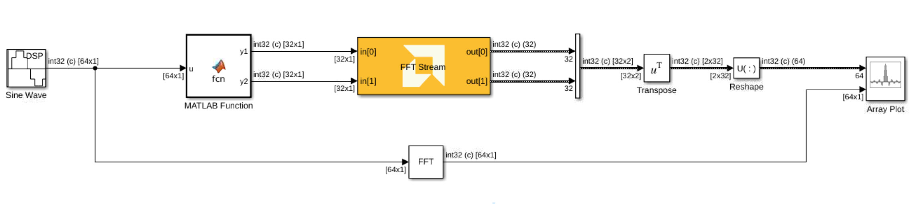

# FFT Stream
Stream-based FFT implementation targeted for AI Engines.
  
  

## Library

AI Engine/DSP/Stream IO

## Description

Stream-based FFT implementation targeted for AI Engines. The FFT block
has two stream ports per subframe processor to maximize performance. The
specified value for SSR parameter should be of the form 2^N, where N is
a positive integer.

## Parameters

### Main  
#### Input/Output Data Type
Set the input/output data type.

#### Point Size (FFT Size)
This is an unsigned integer which describes the point size of the transformation. This must be 2^N, where N is in the range 4 to 16 inclusive.

#### Input Window Size (Number of Samples)
Describes the total number of samples used as an input to the FFT block on all the ports. This parameter should be an integer multiple of the _Point Size_, in which case multiple FFT iterations will be performed on a given input window. This reduces the number of times the kernel needs to be triggered and as a result the overhead incurred due to triggering the kernel is reduced and overall throughput increases. This parameter must be in the range of 2^4 and 2^16, inclusive. 

#### Scale Output Down by 2^
Describes the power of 2 shift down applied before output. For _cfloat_ data type, the value for this parameter must be zero. 


#### SSR

This parameter is intended to improve performance and support FFT
  sizes beyond the limitations of a single tile. For an SSR value of 'n'
  (which must be of the form 2^N, where N is a positive integer), the
  FFT operation is performed in parallel and the actual FFT size is
  divided by 'n'. For example, a 16384 point FFT with SSR value of 8
  creates 8 stream inputs and there will be 8 subframe FFTs each of
  point size 2048.

####  Number of Cascade Stages
This determines the number of kernels the FFT will be divided over in series to improve throughput. For int data types, and FFT size of 2^N, the maximum cascade length is N/2 when N is even and (N+1)/2 when N is odd. For float data type, the maximum cascade length is N.


### Constraints
Click on the button given here to access the constraint manager and add or update constraints for each kernel. If you set the "Number of cascade stages" parameter to a value greater than one, multiple kernels will be used to process the input. You can use the constraint manager to optimize the performance of your design by setting specific constraints for each kernel (in this case, you need to first run your design). Adding constraints will not affect the functional simulation in Simulink. Constraints will only affect the generated graph code, cycle approximate AIE simulation (System C), and behavior in hardware.

<div class="noteBox">
If you are using non-default constraints for any of the kernels for the block, an asterisk (*) will be displayed next to the button.
</div>

## Example
Below is an example of using the FFT Stream block. We are comparing the results with the FFT block from MathWorks DSP System toolbox and the results match, except for quantization errors. 


Here is how the design is setup:

The MATLAB function block simply passes the input data to the outputs in a round robin way and the code is depicted below:

```
function [y1, y2] = fcn(u)
y1 = u(1:2:end);
y2 = u(2:2:end);
```
The amplitude for the input sinusoidal is set to 2^15. For the FFT Stream block the parameters are set as in the table below:

|Parameter| value|
|---------|------|
|Data type| cint32|
|Point Size| 64|
|Input window size| 64|
|Scale output down by 2^| 6|
|SSR|2|
|Number of cascade stages| 1|

## References
This block uses the Vitis DSP library implementation of FFT. For more details on this implementation please click [here](https://docs.xilinx.com/r/en-US/Vitis_Libraries/dsp/user_guide/L2/func-fft.html).

