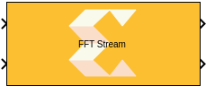
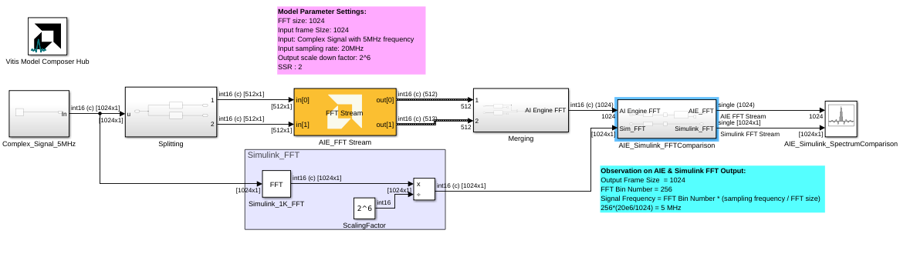

<!-- Library: aieDSP -->

# FFT Stream
Stream-based FFT implementation targeted for AI Engines.
  
  

## Library

AI Engine/DSP/Stream IO

## Description

Stream-based FFT implementation targeted for AI Engines. The FFT block
has two stream ports per subframe processor to maximize performance. The
specified value for SSR parameter should be of the form 2^N, where N is
a positive integer.

## Parameters

### Main  
#### Input data type  
Set the data type of the block input. The data type of the input signal to the block must match this setting. Valid types are `cint16`, `cint32`, `cfloat`.

#### Output data type
Set the data type of the block output. Valid types are `cint16`, `cint32`, `cfloat`.

#### Twiddle factor data type
Describes the data type of the twiddle factors of the transform. It must be `cint16`, `cint32`, or `cfloat` and must also satisfy the following rules:
* 32-bit twiddle factors are only supported when the input/output data type is also 32-bit.
* The twiddle factor data type must be an integer type if the input/output data type is an integer type.
* The twiddle factor data type must be `cfloat` if the input/output data type is a float type.

#### FFT size
This is an unsigned integer which describes the point size of the transformation. This must be 2^N, where N is in the range 4 to 16 inclusive.

#### Input frame size (Number of Samples)
Describes the total number of samples used as an input to the FFT block on all the ports. This parameter should be an integer multiple of the _Point Size_, in which case multiple FFT iterations will be performed on a given input window. This reduces the number of times the kernel needs to be triggered and as a result the overhead incurred due to triggering the kernel is reduced and overall throughput increases. This parameter must be in the range of 2^4 and 2^16, inclusive. 

#### Scale output down by 2^
Describes the power of 2 shift down applied before output. For _cfloat_ data type, the value for this parameter must be zero. 

#### Rounding mode

Describes the selection of rounding to be applied during the shift down stage of processing.

The following modes are available:
* **Round to positive infinity:** Round halfway towards positive infinity.
* **Round to negative infinity:** Round halfway towards negative infinity.
* **Round symmetrical to infinity:** Round halfway towards infinity (away from zero).
* **Round symmetrical to zero:** Round halfway towards zero (away from infinity).
* **Round convergent to even:** Round halfway towards nearest even number.
* **Round convergent to odd:** Round halfway towards nearest odd number.

These modes round to the nearest integer. They differ only in how they round for values that are exactly between two integers.

#### Saturation mode

Describes the selection of saturation to be applied during the shift down stage of processing.

The following modes are available:
* **None:** No saturation is performed and the value is truncated on the MSB side.
* **Asymmetric:** Rounds an n-bit signed value in the range `-2^(n-1)` to `2^(n-1)-1`.
* **Symmetric:** Rounds an n-bit signed value in the range `-2^(n-1)-1` to `2^(n-1)-1`.

#### SSR

This parameter is intended to improve performance and support FFT
  sizes beyond the limitations of a single tile. For an SSR value of 'n'
  (which must be of the form 2^N, where N is a positive integer), the
  FFT operation is performed in parallel and the actual FFT size is
  divided by 'n'. For example, a 16384 point FFT with SSR value of 8
  creates 8 stream inputs and there will be 8 subframe FFTs each of
  point size 2048.

#### Twiddle Mode
This parameter controls the amplitude of the twiddle factors. It applies to `cint16` and `cint32` twiddle factors only; it does not apply to `cfloat` twiddle factors.

Twiddle mode 0 means use max amplitude twiddles which saturate at `2^(N-1)-1`, where N is the number of bits in the type (e.g. `cint16` has 16 bits per component).

Twiddle mode 1 means use 1/2 max magnitude twiddles, i.e. `2^(N-1)`. This avoids saturation, but loses 1 bit of precision and so noise overall will be higher.

#### Use Widget for SSR Kernels
This parameter is applicable to streaming and parallel (SSR>1) implementations of the FFT. These implementations require stream to window conversions on the hardware.

When this parameter is disabled, stream to window conversion will occur within the FFT kernels themselves.

When this parameter is enabled, stream to window conversion will occur on its own AI Engine tiles. This will improve performance at the expense of additional tiles being used.

####  Number of cascade stages
This determines the number of kernels the FFT will be divided over in series to improve throughput. For int data types, and FFT size of 2^N, the maximum cascade length is N/2 when N is even and (N+1)/2 when N is odd. For float data type, the maximum cascade length is N.

### Constraints
Click on the button given here to access the constraint manager and add or update constraints for each kernel. If you set the "Number of cascade stages" parameter to a value greater than one, multiple kernels will be used to process the input. You can use the constraint manager to optimize the performance of your design by setting specific constraints for each kernel (in this case, you need to first run your design). Adding constraints will not affect the functional simulation in Simulink. Constraints will only affect the generated graph code, cycle approximate AIE simulation (System C), and behavior in hardware.

If you are using non-default constraints for any of the kernels for the block, an asterisk (*) will be displayed next to the button.

## Examples

***Click on the images below to open each model.***

<!--
DESCRIPTION:
Model: FFT_Stream_Ex1
Generated: 09-Jan-2026 13:43:10

Vitis Model Composer Configuration:
  Target Device: xcvc1902-vsva2197-1LP-e-S

Vitis Model Composer Blocks:
  - AIE: FFT Stream
  - AIE: To Fixed Size

Description:
This MATLAB script creates a Vitis Model Composer Simulink model that uses the AI Engine FFT Stream block. A 5MHz complex input signal is provided to the block,  and the block's output is compared to a Simulink golden reference.

-->

<!--
MATLAB CREATION SCRIPT:

% create_FFT_Stream_Ex1_model.m
% Auto-generated script to recreate the FFT_Stream_Ex1 Simulink model
% Generated on: 09-Jan-2026 13:43:10

%% Model Configuration
modelName = 'FFT_Stream_Ex1_recreated';

%% Create New Model
if bdIsLoaded(modelName)
    close_system(modelName, 0);
end

new_system(modelName);
open_system(modelName);
fprintf('Created new model: %s\n', modelName);

%% Add Vitis Model Composer Hub Block
hubBlockPath = [modelName '/Vitis Model Composer Hub'];
add_block('vmcUtilities/Vitis Model Composer Hub', hubBlockPath, ...
    'Position', [-348 -67 -293 -14]);

hubBlk = xmcFindHubBlock(modelName);
vmchub_set_param(hubBlk, modelName, 'SelectHardware', 'xcvc1902-vsva2197-1LP-e-S');

%% Add Top-Level Blocks
add_block('aieDSP/FFT Stream', [modelName '/AIE_FFT Stream'], ...
    'Position', [25 34 170 96]);
set_param([modelName '/AIE_FFT Stream'], ...
    'data_type', 'cint16', ...
    'data_out_type', 'cint16', ...
    'twiddle_type', 'cint16', ...
    'point_size', '1024', ...
    'input_window_size', '1024', ...
    'shift_val', '6', ...
    'rnd_mode', 'Round symmetrical to infinity', ...
    'sat_mode', '0-None', ...
    'ssr', '2', ...
    'twiddle_mode', '0', ...
    'use_ssr_widget_kernels', 'off', ...
    'casc_length', '1', ...
    'transform_fft_nifft', '1', ...
    'TP_API', '1', ...
    'TP_DYN_PT_SIZE', '0');
add_block('built-in/ArrayPlot', [modelName '/AIE_Simulink_SpectrumComparison'], ...
    'Position', [775 52 820 103]);
set_param([modelName '/AIE_Simulink_SpectrumComparison'], ...
    'NumInputPorts', '2', ...
    'OpenAtSimulationStart', 'on', ...
    'WindowPosition', '[915.000000,232.000000,1280.000000,655.000000,]', ...
    'XDataMode', 'Sample increment and X-offset', ...
    'SampleIncrement', '1', ...
    'XOffset', '0', ...
    'CustomXData', '[100,1000]', ...
    'XScale', 'Linear', ...
    'YScale', 'Linear', ...
    'PlotType', 'Line', ...
    'PlotBaseValue', '0', ...
    'AxesScaling', 'Manual', ...
    'AxesScalingNumUpdates', '100', ...
    'MaximizeAxes', 'Auto', ...
    'LayoutDimensions', '[1,1]', ...
    'ActiveDisplay', '1', ...
    'PlotAsMagnitudePhase', 'off', ...
    'YLabel', 'Amplitude', ...
    'YLimits', '[-22.841163310961967 47.15883668903803]', ...
    'ShowGrid', 'on', ...
    'ShowLegend', 'on', ...
    'ChannelNames', '[]');
add_block('built-in/Product', [modelName '/Divide'], ...
    'Position', [165 162 195 193]);
set_param([modelName '/Divide'], ...
    'Inputs', '*/', ...
    'Multiplication', 'Element-wise(.*)', ...
    'CollapseMode', 'All dimensions', ...
    'CollapseDim', '1', ...
    'InputSameDT', 'off', ...
    'OutMin', '[]', ...
    'OutMax', '[]', ...
    'OutDataTypeStr', 'int16', ...
    'LockScale', 'off', ...
    'RndMeth', 'Floor', ...
    'SaturateOnIntegerOverflow', 'off', ...
    'SampleTime', '-1');
add_block('built-in/Constant', [modelName '/ScalingFactor'], ...
    'Position', [55 190 85 220]);
set_param([modelName '/ScalingFactor'], ...
    'Value', '2^6', ...
    'VectorParams1D', 'on', ...
    'OutMin', '[]', ...
    'OutMax', '[]', ...
    'OutDataTypeStr', 'int16', ...
    'LockScale', 'off', ...
    'SampleTime', 'inf', ...
    'FramePeriod', 'inf');
add_block('dspxfrm3/FFT', [modelName '/Simulink_1K_FFT'], ...
    'Position', [-20 151 20 189]);
set_param([modelName '/Simulink_1K_FFT'], ...
    'FFTImplementation', 'Auto', ...
    'CompMethod', 'Table lookup', ...
    'TableOpt', 'NEW', ...
    'TableOptActive', 'Speed', ...
    'BitRevOrder', 'off', ...
    'Normalize', 'off', ...
    'InheritFFTLength', 'off', ...
    'FFTLength', '1024', ...
    'WrapInput', 'off', ...
    'roundingMode', 'Floor', ...
    'overflowMode', 'off', ...
    'firstCoeffMode', 'Same word length as input', ...
    'firstCoeffWordLength', '16', ...
    'firstCoeffFracLength', '15', ...
    'firstCoeffDataTypeStr', 'Inherit: Same word length as input', ...
    'firstCoeffLastDataTypeStr', 'Inherit: Same word length as input', ...
    'prodOutputMode', 'Binary point scaling', ...
    'prodOutputWordLength', '32', ...
    'prodOutputFracLength', '0', ...
    'prodOutputDataTypeStr', 'fixdt(1,32,0)', ...
    'prodOutputLastDataTypeStr', 'fixdt(1,32,0)', ...
    'accumMode', 'Inherit via internal rule', ...
    'accumWordLength', '32', ...
    'accumFracLength', '30', ...
    'accumDataTypeStr', 'Inherit: Inherit via internal rule', ...
    'accumLastDataTypeStr', 'Inherit: Inherit via internal rule', ...
    'outputMode', 'Binary point scaling', ...
    'outputWordLength', '16', ...
    'outputFracLength', '0', ...
    'outputDataTypeStr', 'fixdt(1,16,0)', ...
    'outputMin', '[]', ...
    'outputMax', '[]', ...
    'outputLastDataTypeStr', 'fixdt(1,16,0)', ...
    'LockScale', 'off');
add_block('vmcUtilities/Vitis Model Composer Hub', [modelName '/Vitis Model Composer Hub'], ...
    'Position', [-348 -67 -293 -14]);
set_param([modelName '/Vitis Model Composer Hub'], ...
    'CodeGeneration', 'off', ...
    'StartColumn', '1', ...
    'NumberOfColumns', '1', ...
    'TargetDirectory', './code', ...
    'exportDesign', 'off', ...
    'analyzeDesign', 'off', ...
    'validateDesignOnHw', 'off', ...
    'ExportType', 'AI Engines', ...
    'IpVendor', 'xilinx.com', ...
    'IpLibrary', 'hls', ...
    'IpVersion', '1.0', ...
    'IpHWLanguage', 'Verilog', ...
    'AieCompilerOptions', '{}', ...
    'CreateTestbench', 'off', ...
    'TestbenchStackSize', '10', ...
    'RunRtlSim', 'off', ...
    'RunCSim', 'off', ...
    'RunAieSim', 'off', ...
    'AieSimTimeout', '50000', ...
    'RunAieSimProfiling', 'off', ...
    'LaunchVitisAnalyzer', 'off', ...
    'PlotOutput', 'off', ...
    'GenHwImage', 'off', ...
    'GenLibadfXo', 'off', ...
    'GenHwValidationCode', 'off', ...
    'PlatformType', 'Not Specified', ...
    'HwSystemType', 'Baremetal', ...
    'HwValidationTarget', 'hw', ...
    'ProjDevice', 'xcvc1902-vsva2197-1LP-e-S', ...
    'SamplePeriod', '-1', ...
    'ClockFrequency', '200', ...
    'DataPathParallelism', '1', ...
    'xilinxfamily', 'versalaicore', ...
    'part', 'xcvc1902', ...
    'speed', '-1LP-e-S', ...
    'package', 'vsva2197', ...
    'directory', './netlist', ...
    'testbench', 'off', ...
    'incr_netlist', 'off', ...
    'synthesis_tool', 'Vivado', ...
    'clock_wrapper', 'Clock Enables', ...
    'dbl_ovrd', 'According to Block Masks', ...
    'dcm_input_clock_period', '10', ...
    'sysclk_period', '10', ...
    'simulink_period', '1', ...
    'eval_field', '0', ...
    'LogFileName', '''''', ...
    'NThreads', '4');

%% Create AIE_Simulink_FFTComparison Subsystem
add_block('built-in/SubSystem', [modelName '/AIE_Simulink_FFTComparison'], ...
    'Position', [505 50 645 105]);

% Remove default blocks
defaultBlocks = find_system([modelName '/AIE_Simulink_FFTComparison'], 'SearchDepth', 1, 'Type', 'block');
for i = 1:length(defaultBlocks)
    if ~strcmp(defaultBlocks{i}, [modelName '/AIE_Simulink_FFTComparison'])
        delete_block(defaultBlocks{i});
    end
end

add_block('built-in/Inport', [[modelName '/AIE_Simulink_FFTComparison'] '/AI Engine FFT'], ...
    'Position', [-65 58 -35 72]);
set_param([[modelName '/AIE_Simulink_FFTComparison'] '/AI Engine FFT'], ...
    'Port', '1', ...
    'IconDisplay', 'Port number', ...
    'OutputFunctionCall', 'off', ...
    'OutMin', '[]', ...
    'OutMax', '[]', ...
    'OutDataTypeStr', 'Inherit: auto', ...
    'LockScale', 'off', ...
    'BusOutputAsStruct', 'off', ...
    'BusVirtuality', 'inherit', ...
    'Unit', 'inherit', ...
    'PortDimensions', '-1', ...
    'VarSizeSig', 'Inherit', ...
    'SampleTime', '-1', ...
    'SignalType', 'auto', ...
    'LatchByDelayingOutsideSignal', 'off', ...
    'LatchInputForFeedbackSignals', 'off', ...
    'Interpolate', 'on', ...
    'DataMode', 'inherit', ...
    'MessageQueueUseDefaultAttributes', 'on', ...
    'MessageQueueCapacity', '1', ...
    'MessageQueueType', 'LIFO', ...
    'MessageQueueOverwriting', 'on');
add_block('built-in/Inport', [[modelName '/AIE_Simulink_FFTComparison'] '/Sim_FFT'], ...
    'Position', [-65 133 -35 147]);
set_param([[modelName '/AIE_Simulink_FFTComparison'] '/Sim_FFT'], ...
    'Port', '2', ...
    'IconDisplay', 'Port number', ...
    'OutputFunctionCall', 'off', ...
    'OutMin', '[]', ...
    'OutMax', '[]', ...
    'OutDataTypeStr', 'Inherit: auto', ...
    'LockScale', 'off', ...
    'BusOutputAsStruct', 'off', ...
    'BusVirtuality', 'inherit', ...
    'Unit', 'inherit', ...
    'PortDimensions', '-1', ...
    'VarSizeSig', 'Inherit', ...
    'SampleTime', '-1', ...
    'SignalType', 'auto', ...
    'LatchByDelayingOutsideSignal', 'off', ...
    'LatchInputForFeedbackSignals', 'off', ...
    'Interpolate', 'on', ...
    'DataMode', 'inherit', ...
    'MessageQueueUseDefaultAttributes', 'on', ...
    'MessageQueueCapacity', '1', ...
    'MessageQueueType', 'LIFO', ...
    'MessageQueueOverwriting', 'on');
add_block('built-in/Abs', [[modelName '/AIE_Simulink_FFTComparison'] '/Abs'], ...
    'Position', [130 125 160 155]);
set_param([[modelName '/AIE_Simulink_FFTComparison'] '/Abs'], ...
    'ZeroCross', 'on', ...
    'SampleTime', '-1', ...
    'OutMin', '[]', ...
    'OutMax', '[]', ...
    'OutDataTypeStr', 'Inherit: Same as input', ...
    'LockScale', 'off', ...
    'RndMeth', 'Floor', ...
    'SaturateOnIntegerOverflow', 'off');
add_block('built-in/Abs', [[modelName '/AIE_Simulink_FFTComparison'] '/Abs1'], ...
    'Position', [130 50 160 80]);
set_param([[modelName '/AIE_Simulink_FFTComparison'] '/Abs1'], ...
    'ZeroCross', 'on', ...
    'SampleTime', '-1', ...
    'OutMin', '[]', ...
    'OutMax', '[]', ...
    'OutDataTypeStr', 'single', ...
    'LockScale', 'off', ...
    'RndMeth', 'Floor', ...
    'SaturateOnIntegerOverflow', 'off');
add_block('built-in/DataTypeConversion', [[modelName '/AIE_Simulink_FFTComparison'] '/Data Type Conversion'], ...
    'Position', [5 48 80 82]);
set_param([[modelName '/AIE_Simulink_FFTComparison'] '/Data Type Conversion'], ...
    'OutMin', '[]', ...
    'OutMax', '[]', ...
    'OutDataTypeStr', 'single', ...
    'LockScale', 'off', ...
    'ConvertRealWorld', 'Real World Value (RWV)', ...
    'RndMeth', 'Floor', ...
    'SaturateOnIntegerOverflow', 'off', ...
    'SampleTime', '-1');
add_block('built-in/DataTypeConversion', [[modelName '/AIE_Simulink_FFTComparison'] '/Data Type Conversion1'], ...
    'Position', [5 123 80 157]);
set_param([[modelName '/AIE_Simulink_FFTComparison'] '/Data Type Conversion1'], ...
    'OutMin', '[]', ...
    'OutMax', '[]', ...
    'OutDataTypeStr', 'single', ...
    'LockScale', 'off', ...
    'ConvertRealWorld', 'Real World Value (RWV)', ...
    'RndMeth', 'Floor', ...
    'SaturateOnIntegerOverflow', 'off', ...
    'SampleTime', '-1');
add_block('built-in/Outport', [[modelName '/AIE_Simulink_FFTComparison'] '/AIE_FFT'], ...
    'Position', [305 58 335 72]);
set_param([[modelName '/AIE_Simulink_FFTComparison'] '/AIE_FFT'], ...
    'Port', '1', ...
    'StorageClass', 'Auto', ...
    'IconDisplay', 'Port number', ...
    'OutputFunctionCall', 'off', ...
    'OutMin', '[]', ...
    'OutMax', '[]', ...
    'OutDataTypeStr', 'Inherit: auto', ...
    'LockScale', 'off', ...
    'BusOutputAsStruct', 'off', ...
    'BusVirtuality', 'inherit', ...
    'DataMode', 'inherit', ...
    'Unit', 'inherit', ...
    'PortDimensions', '-1', ...
    'VarSizeSig', 'Inherit', ...
    'SampleTime', '-1', ...
    'SignalType', 'auto', ...
    'EnsureOutportIsVirtual', 'off', ...
    'OutputWhenDisabled', 'held', ...
    'InitialOutput', '[]', ...
    'MustResolveToSignalObject', 'off', ...
    'OutputWhenUnConnected', 'off', ...
    'OutputWhenUnconnectedValue', '0', ...
    'VectorParamsAs1DForOutWhenUnconnected', 'on');
add_block('built-in/Outport', [[modelName '/AIE_Simulink_FFTComparison'] '/Simulink_FFT'], ...
    'Position', [305 133 335 147]);
set_param([[modelName '/AIE_Simulink_FFTComparison'] '/Simulink_FFT'], ...
    'Port', '2', ...
    'StorageClass', 'Auto', ...
    'IconDisplay', 'Port number', ...
    'OutputFunctionCall', 'off', ...
    'OutMin', '[]', ...
    'OutMax', '[]', ...
    'OutDataTypeStr', 'Inherit: auto', ...
    'LockScale', 'off', ...
    'BusOutputAsStruct', 'off', ...
    'BusVirtuality', 'inherit', ...
    'DataMode', 'inherit', ...
    'Unit', 'inherit', ...
    'PortDimensions', '-1', ...
    'VarSizeSig', 'Inherit', ...
    'SampleTime', '-1', ...
    'SignalType', 'auto', ...
    'EnsureOutportIsVirtual', 'off', ...
    'OutputWhenDisabled', 'held', ...
    'InitialOutput', '[]', ...
    'MustResolveToSignalObject', 'off', ...
    'OutputWhenUnConnected', 'off', ...
    'OutputWhenUnconnectedValue', '0', ...
    'VectorParamsAs1DForOutWhenUnconnected', 'on');

% Connect blocks in AIE_Simulink_FFTComparison
add_line([modelName '/AIE_Simulink_FFTComparison'], 'Sim_FFT/2', 'Data Type Conversion1/2', 'autorouting', 'on');
add_line([modelName '/AIE_Simulink_FFTComparison'], 'Data Type Conversion1/2', 'Abs/2', 'autorouting', 'on');
add_line([modelName '/AIE_Simulink_FFTComparison'], 'Data Type Conversion/2', 'Abs1/2', 'autorouting', 'on');
add_line([modelName '/AIE_Simulink_FFTComparison'], 'Abs/2', 'Simulink_FFT/2', 'autorouting', 'on');
add_line([modelName '/AIE_Simulink_FFTComparison'], 'Abs1/2', 'AIE_FFT/2', 'autorouting', 'on');
add_line([modelName '/AIE_Simulink_FFTComparison'], 'AI Engine FFT/2', 'Data Type Conversion/2', 'autorouting', 'on');

%% Create Complex_Signal_5MHz Subsystem
add_block('built-in/SubSystem', [modelName '/Complex_Signal_5MHz'], ...
    'Position', [-375 32 -290 98]);

% Remove default blocks
defaultBlocks = find_system([modelName '/Complex_Signal_5MHz'], 'SearchDepth', 1, 'Type', 'block');
for i = 1:length(defaultBlocks)
    if ~strcmp(defaultBlocks{i}, [modelName '/Complex_Signal_5MHz'])
        delete_block(defaultBlocks{i});
    end
end

add_block('dspsrcs4/Sine Wave', [[modelName '/Complex_Signal_5MHz'] '/Sine Wave'], ...
    'Position', [55 23 100 67]);
set_param([[modelName '/Complex_Signal_5MHz'] '/Sine Wave'], ...
    'Amplitude', '1', ...
    'Frequency', '5e6', ...
    'Phase', '0', ...
    'SampleMode', 'Discrete', ...
    'OutComplex', 'Complex', ...
    'CompMethod', 'Table lookup', ...
    'TableSize', 'Speed', ...
    'SampleTime', '1/20e6', ...
    'SamplesPerFrame', '1024', ...
    'ResetState', 'Restart at time zero', ...
    'OutputFrames', 'off', ...
    'additionalParams', 'off', ...
    'allowOverrides', 'on', ...
    'dataType', 'Fixed-point', ...
    'wordLen', '16', ...
    'udDataType', 'sfix(16)', ...
    'fracBitsMode', 'User-defined', ...
    'numFracBits', '0', ...
    'OutDataTypeStr', 'fixdt(1,16,0)', ...
    'LastOutDataTypeStr', 'fixdt(1,16,0)');
add_block('built-in/Outport', [[modelName '/Complex_Signal_5MHz'] '/In'], ...
    'Position', [270 38 300 52]);
set_param([[modelName '/Complex_Signal_5MHz'] '/In'], ...
    'Port', '1', ...
    'StorageClass', 'Auto', ...
    'IconDisplay', 'Port number', ...
    'OutputFunctionCall', 'off', ...
    'OutMin', '[]', ...
    'OutMax', '[]', ...
    'OutDataTypeStr', 'Inherit: auto', ...
    'LockScale', 'off', ...
    'BusOutputAsStruct', 'off', ...
    'BusVirtuality', 'inherit', ...
    'DataMode', 'inherit', ...
    'Unit', 'inherit', ...
    'PortDimensions', '-1', ...
    'VarSizeSig', 'Inherit', ...
    'SampleTime', '-1', ...
    'SignalType', 'auto', ...
    'EnsureOutportIsVirtual', 'off', ...
    'OutputWhenDisabled', 'held', ...
    'InitialOutput', '[]', ...
    'MustResolveToSignalObject', 'off', ...
    'OutputWhenUnConnected', 'off', ...
    'OutputWhenUnconnectedValue', '0', ...
    'VectorParamsAs1DForOutWhenUnconnected', 'on');

% Connect blocks in Complex_Signal_5MHz
add_line([modelName '/Complex_Signal_5MHz'], 'Sine Wave/2', 'In/2', 'autorouting', 'on');

%% Create Merging Subsystem
add_block('built-in/SubSystem', [modelName '/Merging'], ...
    'Position', [255 35 385 95]);

% Remove default blocks
defaultBlocks = find_system([modelName '/Merging'], 'SearchDepth', 1, 'Type', 'block');
for i = 1:length(defaultBlocks)
    if ~strcmp(defaultBlocks{i}, [modelName '/Merging'])
        delete_block(defaultBlocks{i});
    end
end

add_block('built-in/Inport', [[modelName '/Merging'] '/In1'], ...
    'Position', [115 43 145 57]);
set_param([[modelName '/Merging'] '/In1'], ...
    'Port', '1', ...
    'IconDisplay', 'Port number', ...
    'OutputFunctionCall', 'off', ...
    'OutMin', '[]', ...
    'OutMax', '[]', ...
    'OutDataTypeStr', 'Inherit: auto', ...
    'LockScale', 'off', ...
    'BusOutputAsStruct', 'off', ...
    'BusVirtuality', 'inherit', ...
    'Unit', 'inherit', ...
    'PortDimensions', '-1', ...
    'VarSizeSig', 'Inherit', ...
    'SampleTime', '-1', ...
    'SignalType', 'auto', ...
    'LatchByDelayingOutsideSignal', 'off', ...
    'LatchInputForFeedbackSignals', 'off', ...
    'Interpolate', 'on', ...
    'DataMode', 'inherit', ...
    'MessageQueueUseDefaultAttributes', 'on', ...
    'MessageQueueCapacity', '1', ...
    'MessageQueueType', 'LIFO', ...
    'MessageQueueOverwriting', 'on');
add_block('built-in/Inport', [[modelName '/Merging'] '/In2'], ...
    'Position', [115 133 145 147]);
set_param([[modelName '/Merging'] '/In2'], ...
    'Port', '2', ...
    'IconDisplay', 'Port number', ...
    'OutputFunctionCall', 'off', ...
    'OutMin', '[]', ...
    'OutMax', '[]', ...
    'OutDataTypeStr', 'Inherit: auto', ...
    'LockScale', 'off', ...
    'BusOutputAsStruct', 'off', ...
    'BusVirtuality', 'inherit', ...
    'Unit', 'inherit', ...
    'PortDimensions', '-1', ...
    'VarSizeSig', 'Inherit', ...
    'SampleTime', '-1', ...
    'SignalType', 'auto', ...
    'LatchByDelayingOutsideSignal', 'off', ...
    'LatchInputForFeedbackSignals', 'off', ...
    'Interpolate', 'on', ...
    'DataMode', 'inherit', ...
    'MessageQueueUseDefaultAttributes', 'on', ...
    'MessageQueueCapacity', '1', ...
    'MessageQueueType', 'LIFO', ...
    'MessageQueueOverwriting', 'on');
add_block('built-in/Concatenate', [[modelName '/Merging'] '/Matrix Concatenate'], ...
    'Position', [480 74 535 116]);
set_param([[modelName '/Merging'] '/Matrix Concatenate'], ...
    'NumInputs', '2', ...
    'Mode', 'Multidimensional array', ...
    'ConcatenateDimension', '2');
add_block('built-in/Reshape', [[modelName '/Merging'] '/Reshape2'], ...
    'Position', [770 83 800 107]);
set_param([[modelName '/Merging'] '/Reshape2'], ...
    'OutputDimensionality', '1-D array', ...
    'OutputDimensions', '[1, 10]');
add_block('aieUtilities/To Fixed Size', [[modelName '/Merging'] '/To Fixed Size'], ...
    'Position', [175 22 290 78]);
set_param([[modelName '/Merging'] '/To Fixed Size'], ...
    'Mode', 'Stop simulation when input variable-size signal is not full', ...
    'OutputSize', 'Inherit: Same as input', ...
    'CopyMethod', 'Buffer samples to form output', ...
    'HasStatusOutput', 'on');
add_block('aieUtilities/To Fixed Size', [[modelName '/Merging'] '/To Fixed Size1'], ...
    'Position', [175 112 290 168]);
set_param([[modelName '/Merging'] '/To Fixed Size1'], ...
    'Mode', 'Stop simulation when input variable-size signal is not full', ...
    'OutputSize', 'Inherit: Same as input', ...
    'CopyMethod', 'Buffer samples to form output', ...
    'HasStatusOutput', 'on');
add_block('built-in/Math', [[modelName '/Merging'] '/Transpose1'], ...
    'Position', [640 79 670 111]);
set_param([[modelName '/Merging'] '/Transpose1'], ...
    'Operator', 'transpose', ...
    'AlgorithmMethod', 'Exact', ...
    'SignedPower', 'off', ...
    'OutputSignalType', 'auto', ...
    'SampleTime', '-1', ...
    'OutMin', '[]', ...
    'OutMax', '[]', ...
    'OutDataTypeStr', 'Inherit: Same as first input', ...
    'LockScale', 'off', ...
    'RndMeth', 'Floor', ...
    'SaturateOnIntegerOverflow', 'on', ...
    'IntermediateResultsDataTypeStr', 'Inherit: Inherit via internal rule', ...
    'AlgorithmType', 'Newton-Raphson', ...
    'Iterations', '3');
add_block('built-in/Outport', [[modelName '/Merging'] '/AI Engine FFT'], ...
    'Position', [900 88 930 102]);
set_param([[modelName '/Merging'] '/AI Engine FFT'], ...
    'Port', '1', ...
    'StorageClass', 'Auto', ...
    'IconDisplay', 'Port number', ...
    'OutputFunctionCall', 'off', ...
    'OutMin', '[]', ...
    'OutMax', '[]', ...
    'OutDataTypeStr', 'Inherit: auto', ...
    'LockScale', 'off', ...
    'BusOutputAsStruct', 'off', ...
    'BusVirtuality', 'inherit', ...
    'DataMode', 'inherit', ...
    'Unit', 'inherit', ...
    'PortDimensions', '-1', ...
    'VarSizeSig', 'Inherit', ...
    'SampleTime', '-1', ...
    'SignalType', 'auto', ...
    'EnsureOutportIsVirtual', 'off', ...
    'OutputWhenDisabled', 'held', ...
    'InitialOutput', '[]', ...
    'MustResolveToSignalObject', 'off', ...
    'OutputWhenUnConnected', 'off', ...
    'OutputWhenUnconnectedValue', '0', ...
    'VectorParamsAs1DForOutWhenUnconnected', 'on');

% Connect blocks in Merging
add_line([modelName '/Merging'], 'Transpose1/2', 'Reshape2/2', 'autorouting', 'on');
add_line([modelName '/Merging'], 'Matrix Concatenate/2', 'Transpose1/2', 'autorouting', 'on');
add_line([modelName '/Merging'], 'In1/2', 'To Fixed Size/2', 'autorouting', 'on');
add_line([modelName '/Merging'], 'Reshape2/2', 'AI Engine FFT/2', 'autorouting', 'on');
add_line([modelName '/Merging'], 'To Fixed Size/2', 'Matrix Concatenate/2', 'autorouting', 'on');
add_line([modelName '/Merging'], 'In2/2', 'To Fixed Size1/2', 'autorouting', 'on');
add_line([modelName '/Merging'], 'To Fixed Size1/2', 'Matrix Concatenate/3', 'autorouting', 'on');

%% Create Splitting Subsystem
add_block('built-in/SubSystem', [modelName '/Splitting'], ...
    'Position', [-210 37 -80 93]);

% Remove default blocks
defaultBlocks = find_system([modelName '/Splitting'], 'SearchDepth', 1, 'Type', 'block');
for i = 1:length(defaultBlocks)
    if ~strcmp(defaultBlocks{i}, [modelName '/Splitting'])
        delete_block(defaultBlocks{i});
    end
end

add_block('built-in/Inport', [[modelName '/Splitting'] '/u'], ...
    'Position', [20 68 50 82]);
set_param([[modelName '/Splitting'] '/u'], ...
    'Port', '1', ...
    'IconDisplay', 'Port number', ...
    'OutputFunctionCall', 'off', ...
    'OutMin', '[]', ...
    'OutMax', '[]', ...
    'OutDataTypeStr', 'Inherit: auto', ...
    'LockScale', 'off', ...
    'BusOutputAsStruct', 'off', ...
    'BusVirtuality', 'inherit', ...
    'Unit', 'inherit', ...
    'PortDimensions', '-1', ...
    'VarSizeSig', 'Inherit', ...
    'SampleTime', '-1', ...
    'SignalType', 'auto', ...
    'LatchByDelayingOutsideSignal', 'off', ...
    'LatchInputForFeedbackSignals', 'off', ...
    'Interpolate', 'on', ...
    'DataMode', 'inherit', ...
    'MessageQueueUseDefaultAttributes', 'on', ...
    'MessageQueueCapacity', '1', ...
    'MessageQueueType', 'LIFO', ...
    'MessageQueueOverwriting', 'on');
add_block('built-in/Selector', [[modelName '/Splitting'] '/EvenSample'], ...
    'Position', [225 81 300 119]);
set_param([[modelName '/Splitting'] '/EvenSample'], ...
    'NumberOfDimensions', '1', ...
    'IndexMode', 'One-based', ...
    'InputPortWidth', '1024', ...
    'SampleTime', '-1', ...
    'IndexOptions', 'Index vector (dialog)', ...
    'Indices', '2:2:1024', ...
    'OutputSizes', '1', ...
    'RuntimeRangeChecks', 'off');
add_block('built-in/Selector', [[modelName '/Splitting'] '/oddSample'], ...
    'Position', [225 21 300 59]);
set_param([[modelName '/Splitting'] '/oddSample'], ...
    'NumberOfDimensions', '1', ...
    'IndexMode', 'One-based', ...
    'InputPortWidth', '1024', ...
    'SampleTime', '-1', ...
    'IndexOptions', 'Index vector (dialog)', ...
    'Indices', '1:2:1024', ...
    'OutputSizes', '1', ...
    'RuntimeRangeChecks', 'off');
add_block('built-in/Outport', [[modelName '/Splitting'] '/Out1'], ...
    'Position', [420 33 450 47]);
set_param([[modelName '/Splitting'] '/Out1'], ...
    'Port', '1', ...
    'StorageClass', 'Auto', ...
    'IconDisplay', 'Port number', ...
    'OutputFunctionCall', 'off', ...
    'OutMin', '[]', ...
    'OutMax', '[]', ...
    'OutDataTypeStr', 'Inherit: auto', ...
    'LockScale', 'off', ...
    'BusOutputAsStruct', 'off', ...
    'BusVirtuality', 'inherit', ...
    'DataMode', 'inherit', ...
    'Unit', 'inherit', ...
    'PortDimensions', '-1', ...
    'VarSizeSig', 'Inherit', ...
    'SampleTime', '-1', ...
    'SignalType', 'auto', ...
    'EnsureOutportIsVirtual', 'off', ...
    'OutputWhenDisabled', 'held', ...
    'InitialOutput', '[]', ...
    'MustResolveToSignalObject', 'off', ...
    'OutputWhenUnConnected', 'off', ...
    'OutputWhenUnconnectedValue', '0', ...
    'VectorParamsAs1DForOutWhenUnconnected', 'on');
add_block('built-in/Outport', [[modelName '/Splitting'] '/Out2'], ...
    'Position', [420 93 450 107]);
set_param([[modelName '/Splitting'] '/Out2'], ...
    'Port', '2', ...
    'StorageClass', 'Auto', ...
    'IconDisplay', 'Port number', ...
    'OutputFunctionCall', 'off', ...
    'OutMin', '[]', ...
    'OutMax', '[]', ...
    'OutDataTypeStr', 'Inherit: auto', ...
    'LockScale', 'off', ...
    'BusOutputAsStruct', 'off', ...
    'BusVirtuality', 'inherit', ...
    'DataMode', 'inherit', ...
    'Unit', 'inherit', ...
    'PortDimensions', '-1', ...
    'VarSizeSig', 'Inherit', ...
    'SampleTime', '-1', ...
    'SignalType', 'auto', ...
    'EnsureOutportIsVirtual', 'off', ...
    'OutputWhenDisabled', 'held', ...
    'InitialOutput', '[]', ...
    'MustResolveToSignalObject', 'off', ...
    'OutputWhenUnConnected', 'off', ...
    'OutputWhenUnconnectedValue', '0', ...
    'VectorParamsAs1DForOutWhenUnconnected', 'on');

% Connect blocks in Splitting
add_line([modelName '/Splitting'], 'oddSample/2', 'Out1/2', 'autorouting', 'on');
add_line([modelName '/Splitting'], 'EvenSample/2', 'Out2/2', 'autorouting', 'on');
add_line([modelName '/Splitting'], 'u/2', 'EvenSample/2', 'autorouting', 'on');
add_line([modelName '/Splitting'], 'u/2', 'oddSample/2', 'autorouting', 'on');
add_line([modelName '/Splitting'], 'u/2', 'oddSample/2', 'autorouting', 'on');

%% Connect Top-Level Blocks
add_line(modelName, 'Simulink_1K_FFT/2', 'Divide/2', 'autorouting', 'on');
add_line(modelName, 'ScalingFactor/2', 'Divide/3', 'autorouting', 'on');
add_line(modelName, 'Complex_Signal_5MHz/2', 'Splitting/2', 'autorouting', 'on');
add_line(modelName, 'Complex_Signal_5MHz/2', 'Simulink_1K_FFT/2', 'autorouting', 'on');
add_line(modelName, 'Complex_Signal_5MHz/2', 'Simulink_1K_FFT/2', 'autorouting', 'on');
add_line(modelName, 'Divide/2', 'AIE_Simulink_FFTComparison/3', 'autorouting', 'on');
add_line(modelName, 'AIE_Simulink_FFTComparison/3', 'AIE_Simulink_SpectrumComparison/3', 'autorouting', 'on');
add_line(modelName, 'AIE_Simulink_FFTComparison/2', 'AIE_Simulink_SpectrumComparison/2', 'autorouting', 'on');
add_line(modelName, 'Merging/2', 'AIE_Simulink_FFTComparison/2', 'autorouting', 'on');
add_line(modelName, 'AIE_FFT Stream/3', 'Merging/3', 'autorouting', 'on');
add_line(modelName, 'AIE_FFT Stream/2', 'Merging/2', 'autorouting', 'on');
add_line(modelName, 'Splitting/3', 'AIE_FFT Stream/3', 'autorouting', 'on');
add_line(modelName, 'Splitting/2', 'AIE_FFT Stream/2', 'autorouting', 'on');

%% Save Model
save_system(modelName);
fprintf('\nModel saved: %s.slx\n', modelName);
-->

## References
This block uses the Vitis DSP library implementation of FFT. For more details on this implementation please click [here](https://docs.xilinx.com/r/en-US/Vitis_Libraries/dsp/user_guide/L2/func-fft-ifft-aie-only.html).

--------------
Copyright (C) 2025 Advanced Micro Devices, Inc.
All rights reserved.

SPDX-License-Identifier: MIT
