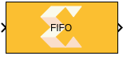

# FIFO
This block allows specification of the FIFO depth on a particular path.
  
  

## Library

AI Engine/Interfaces

## Description

This block allows specification of the FIFO depth on a particular path.
Specifying the FIFO depth value can help avoid deadlock or stalling by
creating more buffering in the paths. This block does not affect
functional simulation and will only impact the generated graph code. You
can also set location constraints for the FIFO block using the
Constraint manager. FIFOs can be either stream FIFOs, DMA FIFOs, or a
combination of the two.

## Parameters

#### FIFO Depth (32-bit words)  
Should be a positive integer value and the default value is 0.

### Constraints
Click on the button given here to access the constraint manager and add or update location contraints and choose between a DMA or Stram FIFO. Constraints will only affect the generated graph code, cycle approximate AIE simulation (System C), and behavior in hardware.

If you are using non-default constraints for any of the kernels for the block, an asterisk (*) will be displayed next to the button.

## References
To learn more about FIFO and different types of FIFOs click [here](https://docs.xilinx.com/r/en-US/ug1079-ai-engine-kernel-coding/FIFO-Depth).
