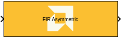
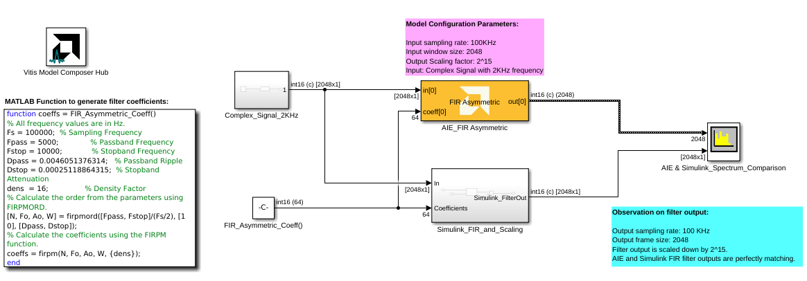
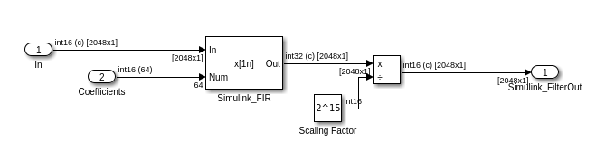
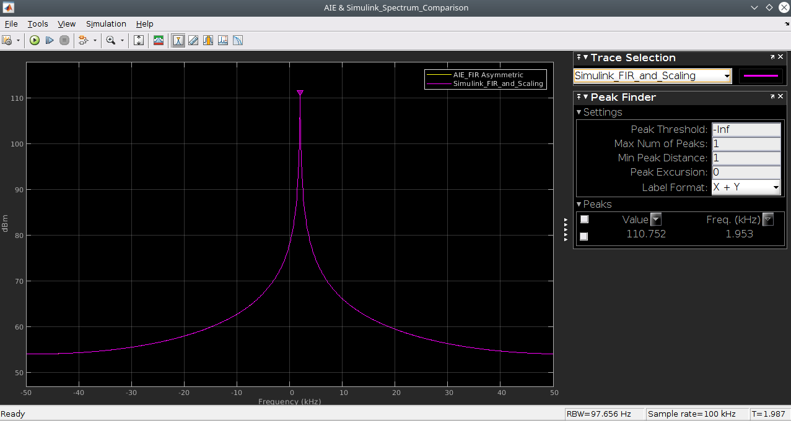
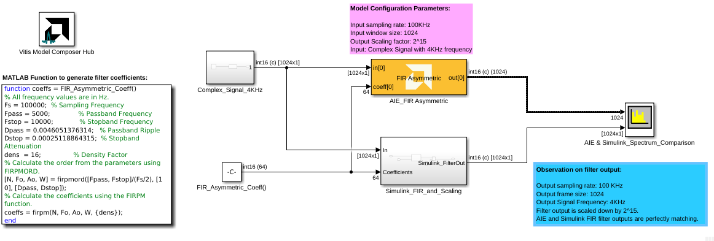
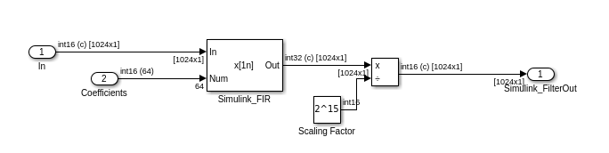
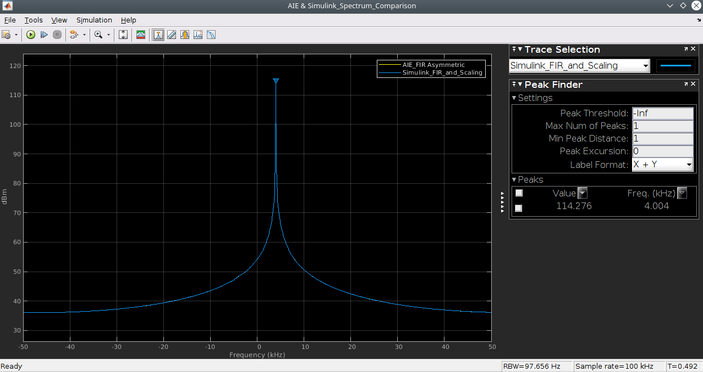

# FIR Asymmetric
Single Rate Asymmetric FIR Filter for AI Engines.
  
  

## Library

AI Engine/DSP/Buffer IO

## Description

Single Rate Asymmetric FIR Filter for AI Engines.

## Parameters

### Main  
#### Input/Output data type  
Set the data type of the block input and output. The data type of the input signal to the block must match this setting.

#### Filter coefficients data type  
Set the filter coefficients data type. This parameter's setting may be restricted based on the Input/Output data type. In particular, 

- Complex types are only supported when the Input/Output data type is
  also complex.
- 32-bit types are only supported when the Input/Output data type is
  also a 32-bit type.
- Filter coefficients data type must be an integer type if the
  Input/Output data type is an integer type.
- Filter coefficients data type must be a float type if the Input/Output
  data type is a float type.

#### Specify filter coefficients via input port  
When this option is enabled, the tool allows you to specify reloadable filter coefficients via an input port.

#### Filter coefficients  
This field specifies the asymmetric filter coefficients. It could also be a MATLAB array variable defined in the workspace.

You can use the FDATool block to design the filter and use the coefficients directly in this field using the function "xlfda_numerator". 
See the example below for more information.

#### Input window size (Number of samples)  
Describes the number of samples used as an input to the filter function.
Because this is a single rate filter, the number of samples in the output window will match the size of the input window. This must be in the range of 4 to 8192 inclusive. 

#### Scale output down by 2^  
Sets the power of 2 shift down applied to the accumulator of FIR before output. It must be in the range 0 to 61 inclusive.

#### Rounding mode  
Set the selection of rounding to be applied during the shift down stage of processing.

#### Number of cascade stages  
Determines the number of AI Engine processors to split the operation over. This allows AI Engine tiles to be traded for higher throughput. See the example below on how the number of cascade stages affect the throughput. The value must be in the range 1 to 9.

### Constraints
Click on the button given here to access the constraint manager and add or update constraints for each kernel. If you set the "Number of cascade stages" parameter to a value greater than one, multiple kernels will be used to process the input. You can use the constraint manager to optimize the performance of your design by setting specific constraints for each kernel (in this case, you need to first run your design). Adding constraints will not affect the functional simulation in Simulink. Constraints will only affect the generated graph code, cycle approximate AIE simulation (System C), and behavior in hardware.

If you are using non-default constraints for any of the kernels for the block, an asterisk (*) will be displayed next to the button.

## FIR Asymmetric Block Example1

**Simulink_FIR_and_Scaling Subsystem Blocks:**

**AIE and Simulink FIR Asymmetric Filter Output Spectrum Comparison:**

## FIR Asymmetric Block Example2

**Simulink_FIR_and_Scaling Subsystem Blocks:**

**AIE and Simulink FIR Asymmetric Filter Output Sectrum Comparison:**

### Examples
[AI Engine FIR Assymetric](https://github.com/Xilinx/Vitis_Model_Composer/tree/HEAD/Examples/AIENGINE/DSPlib/fir)

### References
This block uses the Vitis DSP library implementation of a FIR filter. For more details on this implementation please click [here](https://docs.xilinx.com/r/en-US/Vitis_Libraries/dsp/user_guide/L2/func-fir-filters.html).
