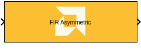
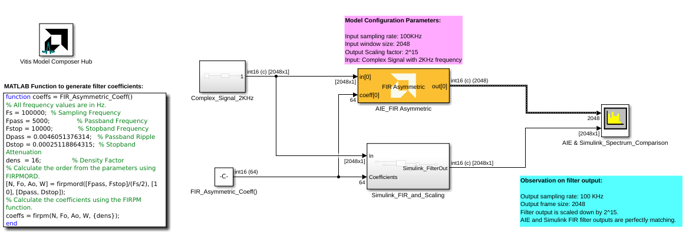
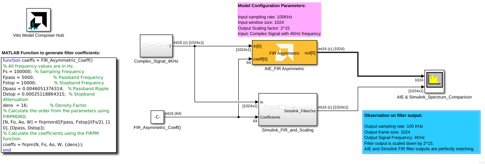

<!-- Library: aieDSP -->

# FIR Asymmetric
Single Rate Asymmetric FIR Filter for AI Engines.
  
  

## Library

AI Engine/DSP/Buffer IO

## Description

Single Rate Asymmetric FIR Filter for AI Engines.

## Parameters

### Main  
#### Input/Output data type  
The data type of individual samples input to and output from the filter function.

#### Filter coefficients data type  
Set the filter coefficients data type. This parameter's setting may be restricted based on the Input/Output data type. In particular, 

- Complex types are only supported when the Input/Output data type is
  also complex.
- 32-bit types are only supported when the Input/Output data type is
  also a 32-bit type.
- Filter coefficients data type must be an integer type if the
  Input/Output data type is an integer type.
- Filter coefficients data type must be a float type if the Input/Output
  data type is a float type.

#### Specify filter coefficients via input port  
When this option is enabled, the tool allows you to specify reloadable filter coefficients via an [asynchronous Run Time Parameter (RTP)](https://github.com/Xilinx/Vitis_Model_Composer/blob/2025.2/Examples/AIENGINE/Run_Time_Parameters/rtp_vector_async) input port.

#### Provide second set of output ports
When this option is enabled, a second output port is added to the block producing the same data as the first output port.

#### Filter coefficients  
This field specifies the asymmetric filter coefficients. It could also be a MATLAB array variable defined in the workspace.

You can use the FDATool block to design the filter and use the coefficients directly in this field using the function "xlfda_numerator". 
See the example below for more information.

#### Filter length
Specify FIR length for coefficient reloading.

#### Input window size (Number of samples)  
Describes the number of samples used as an input to the filter function.
Because this is a single rate filter, the number of samples in the output window will match the size of the input window. This must be in the range of 4 to 8192 inclusive. 

#### Scale output down by 2^  
Sets the power of 2 shift down applied to the accumulator of FIR before output. It must be in the range 0 to 61 inclusive.

#### Rounding mode

Describes the selection of rounding to be applied during the shift down stage of processing.

The following modes are available:
* **Floor:** Truncate LSB, always round down (towards negative infinity).
* **Ceiling:** Always round up (towards positive infinity).
* **Round to positive infinity:** Round halfway towards positive infinity.
* **Round to negative infinity:** Round halfway towards negative infinity.
* **Round symmetrical to infinity:** Round halfway towards infinity (away from zero).
* **Round symmetrical to zero:** Round halfway towards zero (away from infinity).
* **Round convergent to even:** Round halfway towards nearest even number.
* **Round convergent to odd:** Round halfway towards nearest odd number.

No rounding is performed on the **Floor** or **Ceiling** modes. Other modes round to the nearest integer. They differ only in how they round for values that are exactly between two integers.

#### Saturation mode

Describes the selection of saturation to be applied during the shift down stage of processing.

The following modes are available:
* **None:** No saturation is performed and the value is truncated on the MSB side.
* **Asymmetric:** Rounds an n-bit signed value in the range `-2^(n-1)` to `2^(n-1)-1`.
* **Symmetric:** Rounds an n-bit signed value in the range `-2^(n-1)-1` to `2^(n-1)-1`.

#### Number of cascade stages
Specify the number of kernels to cascade in series to increase throughput.

### Constraints
Click on the button given here to access the constraint manager and add or update constraints for each kernel. If you set the "Number of cascade stages" parameter to a value greater than one, multiple kernels will be used to process the input. You can use the constraint manager to optimize the performance of your design by setting specific constraints for each kernel (in this case, you need to first run your design). Adding constraints will not affect the functional simulation in Simulink. Constraints will only affect the generated graph code, cycle approximate AIE simulation (System C), and behavior in hardware.

If you are using non-default constraints for any of the kernels for the block, an asterisk (*) will be displayed next to the button.

## Examples

***Click on the images below to open each model.***

<!--
DESCRIPTION:
Model: FIR_Asymmetric_Ex1
Generated: 09-Jan-2026 13:43:28

Vitis Model Composer Configuration:
  Target Device: xcvc1902-vsva2197-1LP-e-S

Vitis Model Composer Blocks:
  - AIE: FIR Asymmetric

Description:
This MATLAB script creates a Vitis Model Composer Simulink model that uses the AI Engine FIR Asymmetric block. A 2kHz complex input signal is provided to the block,  and results are compared against a Simulink reference implementation.

-->

<!--
MATLAB CREATION SCRIPT:

% create_FIR_Asymmetric_Ex1_model.m
% Auto-generated script to recreate the FIR_Asymmetric_Ex1 Simulink model
% Generated on: 09-Jan-2026 13:43:28

%% Model Configuration
modelName = 'FIR_Asymmetric_Ex1_recreated';

%% Create New Model
if bdIsLoaded(modelName)
    close_system(modelName, 0);
end

new_system(modelName);
open_system(modelName);
fprintf('Created new model: %s\n', modelName);

%% Add Vitis Model Composer Hub Block
hubBlockPath = [modelName '/Vitis Model Composer Hub'];
add_block('vmcUtilities/Vitis Model Composer Hub', hubBlockPath, ...
    'Position', [27 -12 82 41]);

hubBlk = xmcFindHubBlock(modelName);
vmchub_set_param(hubBlk, modelName, 'SelectHardware', 'xcvc1902-vsva2197-1LP-e-S');

%% Add Top-Level Blocks
add_block('built-in/SpectrumAnalyzer', [modelName '/AIE & Simulink_Spectrum_Comparison'], ...
    'Position', [1010 101 1055 154]);
set_param([modelName '/AIE & Simulink_Spectrum_Comparison'], ...
    'NumInputPorts', '2', ...
    'OpenAtSimulationStart', 'on', ...
    'WindowPosition', '[878 430 800 500]', ...
    'InputDomain', 'Time', ...
    'SpectrumType', 'Power', ...
    'ViewType', 'Spectrum', ...
    'Method', 'Filter bank', ...
    'SampleRateSource', 'Inherited', ...
    'SampleRate', '10000', ...
    'PlotAsTwoSidedSpectrum', 'on', ...
    'FrequencyScale', 'Linear', ...
    'PlotType', 'Line', ...
    'AxesScaling', 'Auto', ...
    'AxesScalingNumUpdates', '100', ...
    'FrequencyResolutionMethod', 'RBW', ...
    'RBWSource', 'Auto', ...
    'RBW', '9.76', ...
    'WindowInvariantSamplesPerUpdate', 'off', ...
    'WindowLength', '1024', ...
    'FFTLengthSource', 'Auto', ...
    'FFTLength', '1024', ...
    'FilterSharpness', '0.3', ...
    'FrequencySpan', 'Full', ...
    'Span', '10000', ...
    'CenterFrequency', '0', ...
    'StartFrequency', '-5000', ...
    'StopFrequency', '5000', ...
    'InputUnits', 'dBm', ...
    'FrequencyVectorSource', 'Auto', ...
    'FrequencyVector', '[-5000,5000]', ...
    'Window', 'Hann', ...
    'CustomWindow', 'hann', ...
    'SidelobeAttenuation', '60', ...
    'OverlapPercent', '0', ...
    'AveragingMethod', 'Exponential', ...
    'SpectralAverages', '1', ...
    'ForgettingFactor', '0.9', ...
    'VBWSource', 'Auto', ...
    'VBW', '9.76', ...
    'SpectrumUnits', 'dBm', ...
    'FullScaleSource', 'Auto', ...
    'FullScale', '1', ...
    'ReferenceLoad', '1', ...
    'FrequencyOffset', '0', ...
    'SpectrogramChannel', '1', ...
    'TimeResolutionSource', 'Auto', ...
    'TimeResolution', '1e-3', ...
    'TimeSpanSource', 'Auto', ...
    'TimeSpan', '0.1', ...
    'MaximizeAxes', 'Auto', ...
    'PlotNormalTrace', 'on', ...
    'PlotMaxHoldTrace', 'off', ...
    'PlotMinHoldTrace', 'off', ...
    'YLimits', '[-80,20]', ...
    'ColorLimits', '[-80,20]', ...
    'Colormap', 'jet', ...
    'ShowGrid', 'on', ...
    'ShowLegend', 'on', ...
    'ShowColorbar', 'on', ...
    'ChannelNames', '[""]', ...
    'AxesLayout', 'Vertical');
add_block('aieDSP/FIR Asymmetric', [modelName '/AIE_FIR Asymmetric'], ...
    'Position', [615 67 765 123]);
set_param([modelName '/AIE_FIR Asymmetric'], ...
    'data_type', 'cfloat', ...
    'coef_type', 'float', ...
    'use_coeff_reload', 'on', ...
    'num_outputs', 'off', ...
    'coeff', '[1, zeros(1,31)]', ...
    'fir_length', '64', ...
    'input_window_size', '1024', ...
    'shift_val', '0', ...
    'rnd_mode', 'Round to positive infinity', ...
    'sat_mode', '0-None', ...
    'casc_length', '1', ...
    'TP_API', '0', ...
    'dual_ip', '0', ...
    'ssr', '1');
add_block('built-in/Constant', [modelName '/FIR_Asymmetric_Coeff()'], ...
    'Position', [380 185 410 215]);
set_param([modelName '/FIR_Asymmetric_Coeff()'], ...
    'Value', 'coeffs', ...
    'VectorParams1D', 'on', ...
    'OutMin', '[]', ...
    'OutMax', '[]', ...
    'OutDataTypeStr', 'single', ...
    'LockScale', 'off', ...
    'SampleTime', 'inf', ...
    'FramePeriod', 'inf');
add_block('dspmlti4/FIR Decimation', [modelName '/Simulink_FIR'], ...
    'Position', [645 156 730 214]);
set_param([modelName '/Simulink_FIR'], ...
    'FilterSource', 'Input port', ...
    'h', 'designMultirateFIR(1,2)', ...
    'D', '1', ...
    'filtStruct', 'Direct form', ...
    'FilterObject', 'FDECIM', ...
    'InputProcessing', 'Columns as channels (frame based)', ...
    'framing', 'Enforce single-rate processing', ...
    'AllowArbitraryInputLength', 'off', ...
    'outputBufInitCond', '0', ...
    'roundingMode', 'Floor', ...
    'overflowMode', 'off', ...
    'firstCoeffMode', 'Same word length as input', ...
    'firstCoeffWordLength', '16', ...
    'firstCoeffFracLength', '15', ...
    'firstCoeffDataTypeStr', 'Inherit: Same word length as input', ...
    'firstCoeffMin', '[]', ...
    'firstCoeffMax', '[]', ...
    'firstCoeffLastDataTypeStr', 'Inherit: Same word length as input', ...
    'prodOutputMode', 'Inherit via internal rule', ...
    'prodOutputWordLength', '32', ...
    'prodOutputFracLength', '30', ...
    'prodOutputDataTypeStr', 'Inherit: Inherit via internal rule', ...
    'prodOutputLastDataTypeStr', 'Inherit: Inherit via internal rule', ...
    'accumMode', 'Inherit via internal rule', ...
    'accumWordLength', '32', ...
    'accumFracLength', '30', ...
    'accumDataTypeStr', 'Inherit: Inherit via internal rule', ...
    'accumLastDataTypeStr', 'Inherit: Inherit via internal rule', ...
    'outputMode', 'Same as accumulator', ...
    'outputWordLength', '16', ...
    'outputFracLength', '15', ...
    'outputDataTypeStr', 'Inherit: Same as accumulator', ...
    'outputMin', '[]', ...
    'outputMax', '[]', ...
    'outputLastDataTypeStr', 'Inherit: Same as accumulator', ...
    'LockScale', 'off');
add_block('vmcUtilities/Vitis Model Composer Hub', [modelName '/Vitis Model Composer Hub'], ...
    'Position', [27 -12 82 41]);
set_param([modelName '/Vitis Model Composer Hub'], ...
    'CodeGeneration', 'off', ...
    'StartColumn', '1', ...
    'NumberOfColumns', '1', ...
    'TargetDirectory', './code', ...
    'exportDesign', 'off', ...
    'analyzeDesign', 'off', ...
    'validateDesignOnHw', 'off', ...
    'ExportType', 'AI Engines', ...
    'IpVendor', 'xilinx.com', ...
    'IpLibrary', 'hls', ...
    'IpVersion', '1.0', ...
    'IpHWLanguage', 'Verilog', ...
    'AieCompilerOptions', '{}', ...
    'CreateTestbench', 'off', ...
    'TestbenchStackSize', '10', ...
    'RunRtlSim', 'off', ...
    'RunCSim', 'off', ...
    'RunAieSim', 'off', ...
    'AieSimTimeout', '50000', ...
    'RunAieSimProfiling', 'off', ...
    'LaunchVitisAnalyzer', 'off', ...
    'PlotOutput', 'off', ...
    'GenHwImage', 'off', ...
    'GenLibadfXo', 'off', ...
    'GenHwValidationCode', 'off', ...
    'PlatformType', 'Not Specified', ...
    'HwSystemType', 'Baremetal', ...
    'HwValidationTarget', 'hw', ...
    'ProjDevice', 'xcvc1902-vsva2197-1LP-e-S', ...
    'SamplePeriod', '-1', ...
    'ClockFrequency', '200', ...
    'DataPathParallelism', '1', ...
    'xilinxfamily', 'versalaicore', ...
    'part', 'xcvc1902', ...
    'speed', '-1LP-e-S', ...
    'package', 'vsva2197', ...
    'directory', './netlist', ...
    'testbench', 'off', ...
    'incr_netlist', 'off', ...
    'synthesis_tool', 'Vivado', ...
    'clock_wrapper', 'Clock Enables', ...
    'dbl_ovrd', 'According to Block Masks', ...
    'dcm_input_clock_period', '10', ...
    'sysclk_period', '10', ...
    'simulink_period', '1', ...
    'eval_field', '0', ...
    'LogFileName', '''''', ...
    'NThreads', '4');

%% Create Complex_Signal_2KHz Subsystem
add_block('built-in/SubSystem', [modelName '/Complex_Signal_2KHz'], ...
    'Position', [355 54 430 106]);

% Remove default blocks
defaultBlocks = find_system([modelName '/Complex_Signal_2KHz'], 'SearchDepth', 1, 'Type', 'block');
for i = 1:length(defaultBlocks)
    if ~strcmp(defaultBlocks{i}, [modelName '/Complex_Signal_2KHz'])
        delete_block(defaultBlocks{i});
    end
end

add_block('dspsrcs4/Sine Wave', [[modelName '/Complex_Signal_2KHz'] '/Sine Wave'], ...
    'Position', [20 23 65 67]);
set_param([[modelName '/Complex_Signal_2KHz'] '/Sine Wave'], ...
    'Amplitude', '1', ...
    'Frequency', '2e3', ...
    'Phase', '0', ...
    'SampleMode', 'Discrete', ...
    'OutComplex', 'Complex', ...
    'CompMethod', 'Trigonometric fcn', ...
    'TableSize', 'Speed', ...
    'SampleTime', '1/100e3', ...
    'SamplesPerFrame', '1024', ...
    'ResetState', 'Restart at time zero', ...
    'OutputFrames', 'off', ...
    'additionalParams', 'off', ...
    'allowOverrides', 'on', ...
    'dataType', 'single', ...
    'wordLen', '16', ...
    'udDataType', 'sfix(16)', ...
    'fracBitsMode', 'Best precision', ...
    'numFracBits', '15', ...
    'OutDataTypeStr', 'single', ...
    'LastOutDataTypeStr', 'single');
add_block('built-in/Outport', [[modelName '/Complex_Signal_2KHz'] '/Out1'], ...
    'Position', [285 38 315 52]);
set_param([[modelName '/Complex_Signal_2KHz'] '/Out1'], ...
    'Port', '1', ...
    'StorageClass', 'Auto', ...
    'IconDisplay', 'Port number', ...
    'OutputFunctionCall', 'off', ...
    'OutMin', '[]', ...
    'OutMax', '[]', ...
    'OutDataTypeStr', 'Inherit: auto', ...
    'LockScale', 'off', ...
    'BusOutputAsStruct', 'off', ...
    'BusVirtuality', 'inherit', ...
    'DataMode', 'inherit', ...
    'Unit', 'inherit', ...
    'PortDimensions', '-1', ...
    'VarSizeSig', 'Inherit', ...
    'SampleTime', '-1', ...
    'SignalType', 'auto', ...
    'EnsureOutportIsVirtual', 'off', ...
    'OutputWhenDisabled', 'held', ...
    'InitialOutput', '[]', ...
    'MustResolveToSignalObject', 'off', ...
    'OutputWhenUnConnected', 'off', ...
    'OutputWhenUnconnectedValue', '0', ...
    'VectorParamsAs1DForOutWhenUnconnected', 'on');

% Connect blocks in Complex_Signal_2KHz
add_line([modelName '/Complex_Signal_2KHz'], 'Sine Wave/2', 'Out1/2', 'autorouting', 'on');

%% Connect Top-Level Blocks
add_line(modelName, 'FIR_Asymmetric_Coeff()/2', 'Simulink_FIR/3', 'autorouting', 'on');
add_line(modelName, 'FIR_Asymmetric_Coeff()/2', 'AIE_FIR Asymmetric/3', 'autorouting', 'on');
add_line(modelName, 'FIR_Asymmetric_Coeff()/2', 'AIE_FIR Asymmetric/3', 'autorouting', 'on');
add_line(modelName, 'AIE_FIR Asymmetric/2', 'AIE & Simulink_Spectrum_Comparison/2', 'autorouting', 'on');
add_line(modelName, 'Complex_Signal_2KHz/2', 'Simulink_FIR/2', 'autorouting', 'on');
add_line(modelName, 'Complex_Signal_2KHz/2', 'AIE_FIR Asymmetric/2', 'autorouting', 'on');
add_line(modelName, 'Complex_Signal_2KHz/2', 'AIE_FIR Asymmetric/2', 'autorouting', 'on');
add_line(modelName, 'Simulink_FIR/2', 'AIE & Simulink_Spectrum_Comparison/3', 'autorouting', 'on');

%% Save Model
save_system(modelName);
fprintf('\nModel saved: %s.slx\n', modelName);
-->

<!--
DESCRIPTION:
Model: FIR_Asymmetric_Ex2
Generated: 09-Jan-2026 13:43:32

Vitis Model Composer Configuration:
  Target Device: xcvc1902-vsva2197-1LP-e-S

Vitis Model Composer Blocks:
  - AIE: FIR Asymmetric

Description:
This MATLAB script creates a Vitis Model Composer Simulink model that uses the AI Engine FIR Asymmetric block. A 2kHz complex input signal is provided to the block, 

-->

<!--
MATLAB CREATION SCRIPT:

% create_FIR_Asymmetric_Ex2_model.m
% Auto-generated script to recreate the FIR_Asymmetric_Ex2 Simulink model
% Generated on: 09-Jan-2026 13:43:32

%% Model Configuration
modelName = 'FIR_Asymmetric_Ex2_recreated';

%% Create New Model
if bdIsLoaded(modelName)
    close_system(modelName, 0);
end

new_system(modelName);
open_system(modelName);
fprintf('Created new model: %s\n', modelName);

%% Add Vitis Model Composer Hub Block
hubBlockPath = [modelName '/Vitis Model Composer Hub'];
add_block('vmcUtilities/Vitis Model Composer Hub', hubBlockPath, ...
    'Position', [67 18 122 71]);

hubBlk = xmcFindHubBlock(modelName);
vmchub_set_param(hubBlk, modelName, 'SelectHardware', 'xcvc1902-vsva2197-1LP-e-S');

%% Add Top-Level Blocks
add_block('built-in/SpectrumAnalyzer', [modelName '/AIE & Simulink_Spectrum_Comparison'], ...
    'Position', [990 161 1035 214]);
set_param([modelName '/AIE & Simulink_Spectrum_Comparison'], ...
    'NumInputPorts', '2', ...
    'OpenAtSimulationStart', 'on', ...
    'WindowPosition', '[878 430 800 500]', ...
    'InputDomain', 'Time', ...
    'SpectrumType', 'Power', ...
    'ViewType', 'Spectrum', ...
    'Method', 'Filter bank', ...
    'SampleRateSource', 'Inherited', ...
    'SampleRate', '10000', ...
    'PlotAsTwoSidedSpectrum', 'on', ...
    'FrequencyScale', 'Linear', ...
    'PlotType', 'Line', ...
    'AxesScaling', 'Auto', ...
    'AxesScalingNumUpdates', '100', ...
    'FrequencyResolutionMethod', 'RBW', ...
    'RBWSource', 'Auto', ...
    'RBW', '9.76', ...
    'WindowInvariantSamplesPerUpdate', 'off', ...
    'WindowLength', '1024', ...
    'FFTLengthSource', 'Auto', ...
    'FFTLength', '1024', ...
    'FilterSharpness', '0.3', ...
    'FrequencySpan', 'Full', ...
    'Span', '10000', ...
    'CenterFrequency', '0', ...
    'StartFrequency', '-5000', ...
    'StopFrequency', '5000', ...
    'InputUnits', 'dBm', ...
    'FrequencyVectorSource', 'Auto', ...
    'FrequencyVector', '[-5000,5000]', ...
    'Window', 'Hann', ...
    'CustomWindow', 'hann', ...
    'SidelobeAttenuation', '60', ...
    'OverlapPercent', '0', ...
    'AveragingMethod', 'Exponential', ...
    'SpectralAverages', '1', ...
    'ForgettingFactor', '0.9', ...
    'VBWSource', 'Auto', ...
    'VBW', '9.76', ...
    'SpectrumUnits', 'dBm', ...
    'FullScaleSource', 'Auto', ...
    'FullScale', '1', ...
    'ReferenceLoad', '1', ...
    'FrequencyOffset', '0', ...
    'SpectrogramChannel', '1', ...
    'TimeResolutionSource', 'Auto', ...
    'TimeResolution', '1e-3', ...
    'TimeSpanSource', 'Auto', ...
    'TimeSpan', '0.1', ...
    'MaximizeAxes', 'Auto', ...
    'PlotNormalTrace', 'on', ...
    'PlotMaxHoldTrace', 'off', ...
    'PlotMinHoldTrace', 'off', ...
    'YLimits', '[-80,20]', ...
    'ColorLimits', '[-80,20]', ...
    'Colormap', 'jet', ...
    'ShowGrid', 'on', ...
    'ShowLegend', 'on', ...
    'ShowColorbar', 'on', ...
    'ChannelNames', '[""]', ...
    'AxesLayout', 'Vertical');
add_block('aieDSP/FIR Asymmetric', [modelName '/AIE_FIR Asymmetric'], ...
    'Position', [590 92 740 148]);
set_param([modelName '/AIE_FIR Asymmetric'], ...
    'data_type', 'cint16', ...
    'coef_type', 'int16', ...
    'use_coeff_reload', 'on', ...
    'num_outputs', 'off', ...
    'coeff', '[1, zeros(1,31)]', ...
    'fir_length', '64', ...
    'input_window_size', '1024', ...
    'shift_val', '15', ...
    'rnd_mode', 'Round to positive infinity', ...
    'sat_mode', '0-None', ...
    'casc_length', '1', ...
    'TP_API', '0', ...
    'dual_ip', '0', ...
    'ssr', '1');
add_block('built-in/Constant', [modelName '/FIR_Asymmetric_Coeff()'], ...
    'Position', [355 255 385 285]);
set_param([modelName '/FIR_Asymmetric_Coeff()'], ...
    'Value', '(coeffs*2^15)', ...
    'VectorParams1D', 'on', ...
    'OutMin', '[]', ...
    'OutMax', '[]', ...
    'OutDataTypeStr', 'int16', ...
    'LockScale', 'off', ...
    'SampleTime', 'inf', ...
    'FramePeriod', 'inf');
add_block('vmcUtilities/Vitis Model Composer Hub', [modelName '/Vitis Model Composer Hub'], ...
    'Position', [67 18 122 71]);
set_param([modelName '/Vitis Model Composer Hub'], ...
    'CodeGeneration', 'off', ...
    'StartColumn', '1', ...
    'NumberOfColumns', '1', ...
    'TargetDirectory', './code', ...
    'exportDesign', 'off', ...
    'analyzeDesign', 'off', ...
    'validateDesignOnHw', 'off', ...
    'ExportType', 'AI Engines', ...
    'IpVendor', 'xilinx.com', ...
    'IpLibrary', 'hls', ...
    'IpVersion', '1.0', ...
    'IpHWLanguage', 'Verilog', ...
    'AieCompilerOptions', '{}', ...
    'CreateTestbench', 'off', ...
    'TestbenchStackSize', '10', ...
    'RunRtlSim', 'off', ...
    'RunCSim', 'off', ...
    'RunAieSim', 'off', ...
    'AieSimTimeout', '50000', ...
    'RunAieSimProfiling', 'off', ...
    'LaunchVitisAnalyzer', 'off', ...
    'PlotOutput', 'off', ...
    'GenHwImage', 'off', ...
    'GenLibadfXo', 'off', ...
    'GenHwValidationCode', 'off', ...
    'PlatformType', 'Not Specified', ...
    'HwSystemType', 'Baremetal', ...
    'HwValidationTarget', 'hw', ...
    'ProjDevice', 'xcvc1902-vsva2197-1LP-e-S', ...
    'SamplePeriod', '-1', ...
    'ClockFrequency', '200', ...
    'DataPathParallelism', '1', ...
    'xilinxfamily', 'versalaicore', ...
    'part', 'xcvc1902', ...
    'speed', '-1LP-e-S', ...
    'package', 'vsva2197', ...
    'directory', './netlist', ...
    'testbench', 'off', ...
    'incr_netlist', 'off', ...
    'synthesis_tool', 'Vivado', ...
    'clock_wrapper', 'Clock Enables', ...
    'dbl_ovrd', 'According to Block Masks', ...
    'dcm_input_clock_period', '10', ...
    'sysclk_period', '10', ...
    'simulink_period', '1', ...
    'eval_field', '0', ...
    'LogFileName', '''''', ...
    'NThreads', '4');

%% Create Complex_Signal_2KHz Subsystem
add_block('built-in/SubSystem', [modelName '/Complex_Signal_2KHz'], ...
    'Position', [330 79 405 131]);

% Remove default blocks
defaultBlocks = find_system([modelName '/Complex_Signal_2KHz'], 'SearchDepth', 1, 'Type', 'block');
for i = 1:length(defaultBlocks)
    if ~strcmp(defaultBlocks{i}, [modelName '/Complex_Signal_2KHz'])
        delete_block(defaultBlocks{i});
    end
end

add_block('built-in/DataTypeConversion', [[modelName '/Complex_Signal_2KHz'] '/Data Type Conversion'], ...
    'Position', [125 28 200 62]);
set_param([[modelName '/Complex_Signal_2KHz'] '/Data Type Conversion'], ...
    'OutMin', '[]', ...
    'OutMax', '[]', ...
    'OutDataTypeStr', 'int16', ...
    'LockScale', 'off', ...
    'ConvertRealWorld', 'Stored Integer (SI)', ...
    'RndMeth', 'Floor', ...
    'SaturateOnIntegerOverflow', 'off', ...
    'SampleTime', '-1');
add_block('dspsrcs4/Sine Wave', [[modelName '/Complex_Signal_2KHz'] '/Sine Wave'], ...
    'Position', [-40 23 5 67]);
set_param([[modelName '/Complex_Signal_2KHz'] '/Sine Wave'], ...
    'Amplitude', '1', ...
    'Frequency', '2e3', ...
    'Phase', '0', ...
    'SampleMode', 'Discrete', ...
    'OutComplex', 'Complex', ...
    'CompMethod', 'Table lookup', ...
    'TableSize', 'Speed', ...
    'SampleTime', '1/100e3', ...
    'SamplesPerFrame', '1024', ...
    'ResetState', 'Restart at time zero', ...
    'OutputFrames', 'off', ...
    'additionalParams', 'off', ...
    'allowOverrides', 'on', ...
    'dataType', 'Fixed-point', ...
    'wordLen', '16', ...
    'udDataType', 'sfix(16)', ...
    'fracBitsMode', 'User-defined', ...
    'numFracBits', '14', ...
    'OutDataTypeStr', 'fixdt(1,16,14)', ...
    'LastOutDataTypeStr', 'fixdt(1,16,14)');
add_block('built-in/Outport', [[modelName '/Complex_Signal_2KHz'] '/Out1'], ...
    'Position', [285 38 315 52]);
set_param([[modelName '/Complex_Signal_2KHz'] '/Out1'], ...
    'Port', '1', ...
    'StorageClass', 'Auto', ...
    'IconDisplay', 'Port number', ...
    'OutputFunctionCall', 'off', ...
    'OutMin', '[]', ...
    'OutMax', '[]', ...
    'OutDataTypeStr', 'Inherit: auto', ...
    'LockScale', 'off', ...
    'BusOutputAsStruct', 'off', ...
    'BusVirtuality', 'inherit', ...
    'DataMode', 'inherit', ...
    'Unit', 'inherit', ...
    'PortDimensions', '-1', ...
    'VarSizeSig', 'Inherit', ...
    'SampleTime', '-1', ...
    'SignalType', 'auto', ...
    'EnsureOutportIsVirtual', 'off', ...
    'OutputWhenDisabled', 'held', ...
    'InitialOutput', '[]', ...
    'MustResolveToSignalObject', 'off', ...
    'OutputWhenUnConnected', 'off', ...
    'OutputWhenUnconnectedValue', '0', ...
    'VectorParamsAs1DForOutWhenUnconnected', 'on');

% Connect blocks in Complex_Signal_2KHz
add_line([modelName '/Complex_Signal_2KHz'], 'Data Type Conversion/2', 'Out1/2', 'autorouting', 'on');
add_line([modelName '/Complex_Signal_2KHz'], 'Sine Wave/2', 'Data Type Conversion/2', 'autorouting', 'on');

%% Create Simulink_FIR_and_Scaling Subsystem
add_block('built-in/SubSystem', [modelName '/Simulink_FIR_and_Scaling'], ...
    'Position', [605 215 740 290]);

% Remove default blocks
defaultBlocks = find_system([modelName '/Simulink_FIR_and_Scaling'], 'SearchDepth', 1, 'Type', 'block');
for i = 1:length(defaultBlocks)
    if ~strcmp(defaultBlocks{i}, [modelName '/Simulink_FIR_and_Scaling'])
        delete_block(defaultBlocks{i});
    end
end

add_block('built-in/Inport', [[modelName '/Simulink_FIR_and_Scaling'] '/In'], ...
    'Position', [20 23 50 37]);
set_param([[modelName '/Simulink_FIR_and_Scaling'] '/In'], ...
    'Port', '1', ...
    'IconDisplay', 'Port number', ...
    'OutputFunctionCall', 'off', ...
    'OutMin', '[]', ...
    'OutMax', '[]', ...
    'OutDataTypeStr', 'Inherit: auto', ...
    'LockScale', 'off', ...
    'BusOutputAsStruct', 'off', ...
    'BusVirtuality', 'inherit', ...
    'Unit', 'inherit', ...
    'PortDimensions', '-1', ...
    'VarSizeSig', 'Inherit', ...
    'SampleTime', '-1', ...
    'SignalType', 'auto', ...
    'LatchByDelayingOutsideSignal', 'off', ...
    'LatchInputForFeedbackSignals', 'off', ...
    'Interpolate', 'on', ...
    'DataMode', 'inherit', ...
    'MessageQueueUseDefaultAttributes', 'on', ...
    'MessageQueueCapacity', '1', ...
    'MessageQueueType', 'LIFO', ...
    'MessageQueueOverwriting', 'on');
add_block('built-in/Inport', [[modelName '/Simulink_FIR_and_Scaling'] '/Coefficients'], ...
    'Position', [20 143 50 157]);
set_param([[modelName '/Simulink_FIR_and_Scaling'] '/Coefficients'], ...
    'Port', '2', ...
    'IconDisplay', 'Port number', ...
    'OutputFunctionCall', 'off', ...
    'OutMin', '[]', ...
    'OutMax', '[]', ...
    'OutDataTypeStr', 'Inherit: auto', ...
    'LockScale', 'off', ...
    'BusOutputAsStruct', 'off', ...
    'BusVirtuality', 'inherit', ...
    'Unit', 'inherit', ...
    'PortDimensions', '-1', ...
    'VarSizeSig', 'Inherit', ...
    'SampleTime', '-1', ...
    'SignalType', 'auto', ...
    'LatchByDelayingOutsideSignal', 'off', ...
    'LatchInputForFeedbackSignals', 'off', ...
    'Interpolate', 'on', ...
    'DataMode', 'inherit', ...
    'MessageQueueUseDefaultAttributes', 'on', ...
    'MessageQueueCapacity', '1', ...
    'MessageQueueType', 'LIFO', ...
    'MessageQueueOverwriting', 'on');
add_block('built-in/Product', [[modelName '/Simulink_FIR_and_Scaling'] '/Divide'], ...
    'Position', [415 127 445 158]);
set_param([[modelName '/Simulink_FIR_and_Scaling'] '/Divide'], ...
    'Inputs', '*/', ...
    'Multiplication', 'Element-wise(.*)', ...
    'CollapseMode', 'All dimensions', ...
    'CollapseDim', '1', ...
    'InputSameDT', 'off', ...
    'OutMin', '[]', ...
    'OutMax', '[]', ...
    'OutDataTypeStr', 'int16', ...
    'LockScale', 'off', ...
    'RndMeth', 'Floor', ...
    'SaturateOnIntegerOverflow', 'off', ...
    'SampleTime', '-1');
add_block('built-in/Constant', [[modelName '/Simulink_FIR_and_Scaling'] '/Scaling Factor'], ...
    'Position', [350 170 380 200]);
set_param([[modelName '/Simulink_FIR_and_Scaling'] '/Scaling Factor'], ...
    'Value', '2^15', ...
    'VectorParams1D', 'on', ...
    'OutMin', '[]', ...
    'OutMax', '[]', ...
    'OutDataTypeStr', 'int16', ...
    'LockScale', 'off', ...
    'SampleTime', 'inf', ...
    'FramePeriod', 'inf');
add_block('dspmlti4/FIR Decimation', [[modelName '/Simulink_FIR_and_Scaling'] '/Simulink_FIR'], ...
    'Position', [230 106 315 164]);
set_param([[modelName '/Simulink_FIR_and_Scaling'] '/Simulink_FIR'], ...
    'FilterSource', 'Input port', ...
    'h', 'designMultirateFIR(1,2)', ...
    'D', '1', ...
    'filtStruct', 'Direct form', ...
    'FilterObject', 'FDECIM', ...
    'InputProcessing', 'Columns as channels (frame based)', ...
    'framing', 'Enforce single-rate processing', ...
    'AllowArbitraryInputLength', 'off', ...
    'outputBufInitCond', '0', ...
    'roundingMode', 'Floor', ...
    'overflowMode', 'off', ...
    'firstCoeffMode', 'Same word length as input', ...
    'firstCoeffWordLength', '16', ...
    'firstCoeffFracLength', '15', ...
    'firstCoeffDataTypeStr', 'Inherit: Same word length as input', ...
    'firstCoeffMin', '[]', ...
    'firstCoeffMax', '[]', ...
    'firstCoeffLastDataTypeStr', 'Inherit: Same word length as input', ...
    'prodOutputMode', 'Inherit via internal rule', ...
    'prodOutputWordLength', '28', ...
    'prodOutputFracLength', '0', ...
    'prodOutputDataTypeStr', 'Inherit: Inherit via internal rule', ...
    'prodOutputLastDataTypeStr', 'Inherit: Inherit via internal rule', ...
    'accumMode', 'Inherit via internal rule', ...
    'accumWordLength', '32', ...
    'accumFracLength', '0', ...
    'accumDataTypeStr', 'Inherit: Inherit via internal rule', ...
    'accumLastDataTypeStr', 'Inherit: Inherit via internal rule', ...
    'outputMode', 'Same as accumulator', ...
    'outputWordLength', '32', ...
    'outputFracLength', '0', ...
    'outputDataTypeStr', 'Inherit: Same as accumulator', ...
    'outputMin', '[]', ...
    'outputMax', '[]', ...
    'outputLastDataTypeStr', 'Inherit: Same as accumulator', ...
    'LockScale', 'off');
add_block('built-in/Outport', [[modelName '/Simulink_FIR_and_Scaling'] '/Simulink_FilterOut'], ...
    'Position', [640 138 670 152]);
set_param([[modelName '/Simulink_FIR_and_Scaling'] '/Simulink_FilterOut'], ...
    'Port', '1', ...
    'StorageClass', 'Auto', ...
    'IconDisplay', 'Port number', ...
    'OutputFunctionCall', 'off', ...
    'OutMin', '[]', ...
    'OutMax', '[]', ...
    'OutDataTypeStr', 'Inherit: auto', ...
    'LockScale', 'off', ...
    'BusOutputAsStruct', 'off', ...
    'BusVirtuality', 'inherit', ...
    'DataMode', 'inherit', ...
    'Unit', 'inherit', ...
    'PortDimensions', '-1', ...
    'VarSizeSig', 'Inherit', ...
    'SampleTime', '-1', ...
    'SignalType', 'auto', ...
    'EnsureOutportIsVirtual', 'off', ...
    'OutputWhenDisabled', 'held', ...
    'InitialOutput', '[]', ...
    'MustResolveToSignalObject', 'off', ...
    'OutputWhenUnConnected', 'off', ...
    'OutputWhenUnconnectedValue', '0', ...
    'VectorParamsAs1DForOutWhenUnconnected', 'on');

% Connect blocks in Simulink_FIR_and_Scaling
add_line([modelName '/Simulink_FIR_and_Scaling'], 'Coefficients/2', 'Simulink_FIR/3', 'autorouting', 'on');
add_line([modelName '/Simulink_FIR_and_Scaling'], 'In/2', 'Simulink_FIR/2', 'autorouting', 'on');
add_line([modelName '/Simulink_FIR_and_Scaling'], 'Divide/2', 'Simulink_FilterOut/2', 'autorouting', 'on');
add_line([modelName '/Simulink_FIR_and_Scaling'], 'Simulink_FIR/2', 'Divide/2', 'autorouting', 'on');
add_line([modelName '/Simulink_FIR_and_Scaling'], 'Scaling Factor/2', 'Divide/3', 'autorouting', 'on');

%% Connect Top-Level Blocks
add_line(modelName, 'Simulink_FIR_and_Scaling/2', 'AIE & Simulink_Spectrum_Comparison/3', 'autorouting', 'on');
add_line(modelName, 'AIE_FIR Asymmetric/2', 'AIE & Simulink_Spectrum_Comparison/2', 'autorouting', 'on');
add_line(modelName, 'FIR_Asymmetric_Coeff()/2', 'Simulink_FIR_and_Scaling/3', 'autorouting', 'on');
add_line(modelName, 'FIR_Asymmetric_Coeff()/2', 'AIE_FIR Asymmetric/3', 'autorouting', 'on');
add_line(modelName, 'FIR_Asymmetric_Coeff()/2', 'AIE_FIR Asymmetric/3', 'autorouting', 'on');
add_line(modelName, 'Complex_Signal_2KHz/2', 'AIE_FIR Asymmetric/2', 'autorouting', 'on');
add_line(modelName, 'Complex_Signal_2KHz/2', 'Simulink_FIR_and_Scaling/2', 'autorouting', 'on');
add_line(modelName, 'Complex_Signal_2KHz/2', 'Simulink_FIR_and_Scaling/2', 'autorouting', 'on');

%% Save Model
save_system(modelName);
fprintf('\nModel saved: %s.slx\n', modelName);
-->

[AI Engine FIR Assymetric](https://github.com/Xilinx/Vitis_Model_Composer/tree/HEAD/Examples/AIENGINE/DSPlib/fir)

### References
This block uses the Vitis DSP library implementation of a FIR filter. For more details on this implementation please click [here](https://docs.xilinx.com/r/en-US/Vitis_Libraries/dsp/user_guide/L2/func-fir-filtersAIE.html).

--------------
Copyright (C) 2025 Advanced Micro Devices, Inc.
All rights reserved.

SPDX-License-Identifier: MIT
