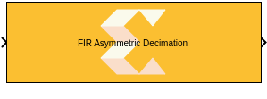
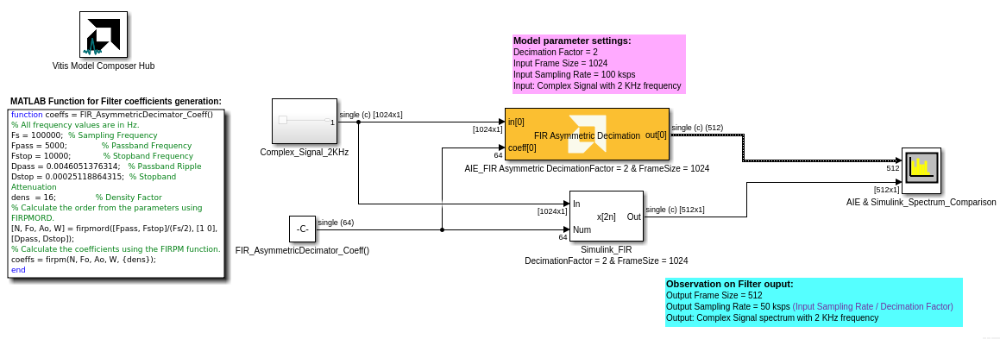
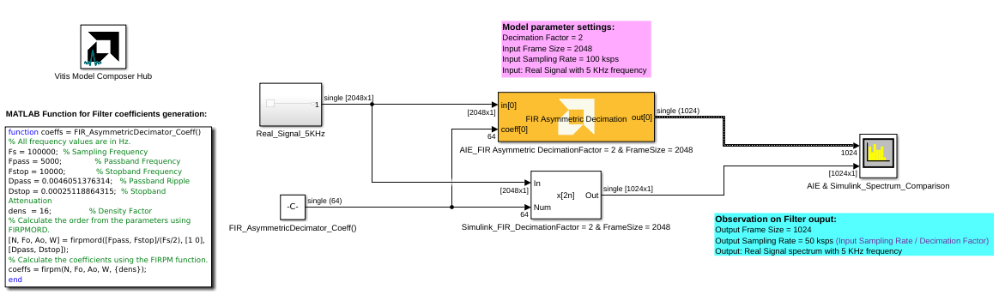

<!-- Library: aieDSP -->

# FIR Asymmetric Decimation
This block implements the FIR Asymmetric Decimation filter targeted for AI Engines.
  
  

## Library

AI Engine/DSP/Buffer IO

## Description

This block implements the FIR Asymmetric Decimation filter targeted for
AI Engines.

## Parameters

### Main  
#### Input/Output data type  
Describes the type of individual data samples input to and output from
the filter function. int16, cint16, int32, cint32, float, cfloat.

#### Filter coefficients data type  
Describes the type of individual coefficients of the filter taps. It
should be one of int16, cint16, int32, cint32, float, cfloat and must
also satisfy the following rules:

- Complex types are only supported when the Input/Output data type is
  also complex.
- 32-bit types are only supported when the Input/Output data type is
  also a 32-bit type.
- Filter coefficients data type must be an integer type if the
  Input/Output data type is an integer type.
- Filter coefficients data type must be a float type if the Input/Output
  data type is a float type.

#### Specify filter coefficients via input port  
When this option is enabled, the tool allows you to specify filter
coefficients via an [asynchronous Run Time Parameter (RTP)](https://github.com/Xilinx/Vitis_Model_Composer/blob/2025.2/Examples/AIENGINE/Run_Time_Parameters/rtp_vector_async) input port.

#### Provide second set of output ports
When this option is enabled, a second output port is added to the block producing the same data as the first output port.

#### Filter coefficients  
Specifies the asymmetric filter coefficients. The filter length must be
in the range 4 to 240 and must be an integer multiple of the decimation
factor.

#### Filter length
Specify FIR length for coefficient reloading.

#### Decimation factor  
An unsigned integer which describes the decimation factor of the filter.
It must be in the range 2 to 7.

#### Input window size (Number of samples)  
Describes the number of samples used as an input to the filter function.
The number of values in the output window will be (Input window
size/decimation factor). The input window size must be an integer
multiple of the decimation factor and the resulting output window size
must be a multiple of 256 bits.

#### Scale output down by 2^  
Describes the power of 2 shift down applied to the accumulation of FIR
terms before output. It must be in the range 0 to 61.

#### Rounding mode

Describes the selection of rounding to be applied during the shift down stage of processing.

The following modes are available:
* **Floor:** Truncate LSB, always round down (towards negative infinity).
* **Ceiling:** Always round up (towards positive infinity).
* **Round to positive infinity:** Round halfway towards positive infinity.
* **Round to negative infinity:** Round halfway towards negative infinity.
* **Round symmetrical to infinity:** Round halfway towards infinity (away from zero).
* **Round symmetrical to zero:** Round halfway towards zero (away from infinity).
* **Round convergent to even:** Round halfway towards nearest even number.
* **Round convergent to odd:** Round halfway towards nearest odd number.

No rounding is performed on the **Floor** or **Ceiling** modes. Other modes round to the nearest integer. They differ only in how they round for values that are exactly between two integers.

#### Saturation mode

Describes the selection of saturation to be applied during the shift down stage of processing.

The following modes are available:
* **None:** No saturation is performed and the value is truncated on the MSB side.
* **Asymmetric:** Rounds an n-bit signed value in the range `-2^(n-1)` to `2^(n-1)-1`.
* **Symmetric:** Rounds an n-bit signed value in the range `-2^(n-1)-1` to `2^(n-1)-1`.

#### Number of decimator polyphases

Specifies the number of decimator polyphases that will be split up and executed in a series of pipelined cascade stages, resulting in additional input paths.

* A decimator polyphase value of 1 means just one input leg.
* A decimator polyphase value equal to the decimation factor will result in a decimate factor of polyphases, operating as independent single rate filters connected by cascades.
* A decimator polyphase value less than the decimation factor will result in the polyphase branches operating as independent decimators connected by cascades.

The number of AI Engine tiles used is given by `(Number of decimator polyphases) * (SSR)^2 * (Number of cascade stages)`.

#### Number of cascade stages  

This determines the number of kernels the FIR will be divided over in series to improve throughput.

## Examples

***Click on the images below to open each model.***

<!--
DESCRIPTION:
Model: FIR_Asymmetric_Decimation_Ex1
Generated: 13-Jan-2026 15:37:03

Vitis Model Composer Configuration:
  Target Device: xcvc1902-vsva2197-1LP-e-S

Vitis Model Composer Blocks:
  - AIE: FIR Asymmetric Decimation

Model Annotations:
  p, li { white-space: pre-wrap; }
  Model parameter settings:
  Decimation Factor = 2
  Input Frame Size = 1024
  Input Sampling Rate = 100 ksps
  Input: Complex Signal with 2 KHz frequency

  p, li { white-space: pre-wrap; }
  Observation on Filter ouput:
  Output Frame Size = 512
  Output Sampling Rate = 50 ksps (Input Sampling Rate / Decimation Factor)
  Output: Complex Signal spectrum with 2 KHz frequency

  p, li { white-space: pre-wrap; }
  function coeffs = FIR_AsymmetricDecimator_Coeff()
  % All frequency values are in Hz.
  Fs = 100000;  % Sampling Frequency
  Fpass = 5000;              % Passband Frequency
  Fstop = 10000;             % Stopband Frequency
  Dpass = 0.0046051376314;   % Passband Ripple
  Dstop = 0.00025118864315;  % Stopband Attenuation
  dens  = 16;                % Density Factor
  % Calculate the order from the parameters using FIRPMORD.
  [N, Fo, Ao, W] = firpmord([Fpass, Fstop]/(Fs/2), [1 0], [Dpass, Dstop]);
  % Calculate the coefficients using the FIRPM function.
  coeffs = firpm(N, Fo, Ao, W, {dens});
  end

  p, li { white-space: pre-wrap; }
  MATLAB Function for Filter coefficients generation:

Description:
This MATLAB script creates a Vitis Model Composer Simulink model that uses the AI Engine FIR Asymmetric Decimation block. A 2kHz complex input signal is provided to the block,  and results are compared against a Simulink reference implementation.

-->

<!--
MATLAB CREATION SCRIPT:

% Quick Start: FIR_Asymmetric_Decimation_Ex1
% Essential setup focusing on critical parameters

modelName = 'FIR_Asymmetric_Decimation_Ex1';
new_system(modelName); open_system(modelName);

% Hub Block - Configure target device
add_block('vmcUtilities/Vitis Model Composer Hub', [modelName '/Hub']);
hubBlk = xmcFindHubBlock(modelName);
vmchub_set_param(hubBlk, modelName, 'SelectHardware', 'xcvc1902-vsva2197-1LP-e-S');

% FIR Asymmetric Decimation
add_block('aieDSP/FIR Asymmetric Decimation', [modelName '/FIR Asymmetric Decimation']);
set_param([modelName '/FIR Asymmetric Decimation'], ...
    'data_type', 'cfloat', ...
    'coef_type', 'float', ...
    'use_coeff_reload', 'on', ...
    'coeff', '[1, zeros(1,31)]', ...
    'fir_length', '64', ...
    'input_window_size', '1024', ...
    'shift_val', '0', ...
    'ssr', '1');

-->

<!--
DESCRIPTION:
Model: FIR_Asymmetric_Decimation_Ex2
Generated: 13-Jan-2026 15:37:03

Vitis Model Composer Configuration:
  Target Device: xcvc1902-vsva2197-1LP-e-S

Vitis Model Composer Blocks:
  - AIE: FIR Asymmetric Decimation

Model Annotations:
  p, li { white-space: pre-wrap; }
  function coeffs = FIR_AsymmetricDecimator_Coeff()
  % All frequency values are in Hz.
  Fs = 100000;  % Sampling Frequency
  Fpass = 5000;              % Passband Frequency
  Fstop = 10000;             % Stopband Frequency
  Dpass = 0.0046051376314;   % Passband Ripple
  Dstop = 0.00025118864315;  % Stopband Attenuation
  dens  = 16;                % Density Factor
  % Calculate the order from the parameters using FIRPMORD.
  [N, Fo, Ao, W] = firpmord([Fpass, Fstop]/(Fs/2), [1 0], [Dpass, Dstop]);
  % Calculate the coefficients using the FIRPM function.
  coeffs = firpm(N, Fo, Ao, W, {dens});
  end

  p, li { white-space: pre-wrap; }
  MATLAB Function for Filter coefficients generation:

  p, li { white-space: pre-wrap; }
  Model parameter settings:
  Decimation Factor = 2
  Input Frame Size = 2048
  Input Sampling Rate = 100 ksps
  Input: Real Signal with 5 KHz frequency

  p, li { white-space: pre-wrap; }
  Observation on Filter ouput:
  Output Frame Size = 1024
  Output Sampling Rate = 50 ksps (Input Sampling Rate / Decimation Factor)
  Output: Real Signal spectrum with 5 KHz frequency

Description:
This MATLAB script creates a Vitis Model Composer Simulink model that uses the AI Engine FIR Asymmetric Decimation block. A 5kHz real input signal is provided to the block,  and results are compared against a Simulink reference implementation.

-->

<!--
MATLAB CREATION SCRIPT:

% Quick Start: FIR_Asymmetric_Decimation_Ex2
% Essential setup focusing on critical parameters

modelName = 'FIR_Asymmetric_Decimation_Ex2';
new_system(modelName); open_system(modelName);

% Hub Block - Configure target device
add_block('vmcUtilities/Vitis Model Composer Hub', [modelName '/Hub']);
hubBlk = xmcFindHubBlock(modelName);
vmchub_set_param(hubBlk, modelName, 'SelectHardware', 'xcvc1902-vsva2197-1LP-e-S');

% FIR Asymmetric Decimation
add_block('aieDSP/FIR Asymmetric Decimation', [modelName '/FIR Asymmetric Decimation']);
set_param([modelName '/FIR Asymmetric Decimation'], ...
    'data_type', 'float', ...
    'coef_type', 'float', ...
    'use_coeff_reload', 'on', ...
    'coeff', '[1, zeros(1,31)]', ...
    'fir_length', '64', ...
    'input_window_size', '2048', ...
    'shift_val', '0', ...
    'ssr', '1');

-->

### References
This block uses the Vitis DSP library implementation of a FIR filter. For more details on this implementation please click [here](https://docs.xilinx.com/r/en-US/Vitis_Libraries/dsp/user_guide/L2/func-fir-filtersAIE.html).

--------------
Copyright (C) 2025 Advanced Micro Devices, Inc.
All rights reserved.

SPDX-License-Identifier: MIT
