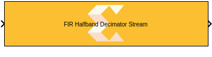
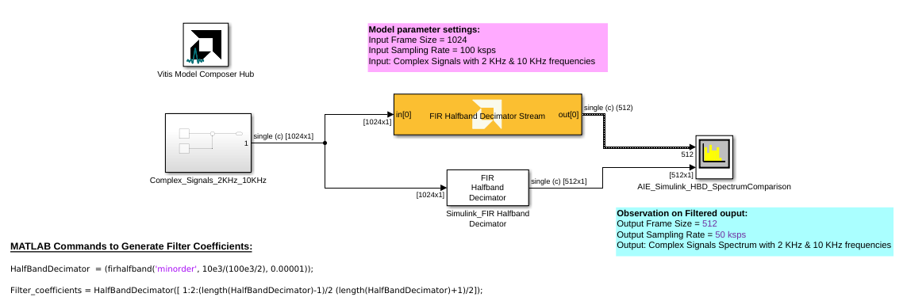

<!-- Library: aieDSP -->

# FIR Halfband Decimator Stream
This block implements the stream-based FIR Halfband Decimator filter targeted for AI Engines.
  
  

## Library

AI Engine/DSP/Stream IO

## Description

This block implements the stream-based FIR Halfband Decimator filter
targeted for AI Engines.

## Parameters

### Main  
#### Input/Output data type  
Describes the type of individual data samples input to and output from
the filter function. int16, cint16, int32, cint32, float, cfloat.

#### Filter coefficients data type  
Describes the type of individual coefficients of the filter taps. It
should be one of int16, cint16, int32, cint32, float, cfloat and must
also satisfy the following rules:

  - Complex types are only supported when the Input/Output data type is
  also complex.
  - 32-bit types are only supported when the Input/Output data type is
  also a 32-bit type.
  - Filter coefficients data type must be an integer type if the
  Input/Output data type is an integer type.
  - Filter coefficients data type must be a float type if the Input/Output
  data type is a float type.

#### Specify filter coefficients via input port  
When this option is enabled, the tool allows you to specify reloadable
filter coefficients via an [asynchronous Run Time Parameter (RTP)](https://github.com/Xilinx/Vitis_Model_Composer/blob/2025.2/Examples/AIENGINE/Run_Time_Parameters/rtp_vector_async) input port.

**AIE1 Devices:** Specify the filter coefficients as a vector of (N+1)/4+1 elements,
where 'N' is the filter length.

Consider a half-band filter of length 7 with coefficients `[1 0 2 5 2 0 1]`. In this case, the coefficients vector should be set to `[1 2 5]`. 

**AIE-ML Devices:** Specifies the filter coefficients as a vector of (N+1)/2+1 elements,
where 'N' the filter length.

Consider a half-band filter of length 7 with coefficients `[1 0 2 5 2 0 1]`. In this case, the coefficients vector should be set to `[1 2 2 1 5]`.

#### Provide second set of input ports
When this option is enabled, a second stream input can be connected to the FIR, increasing available throughput. When using a second stream input, the data should be organized in a 128-bit interleaved pattern. For example, for a cint16 input samples 0-3 should be sent over the first stream and samples 4-7 should be sent over the second stream.

#### Provide second set of output ports
When this option is enabled, a second stream output is added to the block. The two output data streams are interleaved in a 128-bit pattern. For example, for cint16 output data, samples 0-3 will be sent on the first output stream and samples 4-7 will be sent on the second output stream.

#### Filter coefficients  
Specifies the filter coefficients as a vector of (N+1)/4+1 elements,
where 'N' is a positive integer that represents the filter length and
must be in the range 4 to 240 inclusive.

#### Input frame size (Number of samples)  
Describes the number of samples used as an input to the filter function.
The number of values in the output window will be the Input window size
divided by two by virtue of the halfband decimation factor.

#### Scale output down by 2^  
Describes the power of 2 shift down applied to the accumulation of FIR
terms before output. It must be in the range 0 to 61.

#### Rounding mode

Describes the selection of rounding to be applied during the shift down stage of processing.

The following modes are available:
* **Floor:** Truncate LSB, always round down (towards negative infinity).
* **Ceiling:** Always round up (towards positive infinity).
* **Round to positive infinity:** Round halfway towards positive infinity.
* **Round to negative infinity:** Round halfway towards negative infinity.
* **Round symmetrical to infinity:** Round halfway towards infinity (away from zero).
* **Round symmetrical to zero:** Round halfway towards zero (away from infinity).
* **Round convergent to even:** Round halfway towards nearest even number.
* **Round convergent to odd:** Round halfway towards nearest odd number.

No rounding is performed on the **Floor** or **Ceiling** modes. Other modes round to the nearest integer. They differ only in how they round for values that are exactly between two integers.

#### Saturation mode

Describes the selection of saturation to be applied during the shift down stage of processing.

The following modes are available:
* **None:** No saturation is performed and the value is truncated on the MSB side.
* **Asymmetric:** Rounds an n-bit signed value in the range `-2^(n-1)` to `2^(n-1)-1`.
* **Symmetric:** Rounds an n-bit signed value in the range `-2^(n-1)-1` to `2^(n-1)-1`.

#### Number of parallel input/output (SSR)  
This parameter specifies the number of input (or output) ports and must
be of the form 2^N, where N is a non-negative integer.

#### Number of decimator polyphases

Specifies the number of distinct input data phases into which the input stream will be split. In each stream computations are performed in parallel and the outputs are combined into a single output stream. 

Currently, only 2 decimator polyphases are supported for the halfband interpolators with SSR > 1. Each polyphase processes half of the input data stream. 

The first polyphase is implemented using a single rate asymmetric filter that is configured to produce and consume data in parallel in `(SSR)` phases, each phase can operate at maximum throughput depending on the configuration.
The first polyphase uses `(SSR)^2 * (Number of cascade stages)` kernels. 
The second polyphase simplifies into a single kernel that does a single tap because halfband decimators only have one non-zero coefficient in the second coefficient phase. The second polyphase uses `(SSR)` kernels operating at maximum throughput.

The overall theoretical output data rate is `(SSR) * (Number of output ports) * 1 GSa/s`.
The overall theoretical input data rate is `(SSR) * (Number of decimator polyphases) * (Number of input ports) * 1GSa/s`.

When SSR = 1, 1 or 2 decimator polyphases can be used.
  
#### Number of cascade stages
This determines the number of kernels the FIR will be divided over in series to improve throughput.

## Examples

***Click on the images below to open each model.***

<!--
DESCRIPTION:
Model: FIR_HalfBandDecimator_Stream_Ex1
Generated: 09-Jan-2026 13:43:42

Vitis Model Composer Configuration:
  Target Device: xcvc1902-vsva2197-1LP-e-S

Vitis Model Composer Blocks:
  - AIE: FIR Halfband Decimator Stream

Description:
This MATLAB script creates a Vitis Model Composer Simulink model that uses the AI Engine FIR Halfband Decimator Stream block. A 2kHz complex input signal is provided to the block,  and results are compared against a Simulink reference implementation.

-->

<!--
MATLAB CREATION SCRIPT:

% create_FIR_HalfBandDecimator_Stream_Ex1_model.m
% Auto-generated script to recreate the FIR_HalfBandDecimator_Stream_Ex1 Simulink model
% Generated on: 09-Jan-2026 13:43:42

%% Model Configuration
modelName = 'FIR_HalfBandDecimator_Stream_Ex1_recreated';

%% Create New Model
if bdIsLoaded(modelName)
    close_system(modelName, 0);
end

new_system(modelName);
open_system(modelName);
fprintf('Created new model: %s\n', modelName);

%% Add Vitis Model Composer Hub Block
hubBlockPath = [modelName '/Vitis Model Composer Hub'];
add_block('vmcUtilities/Vitis Model Composer Hub', hubBlockPath, ...
    'Position', [42 13 97 66]);

hubBlk = xmcFindHubBlock(modelName);
vmchub_set_param(hubBlk, modelName, 'SelectHardware', 'xcvc1902-vsva2197-1LP-e-S');

%% Add Top-Level Blocks
add_block('built-in/SpectrumAnalyzer', [modelName '/AIE_Simulink_HBD_SpectrumComparison'], ...
    'Position', [845 196 890 249]);
set_param([modelName '/AIE_Simulink_HBD_SpectrumComparison'], ...
    'NumInputPorts', '2', ...
    'OpenAtSimulationStart', 'on', ...
    'WindowPosition', '[878 430 800 500]', ...
    'InputDomain', 'Time', ...
    'SpectrumType', 'Power', ...
    'ViewType', 'Spectrum', ...
    'Method', 'Filter bank', ...
    'SampleRateSource', 'Inherited', ...
    'SampleRate', '10000', ...
    'PlotAsTwoSidedSpectrum', 'on', ...
    'FrequencyScale', 'Linear', ...
    'PlotType', 'Line', ...
    'AxesScaling', 'Auto', ...
    'AxesScalingNumUpdates', '100', ...
    'FrequencyResolutionMethod', 'RBW', ...
    'RBWSource', 'Auto', ...
    'RBW', '9.76', ...
    'WindowInvariantSamplesPerUpdate', 'off', ...
    'WindowLength', '1024', ...
    'FFTLengthSource', 'Auto', ...
    'FFTLength', '1024', ...
    'FilterSharpness', '0.3', ...
    'FrequencySpan', 'Full', ...
    'Span', '10000', ...
    'CenterFrequency', '0', ...
    'StartFrequency', '-5000', ...
    'StopFrequency', '5000', ...
    'InputUnits', 'dBm', ...
    'FrequencyVectorSource', 'Auto', ...
    'FrequencyVector', '[-5000,5000]', ...
    'Window', 'Hann', ...
    'CustomWindow', 'hann', ...
    'SidelobeAttenuation', '60', ...
    'OverlapPercent', '0', ...
    'AveragingMethod', 'Exponential', ...
    'SpectralAverages', '1', ...
    'ForgettingFactor', '0.9', ...
    'VBWSource', 'Auto', ...
    'VBW', '9.76', ...
    'SpectrumUnits', 'dBm', ...
    'FullScaleSource', 'Auto', ...
    'FullScale', '1', ...
    'ReferenceLoad', '1', ...
    'FrequencyOffset', '0', ...
    'SpectrogramChannel', '1', ...
    'TimeResolutionSource', 'Auto', ...
    'TimeResolution', '1e-3', ...
    'TimeSpanSource', 'Auto', ...
    'TimeSpan', '0.1', ...
    'MaximizeAxes', 'Auto', ...
    'PlotNormalTrace', 'on', ...
    'PlotMaxHoldTrace', 'off', ...
    'PlotMinHoldTrace', 'off', ...
    'YLimits', '[-80,20]', ...
    'ColorLimits', '[-80,20]', ...
    'Colormap', 'jet', ...
    'ShowGrid', 'on', ...
    'ShowLegend', 'on', ...
    'ShowColorbar', 'on', ...
    'ChannelNames', '[""]', ...
    'AxesLayout', 'Vertical');
add_block('aieDSP/FIR Halfband Decimator Stream', [modelName '/FIR Halfband Decimator Stream'], ...
    'Position', [475 145 705 195]);
set_param([modelName '/FIR Halfband Decimator Stream'], ...
    'data_type', 'cfloat', ...
    'coef_type', 'float', ...
    'use_coeff_reload', 'off', ...
    'dual_ip', 'off', ...
    'num_outputs', 'off', ...
    'coeff', 'Filter_coefficients', ...
    'fir_length', '31', ...
    'input_window_size', '1024', ...
    'shift_val', '0', ...
    'rnd_mode', 'Round to positive infinity', ...
    'sat_mode', '0-None', ...
    'ssr', '1', ...
    'deci_poly', '1', ...
    'casc_length', '1', ...
    'TP_API', '1');
add_block('dspmlti4/FIR Halfband Decimator', [modelName '/Simulink_FIR Halfband Decimator'], ...
    'Position', [540 238 640 282]);
set_param([modelName '/Simulink_FIR Halfband Decimator'], ...
    'Specification', 'Coefficients', ...
    'FilterOrder', '52', ...
    'TransitionWidth', '4.1e3', ...
    'StopbandAttenuation', '80', ...
    'DesignMethod', 'Auto', ...
    'Numerator', 'firhalfband(''minorder'', 10e3/(100e3/2), 0.00001)', ...
    'FilterBankOutputPort', 'off', ...
    'SampleRateMode', 'Inherit from input port', ...
    'SampleRate', '125e3', ...
    'AllowArbitraryInputLength', 'off', ...
    'SimulateUsing', 'Code generation', ...
    'roundingMode', 'Ceiling', ...
    'coeffsDataTypeStr', 'fixdt(1,32)', ...
    'LockScale', 'off');
add_block('vmcUtilities/Vitis Model Composer Hub', [modelName '/Vitis Model Composer Hub'], ...
    'Position', [42 13 97 66]);
set_param([modelName '/Vitis Model Composer Hub'], ...
    'CodeGeneration', 'off', ...
    'StartColumn', '1', ...
    'NumberOfColumns', '1', ...
    'TargetDirectory', './code', ...
    'exportDesign', 'off', ...
    'analyzeDesign', 'off', ...
    'validateDesignOnHw', 'off', ...
    'ExportType', 'AI Engines', ...
    'IpVendor', 'xilinx.com', ...
    'IpLibrary', 'hls', ...
    'IpVersion', '1.0', ...
    'IpHWLanguage', 'Verilog', ...
    'AieCompilerOptions', '{}', ...
    'CreateTestbench', 'off', ...
    'TestbenchStackSize', '10', ...
    'RunRtlSim', 'off', ...
    'RunCSim', 'off', ...
    'RunAieSim', 'off', ...
    'AieSimTimeout', '50000', ...
    'RunAieSimProfiling', 'off', ...
    'LaunchVitisAnalyzer', 'off', ...
    'PlotOutput', 'off', ...
    'GenHwImage', 'off', ...
    'GenLibadfXo', 'off', ...
    'GenHwValidationCode', 'off', ...
    'PlatformType', 'Not Specified', ...
    'HwSystemType', 'Baremetal', ...
    'HwValidationTarget', 'hw', ...
    'ProjDevice', 'xcvc1902-vsva2197-1LP-e-S', ...
    'SamplePeriod', '-1', ...
    'ClockFrequency', '200', ...
    'DataPathParallelism', '1', ...
    'xilinxfamily', 'versalaicore', ...
    'part', 'xcvc1902', ...
    'speed', '-1LP-e-S', ...
    'package', 'vsva2197', ...
    'directory', './netlist', ...
    'testbench', 'off', ...
    'incr_netlist', 'off', ...
    'synthesis_tool', 'Vivado', ...
    'clock_wrapper', 'Clock Enables', ...
    'dbl_ovrd', 'According to Block Masks', ...
    'dcm_input_clock_period', '10', ...
    'sysclk_period', '10', ...
    'simulink_period', '1', ...
    'eval_field', '0', ...
    'LogFileName', '''''', ...
    'NThreads', '4');

%% Create Complex_Signals_2KHz_10KHz Subsystem
add_block('built-in/SubSystem', [modelName '/Complex_Signals_2KHz_10KHz'], ...
    'Position', [195 169 300 271]);

% Remove default blocks
defaultBlocks = find_system([modelName '/Complex_Signals_2KHz_10KHz'], 'SearchDepth', 1, 'Type', 'block');
for i = 1:length(defaultBlocks)
    if ~strcmp(defaultBlocks{i}, [modelName '/Complex_Signals_2KHz_10KHz'])
        delete_block(defaultBlocks{i});
    end
end

add_block('dspsrcs4/Sine Wave', [[modelName '/Complex_Signals_2KHz_10KHz'] '/Complex_Sig_10KHz'], ...
    'Position', [15 33 60 77]);
set_param([[modelName '/Complex_Signals_2KHz_10KHz'] '/Complex_Sig_10KHz'], ...
    'Amplitude', '0.5', ...
    'Frequency', '10e3', ...
    'Phase', '0', ...
    'SampleMode', 'Discrete', ...
    'OutComplex', 'Complex', ...
    'CompMethod', 'Trigonometric fcn', ...
    'TableSize', 'Speed', ...
    'SampleTime', '1/100e3', ...
    'SamplesPerFrame', '1024', ...
    'ResetState', 'Restart at time zero', ...
    'OutputFrames', 'off', ...
    'additionalParams', 'off', ...
    'allowOverrides', 'on', ...
    'dataType', 'single', ...
    'wordLen', '16', ...
    'udDataType', 'sfix(16)', ...
    'fracBitsMode', 'Best precision', ...
    'numFracBits', '15', ...
    'OutDataTypeStr', 'single', ...
    'LastOutDataTypeStr', 'single');
add_block('dspsrcs4/Sine Wave', [[modelName '/Complex_Signals_2KHz_10KHz'] '/Complex_Sig_2KHz'], ...
    'Position', [15 103 60 147]);
set_param([[modelName '/Complex_Signals_2KHz_10KHz'] '/Complex_Sig_2KHz'], ...
    'Amplitude', '1', ...
    'Frequency', '2e3', ...
    'Phase', '0', ...
    'SampleMode', 'Discrete', ...
    'OutComplex', 'Complex', ...
    'CompMethod', 'Trigonometric fcn', ...
    'TableSize', 'Speed', ...
    'SampleTime', '1/100e3', ...
    'SamplesPerFrame', '1024', ...
    'ResetState', 'Restart at time zero', ...
    'OutputFrames', 'off', ...
    'additionalParams', 'off', ...
    'allowOverrides', 'on', ...
    'dataType', 'single', ...
    'wordLen', '16', ...
    'udDataType', 'sfix(16)', ...
    'fracBitsMode', 'Best precision', ...
    'numFracBits', '15', ...
    'OutDataTypeStr', 'single', ...
    'LastOutDataTypeStr', 'single');
add_block('built-in/Sum', [[modelName '/Complex_Signals_2KHz_10KHz'] '/Sum'], ...
    'Position', [160 45 180 65]);
set_param([[modelName '/Complex_Signals_2KHz_10KHz'] '/Sum'], ...
    'IconShape', 'round', ...
    'Inputs', '|++', ...
    'CollapseMode', 'All dimensions', ...
    'CollapseDim', '1', ...
    'OutMin', '[]', ...
    'OutMax', '[]', ...
    'OutDataTypeStr', 'Inherit: Inherit via internal rule', ...
    'AccumDataTypeStr', 'Inherit: Inherit via internal rule', ...
    'InputSameDT', 'off', ...
    'LockScale', 'off', ...
    'RndMeth', 'Floor', ...
    'SaturateOnIntegerOverflow', 'off', ...
    'SampleTime', '-1');
add_block('built-in/Outport', [[modelName '/Complex_Signals_2KHz_10KHz'] '/Out1'], ...
    'Position', [280 48 310 62]);
set_param([[modelName '/Complex_Signals_2KHz_10KHz'] '/Out1'], ...
    'Port', '1', ...
    'StorageClass', 'Auto', ...
    'IconDisplay', 'Port number', ...
    'OutputFunctionCall', 'off', ...
    'OutMin', '[]', ...
    'OutMax', '[]', ...
    'OutDataTypeStr', 'Inherit: auto', ...
    'LockScale', 'off', ...
    'BusOutputAsStruct', 'off', ...
    'BusVirtuality', 'inherit', ...
    'DataMode', 'inherit', ...
    'Unit', 'inherit', ...
    'PortDimensions', '-1', ...
    'VarSizeSig', 'Inherit', ...
    'SampleTime', '-1', ...
    'SignalType', 'auto', ...
    'EnsureOutportIsVirtual', 'off', ...
    'OutputWhenDisabled', 'held', ...
    'InitialOutput', '[]', ...
    'MustResolveToSignalObject', 'off', ...
    'OutputWhenUnConnected', 'off', ...
    'OutputWhenUnconnectedValue', '0', ...
    'VectorParamsAs1DForOutWhenUnconnected', 'on');

% Connect blocks in Complex_Signals_2KHz_10KHz
add_line([modelName '/Complex_Signals_2KHz_10KHz'], 'Sum/2', 'Out1/2', 'autorouting', 'on');
add_line([modelName '/Complex_Signals_2KHz_10KHz'], 'Complex_Sig_10KHz/2', 'Sum/2', 'autorouting', 'on');
add_line([modelName '/Complex_Signals_2KHz_10KHz'], 'Complex_Sig_2KHz/2', 'Sum/3', 'autorouting', 'on');

%% Connect Top-Level Blocks
add_line(modelName, 'FIR Halfband Decimator Stream/2', 'AIE_Simulink_HBD_SpectrumComparison/2', 'autorouting', 'on');
add_line(modelName, 'Simulink_FIR Halfband Decimator/2', 'AIE_Simulink_HBD_SpectrumComparison/3', 'autorouting', 'on');
add_line(modelName, 'Complex_Signals_2KHz_10KHz/2', 'Simulink_FIR Halfband Decimator/2', 'autorouting', 'on');
add_line(modelName, 'Complex_Signals_2KHz_10KHz/2', 'FIR Halfband Decimator Stream/2', 'autorouting', 'on');
add_line(modelName, 'Complex_Signals_2KHz_10KHz/2', 'FIR Halfband Decimator Stream/2', 'autorouting', 'on');

%% Save Model
save_system(modelName);
fprintf('\nModel saved: %s.slx\n', modelName);
-->

### References
This block uses the Vitis DSP library implementation of a FIR filter. For more details on this implementation please click [here](https://docs.xilinx.com/r/en-US/Vitis_Libraries/dsp/user_guide/L2/func-fir-filtersAIE.html).
--------------
Copyright (C) 2025 Advanced Micro Devices, Inc.
All rights reserved.

SPDX-License-Identifier: MIT
