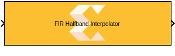
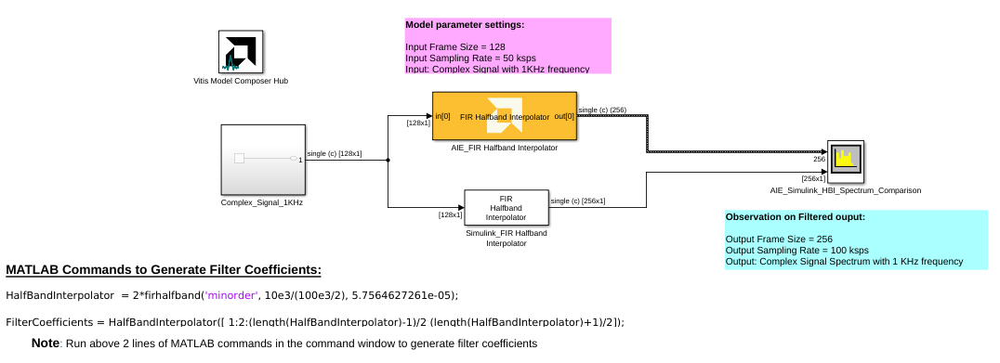
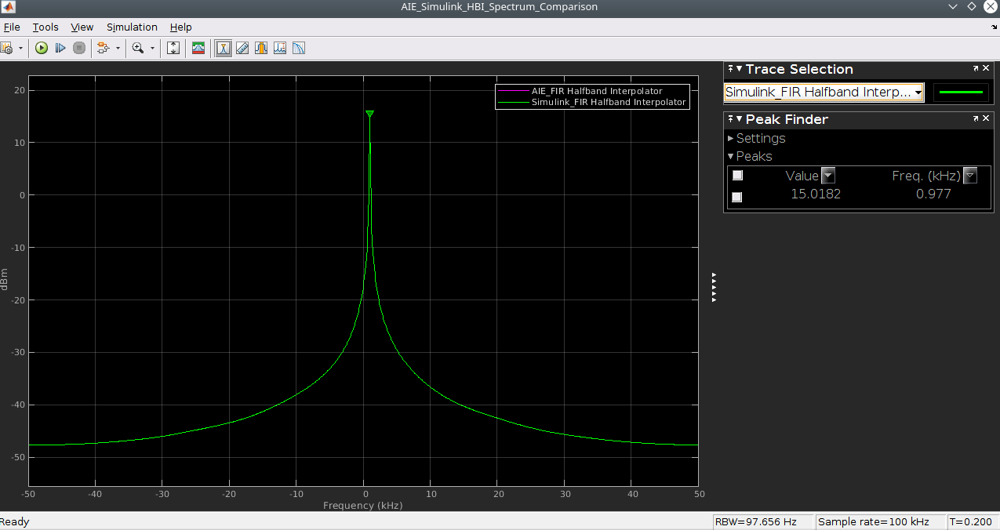
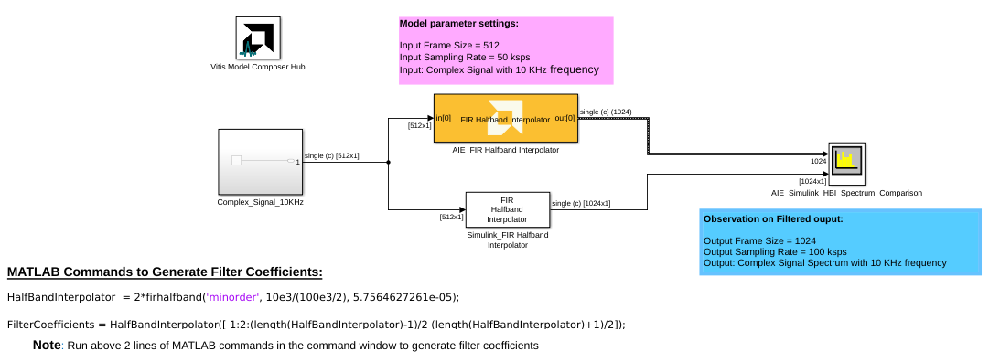
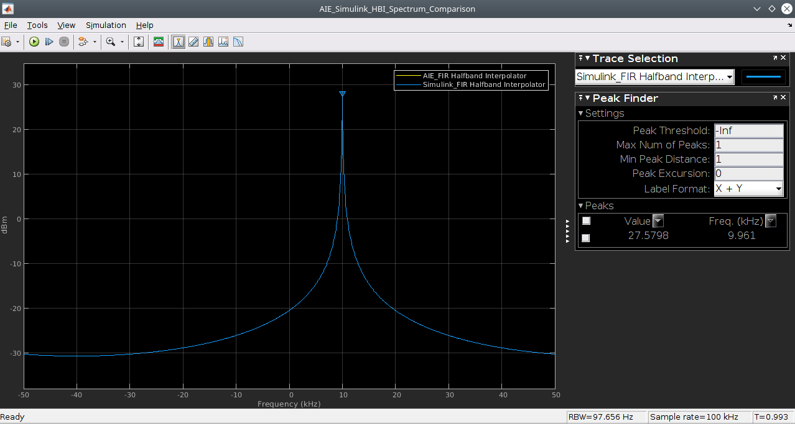

# FIR Halfband Interpolator
This block implements the FIR Halfband Interpolator targeted for AI Engines.
  
  

## Library

AI Engine/DSP/Buffer IO

## Description

This block implements the FIR Halfband Interpolator targeted for AI
Engines.

## Parameters

### Main  
#### Input data type/Output data type  
Describes the type of individual data samples input to and output from
the filter function. int16, cint16, int32, cint32, float, cfloat.

#### Filter coefficients data type  
Describes the type of individual coefficients of the filter taps. It
should be one of int16, cint16, int32, cint32, float, cfloat and must
also satisfy the following rules:

  - Complex types are only supported when the Input/Output data type is
  also complex.
  - 32-bit types are only supported when the Input/Output data type is
  also a 32-bit type.
  - Filter coefficients data type must be an integer type if the
  Input/Output data type is an integer type.
  - Filter coefficients data type must be a float type if the Input/Output
  data type is a float type.

#### Specify filter coefficients via input port  
When this option is enabled, the tool allows you to specify reloadable
filter coefficients via the input port.

#### Provide second set of input ports
When this option is enabled, a second input port can be connected to the FIR, increasing available throughput. In Simulink, both input ports should be connected to the same signal.

This setting is an implementation trade-off between performance and data bank resources. When this option is disabled, the FIR performance may be limited by load contention; when this option is enabled, two RAM banks are used for input, reducing load contention.

#### Provide second set of output ports
When this option is enabled, a second output port is added to the block producing the same data as the first output port.

#### Filter coefficients  
Specifies the filter coefficients as a vector of (N+1)/4+1 elements,
where 'N' is a positive integer that represents the filter length and
must be in the range 4 to 240 inclusive.

#### Input window size (Number of samples)  
Describes the number of samples used as an input to the filter function.
The number of values in the output window will be the Input window size
multiplied by two by virtue of the halfband interpolation factor.

#### Scale output down by 2^  
Describes the power of 2 shift down applied to the accumulation of FIR
terms before output. It must be in the range 0 to 61.

#### Rounding mode

Describes the selection of rounding to be applied during the shift down stage of processing.

The following modes are available:
* **Floor:** Truncate LSB, always round down (towards negative infinity).
* **Ceiling:** Always round up (towards positive infinity).
* **Round to positive infinity:** Round halfway towards positive infinity.
* **Round to negative infinity:** Round halfway towards negative infinity.
* **Round symmetrical to infinity:** Round halfway towards infinity (away from zero).
* **Round symmetrical to zero:** Round halfway towards zero (away from infinity).
* **Round convergent to even:** Round halfway towards nearest even number.
* **Round convergent to odd:** Round halfway towards nearest odd number.

No rounding is performed on the **Floor** or **Ceiling** modes. Other modes round to the nearest integer. They differ only in how they round for values that are exactly between two integers.

#### Saturation mode

Describes the selection of saturation to be applied during the shift down stage of processing.

The following modes are available:
* **None:** No saturation is performed and the value is truncated on the MSB side.
* **Asymmetric:** Rounds an n-bit signed value in the range `-2^(n-1)` to `2^(n-1)-1`.
* **Symmetric:** Rounds an n-bit signed value in the range `-2^(n-1)-1` to `2^(n-1)-1`.

#### Use center tap to upshift data  
To upshift the data sample by the center tap coefficient (or its real
part) position.

  - When it is set to 0, the center tap coefficient will be treated as any
  other coefficient.
  - When it is set to 1, the provided center tap's value will be used to
  upshift the input data sample.
    - taps\[\] = {c0, c2, c4, ..., cN, cCT} where N = (TP_FIR_LEN+1)/4 and
    cCT is the center tap.
    
    **Note**: When complex coefficients are used, the center tap's real part
    will be used for the upshift.

    **Note**: Upshift is only supported with 16-bit coefficient types (i.e.,
    int16 and cint16).

    **Note**: When Upshift is enabled, the center tap value must be in the
    range 0 to 47.

###### **Example 1**:
A 7-tap FIR halfband interpolator has coefficients (1, 0, 2, 5, 2, 0,
1). This would be input as taps[]= {1,2,5} because the context of
halfband interpolation allows the remaining coefficients to be inferred.

###### **Example 2**:
A 7-tap FIR halfband interpolator has coefficients (1, 2, 2, 1, 2, 1,
3). Here '3' is the center tap value.

Now, if the input has a data stream of all ones (i.e., 1, 1, 1, etc.):
- If the parameter is unset, the expected output will be: \[1, 3, 2,
  3..\]
- If the parameter is set, the expected output will be: \[1, 2^3, 2,
  2^3...\]=\[1, 8, 2, 8..\]

### Number of cascade stages  
This determines the number of kernels the FIR will be divided over in series to improve throughput.

**FIR Halfband Interpolator Block Example1:**

**AIE and Simulink Halfband Interpolator Output Spectrum Comparison:**

**FIR Halfband Interpolator Block Example2:**

**AIE and Simulink Halfband Interpolator Output Spectrum Comparison:**

