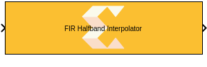
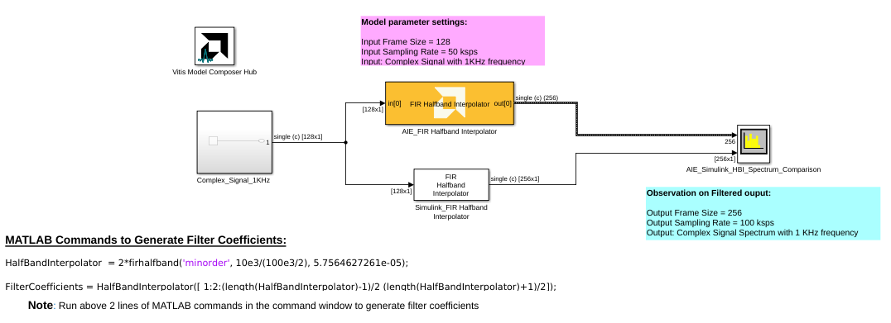
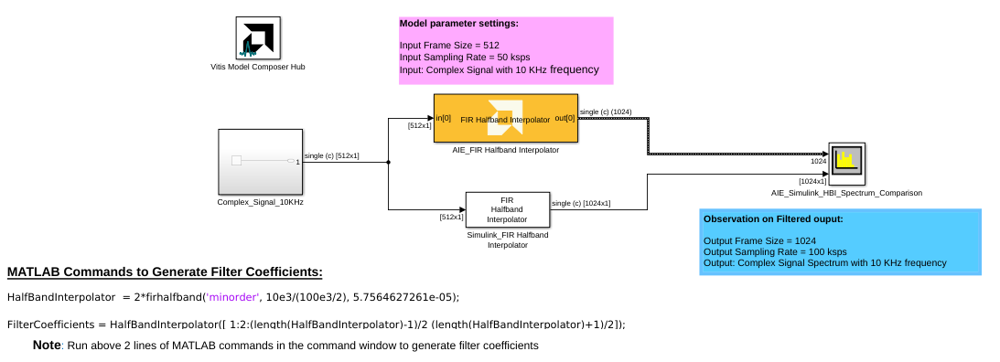

<!-- Library: aieDSP -->

# FIR Halfband Interpolator
This block implements the FIR Halfband Interpolator targeted for AI Engines.
  
  

## Library

AI Engine/DSP/Buffer IO

## Description

This block implements the FIR Halfband Interpolator targeted for AI
Engines.

## Parameters

### Main  
#### Input/Output data type  
Describes the type of individual data samples input to and output from
the filter function. int16, cint16, int32, cint32, float, cfloat.

#### Filter coefficients data type  
Describes the type of individual coefficients of the filter taps. It
should be one of int16, cint16, int32, cint32, float, cfloat and must
also satisfy the following rules:

  - Complex types are only supported when the Input/Output data type is
  also complex.
  - 32-bit types are only supported when the Input/Output data type is
  also a 32-bit type.
  - Filter coefficients data type must be an integer type if the
  Input/Output data type is an integer type.
  - Filter coefficients data type must be a float type if the Input/Output
  data type is a float type.

#### Specify filter coefficients via input port  
When this option is enabled, the tool allows you to specify reloadable
filter coefficients via the an [asynchronous Run Time Parameter (RTP)](https://github.com/Xilinx/Vitis_Model_Composer/blob/2025.2/Examples/AIENGINE/Run_Time_Parameters/rtp_vector_async) input port.

**AIE1 Devices:** Specify the filter coefficients as a vector of (N+1)/4+1 elements,
where 'N' is the filter length.

Consider a half-band filter of length 7 with coefficients `[1 0 2 5 2 0 1]`. In this case, the coefficients vector should be set to `[1 2 5]`. 

**AIE-ML Devices:** Specifies the filter coefficients as a vector of (N+1)/2+1 elements,
where 'N' the filter length.

Consider a half-band filter of length 7 with coefficients `[1 0 2 5 2 0 1]`. In this case, the coefficients vector should be set to `[1 2 2 1 5]`.

#### Provide second set of input ports
When this option is enabled, a second input port can be connected to the FIR, increasing available throughput. In Simulink, both input ports should be connected to the same signal.

This setting is an implementation trade-off between performance and data bank resources. When this option is disabled, the FIR performance may be limited by load contention; when this option is enabled, two RAM banks are used for input, reducing load contention.

#### Provide second set of output ports
When this option is enabled, a second output port is added to the block producing the same data as the first output port.

#### Filter coefficients  
Specifies the filter coefficients as a vector of (N+1)/4+1 elements,
where 'N' is a positive integer that represents the filter length and
must be in the range 4 to 240 inclusive.

#### Input window size (Number of samples)  
Describes the number of samples used as an input to the filter function.
The number of values in the output window will be the Input window size
multiplied by two by virtue of the halfband interpolation factor.

#### Scale output down by 2^  
Describes the power of 2 shift down applied to the accumulation of FIR
terms before output. It must be in the range 0 to 61.

#### Rounding mode

Describes the selection of rounding to be applied during the shift down stage of processing.

The following modes are available:
* **Floor:** Truncate LSB, always round down (towards negative infinity).
* **Ceiling:** Always round up (towards positive infinity).
* **Round to positive infinity:** Round halfway towards positive infinity.
* **Round to negative infinity:** Round halfway towards negative infinity.
* **Round symmetrical to infinity:** Round halfway towards infinity (away from zero).
* **Round symmetrical to zero:** Round halfway towards zero (away from infinity).
* **Round convergent to even:** Round halfway towards nearest even number.
* **Round convergent to odd:** Round halfway towards nearest odd number.

No rounding is performed on the **Floor** or **Ceiling** modes. Other modes round to the nearest integer. They differ only in how they round for values that are exactly between two integers.

#### Saturation mode

Describes the selection of saturation to be applied during the shift down stage of processing.

The following modes are available:
* **None:** No saturation is performed and the value is truncated on the MSB side.
* **Asymmetric:** Rounds an n-bit signed value in the range `-2^(n-1)` to `2^(n-1)-1`.
* **Symmetric:** Rounds an n-bit signed value in the range `-2^(n-1)-1` to `2^(n-1)-1`.

#### Number of interpolator polyphases

Specifies the number of interpolator polyphases over which the coefficients will be split to enable parallel computation of the outputs. The polyphases are executed in parallel; output data is produced by each polyphase directly. This parameter does not affect the number of input data paths; there will be `(SSR)` input phases irrespective of the value of this parameter.

Currently, only 2 interpolator polyphases are supported for the halfband interpolators with SSR > 1. Input data is broadcast to the two polyphases and each polyphase produces half of the total output data. Their output data can be interleaved to produce a single output stream.

The first polyphase is implemented using a single rate asymmetric filter that is configured to produce and consume data in parallel in `(SSR)` phases; each phase can operate at maximum throughput depending on the configuration.
The first polyphase uses `(SSR)^2 * (Number of cascade stages)` kernels. 
The second polyphase simplifies into a single kernel that does a single tap because halfband decimators only have one non-zero coefficient in the second coefficient phase. The second polyphase uses `(SSR)` kernels operating at maximum throughput.

The overall theoretical input data rate is `(SSR) * (Number of output ports) * 1 GSa/s`.
The overall theoretical output data rate is `(SSR) * (Number of decimator polyphases) * (Number of output ports) * 1GSa/s`.

When SSR = 1, 1 or 2 interpolator polyphases can be used.

#### Use center tap to upshift data  
To upshift the data sample by the center tap coefficient (or its real
part) position.

  - When it is set to 0, the center tap coefficient will be treated as any
  other coefficient.
  - When it is set to 1, the provided center tap's value will be used to
  upshift the input data sample.
    - taps\[\] = {c0, c2, c4, ..., cN, cCT} where N = (TP_FIR_LEN+1)/4 and
    cCT is the center tap.
    
    **Note**: When complex coefficients are used, the center tap's real part
    will be used for the upshift.

    **Note**: Upshift is only supported with 16-bit coefficient types (i.e.,
    int16 and cint16).

    **Note**: When Upshift is enabled, the center tap value must be in the
    range 0 to 47.

###### **Example 1**:
A 7-tap FIR halfband interpolator has coefficients (1, 0, 2, 5, 2, 0,
1). This would be input as taps[]= {1,2,5} because the context of
halfband interpolation allows the remaining coefficients to be inferred.

###### **Example 2**:
A 7-tap FIR halfband interpolator has coefficients (1, 2, 2, 1, 2, 1,
3). Here '3' is the center tap value.

Now, if the input has a data stream of all ones (i.e., 1, 1, 1, etc.):
- If the parameter is unset, the expected output will be: \[1, 3, 2,
  3..\]
- If the parameter is set, the expected output will be: \[1, 2^3, 2,
  2^3...\]=\[1, 8, 2, 8..\]

#### Number of cascade stages  
This determines the number of kernels the FIR will be divided over in series to improve throughput.

## Examples

***Click on the images below to open each model.***

<!--
DESCRIPTION:
Model: HalfBandInterpolator_Ex1
Generated: 09-Jan-2026 13:45:44

Vitis Model Composer Configuration:
  Target Device: xcvc1902-vsva2197-1LP-e-S

Vitis Model Composer Blocks:
  - AIE: FIR Halfband Interpolator

Description:
This MATLAB script creates a Vitis Model Composer Simulink model that uses the AI Engine FIR Halfband Interpolator block. A 1kHz complex input signal is provided to the block, 

-->

<!--
MATLAB CREATION SCRIPT:

% create_HalfBandInterpolator_Ex1_model.m
% Auto-generated script to recreate the HalfBandInterpolator_Ex1 Simulink model
% Generated on: 09-Jan-2026 13:45:44

%% Model Configuration
modelName = 'HalfBandInterpolator_Ex1_recreated';

%% Create New Model
if bdIsLoaded(modelName)
    close_system(modelName, 0);
end

new_system(modelName);
open_system(modelName);
fprintf('Created new model: %s\n', modelName);

%% Add Vitis Model Composer Hub Block
hubBlockPath = [modelName '/Vitis Model Composer Hub'];
add_block('vmcUtilities/Vitis Model Composer Hub', hubBlockPath, ...
    'Position', [-283 -7 -228 46]);

hubBlk = xmcFindHubBlock(modelName);
vmchub_set_param(hubBlk, modelName, 'SelectHardware', 'xcvc1902-vsva2197-1LP-e-S');

%% Add Top-Level Blocks
add_block('built-in/SpectrumAnalyzer', [modelName '/AIE_Simulink_HBI_Spectrum_Comparison'], ...
    'Position', [685 166 730 219]);
set_param([modelName '/AIE_Simulink_HBI_Spectrum_Comparison'], ...
    'NumInputPorts', '2', ...
    'OpenAtSimulationStart', 'on', ...
    'WindowPosition', '[878 430 800 500]', ...
    'InputDomain', 'Time', ...
    'SpectrumType', 'Power', ...
    'ViewType', 'Spectrum', ...
    'Method', 'Filter bank', ...
    'SampleRateSource', 'Inherited', ...
    'SampleRate', '10000', ...
    'PlotAsTwoSidedSpectrum', 'on', ...
    'FrequencyScale', 'Linear', ...
    'PlotType', 'Line', ...
    'AxesScaling', 'Auto', ...
    'AxesScalingNumUpdates', '100', ...
    'FrequencyResolutionMethod', 'RBW', ...
    'RBWSource', 'Auto', ...
    'RBW', '9.76', ...
    'WindowInvariantSamplesPerUpdate', 'off', ...
    'WindowLength', '1024', ...
    'FFTLengthSource', 'Auto', ...
    'FFTLength', '1024', ...
    'FilterSharpness', '0.3', ...
    'FrequencySpan', 'Full', ...
    'Span', '10000', ...
    'CenterFrequency', '0', ...
    'StartFrequency', '-5000', ...
    'StopFrequency', '5000', ...
    'InputUnits', 'dBm', ...
    'FrequencyVectorSource', 'Auto', ...
    'FrequencyVector', '[-5000,5000]', ...
    'Window', 'Hann', ...
    'CustomWindow', 'hann', ...
    'SidelobeAttenuation', '60', ...
    'OverlapPercent', '0', ...
    'AveragingMethod', 'Exponential', ...
    'SpectralAverages', '1', ...
    'ForgettingFactor', '0.9', ...
    'VBWSource', 'Auto', ...
    'VBW', '9.76', ...
    'SpectrumUnits', 'dBm', ...
    'FullScaleSource', 'Auto', ...
    'FullScale', '1', ...
    'ReferenceLoad', '1', ...
    'FrequencyOffset', '0', ...
    'SpectrogramChannel', '1', ...
    'TimeResolutionSource', 'Auto', ...
    'TimeResolution', '1e-3', ...
    'TimeSpanSource', 'Auto', ...
    'TimeSpan', '0.1', ...
    'MaximizeAxes', 'Auto', ...
    'PlotNormalTrace', 'on', ...
    'PlotMaxHoldTrace', 'off', ...
    'PlotMinHoldTrace', 'off', ...
    'YLimits', '[-80,20]', ...
    'ColorLimits', '[-80,20]', ...
    'Colormap', 'jet', ...
    'ShowGrid', 'on', ...
    'ShowLegend', 'on', ...
    'ShowColorbar', 'on', ...
    'ChannelNames', '[""]', ...
    'AxesLayout', 'Vertical');
add_block('aieDSP/FIR Halfband Interpolator', [modelName '/FIR Halfband Interpolator'], ...
    'Position', [190 105 370 165]);
set_param([modelName '/FIR Halfband Interpolator'], ...
    'data_type', 'cfloat', ...
    'coef_type', 'float', ...
    'use_coeff_reload', 'off', ...
    'dual_ip', 'off', ...
    'num_outputs', 'off', ...
    'coeff', 'FilterCoefficients', ...
    'fir_length', '31', ...
    'input_window_size', '128', ...
    'shift_val', '0', ...
    'rnd_mode', 'Round to positive infinity', ...
    'sat_mode', '0-None', ...
    'interp_poly', '1', ...
    'upshift_ct', 'off', ...
    'casc_length', '1', ...
    'TP_API', '0', ...
    'ssr', '1');
add_block('vmcUtilities/Vitis Model Composer Hub', [modelName '/Vitis Model Composer Hub'], ...
    'Position', [-283 -7 -228 46]);
set_param([modelName '/Vitis Model Composer Hub'], ...
    'CodeGeneration', 'off', ...
    'StartColumn', '1', ...
    'NumberOfColumns', '1', ...
    'TargetDirectory', './code', ...
    'exportDesign', 'off', ...
    'analyzeDesign', 'off', ...
    'validateDesignOnHw', 'off', ...
    'ExportType', 'AI Engines', ...
    'IpVendor', 'xilinx.com', ...
    'IpLibrary', 'hls', ...
    'IpVersion', '1.0', ...
    'IpHWLanguage', 'Verilog', ...
    'AieCompilerOptions', '{}', ...
    'CreateTestbench', 'off', ...
    'TestbenchStackSize', '10', ...
    'RunRtlSim', 'off', ...
    'RunCSim', 'off', ...
    'RunAieSim', 'off', ...
    'AieSimTimeout', '50000', ...
    'RunAieSimProfiling', 'off', ...
    'LaunchVitisAnalyzer', 'off', ...
    'PlotOutput', 'off', ...
    'GenHwImage', 'off', ...
    'GenLibadfXo', 'off', ...
    'GenHwValidationCode', 'off', ...
    'PlatformType', 'Not Specified', ...
    'HwSystemType', 'Baremetal', ...
    'HwValidationTarget', 'hw', ...
    'ProjDevice', 'xcvc1902-vsva2197-1LP-e-S', ...
    'SamplePeriod', '-1', ...
    'ClockFrequency', '200', ...
    'DataPathParallelism', '1', ...
    'xilinxfamily', 'versalaicore', ...
    'part', 'xcvc1902', ...
    'speed', '-1LP-e-S', ...
    'package', 'vsva2197', ...
    'directory', './netlist', ...
    'testbench', 'off', ...
    'incr_netlist', 'off', ...
    'synthesis_tool', 'Vivado', ...
    'clock_wrapper', 'Clock Enables', ...
    'dbl_ovrd', 'According to Block Masks', ...
    'dcm_input_clock_period', '10', ...
    'sysclk_period', '10', ...
    'simulink_period', '1', ...
    'eval_field', '0', ...
    'LogFileName', '''''', ...
    'NThreads', '4');

%% Create Complex_Signal_1KHz  Subsystem
add_block('built-in/SubSystem', [modelName '/Complex_Signal_1KHz '], ...
    'Position', [-140 139 -35 241]);

% Remove default blocks
defaultBlocks = find_system([modelName '/Complex_Signal_1KHz '], 'SearchDepth', 1, 'Type', 'block');
for i = 1:length(defaultBlocks)
    if ~strcmp(defaultBlocks{i}, [modelName '/Complex_Signal_1KHz '])
        delete_block(defaultBlocks{i});
    end
end

add_block('dspsrcs4/Sine Wave', [[modelName '/Complex_Signal_1KHz '] '/Complex_Sig_1KHz'], ...
    'Position', [15 33 60 77]);
set_param([[modelName '/Complex_Signal_1KHz '] '/Complex_Sig_1KHz'], ...
    'Amplitude', '0.2', ...
    'Frequency', '1e3', ...
    'Phase', '0', ...
    'SampleMode', 'Discrete', ...
    'OutComplex', 'Complex', ...
    'CompMethod', 'Trigonometric fcn', ...
    'TableSize', 'Speed', ...
    'SampleTime', '1/50e3', ...
    'SamplesPerFrame', '128', ...
    'ResetState', 'Restart at time zero', ...
    'OutputFrames', 'off', ...
    'additionalParams', 'off', ...
    'allowOverrides', 'on', ...
    'dataType', 'single', ...
    'wordLen', '16', ...
    'udDataType', 'sfix(16)', ...
    'fracBitsMode', 'Best precision', ...
    'numFracBits', '15', ...
    'OutDataTypeStr', 'single', ...
    'LastOutDataTypeStr', 'single');
add_block('built-in/Outport', [[modelName '/Complex_Signal_1KHz '] '/Out1'], ...
    'Position', [280 48 310 62]);
set_param([[modelName '/Complex_Signal_1KHz '] '/Out1'], ...
    'Port', '1', ...
    'StorageClass', 'Auto', ...
    'IconDisplay', 'Port number', ...
    'OutputFunctionCall', 'off', ...
    'OutMin', '[]', ...
    'OutMax', '[]', ...
    'OutDataTypeStr', 'Inherit: auto', ...
    'LockScale', 'off', ...
    'BusOutputAsStruct', 'off', ...
    'BusVirtuality', 'inherit', ...
    'DataMode', 'inherit', ...
    'Unit', 'inherit', ...
    'PortDimensions', '-1', ...
    'VarSizeSig', 'Inherit', ...
    'SampleTime', '-1', ...
    'SignalType', 'auto', ...
    'EnsureOutportIsVirtual', 'off', ...
    'OutputWhenDisabled', 'held', ...
    'InitialOutput', '[]', ...
    'MustResolveToSignalObject', 'off', ...
    'OutputWhenUnConnected', 'off', ...
    'OutputWhenUnconnectedValue', '0', ...
    'VectorParamsAs1DForOutWhenUnconnected', 'on');

% Connect blocks in Complex_Signal_1KHz 
add_line([modelName '/Complex_Signal_1KHz '], 'Complex_Sig_1KHz/2', 'Out1/2', 'autorouting', 'on');

%% Create Simulink_Halfband_Interolator Subsystem
add_block('built-in/SubSystem', [modelName '/Simulink_Halfband_Interolator'], ...
    'Position', [225 212 340 288]);

% Remove default blocks
defaultBlocks = find_system([modelName '/Simulink_Halfband_Interolator'], 'SearchDepth', 1, 'Type', 'block');
for i = 1:length(defaultBlocks)
    if ~strcmp(defaultBlocks{i}, [modelName '/Simulink_Halfband_Interolator'])
        delete_block(defaultBlocks{i});
    end
end

add_block('built-in/Inport', [[modelName '/Simulink_Halfband_Interolator'] '/In1'], ...
    'Position', [20 23 50 37]);
set_param([[modelName '/Simulink_Halfband_Interolator'] '/In1'], ...
    'Port', '1', ...
    'IconDisplay', 'Port number', ...
    'OutputFunctionCall', 'off', ...
    'OutMin', '[]', ...
    'OutMax', '[]', ...
    'OutDataTypeStr', 'Inherit: auto', ...
    'LockScale', 'off', ...
    'BusOutputAsStruct', 'off', ...
    'BusVirtuality', 'inherit', ...
    'Unit', 'inherit', ...
    'PortDimensions', '-1', ...
    'VarSizeSig', 'Inherit', ...
    'SampleTime', '-1', ...
    'SignalType', 'auto', ...
    'LatchByDelayingOutsideSignal', 'off', ...
    'LatchInputForFeedbackSignals', 'off', ...
    'Interpolate', 'on', ...
    'DataMode', 'inherit', ...
    'MessageQueueUseDefaultAttributes', 'on', ...
    'MessageQueueCapacity', '1', ...
    'MessageQueueType', 'LIFO', ...
    'MessageQueueOverwriting', 'on');
add_block('built-in/Product', [[modelName '/Simulink_Halfband_Interolator'] '/Divide'], ...
    'Position', [325 67 355 98]);
set_param([[modelName '/Simulink_Halfband_Interolator'] '/Divide'], ...
    'Inputs', '**', ...
    'Multiplication', 'Element-wise(.*)', ...
    'CollapseMode', 'All dimensions', ...
    'CollapseDim', '1', ...
    'InputSameDT', 'off', ...
    'OutMin', '[]', ...
    'OutMax', '[]', ...
    'OutDataTypeStr', 'Inherit: Inherit via internal rule', ...
    'LockScale', 'off', ...
    'RndMeth', 'Floor', ...
    'SaturateOnIntegerOverflow', 'off', ...
    'SampleTime', '-1');
add_block('dspmlti4/FIR Halfband Interpolator', [[modelName '/Simulink_Halfband_Interolator'] '/FIR Halfband Interpolator1'], ...
    'Position', [165 8 270 52]);
set_param([[modelName '/Simulink_Halfband_Interolator'] '/FIR Halfband Interpolator1'], ...
    'Specification', 'Coefficients', ...
    'FilterOrder', '14', ...
    'TransitionWidth', '4.1e3', ...
    'StopbandAttenuation', '80', ...
    'DesignMethod', 'Auto', ...
    'Numerator', '2*firhalfband(''minorder'', 10e3/(100e3/2), 5.7564627261e-05)', ...
    'FilterBankInputPort', 'off', ...
    'SampleRateMode', 'Inherit from input port', ...
    'SampleRate', '50e3', ...
    'SimulateUsing', 'Code generation', ...
    'roundingMode', 'Floor', ...
    'coeffsDataTypeStr', 'fixdt(1,32,0)', ...
    'LockScale', 'off');
add_block('built-in/Constant', [[modelName '/Simulink_Halfband_Interolator'] '/scaling'], ...
    'Position', [255 110 285 140]);
set_param([[modelName '/Simulink_Halfband_Interolator'] '/scaling'], ...
    'Value', '2', ...
    'VectorParams1D', 'on', ...
    'OutMin', '[]', ...
    'OutMax', '[]', ...
    'OutDataTypeStr', 'single', ...
    'LockScale', 'off', ...
    'SampleTime', 'inf', ...
    'FramePeriod', 'inf');
add_block('built-in/Outport', [[modelName '/Simulink_Halfband_Interolator'] '/Out1'], ...
    'Position', [450 78 480 92]);
set_param([[modelName '/Simulink_Halfband_Interolator'] '/Out1'], ...
    'Port', '1', ...
    'StorageClass', 'Auto', ...
    'IconDisplay', 'Port number', ...
    'OutputFunctionCall', 'off', ...
    'OutMin', '[]', ...
    'OutMax', '[]', ...
    'OutDataTypeStr', 'Inherit: auto', ...
    'LockScale', 'off', ...
    'BusOutputAsStruct', 'off', ...
    'BusVirtuality', 'inherit', ...
    'DataMode', 'inherit', ...
    'Unit', 'inherit', ...
    'PortDimensions', '-1', ...
    'VarSizeSig', 'Inherit', ...
    'SampleTime', '-1', ...
    'SignalType', 'auto', ...
    'EnsureOutportIsVirtual', 'off', ...
    'OutputWhenDisabled', 'held', ...
    'InitialOutput', '[]', ...
    'MustResolveToSignalObject', 'off', ...
    'OutputWhenUnConnected', 'off', ...
    'OutputWhenUnconnectedValue', '0', ...
    'VectorParamsAs1DForOutWhenUnconnected', 'on');

% Connect blocks in Simulink_Halfband_Interolator
add_line([modelName '/Simulink_Halfband_Interolator'], 'In1/2', 'FIR Halfband Interpolator1/2', 'autorouting', 'on');
add_line([modelName '/Simulink_Halfband_Interolator'], 'scaling/2', 'Divide/3', 'autorouting', 'on');
add_line([modelName '/Simulink_Halfband_Interolator'], 'Divide/2', 'Out1/2', 'autorouting', 'on');
add_line([modelName '/Simulink_Halfband_Interolator'], 'FIR Halfband Interpolator1/2', 'Divide/2', 'autorouting', 'on');

%% Connect Top-Level Blocks
add_line(modelName, 'Complex_Signal_1KHz /2', 'Simulink_Halfband_Interolator/2', 'autorouting', 'on');
add_line(modelName, 'Complex_Signal_1KHz /2', 'FIR Halfband Interpolator/2', 'autorouting', 'on');
add_line(modelName, 'Complex_Signal_1KHz /2', 'FIR Halfband Interpolator/2', 'autorouting', 'on');
add_line(modelName, 'FIR Halfband Interpolator/2', 'AIE_Simulink_HBI_Spectrum_Comparison/2', 'autorouting', 'on');
add_line(modelName, 'Simulink_Halfband_Interolator/2', 'AIE_Simulink_HBI_Spectrum_Comparison/3', 'autorouting', 'on');

%% Save Model
save_system(modelName);
fprintf('\nModel saved: %s.slx\n', modelName);
-->

<!--
DESCRIPTION:
Model: HalfBandInterpolator_Ex2
Generated: 09-Jan-2026 13:45:49

Vitis Model Composer Configuration:
  Target Device: xcvc1902-vsva2197-1LP-e-S

Vitis Model Composer Blocks:
  - AIE: FIR Halfband Interpolator

Description:
This MATLAB script creates a Vitis Model Composer Simulink model that uses the AI Engine FIR Halfband Interpolator block. A 1kHz complex input signal is provided to the block, 

-->

<!--
MATLAB CREATION SCRIPT:

% create_HalfBandInterpolator_Ex2_model.m
% Auto-generated script to recreate the HalfBandInterpolator_Ex2 Simulink model
% Generated on: 09-Jan-2026 13:45:49

%% Model Configuration
modelName = 'HalfBandInterpolator_Ex2_recreated';

%% Create New Model
if bdIsLoaded(modelName)
    close_system(modelName, 0);
end

new_system(modelName);
open_system(modelName);
fprintf('Created new model: %s\n', modelName);

%% Add Vitis Model Composer Hub Block
hubBlockPath = [modelName '/Vitis Model Composer Hub'];
add_block('vmcUtilities/Vitis Model Composer Hub', hubBlockPath, ...
    'Position', [77 -27 132 26]);

hubBlk = xmcFindHubBlock(modelName);
vmchub_set_param(hubBlk, modelName, 'SelectHardware', 'xcvc1902-vsva2197-1LP-e-S');

%% Add Top-Level Blocks
add_block('built-in/SpectrumAnalyzer', [modelName '/AIE_Simulink_HBI_Spectrum_Comparison'], ...
    'Position', [1045 146 1090 199]);
set_param([modelName '/AIE_Simulink_HBI_Spectrum_Comparison'], ...
    'NumInputPorts', '2', ...
    'OpenAtSimulationStart', 'on', ...
    'WindowPosition', '[878 430 800 500]', ...
    'InputDomain', 'Time', ...
    'SpectrumType', 'Power', ...
    'ViewType', 'Spectrum', ...
    'Method', 'Filter bank', ...
    'SampleRateSource', 'Inherited', ...
    'SampleRate', '10000', ...
    'PlotAsTwoSidedSpectrum', 'on', ...
    'FrequencyScale', 'Linear', ...
    'PlotType', 'Line', ...
    'AxesScaling', 'Auto', ...
    'AxesScalingNumUpdates', '100', ...
    'FrequencyResolutionMethod', 'RBW', ...
    'RBWSource', 'Auto', ...
    'RBW', '9.76', ...
    'WindowInvariantSamplesPerUpdate', 'off', ...
    'WindowLength', '1024', ...
    'FFTLengthSource', 'Auto', ...
    'FFTLength', '1024', ...
    'FilterSharpness', '0.3', ...
    'FrequencySpan', 'Full', ...
    'Span', '10000', ...
    'CenterFrequency', '0', ...
    'StartFrequency', '-5000', ...
    'StopFrequency', '5000', ...
    'InputUnits', 'dBm', ...
    'FrequencyVectorSource', 'Auto', ...
    'FrequencyVector', '[-5000,5000]', ...
    'Window', 'Hann', ...
    'CustomWindow', 'hann', ...
    'SidelobeAttenuation', '60', ...
    'OverlapPercent', '0', ...
    'AveragingMethod', 'Exponential', ...
    'SpectralAverages', '1', ...
    'ForgettingFactor', '0.9', ...
    'VBWSource', 'Auto', ...
    'VBW', '9.76', ...
    'SpectrumUnits', 'dBm', ...
    'FullScaleSource', 'Auto', ...
    'FullScale', '1', ...
    'ReferenceLoad', '1', ...
    'FrequencyOffset', '0', ...
    'SpectrogramChannel', '1', ...
    'TimeResolutionSource', 'Auto', ...
    'TimeResolution', '1e-3', ...
    'TimeSpanSource', 'Auto', ...
    'TimeSpan', '0.1', ...
    'MaximizeAxes', 'Auto', ...
    'PlotNormalTrace', 'on', ...
    'PlotMaxHoldTrace', 'off', ...
    'PlotMinHoldTrace', 'off', ...
    'YLimits', '[-80,20]', ...
    'ColorLimits', '[-80,20]', ...
    'Colormap', 'jet', ...
    'ShowGrid', 'on', ...
    'ShowLegend', 'on', ...
    'ShowColorbar', 'on', ...
    'ChannelNames', '[""]', ...
    'AxesLayout', 'Vertical');
add_block('aieDSP/FIR Halfband Interpolator', [modelName '/FIR Halfband Interpolator'], ...
    'Position', [550 85 730 145]);
set_param([modelName '/FIR Halfband Interpolator'], ...
    'data_type', 'cfloat', ...
    'coef_type', 'float', ...
    'use_coeff_reload', 'off', ...
    'dual_ip', 'off', ...
    'num_outputs', 'off', ...
    'coeff', 'FilterCoefficients', ...
    'fir_length', '31', ...
    'input_window_size', '512', ...
    'shift_val', '0', ...
    'rnd_mode', 'Round to positive infinity', ...
    'sat_mode', '0-None', ...
    'interp_poly', '1', ...
    'upshift_ct', 'off', ...
    'casc_length', '1', ...
    'TP_API', '0', ...
    'ssr', '1');
add_block('vmcUtilities/Vitis Model Composer Hub', [modelName '/Vitis Model Composer Hub'], ...
    'Position', [77 -27 132 26]);
set_param([modelName '/Vitis Model Composer Hub'], ...
    'CodeGeneration', 'off', ...
    'StartColumn', '1', ...
    'NumberOfColumns', '1', ...
    'TargetDirectory', './code', ...
    'exportDesign', 'off', ...
    'analyzeDesign', 'off', ...
    'validateDesignOnHw', 'off', ...
    'ExportType', 'AI Engines', ...
    'IpVendor', 'xilinx.com', ...
    'IpLibrary', 'hls', ...
    'IpVersion', '1.0', ...
    'IpHWLanguage', 'Verilog', ...
    'AieCompilerOptions', '{}', ...
    'CreateTestbench', 'off', ...
    'TestbenchStackSize', '10', ...
    'RunRtlSim', 'off', ...
    'RunCSim', 'off', ...
    'RunAieSim', 'off', ...
    'AieSimTimeout', '50000', ...
    'RunAieSimProfiling', 'off', ...
    'LaunchVitisAnalyzer', 'off', ...
    'PlotOutput', 'off', ...
    'GenHwImage', 'off', ...
    'GenLibadfXo', 'off', ...
    'GenHwValidationCode', 'off', ...
    'PlatformType', 'Not Specified', ...
    'HwSystemType', 'Baremetal', ...
    'HwValidationTarget', 'hw', ...
    'ProjDevice', 'xcvc1902-vsva2197-1LP-e-S', ...
    'SamplePeriod', '-1', ...
    'ClockFrequency', '200', ...
    'DataPathParallelism', '1', ...
    'xilinxfamily', 'versalaicore', ...
    'part', 'xcvc1902', ...
    'speed', '-1LP-e-S', ...
    'package', 'vsva2197', ...
    'directory', './netlist', ...
    'testbench', 'off', ...
    'incr_netlist', 'off', ...
    'synthesis_tool', 'Vivado', ...
    'clock_wrapper', 'Clock Enables', ...
    'dbl_ovrd', 'According to Block Masks', ...
    'dcm_input_clock_period', '10', ...
    'sysclk_period', '10', ...
    'simulink_period', '1', ...
    'eval_field', '0', ...
    'LogFileName', '''''', ...
    'NThreads', '4');

%% Create Complex_Signal_1KHz Subsystem
add_block('built-in/SubSystem', [modelName '/Complex_Signal_1KHz'], ...
    'Position', [220 119 325 221]);

% Remove default blocks
defaultBlocks = find_system([modelName '/Complex_Signal_1KHz'], 'SearchDepth', 1, 'Type', 'block');
for i = 1:length(defaultBlocks)
    if ~strcmp(defaultBlocks{i}, [modelName '/Complex_Signal_1KHz'])
        delete_block(defaultBlocks{i});
    end
end

add_block('dspsrcs4/Sine Wave', [[modelName '/Complex_Signal_1KHz'] '/Complex_Sig_1KHz'], ...
    'Position', [15 33 60 77]);
set_param([[modelName '/Complex_Signal_1KHz'] '/Complex_Sig_1KHz'], ...
    'Amplitude', '1', ...
    'Frequency', '1e3', ...
    'Phase', '0', ...
    'SampleMode', 'Discrete', ...
    'OutComplex', 'Complex', ...
    'CompMethod', 'Trigonometric fcn', ...
    'TableSize', 'Speed', ...
    'SampleTime', '1/50e3', ...
    'SamplesPerFrame', '512', ...
    'ResetState', 'Restart at time zero', ...
    'OutputFrames', 'off', ...
    'additionalParams', 'off', ...
    'allowOverrides', 'on', ...
    'dataType', 'single', ...
    'wordLen', '16', ...
    'udDataType', 'sfix(16)', ...
    'fracBitsMode', 'Best precision', ...
    'numFracBits', '15', ...
    'OutDataTypeStr', 'single', ...
    'LastOutDataTypeStr', 'single');
add_block('built-in/Outport', [[modelName '/Complex_Signal_1KHz'] '/Out1'], ...
    'Position', [280 48 310 62]);
set_param([[modelName '/Complex_Signal_1KHz'] '/Out1'], ...
    'Port', '1', ...
    'StorageClass', 'Auto', ...
    'IconDisplay', 'Port number', ...
    'OutputFunctionCall', 'off', ...
    'OutMin', '[]', ...
    'OutMax', '[]', ...
    'OutDataTypeStr', 'Inherit: auto', ...
    'LockScale', 'off', ...
    'BusOutputAsStruct', 'off', ...
    'BusVirtuality', 'inherit', ...
    'DataMode', 'inherit', ...
    'Unit', 'inherit', ...
    'PortDimensions', '-1', ...
    'VarSizeSig', 'Inherit', ...
    'SampleTime', '-1', ...
    'SignalType', 'auto', ...
    'EnsureOutportIsVirtual', 'off', ...
    'OutputWhenDisabled', 'held', ...
    'InitialOutput', '[]', ...
    'MustResolveToSignalObject', 'off', ...
    'OutputWhenUnConnected', 'off', ...
    'OutputWhenUnconnectedValue', '0', ...
    'VectorParamsAs1DForOutWhenUnconnected', 'on');

% Connect blocks in Complex_Signal_1KHz
add_line([modelName '/Complex_Signal_1KHz'], 'Complex_Sig_1KHz/2', 'Out1/2', 'autorouting', 'on');

%% Create Simulink_Halfband_Interolator Subsystem
add_block('built-in/SubSystem', [modelName '/Simulink_Halfband_Interolator'], ...
    'Position', [585 192 700 268]);

% Remove default blocks
defaultBlocks = find_system([modelName '/Simulink_Halfband_Interolator'], 'SearchDepth', 1, 'Type', 'block');
for i = 1:length(defaultBlocks)
    if ~strcmp(defaultBlocks{i}, [modelName '/Simulink_Halfband_Interolator'])
        delete_block(defaultBlocks{i});
    end
end

add_block('built-in/Inport', [[modelName '/Simulink_Halfband_Interolator'] '/In1'], ...
    'Position', [20 23 50 37]);
set_param([[modelName '/Simulink_Halfband_Interolator'] '/In1'], ...
    'Port', '1', ...
    'IconDisplay', 'Port number', ...
    'OutputFunctionCall', 'off', ...
    'OutMin', '[]', ...
    'OutMax', '[]', ...
    'OutDataTypeStr', 'Inherit: auto', ...
    'LockScale', 'off', ...
    'BusOutputAsStruct', 'off', ...
    'BusVirtuality', 'inherit', ...
    'Unit', 'inherit', ...
    'PortDimensions', '-1', ...
    'VarSizeSig', 'Inherit', ...
    'SampleTime', '-1', ...
    'SignalType', 'auto', ...
    'LatchByDelayingOutsideSignal', 'off', ...
    'LatchInputForFeedbackSignals', 'off', ...
    'Interpolate', 'on', ...
    'DataMode', 'inherit', ...
    'MessageQueueUseDefaultAttributes', 'on', ...
    'MessageQueueCapacity', '1', ...
    'MessageQueueType', 'LIFO', ...
    'MessageQueueOverwriting', 'on');
add_block('built-in/Product', [[modelName '/Simulink_Halfband_Interolator'] '/Divide'], ...
    'Position', [325 67 355 98]);
set_param([[modelName '/Simulink_Halfband_Interolator'] '/Divide'], ...
    'Inputs', '**', ...
    'Multiplication', 'Element-wise(.*)', ...
    'CollapseMode', 'All dimensions', ...
    'CollapseDim', '1', ...
    'InputSameDT', 'off', ...
    'OutMin', '[]', ...
    'OutMax', '[]', ...
    'OutDataTypeStr', 'Inherit: Inherit via internal rule', ...
    'LockScale', 'off', ...
    'RndMeth', 'Floor', ...
    'SaturateOnIntegerOverflow', 'off', ...
    'SampleTime', '-1');
add_block('dspmlti4/FIR Halfband Interpolator', [[modelName '/Simulink_Halfband_Interolator'] '/FIR Halfband Interpolator1'], ...
    'Position', [165 8 270 52]);
set_param([[modelName '/Simulink_Halfband_Interolator'] '/FIR Halfband Interpolator1'], ...
    'Specification', 'Coefficients', ...
    'FilterOrder', '14', ...
    'TransitionWidth', '4.1e3', ...
    'StopbandAttenuation', '80', ...
    'DesignMethod', 'Auto', ...
    'Numerator', '2*firhalfband(''minorder'', 10e3/(100e3/2), 5.7564627261e-05)', ...
    'FilterBankInputPort', 'off', ...
    'SampleRateMode', 'Inherit from input port', ...
    'SampleRate', '50e3', ...
    'SimulateUsing', 'Code generation', ...
    'roundingMode', 'Floor', ...
    'coeffsDataTypeStr', 'fixdt(1,32,0)', ...
    'LockScale', 'off');
add_block('built-in/Constant', [[modelName '/Simulink_Halfband_Interolator'] '/scaling'], ...
    'Position', [255 110 285 140]);
set_param([[modelName '/Simulink_Halfband_Interolator'] '/scaling'], ...
    'Value', '2', ...
    'VectorParams1D', 'on', ...
    'OutMin', '[]', ...
    'OutMax', '[]', ...
    'OutDataTypeStr', 'single', ...
    'LockScale', 'off', ...
    'SampleTime', 'inf', ...
    'FramePeriod', 'inf');
add_block('built-in/Outport', [[modelName '/Simulink_Halfband_Interolator'] '/Out1'], ...
    'Position', [450 78 480 92]);
set_param([[modelName '/Simulink_Halfband_Interolator'] '/Out1'], ...
    'Port', '1', ...
    'StorageClass', 'Auto', ...
    'IconDisplay', 'Port number', ...
    'OutputFunctionCall', 'off', ...
    'OutMin', '[]', ...
    'OutMax', '[]', ...
    'OutDataTypeStr', 'Inherit: auto', ...
    'LockScale', 'off', ...
    'BusOutputAsStruct', 'off', ...
    'BusVirtuality', 'inherit', ...
    'DataMode', 'inherit', ...
    'Unit', 'inherit', ...
    'PortDimensions', '-1', ...
    'VarSizeSig', 'Inherit', ...
    'SampleTime', '-1', ...
    'SignalType', 'auto', ...
    'EnsureOutportIsVirtual', 'off', ...
    'OutputWhenDisabled', 'held', ...
    'InitialOutput', '[]', ...
    'MustResolveToSignalObject', 'off', ...
    'OutputWhenUnConnected', 'off', ...
    'OutputWhenUnconnectedValue', '0', ...
    'VectorParamsAs1DForOutWhenUnconnected', 'on');

% Connect blocks in Simulink_Halfband_Interolator
add_line([modelName '/Simulink_Halfband_Interolator'], 'In1/2', 'FIR Halfband Interpolator1/2', 'autorouting', 'on');
add_line([modelName '/Simulink_Halfband_Interolator'], 'scaling/2', 'Divide/3', 'autorouting', 'on');
add_line([modelName '/Simulink_Halfband_Interolator'], 'Divide/2', 'Out1/2', 'autorouting', 'on');
add_line([modelName '/Simulink_Halfband_Interolator'], 'FIR Halfband Interpolator1/2', 'Divide/2', 'autorouting', 'on');

%% Connect Top-Level Blocks
add_line(modelName, 'Complex_Signal_1KHz/2', 'Simulink_Halfband_Interolator/2', 'autorouting', 'on');
add_line(modelName, 'Complex_Signal_1KHz/2', 'FIR Halfband Interpolator/2', 'autorouting', 'on');
add_line(modelName, 'Complex_Signal_1KHz/2', 'FIR Halfband Interpolator/2', 'autorouting', 'on');
add_line(modelName, 'Simulink_Halfband_Interolator/2', 'AIE_Simulink_HBI_Spectrum_Comparison/3', 'autorouting', 'on');
add_line(modelName, 'FIR Halfband Interpolator/2', 'AIE_Simulink_HBI_Spectrum_Comparison/2', 'autorouting', 'on');

%% Save Model
save_system(modelName);
fprintf('\nModel saved: %s.slx\n', modelName);
-->

### References
This block uses the Vitis DSP library implementation of a FIR filter. For more details on this implementation please click [here](https://docs.xilinx.com/r/en-US/Vitis_Libraries/dsp/user_guide/L2/func-fir-filtersAIE.html).
--------------
Copyright (C) 2025 Advanced Micro Devices, Inc.
All rights reserved.

SPDX-License-Identifier: MIT
