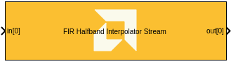

# FIR Halfband Interpolator Stream

  
  

## Library

AI Engine/DSP/Stream IO

## Description

This block implements the stream-based FIR Halfband Interpolator filter
targeted for AI Engines.

## Parameters

Main  
Input data type/Output data type  
Describes the type of individual data samples input to and output from
the filter function. int16, cint16, int32, cint32, float, cfloat.

Filter coefficients data type  
Describes the type of individual coefficients of the filter taps. It
should be one of int16, cint16, int32, cint32, float, cfloat and must
also satisfy the following rules:

- Complex types are only supported when the Input/Output data type is
  also complex.
- 32-bit types are only supported when the Input/Output data type is
  also a 32-bit type.
- Filter coefficients data type must be an integer type if the
  Input/Output data type is an integer type.
- Filter coefficients data type must be a float type if the Input/Output
  data type is a float type.

Specify filter coefficients via input port  
When this option is enabled, the tool allows you to specify reloadable
filter coefficients via the input port.

Filter coefficients  
Specifies the filter coefficients as a vector of (N+1)/4+1 elements,
where 'N' is a positive integer that represents the filter length and
must be in the range 4 to 240 inclusive.

Input frame size (Number of samples)  
Describes the number of samples used as an input to the filter function.
The number of values in the output window will be the Input window size
multiplied by two by virtue of the halfband interpolation factor.

Scale output down by 2^  
Describes the power of 2 shift down applied to the accumulation of FIR
terms before output. It must be in the range 0 to 61.

Rounding mode  
Describes the selection of rounding to be applied during the shift down
stage of processing. The rounding options are as follows:

1.  Floor (truncate)
2.  Ceiling
3.  Round to positive infinity
4.  Round to negative infinity
5.  Round symmetrical to infinity
6.  Round symmetrical to zero
7.  Round convergent to even
8.  Round convergent to odd

Modes 2 to 7 round to the nearest integer. They differ only in how they
round for the value of 0.5.

Number of parallel input/output (SSR)  
This parameter specifies the number of input (or output) ports and must
be of the form 2^N, where N is a non-negative integer.

Number of parallel polyphases (interp_poly)  
Number of decimation polyphases into which data is split into for
parallel computation. It must be integer divisible by interpolation
factor.

Advanced  
Number of cascade stages:

- Specifies the number of cascade stages. The tool will guarantee the
  same.
