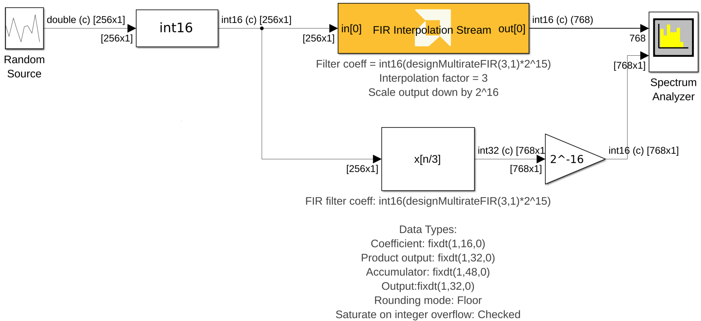
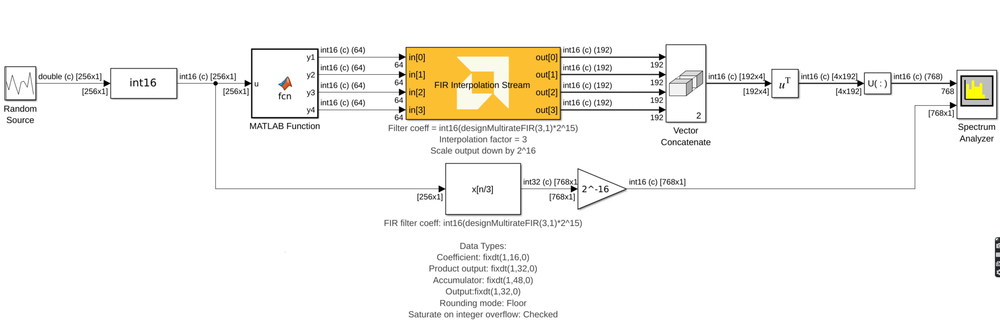
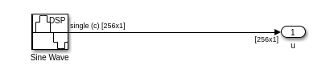
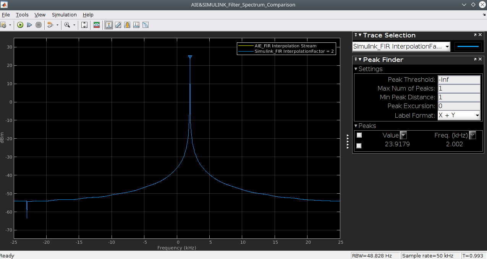

# FIR Interpolation Stream

  

## Library

AI Engine/DSP/Stream IO

## Description

This block implements the stream-based FIR Asymmetric Interpolation
filter targeted for AI Engines.

## Parameters

### Main  
#### Input/Output data type  
Set the data type of the block input and output. The data type of the input signal to the block must match this setting.

#### Filter coefficients data type  
Set the filter coefficients data type. This parameter's setting may be restricted based on the Input/Output data type. In particular,

* Complex types are only supported when the Input/Output data type is also complex.
* 32-bit types are only supported when the Input/Output data type is also a 32-bit type.
* Filter coefficients data type must be an integer type if the Input/Output data type is an integer type.
* Filter coefficients data type must be a float type if the Input/Output data type is a float type.

#### Use runtime coefficinet reloading  
When this option is enabled, the tool allows you to specify reloadable filter coefficients via an input port

#### Filter coefficients  
Specifies the filter coefficients as a vector.

#### Interpolation factor  
An unsigned integer which describes the interpolation factor of the
filter. It must be in the range 1 to 16.

#### Input frame size (Number of samples)  
Describes the number of samples used as an input to the filter function.
The number of values in the output window will be Input window size
multiplied by interpolation factor.

#### Scale output down by 2^  
Describes power of 2 shift down applied to the accumulation of FIR terms
before output. It must be in range 0 to 61.

#### Rounding mode  
Set the selection of rounding to be applied during the shift down stage of processing.

#### Number of parallel input/output (SSR)  
This parameter specifies the number of input (or output) ports and must
be of the form 2^N, where N is a non-negative integer. The input data must be split over multiple ports, where each successive sample is sent to a different input port in a round-robin fashion. See the example section.

#### Interpolate polyphase
Sets the number of interpolator polyphases over which the coefficients will be split to enable parallel computation of the outputs (see the reference for more details). The polyphases are executed parallelly and the output data is produced by combining the outputs of all the polyphases.

This parameter should be a factor of the interpolation factor. 

This parameter does not affect the number of input data ports and can be used in combination with SSR.

<div class="noteBox">
The number of AIEs used is given by (Interpolation phase) * SSR^2 * (Number of cascade stages).
</div>

#### Number of cascade stages:
Determines the number of AI Engine processors to split the operation over. This allows AI Engine tiles to be traded for higher throughput. See the example below on how the number of cascade stages affect the throughput. The value must be in the range 1 to 9.

### Constraints
Click on the button given here to access the constraint manager and add or update constraints for each kernel. If you set the "Number of cascade stages" parameter to a value greater than one, multiple kernels will be used to process the input. You can use the constraint manager to optimize the performance of your design by setting specific constraints for each kernel (in this case, you need to first run your design). Adding constraints will not affect the functional simulation in Simulink. Constraints will only affect the generated graph code, cycle approximate AIE simulation (System C), and behavior in hardware.

<div class="noteBox">
If you are using non-default constraints for any of the kernels for the block, an asterisk (*) will be displayed next to the button.
</div>

### Examples
The follwoing example shows how to set the parameters of this block and the equivalent block from the MathWorks DSP System toolbox so that they both have the same exact output. Note that we are using the DSP System toolbox command, designMultirateFIR to get the filter coefficients. 



The screen shot below, shows the same example but now with an SSR of 4. 



The MATLAB function block simply passes the input into the four outputs in a round robin fashion. The code for it is shown below:

```
function [y1, y2, y3, y4] = fcn(u)

y1 = u(1:4:end);
y2 = u(2:4:end);
y3 = u(3:4:end);
y4 = u(4:4:end);
```
**AIE FIR Interpolation Stream Block and Simulink FIR Interpolation Comparison Example:**


**ComplexSignal_2KHz Subsystem blocks:**



**AIE FIR Interpolation Stream and Simulink FIR Interpolation Output Spectrum Comparison:**



### References
[The Polyphase Implementation of Interpolation Filters in Digital Signal Processing](https://www.allaboutcircuits.com/technical-articles/digital-signal-processing-polyphase-implementation-interpolation-filter-dsp/)

This block uses the Vitis DSP library implementation of a FIR filter. For more details on this implementation please click [here](https://docs.xilinx.com/r/en-US/Vitis_Libraries/dsp/user_guide/L2/func-fir-filters.html).
