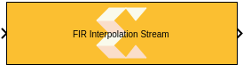
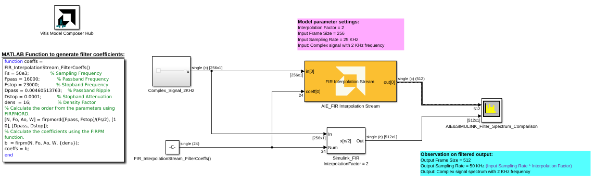

# FIR Interpolation Stream

  

## Library

AI Engine/DSP/Stream IO

## Description

This block implements the stream-based FIR Asymmetric Interpolation
filter targeted for AI Engines.

## Parameters

### Main  
#### Input/Output data type  
Set the data type of the block input and output. The data type of the input signal to the block must match this setting.

#### Filter coefficients data type  
Set the filter coefficients data type. This parameter's setting may be restricted based on the Input/Output data type. In particular,

* Complex types are only supported when the Input/Output data type is also complex.
* 32-bit types are only supported when the Input/Output data type is also a 32-bit type.
* Filter coefficients data type must be an integer type if the Input/Output data type is an integer type.
* Filter coefficients data type must be a float type if the Input/Output data type is a float type.

#### Specify filter coefficients via input port
When this option is enabled, the tool allows you to specify reloadable filter coefficients via an input port

#### Provide second set of input ports
When this option is enabled, a second stream input can be connected to the FIR, increasing available throughput. When using a second stream input, the data should be organized in a 128-bit interleaved pattern. For example, for a cint16 input samples 0-3 should be sent over the first stream and samples 4-7 should be sent over the second stream.

#### Provide second set of output ports
When this option is enabled, a second stream output is added to the block. The two output data streams are interleaved in a 128-bit pattern. For example, for cint16 output data, samples 0-3 will be sent on the first output stream and samples 4-7 will be sent on the second output stream.

#### Filter coefficients  
Specifies the filter coefficients as a vector.

#### Filter length
When using reloadable filter coefficients, use this parameter to specify the number of taps in the filter.

#### Interpolation factor  
An unsigned integer which describes the interpolation factor of the
filter. It must be in the range 1 to 16.

#### Input frame size (Number of samples)  
Describes the number of samples used as an input to the filter function.
The number of values in the output window will be Input window size
multiplied by interpolation factor.

#### Scale output down by 2^  
Describes power of 2 shift down applied to the accumulation of FIR terms
before output. It must be in range 0 to 61.

#### Rounding mode

Describes the selection of rounding to be applied during the shift down stage of processing.

The following modes are available:
* **Floor:** Truncate LSB, always round down (towards negative infinity).
* **Ceiling:** Always round up (towards positive infinity).
* **Round to positive infinity:** Round halfway towards positive infinity.
* **Round to negative infinity:** Round halfway towards negative infinity.
* **Round symmetrical to infinity:** Round halfway towards infinity (away from zero).
* **Round symmetrical to zero:** Round halfway towards zero (away from infinity).
* **Round convergent to even:** Round halfway towards nearest even number.
* **Round convergent to odd:** Round halfway towards nearest odd number.

No rounding is performed on the **Floor** or **Ceiling** modes. Other modes round to the nearest integer. They differ only in how they round for values that are exactly between two integers.

#### Saturation mode

Describes the selection of saturation to be applied during the shift down stage of processing.

The following modes are available:
* **None:** No saturation is performed and the value is truncated on the MSB side.
* **Asymmetric:** Rounds an n-bit signed value in the range `-2^(n-1)` to `2^(n-1)-1`.
* **Symmetric:** Rounds an n-bit signed value in the range `-2^(n-1)-1` to `2^(n-1)-1`.

#### Number of parallel input/output (SSR)  
This parameter specifies the number of input (or output) ports and must
be of the form 2^N, where N is a non-negative integer. The input data must be split over multiple ports, where each successive sample is sent to a different input port in a round-robin fashion. See the example section.

#### Number of interpolator polyphases
Specifies the number of interpolator polyphases over which the coefficients will be split to enable parallel computation of the outputs. The polyphases are executed in parallel; output data is produced by each polyphase directly. This parameter does not affect the number of input data paths; there will be `(SSR)` input phases irrespective of the value of this parameter.

* An interpolator polyphase value equal to the interpolation factor will result in an interpolate factor of polyphases, where each kernel is a single rate filter.
* An interpolator polyphase value less than the interpolation factor will result in the polyphase branches operating as independent interpolators.

The number of AI Engine tiles used is given by `(Number of interpolator polyphases) * (SSR)^2 * (Number of cascade stages)`.

#### Number of cascade stages:
Determines the number of AI Engine processors to split the operation over. This allows AI Engine tiles to be traded for higher throughput. See the example below on how the number of cascade stages affect the throughput. The value must be in the range 1 to 9.

### Constraints
Click on the button given here to access the constraint manager and add or update constraints for each kernel. If you set the "Number of cascade stages" parameter to a value greater than one, multiple kernels will be used to process the input. You can use the constraint manager to optimize the performance of your design by setting specific constraints for each kernel (in this case, you need to first run your design). Adding constraints will not affect the functional simulation in Simulink. Constraints will only affect the generated graph code, cycle approximate AIE simulation (System C), and behavior in hardware.

If you are using non-default constraints for any of the kernels for the block, an asterisk (*) will be displayed next to the button.

## Examples

***Click on the images below to open each model.***

### References
[The Polyphase Implementation of Interpolation Filters in Digital Signal Processing](https://www.allaboutcircuits.com/technical-articles/digital-signal-processing-polyphase-implementation-interpolation-filter-dsp/)

This block uses the Vitis DSP library implementation of a FIR filter. For more details on this implementation please click [here](https://docs.xilinx.com/r/en-US/Vitis_Libraries/dsp/user_guide/L2/func-fir-filters.html).
