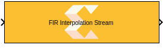
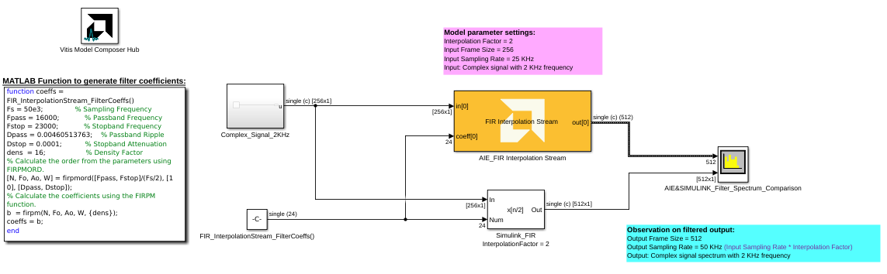
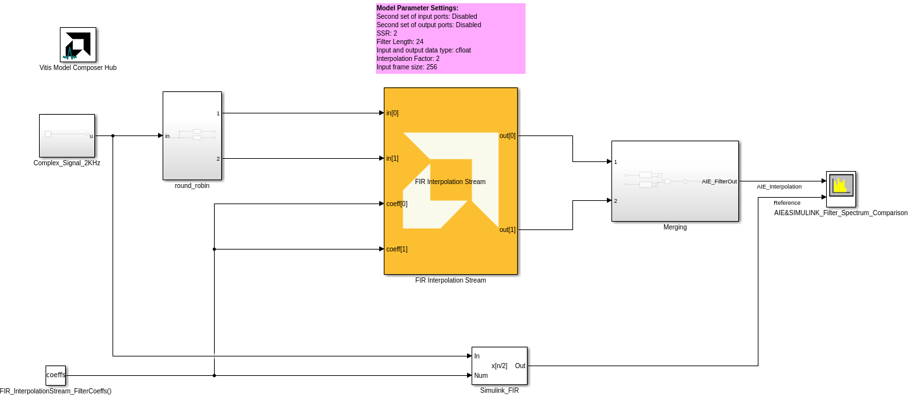
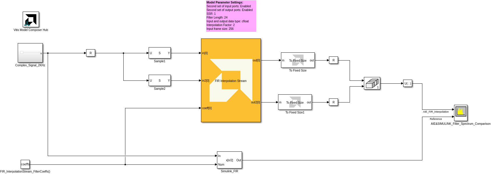
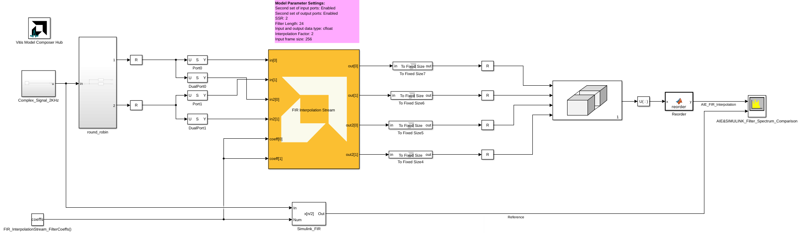

<!-- Library: aieDSP -->

# FIR Interpolation Stream

  

## Library

AI Engine/DSP/Stream IO

## Description

This block implements the stream-based FIR Asymmetric Interpolation
filter targeted for AI Engines.

## Parameters

### Main  
#### Input/Output data type  
The data type of individual samples input to and output from the filter function.

#### Filter coefficients data type  
Set the filter coefficients data type. This parameter's setting may be restricted based on the Input/Output data type. In particular,

* Complex types are only supported when the Input/Output data type is also complex.
* 32-bit types are only supported when the Input/Output data type is also a 32-bit type.
* Filter coefficients data type must be an integer type if the Input/Output data type is an integer type.
* Filter coefficients data type must be a float type if the Input/Output data type is a float type.

#### Specify filter coefficients via input port
When this option is enabled, the tool allows you to specify reloadable filter coefficients via an [asynchronous Run Time Parameter (RTP)](https://github.com/Xilinx/Vitis_Model_Composer/blob/2025.2/Examples/AIENGINE/Run_Time_Parameters/rtp_vector_async) input port.

#### Provide second set of input ports
When this option is enabled, a second stream input can be connected to the FIR, increasing available throughput. When using a second stream input, the data should be organized in a 128-bit interleaved pattern. For example, for a cint16 input samples 0-3 should be sent over the first stream and samples 4-7 should be sent over the second stream.

#### Provide second set of output ports
When this option is enabled, a second stream output is added to the block. The two output data streams are interleaved in a 128-bit pattern. For example, for cint16 output data, samples 0-3 will be sent on the first output stream and samples 4-7 will be sent on the second output stream.

#### Filter coefficients  
Specifies the filter coefficients as a vector.

#### Filter length
When using reloadable filter coefficients, use this parameter to specify the number of taps in the filter.

#### Interpolation factor  
An unsigned integer which describes the interpolation factor of the
filter. It must be in the range 1 to 16.

#### Input frame size (Number of samples)  
Describes the number of samples used as an input to the filter function.
The number of values in the output window will be Input window size
multiplied by interpolation factor.

#### Scale output down by 2^  
Describes power of 2 shift down applied to the accumulation of FIR terms
before output. It must be in range 0 to 61.

#### Rounding mode

Describes the selection of rounding to be applied during the shift down stage of processing.

The following modes are available:
* **Floor:** Truncate LSB, always round down (towards negative infinity).
* **Ceiling:** Always round up (towards positive infinity).
* **Round to positive infinity:** Round halfway towards positive infinity.
* **Round to negative infinity:** Round halfway towards negative infinity.
* **Round symmetrical to infinity:** Round halfway towards infinity (away from zero).
* **Round symmetrical to zero:** Round halfway towards zero (away from infinity).
* **Round convergent to even:** Round halfway towards nearest even number.
* **Round convergent to odd:** Round halfway towards nearest odd number.

No rounding is performed on the **Floor** or **Ceiling** modes. Other modes round to the nearest integer. They differ only in how they round for values that are exactly between two integers.

#### Saturation mode

Describes the selection of saturation to be applied during the shift down stage of processing.

The following modes are available:
* **None:** No saturation is performed and the value is truncated on the MSB side.
* **Asymmetric:** Rounds an n-bit signed value in the range `-2^(n-1)` to `2^(n-1)-1`.
* **Symmetric:** Rounds an n-bit signed value in the range `-2^(n-1)-1` to `2^(n-1)-1`.

#### Number of parallel input/output (SSR)  
This parameter specifies the number of input (or output) ports and must
be of the form 2^N, where N is a non-negative integer. The input data must be split over multiple ports, where each successive sample is sent to a different input port in a round-robin fashion. See the example section.

#### Number of interpolator polyphases
Specifies the number of interpolator polyphases over which the coefficients will be split to enable parallel computation of the outputs. The polyphases are executed in parallel; output data is produced by each polyphase directly. This parameter does not affect the number of input data paths; there will be `(SSR)` input phases irrespective of the value of this parameter.

* An interpolator polyphase value equal to the interpolation factor will result in an interpolate factor of polyphases, where each kernel is a single rate filter.
* An interpolator polyphase value less than the interpolation factor will result in the polyphase branches operating as independent interpolators.

The number of AI Engine tiles used is given by `(Number of interpolator polyphases) * (SSR)^2 * (Number of cascade stages)`.

#### Number of cascade stages:
Determines the number of AI Engine processors to split the operation over. This allows AI Engine tiles to be traded for higher throughput. See the example below on how the number of cascade stages affect the throughput. The value must be in the range 1 to 9.

### Constraints
Click on the button given here to access the constraint manager and add or update constraints for each kernel. If you set the "Number of cascade stages" parameter to a value greater than one, multiple kernels will be used to process the input. You can use the constraint manager to optimize the performance of your design by setting specific constraints for each kernel (in this case, you need to first run your design). Adding constraints will not affect the functional simulation in Simulink. Constraints will only affect the generated graph code, cycle approximate AIE simulation (System C), and behavior in hardware.

If you are using non-default constraints for any of the kernels for the block, an asterisk (*) will be displayed next to the button.

## Examples

***Click on the images below to open each model.***

<!--
DESCRIPTION:
Model: FIR_InterpolationStream_Ex1
Generated: 13-Jan-2026 15:37:08

Vitis Model Composer Configuration:
  Target Device: xcvc1902-vsva2197-1LP-e-S

Vitis Model Composer Blocks:
  - AIE: FIR Interpolation Stream

Model Annotations:
  p, li { white-space: pre-wrap; }
  Model parameter settings:
  Interpolation Factor = 2
  Input Frame Size = 256
  Input Sampling Rate = 25 KHz
  Input: Complex signal with 2 KHz frequency

  p, li { white-space: pre-wrap; }
  function coeffs = FIR_InterpolationStream_FilterCoeffs()
  Fs = 50e3;               % Sampling Frequency
  Fpass = 16000;            % Passband Frequency
  Fstop = 23000;            % Stopband Frequency
  Dpass = 0.00460513763;    % Passband Ripple
  Dstop = 0.0001;           % Stopband Attenuation
  dens  = 16;                   % Density Factor
  % Calculate the order from the parameters using FIRPMORD.
  [N, Fo, Ao, W] = firpmord([Fpass, Fstop]/(Fs/2), [1 0], [Dpass, Dstop]);
  % Calculate the coefficients using the FIRPM function.
  b  = firpm(N, Fo, Ao, W, {dens});
  coeffs = b;
  end

  p, li { white-space: pre-wrap; }
  MATLAB Function to generate filter coefficients:

  p, li { white-space: pre-wrap; }
  Observation on filtered output:
  Output Frame Size = 512
  Output Sampling Rate = 50 KHz (Input Sampling Rate * Interpolation Factor)
  Output: Complex signal spectrum with 2 KHz frequency

Description:
This MATLAB script creates a Vitis Model Composer Simulink model that uses the AI Engine FIR Interpolation Stream block. A 2kHz complex input signal is provided to the block,  and results are compared against a Simulink reference implementation.

-->

<!--
MATLAB CREATION SCRIPT:

% Quick Start: FIR_InterpolationStream_Ex1
% Essential setup focusing on critical parameters

modelName = 'FIR_InterpolationStream_Ex1';
new_system(modelName); open_system(modelName);

% Hub Block - Configure target device
add_block('vmcUtilities/Vitis Model Composer Hub', [modelName '/Hub']);
hubBlk = xmcFindHubBlock(modelName);
vmchub_set_param(hubBlk, modelName, 'SelectHardware', 'xcvc1902-vsva2197-1LP-e-S');

% NOTE: Stream blocks use SSR (Super Sample Rate) for parallelism
% Input data is split into SSR parallel streams

% FIR Interpolation Stream
add_block('aieDSP/FIR Interpolation Stream', [modelName '/FIR Interpolation Stream']);
set_param([modelName '/FIR Interpolation Stream'], ...
    'data_type', 'cfloat', ...
    'coef_type', 'float', ...
    'use_coeff_reload', 'on', ...
    'coeff', 'FIR_InterpolationStream_FilterCoeffs()', ...
    'fir_length', '24', ...
    'input_window_size', '256', ...
    'shift_val', '0', ...
    'ssr', '1');

-->

<!--
DESCRIPTION:
Model: FIR_InterpolationStream_Ex2
Generated: 13-Jan-2026 15:37:08

Vitis Model Composer Configuration:
  Target Device: xcvc1902-vsva2197-1LP-e-S

Vitis Model Composer Blocks:
  - AIE: FIR Interpolation Stream
  - AIE: To Fixed Size

Model Annotations:
  p, li { white-space: pre-wrap; }
  Model Parameter Settings:
  Second set of input ports: Disabled
  Second set of output ports: Disabled
  SSR: 2
  Filter Length: 24
  Input and output data type: cfloat
  Interpolation Factor: 2
  Input frame size: 256

  p, li { white-space: pre-wrap; }
  Note: When SSR > 1, input data stream split over multiple ports where each successive input sample is sent to a different input port in a round-robin fashion

Description:
This MATLAB script creates a Vitis Model Composer Simulink model that uses the AI Engine FIR Interpolation Stream block. A 2kHz complex input signal is provided to the block,  and results are compared against a Simulink reference implementation.

-->

<!--
MATLAB CREATION SCRIPT:

% Quick Start: FIR_InterpolationStream_Ex2
% Essential setup focusing on critical parameters

modelName = 'FIR_InterpolationStream_Ex2';
new_system(modelName); open_system(modelName);

% Hub Block - Configure target device
add_block('vmcUtilities/Vitis Model Composer Hub', [modelName '/Hub']);
hubBlk = xmcFindHubBlock(modelName);
vmchub_set_param(hubBlk, modelName, 'SelectHardware', 'xcvc1902-vsva2197-1LP-e-S');

% NOTE: Stream blocks use SSR (Super Sample Rate) for parallelism
% Input data is split into SSR parallel streams

% FIR Interpolation Stream
add_block('aieDSP/FIR Interpolation Stream', [modelName '/FIR Interpolation Stream']);
set_param([modelName '/FIR Interpolation Stream'], ...
    'data_type', 'cfloat', ...
    'coef_type', 'float', ...
    'use_coeff_reload', 'on', ...
    'coeff', 'coeffs', ...
    'fir_length', '24', ...
    'input_window_size', '256', ...
    'shift_val', '0', ...
    'ssr', 'SSR');

-->

<!--
DESCRIPTION:
Model: FIR_InterpolationStream_Ex3
Generated: 13-Jan-2026 15:37:09

Vitis Model Composer Configuration:
  Target Device: xcvc1902-vsva2197-1LP-e-S

Vitis Model Composer Blocks:
  - AIE: FIR Interpolation Stream
  - AIE: To Fixed Size

Model Annotations:
  p, li { white-space: pre-wrap; }
  Model Parameter Settings:
  Second set of input ports: Enabled
  Second set of output ports: Enabled
  SSR: 1
  Filter Length: 24
  Input and output data type: cfloat
  Interpolation Factor: 2
  Input frame size: 256

  p, li { white-space: pre-wrap; }
  Note:
  Let N be the number of input ports, so for SSR=1 with second set of input ports enabled, N=2
  Let M be the number of samples per each input port, M = (128 bits) / (width of input data), so M=128/64=2 for cfloat
  Input Samples:
  1.Arrange the input samples in the matrix form: (NM) x (Input Frame Size/NM)
  (Number of rows = NM, Number of columns = Input Frame Size / NM).
  At each invocation of the block, feed 1st M-samples to 1st input port and subsequent M-samples to 2nd input port (No need to arrange the samples in a round-robin fashion when SSR = 1)
  Output Samples:
  1. Rearrange the output samples from each port in the matrix form: (M) x (Interpolation Factor * Input Frame Size/NM)
  (Number of rows = M, Number of columns = Interpolation Factor × Input Frame Size / NM).
  2. Concatenate the output matrices
  3. Reshape the resultant matrix to form 1-D vector to compare with the golden reference.

Description:
This MATLAB script creates a Vitis Model Composer Simulink model that uses the AI Engine FIR Interpolation Stream block. A 2kHz complex input signal is provided to the block,  and results are compared against a Simulink reference implementation.

-->

<!--
MATLAB CREATION SCRIPT:

% Quick Start: FIR_InterpolationStream_Ex3
% Essential setup focusing on critical parameters

modelName = 'FIR_InterpolationStream_Ex3';
new_system(modelName); open_system(modelName);

% Hub Block - Configure target device
add_block('vmcUtilities/Vitis Model Composer Hub', [modelName '/Hub']);
hubBlk = xmcFindHubBlock(modelName);
vmchub_set_param(hubBlk, modelName, 'SelectHardware', 'xcvc1902-vsva2197-1LP-e-S');

% NOTE: Stream blocks use SSR (Super Sample Rate) for parallelism
% Input data is split into SSR parallel streams

% FIR Interpolation Stream
add_block('aieDSP/FIR Interpolation Stream', [modelName '/FIR Interpolation Stream']);
set_param([modelName '/FIR Interpolation Stream'], ...
    'data_type', 'cfloat', ...
    'coef_type', 'float', ...
    'use_coeff_reload', 'on', ...
    'coeff', 'coeffs', ...
    'fir_length', '24', ...
    'input_window_size', '256', ...
    'shift_val', '0', ...
    'ssr', '1');

-->

<!--
DESCRIPTION:
Model: FIR_InterpolationStream_Ex4
Generated: 13-Jan-2026 15:37:09

Vitis Model Composer Configuration:
  Target Device: xcvc1902-vsva2197-1LP-e-S

Vitis Model Composer Blocks:
  - AIE: FIR Interpolation Stream
  - AIE: To Fixed Size

Model Annotations:
  p, li { white-space: pre-wrap; }
  Model Parameter Settings:
  Second set of input ports: Enabled
  Second set of output ports: Enabled
  SSR: 2
  Filter Length: 24
  Input and output data type: cfloat
  Interpolation Factor: 2
  Input frame size: 256

  p, li { white-space: pre-wrap; }
  Note:
  Let N be the number of input ports, so for SSR=2 with second set of input ports enabled, N=4
  Let M be the number of samples per each input port, M = (128 bits) / (width of input data), so M=128/64=2 for cfloat
  Input Samples:
  1. When SSR > 1, this input data stream split over multiple ports where each successive input sample is sent to a different input port in a round-robin fashion
  2. Arrange the samples from each input port in the matrix form: (N) x (Input Frame Size/NM)
  Number of input matrices = SSR
  Let SSR = 2, then we have two input matrices: A,B
  At each invocation of the block:
  From matrix A, feed 1st M-samples to 1st input port in[0] of the block and subsequent M-samples to 2nd set of the same input port in2[0].
  From matrix B, feed 1st M-samples to 2nd input port in[1] of the block and subsequent M-samples to 2nd set of the same input port in2[1].
  Output Samples:
  1. Rearrange the output samples from each port in the matrix form: (M) x (Interpolation Factor * Input Frame Size/NM)
  (Number of rows = M, Number of columns = Interpolation Factor × Input Frame Size / NM).
  2. Concatenate the output matrices to form a resultant matrix of size (NM) x (Interpolation Factor * Input Frame Size/NM)
  (Number of rows = NM, Number of columns = Interpolation Factor × Input Frame Size / NM).
  3. Reshape the resultant matrix to form 1-D vector.
  4. Reoder the 1-D vector to compare with the golden reference.
  How to reorder the output 1-D vector?
  From (x1, x3, x2, x4, x5, x7, x6, x8) → (x1, x2, x3, x4, x5, x6, x7, x8)
  Each set of NM samples from the output 1-D vector is currently arranged as:
  x1, x3, x2, x4, x5, x7, x6, x8
  Reorder each set of NM samples to:
  x1, x2, x3, x4, x5, x6, x7, x8.

Description:
This MATLAB script creates a Vitis Model Composer Simulink model that uses the AI Engine FIR Interpolation Stream block. A 2kHz complex input signal is provided to the block,  and results are compared against a Simulink reference implementation.

-->

<!--
MATLAB CREATION SCRIPT:

% Quick Start: FIR_InterpolationStream_Ex4
% Essential setup focusing on critical parameters

modelName = 'FIR_InterpolationStream_Ex4';
new_system(modelName); open_system(modelName);

% Hub Block - Configure target device
add_block('vmcUtilities/Vitis Model Composer Hub', [modelName '/Hub']);
hubBlk = xmcFindHubBlock(modelName);
vmchub_set_param(hubBlk, modelName, 'SelectHardware', 'xcvc1902-vsva2197-1LP-e-S');

% NOTE: Stream blocks use SSR (Super Sample Rate) for parallelism
% Input data is split into SSR parallel streams

% FIR Interpolation Stream
add_block('aieDSP/FIR Interpolation Stream', [modelName '/FIR Interpolation Stream']);
set_param([modelName '/FIR Interpolation Stream'], ...
    'data_type', 'cfloat', ...
    'coef_type', 'float', ...
    'use_coeff_reload', 'on', ...
    'coeff', 'coeffs', ...
    'fir_length', '24', ...
    'input_window_size', '256', ...
    'shift_val', '0', ...
    'ssr', 'SSR');

-->

### References
[The Polyphase Implementation of Interpolation Filters in Digital Signal Processing](https://www.allaboutcircuits.com/technical-articles/digital-signal-processing-polyphase-implementation-interpolation-filter-dsp/)

This block uses the Vitis DSP library implementation of a FIR filter. For more details on this implementation please click [here](https://docs.xilinx.com/r/en-US/Vitis_Libraries/dsp/user_guide/L2/func-fir-filtersAIE.html).

--------------
Copyright (C) 2025 Advanced Micro Devices, Inc.
All rights reserved.

SPDX-License-Identifier: MIT
