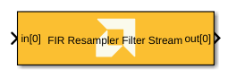
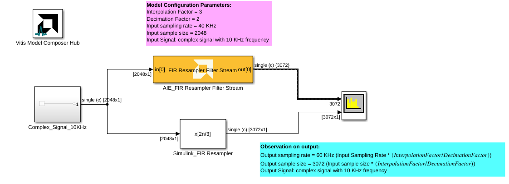
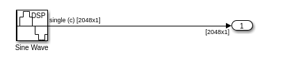
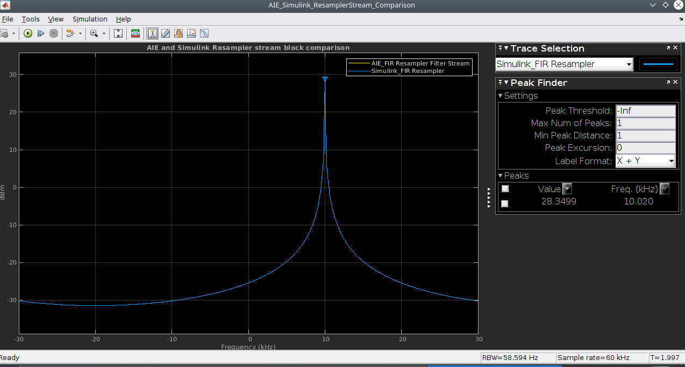
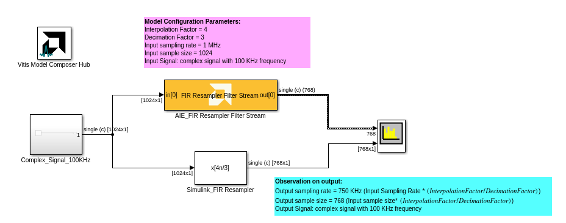
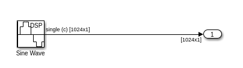
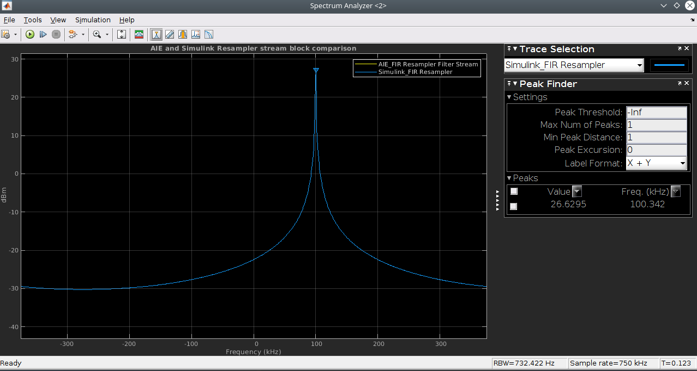

# FIR Resampler Filter Stream

  
  

## Library

AI Engine/DSP/Window IO

## Description

This block implements stream-based FIR Fractional Asymmetric Interpolation and
Decimation filter targeted for AI Engines.

## Parameters

### Main  
#### Input/Output data type  
Describes the type of individual data samples input to and output from
the filter function. int16, cint16, int32, cint32, float, cfloat.

#### Filter coefficients data type  
Describes the type of individual coefficients of the filter taps. It
should be one of int16, cint16, int32, cint32, float, cfloat and must
also satisfy the following rules:

  - Complex types are only supported when the Input/Output data type is
  also complex.
  - 32-bit types are only supported when the Input/Output data type is
  also a 32-bit type.
  - Filter coefficients data type must be an integer type if the
  Input/Output data type is an integer type.
  - Filter coefficients data type must be a float type if the Input/Output
  data type is a float type.

#### Specify filter coefficients via input port  
When this option is enabled, the tool allows you to specify reloadable
filter coefficients via input port.

#### Provide second set of input ports
When this option is enabled, a second stream input can be connected to the FIR, increasing available throughput. When using a second stream input, the data should be organized in a 128-bit interleaved pattern. For example, for a cint16 input samples 0-3 should be sent over the first stream and samples 4-7 should be sent over the second stream.

#### Provide second set of output ports
When this option is enabled, a second stream output is added to the block. The two output data streams are interleaved in a 128-bit pattern. For example, for cint16 output data, samples 0-3 will be sent on the first output stream and samples 4-7 will be sent on the second output stream.

#### Filter coefficients  
This field should be specified with the asymmetric filter coefficients
and must be in the range 4 to 240 inclusive.

#### Filter length
When using reloadable filter coefficients, use this parameter to specify the number of taps in the filter.

#### Interpolation factor  
An unsigned integer which describes the Interpolation factor of the
filter. It must be in the range 3 to 16.

#### Decimation factor  
An unsigned integer which describes the decimation factor of the filter.
It must be in the range 2 to 16.

#### Input window size (Number of samples)  
Describes the number of samples used as an input to the filter function.
The number of values in the output window will be the input window size
multipled by the Interpolation factor and divided by the decimation
factor. In this instance it would result in a fraction number of output
samples which would be rounded down.

#### Scale output down by 2^  
Describes the power of 2 shift down applied to the accumulation of FIR
terms before output. It must be in the range 0 to 61.

#### Rounding mode

Describes the selection of rounding to be applied during the shift down stage of processing.

The following modes are available:
* **Floor:** Truncate LSB, always round down (towards negative infinity).
* **Ceiling:** Always round up (towards positive infinity).
* **Round to positive infinity:** Round halfway towards positive infinity.
* **Round to negative infinity:** Round halfway towards negative infinity.
* **Round symmetrical to infinity:** Round halfway towards infinity (away from zero).
* **Round symmetrical to zero:** Round halfway towards zero (away from infinity).
* **Round convergent to even:** Round halfway towards nearest even number.
* **Round convergent to odd:** Round halfway towards nearest odd number.

No rounding is performed on the **Floor** or **Ceiling** modes. Other modes round to the nearest integer. They differ only in how they round for values that are exactly between two integers.

#### Saturation mode

Describes the selection of saturation to be applied during the shift down stage of processing.

The following modes are available:
* **None:** No saturation is performed and the value is truncated on the MSB side.
* **Asymmetric:** Rounds an n-bit signed value in the range `-2^(n-1)` to `2^(n-1)-1`.
* **Symmetric:** Rounds an n-bit signed value in the range `-2^(n-1)-1` to `2^(n-1)-1`.

#### Number of parallel input/output (SSR)  
This parameter specifies the number of input (or output) paths. SSR decomposition is currently unavailable for the FIR Resampler Filter Stream block. Please set this parameter to 1 and control Super Sample Rate operations by changing the number of interplator/decimator polyphases.

#### Number of interpolator polyphases

Specifies the number of interpolator polyphases over which the coefficients will be split to enable parallel computation of the outputs. The polyphases are executed in parallel; output data is produced by each polyphase directly.

* An interpolator polyphase value equal to the interpolation factor will result in an interpolate factor of polyphases, where each kernel is a single rate filter.
* An interpolator polyphase value less than the interpolation factor will result in the polyphase branches operating as independent interpolators.

The number of AI Engine tiles used is given by `(Number of interpolator polyphases) * (SSR)^2 * (Number of cascade stages)`.

#### Number of decimator polyphases

Specifies the number of decimator polyphases that will be split up and executed in a series of pipelined cascade stages, resulting in additional input paths.

* A decimator polyphase value of 1 means just one input leg.
* A decimator polyphase value equal to the decimation factor will result in a decimate factor of polyphases, operating as independent single rate filters connected by cascades.
* A decimator polyphase value less than the decimation factor will result in the polyphase branches operating as independent decimators connected by cascades.

The number of AI Engine tiles used is given by `(Number of decimator polyphases) * (SSR)^2 * (Number of cascade stages)`.

#### Number of cascade stages  
This determines the number of kernels the FIR will be divided over in series to improve throughput.

**FIR Resampler Filter Stream Block Example1:**

**ComplexSignal_10KHz subsystem blocks:**

**AIE and Simulink Resampler Filter Stream Output Spectrum Comparison:**

**FIR Resampler Filter Stream Block Example2:**

**ComplexSignal_100KHz subsystem blocks:**

**AIE and Simulink Resampler Filter Stream Output Spectrum Comparison:**

