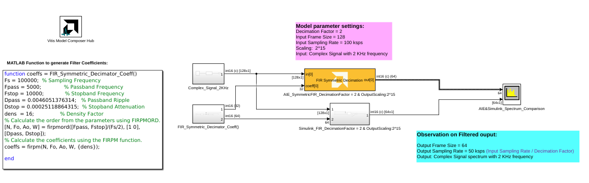

# FIR Symmetric Decimation

  
  

## Library

AIE Engine/DSP/Buffer IO

## Description

This block implements the FIR Symmetric Decimation Filter targeted for
AI Engines.

## Parameters

### Main  
#### Input data type/Output data type  
Describes the type of individual data samples input to and output from
the filter function. int16, cint16, int32, cint32, float, cfloat.

#### Filter coefficients data type  
Describes the type of individual coefficients of the filter taps. It
should be one of int16, cint16, int32, cint32, float, cfloat and must
also satisfy the following rules:

  - Complex types are only supported when the Input/Output data type is
  also complex.
  - 32-bit types are only supported when the Input/Output data type is
  also a 32-bit type.
  - Filter coefficients data type must be an integer type if the
  Input/Output data type is an integer type.
  - Filter coefficients data type must be a float type if the Input/Output
  data type is a float type.

#### Specify filter coefficients via input port  
When this option is enabled, the tool allows you to specify reloadable
filter coefficients via the input port.

#### Provide second set of input ports
When this option is enabled, a second input port can be connected to the FIR, increasing available throughput. In Simulink, both input ports should be connected to the same signal.

This setting is an implementation trade-off between performance and data bank resources. When this option is disabled, the FIR performance may be limited by load contention; when this option is enabled, two RAM banks are used for input, reducing load contention.

#### Provide second set of output ports
When this option is enabled, a second output port is added to the block producing the same data as the first output port.

#### Filter coefficients  
This field should only be supplied for the first half of the filter
length plus the center tap for odd lengths i.e., taps\[\] = {c0, c1, c2,
..., cN \[, cCT\]} where N = (FILTER_LENGTH)/2 and cCT is the center tap
where FILTER_LENGTH is odd. For example, a 9-tap filter might use coeffs
(1, 3, 2, 3, 5, 3, 2, 3, 1). This could be input as taps\[\]= {1,3,2,3,5}
because the context of symmetry allows the remaining coefficients to be
inferred.

#### Filter length  
This is an unsigned integer which describes the number of taps in the
filter. The filter length must be in the range 4 to 240 and must be an
integer multiple of the decimation factor.

#### Decimation factor  
An unsigned integer which describes the decimation factor of the filter.
It must be in the range 2 to 3. For larger factors, use the FIR
Asymmetric decimation filter.

#### Input window size (Number of samples)  
Describes the number of samples used as an input to the filter function.
The number of values in the output window will be the input window size
divided by decimation factor by virtue of the decimation factor.

#### Scale output down by 2^  
Describes power of 2 shift down applied to the accumulation of FIR terms
before output. It must be in range 0 to 61.

#### Rounding mode

Describes the selection of rounding to be applied during the shift down stage of processing.

The following modes are available:
* **Floor:** Truncate LSB, always round down (towards negative infinity).
* **Ceiling:** Always round up (towards positive infinity).
* **Round to positive infinity:** Round halfway towards positive infinity.
* **Round to negative infinity:** Round halfway towards negative infinity.
* **Round symmetrical to infinity:** Round halfway towards infinity (away from zero).
* **Round symmetrical to zero:** Round halfway towards zero (away from infinity).
* **Round convergent to even:** Round halfway towards nearest even number.
* **Round convergent to odd:** Round halfway towards nearest odd number.

No rounding is performed on the **Floor** or **Ceiling** modes. Other modes round to the nearest integer. They differ only in how they round for values that are exactly between two integers.

#### Saturation mode

Describes the selection of saturation to be applied during the shift down stage of processing.

The following modes are available:
* **None:** No saturation is performed and the value is truncated on the MSB side.
* **Asymmetric:** Rounds an n-bit signed value in the range `-2^(n-1)` to `2^(n-1)-1`.
* **Symmetric:** Rounds an n-bit signed value in the range `-2^(n-1)-1` to `2^(n-1)-1`.

#### Number of cascade stages  
This determines the number of kernels the FIR will be divided over in series to improve throughput.

The number of AI Engine tiles used is determined by `(SSR)^2 * (Number of cascade stages)`.

## Examples

***Click on the images below to open each model.***

