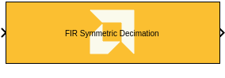

# FIR Symmetric Decimation

  
  

## Library

AIE Engine/DSP/Window IO

## Description

This block implements the FIR Symmetric Decimation Filter targeted for
AI Engines.

## Parameters

### Main  
#### Input data type/Output data type  
* Describes the type of individual data samples input to and output from
the filter function. int16, cint16, int32, cint32, float, cfloat.

#### Filter coefficients data type  
* Describes the type of individual coefficients of the filter taps. It
should be one of int16, cint16, int32, cint32, float, cfloat and must
also satisfy the following rules:

  - Complex types are only supported when the Input/Output data type is
  also complex.
  - 32-bit types are only supported when the Input/Output data type is
  also a 32-bit type.
  - Filter coefficients data type must be an integer type if the
  Input/Output data type is an integer type.
  - Filter coefficients data type must be a float type if the Input/Output
  data type is a float type.

#### Specify filter coefficients via input port  
* When this option is enabled, the tool allows you to specify reloadable
filter coefficients via the input port.

#### Filter coefficients  
* This field should only be supplied for the first half of the filter
length plus the center tap for odd lengths i.e., taps\[\] = {c0, c1, c2,
..., cN \[, cCT\]} where N = (FILTER_LENGTH)/2 and cCT is the center tap
where FILTER_LENGTH is odd. For example, a 7-tap filter might use coeffs
(1, 3, 2, 5, 2, 3, 1). This could be input as taps\[\]= {1,3,2,5}
because the context of symmetry allows the remaining coefficients to be
inferred.

#### Filter length  
* This is an unsigned integer which describes the number of taps in the
filter. The filter length must be in the range 4 to 240 and must be an
integer multiple of the decimation factor.

#### Decimation factor  
* An unsigned integer which describes the decimation factor of the filter.
It must be in the range 2 to 3. For larger factors, use the FIR
Asymmetric decimation filter.

#### Input window size (Number of samples)  
* Describes the number of samples used as an input to the filter function.
The number of values in the output window will be the input window size
divided by decimation factor by virtue of the decimation factor.

#### Scale output down by 2^  
* Describes power of 2 shift down applied to the accumulation of FIR terms
before output. It must be in range 0 to 61.

#### Rounding mode  
* Describes the selection of rounding to be applied during the shift down
stage of processing. The rounding options are as follows:

1.  Floor (truncate)
2.  Ceiling
3.  Round to positive infinity
4.  Round to negative infinity
5.  Round symmetrical to infinity
6.  Round symmetrical to zero
7.  Round convergent to even
8.  Round convergent to odd

* Modes 2 to 7 round to the nearest integer. They differ only in how they
round for the value of 0.5.

### Advanced  
#### Target input throughput (MSPS)  
* Specifies the rate at which data samples should be processed. The
default value is 200.

#### Specify the number of cascade stages  
* When this option is not enabled, the tool will determine the filter
configuration that best achieves the specified input sampling rate. When
the option is enabled and the 'Number of cascade stages' is specified,
the tool will guarantee the same. In such cases, however, the specified
input sampling rate constraint may not be achieved.
