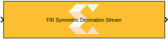
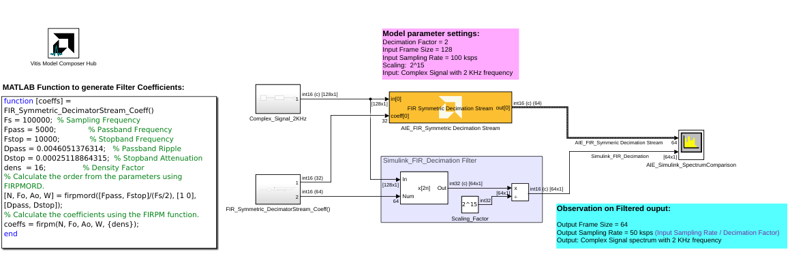
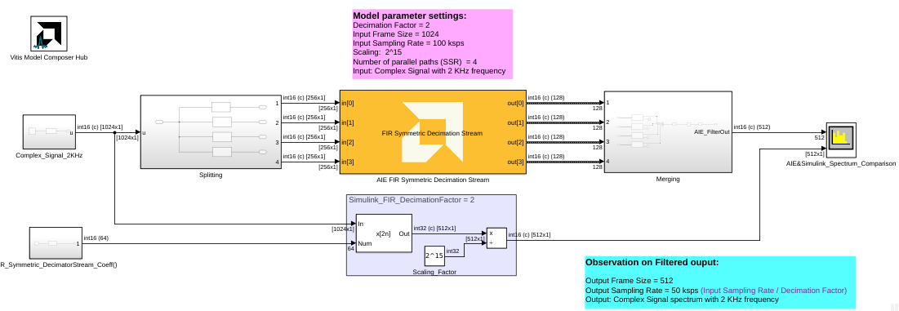
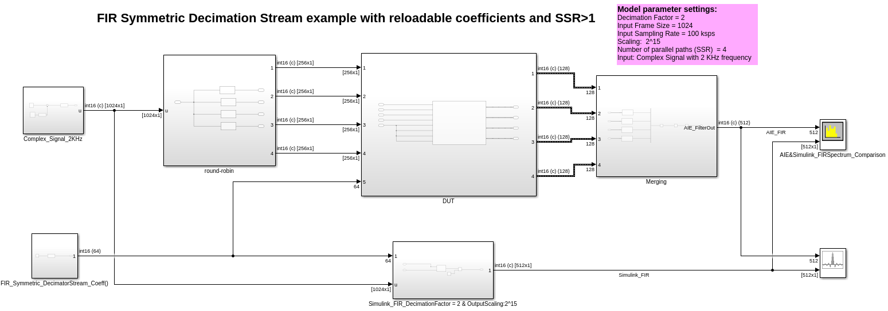

<!-- Library: aieDSP -->

# FIR Symmetric Decimation Stream

  
  

## Library

AI Engine/DSP/Stream IO

## Description

This block implements the stream-based FIR Symmetric Decimation filter
targeted for AI Engines.

## Parameters

### Main  
#### Input/Output data type  
Describes the type of individual data samples input to and output from
the filter function. int16, cint16, int32, cint32, float, cfloat.

#### Filter coefficients data type  
Describes the type of individual coefficients of the filter taps. It
should be one of int16, cint16, int32, cint32, float, cfloat and must
also satisfy the following rules:

  - Complex types are only supported when the Input/Output data type is
  also complex.
  - 32-bit types are only supported when the Input/Output data type is
  also a 32-bit type.
  - Filter coefficients data type must be an integer type if the
  Input/Output data type is an integer type.
  - Filter coefficients data type must be a float type if the Input/Output
  data type is a float type.

#### Specify filter coefficients via input port  
When this option is enabled, the tool allows you to specify reloadable
filter coefficients via an [asynchronous Run Time Parameter (RTP)](https://github.com/Xilinx/Vitis_Model_Composer/blob/2025.2/Examples/AIENGINE/Run_Time_Parameters/rtp_vector_async) input port.

#### Provide second set of input ports
When this option is enabled, a second stream input can be connected to the FIR, increasing available throughput. When using a second stream input, the data should be organized in a 128-bit interleaved pattern. For example, for a cint16 input samples 0-3 should be sent over the first stream and samples 4-7 should be sent over the second stream.

#### Provide second set of output ports
When this option is enabled, a second stream output is added to the block. The two output data streams are interleaved in a 128-bit pattern. For example, for cint16 output data, samples 0-3 will be sent on the first output stream and samples 4-7 will be sent on the second output stream.

#### Filter coefficients

<b>WARNING:</b> Before using this block with coefficients that are odd symmetric, refer to this [Answer Record](https://adaptivesupport.amd.com/s/article/000038190).
  
This field should only be supplied for the first half of the filter
length plus the center tap for odd lengths i.e., taps\[\] = {c0, c1, c2,
..., cN \[, cCT\]} where N = (FILTER_LENGTH)/2 and cCT is the center tap
where FILTER_LENGTH is odd. For example, a 9-tap filter might use coeffs
(1, 3, 2, 3, 5, 3, 2, 3, 1). This could be input as taps\[\]= {1,3,2,3,5}
because the context of symmetry allows the remaining coefficients to be
inferred.

#### Filter length  
This is an unsigned integer which describes the number of taps in the
filter. The filter length must be in the range 4 to 240 and must be an
integer multiple of the decimation factor.

#### Decimation factor  
An unsigned integer which describes the decimation factor of the filter.
It must be in the range 2 to 3. For larger factors, use the FIR
Asymmetric decimation filter.

#### Input frame size (Number of samples)  
Describes the number of samples used as an input to the filter function.
The number of values in the output window will be the input window size
divided by decimation factor by virtue of the decimation factor.

#### Scale output down by 2^  
Describes power of 2 shift down applied to the accumulation of FIR terms
before output. It must be in range 0 to 61.

#### Rounding mode

Describes the selection of rounding to be applied during the shift down stage of processing.

The following modes are available:
* **Floor:** Truncate LSB, always round down (towards negative infinity).
* **Ceiling:** Always round up (towards positive infinity).
* **Round to positive infinity:** Round halfway towards positive infinity.
* **Round to negative infinity:** Round halfway towards negative infinity.
* **Round symmetrical to infinity:** Round halfway towards infinity (away from zero).
* **Round symmetrical to zero:** Round halfway towards zero (away from infinity).
* **Round convergent to even:** Round halfway towards nearest even number.
* **Round convergent to odd:** Round halfway towards nearest odd number.

No rounding is performed on the **Floor** or **Ceiling** modes. Other modes round to the nearest integer. They differ only in how they round for values that are exactly between two integers.

#### Saturation mode

Describes the selection of saturation to be applied during the shift down stage of processing.

The following modes are available:
* **None:** No saturation is performed and the value is truncated on the MSB side.
* **Asymmetric:** Rounds an n-bit signed value in the range `-2^(n-1)` to `2^(n-1)-1`.
* **Symmetric:** Rounds an n-bit signed value in the range `-2^(n-1)-1` to `2^(n-1)-1`.

#### Number of parallel input/output (SSR)  
This parameter specifies the number of input (or output) ports and must
be of the form 2^N, where N is a non-negative integer.

#### Number of cascade stages:
This determines the number of kernels the FIR will be divided over in series to improve throughput.

The number of AI Engine tiles used is determined by `(SSR)^2 * (Number of cascade stages)`.

## Examples

***Click on the images below to open each model.***

<!--
DESCRIPTION:
Model: FIR_SymmetricDecimatorStream_Ex1
Generated: 09-Jan-2026 13:44:26

Vitis Model Composer Configuration:
  Target Device: xcvc1902-vsva2197-1LP-e-S

Vitis Model Composer Blocks:
  - AIE: FIR Symmetric Decimation Stream

Description:
This MATLAB script creates a Vitis Model Composer Simulink model that uses the AI Engine FIR Symmetric Decimation Stream block. A 2kHz complex input signal is provided to the block, 

-->

<!--
MATLAB CREATION SCRIPT:

% create_FIR_SymmetricDecimatorStream_Ex1_model.m
% Auto-generated script to recreate the FIR_SymmetricDecimatorStream_Ex1 Simulink model
% Generated on: 09-Jan-2026 13:44:26

%% Model Configuration
modelName = 'FIR_SymmetricDecimatorStream_Ex1_recreated';

%% Create New Model
if bdIsLoaded(modelName)
    close_system(modelName, 0);
end

new_system(modelName);
open_system(modelName);
fprintf('Created new model: %s\n', modelName);

%% Add Vitis Model Composer Hub Block
hubBlockPath = [modelName '/Vitis Model Composer Hub'];
add_block('vmcUtilities/Vitis Model Composer Hub', hubBlockPath, ...
    'Position', [287 78 342 131]);

hubBlk = xmcFindHubBlock(modelName);
vmchub_set_param(hubBlk, modelName, 'SelectHardware', 'xcvc1902-vsva2197-1LP-e-S');

%% Add Top-Level Blocks
add_block('built-in/SpectrumAnalyzer', [modelName '/AIE_Simulink_SpectrumComparison'], ...
    'Position', [1440 281 1485 334]);
set_param([modelName '/AIE_Simulink_SpectrumComparison'], ...
    'NumInputPorts', '2', ...
    'OpenAtSimulationStart', 'on', ...
    'WindowPosition', '[884.000000,398.000000,800.000000,500.000000,]', ...
    'InputDomain', 'Time', ...
    'SpectrumType', 'Power', ...
    'ViewType', 'Spectrum', ...
    'Method', 'Filter bank', ...
    'SampleRateSource', 'Inherited', ...
    'SampleRate', '10000', ...
    'PlotAsTwoSidedSpectrum', 'on', ...
    'FrequencyScale', 'Linear', ...
    'PlotType', 'Line', ...
    'AxesScaling', 'Auto', ...
    'AxesScalingNumUpdates', '100', ...
    'FrequencyResolutionMethod', 'RBW', ...
    'RBWSource', 'Auto', ...
    'RBW', '9.76', ...
    'WindowInvariantSamplesPerUpdate', 'off', ...
    'WindowLength', '1024', ...
    'FFTLengthSource', 'Auto', ...
    'FFTLength', '1024', ...
    'FilterSharpness', '0.3', ...
    'FrequencySpan', 'Full', ...
    'Span', '10000', ...
    'CenterFrequency', '0', ...
    'StartFrequency', '-5000', ...
    'StopFrequency', '5000', ...
    'InputUnits', 'dBm', ...
    'FrequencyVectorSource', 'Auto', ...
    'FrequencyVector', '[-5000,5000]', ...
    'Window', 'Hann', ...
    'CustomWindow', 'hann', ...
    'SidelobeAttenuation', '60', ...
    'OverlapPercent', '0', ...
    'AveragingMethod', 'Exponential', ...
    'SpectralAverages', '1', ...
    'ForgettingFactor', '0.9', ...
    'VBWSource', 'Auto', ...
    'VBW', '9.76', ...
    'SpectrumUnits', 'dBm', ...
    'FullScaleSource', 'Auto', ...
    'FullScale', '1', ...
    'ReferenceLoad', '1', ...
    'FrequencyOffset', '0', ...
    'SpectrogramChannel', '1', ...
    'TimeResolutionSource', 'Auto', ...
    'TimeResolution', '1e-3', ...
    'TimeSpanSource', 'Auto', ...
    'TimeSpan', '0.1', ...
    'MaximizeAxes', 'Auto', ...
    'PlotNormalTrace', 'on', ...
    'PlotMaxHoldTrace', 'off', ...
    'PlotMinHoldTrace', 'off', ...
    'YLimits', '[6.1877,126.3481]', ...
    'ColorLimits', '[-80,20]', ...
    'Colormap', 'jet', ...
    'ShowGrid', 'on', ...
    'ShowLegend', 'on', ...
    'ShowColorbar', 'on', ...
    'ChannelNames', '[""]', ...
    'AxesLayout', 'Vertical');
add_block('aieDSP/FIR Symmetric Decimation Stream', [modelName '/AIE_SymmetricFIRStream_DecimationFactor = 2 & OutputScaling:2^15 '], ...
    'Position', [900 252 1120 308]);
set_param([modelName '/AIE_SymmetricFIRStream_DecimationFactor = 2 & OutputScaling:2^15 '], ...
    'data_type', 'cint16', ...
    'coef_type', 'int16', ...
    'use_coeff_reload', 'on', ...
    'dual_ip', 'off', ...
    'num_outputs', 'off', ...
    'coeff', '[1, zeros(1, 15)]', ...
    'fir_length', '64', ...
    'decimate_factor', '2', ...
    'input_window_size', '128', ...
    'shift_val', '15', ...
    'rnd_mode', 'Ceiling', ...
    'sat_mode', '0-None', ...
    'ssr', '1', ...
    'casc_length', '1', ...
    'TP_API', '1');
add_block('vmcUtilities/Vitis Model Composer Hub', [modelName '/Vitis Model Composer Hub'], ...
    'Position', [287 78 342 131]);
set_param([modelName '/Vitis Model Composer Hub'], ...
    'CodeGeneration', 'off', ...
    'StartColumn', '1', ...
    'NumberOfColumns', '1', ...
    'TargetDirectory', './code', ...
    'exportDesign', 'off', ...
    'analyzeDesign', 'off', ...
    'validateDesignOnHw', 'off', ...
    'ExportType', 'AI Engines', ...
    'IpVendor', 'xilinx.com', ...
    'IpLibrary', 'hls', ...
    'IpVersion', '1.0', ...
    'IpHWLanguage', 'Verilog', ...
    'AieCompilerOptions', '{}', ...
    'CreateTestbench', 'off', ...
    'TestbenchStackSize', '10', ...
    'RunRtlSim', 'off', ...
    'RunCSim', 'off', ...
    'RunAieSim', 'off', ...
    'AieSimTimeout', '50000', ...
    'RunAieSimProfiling', 'off', ...
    'LaunchVitisAnalyzer', 'off', ...
    'PlotOutput', 'off', ...
    'GenHwImage', 'off', ...
    'GenLibadfXo', 'off', ...
    'GenHwValidationCode', 'off', ...
    'PlatformType', 'Not Specified', ...
    'HwSystemType', 'Baremetal', ...
    'HwValidationTarget', 'hw', ...
    'ProjDevice', 'xcvc1902-vsva2197-1LP-e-S', ...
    'SamplePeriod', '-1', ...
    'ClockFrequency', '200', ...
    'DataPathParallelism', '1', ...
    'xilinxfamily', 'versalaicore', ...
    'part', 'xcvc1902', ...
    'speed', '-1LP-e-S', ...
    'package', 'vsva2197', ...
    'directory', './netlist', ...
    'testbench', 'off', ...
    'incr_netlist', 'off', ...
    'synthesis_tool', 'Vivado', ...
    'clock_wrapper', 'Clock Enables', ...
    'dbl_ovrd', 'According to Block Masks', ...
    'dcm_input_clock_period', '10', ...
    'sysclk_period', '10', ...
    'simulink_period', '1', ...
    'eval_field', '0', ...
    'LogFileName', '''''', ...
    'NThreads', '4');

%% Create Complex_Signal_2KHz Subsystem
add_block('built-in/SubSystem', [modelName '/Complex_Signal_2KHz'], ...
    'Position', [655 229 735 281]);

% Remove default blocks
defaultBlocks = find_system([modelName '/Complex_Signal_2KHz'], 'SearchDepth', 1, 'Type', 'block');
for i = 1:length(defaultBlocks)
    if ~strcmp(defaultBlocks{i}, [modelName '/Complex_Signal_2KHz'])
        delete_block(defaultBlocks{i});
    end
end

add_block('built-in/DataTypeConversion', [[modelName '/Complex_Signal_2KHz'] '/Data Type Conversion'], ...
    'Position', [140 28 215 62]);
set_param([[modelName '/Complex_Signal_2KHz'] '/Data Type Conversion'], ...
    'OutMin', '[-1]', ...
    'OutMax', '[1]', ...
    'OutDataTypeStr', 'int16', ...
    'LockScale', 'off', ...
    'ConvertRealWorld', 'Stored Integer (SI)', ...
    'RndMeth', 'Floor', ...
    'SaturateOnIntegerOverflow', 'off', ...
    'SampleTime', '-1');
add_block('dspsrcs4/Sine Wave', [[modelName '/Complex_Signal_2KHz'] '/Sine Wave'], ...
    'Position', [20 23 65 67]);
set_param([[modelName '/Complex_Signal_2KHz'] '/Sine Wave'], ...
    'Amplitude', '1', ...
    'Frequency', '2e3', ...
    'Phase', '0', ...
    'SampleMode', 'Discrete', ...
    'OutComplex', 'Complex', ...
    'CompMethod', 'Table lookup', ...
    'TableSize', 'Speed', ...
    'SampleTime', '1/100e3', ...
    'SamplesPerFrame', '128', ...
    'ResetState', 'Restart at time zero', ...
    'OutputFrames', 'off', ...
    'additionalParams', 'off', ...
    'allowOverrides', 'on', ...
    'dataType', 'Fixed-point', ...
    'wordLen', '16', ...
    'udDataType', 'sfix(16)', ...
    'fracBitsMode', 'User-defined', ...
    'numFracBits', '14', ...
    'OutDataTypeStr', 'fixdt(1,16,14)', ...
    'LastOutDataTypeStr', 'fixdt(1,16,14)');
add_block('built-in/Outport', [[modelName '/Complex_Signal_2KHz'] '/Out1'], ...
    'Position', [285 38 315 52]);
set_param([[modelName '/Complex_Signal_2KHz'] '/Out1'], ...
    'Port', '1', ...
    'StorageClass', 'Auto', ...
    'IconDisplay', 'Port number', ...
    'OutputFunctionCall', 'off', ...
    'OutMin', '[]', ...
    'OutMax', '[]', ...
    'OutDataTypeStr', 'Inherit: auto', ...
    'LockScale', 'off', ...
    'BusOutputAsStruct', 'off', ...
    'BusVirtuality', 'inherit', ...
    'DataMode', 'inherit', ...
    'Unit', 'inherit', ...
    'PortDimensions', '-1', ...
    'VarSizeSig', 'Inherit', ...
    'SampleTime', '-1', ...
    'SignalType', 'auto', ...
    'EnsureOutportIsVirtual', 'off', ...
    'OutputWhenDisabled', 'held', ...
    'InitialOutput', '[]', ...
    'MustResolveToSignalObject', 'off', ...
    'OutputWhenUnConnected', 'off', ...
    'OutputWhenUnconnectedValue', '0', ...
    'VectorParamsAs1DForOutWhenUnconnected', 'on');

% Connect blocks in Complex_Signal_2KHz
add_line([modelName '/Complex_Signal_2KHz'], 'Data Type Conversion/2', 'Out1/2', 'autorouting', 'on');
add_line([modelName '/Complex_Signal_2KHz'], 'Sine Wave/2', 'Data Type Conversion/2', 'autorouting', 'on');

%% Create FIR_Symmetric_DecimatorStream_Coeff() Subsystem
add_block('built-in/SubSystem', [modelName '/FIR_Symmetric_DecimatorStream_Coeff()'], ...
    'Position', [655 334 735 381]);

% Remove default blocks
defaultBlocks = find_system([modelName '/FIR_Symmetric_DecimatorStream_Coeff()'], 'SearchDepth', 1, 'Type', 'block');
for i = 1:length(defaultBlocks)
    if ~strcmp(defaultBlocks{i}, [modelName '/FIR_Symmetric_DecimatorStream_Coeff()'])
        delete_block(defaultBlocks{i});
    end
end

add_block('built-in/Constant', [[modelName '/FIR_Symmetric_DecimatorStream_Coeff()'] '/Constant'], ...
    'Position', [-125 110 -95 140]);
set_param([[modelName '/FIR_Symmetric_DecimatorStream_Coeff()'] '/Constant'], ...
    'Value', 'int16(coeffs*2^15)', ...
    'VectorParams1D', 'on', ...
    'OutMin', '[]', ...
    'OutMax', '[]', ...
    'OutDataTypeStr', 'Inherit: Inherit from ''Constant value''', ...
    'LockScale', 'off', ...
    'SampleTime', 'inf', ...
    'FramePeriod', 'inf');
add_block('built-in/DataTypeConversion', [[modelName '/FIR_Symmetric_DecimatorStream_Coeff()'] '/Data Type Conversion'], ...
    'Position', [-5 108 70 142]);
set_param([[modelName '/FIR_Symmetric_DecimatorStream_Coeff()'] '/Data Type Conversion'], ...
    'OutMin', '[-1]', ...
    'OutMax', '[1]', ...
    'OutDataTypeStr', 'int16', ...
    'LockScale', 'off', ...
    'ConvertRealWorld', 'Stored Integer (SI)', ...
    'RndMeth', 'Floor', ...
    'SaturateOnIntegerOverflow', 'off', ...
    'SampleTime', '-1');
add_block('built-in/Demux', [[modelName '/FIR_Symmetric_DecimatorStream_Coeff()'] '/Demux'], ...
    'Position', [190 106 195 144]);
set_param([[modelName '/FIR_Symmetric_DecimatorStream_Coeff()'] '/Demux'], ...
    'Outputs', '2', ...
    'DisplayOption', 'bar');
add_block('built-in/Terminator', [[modelName '/FIR_Symmetric_DecimatorStream_Coeff()'] '/Terminator'], ...
    'Position', [315 125 335 145]);
add_block('built-in/Outport', [[modelName '/FIR_Symmetric_DecimatorStream_Coeff()'] '/Out1'], ...
    'Position', [445 108 475 122]);
set_param([[modelName '/FIR_Symmetric_DecimatorStream_Coeff()'] '/Out1'], ...
    'Port', '1', ...
    'StorageClass', 'Auto', ...
    'IconDisplay', 'Port number', ...
    'OutputFunctionCall', 'off', ...
    'OutMin', '[]', ...
    'OutMax', '[]', ...
    'OutDataTypeStr', 'Inherit: auto', ...
    'LockScale', 'off', ...
    'BusOutputAsStruct', 'off', ...
    'BusVirtuality', 'inherit', ...
    'DataMode', 'inherit', ...
    'Unit', 'inherit', ...
    'PortDimensions', '-1', ...
    'VarSizeSig', 'Inherit', ...
    'SampleTime', '-1', ...
    'SignalType', 'auto', ...
    'EnsureOutportIsVirtual', 'off', ...
    'OutputWhenDisabled', 'held', ...
    'InitialOutput', '[]', ...
    'MustResolveToSignalObject', 'off', ...
    'OutputWhenUnConnected', 'off', ...
    'OutputWhenUnconnectedValue', '0', ...
    'VectorParamsAs1DForOutWhenUnconnected', 'on');
add_block('built-in/Outport', [[modelName '/FIR_Symmetric_DecimatorStream_Coeff()'] '/Out2'], ...
    'Position', [495 73 525 87]);
set_param([[modelName '/FIR_Symmetric_DecimatorStream_Coeff()'] '/Out2'], ...
    'Port', '2', ...
    'StorageClass', 'Auto', ...
    'IconDisplay', 'Port number', ...
    'OutputFunctionCall', 'off', ...
    'OutMin', '[]', ...
    'OutMax', '[]', ...
    'OutDataTypeStr', 'Inherit: auto', ...
    'LockScale', 'off', ...
    'BusOutputAsStruct', 'off', ...
    'BusVirtuality', 'inherit', ...
    'DataMode', 'inherit', ...
    'Unit', 'inherit', ...
    'PortDimensions', '-1', ...
    'VarSizeSig', 'Inherit', ...
    'SampleTime', '-1', ...
    'SignalType', 'auto', ...
    'EnsureOutportIsVirtual', 'off', ...
    'OutputWhenDisabled', 'held', ...
    'InitialOutput', '[]', ...
    'MustResolveToSignalObject', 'off', ...
    'OutputWhenUnConnected', 'off', ...
    'OutputWhenUnconnectedValue', '0', ...
    'VectorParamsAs1DForOutWhenUnconnected', 'on');

% Connect blocks in FIR_Symmetric_DecimatorStream_Coeff()
add_line([modelName '/FIR_Symmetric_DecimatorStream_Coeff()'], 'Data Type Conversion/2', 'Demux/2', 'autorouting', 'on');
add_line([modelName '/FIR_Symmetric_DecimatorStream_Coeff()'], 'Data Type Conversion/2', 'Out2/2', 'autorouting', 'on');
add_line([modelName '/FIR_Symmetric_DecimatorStream_Coeff()'], 'Data Type Conversion/2', 'Out2/2', 'autorouting', 'on');
add_line([modelName '/FIR_Symmetric_DecimatorStream_Coeff()'], 'Demux/2', 'Out1/2', 'autorouting', 'on');
add_line([modelName '/FIR_Symmetric_DecimatorStream_Coeff()'], 'Constant/2', 'Data Type Conversion/2', 'autorouting', 'on');
add_line([modelName '/FIR_Symmetric_DecimatorStream_Coeff()'], 'Demux/3', 'Terminator/2', 'autorouting', 'on');

%% Create Simulink_FIR_DecimationFactor = 2 & OutputScaling:2^15 Subsystem
add_block('built-in/SubSystem', [modelName '/Simulink_FIR_DecimationFactor = 2 & OutputScaling:2^15'], ...
    'Position', [975 330 1075 385]);

% Remove default blocks
defaultBlocks = find_system([modelName '/Simulink_FIR_DecimationFactor = 2 & OutputScaling:2^15'], 'SearchDepth', 1, 'Type', 'block');
for i = 1:length(defaultBlocks)
    if ~strcmp(defaultBlocks{i}, [modelName '/Simulink_FIR_DecimationFactor = 2 & OutputScaling:2^15'])
        delete_block(defaultBlocks{i});
    end
end

add_block('built-in/Inport', [[modelName '/Simulink_FIR_DecimationFactor = 2 & OutputScaling:2^15'] '/In1'], ...
    'Position', [20 83 50 97]);
set_param([[modelName '/Simulink_FIR_DecimationFactor = 2 & OutputScaling:2^15'] '/In1'], ...
    'Port', '1', ...
    'IconDisplay', 'Port number', ...
    'OutputFunctionCall', 'off', ...
    'OutMin', '[]', ...
    'OutMax', '[]', ...
    'OutDataTypeStr', 'Inherit: auto', ...
    'LockScale', 'off', ...
    'BusOutputAsStruct', 'off', ...
    'BusVirtuality', 'inherit', ...
    'Unit', 'inherit', ...
    'PortDimensions', '-1', ...
    'VarSizeSig', 'Inherit', ...
    'SampleTime', '-1', ...
    'SignalType', 'auto', ...
    'LatchByDelayingOutsideSignal', 'off', ...
    'LatchInputForFeedbackSignals', 'off', ...
    'Interpolate', 'on', ...
    'DataMode', 'inherit', ...
    'MessageQueueUseDefaultAttributes', 'on', ...
    'MessageQueueCapacity', '1', ...
    'MessageQueueType', 'LIFO', ...
    'MessageQueueOverwriting', 'on');
add_block('built-in/Inport', [[modelName '/Simulink_FIR_DecimationFactor = 2 & OutputScaling:2^15'] '/In2'], ...
    'Position', [20 138 50 152]);
set_param([[modelName '/Simulink_FIR_DecimationFactor = 2 & OutputScaling:2^15'] '/In2'], ...
    'Port', '2', ...
    'IconDisplay', 'Port number', ...
    'OutputFunctionCall', 'off', ...
    'OutMin', '[]', ...
    'OutMax', '[]', ...
    'OutDataTypeStr', 'Inherit: auto', ...
    'LockScale', 'off', ...
    'BusOutputAsStruct', 'off', ...
    'BusVirtuality', 'inherit', ...
    'Unit', 'inherit', ...
    'PortDimensions', '-1', ...
    'VarSizeSig', 'Inherit', ...
    'SampleTime', '-1', ...
    'SignalType', 'auto', ...
    'LatchByDelayingOutsideSignal', 'off', ...
    'LatchInputForFeedbackSignals', 'off', ...
    'Interpolate', 'on', ...
    'DataMode', 'inherit', ...
    'MessageQueueUseDefaultAttributes', 'on', ...
    'MessageQueueCapacity', '1', ...
    'MessageQueueType', 'LIFO', ...
    'MessageQueueOverwriting', 'on');
add_block('built-in/Product', [[modelName '/Simulink_FIR_DecimationFactor = 2 & OutputScaling:2^15'] '/Divide'], ...
    'Position', [535 122 565 153]);
set_param([[modelName '/Simulink_FIR_DecimationFactor = 2 & OutputScaling:2^15'] '/Divide'], ...
    'Inputs', '*/', ...
    'Multiplication', 'Element-wise(.*)', ...
    'CollapseMode', 'All dimensions', ...
    'CollapseDim', '1', ...
    'InputSameDT', 'off', ...
    'OutMin', '[]', ...
    'OutMax', '[]', ...
    'OutDataTypeStr', 'int16', ...
    'LockScale', 'off', ...
    'RndMeth', 'Floor', ...
    'SaturateOnIntegerOverflow', 'off', ...
    'SampleTime', '-1');
add_block('dspmlti4/FIR Decimation', [[modelName '/Simulink_FIR_DecimationFactor = 2 & OutputScaling:2^15'] '/FIR Decimation'], ...
    'Position', [335 101 420 159]);
set_param([[modelName '/Simulink_FIR_DecimationFactor = 2 & OutputScaling:2^15'] '/FIR Decimation'], ...
    'FilterSource', 'Input port', ...
    'h', 'int16(firpm(63, [0;0.1;0.2;1], [1;1;0;0], [1;18.3333831245308], {16})*2^15)', ...
    'D', '2', ...
    'filtStruct', 'Direct form', ...
    'FilterObject', 'firpmord([5e3, 10e3]/(100e3/2), [1 0], [0.0046051376314, 0.0001995262315])', ...
    'InputProcessing', 'Columns as channels (frame based)', ...
    'framing', 'Enforce single-rate processing', ...
    'AllowArbitraryInputLength', 'off', ...
    'outputBufInitCond', '0', ...
    'roundingMode', 'Floor', ...
    'overflowMode', 'off', ...
    'firstCoeffMode', 'Same word length as input', ...
    'firstCoeffWordLength', '16', ...
    'firstCoeffFracLength', '15', ...
    'firstCoeffDataTypeStr', 'Inherit: Same word length as input', ...
    'firstCoeffMin', '[]', ...
    'firstCoeffMax', '[]', ...
    'firstCoeffLastDataTypeStr', 'Inherit: Same word length as input', ...
    'prodOutputMode', 'Binary point scaling', ...
    'prodOutputWordLength', '32', ...
    'prodOutputFracLength', '0', ...
    'prodOutputDataTypeStr', 'fixdt(1,32,0)', ...
    'prodOutputLastDataTypeStr', 'fixdt(1,32,0)', ...
    'accumMode', 'Binary point scaling', ...
    'accumWordLength', '48', ...
    'accumFracLength', '0', ...
    'accumDataTypeStr', 'fixdt(1,48,0)', ...
    'accumLastDataTypeStr', 'fixdt(1,48,0)', ...
    'outputMode', 'Same as product output', ...
    'outputWordLength', '32', ...
    'outputFracLength', '0', ...
    'outputDataTypeStr', 'Inherit: Same as product output', ...
    'outputMin', '[]', ...
    'outputMax', '[]', ...
    'outputLastDataTypeStr', 'Inherit: Same as product output', ...
    'LockScale', 'off');
add_block('built-in/Constant', [[modelName '/Simulink_FIR_DecimationFactor = 2 & OutputScaling:2^15'] '/Scaling_Factor'], ...
    'Position', [435 165 465 195]);
set_param([[modelName '/Simulink_FIR_DecimationFactor = 2 & OutputScaling:2^15'] '/Scaling_Factor'], ...
    'Value', '2^15', ...
    'VectorParams1D', 'on', ...
    'OutMin', '[]', ...
    'OutMax', '[]', ...
    'OutDataTypeStr', 'int32', ...
    'LockScale', 'off', ...
    'SampleTime', 'inf', ...
    'FramePeriod', 'inf');
add_block('built-in/Outport', [[modelName '/Simulink_FIR_DecimationFactor = 2 & OutputScaling:2^15'] '/Out1'], ...
    'Position', [735 133 765 147]);
set_param([[modelName '/Simulink_FIR_DecimationFactor = 2 & OutputScaling:2^15'] '/Out1'], ...
    'Port', '1', ...
    'StorageClass', 'Auto', ...
    'IconDisplay', 'Port number', ...
    'OutputFunctionCall', 'off', ...
    'OutMin', '[]', ...
    'OutMax', '[]', ...
    'OutDataTypeStr', 'Inherit: auto', ...
    'LockScale', 'off', ...
    'BusOutputAsStruct', 'off', ...
    'BusVirtuality', 'inherit', ...
    'DataMode', 'inherit', ...
    'Unit', 'inherit', ...
    'PortDimensions', '-1', ...
    'VarSizeSig', 'Inherit', ...
    'SampleTime', '-1', ...
    'SignalType', 'auto', ...
    'EnsureOutportIsVirtual', 'off', ...
    'OutputWhenDisabled', 'held', ...
    'InitialOutput', '[]', ...
    'MustResolveToSignalObject', 'off', ...
    'OutputWhenUnConnected', 'off', ...
    'OutputWhenUnconnectedValue', '0', ...
    'VectorParamsAs1DForOutWhenUnconnected', 'on');

% Connect blocks in Simulink_FIR_DecimationFactor = 2 & OutputScaling:2^15
add_line([modelName '/Simulink_FIR_DecimationFactor = 2 & OutputScaling:2^15'], 'In2/2', 'FIR Decimation/3', 'autorouting', 'on');
add_line([modelName '/Simulink_FIR_DecimationFactor = 2 & OutputScaling:2^15'], 'Divide/2', 'Out1/2', 'autorouting', 'on');
add_line([modelName '/Simulink_FIR_DecimationFactor = 2 & OutputScaling:2^15'], 'In1/2', 'FIR Decimation/2', 'autorouting', 'on');
add_line([modelName '/Simulink_FIR_DecimationFactor = 2 & OutputScaling:2^15'], 'FIR Decimation/2', 'Divide/2', 'autorouting', 'on');
add_line([modelName '/Simulink_FIR_DecimationFactor = 2 & OutputScaling:2^15'], 'Scaling_Factor/2', 'Divide/3', 'autorouting', 'on');

%% Connect Top-Level Blocks
add_line(modelName, 'FIR_Symmetric_DecimatorStream_Coeff()/2', 'AIE_SymmetricFIRStream_DecimationFactor = 2 & OutputScaling:2^15 /3', 'autorouting', 'on');
add_line(modelName, 'AIE_SymmetricFIRStream_DecimationFactor = 2 & OutputScaling:2^15 /2', 'AIE_Simulink_SpectrumComparison/2', 'autorouting', 'on');
add_line(modelName, 'Simulink_FIR_DecimationFactor = 2 & OutputScaling:2^15/2', 'AIE_Simulink_SpectrumComparison/3', 'autorouting', 'on');
add_line(modelName, 'FIR_Symmetric_DecimatorStream_Coeff()/3', 'Simulink_FIR_DecimationFactor = 2 & OutputScaling:2^15/3', 'autorouting', 'on');
add_line(modelName, 'Complex_Signal_2KHz/2', 'Simulink_FIR_DecimationFactor = 2 & OutputScaling:2^15/2', 'autorouting', 'on');
add_line(modelName, 'Complex_Signal_2KHz/2', 'AIE_SymmetricFIRStream_DecimationFactor = 2 & OutputScaling:2^15 /2', 'autorouting', 'on');
add_line(modelName, 'Complex_Signal_2KHz/2', 'AIE_SymmetricFIRStream_DecimationFactor = 2 & OutputScaling:2^15 /2', 'autorouting', 'on');

%% Save Model
save_system(modelName);
fprintf('\nModel saved: %s.slx\n', modelName);
-->

<!--
DESCRIPTION:
Model: FIR_SymmetricDecimatorStream_Ex2
Generated: 09-Jan-2026 13:44:35

Vitis Model Composer Configuration:
  Target Device: xcvc1902-vsva2197-1LP-e-S

Vitis Model Composer Blocks:
  - AIE: FIR Symmetric Decimation Stream
  - AIE: To Fixed Size

Description:
This MATLAB script creates a Vitis Model Composer Simulink model that uses the AI Engine FIR Symmetric Decimation Stream block. A 2kHz complex input signal is provided to the block, 

-->

<!--
MATLAB CREATION SCRIPT:

% create_FIR_SymmetricDecimatorStream_Ex2_model.m
% Auto-generated script to recreate the FIR_SymmetricDecimatorStream_Ex2 Simulink model
% Generated on: 09-Jan-2026 13:44:35

%% Model Configuration
modelName = 'FIR_SymmetricDecimatorStream_Ex2_recreated';

%% Create New Model
if bdIsLoaded(modelName)
    close_system(modelName, 0);
end

new_system(modelName);
open_system(modelName);
fprintf('Created new model: %s\n', modelName);

%% Add Vitis Model Composer Hub Block
hubBlockPath = [modelName '/Vitis Model Composer Hub'];
add_block('vmcUtilities/Vitis Model Composer Hub', hubBlockPath, ...
    'Position', [-183 -172 -128 -119]);

hubBlk = xmcFindHubBlock(modelName);
vmchub_set_param(hubBlk, modelName, 'SelectHardware', 'xcvc1902-vsva2197-1LP-e-S');

%% Add Top-Level Blocks
add_block('built-in/SpectrumAnalyzer', [modelName '/AIE&Simulink_Spectrum_Comparison'], ...
    'Position', [1480 66 1525 119]);
set_param([modelName '/AIE&Simulink_Spectrum_Comparison'], ...
    'NumInputPorts', '2', ...
    'OpenAtSimulationStart', 'on', ...
    'WindowPosition', '[878 430 800 500]', ...
    'InputDomain', 'Time', ...
    'SpectrumType', 'Power', ...
    'ViewType', 'Spectrum', ...
    'Method', 'Filter bank', ...
    'SampleRateSource', 'Inherited', ...
    'SampleRate', '10000', ...
    'PlotAsTwoSidedSpectrum', 'on', ...
    'FrequencyScale', 'Linear', ...
    'PlotType', 'Line', ...
    'AxesScaling', 'Auto', ...
    'AxesScalingNumUpdates', '100', ...
    'FrequencyResolutionMethod', 'RBW', ...
    'RBWSource', 'Auto', ...
    'RBW', '9.76', ...
    'WindowInvariantSamplesPerUpdate', 'off', ...
    'WindowLength', '1024', ...
    'FFTLengthSource', 'Auto', ...
    'FFTLength', '1024', ...
    'FilterSharpness', '0.3', ...
    'FrequencySpan', 'Full', ...
    'Span', '10000', ...
    'CenterFrequency', '0', ...
    'StartFrequency', '-5000', ...
    'StopFrequency', '5000', ...
    'InputUnits', 'dBm', ...
    'FrequencyVectorSource', 'Auto', ...
    'FrequencyVector', '[-5000,5000]', ...
    'Window', 'Hann', ...
    'CustomWindow', 'hann', ...
    'SidelobeAttenuation', '60', ...
    'OverlapPercent', '0', ...
    'AveragingMethod', 'Exponential', ...
    'SpectralAverages', '1', ...
    'ForgettingFactor', '0.9', ...
    'VBWSource', 'Auto', ...
    'VBW', '9.76', ...
    'SpectrumUnits', 'dBm', ...
    'FullScaleSource', 'Auto', ...
    'FullScale', '1', ...
    'ReferenceLoad', '1', ...
    'FrequencyOffset', '0', ...
    'SpectrogramChannel', '1', ...
    'TimeResolutionSource', 'Auto', ...
    'TimeResolution', '1e-3', ...
    'TimeSpanSource', 'Auto', ...
    'TimeSpan', '0.1', ...
    'MaximizeAxes', 'Auto', ...
    'PlotNormalTrace', 'on', ...
    'PlotMaxHoldTrace', 'off', ...
    'PlotMinHoldTrace', 'off', ...
    'YLimits', '[-80,20]', ...
    'ColorLimits', '[-80,20]', ...
    'Colormap', 'jet', ...
    'ShowGrid', 'on', ...
    'ShowLegend', 'on', ...
    'ShowColorbar', 'on', ...
    'ChannelNames', '[""]', ...
    'AxesLayout', 'Vertical');
add_block('aieDSP/FIR Symmetric Decimation Stream', [modelName '/AIE_SymmetricFIRStream_DecimationFactor = 2 & OutputScaling:2^15 '], ...
    'Position', [695 101 980 229]);
set_param([modelName '/AIE_SymmetricFIRStream_DecimationFactor = 2 & OutputScaling:2^15 '], ...
    'data_type', 'cint16', ...
    'coef_type', 'int16', ...
    'use_coeff_reload', 'off', ...
    'dual_ip', 'off', ...
    'num_outputs', 'off', ...
    'coeff', 'AIE_Coeffs', ...
    'fir_length', '64', ...
    'decimate_factor', '2', ...
    'input_window_size', '1024', ...
    'shift_val', '15', ...
    'rnd_mode', 'Ceiling', ...
    'sat_mode', '0-None', ...
    'ssr', '4', ...
    'casc_length', '1', ...
    'TP_API', '1');
add_block('vmcUtilities/Vitis Model Composer Hub', [modelName '/Vitis Model Composer Hub'], ...
    'Position', [-183 -172 -128 -119]);
set_param([modelName '/Vitis Model Composer Hub'], ...
    'CodeGeneration', 'off', ...
    'StartColumn', '1', ...
    'NumberOfColumns', '1', ...
    'TargetDirectory', './code', ...
    'exportDesign', 'off', ...
    'analyzeDesign', 'off', ...
    'validateDesignOnHw', 'off', ...
    'ExportType', 'AI Engines', ...
    'IpVendor', 'xilinx.com', ...
    'IpLibrary', 'hls', ...
    'IpVersion', '1.0', ...
    'IpHWLanguage', 'Verilog', ...
    'AieCompilerOptions', '{}', ...
    'CreateTestbench', 'off', ...
    'TestbenchStackSize', '10', ...
    'RunRtlSim', 'off', ...
    'RunCSim', 'off', ...
    'RunAieSim', 'off', ...
    'AieSimTimeout', '50000', ...
    'RunAieSimProfiling', 'off', ...
    'LaunchVitisAnalyzer', 'off', ...
    'PlotOutput', 'off', ...
    'GenHwImage', 'off', ...
    'GenLibadfXo', 'off', ...
    'GenHwValidationCode', 'off', ...
    'PlatformType', 'Not Specified', ...
    'HwSystemType', 'Baremetal', ...
    'HwValidationTarget', 'hw', ...
    'ProjDevice', 'xcvc1902-vsva2197-1LP-e-S', ...
    'SamplePeriod', '-1', ...
    'ClockFrequency', '200', ...
    'DataPathParallelism', '1', ...
    'xilinxfamily', 'versalaicore', ...
    'part', 'xcvc1902', ...
    'speed', '-1LP-e-S', ...
    'package', 'vsva2197', ...
    'directory', './netlist', ...
    'testbench', 'off', ...
    'incr_netlist', 'off', ...
    'synthesis_tool', 'Vivado', ...
    'clock_wrapper', 'Clock Enables', ...
    'dbl_ovrd', 'According to Block Masks', ...
    'dcm_input_clock_period', '10', ...
    'sysclk_period', '10', ...
    'simulink_period', '1', ...
    'eval_field', '0', ...
    'LogFileName', '''''', ...
    'NThreads', '4');

%% Create Complex_Signal_2KHz Subsystem
add_block('built-in/SubSystem', [modelName '/Complex_Signal_2KHz'], ...
    'Position', [250 74 330 126]);

% Remove default blocks
defaultBlocks = find_system([modelName '/Complex_Signal_2KHz'], 'SearchDepth', 1, 'Type', 'block');
for i = 1:length(defaultBlocks)
    if ~strcmp(defaultBlocks{i}, [modelName '/Complex_Signal_2KHz'])
        delete_block(defaultBlocks{i});
    end
end

add_block('built-in/DataTypeConversion', [[modelName '/Complex_Signal_2KHz'] '/Data Type Conversion'], ...
    'Position', [140 28 215 62]);
set_param([[modelName '/Complex_Signal_2KHz'] '/Data Type Conversion'], ...
    'OutMin', '[-1]', ...
    'OutMax', '[1]', ...
    'OutDataTypeStr', 'int16', ...
    'LockScale', 'off', ...
    'ConvertRealWorld', 'Stored Integer (SI)', ...
    'RndMeth', 'Floor', ...
    'SaturateOnIntegerOverflow', 'off', ...
    'SampleTime', '-1');
add_block('dspsrcs4/Sine Wave', [[modelName '/Complex_Signal_2KHz'] '/Sine Wave'], ...
    'Position', [20 23 65 67]);
set_param([[modelName '/Complex_Signal_2KHz'] '/Sine Wave'], ...
    'Amplitude', '1', ...
    'Frequency', '2e3', ...
    'Phase', '0', ...
    'SampleMode', 'Discrete', ...
    'OutComplex', 'Complex', ...
    'CompMethod', 'Table lookup', ...
    'TableSize', 'Speed', ...
    'SampleTime', '1/100e3', ...
    'SamplesPerFrame', '1024', ...
    'ResetState', 'Restart at time zero', ...
    'OutputFrames', 'off', ...
    'additionalParams', 'off', ...
    'allowOverrides', 'on', ...
    'dataType', 'Fixed-point', ...
    'wordLen', '16', ...
    'udDataType', 'sfix(16)', ...
    'fracBitsMode', 'User-defined', ...
    'numFracBits', '14', ...
    'OutDataTypeStr', 'fixdt(1,16,14)', ...
    'LastOutDataTypeStr', 'fixdt(1,16,14)');
add_block('built-in/Outport', [[modelName '/Complex_Signal_2KHz'] '/u'], ...
    'Position', [285 38 315 52]);
set_param([[modelName '/Complex_Signal_2KHz'] '/u'], ...
    'Port', '1', ...
    'StorageClass', 'Auto', ...
    'IconDisplay', 'Port number', ...
    'OutputFunctionCall', 'off', ...
    'OutMin', '[]', ...
    'OutMax', '[]', ...
    'OutDataTypeStr', 'Inherit: auto', ...
    'LockScale', 'off', ...
    'BusOutputAsStruct', 'off', ...
    'BusVirtuality', 'inherit', ...
    'DataMode', 'inherit', ...
    'Unit', 'inherit', ...
    'PortDimensions', '-1', ...
    'VarSizeSig', 'Inherit', ...
    'SampleTime', '-1', ...
    'SignalType', 'auto', ...
    'EnsureOutportIsVirtual', 'off', ...
    'OutputWhenDisabled', 'held', ...
    'InitialOutput', '[]', ...
    'MustResolveToSignalObject', 'off', ...
    'OutputWhenUnConnected', 'off', ...
    'OutputWhenUnconnectedValue', '0', ...
    'VectorParamsAs1DForOutWhenUnconnected', 'on');

% Connect blocks in Complex_Signal_2KHz
add_line([modelName '/Complex_Signal_2KHz'], 'Data Type Conversion/2', 'u/2', 'autorouting', 'on');
add_line([modelName '/Complex_Signal_2KHz'], 'Sine Wave/2', 'Data Type Conversion/2', 'autorouting', 'on');

%% Create FIR_Symmetric_DecimatorStream_Coeff() Subsystem
add_block('built-in/SubSystem', [modelName '/FIR_Symmetric_DecimatorStream_Coeff()'], ...
    'Position', [250 -44 330 4]);

% Remove default blocks
defaultBlocks = find_system([modelName '/FIR_Symmetric_DecimatorStream_Coeff()'], 'SearchDepth', 1, 'Type', 'block');
for i = 1:length(defaultBlocks)
    if ~strcmp(defaultBlocks{i}, [modelName '/FIR_Symmetric_DecimatorStream_Coeff()'])
        delete_block(defaultBlocks{i});
    end
end

add_block('built-in/Constant', [[modelName '/FIR_Symmetric_DecimatorStream_Coeff()'] '/Constant'], ...
    'Position', [-125 110 -95 140]);
set_param([[modelName '/FIR_Symmetric_DecimatorStream_Coeff()'] '/Constant'], ...
    'Value', 'int16(coeffs*2^15)', ...
    'VectorParams1D', 'on', ...
    'OutMin', '[]', ...
    'OutMax', '[]', ...
    'OutDataTypeStr', 'Inherit: Inherit from ''Constant value''', ...
    'LockScale', 'off', ...
    'SampleTime', 'inf', ...
    'FramePeriod', 'inf');
add_block('built-in/DataTypeConversion', [[modelName '/FIR_Symmetric_DecimatorStream_Coeff()'] '/Data Type Conversion'], ...
    'Position', [-5 108 70 142]);
set_param([[modelName '/FIR_Symmetric_DecimatorStream_Coeff()'] '/Data Type Conversion'], ...
    'OutMin', '[-1]', ...
    'OutMax', '[1]', ...
    'OutDataTypeStr', 'int16', ...
    'LockScale', 'off', ...
    'ConvertRealWorld', 'Stored Integer (SI)', ...
    'RndMeth', 'Floor', ...
    'SaturateOnIntegerOverflow', 'off', ...
    'SampleTime', '-1');
add_block('built-in/Outport', [[modelName '/FIR_Symmetric_DecimatorStream_Coeff()'] '/Out2'], ...
    'Position', [220 118 250 132]);
set_param([[modelName '/FIR_Symmetric_DecimatorStream_Coeff()'] '/Out2'], ...
    'Port', '1', ...
    'StorageClass', 'Auto', ...
    'IconDisplay', 'Port number', ...
    'OutputFunctionCall', 'off', ...
    'OutMin', '[]', ...
    'OutMax', '[]', ...
    'OutDataTypeStr', 'Inherit: auto', ...
    'LockScale', 'off', ...
    'BusOutputAsStruct', 'off', ...
    'BusVirtuality', 'inherit', ...
    'DataMode', 'inherit', ...
    'Unit', 'inherit', ...
    'PortDimensions', '-1', ...
    'VarSizeSig', 'Inherit', ...
    'SampleTime', '-1', ...
    'SignalType', 'auto', ...
    'EnsureOutportIsVirtual', 'off', ...
    'OutputWhenDisabled', 'held', ...
    'InitialOutput', '[]', ...
    'MustResolveToSignalObject', 'off', ...
    'OutputWhenUnConnected', 'off', ...
    'OutputWhenUnconnectedValue', '0', ...
    'VectorParamsAs1DForOutWhenUnconnected', 'on');

% Connect blocks in FIR_Symmetric_DecimatorStream_Coeff()
add_line([modelName '/FIR_Symmetric_DecimatorStream_Coeff()'], 'Data Type Conversion/2', 'Out2/2', 'autorouting', 'on');
add_line([modelName '/FIR_Symmetric_DecimatorStream_Coeff()'], 'Constant/2', 'Data Type Conversion/2', 'autorouting', 'on');

%% Create Merging Subsystem
add_block('built-in/SubSystem', [modelName '/Merging'], ...
    'Position', [1100 103 1295 227]);

% Remove default blocks
defaultBlocks = find_system([modelName '/Merging'], 'SearchDepth', 1, 'Type', 'block');
for i = 1:length(defaultBlocks)
    if ~strcmp(defaultBlocks{i}, [modelName '/Merging'])
        delete_block(defaultBlocks{i});
    end
end

add_block('built-in/Inport', [[modelName '/Merging'] '/In1'], ...
    'Position', [30 43 60 57]);
set_param([[modelName '/Merging'] '/In1'], ...
    'Port', '1', ...
    'IconDisplay', 'Port number', ...
    'OutputFunctionCall', 'off', ...
    'OutMin', '[]', ...
    'OutMax', '[]', ...
    'OutDataTypeStr', 'Inherit: auto', ...
    'LockScale', 'off', ...
    'BusOutputAsStruct', 'off', ...
    'BusVirtuality', 'inherit', ...
    'Unit', 'inherit', ...
    'PortDimensions', '-1', ...
    'VarSizeSig', 'Inherit', ...
    'SampleTime', '-1', ...
    'SignalType', 'auto', ...
    'LatchByDelayingOutsideSignal', 'off', ...
    'LatchInputForFeedbackSignals', 'off', ...
    'Interpolate', 'on', ...
    'DataMode', 'inherit', ...
    'MessageQueueUseDefaultAttributes', 'on', ...
    'MessageQueueCapacity', '1', ...
    'MessageQueueType', 'LIFO', ...
    'MessageQueueOverwriting', 'on');
add_block('built-in/Inport', [[modelName '/Merging'] '/In2'], ...
    'Position', [30 133 60 147]);
set_param([[modelName '/Merging'] '/In2'], ...
    'Port', '2', ...
    'IconDisplay', 'Port number', ...
    'OutputFunctionCall', 'off', ...
    'OutMin', '[]', ...
    'OutMax', '[]', ...
    'OutDataTypeStr', 'Inherit: auto', ...
    'LockScale', 'off', ...
    'BusOutputAsStruct', 'off', ...
    'BusVirtuality', 'inherit', ...
    'Unit', 'inherit', ...
    'PortDimensions', '-1', ...
    'VarSizeSig', 'Inherit', ...
    'SampleTime', '-1', ...
    'SignalType', 'auto', ...
    'LatchByDelayingOutsideSignal', 'off', ...
    'LatchInputForFeedbackSignals', 'off', ...
    'Interpolate', 'on', ...
    'DataMode', 'inherit', ...
    'MessageQueueUseDefaultAttributes', 'on', ...
    'MessageQueueCapacity', '1', ...
    'MessageQueueType', 'LIFO', ...
    'MessageQueueOverwriting', 'on');
add_block('built-in/Inport', [[modelName '/Merging'] '/In3'], ...
    'Position', [30 223 60 237]);
set_param([[modelName '/Merging'] '/In3'], ...
    'Port', '3', ...
    'IconDisplay', 'Port number', ...
    'OutputFunctionCall', 'off', ...
    'OutMin', '[]', ...
    'OutMax', '[]', ...
    'OutDataTypeStr', 'Inherit: auto', ...
    'LockScale', 'off', ...
    'BusOutputAsStruct', 'off', ...
    'BusVirtuality', 'inherit', ...
    'Unit', 'inherit', ...
    'PortDimensions', '-1', ...
    'VarSizeSig', 'Inherit', ...
    'SampleTime', '-1', ...
    'SignalType', 'auto', ...
    'LatchByDelayingOutsideSignal', 'off', ...
    'LatchInputForFeedbackSignals', 'off', ...
    'Interpolate', 'on', ...
    'DataMode', 'inherit', ...
    'MessageQueueUseDefaultAttributes', 'on', ...
    'MessageQueueCapacity', '1', ...
    'MessageQueueType', 'LIFO', ...
    'MessageQueueOverwriting', 'on');
add_block('built-in/Inport', [[modelName '/Merging'] '/In4'], ...
    'Position', [30 313 60 327]);
set_param([[modelName '/Merging'] '/In4'], ...
    'Port', '4', ...
    'IconDisplay', 'Port number', ...
    'OutputFunctionCall', 'off', ...
    'OutMin', '[]', ...
    'OutMax', '[]', ...
    'OutDataTypeStr', 'Inherit: auto', ...
    'LockScale', 'off', ...
    'BusOutputAsStruct', 'off', ...
    'BusVirtuality', 'inherit', ...
    'Unit', 'inherit', ...
    'PortDimensions', '-1', ...
    'VarSizeSig', 'Inherit', ...
    'SampleTime', '-1', ...
    'SignalType', 'auto', ...
    'LatchByDelayingOutsideSignal', 'off', ...
    'LatchInputForFeedbackSignals', 'off', ...
    'Interpolate', 'on', ...
    'DataMode', 'inherit', ...
    'MessageQueueUseDefaultAttributes', 'on', ...
    'MessageQueueCapacity', '1', ...
    'MessageQueueType', 'LIFO', ...
    'MessageQueueOverwriting', 'on');
add_block('built-in/Mux', [[modelName '/Merging'] '/Mux'], ...
    'Position', [485 96 490 134]);
set_param([[modelName '/Merging'] '/Mux'], ...
    'Inputs', '4', ...
    'DisplayOption', 'bar');
add_block('built-in/Reshape', [[modelName '/Merging'] '/Reshape'], ...
    'Position', [585 103 615 127]);
set_param([[modelName '/Merging'] '/Reshape'], ...
    'OutputDimensionality', 'Customize', ...
    'OutputDimensions', '[128, 4]');
add_block('built-in/Reshape', [[modelName '/Merging'] '/Reshape1'], ...
    'Position', [845 103 875 127]);
set_param([[modelName '/Merging'] '/Reshape1'], ...
    'OutputDimensionality', '1-D array', ...
    'OutputDimensions', '[1, 10]');
add_block('built-in/Terminator', [[modelName '/Merging'] '/Terminator'], ...
    'Position', [345 55 365 75]);
add_block('built-in/Terminator', [[modelName '/Merging'] '/Terminator1'], ...
    'Position', [330 145 350 165]);
add_block('built-in/Terminator', [[modelName '/Merging'] '/Terminator2'], ...
    'Position', [330 235 350 255]);
add_block('built-in/Terminator', [[modelName '/Merging'] '/Terminator3'], ...
    'Position', [330 325 350 345]);
add_block('aieUtilities/To Fixed Size', [[modelName '/Merging'] '/To Fixed Size'], ...
    'Position', [175 22 290 78]);
set_param([[modelName '/Merging'] '/To Fixed Size'], ...
    'Mode', 'Produce a valid output signal', ...
    'OutputSize', 'Inherit: Same as input', ...
    'CopyMethod', 'Buffer samples to form output', ...
    'HasStatusOutput', 'on');
add_block('aieUtilities/To Fixed Size', [[modelName '/Merging'] '/To Fixed Size1'], ...
    'Position', [175 112 290 168]);
set_param([[modelName '/Merging'] '/To Fixed Size1'], ...
    'Mode', 'Produce a valid output signal', ...
    'OutputSize', 'Inherit: Same as input', ...
    'CopyMethod', 'Buffer samples to form output', ...
    'HasStatusOutput', 'on');
add_block('aieUtilities/To Fixed Size', [[modelName '/Merging'] '/To Fixed Size2'], ...
    'Position', [175 202 290 258]);
set_param([[modelName '/Merging'] '/To Fixed Size2'], ...
    'Mode', 'Produce a valid output signal', ...
    'OutputSize', 'Inherit: Same as input', ...
    'CopyMethod', 'Buffer samples to form output', ...
    'HasStatusOutput', 'on');
add_block('aieUtilities/To Fixed Size', [[modelName '/Merging'] '/To Fixed Size3'], ...
    'Position', [175 292 290 348]);
set_param([[modelName '/Merging'] '/To Fixed Size3'], ...
    'Mode', 'Produce a valid output signal', ...
    'OutputSize', 'Inherit: Same as input', ...
    'CopyMethod', 'Buffer samples to form output', ...
    'HasStatusOutput', 'on');
add_block('built-in/Math', [[modelName '/Merging'] '/Transpose'], ...
    'Position', [730 99 760 131]);
set_param([[modelName '/Merging'] '/Transpose'], ...
    'Operator', 'transpose', ...
    'AlgorithmMethod', 'Exact', ...
    'SignedPower', 'off', ...
    'OutputSignalType', 'auto', ...
    'SampleTime', '-1', ...
    'OutMin', '[]', ...
    'OutMax', '[]', ...
    'OutDataTypeStr', 'Inherit: Same as first input', ...
    'LockScale', 'off', ...
    'RndMeth', 'Floor', ...
    'SaturateOnIntegerOverflow', 'on', ...
    'IntermediateResultsDataTypeStr', 'Inherit: Inherit via internal rule', ...
    'AlgorithmType', 'Newton-Raphson', ...
    'Iterations', '3');
add_block('built-in/Outport', [[modelName '/Merging'] '/AIE_FilterOut'], ...
    'Position', [1000 108 1030 122]);
set_param([[modelName '/Merging'] '/AIE_FilterOut'], ...
    'Port', '1', ...
    'StorageClass', 'Auto', ...
    'IconDisplay', 'Port number', ...
    'OutputFunctionCall', 'off', ...
    'OutMin', '[]', ...
    'OutMax', '[]', ...
    'OutDataTypeStr', 'Inherit: auto', ...
    'LockScale', 'off', ...
    'BusOutputAsStruct', 'off', ...
    'BusVirtuality', 'inherit', ...
    'DataMode', 'inherit', ...
    'Unit', 'inherit', ...
    'PortDimensions', '-1', ...
    'VarSizeSig', 'Inherit', ...
    'SampleTime', '-1', ...
    'SignalType', 'auto', ...
    'EnsureOutportIsVirtual', 'off', ...
    'OutputWhenDisabled', 'held', ...
    'InitialOutput', '[]', ...
    'MustResolveToSignalObject', 'off', ...
    'OutputWhenUnConnected', 'off', ...
    'OutputWhenUnconnectedValue', '0', ...
    'VectorParamsAs1DForOutWhenUnconnected', 'on');

% Connect blocks in Merging
add_line([modelName '/Merging'], 'To Fixed Size2/2', 'Mux/4', 'autorouting', 'on');
add_line([modelName '/Merging'], 'In3/2', 'To Fixed Size2/2', 'autorouting', 'on');
add_line([modelName '/Merging'], 'To Fixed Size3/3', 'Terminator3/2', 'autorouting', 'on');
add_line([modelName '/Merging'], 'To Fixed Size3/2', 'Mux/5', 'autorouting', 'on');
add_line([modelName '/Merging'], 'In4/2', 'To Fixed Size3/2', 'autorouting', 'on');
add_line([modelName '/Merging'], 'To Fixed Size2/3', 'Terminator2/2', 'autorouting', 'on');
add_line([modelName '/Merging'], 'In1/2', 'To Fixed Size/2', 'autorouting', 'on');
add_line([modelName '/Merging'], 'Reshape1/2', 'AIE_FilterOut/2', 'autorouting', 'on');
add_line([modelName '/Merging'], 'Mux/2', 'Reshape/2', 'autorouting', 'on');
add_line([modelName '/Merging'], 'To Fixed Size/2', 'Mux/2', 'autorouting', 'on');
add_line([modelName '/Merging'], 'Transpose/2', 'Reshape1/2', 'autorouting', 'on');
add_line([modelName '/Merging'], 'To Fixed Size/3', 'Terminator/2', 'autorouting', 'on');
add_line([modelName '/Merging'], 'In2/2', 'To Fixed Size1/2', 'autorouting', 'on');
add_line([modelName '/Merging'], 'To Fixed Size1/2', 'Mux/3', 'autorouting', 'on');
add_line([modelName '/Merging'], 'To Fixed Size1/3', 'Terminator1/2', 'autorouting', 'on');
add_line([modelName '/Merging'], 'Reshape/2', 'Transpose/2', 'autorouting', 'on');

%% Create Simulink_FIR_DecimationFactor = 2 & OutputScaling:2^15 Subsystem
add_block('built-in/SubSystem', [modelName '/Simulink_FIR_DecimationFactor = 2 & OutputScaling:2^15'], ...
    'Position', [715 -45 890 55]);

% Remove default blocks
defaultBlocks = find_system([modelName '/Simulink_FIR_DecimationFactor = 2 & OutputScaling:2^15'], 'SearchDepth', 1, 'Type', 'block');
for i = 1:length(defaultBlocks)
    if ~strcmp(defaultBlocks{i}, [modelName '/Simulink_FIR_DecimationFactor = 2 & OutputScaling:2^15'])
        delete_block(defaultBlocks{i});
    end
end

add_block('built-in/Inport', [[modelName '/Simulink_FIR_DecimationFactor = 2 & OutputScaling:2^15'] '/In2'], ...
    'Position', [20 138 50 152]);
set_param([[modelName '/Simulink_FIR_DecimationFactor = 2 & OutputScaling:2^15'] '/In2'], ...
    'Port', '1', ...
    'IconDisplay', 'Port number', ...
    'OutputFunctionCall', 'off', ...
    'OutMin', '[]', ...
    'OutMax', '[]', ...
    'OutDataTypeStr', 'Inherit: auto', ...
    'LockScale', 'off', ...
    'BusOutputAsStruct', 'off', ...
    'BusVirtuality', 'inherit', ...
    'Unit', 'inherit', ...
    'PortDimensions', '-1', ...
    'VarSizeSig', 'Inherit', ...
    'SampleTime', '-1', ...
    'SignalType', 'auto', ...
    'LatchByDelayingOutsideSignal', 'off', ...
    'LatchInputForFeedbackSignals', 'off', ...
    'Interpolate', 'on', ...
    'DataMode', 'inherit', ...
    'MessageQueueUseDefaultAttributes', 'on', ...
    'MessageQueueCapacity', '1', ...
    'MessageQueueType', 'LIFO', ...
    'MessageQueueOverwriting', 'on');
add_block('built-in/Inport', [[modelName '/Simulink_FIR_DecimationFactor = 2 & OutputScaling:2^15'] '/In1'], ...
    'Position', [20 83 50 97]);
set_param([[modelName '/Simulink_FIR_DecimationFactor = 2 & OutputScaling:2^15'] '/In1'], ...
    'Port', '2', ...
    'IconDisplay', 'Port number', ...
    'OutputFunctionCall', 'off', ...
    'OutMin', '[]', ...
    'OutMax', '[]', ...
    'OutDataTypeStr', 'Inherit: auto', ...
    'LockScale', 'off', ...
    'BusOutputAsStruct', 'off', ...
    'BusVirtuality', 'inherit', ...
    'Unit', 'inherit', ...
    'PortDimensions', '-1', ...
    'VarSizeSig', 'Inherit', ...
    'SampleTime', '-1', ...
    'SignalType', 'auto', ...
    'LatchByDelayingOutsideSignal', 'off', ...
    'LatchInputForFeedbackSignals', 'off', ...
    'Interpolate', 'on', ...
    'DataMode', 'inherit', ...
    'MessageQueueUseDefaultAttributes', 'on', ...
    'MessageQueueCapacity', '1', ...
    'MessageQueueType', 'LIFO', ...
    'MessageQueueOverwriting', 'on');
add_block('built-in/Product', [[modelName '/Simulink_FIR_DecimationFactor = 2 & OutputScaling:2^15'] '/Divide'], ...
    'Position', [535 122 565 153]);
set_param([[modelName '/Simulink_FIR_DecimationFactor = 2 & OutputScaling:2^15'] '/Divide'], ...
    'Inputs', '*/', ...
    'Multiplication', 'Element-wise(.*)', ...
    'CollapseMode', 'All dimensions', ...
    'CollapseDim', '1', ...
    'InputSameDT', 'off', ...
    'OutMin', '[]', ...
    'OutMax', '[]', ...
    'OutDataTypeStr', 'int16', ...
    'LockScale', 'off', ...
    'RndMeth', 'Floor', ...
    'SaturateOnIntegerOverflow', 'off', ...
    'SampleTime', '-1');
add_block('dspmlti4/FIR Decimation', [[modelName '/Simulink_FIR_DecimationFactor = 2 & OutputScaling:2^15'] '/FIR Decimation'], ...
    'Position', [335 101 420 159]);
set_param([[modelName '/Simulink_FIR_DecimationFactor = 2 & OutputScaling:2^15'] '/FIR Decimation'], ...
    'FilterSource', 'Input port', ...
    'h', 'int16(firpm(63, [0;0.1;0.2;1], [1;1;0;0], [1;18.3333831245308], {16})*2^15)', ...
    'D', '2', ...
    'filtStruct', 'Direct form', ...
    'FilterObject', 'firpmord([5e3, 10e3]/(100e3/2), [1 0], [0.0046051376314, 0.0001995262315])', ...
    'InputProcessing', 'Columns as channels (frame based)', ...
    'framing', 'Enforce single-rate processing', ...
    'AllowArbitraryInputLength', 'off', ...
    'outputBufInitCond', '0', ...
    'roundingMode', 'Floor', ...
    'overflowMode', 'off', ...
    'firstCoeffMode', 'Same word length as input', ...
    'firstCoeffWordLength', '16', ...
    'firstCoeffFracLength', '15', ...
    'firstCoeffDataTypeStr', 'Inherit: Same word length as input', ...
    'firstCoeffMin', '[]', ...
    'firstCoeffMax', '[]', ...
    'firstCoeffLastDataTypeStr', 'Inherit: Same word length as input', ...
    'prodOutputMode', 'Binary point scaling', ...
    'prodOutputWordLength', '32', ...
    'prodOutputFracLength', '0', ...
    'prodOutputDataTypeStr', 'fixdt(1,32,0)', ...
    'prodOutputLastDataTypeStr', 'fixdt(1,32,0)', ...
    'accumMode', 'Binary point scaling', ...
    'accumWordLength', '48', ...
    'accumFracLength', '0', ...
    'accumDataTypeStr', 'fixdt(1,48,0)', ...
    'accumLastDataTypeStr', 'fixdt(1,48,0)', ...
    'outputMode', 'Same as product output', ...
    'outputWordLength', '32', ...
    'outputFracLength', '0', ...
    'outputDataTypeStr', 'Inherit: Same as product output', ...
    'outputMin', '[]', ...
    'outputMax', '[]', ...
    'outputLastDataTypeStr', 'Inherit: Same as product output', ...
    'LockScale', 'off');
add_block('built-in/Constant', [[modelName '/Simulink_FIR_DecimationFactor = 2 & OutputScaling:2^15'] '/Scaling_Factor'], ...
    'Position', [435 165 465 195]);
set_param([[modelName '/Simulink_FIR_DecimationFactor = 2 & OutputScaling:2^15'] '/Scaling_Factor'], ...
    'Value', '2^15', ...
    'VectorParams1D', 'on', ...
    'OutMin', '[]', ...
    'OutMax', '[]', ...
    'OutDataTypeStr', 'int32', ...
    'LockScale', 'off', ...
    'SampleTime', 'inf', ...
    'FramePeriod', 'inf');
add_block('built-in/Outport', [[modelName '/Simulink_FIR_DecimationFactor = 2 & OutputScaling:2^15'] '/Out1'], ...
    'Position', [735 133 765 147]);
set_param([[modelName '/Simulink_FIR_DecimationFactor = 2 & OutputScaling:2^15'] '/Out1'], ...
    'Port', '1', ...
    'StorageClass', 'Auto', ...
    'IconDisplay', 'Port number', ...
    'OutputFunctionCall', 'off', ...
    'OutMin', '[]', ...
    'OutMax', '[]', ...
    'OutDataTypeStr', 'Inherit: auto', ...
    'LockScale', 'off', ...
    'BusOutputAsStruct', 'off', ...
    'BusVirtuality', 'inherit', ...
    'DataMode', 'inherit', ...
    'Unit', 'inherit', ...
    'PortDimensions', '-1', ...
    'VarSizeSig', 'Inherit', ...
    'SampleTime', '-1', ...
    'SignalType', 'auto', ...
    'EnsureOutportIsVirtual', 'off', ...
    'OutputWhenDisabled', 'held', ...
    'InitialOutput', '[]', ...
    'MustResolveToSignalObject', 'off', ...
    'OutputWhenUnConnected', 'off', ...
    'OutputWhenUnconnectedValue', '0', ...
    'VectorParamsAs1DForOutWhenUnconnected', 'on');

% Connect blocks in Simulink_FIR_DecimationFactor = 2 & OutputScaling:2^15
add_line([modelName '/Simulink_FIR_DecimationFactor = 2 & OutputScaling:2^15'], 'In2/2', 'FIR Decimation/3', 'autorouting', 'on');
add_line([modelName '/Simulink_FIR_DecimationFactor = 2 & OutputScaling:2^15'], 'Divide/2', 'Out1/2', 'autorouting', 'on');
add_line([modelName '/Simulink_FIR_DecimationFactor = 2 & OutputScaling:2^15'], 'In1/2', 'FIR Decimation/2', 'autorouting', 'on');
add_line([modelName '/Simulink_FIR_DecimationFactor = 2 & OutputScaling:2^15'], 'FIR Decimation/2', 'Divide/2', 'autorouting', 'on');
add_line([modelName '/Simulink_FIR_DecimationFactor = 2 & OutputScaling:2^15'], 'Scaling_Factor/2', 'Divide/3', 'autorouting', 'on');

%% Create Splitting Subsystem
add_block('built-in/SubSystem', [modelName '/Splitting'], ...
    'Position', [390 109 605 221]);

% Remove default blocks
defaultBlocks = find_system([modelName '/Splitting'], 'SearchDepth', 1, 'Type', 'block');
for i = 1:length(defaultBlocks)
    if ~strcmp(defaultBlocks{i}, [modelName '/Splitting'])
        delete_block(defaultBlocks{i});
    end
end

add_block('built-in/Inport', [[modelName '/Splitting'] '/u'], ...
    'Position', [5 93 35 107]);
set_param([[modelName '/Splitting'] '/u'], ...
    'Port', '1', ...
    'IconDisplay', 'Port number', ...
    'OutputFunctionCall', 'off', ...
    'OutMin', '[]', ...
    'OutMax', '[]', ...
    'OutDataTypeStr', 'Inherit: auto', ...
    'LockScale', 'off', ...
    'BusOutputAsStruct', 'off', ...
    'BusVirtuality', 'inherit', ...
    'Unit', 'inherit', ...
    'PortDimensions', '-1', ...
    'VarSizeSig', 'Inherit', ...
    'SampleTime', '-1', ...
    'SignalType', 'auto', ...
    'LatchByDelayingOutsideSignal', 'off', ...
    'LatchInputForFeedbackSignals', 'off', ...
    'Interpolate', 'on', ...
    'DataMode', 'inherit', ...
    'MessageQueueUseDefaultAttributes', 'on', ...
    'MessageQueueCapacity', '1', ...
    'MessageQueueType', 'LIFO', ...
    'MessageQueueOverwriting', 'on');
add_block('built-in/Selector', [[modelName '/Splitting'] '/Sample1'], ...
    'Position', [230 21 305 59]);
set_param([[modelName '/Splitting'] '/Sample1'], ...
    'NumberOfDimensions', '1', ...
    'IndexMode', 'One-based', ...
    'InputPortWidth', '1024', ...
    'SampleTime', '-1', ...
    'IndexOptions', 'Index vector (dialog)', ...
    'Indices', '1:4:1024', ...
    'OutputSizes', '1', ...
    'RuntimeRangeChecks', 'off');
add_block('built-in/Selector', [[modelName '/Splitting'] '/Sample2'], ...
    'Position', [235 81 310 119]);
set_param([[modelName '/Splitting'] '/Sample2'], ...
    'NumberOfDimensions', '1', ...
    'IndexMode', 'One-based', ...
    'InputPortWidth', '1024', ...
    'SampleTime', '-1', ...
    'IndexOptions', 'Index vector (dialog)', ...
    'Indices', '2:4:1024', ...
    'OutputSizes', '1', ...
    'RuntimeRangeChecks', 'off');
add_block('built-in/Selector', [[modelName '/Splitting'] '/Sample3'], ...
    'Position', [235 141 310 179]);
set_param([[modelName '/Splitting'] '/Sample3'], ...
    'NumberOfDimensions', '1', ...
    'IndexMode', 'One-based', ...
    'InputPortWidth', '1024', ...
    'SampleTime', '-1', ...
    'IndexOptions', 'Index vector (dialog)', ...
    'Indices', '3:4:1024', ...
    'OutputSizes', '1', ...
    'RuntimeRangeChecks', 'off');
add_block('built-in/Selector', [[modelName '/Splitting'] '/Sample4'], ...
    'Position', [235 201 310 239]);
set_param([[modelName '/Splitting'] '/Sample4'], ...
    'NumberOfDimensions', '1', ...
    'IndexMode', 'One-based', ...
    'InputPortWidth', '1024', ...
    'SampleTime', '-1', ...
    'IndexOptions', 'Index vector (dialog)', ...
    'Indices', '4:4:1024', ...
    'OutputSizes', '1', ...
    'RuntimeRangeChecks', 'off');
add_block('built-in/Outport', [[modelName '/Splitting'] '/Out1'], ...
    'Position', [420 33 450 47]);
set_param([[modelName '/Splitting'] '/Out1'], ...
    'Port', '1', ...
    'StorageClass', 'Auto', ...
    'IconDisplay', 'Port number', ...
    'OutputFunctionCall', 'off', ...
    'OutMin', '[]', ...
    'OutMax', '[]', ...
    'OutDataTypeStr', 'Inherit: auto', ...
    'LockScale', 'off', ...
    'BusOutputAsStruct', 'off', ...
    'BusVirtuality', 'inherit', ...
    'DataMode', 'inherit', ...
    'Unit', 'inherit', ...
    'PortDimensions', '-1', ...
    'VarSizeSig', 'Inherit', ...
    'SampleTime', '-1', ...
    'SignalType', 'auto', ...
    'EnsureOutportIsVirtual', 'off', ...
    'OutputWhenDisabled', 'held', ...
    'InitialOutput', '[]', ...
    'MustResolveToSignalObject', 'off', ...
    'OutputWhenUnConnected', 'off', ...
    'OutputWhenUnconnectedValue', '0', ...
    'VectorParamsAs1DForOutWhenUnconnected', 'on');
add_block('built-in/Outport', [[modelName '/Splitting'] '/Out2'], ...
    'Position', [420 93 450 107]);
set_param([[modelName '/Splitting'] '/Out2'], ...
    'Port', '2', ...
    'StorageClass', 'Auto', ...
    'IconDisplay', 'Port number', ...
    'OutputFunctionCall', 'off', ...
    'OutMin', '[]', ...
    'OutMax', '[]', ...
    'OutDataTypeStr', 'Inherit: auto', ...
    'LockScale', 'off', ...
    'BusOutputAsStruct', 'off', ...
    'BusVirtuality', 'inherit', ...
    'DataMode', 'inherit', ...
    'Unit', 'inherit', ...
    'PortDimensions', '-1', ...
    'VarSizeSig', 'Inherit', ...
    'SampleTime', '-1', ...
    'SignalType', 'auto', ...
    'EnsureOutportIsVirtual', 'off', ...
    'OutputWhenDisabled', 'held', ...
    'InitialOutput', '[]', ...
    'MustResolveToSignalObject', 'off', ...
    'OutputWhenUnConnected', 'off', ...
    'OutputWhenUnconnectedValue', '0', ...
    'VectorParamsAs1DForOutWhenUnconnected', 'on');
add_block('built-in/Outport', [[modelName '/Splitting'] '/Out3'], ...
    'Position', [420 153 450 167]);
set_param([[modelName '/Splitting'] '/Out3'], ...
    'Port', '3', ...
    'StorageClass', 'Auto', ...
    'IconDisplay', 'Port number', ...
    'OutputFunctionCall', 'off', ...
    'OutMin', '[]', ...
    'OutMax', '[]', ...
    'OutDataTypeStr', 'Inherit: auto', ...
    'LockScale', 'off', ...
    'BusOutputAsStruct', 'off', ...
    'BusVirtuality', 'inherit', ...
    'DataMode', 'inherit', ...
    'Unit', 'inherit', ...
    'PortDimensions', '-1', ...
    'VarSizeSig', 'Inherit', ...
    'SampleTime', '-1', ...
    'SignalType', 'auto', ...
    'EnsureOutportIsVirtual', 'off', ...
    'OutputWhenDisabled', 'held', ...
    'InitialOutput', '[]', ...
    'MustResolveToSignalObject', 'off', ...
    'OutputWhenUnConnected', 'off', ...
    'OutputWhenUnconnectedValue', '0', ...
    'VectorParamsAs1DForOutWhenUnconnected', 'on');
add_block('built-in/Outport', [[modelName '/Splitting'] '/Out4'], ...
    'Position', [420 213 450 227]);
set_param([[modelName '/Splitting'] '/Out4'], ...
    'Port', '4', ...
    'StorageClass', 'Auto', ...
    'IconDisplay', 'Port number', ...
    'OutputFunctionCall', 'off', ...
    'OutMin', '[]', ...
    'OutMax', '[]', ...
    'OutDataTypeStr', 'Inherit: auto', ...
    'LockScale', 'off', ...
    'BusOutputAsStruct', 'off', ...
    'BusVirtuality', 'inherit', ...
    'DataMode', 'inherit', ...
    'Unit', 'inherit', ...
    'PortDimensions', '-1', ...
    'VarSizeSig', 'Inherit', ...
    'SampleTime', '-1', ...
    'SignalType', 'auto', ...
    'EnsureOutportIsVirtual', 'off', ...
    'OutputWhenDisabled', 'held', ...
    'InitialOutput', '[]', ...
    'MustResolveToSignalObject', 'off', ...
    'OutputWhenUnConnected', 'off', ...
    'OutputWhenUnconnectedValue', '0', ...
    'VectorParamsAs1DForOutWhenUnconnected', 'on');

% Connect blocks in Splitting
add_line([modelName '/Splitting'], 'Sample4/2', 'Out4/2', 'autorouting', 'on');
add_line([modelName '/Splitting'], 'Sample3/2', 'Out3/2', 'autorouting', 'on');
add_line([modelName '/Splitting'], 'Sample1/2', 'Out1/2', 'autorouting', 'on');
add_line([modelName '/Splitting'], 'Sample2/2', 'Out2/2', 'autorouting', 'on');
add_line([modelName '/Splitting'], 'u/2', 'Sample1/2', 'autorouting', 'on');
add_line([modelName '/Splitting'], 'u/2', 'Sample2/2', 'autorouting', 'on');
add_line([modelName '/Splitting'], 'u/2', 'Sample3/2', 'autorouting', 'on');
add_line([modelName '/Splitting'], 'u/2', 'Sample4/2', 'autorouting', 'on');
add_line([modelName '/Splitting'], 'u/2', 'Sample4/2', 'autorouting', 'on');
add_line([modelName '/Splitting'], 'u/2', 'Sample4/2', 'autorouting', 'on');

%% Connect Top-Level Blocks
add_line(modelName, 'Simulink_FIR_DecimationFactor = 2 & OutputScaling:2^15/2', 'AIE&Simulink_Spectrum_Comparison/2', 'autorouting', 'on');
add_line(modelName, 'Merging/2', 'AIE&Simulink_Spectrum_Comparison/3', 'autorouting', 'on');
add_line(modelName, 'Complex_Signal_2KHz/2', 'Splitting/2', 'autorouting', 'on');
add_line(modelName, 'Complex_Signal_2KHz/2', 'Simulink_FIR_DecimationFactor = 2 & OutputScaling:2^15/3', 'autorouting', 'on');
add_line(modelName, 'Complex_Signal_2KHz/2', 'Simulink_FIR_DecimationFactor = 2 & OutputScaling:2^15/3', 'autorouting', 'on');
add_line(modelName, 'FIR_Symmetric_DecimatorStream_Coeff()/2', 'Simulink_FIR_DecimationFactor = 2 & OutputScaling:2^15/2', 'autorouting', 'on');
add_line(modelName, 'AIE_SymmetricFIRStream_DecimationFactor = 2 & OutputScaling:2^15 /5', 'Merging/5', 'autorouting', 'on');
add_line(modelName, 'AIE_SymmetricFIRStream_DecimationFactor = 2 & OutputScaling:2^15 /4', 'Merging/4', 'autorouting', 'on');
add_line(modelName, 'AIE_SymmetricFIRStream_DecimationFactor = 2 & OutputScaling:2^15 /3', 'Merging/3', 'autorouting', 'on');
add_line(modelName, 'AIE_SymmetricFIRStream_DecimationFactor = 2 & OutputScaling:2^15 /2', 'Merging/2', 'autorouting', 'on');
add_line(modelName, 'Splitting/5', 'AIE_SymmetricFIRStream_DecimationFactor = 2 & OutputScaling:2^15 /5', 'autorouting', 'on');
add_line(modelName, 'Splitting/4', 'AIE_SymmetricFIRStream_DecimationFactor = 2 & OutputScaling:2^15 /4', 'autorouting', 'on');
add_line(modelName, 'Splitting/3', 'AIE_SymmetricFIRStream_DecimationFactor = 2 & OutputScaling:2^15 /3', 'autorouting', 'on');
add_line(modelName, 'Splitting/2', 'AIE_SymmetricFIRStream_DecimationFactor = 2 & OutputScaling:2^15 /2', 'autorouting', 'on');

%% Save Model
save_system(modelName);
fprintf('\nModel saved: %s.slx\n', modelName);
-->

<!--
DESCRIPTION:
Model: FIR_SymmetricDecimatorStream_Ex3
Generated: 09-Jan-2026 13:44:40

Vitis Model Composer Configuration:
  Target Device: xcvc1902-vsva2197-1LP-e-S

Vitis Model Composer Blocks:
  - AIE: FIR Symmetric Decimation Stream
  - AIE: To Fixed Size

Description:
This MATLAB script creates a Vitis Model Composer Simulink model that uses the AI Engine FIR Symmetric Decimation Stream block. A 2kHz complex input signal is provided to the block,  and the output is visualized for analysis.

-->

<!--
MATLAB CREATION SCRIPT:

% create_FIR_SymmetricDecimatorStream_Ex3_model.m
% Auto-generated script to recreate the FIR_SymmetricDecimatorStream_Ex3 Simulink model
% Generated on: 09-Jan-2026 13:44:40

%% Model Configuration
modelName = 'FIR_SymmetricDecimatorStream_Ex3_recreated';

%% Create New Model
if bdIsLoaded(modelName)
    close_system(modelName, 0);
end

new_system(modelName);
open_system(modelName);
fprintf('Created new model: %s\n', modelName);

%% Add Vitis Model Composer Hub Block
hubBlockPath = [modelName '/Vitis Model Composer Hub'];
add_block('vmcUtilities/Vitis Model Composer Hub', hubBlockPath, ...
    'Position', [-468 -722 -413 -669]);

hubBlk = xmcFindHubBlock(modelName);
vmchub_set_param(hubBlk, modelName, 'SelectHardware', 'xcvc1902-vsva2197-1LP-e-S');

%% Add Top-Level Blocks
add_block('built-in/SpectrumAnalyzer', [modelName '/AIE&Simulink_FIRSpectrum_Comparison'], ...
    'Position', [1020 -509 1065 -456]);
set_param([modelName '/AIE&Simulink_FIRSpectrum_Comparison'], ...
    'NumInputPorts', '2', ...
    'OpenAtSimulationStart', 'on', ...
    'WindowPosition', '[530.000000,85.000000,1280.000000,600.000000,]', ...
    'InputDomain', 'Time', ...
    'SpectrumType', 'Power', ...
    'ViewType', 'Spectrum', ...
    'Method', 'Filter bank', ...
    'SampleRateSource', 'Inherited', ...
    'SampleRate', '50000', ...
    'PlotAsTwoSidedSpectrum', 'on', ...
    'FrequencyScale', 'Linear', ...
    'PlotType', 'Line', ...
    'AxesScaling', 'Auto', ...
    'AxesScalingNumUpdates', '100', ...
    'FrequencyResolutionMethod', 'RBW', ...
    'RBWSource', 'Auto', ...
    'RBW', '9.76', ...
    'WindowInvariantSamplesPerUpdate', 'off', ...
    'WindowLength', '1024', ...
    'FFTLengthSource', 'Auto', ...
    'FFTLength', '1024', ...
    'FilterSharpness', '0.3', ...
    'FrequencySpan', 'Full', ...
    'Span', '49999.99999999999', ...
    'CenterFrequency', '0', ...
    'StartFrequency', '-24999.999999999996', ...
    'StopFrequency', '24999.999999999996', ...
    'InputUnits', 'dBm', ...
    'FrequencyVectorSource', 'Auto', ...
    'FrequencyVector', '[-5000,5000]', ...
    'Window', 'Hann', ...
    'CustomWindow', 'hann', ...
    'SidelobeAttenuation', '60', ...
    'OverlapPercent', '0', ...
    'AveragingMethod', 'Exponential', ...
    'SpectralAverages', '1', ...
    'ForgettingFactor', '0.9', ...
    'VBWSource', 'Auto', ...
    'VBW', '9.76', ...
    'SpectrumUnits', 'dBm', ...
    'FullScaleSource', 'Auto', ...
    'FullScale', '1', ...
    'ReferenceLoad', '1', ...
    'FrequencyOffset', '0', ...
    'SpectrogramChannel', '1', ...
    'TimeResolutionSource', 'Auto', ...
    'TimeResolution', '1e-3', ...
    'TimeSpanSource', 'Auto', ...
    'TimeSpan', '0.1', ...
    'MaximizeAxes', 'Auto', ...
    'PlotNormalTrace', 'on', ...
    'PlotMaxHoldTrace', 'off', ...
    'PlotMinHoldTrace', 'off', ...
    'YLimits', '[33.2677,123.2864]', ...
    'ColorLimits', '[-80,20]', ...
    'Colormap', 'jet', ...
    'ShowGrid', 'on', ...
    'ShowLegend', 'on', ...
    'ShowColorbar', 'on', ...
    'ChannelNames', '[]', ...
    'AxesLayout', 'Vertical');
add_block('built-in/ArrayPlot', [modelName '/Array Plot'], ...
    'Position', [1020 -283 1065 -232]);
set_param([modelName '/Array Plot'], ...
    'NumInputPorts', '2', ...
    'OpenAtSimulationStart', 'on', ...
    'WindowPosition', '[585.000000,453.000000,800.000000,500.000000,]', ...
    'XDataMode', 'Sample increment and X-offset', ...
    'SampleIncrement', '1', ...
    'XOffset', '0', ...
    'CustomXData', '[]', ...
    'XScale', 'Linear', ...
    'YScale', 'Linear', ...
    'PlotType', 'Line', ...
    'PlotBaseValue', '0', ...
    'AxesScaling', 'OnceAtStop', ...
    'AxesScalingNumUpdates', '100', ...
    'MaximizeAxes', 'Auto', ...
    'LayoutDimensions', '[1,1]', ...
    'ActiveDisplay', '1', ...
    'PlotAsMagnitudePhase', 'off', ...
    'YLabel', 'Amplitude', ...
    'YLimits', '[-21674.125 21597.125]', ...
    'ShowGrid', 'on', ...
    'ShowLegend', 'on', ...
    'ChannelNames', '[]');
add_block('vmcUtilities/Vitis Model Composer Hub', [modelName '/Vitis Model Composer Hub'], ...
    'Position', [-468 -722 -413 -669]);
set_param([modelName '/Vitis Model Composer Hub'], ...
    'CodeGeneration', 'off', ...
    'StartColumn', '1', ...
    'NumberOfColumns', '1', ...
    'TargetDirectory', './code', ...
    'exportDesign', 'off', ...
    'analyzeDesign', 'off', ...
    'validateDesignOnHw', 'off', ...
    'ExportType', 'AI Engines', ...
    'IpVendor', 'xilinx.com', ...
    'IpLibrary', 'hls', ...
    'IpVersion', '1.0', ...
    'IpHWLanguage', 'Verilog', ...
    'AieCompilerOptions', '{}', ...
    'CreateTestbench', 'off', ...
    'TestbenchStackSize', '10', ...
    'RunRtlSim', 'off', ...
    'RunCSim', 'off', ...
    'RunAieSim', 'off', ...
    'AieSimTimeout', '50000', ...
    'RunAieSimProfiling', 'off', ...
    'LaunchVitisAnalyzer', 'off', ...
    'PlotOutput', 'off', ...
    'GenHwImage', 'off', ...
    'GenLibadfXo', 'off', ...
    'GenHwValidationCode', 'off', ...
    'PlatformType', 'Not Specified', ...
    'HwSystemType', 'Baremetal', ...
    'HwValidationTarget', 'hw', ...
    'ProjDevice', 'xcvc1902-vsva2197-1LP-e-S', ...
    'SamplePeriod', '-1', ...
    'ClockFrequency', '200', ...
    'DataPathParallelism', '1', ...
    'xilinxfamily', 'versalaicore', ...
    'part', 'xcvc1902', ...
    'speed', '-1LP-e-S', ...
    'package', 'vsva2197', ...
    'directory', './netlist', ...
    'testbench', 'off', ...
    'incr_netlist', 'off', ...
    'synthesis_tool', 'Vivado', ...
    'clock_wrapper', 'Clock Enables', ...
    'dbl_ovrd', 'According to Block Masks', ...
    'dcm_input_clock_period', '10', ...
    'sysclk_period', '10', ...
    'simulink_period', '1', ...
    'eval_field', '0', ...
    'LogFileName', '''''', ...
    'NThreads', '4');

%% Create Complex_Signal_2KHz Subsystem
add_block('built-in/SubSystem', [modelName '/Complex_Signal_2KHz'], ...
    'Position', [-370 -566 -265 -484]);

% Remove default blocks
defaultBlocks = find_system([modelName '/Complex_Signal_2KHz'], 'SearchDepth', 1, 'Type', 'block');
for i = 1:length(defaultBlocks)
    if ~strcmp(defaultBlocks{i}, [modelName '/Complex_Signal_2KHz'])
        delete_block(defaultBlocks{i});
    end
end

add_block('built-in/DataTypeConversion', [[modelName '/Complex_Signal_2KHz'] '/Data Type Conversion'], ...
    'Position', [240 23 315 57]);
set_param([[modelName '/Complex_Signal_2KHz'] '/Data Type Conversion'], ...
    'OutMin', '[-1]', ...
    'OutMax', '[1]', ...
    'OutDataTypeStr', 'int16', ...
    'LockScale', 'off', ...
    'ConvertRealWorld', 'Stored Integer (SI)', ...
    'RndMeth', 'Floor', ...
    'SaturateOnIntegerOverflow', 'off', ...
    'SampleTime', '-1');
add_block('built-in/DataTypeConversion', [[modelName '/Complex_Signal_2KHz'] '/Data Type Conversion1'], ...
    'Position', [10 123 85 157]);
set_param([[modelName '/Complex_Signal_2KHz'] '/Data Type Conversion1'], ...
    'OutMin', '[]', ...
    'OutMax', '[]', ...
    'OutDataTypeStr', 'fixdt(1,16,14)', ...
    'LockScale', 'off', ...
    'ConvertRealWorld', 'Real World Value (RWV)', ...
    'RndMeth', 'Floor', ...
    'SaturateOnIntegerOverflow', 'off', ...
    'SampleTime', '-1');
add_block('dspsrcs4/Random Source', [[modelName '/Complex_Signal_2KHz'] '/Random Source'], ...
    'Position', [-80 113 -30 167]);
set_param([[modelName '/Complex_Signal_2KHz'] '/Random Source'], ...
    'SrcType', 'Gaussian', ...
    'MinVal', '0', ...
    'MaxVal', '1', ...
    'MeanVal', '0', ...
    'VarVal', '1e-6', ...
    'RepMode', 'Specify seed', ...
    'rawSeed', '1', ...
    'IsInherit', 'off', ...
    'SampTime', '1/100e3', ...
    'SampFrame', '1024', ...
    'OutComplex', 'Complex', ...
    'DataType', 'single', ...
    'SimulateUsing', 'Interpreted execution');
add_block('dspsrcs4/Sine Wave', [[modelName '/Complex_Signal_2KHz'] '/Sine Wave'], ...
    'Position', [-90 18 -45 62]);
set_param([[modelName '/Complex_Signal_2KHz'] '/Sine Wave'], ...
    'Amplitude', '1', ...
    'Frequency', '2e3', ...
    'Phase', '0', ...
    'SampleMode', 'Discrete', ...
    'OutComplex', 'Complex', ...
    'CompMethod', 'Table lookup', ...
    'TableSize', 'Speed', ...
    'SampleTime', '1/100e3', ...
    'SamplesPerFrame', '1024', ...
    'ResetState', 'Restart at time zero', ...
    'OutputFrames', 'off', ...
    'additionalParams', 'off', ...
    'allowOverrides', 'on', ...
    'dataType', 'Fixed-point', ...
    'wordLen', '16', ...
    'udDataType', 'sfix(16)', ...
    'fracBitsMode', 'User-defined', ...
    'numFracBits', '14', ...
    'OutDataTypeStr', 'fixdt(1,16,14)', ...
    'LastOutDataTypeStr', 'fixdt(1,16,14)');
add_block('built-in/Sum', [[modelName '/Complex_Signal_2KHz'] '/Sum'], ...
    'Position', [90 30 110 50]);
set_param([[modelName '/Complex_Signal_2KHz'] '/Sum'], ...
    'IconShape', 'round', ...
    'Inputs', '|++', ...
    'CollapseMode', 'All dimensions', ...
    'CollapseDim', '1', ...
    'OutMin', '[]', ...
    'OutMax', '[]', ...
    'OutDataTypeStr', 'Inherit: Inherit via internal rule', ...
    'AccumDataTypeStr', 'Inherit: Inherit via internal rule', ...
    'InputSameDT', 'off', ...
    'LockScale', 'off', ...
    'RndMeth', 'Floor', ...
    'SaturateOnIntegerOverflow', 'off', ...
    'SampleTime', '-1');
add_block('built-in/Outport', [[modelName '/Complex_Signal_2KHz'] '/u'], ...
    'Position', [385 33 415 47]);
set_param([[modelName '/Complex_Signal_2KHz'] '/u'], ...
    'Port', '1', ...
    'StorageClass', 'Auto', ...
    'IconDisplay', 'Port number', ...
    'OutputFunctionCall', 'off', ...
    'OutMin', '[]', ...
    'OutMax', '[]', ...
    'OutDataTypeStr', 'Inherit: auto', ...
    'LockScale', 'off', ...
    'BusOutputAsStruct', 'off', ...
    'BusVirtuality', 'inherit', ...
    'DataMode', 'inherit', ...
    'Unit', 'inherit', ...
    'PortDimensions', '-1', ...
    'VarSizeSig', 'Inherit', ...
    'SampleTime', '-1', ...
    'SignalType', 'auto', ...
    'EnsureOutportIsVirtual', 'off', ...
    'OutputWhenDisabled', 'held', ...
    'InitialOutput', '[]', ...
    'MustResolveToSignalObject', 'off', ...
    'OutputWhenUnConnected', 'off', ...
    'OutputWhenUnconnectedValue', '0', ...
    'VectorParamsAs1DForOutWhenUnconnected', 'on');

% Connect blocks in Complex_Signal_2KHz
add_line([modelName '/Complex_Signal_2KHz'], 'Data Type Conversion1/2', 'Sum/3', 'autorouting', 'on');
add_line([modelName '/Complex_Signal_2KHz'], 'Random Source/2', 'Data Type Conversion1/2', 'autorouting', 'on');
add_line([modelName '/Complex_Signal_2KHz'], 'Sum/2', 'Data Type Conversion/2', 'autorouting', 'on');
add_line([modelName '/Complex_Signal_2KHz'], 'Sine Wave/2', 'Sum/2', 'autorouting', 'on');
add_line([modelName '/Complex_Signal_2KHz'], 'Data Type Conversion/2', 'u/2', 'autorouting', 'on');

%% Create DUT Subsystem
add_block('built-in/SubSystem', [modelName '/DUT'], ...
    'Position', [220 -625 525 -375]);

% Remove default blocks
defaultBlocks = find_system([modelName '/DUT'], 'SearchDepth', 1, 'Type', 'block');
for i = 1:length(defaultBlocks)
    if ~strcmp(defaultBlocks{i}, [modelName '/DUT'])
        delete_block(defaultBlocks{i});
    end
end

add_block('built-in/Inport', [[modelName '/DUT'] '/In1'], ...
    'Position', [-35 33 -5 47]);
set_param([[modelName '/DUT'] '/In1'], ...
    'Port', '1', ...
    'IconDisplay', 'Port number', ...
    'OutputFunctionCall', 'off', ...
    'OutMin', '[]', ...
    'OutMax', '[]', ...
    'OutDataTypeStr', 'Inherit: auto', ...
    'LockScale', 'off', ...
    'BusOutputAsStruct', 'off', ...
    'BusVirtuality', 'inherit', ...
    'Unit', 'inherit', ...
    'PortDimensions', '-1', ...
    'VarSizeSig', 'Inherit', ...
    'SampleTime', '-1', ...
    'SignalType', 'auto', ...
    'LatchByDelayingOutsideSignal', 'off', ...
    'LatchInputForFeedbackSignals', 'off', ...
    'Interpolate', 'on', ...
    'DataMode', 'inherit', ...
    'MessageQueueUseDefaultAttributes', 'on', ...
    'MessageQueueCapacity', '1', ...
    'MessageQueueType', 'LIFO', ...
    'MessageQueueOverwriting', 'on');
add_block('built-in/Inport', [[modelName '/DUT'] '/In2'], ...
    'Position', [-35 63 -5 77]);
set_param([[modelName '/DUT'] '/In2'], ...
    'Port', '2', ...
    'IconDisplay', 'Port number', ...
    'OutputFunctionCall', 'off', ...
    'OutMin', '[]', ...
    'OutMax', '[]', ...
    'OutDataTypeStr', 'Inherit: auto', ...
    'LockScale', 'off', ...
    'BusOutputAsStruct', 'off', ...
    'BusVirtuality', 'inherit', ...
    'Unit', 'inherit', ...
    'PortDimensions', '-1', ...
    'VarSizeSig', 'Inherit', ...
    'SampleTime', '-1', ...
    'SignalType', 'auto', ...
    'LatchByDelayingOutsideSignal', 'off', ...
    'LatchInputForFeedbackSignals', 'off', ...
    'Interpolate', 'on', ...
    'DataMode', 'inherit', ...
    'MessageQueueUseDefaultAttributes', 'on', ...
    'MessageQueueCapacity', '1', ...
    'MessageQueueType', 'LIFO', ...
    'MessageQueueOverwriting', 'on');
add_block('built-in/Inport', [[modelName '/DUT'] '/In3'], ...
    'Position', [-35 93 -5 107]);
set_param([[modelName '/DUT'] '/In3'], ...
    'Port', '3', ...
    'IconDisplay', 'Port number', ...
    'OutputFunctionCall', 'off', ...
    'OutMin', '[]', ...
    'OutMax', '[]', ...
    'OutDataTypeStr', 'Inherit: auto', ...
    'LockScale', 'off', ...
    'BusOutputAsStruct', 'off', ...
    'BusVirtuality', 'inherit', ...
    'Unit', 'inherit', ...
    'PortDimensions', '-1', ...
    'VarSizeSig', 'Inherit', ...
    'SampleTime', '-1', ...
    'SignalType', 'auto', ...
    'LatchByDelayingOutsideSignal', 'off', ...
    'LatchInputForFeedbackSignals', 'off', ...
    'Interpolate', 'on', ...
    'DataMode', 'inherit', ...
    'MessageQueueUseDefaultAttributes', 'on', ...
    'MessageQueueCapacity', '1', ...
    'MessageQueueType', 'LIFO', ...
    'MessageQueueOverwriting', 'on');
add_block('built-in/Inport', [[modelName '/DUT'] '/In4'], ...
    'Position', [-35 123 -5 137]);
set_param([[modelName '/DUT'] '/In4'], ...
    'Port', '4', ...
    'IconDisplay', 'Port number', ...
    'OutputFunctionCall', 'off', ...
    'OutMin', '[]', ...
    'OutMax', '[]', ...
    'OutDataTypeStr', 'Inherit: auto', ...
    'LockScale', 'off', ...
    'BusOutputAsStruct', 'off', ...
    'BusVirtuality', 'inherit', ...
    'Unit', 'inherit', ...
    'PortDimensions', '-1', ...
    'VarSizeSig', 'Inherit', ...
    'SampleTime', '-1', ...
    'SignalType', 'auto', ...
    'LatchByDelayingOutsideSignal', 'off', ...
    'LatchInputForFeedbackSignals', 'off', ...
    'Interpolate', 'on', ...
    'DataMode', 'inherit', ...
    'MessageQueueUseDefaultAttributes', 'on', ...
    'MessageQueueCapacity', '1', ...
    'MessageQueueType', 'LIFO', ...
    'MessageQueueOverwriting', 'on');
add_block('built-in/Inport', [[modelName '/DUT'] '/In5'], ...
    'Position', [-35 153 -5 167]);
set_param([[modelName '/DUT'] '/In5'], ...
    'Port', '5', ...
    'IconDisplay', 'Port number', ...
    'OutputFunctionCall', 'off', ...
    'OutMin', '[]', ...
    'OutMax', '[]', ...
    'OutDataTypeStr', 'Inherit: auto', ...
    'LockScale', 'off', ...
    'BusOutputAsStruct', 'off', ...
    'BusVirtuality', 'inherit', ...
    'Unit', 'inherit', ...
    'PortDimensions', '-1', ...
    'VarSizeSig', 'Inherit', ...
    'SampleTime', '-1', ...
    'SignalType', 'auto', ...
    'LatchByDelayingOutsideSignal', 'off', ...
    'LatchInputForFeedbackSignals', 'off', ...
    'Interpolate', 'on', ...
    'DataMode', 'inherit', ...
    'MessageQueueUseDefaultAttributes', 'on', ...
    'MessageQueueCapacity', '1', ...
    'MessageQueueType', 'LIFO', ...
    'MessageQueueOverwriting', 'on');
add_block('aieDSP/FIR Symmetric Decimation Stream', [[modelName '/DUT'] '/AIE_SymmetricFIRStream_DecimationFactor = 2 & OutputScaling:2^15 '], ...
    'Position', [275 20 580 270]);
set_param([[modelName '/DUT'] '/AIE_SymmetricFIRStream_DecimationFactor = 2 & OutputScaling:2^15 '], ...
    'data_type', 'cint16', ...
    'coef_type', 'int16', ...
    'use_coeff_reload', 'on', ...
    'dual_ip', 'off', ...
    'num_outputs', 'off', ...
    'coeff', 'AIE_Coeffs', ...
    'fir_length', '64', ...
    'decimate_factor', '2', ...
    'input_window_size', '1024', ...
    'shift_val', '15', ...
    'rnd_mode', 'Ceiling', ...
    'sat_mode', '0-None', ...
    'ssr', '4', ...
    'casc_length', '2', ...
    'TP_API', '1');
add_block('built-in/Outport', [[modelName '/DUT'] '/Out1'], ...
    'Position', [735 48 765 62]);
set_param([[modelName '/DUT'] '/Out1'], ...
    'Port', '1', ...
    'StorageClass', 'Auto', ...
    'IconDisplay', 'Port number', ...
    'OutputFunctionCall', 'off', ...
    'OutMin', '[]', ...
    'OutMax', '[]', ...
    'OutDataTypeStr', 'Inherit: auto', ...
    'LockScale', 'off', ...
    'BusOutputAsStruct', 'off', ...
    'BusVirtuality', 'inherit', ...
    'DataMode', 'inherit', ...
    'Unit', 'inherit', ...
    'PortDimensions', '-1', ...
    'VarSizeSig', 'Inherit', ...
    'SampleTime', '-1', ...
    'SignalType', 'auto', ...
    'EnsureOutportIsVirtual', 'off', ...
    'OutputWhenDisabled', 'held', ...
    'InitialOutput', '[]', ...
    'MustResolveToSignalObject', 'off', ...
    'OutputWhenUnConnected', 'off', ...
    'OutputWhenUnconnectedValue', '0', ...
    'VectorParamsAs1DForOutWhenUnconnected', 'on');
add_block('built-in/Outport', [[modelName '/DUT'] '/Out2'], ...
    'Position', [735 108 765 122]);
set_param([[modelName '/DUT'] '/Out2'], ...
    'Port', '2', ...
    'StorageClass', 'Auto', ...
    'IconDisplay', 'Port number', ...
    'OutputFunctionCall', 'off', ...
    'OutMin', '[]', ...
    'OutMax', '[]', ...
    'OutDataTypeStr', 'Inherit: auto', ...
    'LockScale', 'off', ...
    'BusOutputAsStruct', 'off', ...
    'BusVirtuality', 'inherit', ...
    'DataMode', 'inherit', ...
    'Unit', 'inherit', ...
    'PortDimensions', '-1', ...
    'VarSizeSig', 'Inherit', ...
    'SampleTime', '-1', ...
    'SignalType', 'auto', ...
    'EnsureOutportIsVirtual', 'off', ...
    'OutputWhenDisabled', 'held', ...
    'InitialOutput', '[]', ...
    'MustResolveToSignalObject', 'off', ...
    'OutputWhenUnConnected', 'off', ...
    'OutputWhenUnconnectedValue', '0', ...
    'VectorParamsAs1DForOutWhenUnconnected', 'on');
add_block('built-in/Outport', [[modelName '/DUT'] '/Out3'], ...
    'Position', [735 168 765 182]);
set_param([[modelName '/DUT'] '/Out3'], ...
    'Port', '3', ...
    'StorageClass', 'Auto', ...
    'IconDisplay', 'Port number', ...
    'OutputFunctionCall', 'off', ...
    'OutMin', '[]', ...
    'OutMax', '[]', ...
    'OutDataTypeStr', 'Inherit: auto', ...
    'LockScale', 'off', ...
    'BusOutputAsStruct', 'off', ...
    'BusVirtuality', 'inherit', ...
    'DataMode', 'inherit', ...
    'Unit', 'inherit', ...
    'PortDimensions', '-1', ...
    'VarSizeSig', 'Inherit', ...
    'SampleTime', '-1', ...
    'SignalType', 'auto', ...
    'EnsureOutportIsVirtual', 'off', ...
    'OutputWhenDisabled', 'held', ...
    'InitialOutput', '[]', ...
    'MustResolveToSignalObject', 'off', ...
    'OutputWhenUnConnected', 'off', ...
    'OutputWhenUnconnectedValue', '0', ...
    'VectorParamsAs1DForOutWhenUnconnected', 'on');
add_block('built-in/Outport', [[modelName '/DUT'] '/Out4'], ...
    'Position', [735 228 765 242]);
set_param([[modelName '/DUT'] '/Out4'], ...
    'Port', '4', ...
    'StorageClass', 'Auto', ...
    'IconDisplay', 'Port number', ...
    'OutputFunctionCall', 'off', ...
    'OutMin', '[]', ...
    'OutMax', '[]', ...
    'OutDataTypeStr', 'Inherit: auto', ...
    'LockScale', 'off', ...
    'BusOutputAsStruct', 'off', ...
    'BusVirtuality', 'inherit', ...
    'DataMode', 'inherit', ...
    'Unit', 'inherit', ...
    'PortDimensions', '-1', ...
    'VarSizeSig', 'Inherit', ...
    'SampleTime', '-1', ...
    'SignalType', 'auto', ...
    'EnsureOutportIsVirtual', 'off', ...
    'OutputWhenDisabled', 'held', ...
    'InitialOutput', '[]', ...
    'MustResolveToSignalObject', 'off', ...
    'OutputWhenUnConnected', 'off', ...
    'OutputWhenUnconnectedValue', '0', ...
    'VectorParamsAs1DForOutWhenUnconnected', 'on');

% Connect blocks in DUT
add_line([modelName '/DUT'], 'In5/2', 'AIE_SymmetricFIRStream_DecimationFactor = 2 & OutputScaling:2^15 /6', 'autorouting', 'on');
add_line([modelName '/DUT'], 'In5/2', 'AIE_SymmetricFIRStream_DecimationFactor = 2 & OutputScaling:2^15 /7', 'autorouting', 'on');
add_line([modelName '/DUT'], 'In5/2', 'AIE_SymmetricFIRStream_DecimationFactor = 2 & OutputScaling:2^15 /8', 'autorouting', 'on');
add_line([modelName '/DUT'], 'In5/2', 'AIE_SymmetricFIRStream_DecimationFactor = 2 & OutputScaling:2^15 /9', 'autorouting', 'on');
add_line([modelName '/DUT'], 'In5/2', 'AIE_SymmetricFIRStream_DecimationFactor = 2 & OutputScaling:2^15 /9', 'autorouting', 'on');
add_line([modelName '/DUT'], 'In5/2', 'AIE_SymmetricFIRStream_DecimationFactor = 2 & OutputScaling:2^15 /9', 'autorouting', 'on');
add_line([modelName '/DUT'], 'In5/2', 'AIE_SymmetricFIRStream_DecimationFactor = 2 & OutputScaling:2^15 /9', 'autorouting', 'on');
add_line([modelName '/DUT'], 'In4/2', 'AIE_SymmetricFIRStream_DecimationFactor = 2 & OutputScaling:2^15 /5', 'autorouting', 'on');
add_line([modelName '/DUT'], 'In1/2', 'AIE_SymmetricFIRStream_DecimationFactor = 2 & OutputScaling:2^15 /2', 'autorouting', 'on');
add_line([modelName '/DUT'], 'In2/2', 'AIE_SymmetricFIRStream_DecimationFactor = 2 & OutputScaling:2^15 /3', 'autorouting', 'on');
add_line([modelName '/DUT'], 'AIE_SymmetricFIRStream_DecimationFactor = 2 & OutputScaling:2^15 /5', 'Out4/2', 'autorouting', 'on');
add_line([modelName '/DUT'], 'AIE_SymmetricFIRStream_DecimationFactor = 2 & OutputScaling:2^15 /4', 'Out3/2', 'autorouting', 'on');
add_line([modelName '/DUT'], 'In3/2', 'AIE_SymmetricFIRStream_DecimationFactor = 2 & OutputScaling:2^15 /4', 'autorouting', 'on');
add_line([modelName '/DUT'], 'AIE_SymmetricFIRStream_DecimationFactor = 2 & OutputScaling:2^15 /3', 'Out2/2', 'autorouting', 'on');
add_line([modelName '/DUT'], 'AIE_SymmetricFIRStream_DecimationFactor = 2 & OutputScaling:2^15 /2', 'Out1/2', 'autorouting', 'on');

%% Create FIR_Symmetric_DecimatorStream_Coeff() Subsystem
add_block('built-in/SubSystem', [modelName '/FIR_Symmetric_DecimatorStream_Coeff()'], ...
    'Position', [-355 -309 -275 -231]);

% Remove default blocks
defaultBlocks = find_system([modelName '/FIR_Symmetric_DecimatorStream_Coeff()'], 'SearchDepth', 1, 'Type', 'block');
for i = 1:length(defaultBlocks)
    if ~strcmp(defaultBlocks{i}, [modelName '/FIR_Symmetric_DecimatorStream_Coeff()'])
        delete_block(defaultBlocks{i});
    end
end

add_block('built-in/Constant', [[modelName '/FIR_Symmetric_DecimatorStream_Coeff()'] '/Constant'], ...
    'Position', [-125 110 -95 140]);
set_param([[modelName '/FIR_Symmetric_DecimatorStream_Coeff()'] '/Constant'], ...
    'Value', 'int16(coeffs*2^15)', ...
    'VectorParams1D', 'on', ...
    'OutMin', '[]', ...
    'OutMax', '[]', ...
    'OutDataTypeStr', 'Inherit: Inherit from ''Constant value''', ...
    'LockScale', 'off', ...
    'SampleTime', 'inf', ...
    'FramePeriod', 'inf');
add_block('built-in/DataTypeConversion', [[modelName '/FIR_Symmetric_DecimatorStream_Coeff()'] '/Data Type Conversion'], ...
    'Position', [-5 108 70 142]);
set_param([[modelName '/FIR_Symmetric_DecimatorStream_Coeff()'] '/Data Type Conversion'], ...
    'OutMin', '[-1]', ...
    'OutMax', '[1]', ...
    'OutDataTypeStr', 'int16', ...
    'LockScale', 'off', ...
    'ConvertRealWorld', 'Stored Integer (SI)', ...
    'RndMeth', 'Floor', ...
    'SaturateOnIntegerOverflow', 'off', ...
    'SampleTime', '-1');
add_block('built-in/Outport', [[modelName '/FIR_Symmetric_DecimatorStream_Coeff()'] '/Out2'], ...
    'Position', [220 118 250 132]);
set_param([[modelName '/FIR_Symmetric_DecimatorStream_Coeff()'] '/Out2'], ...
    'Port', '1', ...
    'StorageClass', 'Auto', ...
    'IconDisplay', 'Port number', ...
    'OutputFunctionCall', 'off', ...
    'OutMin', '[]', ...
    'OutMax', '[]', ...
    'OutDataTypeStr', 'Inherit: auto', ...
    'LockScale', 'off', ...
    'BusOutputAsStruct', 'off', ...
    'BusVirtuality', 'inherit', ...
    'DataMode', 'inherit', ...
    'Unit', 'inherit', ...
    'PortDimensions', '-1', ...
    'VarSizeSig', 'Inherit', ...
    'SampleTime', '-1', ...
    'SignalType', 'auto', ...
    'EnsureOutportIsVirtual', 'off', ...
    'OutputWhenDisabled', 'held', ...
    'InitialOutput', '[]', ...
    'MustResolveToSignalObject', 'off', ...
    'OutputWhenUnConnected', 'off', ...
    'OutputWhenUnconnectedValue', '0', ...
    'VectorParamsAs1DForOutWhenUnconnected', 'on');

% Connect blocks in FIR_Symmetric_DecimatorStream_Coeff()
add_line([modelName '/FIR_Symmetric_DecimatorStream_Coeff()'], 'Data Type Conversion/2', 'Out2/2', 'autorouting', 'on');
add_line([modelName '/FIR_Symmetric_DecimatorStream_Coeff()'], 'Constant/2', 'Data Type Conversion/2', 'autorouting', 'on');

%% Create Merging Subsystem
add_block('built-in/SubSystem', [modelName '/Merging'], ...
    'Position', [630 -586 840 -409]);

% Remove default blocks
defaultBlocks = find_system([modelName '/Merging'], 'SearchDepth', 1, 'Type', 'block');
for i = 1:length(defaultBlocks)
    if ~strcmp(defaultBlocks{i}, [modelName '/Merging'])
        delete_block(defaultBlocks{i});
    end
end

add_block('built-in/Inport', [[modelName '/Merging'] '/In1'], ...
    'Position', [45 -47 75 -33]);
set_param([[modelName '/Merging'] '/In1'], ...
    'Port', '1', ...
    'IconDisplay', 'Port number', ...
    'OutputFunctionCall', 'off', ...
    'OutMin', '[]', ...
    'OutMax', '[]', ...
    'OutDataTypeStr', 'Inherit: auto', ...
    'LockScale', 'off', ...
    'BusOutputAsStruct', 'off', ...
    'BusVirtuality', 'inherit', ...
    'Unit', 'inherit', ...
    'PortDimensions', '-1', ...
    'VarSizeSig', 'Inherit', ...
    'SampleTime', '-1', ...
    'SignalType', 'auto', ...
    'LatchByDelayingOutsideSignal', 'off', ...
    'LatchInputForFeedbackSignals', 'off', ...
    'Interpolate', 'on', ...
    'DataMode', 'inherit', ...
    'MessageQueueUseDefaultAttributes', 'on', ...
    'MessageQueueCapacity', '1', ...
    'MessageQueueType', 'LIFO', ...
    'MessageQueueOverwriting', 'on');
add_block('built-in/Inport', [[modelName '/Merging'] '/In2'], ...
    'Position', [45 43 75 57]);
set_param([[modelName '/Merging'] '/In2'], ...
    'Port', '2', ...
    'IconDisplay', 'Port number', ...
    'OutputFunctionCall', 'off', ...
    'OutMin', '[]', ...
    'OutMax', '[]', ...
    'OutDataTypeStr', 'Inherit: auto', ...
    'LockScale', 'off', ...
    'BusOutputAsStruct', 'off', ...
    'BusVirtuality', 'inherit', ...
    'Unit', 'inherit', ...
    'PortDimensions', '-1', ...
    'VarSizeSig', 'Inherit', ...
    'SampleTime', '-1', ...
    'SignalType', 'auto', ...
    'LatchByDelayingOutsideSignal', 'off', ...
    'LatchInputForFeedbackSignals', 'off', ...
    'Interpolate', 'on', ...
    'DataMode', 'inherit', ...
    'MessageQueueUseDefaultAttributes', 'on', ...
    'MessageQueueCapacity', '1', ...
    'MessageQueueType', 'LIFO', ...
    'MessageQueueOverwriting', 'on');
add_block('built-in/Inport', [[modelName '/Merging'] '/In3'], ...
    'Position', [45 133 75 147]);
set_param([[modelName '/Merging'] '/In3'], ...
    'Port', '3', ...
    'IconDisplay', 'Port number', ...
    'OutputFunctionCall', 'off', ...
    'OutMin', '[]', ...
    'OutMax', '[]', ...
    'OutDataTypeStr', 'Inherit: auto', ...
    'LockScale', 'off', ...
    'BusOutputAsStruct', 'off', ...
    'BusVirtuality', 'inherit', ...
    'Unit', 'inherit', ...
    'PortDimensions', '-1', ...
    'VarSizeSig', 'Inherit', ...
    'SampleTime', '-1', ...
    'SignalType', 'auto', ...
    'LatchByDelayingOutsideSignal', 'off', ...
    'LatchInputForFeedbackSignals', 'off', ...
    'Interpolate', 'on', ...
    'DataMode', 'inherit', ...
    'MessageQueueUseDefaultAttributes', 'on', ...
    'MessageQueueCapacity', '1', ...
    'MessageQueueType', 'LIFO', ...
    'MessageQueueOverwriting', 'on');
add_block('built-in/Inport', [[modelName '/Merging'] '/In4'], ...
    'Position', [45 223 75 237]);
set_param([[modelName '/Merging'] '/In4'], ...
    'Port', '4', ...
    'IconDisplay', 'Port number', ...
    'OutputFunctionCall', 'off', ...
    'OutMin', '[]', ...
    'OutMax', '[]', ...
    'OutDataTypeStr', 'Inherit: auto', ...
    'LockScale', 'off', ...
    'BusOutputAsStruct', 'off', ...
    'BusVirtuality', 'inherit', ...
    'Unit', 'inherit', ...
    'PortDimensions', '-1', ...
    'VarSizeSig', 'Inherit', ...
    'SampleTime', '-1', ...
    'SignalType', 'auto', ...
    'LatchByDelayingOutsideSignal', 'off', ...
    'LatchInputForFeedbackSignals', 'off', ...
    'Interpolate', 'on', ...
    'DataMode', 'inherit', ...
    'MessageQueueUseDefaultAttributes', 'on', ...
    'MessageQueueCapacity', '1', ...
    'MessageQueueType', 'LIFO', ...
    'MessageQueueOverwriting', 'on');
add_block('built-in/Mux', [[modelName '/Merging'] '/Mux'], ...
    'Position', [485 -82 490 272]);
set_param([[modelName '/Merging'] '/Mux'], ...
    'Inputs', '4', ...
    'DisplayOption', 'bar');
add_block('built-in/Reshape', [[modelName '/Merging'] '/Reshape'], ...
    'Position', [585 83 615 107]);
set_param([[modelName '/Merging'] '/Reshape'], ...
    'OutputDimensionality', 'Customize', ...
    'OutputDimensions', '[128, 4]');
add_block('built-in/Reshape', [[modelName '/Merging'] '/Reshape1'], ...
    'Position', [845 83 875 107]);
set_param([[modelName '/Merging'] '/Reshape1'], ...
    'OutputDimensionality', '1-D array', ...
    'OutputDimensions', '[1, 10]');
add_block('aieUtilities/To Fixed Size', [[modelName '/Merging'] '/To Fixed Size'], ...
    'Position', [190 -68 305 -12]);
set_param([[modelName '/Merging'] '/To Fixed Size'], ...
    'Mode', 'Stop simulation when input variable-size signal is not full', ...
    'OutputSize', 'Inherit: Same as input', ...
    'CopyMethod', 'Buffer samples to form output', ...
    'HasStatusOutput', 'on');
add_block('aieUtilities/To Fixed Size', [[modelName '/Merging'] '/To Fixed Size1'], ...
    'Position', [185 22 300 78]);
set_param([[modelName '/Merging'] '/To Fixed Size1'], ...
    'Mode', 'Stop simulation when input variable-size signal is not full', ...
    'OutputSize', 'Inherit: Same as input', ...
    'CopyMethod', 'Buffer samples to form output', ...
    'HasStatusOutput', 'on');
add_block('aieUtilities/To Fixed Size', [[modelName '/Merging'] '/To Fixed Size2'], ...
    'Position', [185 112 300 168]);
set_param([[modelName '/Merging'] '/To Fixed Size2'], ...
    'Mode', 'Stop simulation when input variable-size signal is not full', ...
    'OutputSize', 'Inherit: Same as input', ...
    'CopyMethod', 'Buffer samples to form output', ...
    'HasStatusOutput', 'on');
add_block('aieUtilities/To Fixed Size', [[modelName '/Merging'] '/To Fixed Size3'], ...
    'Position', [185 202 300 258]);
set_param([[modelName '/Merging'] '/To Fixed Size3'], ...
    'Mode', 'Stop simulation when input variable-size signal is not full', ...
    'OutputSize', 'Inherit: Same as input', ...
    'CopyMethod', 'Buffer samples to form output', ...
    'HasStatusOutput', 'on');
add_block('built-in/Math', [[modelName '/Merging'] '/Transpose'], ...
    'Position', [730 79 760 111]);
set_param([[modelName '/Merging'] '/Transpose'], ...
    'Operator', 'transpose', ...
    'AlgorithmMethod', 'Exact', ...
    'SignedPower', 'off', ...
    'OutputSignalType', 'auto', ...
    'SampleTime', '-1', ...
    'OutMin', '[]', ...
    'OutMax', '[]', ...
    'OutDataTypeStr', 'Inherit: Same as first input', ...
    'LockScale', 'off', ...
    'RndMeth', 'Floor', ...
    'SaturateOnIntegerOverflow', 'on', ...
    'IntermediateResultsDataTypeStr', 'Inherit: Inherit via internal rule', ...
    'AlgorithmType', 'Newton-Raphson', ...
    'Iterations', '3');
add_block('built-in/Outport', [[modelName '/Merging'] '/AIE_FilterOut'], ...
    'Position', [995 88 1025 102]);
set_param([[modelName '/Merging'] '/AIE_FilterOut'], ...
    'Port', '1', ...
    'StorageClass', 'Auto', ...
    'IconDisplay', 'Port number', ...
    'OutputFunctionCall', 'off', ...
    'OutMin', '[]', ...
    'OutMax', '[]', ...
    'OutDataTypeStr', 'Inherit: auto', ...
    'LockScale', 'off', ...
    'BusOutputAsStruct', 'off', ...
    'BusVirtuality', 'inherit', ...
    'DataMode', 'inherit', ...
    'Unit', 'inherit', ...
    'PortDimensions', '-1', ...
    'VarSizeSig', 'Inherit', ...
    'SampleTime', '-1', ...
    'SignalType', 'auto', ...
    'EnsureOutportIsVirtual', 'off', ...
    'OutputWhenDisabled', 'held', ...
    'InitialOutput', '[]', ...
    'MustResolveToSignalObject', 'off', ...
    'OutputWhenUnConnected', 'off', ...
    'OutputWhenUnconnectedValue', '0', ...
    'VectorParamsAs1DForOutWhenUnconnected', 'on');

% Connect blocks in Merging
add_line([modelName '/Merging'], 'To Fixed Size2/2', 'Mux/4', 'autorouting', 'on');
add_line([modelName '/Merging'], 'In3/2', 'To Fixed Size2/2', 'autorouting', 'on');
add_line([modelName '/Merging'], 'To Fixed Size3/2', 'Mux/5', 'autorouting', 'on');
add_line([modelName '/Merging'], 'In4/2', 'To Fixed Size3/2', 'autorouting', 'on');
add_line([modelName '/Merging'], 'In1/2', 'To Fixed Size/2', 'autorouting', 'on');
add_line([modelName '/Merging'], 'Reshape1/2', 'AIE_FilterOut/2', 'autorouting', 'on');
add_line([modelName '/Merging'], 'Mux/2', 'Reshape/2', 'autorouting', 'on');
add_line([modelName '/Merging'], 'To Fixed Size/2', 'Mux/2', 'autorouting', 'on');
add_line([modelName '/Merging'], 'Transpose/2', 'Reshape1/2', 'autorouting', 'on');
add_line([modelName '/Merging'], 'In2/2', 'To Fixed Size1/2', 'autorouting', 'on');
add_line([modelName '/Merging'], 'To Fixed Size1/2', 'Mux/3', 'autorouting', 'on');
add_line([modelName '/Merging'], 'Reshape/2', 'Transpose/2', 'autorouting', 'on');

%% Create Simulink_FIR_DecimationFactor = 2 & OutputScaling:2^15 Subsystem
add_block('built-in/SubSystem', [modelName '/Simulink_FIR_DecimationFactor = 2 & OutputScaling:2^15'], ...
    'Position', [275 -295 450 -195]);

% Remove default blocks
defaultBlocks = find_system([modelName '/Simulink_FIR_DecimationFactor = 2 & OutputScaling:2^15'], 'SearchDepth', 1, 'Type', 'block');
for i = 1:length(defaultBlocks)
    if ~strcmp(defaultBlocks{i}, [modelName '/Simulink_FIR_DecimationFactor = 2 & OutputScaling:2^15'])
        delete_block(defaultBlocks{i});
    end
end

add_block('built-in/Inport', [[modelName '/Simulink_FIR_DecimationFactor = 2 & OutputScaling:2^15'] '/In2'], ...
    'Position', [20 138 50 152]);
set_param([[modelName '/Simulink_FIR_DecimationFactor = 2 & OutputScaling:2^15'] '/In2'], ...
    'Port', '1', ...
    'IconDisplay', 'Port number', ...
    'OutputFunctionCall', 'off', ...
    'OutMin', '[]', ...
    'OutMax', '[]', ...
    'OutDataTypeStr', 'Inherit: auto', ...
    'LockScale', 'off', ...
    'BusOutputAsStruct', 'off', ...
    'BusVirtuality', 'inherit', ...
    'Unit', 'inherit', ...
    'PortDimensions', '-1', ...
    'VarSizeSig', 'Inherit', ...
    'SampleTime', '-1', ...
    'SignalType', 'auto', ...
    'LatchByDelayingOutsideSignal', 'off', ...
    'LatchInputForFeedbackSignals', 'off', ...
    'Interpolate', 'on', ...
    'DataMode', 'inherit', ...
    'MessageQueueUseDefaultAttributes', 'on', ...
    'MessageQueueCapacity', '1', ...
    'MessageQueueType', 'LIFO', ...
    'MessageQueueOverwriting', 'on');
add_block('built-in/Inport', [[modelName '/Simulink_FIR_DecimationFactor = 2 & OutputScaling:2^15'] '/u'], ...
    'Position', [20 83 50 97]);
set_param([[modelName '/Simulink_FIR_DecimationFactor = 2 & OutputScaling:2^15'] '/u'], ...
    'Port', '2', ...
    'IconDisplay', 'Port number', ...
    'OutputFunctionCall', 'off', ...
    'OutMin', '[]', ...
    'OutMax', '[]', ...
    'OutDataTypeStr', 'Inherit: auto', ...
    'LockScale', 'off', ...
    'BusOutputAsStruct', 'off', ...
    'BusVirtuality', 'inherit', ...
    'Unit', 'inherit', ...
    'PortDimensions', '-1', ...
    'VarSizeSig', 'Inherit', ...
    'SampleTime', '-1', ...
    'SignalType', 'auto', ...
    'LatchByDelayingOutsideSignal', 'off', ...
    'LatchInputForFeedbackSignals', 'off', ...
    'Interpolate', 'on', ...
    'DataMode', 'inherit', ...
    'MessageQueueUseDefaultAttributes', 'on', ...
    'MessageQueueCapacity', '1', ...
    'MessageQueueType', 'LIFO', ...
    'MessageQueueOverwriting', 'on');
add_block('built-in/Product', [[modelName '/Simulink_FIR_DecimationFactor = 2 & OutputScaling:2^15'] '/Divide'], ...
    'Position', [535 122 565 153]);
set_param([[modelName '/Simulink_FIR_DecimationFactor = 2 & OutputScaling:2^15'] '/Divide'], ...
    'Inputs', '*/', ...
    'Multiplication', 'Element-wise(.*)', ...
    'CollapseMode', 'All dimensions', ...
    'CollapseDim', '1', ...
    'InputSameDT', 'off', ...
    'OutMin', '[]', ...
    'OutMax', '[]', ...
    'OutDataTypeStr', 'int16', ...
    'LockScale', 'off', ...
    'RndMeth', 'Floor', ...
    'SaturateOnIntegerOverflow', 'off', ...
    'SampleTime', '-1');
add_block('dspmlti4/FIR Decimation', [[modelName '/Simulink_FIR_DecimationFactor = 2 & OutputScaling:2^15'] '/FIR Decimation'], ...
    'Position', [335 101 420 159]);
set_param([[modelName '/Simulink_FIR_DecimationFactor = 2 & OutputScaling:2^15'] '/FIR Decimation'], ...
    'FilterSource', 'Input port', ...
    'h', 'int16(firpm(63, [0;0.1;0.2;1], [1;1;0;0], [1;18.3333831245308], {16})*2^15)', ...
    'D', '2', ...
    'filtStruct', 'Direct form', ...
    'FilterObject', 'firpmord([5e3, 10e3]/(100e3/2), [1 0], [0.0046051376314, 0.0001995262315])', ...
    'InputProcessing', 'Columns as channels (frame based)', ...
    'framing', 'Enforce single-rate processing', ...
    'AllowArbitraryInputLength', 'off', ...
    'outputBufInitCond', '0', ...
    'roundingMode', 'Floor', ...
    'overflowMode', 'off', ...
    'firstCoeffMode', 'Same word length as input', ...
    'firstCoeffWordLength', '16', ...
    'firstCoeffFracLength', '15', ...
    'firstCoeffDataTypeStr', 'Inherit: Same word length as input', ...
    'firstCoeffMin', '[]', ...
    'firstCoeffMax', '[]', ...
    'firstCoeffLastDataTypeStr', 'Inherit: Same word length as input', ...
    'prodOutputMode', 'Binary point scaling', ...
    'prodOutputWordLength', '32', ...
    'prodOutputFracLength', '0', ...
    'prodOutputDataTypeStr', 'fixdt(1,32,0)', ...
    'prodOutputLastDataTypeStr', 'fixdt(1,32,0)', ...
    'accumMode', 'Binary point scaling', ...
    'accumWordLength', '48', ...
    'accumFracLength', '0', ...
    'accumDataTypeStr', 'fixdt(1,48,0)', ...
    'accumLastDataTypeStr', 'fixdt(1,48,0)', ...
    'outputMode', 'Same as product output', ...
    'outputWordLength', '32', ...
    'outputFracLength', '0', ...
    'outputDataTypeStr', 'Inherit: Same as product output', ...
    'outputMin', '[]', ...
    'outputMax', '[]', ...
    'outputLastDataTypeStr', 'Inherit: Same as product output', ...
    'LockScale', 'off');
add_block('built-in/Constant', [[modelName '/Simulink_FIR_DecimationFactor = 2 & OutputScaling:2^15'] '/Scaling_Factor'], ...
    'Position', [435 165 465 195]);
set_param([[modelName '/Simulink_FIR_DecimationFactor = 2 & OutputScaling:2^15'] '/Scaling_Factor'], ...
    'Value', '2^15', ...
    'VectorParams1D', 'on', ...
    'OutMin', '[]', ...
    'OutMax', '[]', ...
    'OutDataTypeStr', 'int32', ...
    'LockScale', 'off', ...
    'SampleTime', 'inf', ...
    'FramePeriod', 'inf');
add_block('built-in/Outport', [[modelName '/Simulink_FIR_DecimationFactor = 2 & OutputScaling:2^15'] '/Out1'], ...
    'Position', [735 133 765 147]);
set_param([[modelName '/Simulink_FIR_DecimationFactor = 2 & OutputScaling:2^15'] '/Out1'], ...
    'Port', '1', ...
    'StorageClass', 'Auto', ...
    'IconDisplay', 'Port number', ...
    'OutputFunctionCall', 'off', ...
    'OutMin', '[]', ...
    'OutMax', '[]', ...
    'OutDataTypeStr', 'Inherit: auto', ...
    'LockScale', 'off', ...
    'BusOutputAsStruct', 'off', ...
    'BusVirtuality', 'inherit', ...
    'DataMode', 'inherit', ...
    'Unit', 'inherit', ...
    'PortDimensions', '-1', ...
    'VarSizeSig', 'Inherit', ...
    'SampleTime', '-1', ...
    'SignalType', 'auto', ...
    'EnsureOutportIsVirtual', 'off', ...
    'OutputWhenDisabled', 'held', ...
    'InitialOutput', '[]', ...
    'MustResolveToSignalObject', 'off', ...
    'OutputWhenUnConnected', 'off', ...
    'OutputWhenUnconnectedValue', '0', ...
    'VectorParamsAs1DForOutWhenUnconnected', 'on');

% Connect blocks in Simulink_FIR_DecimationFactor = 2 & OutputScaling:2^15
add_line([modelName '/Simulink_FIR_DecimationFactor = 2 & OutputScaling:2^15'], 'In2/2', 'FIR Decimation/3', 'autorouting', 'on');
add_line([modelName '/Simulink_FIR_DecimationFactor = 2 & OutputScaling:2^15'], 'Divide/2', 'Out1/2', 'autorouting', 'on');
add_line([modelName '/Simulink_FIR_DecimationFactor = 2 & OutputScaling:2^15'], 'u/2', 'FIR Decimation/2', 'autorouting', 'on');
add_line([modelName '/Simulink_FIR_DecimationFactor = 2 & OutputScaling:2^15'], 'FIR Decimation/2', 'Divide/2', 'autorouting', 'on');
add_line([modelName '/Simulink_FIR_DecimationFactor = 2 & OutputScaling:2^15'], 'Scaling_Factor/2', 'Divide/3', 'autorouting', 'on');

%% Create round-robin Subsystem
add_block('built-in/SubSystem', [modelName '/round-robin'], ...
    'Position', [-125 -622 70 -428]);

% Remove default blocks
defaultBlocks = find_system([modelName '/round-robin'], 'SearchDepth', 1, 'Type', 'block');
for i = 1:length(defaultBlocks)
    if ~strcmp(defaultBlocks{i}, [modelName '/round-robin'])
        delete_block(defaultBlocks{i});
    end
end

add_block('built-in/Inport', [[modelName '/round-robin'] '/u'], ...
    'Position', [5 93 35 107]);
set_param([[modelName '/round-robin'] '/u'], ...
    'Port', '1', ...
    'IconDisplay', 'Port number', ...
    'OutputFunctionCall', 'off', ...
    'OutMin', '[]', ...
    'OutMax', '[]', ...
    'OutDataTypeStr', 'Inherit: auto', ...
    'LockScale', 'off', ...
    'BusOutputAsStruct', 'off', ...
    'BusVirtuality', 'inherit', ...
    'Unit', 'inherit', ...
    'PortDimensions', '-1', ...
    'VarSizeSig', 'Inherit', ...
    'SampleTime', '-1', ...
    'SignalType', 'auto', ...
    'LatchByDelayingOutsideSignal', 'off', ...
    'LatchInputForFeedbackSignals', 'off', ...
    'Interpolate', 'on', ...
    'DataMode', 'inherit', ...
    'MessageQueueUseDefaultAttributes', 'on', ...
    'MessageQueueCapacity', '1', ...
    'MessageQueueType', 'LIFO', ...
    'MessageQueueOverwriting', 'on');
add_block('built-in/Selector', [[modelName '/round-robin'] '/Sample1'], ...
    'Position', [230 21 305 59]);
set_param([[modelName '/round-robin'] '/Sample1'], ...
    'NumberOfDimensions', '1', ...
    'IndexMode', 'One-based', ...
    'InputPortWidth', '1024', ...
    'SampleTime', '-1', ...
    'IndexOptions', 'Index vector (dialog)', ...
    'Indices', '1:4:1024', ...
    'OutputSizes', '1', ...
    'RuntimeRangeChecks', 'off');
add_block('built-in/Selector', [[modelName '/round-robin'] '/Sample2'], ...
    'Position', [235 81 310 119]);
set_param([[modelName '/round-robin'] '/Sample2'], ...
    'NumberOfDimensions', '1', ...
    'IndexMode', 'One-based', ...
    'InputPortWidth', '1024', ...
    'SampleTime', '-1', ...
    'IndexOptions', 'Index vector (dialog)', ...
    'Indices', '2:4:1024', ...
    'OutputSizes', '1', ...
    'RuntimeRangeChecks', 'off');
add_block('built-in/Selector', [[modelName '/round-robin'] '/Sample3'], ...
    'Position', [235 141 310 179]);
set_param([[modelName '/round-robin'] '/Sample3'], ...
    'NumberOfDimensions', '1', ...
    'IndexMode', 'One-based', ...
    'InputPortWidth', '1024', ...
    'SampleTime', '-1', ...
    'IndexOptions', 'Index vector (dialog)', ...
    'Indices', '3:4:1024', ...
    'OutputSizes', '1', ...
    'RuntimeRangeChecks', 'off');
add_block('built-in/Selector', [[modelName '/round-robin'] '/Sample4'], ...
    'Position', [235 201 310 239]);
set_param([[modelName '/round-robin'] '/Sample4'], ...
    'NumberOfDimensions', '1', ...
    'IndexMode', 'One-based', ...
    'InputPortWidth', '1024', ...
    'SampleTime', '-1', ...
    'IndexOptions', 'Index vector (dialog)', ...
    'Indices', '4:4:1024', ...
    'OutputSizes', '1', ...
    'RuntimeRangeChecks', 'off');
add_block('built-in/Outport', [[modelName '/round-robin'] '/Out1'], ...
    'Position', [420 33 450 47]);
set_param([[modelName '/round-robin'] '/Out1'], ...
    'Port', '1', ...
    'StorageClass', 'Auto', ...
    'IconDisplay', 'Port number', ...
    'OutputFunctionCall', 'off', ...
    'OutMin', '[]', ...
    'OutMax', '[]', ...
    'OutDataTypeStr', 'Inherit: auto', ...
    'LockScale', 'off', ...
    'BusOutputAsStruct', 'off', ...
    'BusVirtuality', 'inherit', ...
    'DataMode', 'inherit', ...
    'Unit', 'inherit', ...
    'PortDimensions', '-1', ...
    'VarSizeSig', 'Inherit', ...
    'SampleTime', '-1', ...
    'SignalType', 'auto', ...
    'EnsureOutportIsVirtual', 'off', ...
    'OutputWhenDisabled', 'held', ...
    'InitialOutput', '[]', ...
    'MustResolveToSignalObject', 'off', ...
    'OutputWhenUnConnected', 'off', ...
    'OutputWhenUnconnectedValue', '0', ...
    'VectorParamsAs1DForOutWhenUnconnected', 'on');
add_block('built-in/Outport', [[modelName '/round-robin'] '/Out2'], ...
    'Position', [420 93 450 107]);
set_param([[modelName '/round-robin'] '/Out2'], ...
    'Port', '2', ...
    'StorageClass', 'Auto', ...
    'IconDisplay', 'Port number', ...
    'OutputFunctionCall', 'off', ...
    'OutMin', '[]', ...
    'OutMax', '[]', ...
    'OutDataTypeStr', 'Inherit: auto', ...
    'LockScale', 'off', ...
    'BusOutputAsStruct', 'off', ...
    'BusVirtuality', 'inherit', ...
    'DataMode', 'inherit', ...
    'Unit', 'inherit', ...
    'PortDimensions', '-1', ...
    'VarSizeSig', 'Inherit', ...
    'SampleTime', '-1', ...
    'SignalType', 'auto', ...
    'EnsureOutportIsVirtual', 'off', ...
    'OutputWhenDisabled', 'held', ...
    'InitialOutput', '[]', ...
    'MustResolveToSignalObject', 'off', ...
    'OutputWhenUnConnected', 'off', ...
    'OutputWhenUnconnectedValue', '0', ...
    'VectorParamsAs1DForOutWhenUnconnected', 'on');
add_block('built-in/Outport', [[modelName '/round-robin'] '/Out3'], ...
    'Position', [420 153 450 167]);
set_param([[modelName '/round-robin'] '/Out3'], ...
    'Port', '3', ...
    'StorageClass', 'Auto', ...
    'IconDisplay', 'Port number', ...
    'OutputFunctionCall', 'off', ...
    'OutMin', '[]', ...
    'OutMax', '[]', ...
    'OutDataTypeStr', 'Inherit: auto', ...
    'LockScale', 'off', ...
    'BusOutputAsStruct', 'off', ...
    'BusVirtuality', 'inherit', ...
    'DataMode', 'inherit', ...
    'Unit', 'inherit', ...
    'PortDimensions', '-1', ...
    'VarSizeSig', 'Inherit', ...
    'SampleTime', '-1', ...
    'SignalType', 'auto', ...
    'EnsureOutportIsVirtual', 'off', ...
    'OutputWhenDisabled', 'held', ...
    'InitialOutput', '[]', ...
    'MustResolveToSignalObject', 'off', ...
    'OutputWhenUnConnected', 'off', ...
    'OutputWhenUnconnectedValue', '0', ...
    'VectorParamsAs1DForOutWhenUnconnected', 'on');
add_block('built-in/Outport', [[modelName '/round-robin'] '/Out4'], ...
    'Position', [420 213 450 227]);
set_param([[modelName '/round-robin'] '/Out4'], ...
    'Port', '4', ...
    'StorageClass', 'Auto', ...
    'IconDisplay', 'Port number', ...
    'OutputFunctionCall', 'off', ...
    'OutMin', '[]', ...
    'OutMax', '[]', ...
    'OutDataTypeStr', 'Inherit: auto', ...
    'LockScale', 'off', ...
    'BusOutputAsStruct', 'off', ...
    'BusVirtuality', 'inherit', ...
    'DataMode', 'inherit', ...
    'Unit', 'inherit', ...
    'PortDimensions', '-1', ...
    'VarSizeSig', 'Inherit', ...
    'SampleTime', '-1', ...
    'SignalType', 'auto', ...
    'EnsureOutportIsVirtual', 'off', ...
    'OutputWhenDisabled', 'held', ...
    'InitialOutput', '[]', ...
    'MustResolveToSignalObject', 'off', ...
    'OutputWhenUnConnected', 'off', ...
    'OutputWhenUnconnectedValue', '0', ...
    'VectorParamsAs1DForOutWhenUnconnected', 'on');

% Connect blocks in round-robin
add_line([modelName '/round-robin'], 'Sample4/2', 'Out4/2', 'autorouting', 'on');
add_line([modelName '/round-robin'], 'Sample3/2', 'Out3/2', 'autorouting', 'on');
add_line([modelName '/round-robin'], 'Sample1/2', 'Out1/2', 'autorouting', 'on');
add_line([modelName '/round-robin'], 'Sample2/2', 'Out2/2', 'autorouting', 'on');
add_line([modelName '/round-robin'], 'u/2', 'Sample1/2', 'autorouting', 'on');
add_line([modelName '/round-robin'], 'u/2', 'Sample2/2', 'autorouting', 'on');
add_line([modelName '/round-robin'], 'u/2', 'Sample3/2', 'autorouting', 'on');
add_line([modelName '/round-robin'], 'u/2', 'Sample4/2', 'autorouting', 'on');
add_line([modelName '/round-robin'], 'u/2', 'Sample4/2', 'autorouting', 'on');
add_line([modelName '/round-robin'], 'u/2', 'Sample4/2', 'autorouting', 'on');

%% Connect Top-Level Blocks
add_line(modelName, 'DUT/5', 'Merging/5', 'autorouting', 'on');
add_line(modelName, 'DUT/4', 'Merging/4', 'autorouting', 'on');
add_line(modelName, 'DUT/3', 'Merging/3', 'autorouting', 'on');
add_line(modelName, 'DUT/2', 'Merging/2', 'autorouting', 'on');
add_line(modelName, 'round-robin/5', 'DUT/5', 'autorouting', 'on');
add_line(modelName, 'round-robin/4', 'DUT/4', 'autorouting', 'on');
add_line(modelName, 'round-robin/3', 'DUT/3', 'autorouting', 'on');
add_line(modelName, 'round-robin/2', 'DUT/2', 'autorouting', 'on');
add_line(modelName, 'FIR_Symmetric_DecimatorStream_Coeff()/2', 'Simulink_FIR_DecimationFactor = 2 & OutputScaling:2^15/2', 'autorouting', 'on');
add_line(modelName, 'FIR_Symmetric_DecimatorStream_Coeff()/2', 'DUT/6', 'autorouting', 'on');
add_line(modelName, 'FIR_Symmetric_DecimatorStream_Coeff()/2', 'DUT/6', 'autorouting', 'on');
add_line(modelName, 'Simulink_FIR_DecimationFactor = 2 & OutputScaling:2^15/2', 'Array Plot/3', 'autorouting', 'on');
add_line(modelName, 'Simulink_FIR_DecimationFactor = 2 & OutputScaling:2^15/2', 'AIE&Simulink_FIRSpectrum_Comparison/3', 'autorouting', 'on');
add_line(modelName, 'Simulink_FIR_DecimationFactor = 2 & OutputScaling:2^15/2', 'AIE&Simulink_FIRSpectrum_Comparison/3', 'autorouting', 'on');
add_line(modelName, 'Merging/2', 'AIE&Simulink_FIRSpectrum_Comparison/2', 'autorouting', 'on');
add_line(modelName, 'Merging/2', 'Array Plot/2', 'autorouting', 'on');
add_line(modelName, 'Merging/2', 'Array Plot/2', 'autorouting', 'on');
add_line(modelName, 'Complex_Signal_2KHz/2', 'round-robin/2', 'autorouting', 'on');
add_line(modelName, 'Complex_Signal_2KHz/2', 'Simulink_FIR_DecimationFactor = 2 & OutputScaling:2^15/3', 'autorouting', 'on');
add_line(modelName, 'Complex_Signal_2KHz/2', 'Simulink_FIR_DecimationFactor = 2 & OutputScaling:2^15/3', 'autorouting', 'on');

%% Save Model
save_system(modelName);
fprintf('\nModel saved: %s.slx\n', modelName);
-->

### References

This block uses the Vitis DSP library implementation of a FIR filter. For more details on this implementation please click [here](https://docs.xilinx.com/r/en-US/Vitis_Libraries/dsp/user_guide/L2/func-fir-filtersAIE.html).

--------------

Copyright (C) 2025 Advanced Micro Devices, Inc.
All rights reserved.

SPDX-License-Identifier: MIT
