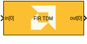
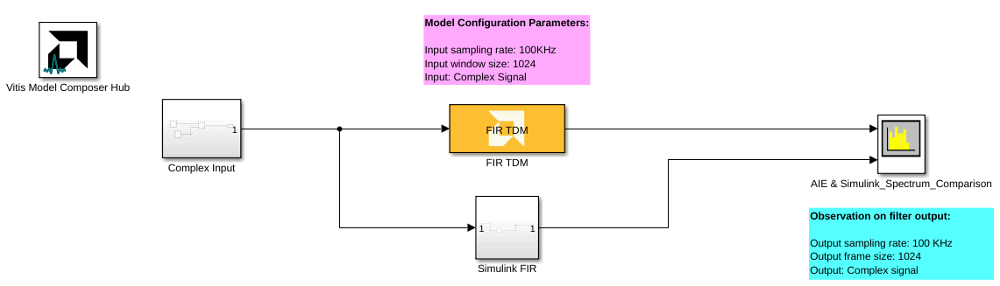

# FIR TDM
Time-Division Multiplexing FIR Filter for AI Engines.
  
  

## Library

AI Engine/DSP/Buffer IO

## Description

Time-Division Multiplexing FIR Filter for AI Engines.

## Parameters

### Main  
#### Input/Output data type  
Set the data type of the block input and output. The data type of the input signal to the block must match this setting.

#### Filter coefficients data type  
Set the filter coefficients data type. This parameter's setting may be restricted based on the Input/Output data type. In particular, 

- Complex types are only supported when the Input/Output data type is
  also complex.
- 32-bit types are only supported when the Input/Output data type is
  also a 32-bit type.
- Filter coefficients data type must be an integer type if the
  Input/Output data type is an integer type.
- Filter coefficients data type must be a float type if the Input/Output
  data type is a float type.

#### Filter length
This field describes the number of taps (coefficients) in the filter.

#### Filter coefficients  
This field specifies the filter coefficients. 

This field must be a one-dimensional vector with length equal to the `Filter length` multipled by `Number of TDM channels`. For example, `N` coefficients for `M` channels should be specified as follows:

`[coeffs0(1), coeffs0(2), ... coeffs0(N), coeffs1(1), coeffs1(2), ... coeffs(N), ... coeffsM(1), coeffsM(2), ... coeffsM(N)]`

You could also define the coefficients as an array variable in the MATLAB workspace and specify the variable name in this field.

#### Scale output down by 2^  
Sets the power of 2 shift down applied to the accumulator of FIR before output. It must be in the range 0 to 61 inclusive.

#### Rounding mode
Describes the selection of rounding to be applied during the shift down stage of processing.

The following modes are available:
* **Floor:** Truncate LSB, always round down (towards negative infinity).
* **Ceiling:** Always round up (towards positive infinity).
* **Round to positive infinity:** Round halfway towards positive infinity.
* **Round to negative infinity:** Round halfway towards negative infinity.
* **Round symmetrical to infinity:** Round halfway towards infinity (away from zero).
* **Round symmetrical to zero:** Round halfway towards zero (away from infinity).
* **Round convergent to even:** Round halfway towards nearest even number.
* **Round convergent to odd:** Round halfway towards nearest odd number.

No rounding is performed on the **Floor** or **Ceiling** modes. Other modes round to the nearest integer. They differ only in how they round for values that are exactly between two integers.

#### Input window size (Number of samples)  
Describes the number of samples used as an input to the filter function.
Because this is a single rate filter, the number of samples in the output window will match the size of the input window. This must be in the range of 4 to 8192 inclusive. 

#### Number of TDM channels 
Describes the number of Time-Division Multiplexed (TDM) channels processed by the FIR.

Each kernel requires storage for all taps and all channels it is required to operate on.

#### Saturation mode
Describes the selection of saturation to be applied during the shift down stage of processing.

The following modes are available:
* **None:** No saturation is performed and the value is truncated on the MSB side.
* **Asymmetric:** Rounds an n-bit signed value in the range `-2^(n-1)` to `2^(n-1)-1`.
* **Symmetric:** Rounds an n-bit signed value in the range `-2^(n-1)-1` to `2^(n-1)-1`.

### Constraints
Click on the button given here to access the constraint manager and add or update constraints for each kernel. If you set the "Number of cascade stages" parameter to a value greater than one, multiple kernels will be used to process the input. You can use the constraint manager to optimize the performance of your design by setting specific constraints for each kernel (in this case, you need to first run your design). Adding constraints will not affect the functional simulation in Simulink. Constraints will only affect the generated graph code, cycle approximate AIE simulation (System C), and behavior in hardware.

If you are using non-default constraints for any of the kernels for the block, an asterisk (*) will be displayed next to the button.

## Examples

***Click on the images below to open each model.***

### References
This block uses the Vitis DSP library implementation of a TDM FIR filter. For more details on this implementation please click [here](https://docs.xilinx.com/r/en-US/Vitis_Libraries/dsp/user_guide/L2/func-fir-filters.html).

--------------
Copyright (C) 2024 Advanced Micro Devices, Inc.
All rights reserved.

SPDX-License-Identifier: MIT
