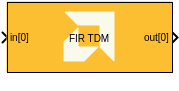
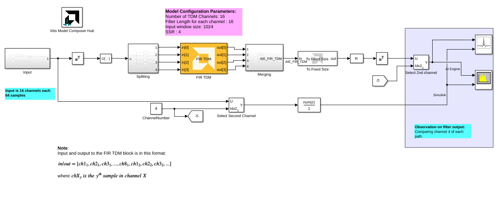
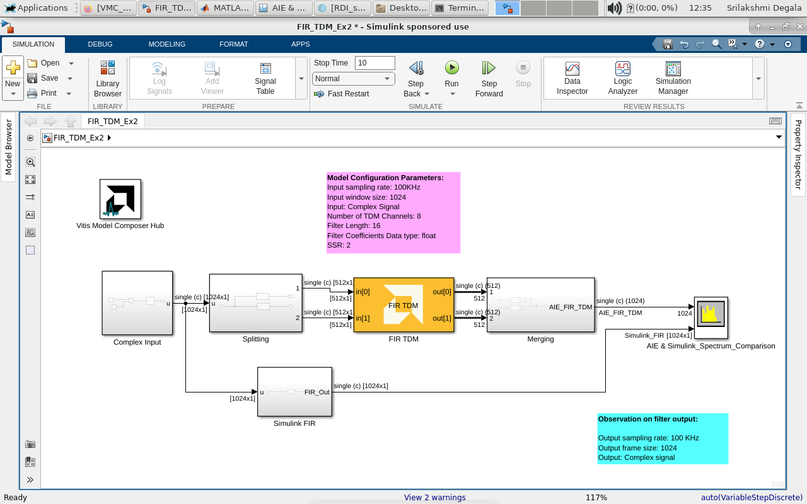

<!-- Library: aieDSP -->

# FIR TDM
Time-Division Multiplexing FIR Filter for AI Engines
  
  

## Library

AI Engine/DSP/Buffer IO

## Description

Time-Division Multiplexing FIR Filter for AI Engines

## Input Data Samples - Organization

Input Data Samples to this filter must be in Time-Division Multiplexed (TDM) format.

For example, for a 4-channel FIR TDM, 

channel 1 data: k1,k2,....,kn-1,kn

channel 2 data: x1,x2,....,xn-1,xn

channel 3 data: y1,y2,....,yn-1,yn

channel 4 data: z1,z2,....,zn-1,zn

where 'n' represents the input window size divided by the number of channels. 

Then the input data stream would be ordered as: 

k1, x1, y1, z1, k2, x2, y2, z2, ......., kn-1, xn-1, yn-1, zn-1, kn, xn, yn, zn

In Simulink, you can also arrange the input as a matrix where the rows represent each channel's input. In this example, the matrix would have a size of 4xN.

When SSR > 1, this input data stream further split over multiple ports where each successive input sample is sent to a different input port in a round-robin fashion:

For example, SSR = 2 and 4-channel FIR TDM input array organization is explained in the figure below:

  

FIR TDM output data will be formatted in the same way.

## Parameters

### Main  
#### Input data type  
Set the data type of the block input. The data type of the input signal to the block must match this setting. Valid types are `cint16`, `cint32`, `cfloat`.

#### Output data type
Set the data type of the block output. Valid types are `cint16`, `cint32`, `cfloat`.

#### Filter coefficients data type  
Set the filter coefficients data type. This parameter's setting may be restricted based on the Input/Output data type. In particular, 

- Complex types are only supported when the Input/Output data type is
  also complex.
- 32-bit types are only supported when the Input/Output data type is
  also a 32-bit type.
- Filter coefficients data type must be an integer type if the
  Input/Output data type is an integer type.
- Filter coefficients data type must be a float type if the Input/Output
  data type is a float type.

#### Filter length
This field describes the number of taps (coefficients) in the filter.

#### Filter coefficients  
This field specifies the filter coefficients. 

Specify the coefficients as an NxM matrix, where `N` is the filter length and `M` is the number of TDM channels. 
For example, if filter length is 4 and number of TDM channels is 8 then the coefficient matrix would look like below:

 

Where each element `Cnm` represents a 'n-th' coefficient for a 'm-th' TDM channel.               

You could also define the coefficients as a variable in the MATLAB workspace and specify the variable name in this field.

#### Scale output down by 2^  
Sets the power of 2 shift down applied to the accumulator of FIR before output. It must be in the range of 0 to 61 inclusive.

#### Rounding mode
Describes the selection of rounding to be applied during the shift down stage of processing.

The following modes are available:
* **Floor:** Truncate LSB, always round down (towards negative infinity).
* **Ceiling:** Always round up (towards positive infinity).
* **Round to positive infinity:** Round halfway towards positive infinity.
* **Round to negative infinity:** Round halfway towards negative infinity.
* **Round symmetrical to infinity:** Round halfway towards infinity (away from zero).
* **Round symmetrical to zero:** Round halfway towards zero (away from infinity).
* **Round convergent to even:** Round halfway towards nearest even number.
* **Round convergent to odd:** Round halfway towards nearest odd number.

No rounding is performed on the **Floor** or **Ceiling** modes. Other modes round to the nearest integer. They differ only in how they round for values that are exactly between two integers.

#### Input window size (Number of samples)  
Describes the total number of samples (across all channels) used as an input to the filter function.

The number of input samples per channel is equal to this parameter, divided by the number of TDM channels.

#### Number of TDM channels 
Describes the number of Time-Division Multiplexed (TDM) channels processed by the FIR.

#### Saturation mode
Describes the selection of saturation to be applied during the shift down stage of processing.

The following modes are available:
* **None:** No saturation is performed and the value is truncated on the MSB side.
* **Asymmetric:** Rounds an n-bit signed value in the range `-2^(n-1)` to `2^(n-1)-1`.
* **Symmetric:** Rounds an n-bit signed value in the range `-2^(n-1)-1` to `2^(n-1)-1`.

#### Number of cascade stages  

This determines the number of kernels the FIR will be divided over to improve throughput.
For example, a 32 tap FIR split over 4 cascaded kernels will result in each operating on 8 taps.

#### SSR 

This parameter specifies the number of input (or output) paths and must
be of the form 2N, where N is a non-negative integer.
When a Super Sample Rate operation is used, then the input data channel must be split over multiple ports where each successive input sample is sent to a different input port in a round-robin fashion.

For example, for a input data stream that looks like: X = 1, 2, 3, 4, 5, 6, 7, 8, 9, ..., with an SSR parameter set to 2, input samples should be split over two ports accordingly:

In[1] = 1, 3, 5, 7, 9,...
In[2] = 2, 4, 6, 8, 10,...

The output data will be produced in the same way.

### Constraints
Click on the button given here to access the constraint manager and add or update constraints for each kernel. If you set the "Number of cascade stages" parameter to a value greater than one, multiple kernels will be used to process the input. You can use the constraint manager to optimize the performance of your design by setting specific constraints for each kernel (in this case, you need to first run your design). Adding constraints will not affect the functional simulation in Simulink. Constraints will only affect the generated graph code, cycle approximate AIE simulation (System C), and behavior in hardware.

If you are using non-default constraints for any of the kernels for the block, an asterisk (*) will be displayed next to the button.

## Examples

***Click on the images below to open each model.***

<!--
DESCRIPTION:
Model: FIR_TDM_Ex1
Generated: 09-Jan-2026 13:45:05

Vitis Model Composer Configuration:
  Target Device: xcvc1902-vsva2197-1LP-e-S

Vitis Model Composer Blocks:
  - AIE: FIR TDM
  - AIE: To Fixed Size

Description:
This MATLAB script creates a Vitis Model Composer Simulink model that uses the AI Engine FIR TDM block.  and the output is visualized for analysis.

-->

<!--
MATLAB CREATION SCRIPT:

% create_FIR_TDM_Ex1_model.m
% Auto-generated script to recreate the FIR_TDM_Ex1 Simulink model
% Generated on: 09-Jan-2026 13:45:05

%% Model Configuration
modelName = 'FIR_TDM_Ex1_recreated';

%% Create New Model
if bdIsLoaded(modelName)
    close_system(modelName, 0);
end

new_system(modelName);
open_system(modelName);
fprintf('Created new model: %s\n', modelName);

%% Add Vitis Model Composer Hub Block
hubBlockPath = [modelName '/Vitis Model Composer Hub'];
add_block('vmcUtilities/Vitis Model Composer Hub', hubBlockPath, ...
    'Position', [-118 -207 -63 -154]);

hubBlk = xmcFindHubBlock(modelName);
vmchub_set_param(hubBlk, modelName, 'SelectHardware', 'xcvc1902-vsva2197-1LP-e-S');

%% Add Top-Level Blocks
add_block('built-in/SpectrumAnalyzer', [modelName '/AIE_Simulink_TDMFIR_Spectrum'], ...
    'Position', [995 -23 1040 28]);
set_param([modelName '/AIE_Simulink_TDMFIR_Spectrum'], ...
    'NumInputPorts', '2', ...
    'OpenAtSimulationStart', 'on', ...
    'WindowPosition', '[247.000000,29.000000,936.000000,716.000000,]', ...
    'InputDomain', 'Time', ...
    'SpectrumType', 'Power', ...
    'ViewType', 'Spectrum', ...
    'Method', 'Filter bank', ...
    'SampleRateSource', 'Inherited', ...
    'SampleRate', '10000', ...
    'PlotAsTwoSidedSpectrum', 'on', ...
    'FrequencyScale', 'Linear', ...
    'PlotType', 'Line', ...
    'AxesScaling', 'Auto', ...
    'AxesScalingNumUpdates', '100', ...
    'FrequencyResolutionMethod', 'RBW', ...
    'RBWSource', 'Auto', ...
    'RBW', '9.76', ...
    'WindowInvariantSamplesPerUpdate', 'off', ...
    'WindowLength', '1024', ...
    'FFTLengthSource', 'Auto', ...
    'FFTLength', '1024', ...
    'FilterSharpness', '0.3', ...
    'FrequencySpan', 'Full', ...
    'Span', '12499.999999999998', ...
    'CenterFrequency', '0', ...
    'StartFrequency', '-6249.999999999999', ...
    'StopFrequency', '6249.999999999999', ...
    'InputUnits', 'dBm', ...
    'FrequencyVectorSource', 'Auto', ...
    'FrequencyVector', '[-5000,5000]', ...
    'Window', 'Hann', ...
    'CustomWindow', 'hann', ...
    'SidelobeAttenuation', '60', ...
    'OverlapPercent', '0', ...
    'AveragingMethod', 'VBW', ...
    'SpectralAverages', '1', ...
    'ForgettingFactor', '0.9', ...
    'VBWSource', 'Auto', ...
    'VBW', '9.76', ...
    'SpectrumUnits', 'dBm', ...
    'FullScaleSource', 'Auto', ...
    'FullScale', '1', ...
    'ReferenceLoad', '1', ...
    'FrequencyOffset', '0', ...
    'SpectrogramChannel', '1', ...
    'TimeResolutionSource', 'Auto', ...
    'TimeResolution', '1e-3', ...
    'TimeSpanSource', 'Auto', ...
    'TimeSpan', '0.1', ...
    'MaximizeAxes', 'Auto', ...
    'PlotNormalTrace', 'on', ...
    'PlotMaxHoldTrace', 'off', ...
    'PlotMinHoldTrace', 'off', ...
    'YLimits', '[-89.98012941,-27.59367976]', ...
    'ColorLimits', '[-80,20]', ...
    'Colormap', 'jet', ...
    'ShowGrid', 'on', ...
    'ShowLegend', 'on', ...
    'ShowColorbar', 'on', ...
    'ChannelNames', '[]', ...
    'AxesLayout', 'Vertical');
add_block('built-in/Sum', [modelName '/Add'], ...
    'Position', [930 -138 960 -107]);
set_param([modelName '/Add'], ...
    'IconShape', 'rectangular', ...
    'Inputs', '+-', ...
    'CollapseMode', 'All dimensions', ...
    'CollapseDim', '1', ...
    'OutMin', '[]', ...
    'OutMax', '[]', ...
    'OutDataTypeStr', 'Inherit: Inherit via internal rule', ...
    'AccumDataTypeStr', 'Inherit: Inherit via internal rule', ...
    'InputSameDT', 'off', ...
    'LockScale', 'off', ...
    'RndMeth', 'Floor', ...
    'SaturateOnIntegerOverflow', 'off', ...
    'SampleTime', '-1');
add_block('built-in/Constant', [modelName '/ChannelNumber'], ...
    'Position', [120 50 150 80]);
set_param([modelName '/ChannelNumber'], ...
    'Value', '15', ...
    'VectorParams1D', 'on', ...
    'OutMin', '[]', ...
    'OutMax', '[]', ...
    'OutDataTypeStr', 'uint16', ...
    'LockScale', 'off', ...
    'SampleTime', '-1', ...
    'FramePeriod', 'inf');
add_block('built-in/Constant', [modelName '/Constant1'], ...
    'Position', [220 125 250 155]);
set_param([modelName '/Constant1'], ...
    'Value', '(filters.'')', ...
    'VectorParams1D', 'on', ...
    'OutMin', '[]', ...
    'OutMax', '[]', ...
    'OutDataTypeStr', 'single', ...
    'LockScale', 'off', ...
    'SampleTime', '-1', ...
    'FramePeriod', 'inf');
add_block('built-in/ArrayPlot', [modelName '/Difference'], ...
    'Position', [995 -146 1040 -94]);
set_param([modelName '/Difference'], ...
    'NumInputPorts', '1', ...
    'OpenAtSimulationStart', 'on', ...
    'WindowPosition', '[375.000000,26.000000,800.000000,500.000000,]', ...
    'XDataMode', 'Custom', ...
    'SampleIncrement', '1', ...
    'XOffset', '[-0.5 0.5]', ...
    'CustomXData', '[]', ...
    'XScale', 'Linear', ...
    'YScale', 'Linear', ...
    'PlotType', 'Line', ...
    'PlotBaseValue', '0', ...
    'AxesScaling', 'Manual', ...
    'AxesScalingNumUpdates', '100', ...
    'MaximizeAxes', 'Auto', ...
    'LayoutDimensions', '[1,1]', ...
    'ActiveDisplay', '1', ...
    'PlotAsMagnitudePhase', 'off', ...
    'YLabel', 'Amplitude', ...
    'YLimits', '[-0.5 0.5]', ...
    'ShowGrid', 'on', ...
    'ShowLegend', 'on', ...
    'ChannelNames', '[]');
add_block('built-in/DiscreteFir', [modelName '/Discrete FIR Filter'], ...
    'Position', [510 46 570 84]);
set_param([modelName '/Discrete FIR Filter'], ...
    'CoefSource', 'Input port', ...
    'FilterStructure', 'Direct form', ...
    'Coefficients', 'filters(1,:)', ...
    'InputProcessing', 'Columns as channels (frame based)', ...
    'ExternalReset', 'None', ...
    'ShowEnablePort', 'off', ...
    'InitialStates', '0', ...
    'SampleTime', '-1', ...
    'CoefMin', '[]', ...
    'CoefMax', '[]', ...
    'OutMin', '[]', ...
    'OutMax', '[]', ...
    'TapSumDataTypeStr', 'Inherit: Same as input', ...
    'CoefDataTypeStr', 'Inherit: Same word length as input', ...
    'ProductDataTypeStr', 'Inherit: Inherit via internal rule', ...
    'AccumDataTypeStr', 'Inherit: Inherit via internal rule', ...
    'StateDataTypeStr', 'Inherit: Same as accumulator', ...
    'OutDataTypeStr', 'Inherit: Same as accumulator', ...
    'LockScale', 'off', ...
    'RndMeth', 'Round', ...
    'SaturateOnIntegerOverflow', 'off', ...
    'StateMustResolveToSignalObject', 'off', ...
    'StateStorageClass', 'Auto');
add_block('aieDSP/FIR TDM', [modelName '/FIR TDM'], ...
    'Position', [200 -111 325 -29]);
set_param([modelName '/FIR TDM'], ...
    'data_type', 'cfloat', ...
    'data_out_type', 'cfloat', ...
    'coef_type', 'cfloat', ...
    'use_coeff_reload', 'off', ...
    'fir_length', 'FilterLength', ...
    'coeff', '(filters.'')', ...
    'shift_val', '0', ...
    'rnd_mode', 'Floor', ...
    'input_window_size', 'SamplesPerChannel*NumOf_TDM_Channels', ...
    'tdm_channels', 'NumOf_TDM_Channels', ...
    'sat_mode', '1-Asymmetric', ...
    'casc_length', '1', ...
    'ssr', '4', ...
    'TP_API', '0', ...
    'dual_ip', '0', ...
    'TP_NUM_OUTPUTS', '0');
add_block('built-in/From', [modelName '/From'], ...
    'Position', [655 -27 755 7]);
set_param([modelName '/From'], ...
    'GotoTag', 'Channel_Number', ...
    'IconDisplay', 'Tag');
add_block('built-in/Goto', [modelName '/Goto'], ...
    'Position', [200 220 295 250]);
set_param([modelName '/Goto'], ...
    'GotoTag', 'Channel_Number', ...
    'IconDisplay', 'Tag', ...
    'TagVisibility', 'global');
add_block('built-in/Reshape', [modelName '/Reshape'], ...
    'Position', [420 138 450 162]);
set_param([modelName '/Reshape'], ...
    'OutputDimensionality', 'Row vector (2-D)', ...
    'OutputDimensions', '[1,1]');
add_block('built-in/Reshape', [modelName '/Reshape1'], ...
    'Position', [655 -82 690 -58]);
set_param([modelName '/Reshape1'], ...
    'OutputDimensionality', 'Customize', ...
    'OutputDimensions', '[NumOf_TDM_Channels,SamplesPerChannel]');
add_block('built-in/Reshape', [modelName '/Reshape3'], ...
    'Position', [-15 -82 15 -58]);
set_param([modelName '/Reshape3'], ...
    'OutputDimensionality', '1-D array', ...
    'OutputDimensions', '[1,1]');
add_block('built-in/Selector', [modelName '/Select AIE Channel'], ...
    'Position', [825 -79 865 -41]);
set_param([modelName '/Select AIE Channel'], ...
    'NumberOfDimensions', '2', ...
    'IndexMode', 'One-based', ...
    'InputPortWidth', '3', ...
    'SampleTime', '-1', ...
    'IndexOptions', 'Select all,Index vector (port)', ...
    'Indices', '3,[16]', ...
    'OutputSizes', '1,1', ...
    'RuntimeRangeChecks', 'off');
add_block('built-in/Selector', [modelName '/Select Coefficients'], ...
    'Position', [330 131 370 169]);
set_param([modelName '/Select Coefficients'], ...
    'NumberOfDimensions', '2', ...
    'IndexMode', 'One-based', ...
    'InputPortWidth', '3', ...
    'SampleTime', '-1', ...
    'IndexOptions', 'Select all,Index vector (port)', ...
    'Indices', '3,[16]', ...
    'OutputSizes', '1,1', ...
    'RuntimeRangeChecks', 'off');
add_block('built-in/Selector', [modelName '/Select Simulink Channel'], ...
    'Position', [330 36 370 74]);
set_param([modelName '/Select Simulink Channel'], ...
    'NumberOfDimensions', '2', ...
    'IndexMode', 'One-based', ...
    'InputPortWidth', '3', ...
    'SampleTime', '-1', ...
    'IndexOptions', 'Select all,Index vector (port)', ...
    'Indices', '3,[16]', ...
    'OutputSizes', '1,1', ...
    'RuntimeRangeChecks', 'off');
add_block('aieUtilities/To Fixed Size', [modelName '/To Fixed Size'], ...
    'Position', [515 -89 620 -51]);
set_param([modelName '/To Fixed Size'], ...
    'Mode', 'Stop simulation when input variable-size signal is not full', ...
    'OutputSize', 'Inherit: Same as input', ...
    'CopyMethod', 'Buffer samples to form output', ...
    'HasStatusOutput', 'on');
add_block('built-in/Math', [modelName '/Transpose'], ...
    'Position', [725 -86 755 -54]);
set_param([modelName '/Transpose'], ...
    'Operator', 'transpose', ...
    'AlgorithmMethod', 'Exact', ...
    'SignedPower', 'off', ...
    'OutputSignalType', 'auto', ...
    'SampleTime', '-1', ...
    'OutMin', '[]', ...
    'OutMax', '[]', ...
    'OutDataTypeStr', 'Inherit: Same as first input', ...
    'LockScale', 'off', ...
    'RndMeth', 'Floor', ...
    'SaturateOnIntegerOverflow', 'on', ...
    'IntermediateResultsDataTypeStr', 'Inherit: Inherit via internal rule', ...
    'AlgorithmType', 'Newton-Raphson', ...
    'Iterations', '3');
add_block('built-in/Math', [modelName '/Transpose1'], ...
    'Position', [-80 -86 -50 -54]);
set_param([modelName '/Transpose1'], ...
    'Operator', 'transpose', ...
    'AlgorithmMethod', 'Exact', ...
    'SignedPower', 'off', ...
    'OutputSignalType', 'auto', ...
    'SampleTime', '-1', ...
    'OutMin', '[]', ...
    'OutMax', '[]', ...
    'OutDataTypeStr', 'Inherit: Same as first input', ...
    'LockScale', 'off', ...
    'RndMeth', 'Floor', ...
    'SaturateOnIntegerOverflow', 'on', ...
    'IntermediateResultsDataTypeStr', 'Inherit: Inherit via internal rule', ...
    'AlgorithmType', 'Newton-Raphson', ...
    'Iterations', '3');
add_block('vmcUtilities/Vitis Model Composer Hub', [modelName '/Vitis Model Composer Hub'], ...
    'Position', [-118 -207 -63 -154]);
set_param([modelName '/Vitis Model Composer Hub'], ...
    'CodeGeneration', 'off', ...
    'StartColumn', '1', ...
    'NumberOfColumns', '1', ...
    'TargetDirectory', './code', ...
    'exportDesign', 'off', ...
    'analyzeDesign', 'off', ...
    'validateDesignOnHw', 'off', ...
    'ExportType', 'AI Engines', ...
    'IpVendor', 'xilinx.com', ...
    'IpLibrary', 'hls', ...
    'IpVersion', '1.0', ...
    'IpHWLanguage', 'Verilog', ...
    'AieCompilerOptions', '{}', ...
    'CreateTestbench', 'off', ...
    'TestbenchStackSize', '10', ...
    'RunRtlSim', 'off', ...
    'RunCSim', 'off', ...
    'RunAieSim', 'off', ...
    'AieSimTimeout', '50000', ...
    'RunAieSimProfiling', 'off', ...
    'LaunchVitisAnalyzer', 'off', ...
    'PlotOutput', 'off', ...
    'GenHwImage', 'off', ...
    'GenLibadfXo', 'off', ...
    'GenHwValidationCode', 'off', ...
    'PlatformType', 'Not Specified', ...
    'HwSystemType', 'Baremetal', ...
    'HwValidationTarget', 'hw', ...
    'ProjDevice', 'xcvc1902-vsva2197-1LP-e-S', ...
    'SamplePeriod', '-1', ...
    'ClockFrequency', '200', ...
    'DataPathParallelism', '1', ...
    'xilinxfamily', 'versalaicore', ...
    'part', 'xcvc1902', ...
    'speed', '-1LP-e-S', ...
    'package', 'vsva2197', ...
    'directory', './netlist', ...
    'testbench', 'off', ...
    'incr_netlist', 'off', ...
    'synthesis_tool', 'Vivado', ...
    'clock_wrapper', 'Clock Enables', ...
    'dbl_ovrd', 'According to Block Masks', ...
    'dcm_input_clock_period', '10', ...
    'sysclk_period', '10', ...
    'simulink_period', '1', ...
    'eval_field', '0', ...
    'LogFileName', '''''', ...
    'NThreads', '4');

%% Create Input Subsystem
add_block('built-in/SubSystem', [modelName '/Input'], ...
    'Position', [-270 -97 -150 -43]);

% Remove default blocks
defaultBlocks = find_system([modelName '/Input'], 'SearchDepth', 1, 'Type', 'block');
for i = 1:length(defaultBlocks)
    if ~strcmp(defaultBlocks{i}, [modelName '/Input'])
        delete_block(defaultBlocks{i});
    end
end

add_block('built-in/ManualSwitch', [[modelName '/Input'] '/Manual Switch'], ...
    'Position', [120 32 150 68]);
set_param([[modelName '/Input'] '/Manual Switch'], ...
    'varsize', 'off', ...
    'SampleTime', '-1');
add_block('dspobslib/Random Source', [[modelName '/Input'] '/Random Source'], ...
    'Position', [-310 123 -260 177]);
set_param([[modelName '/Input'] '/Random Source'], ...
    'SrcType', 'Gaussian', ...
    'NormMethod', 'Ziggurat', ...
    'CltLength', '12', ...
    'MinVal', '0', ...
    'MaxVal', '1', ...
    'MeanVal', '0', ...
    'VarVal', '1e-4', ...
    'RepMode', 'Specify seed', ...
    'rawSeed', '1', ...
    'IsInherit', 'off', ...
    'SampMode', 'Discrete', ...
    'SampTime', '1/100e3', ...
    'SampFrame', 'SamplesPerChannel*NumOf_TDM_Channels', ...
    'DataType', 'Single', ...
    'OutComplex', 'Complex', ...
    'OutputFrames', 'on');
add_block('built-in/Reshape', [[modelName '/Input'] '/Reshape'], ...
    'Position', [-110 138 -60 162]);
set_param([[modelName '/Input'] '/Reshape'], ...
    'OutputDimensionality', 'Customize', ...
    'OutputDimensions', '[SamplesPerChannel,NumOf_TDM_Channels]');
add_block('built-in/Reshape', [[modelName '/Input'] '/Reshape1'], ...
    'Position', [-110 28 -60 52]);
set_param([[modelName '/Input'] '/Reshape1'], ...
    'OutputDimensionality', 'Customize', ...
    'OutputDimensions', '[NumOf_TDM_Channels,SamplesPerChannel]');
add_block('dspsrcs4/Signal From Workspace', [[modelName '/Input'] '/Signal From Workspace'], ...
    'Position', [-355 23 -185 57]);
set_param([[modelName '/Input'] '/Signal From Workspace'], ...
    'X', 'single(complex(ones(1,NumOf_TDM_Channels)))', ...
    'Ts', '1/100e3', ...
    'nsamps', 'SamplesPerChannel*NumOf_TDM_Channels', ...
    'OutputAfterFinalValue', 'Setting to zero', ...
    'ignoreOrWarnInputAndFrameLengths', 'off', ...
    'OutputFrames', 'off');
add_block('built-in/Math', [[modelName '/Input'] '/Transpose1'], ...
    'Position', [15 24 45 56]);
set_param([[modelName '/Input'] '/Transpose1'], ...
    'Operator', 'transpose', ...
    'AlgorithmMethod', 'Exact', ...
    'SignedPower', 'off', ...
    'OutputSignalType', 'auto', ...
    'SampleTime', '-1', ...
    'OutMin', '[]', ...
    'OutMax', '[]', ...
    'OutDataTypeStr', 'Inherit: Same as first input', ...
    'LockScale', 'off', ...
    'RndMeth', 'Floor', ...
    'SaturateOnIntegerOverflow', 'on', ...
    'IntermediateResultsDataTypeStr', 'Inherit: Inherit via internal rule', ...
    'AlgorithmType', 'Newton-Raphson', ...
    'Iterations', '3');
add_block('built-in/Outport', [[modelName '/Input'] '/Out1'], ...
    'Position', [390 43 420 57]);
set_param([[modelName '/Input'] '/Out1'], ...
    'Port', '1', ...
    'StorageClass', 'Auto', ...
    'IconDisplay', 'Port number', ...
    'OutputFunctionCall', 'off', ...
    'OutMin', '[]', ...
    'OutMax', '[]', ...
    'OutDataTypeStr', 'Inherit: auto', ...
    'LockScale', 'off', ...
    'BusOutputAsStruct', 'off', ...
    'BusVirtuality', 'inherit', ...
    'DataMode', 'inherit', ...
    'Unit', 'inherit', ...
    'PortDimensions', '-1', ...
    'VarSizeSig', 'Inherit', ...
    'SampleTime', '-1', ...
    'SignalType', 'auto', ...
    'EnsureOutportIsVirtual', 'off', ...
    'OutputWhenDisabled', 'held', ...
    'InitialOutput', '[]', ...
    'MustResolveToSignalObject', 'off', ...
    'OutputWhenUnConnected', 'off', ...
    'OutputWhenUnconnectedValue', '0', ...
    'VectorParamsAs1DForOutWhenUnconnected', 'on');

% Connect blocks in Input
add_line([modelName '/Input'], 'Transpose1/2', 'Manual Switch/2', 'autorouting', 'on');
add_line([modelName '/Input'], 'Reshape1/2', 'Transpose1/2', 'autorouting', 'on');
add_line([modelName '/Input'], 'Reshape/2', 'Manual Switch/3', 'autorouting', 'on');
add_line([modelName '/Input'], 'Signal From Workspace/2', 'Reshape1/2', 'autorouting', 'on');
add_line([modelName '/Input'], 'Random Source/2', 'Reshape/2', 'autorouting', 'on');
add_line([modelName '/Input'], 'Manual Switch/2', 'Out1/2', 'autorouting', 'on');

%% Create Merging Subsystem
add_block('built-in/SubSystem', [modelName '/Merging'], ...
    'Position', [375 -108 475 -37]);

% Remove default blocks
defaultBlocks = find_system([modelName '/Merging'], 'SearchDepth', 1, 'Type', 'block');
for i = 1:length(defaultBlocks)
    if ~strcmp(defaultBlocks{i}, [modelName '/Merging'])
        delete_block(defaultBlocks{i});
    end
end

add_block('built-in/Inport', [[modelName '/Merging'] '/In1'], ...
    'Position', [30 28 60 42]);
set_param([[modelName '/Merging'] '/In1'], ...
    'Port', '1', ...
    'IconDisplay', 'Port number', ...
    'OutputFunctionCall', 'off', ...
    'OutMin', '[]', ...
    'OutMax', '[]', ...
    'OutDataTypeStr', 'Inherit: auto', ...
    'LockScale', 'off', ...
    'BusOutputAsStruct', 'off', ...
    'BusVirtuality', 'inherit', ...
    'Unit', 'inherit', ...
    'PortDimensions', '-1', ...
    'VarSizeSig', 'Inherit', ...
    'SampleTime', '-1', ...
    'SignalType', 'auto', ...
    'LatchByDelayingOutsideSignal', 'off', ...
    'LatchInputForFeedbackSignals', 'off', ...
    'Interpolate', 'on', ...
    'DataMode', 'inherit', ...
    'MessageQueueUseDefaultAttributes', 'on', ...
    'MessageQueueCapacity', '1', ...
    'MessageQueueType', 'LIFO', ...
    'MessageQueueOverwriting', 'on');
add_block('built-in/Inport', [[modelName '/Merging'] '/In2'], ...
    'Position', [30 118 60 132]);
set_param([[modelName '/Merging'] '/In2'], ...
    'Port', '2', ...
    'IconDisplay', 'Port number', ...
    'OutputFunctionCall', 'off', ...
    'OutMin', '[]', ...
    'OutMax', '[]', ...
    'OutDataTypeStr', 'Inherit: auto', ...
    'LockScale', 'off', ...
    'BusOutputAsStruct', 'off', ...
    'BusVirtuality', 'inherit', ...
    'Unit', 'inherit', ...
    'PortDimensions', '-1', ...
    'VarSizeSig', 'Inherit', ...
    'SampleTime', '-1', ...
    'SignalType', 'auto', ...
    'LatchByDelayingOutsideSignal', 'off', ...
    'LatchInputForFeedbackSignals', 'off', ...
    'Interpolate', 'on', ...
    'DataMode', 'inherit', ...
    'MessageQueueUseDefaultAttributes', 'on', ...
    'MessageQueueCapacity', '1', ...
    'MessageQueueType', 'LIFO', ...
    'MessageQueueOverwriting', 'on');
add_block('built-in/Inport', [[modelName '/Merging'] '/In3'], ...
    'Position', [30 208 60 222]);
set_param([[modelName '/Merging'] '/In3'], ...
    'Port', '3', ...
    'IconDisplay', 'Port number', ...
    'OutputFunctionCall', 'off', ...
    'OutMin', '[]', ...
    'OutMax', '[]', ...
    'OutDataTypeStr', 'Inherit: auto', ...
    'LockScale', 'off', ...
    'BusOutputAsStruct', 'off', ...
    'BusVirtuality', 'inherit', ...
    'Unit', 'inherit', ...
    'PortDimensions', '-1', ...
    'VarSizeSig', 'Inherit', ...
    'SampleTime', '-1', ...
    'SignalType', 'auto', ...
    'LatchByDelayingOutsideSignal', 'off', ...
    'LatchInputForFeedbackSignals', 'off', ...
    'Interpolate', 'on', ...
    'DataMode', 'inherit', ...
    'MessageQueueUseDefaultAttributes', 'on', ...
    'MessageQueueCapacity', '1', ...
    'MessageQueueType', 'LIFO', ...
    'MessageQueueOverwriting', 'on');
add_block('built-in/Inport', [[modelName '/Merging'] '/In4'], ...
    'Position', [30 298 60 312]);
set_param([[modelName '/Merging'] '/In4'], ...
    'Port', '4', ...
    'IconDisplay', 'Port number', ...
    'OutputFunctionCall', 'off', ...
    'OutMin', '[]', ...
    'OutMax', '[]', ...
    'OutDataTypeStr', 'Inherit: auto', ...
    'LockScale', 'off', ...
    'BusOutputAsStruct', 'off', ...
    'BusVirtuality', 'inherit', ...
    'Unit', 'inherit', ...
    'PortDimensions', '-1', ...
    'VarSizeSig', 'Inherit', ...
    'SampleTime', '-1', ...
    'SignalType', 'auto', ...
    'LatchByDelayingOutsideSignal', 'off', ...
    'LatchInputForFeedbackSignals', 'off', ...
    'Interpolate', 'on', ...
    'DataMode', 'inherit', ...
    'MessageQueueUseDefaultAttributes', 'on', ...
    'MessageQueueCapacity', '1', ...
    'MessageQueueType', 'LIFO', ...
    'MessageQueueOverwriting', 'on');
add_block('built-in/Mux', [[modelName '/Merging'] '/Mux'], ...
    'Position', [485 23 490 137]);
set_param([[modelName '/Merging'] '/Mux'], ...
    'Inputs', '4', ...
    'DisplayOption', 'bar');
add_block('built-in/Reshape', [[modelName '/Merging'] '/Reshape'], ...
    'Position', [585 68 615 92]);
set_param([[modelName '/Merging'] '/Reshape'], ...
    'OutputDimensionality', 'Customize', ...
    'OutputDimensions', '[256, 4]');
add_block('built-in/Reshape', [[modelName '/Merging'] '/Reshape1'], ...
    'Position', [845 68 875 92]);
set_param([[modelName '/Merging'] '/Reshape1'], ...
    'OutputDimensionality', '1-D array', ...
    'OutputDimensions', '[1, 10]');
add_block('aieUtilities/To Fixed Size', [[modelName '/Merging'] '/To Fixed Size'], ...
    'Position', [175 7 290 63]);
set_param([[modelName '/Merging'] '/To Fixed Size'], ...
    'Mode', 'Stop simulation when input variable-size signal is not full', ...
    'OutputSize', 'Inherit: Same as input', ...
    'CopyMethod', 'Buffer samples to form output', ...
    'HasStatusOutput', 'on');
add_block('aieUtilities/To Fixed Size', [[modelName '/Merging'] '/To Fixed Size1'], ...
    'Position', [175 97 290 153]);
set_param([[modelName '/Merging'] '/To Fixed Size1'], ...
    'Mode', 'Stop simulation when input variable-size signal is not full', ...
    'OutputSize', 'Inherit: Same as input', ...
    'CopyMethod', 'Buffer samples to form output', ...
    'HasStatusOutput', 'on');
add_block('aieUtilities/To Fixed Size', [[modelName '/Merging'] '/To Fixed Size2'], ...
    'Position', [175 187 290 243]);
set_param([[modelName '/Merging'] '/To Fixed Size2'], ...
    'Mode', 'Stop simulation when input variable-size signal is not full', ...
    'OutputSize', 'Inherit: Same as input', ...
    'CopyMethod', 'Buffer samples to form output', ...
    'HasStatusOutput', 'on');
add_block('aieUtilities/To Fixed Size', [[modelName '/Merging'] '/To Fixed Size3'], ...
    'Position', [175 277 290 333]);
set_param([[modelName '/Merging'] '/To Fixed Size3'], ...
    'Mode', 'Stop simulation when input variable-size signal is not full', ...
    'OutputSize', 'Inherit: Same as input', ...
    'CopyMethod', 'Buffer samples to form output', ...
    'HasStatusOutput', 'on');
add_block('built-in/Math', [[modelName '/Merging'] '/Transpose'], ...
    'Position', [730 64 760 96]);
set_param([[modelName '/Merging'] '/Transpose'], ...
    'Operator', 'transpose', ...
    'AlgorithmMethod', 'Exact', ...
    'SignedPower', 'off', ...
    'OutputSignalType', 'auto', ...
    'SampleTime', '-1', ...
    'OutMin', '[]', ...
    'OutMax', '[]', ...
    'OutDataTypeStr', 'Inherit: Same as first input', ...
    'LockScale', 'off', ...
    'RndMeth', 'Floor', ...
    'SaturateOnIntegerOverflow', 'on', ...
    'IntermediateResultsDataTypeStr', 'Inherit: Inherit via internal rule', ...
    'AlgorithmType', 'Newton-Raphson', ...
    'Iterations', '3');
add_block('built-in/Outport', [[modelName '/Merging'] '/AIE_FIR_TDM'], ...
    'Position', [1000 73 1030 87]);
set_param([[modelName '/Merging'] '/AIE_FIR_TDM'], ...
    'Port', '1', ...
    'StorageClass', 'Auto', ...
    'IconDisplay', 'Port number', ...
    'OutputFunctionCall', 'off', ...
    'OutMin', '[]', ...
    'OutMax', '[]', ...
    'OutDataTypeStr', 'Inherit: auto', ...
    'LockScale', 'off', ...
    'BusOutputAsStruct', 'off', ...
    'BusVirtuality', 'inherit', ...
    'DataMode', 'inherit', ...
    'Unit', 'inherit', ...
    'PortDimensions', '-1', ...
    'VarSizeSig', 'Inherit', ...
    'SampleTime', '-1', ...
    'SignalType', 'auto', ...
    'EnsureOutportIsVirtual', 'off', ...
    'OutputWhenDisabled', 'held', ...
    'InitialOutput', '[]', ...
    'MustResolveToSignalObject', 'off', ...
    'OutputWhenUnConnected', 'off', ...
    'OutputWhenUnconnectedValue', '0', ...
    'VectorParamsAs1DForOutWhenUnconnected', 'on');

% Connect blocks in Merging
add_line([modelName '/Merging'], 'To Fixed Size3/2', 'Mux/5', 'autorouting', 'on');
add_line([modelName '/Merging'], 'In4/2', 'To Fixed Size3/2', 'autorouting', 'on');
add_line([modelName '/Merging'], 'In3/2', 'To Fixed Size2/2', 'autorouting', 'on');
add_line([modelName '/Merging'], 'To Fixed Size2/2', 'Mux/4', 'autorouting', 'on');
add_line([modelName '/Merging'], 'In1/2', 'To Fixed Size/2', 'autorouting', 'on');
add_line([modelName '/Merging'], 'Reshape1/2', 'AIE_FIR_TDM/2', 'autorouting', 'on');
add_line([modelName '/Merging'], 'Mux/2', 'Reshape/2', 'autorouting', 'on');
add_line([modelName '/Merging'], 'To Fixed Size/2', 'Mux/2', 'autorouting', 'on');
add_line([modelName '/Merging'], 'Transpose/2', 'Reshape1/2', 'autorouting', 'on');
add_line([modelName '/Merging'], 'In2/2', 'To Fixed Size1/2', 'autorouting', 'on');
add_line([modelName '/Merging'], 'To Fixed Size1/2', 'Mux/3', 'autorouting', 'on');
add_line([modelName '/Merging'], 'Reshape/2', 'Transpose/2', 'autorouting', 'on');

%% Create round_robin Subsystem
add_block('built-in/SubSystem', [modelName '/round_robin'], ...
    'Position', [60 -109 140 -31]);

% Remove default blocks
defaultBlocks = find_system([modelName '/round_robin'], 'SearchDepth', 1, 'Type', 'block');
for i = 1:length(defaultBlocks)
    if ~strcmp(defaultBlocks{i}, [modelName '/round_robin'])
        delete_block(defaultBlocks{i});
    end
end

add_block('built-in/Inport', [[modelName '/round_robin'] '/in'], ...
    'Position', [5 93 35 107]);
set_param([[modelName '/round_robin'] '/in'], ...
    'Port', '1', ...
    'IconDisplay', 'Port number', ...
    'OutputFunctionCall', 'off', ...
    'OutMin', '[]', ...
    'OutMax', '[]', ...
    'OutDataTypeStr', 'Inherit: auto', ...
    'LockScale', 'off', ...
    'BusOutputAsStruct', 'off', ...
    'BusVirtuality', 'inherit', ...
    'Unit', 'inherit', ...
    'PortDimensions', '-1', ...
    'VarSizeSig', 'Inherit', ...
    'SampleTime', '-1', ...
    'SignalType', 'auto', ...
    'LatchByDelayingOutsideSignal', 'off', ...
    'LatchInputForFeedbackSignals', 'off', ...
    'Interpolate', 'on', ...
    'DataMode', 'inherit', ...
    'MessageQueueUseDefaultAttributes', 'on', ...
    'MessageQueueCapacity', '1', ...
    'MessageQueueType', 'LIFO', ...
    'MessageQueueOverwriting', 'on');
add_block('built-in/Selector', [[modelName '/round_robin'] '/Sample1'], ...
    'Position', [230 21 305 59]);
set_param([[modelName '/round_robin'] '/Sample1'], ...
    'NumberOfDimensions', '1', ...
    'IndexMode', 'One-based', ...
    'InputPortWidth', '1024', ...
    'SampleTime', '-1', ...
    'IndexOptions', 'Index vector (dialog)', ...
    'Indices', '1:4:1024', ...
    'OutputSizes', '1', ...
    'RuntimeRangeChecks', 'off');
add_block('built-in/Selector', [[modelName '/round_robin'] '/Sample2'], ...
    'Position', [235 81 310 119]);
set_param([[modelName '/round_robin'] '/Sample2'], ...
    'NumberOfDimensions', '1', ...
    'IndexMode', 'One-based', ...
    'InputPortWidth', '1024', ...
    'SampleTime', '-1', ...
    'IndexOptions', 'Index vector (dialog)', ...
    'Indices', '2:4:1024', ...
    'OutputSizes', '1', ...
    'RuntimeRangeChecks', 'off');
add_block('built-in/Selector', [[modelName '/round_robin'] '/Sample3'], ...
    'Position', [235 156 310 194]);
set_param([[modelName '/round_robin'] '/Sample3'], ...
    'NumberOfDimensions', '1', ...
    'IndexMode', 'One-based', ...
    'InputPortWidth', '1024', ...
    'SampleTime', '-1', ...
    'IndexOptions', 'Index vector (dialog)', ...
    'Indices', '3:4:1024', ...
    'OutputSizes', '1', ...
    'RuntimeRangeChecks', 'off');
add_block('built-in/Selector', [[modelName '/round_robin'] '/Sample4'], ...
    'Position', [240 231 315 269]);
set_param([[modelName '/round_robin'] '/Sample4'], ...
    'NumberOfDimensions', '1', ...
    'IndexMode', 'One-based', ...
    'InputPortWidth', '1024', ...
    'SampleTime', '-1', ...
    'IndexOptions', 'Index vector (dialog)', ...
    'Indices', '4:4:1024', ...
    'OutputSizes', '1', ...
    'RuntimeRangeChecks', 'off');
add_block('built-in/Outport', [[modelName '/round_robin'] '/Out1'], ...
    'Position', [420 33 450 47]);
set_param([[modelName '/round_robin'] '/Out1'], ...
    'Port', '1', ...
    'StorageClass', 'Auto', ...
    'IconDisplay', 'Port number', ...
    'OutputFunctionCall', 'off', ...
    'OutMin', '[]', ...
    'OutMax', '[]', ...
    'OutDataTypeStr', 'Inherit: auto', ...
    'LockScale', 'off', ...
    'BusOutputAsStruct', 'off', ...
    'BusVirtuality', 'inherit', ...
    'DataMode', 'inherit', ...
    'Unit', 'inherit', ...
    'PortDimensions', '-1', ...
    'VarSizeSig', 'Inherit', ...
    'SampleTime', '-1', ...
    'SignalType', 'auto', ...
    'EnsureOutportIsVirtual', 'off', ...
    'OutputWhenDisabled', 'held', ...
    'InitialOutput', '[]', ...
    'MustResolveToSignalObject', 'off', ...
    'OutputWhenUnConnected', 'off', ...
    'OutputWhenUnconnectedValue', '0', ...
    'VectorParamsAs1DForOutWhenUnconnected', 'on');
add_block('built-in/Outport', [[modelName '/round_robin'] '/Out2'], ...
    'Position', [420 93 450 107]);
set_param([[modelName '/round_robin'] '/Out2'], ...
    'Port', '2', ...
    'StorageClass', 'Auto', ...
    'IconDisplay', 'Port number', ...
    'OutputFunctionCall', 'off', ...
    'OutMin', '[]', ...
    'OutMax', '[]', ...
    'OutDataTypeStr', 'Inherit: auto', ...
    'LockScale', 'off', ...
    'BusOutputAsStruct', 'off', ...
    'BusVirtuality', 'inherit', ...
    'DataMode', 'inherit', ...
    'Unit', 'inherit', ...
    'PortDimensions', '-1', ...
    'VarSizeSig', 'Inherit', ...
    'SampleTime', '-1', ...
    'SignalType', 'auto', ...
    'EnsureOutportIsVirtual', 'off', ...
    'OutputWhenDisabled', 'held', ...
    'InitialOutput', '[]', ...
    'MustResolveToSignalObject', 'off', ...
    'OutputWhenUnConnected', 'off', ...
    'OutputWhenUnconnectedValue', '0', ...
    'VectorParamsAs1DForOutWhenUnconnected', 'on');
add_block('built-in/Outport', [[modelName '/round_robin'] '/Out3'], ...
    'Position', [420 168 450 182]);
set_param([[modelName '/round_robin'] '/Out3'], ...
    'Port', '3', ...
    'StorageClass', 'Auto', ...
    'IconDisplay', 'Port number', ...
    'OutputFunctionCall', 'off', ...
    'OutMin', '[]', ...
    'OutMax', '[]', ...
    'OutDataTypeStr', 'Inherit: auto', ...
    'LockScale', 'off', ...
    'BusOutputAsStruct', 'off', ...
    'BusVirtuality', 'inherit', ...
    'DataMode', 'inherit', ...
    'Unit', 'inherit', ...
    'PortDimensions', '-1', ...
    'VarSizeSig', 'Inherit', ...
    'SampleTime', '-1', ...
    'SignalType', 'auto', ...
    'EnsureOutportIsVirtual', 'off', ...
    'OutputWhenDisabled', 'held', ...
    'InitialOutput', '[]', ...
    'MustResolveToSignalObject', 'off', ...
    'OutputWhenUnConnected', 'off', ...
    'OutputWhenUnconnectedValue', '0', ...
    'VectorParamsAs1DForOutWhenUnconnected', 'on');
add_block('built-in/Outport', [[modelName '/round_robin'] '/Out4'], ...
    'Position', [420 243 450 257]);
set_param([[modelName '/round_robin'] '/Out4'], ...
    'Port', '4', ...
    'StorageClass', 'Auto', ...
    'IconDisplay', 'Port number', ...
    'OutputFunctionCall', 'off', ...
    'OutMin', '[]', ...
    'OutMax', '[]', ...
    'OutDataTypeStr', 'Inherit: auto', ...
    'LockScale', 'off', ...
    'BusOutputAsStruct', 'off', ...
    'BusVirtuality', 'inherit', ...
    'DataMode', 'inherit', ...
    'Unit', 'inherit', ...
    'PortDimensions', '-1', ...
    'VarSizeSig', 'Inherit', ...
    'SampleTime', '-1', ...
    'SignalType', 'auto', ...
    'EnsureOutportIsVirtual', 'off', ...
    'OutputWhenDisabled', 'held', ...
    'InitialOutput', '[]', ...
    'MustResolveToSignalObject', 'off', ...
    'OutputWhenUnConnected', 'off', ...
    'OutputWhenUnconnectedValue', '0', ...
    'VectorParamsAs1DForOutWhenUnconnected', 'on');

% Connect blocks in round_robin
add_line([modelName '/round_robin'], 'Sample4/2', 'Out4/2', 'autorouting', 'on');
add_line([modelName '/round_robin'], 'Sample3/2', 'Out3/2', 'autorouting', 'on');
add_line([modelName '/round_robin'], 'Sample1/2', 'Out1/2', 'autorouting', 'on');
add_line([modelName '/round_robin'], 'Sample2/2', 'Out2/2', 'autorouting', 'on');
add_line([modelName '/round_robin'], 'in/2', 'Sample1/2', 'autorouting', 'on');
add_line([modelName '/round_robin'], 'in/2', 'Sample2/2', 'autorouting', 'on');
add_line([modelName '/round_robin'], 'in/2', 'Sample3/2', 'autorouting', 'on');
add_line([modelName '/round_robin'], 'in/2', 'Sample4/2', 'autorouting', 'on');
add_line([modelName '/round_robin'], 'in/2', 'Sample4/2', 'autorouting', 'on');
add_line([modelName '/round_robin'], 'in/2', 'Sample4/2', 'autorouting', 'on');

%% Connect Top-Level Blocks
add_line(modelName, 'Reshape/2', 'Discrete FIR Filter/3', 'autorouting', 'on');
add_line(modelName, 'Select Coefficients/2', 'Reshape/2', 'autorouting', 'on');
add_line(modelName, 'Constant1/2', 'Select Coefficients/2', 'autorouting', 'on');
add_line(modelName, 'Add/2', 'Difference/2', 'autorouting', 'on');
add_line(modelName, 'From/2', 'Select AIE Channel/3', 'autorouting', 'on');
add_line(modelName, 'ChannelNumber/2', 'Select Simulink Channel/3', 'autorouting', 'on');
add_line(modelName, 'ChannelNumber/2', 'Goto/2', 'autorouting', 'on');
add_line(modelName, 'ChannelNumber/2', 'Select Coefficients/3', 'autorouting', 'on');
add_line(modelName, 'ChannelNumber/2', 'Select Coefficients/3', 'autorouting', 'on');
add_line(modelName, 'ChannelNumber/2', 'Select Coefficients/3', 'autorouting', 'on');
add_line(modelName, 'To Fixed Size/2', 'Reshape1/2', 'autorouting', 'on');
add_line(modelName, 'FIR TDM/5', 'Merging/5', 'autorouting', 'on');
add_line(modelName, 'FIR TDM/4', 'Merging/4', 'autorouting', 'on');
add_line(modelName, 'round_robin/5', 'FIR TDM/5', 'autorouting', 'on');
add_line(modelName, 'round_robin/4', 'FIR TDM/4', 'autorouting', 'on');
add_line(modelName, 'FIR TDM/3', 'Merging/3', 'autorouting', 'on');
add_line(modelName, 'FIR TDM/2', 'Merging/2', 'autorouting', 'on');
add_line(modelName, 'Merging/2', 'To Fixed Size/2', 'autorouting', 'on');
add_line(modelName, 'round_robin/3', 'FIR TDM/3', 'autorouting', 'on');
add_line(modelName, 'round_robin/2', 'FIR TDM/2', 'autorouting', 'on');
add_line(modelName, 'Reshape3/2', 'round_robin/2', 'autorouting', 'on');
add_line(modelName, 'Select Simulink Channel/2', 'Discrete FIR Filter/2', 'autorouting', 'on');
add_line(modelName, 'Discrete FIR Filter/2', 'AIE_Simulink_TDMFIR_Spectrum/3', 'autorouting', 'on');
add_line(modelName, 'Discrete FIR Filter/2', 'Add/3', 'autorouting', 'on');
add_line(modelName, 'Discrete FIR Filter/2', 'Add/3', 'autorouting', 'on');
add_line(modelName, 'Input/2', 'Select Simulink Channel/2', 'autorouting', 'on');
add_line(modelName, 'Input/2', 'Transpose1/2', 'autorouting', 'on');
add_line(modelName, 'Input/2', 'Transpose1/2', 'autorouting', 'on');
add_line(modelName, 'Transpose/2', 'Select AIE Channel/2', 'autorouting', 'on');
add_line(modelName, 'Transpose1/2', 'Reshape3/2', 'autorouting', 'on');
add_line(modelName, 'Select AIE Channel/2', 'AIE_Simulink_TDMFIR_Spectrum/2', 'autorouting', 'on');
add_line(modelName, 'Select AIE Channel/2', 'Add/2', 'autorouting', 'on');
add_line(modelName, 'Select AIE Channel/2', 'Add/2', 'autorouting', 'on');
add_line(modelName, 'Reshape1/2', 'Transpose/2', 'autorouting', 'on');

%% Save Model
save_system(modelName);
fprintf('\nModel saved: %s.slx\n', modelName);
-->

<!--
DESCRIPTION:
Model: FIR_TDM_Ex2
Generated: 09-Jan-2026 13:45:08

Vitis Model Composer Configuration:
  Target Device: xcvc1902-vsva2197-1LP-e-S

Vitis Model Composer Blocks:
  - AIE: FIR TDM
  - AIE: To Fixed Size

Description:
This MATLAB script creates a Vitis Model Composer Simulink model that uses the AI Engine FIR TDM block.  and the output is visualized for analysis.

-->

<!--
MATLAB CREATION SCRIPT:

% create_FIR_TDM_Ex2_model.m
% Auto-generated script to recreate the FIR_TDM_Ex2 Simulink model
% Generated on: 09-Jan-2026 13:45:08

%% Model Configuration
modelName = 'FIR_TDM_Ex2_recreated';

%% Create New Model
if bdIsLoaded(modelName)
    close_system(modelName, 0);
end

new_system(modelName);
open_system(modelName);
fprintf('Created new model: %s\n', modelName);

%% Add Vitis Model Composer Hub Block
hubBlockPath = [modelName '/Vitis Model Composer Hub'];
add_block('vmcUtilities/Vitis Model Composer Hub', hubBlockPath, ...
    'Position', [-118 -207 -63 -154]);

hubBlk = xmcFindHubBlock(modelName);
vmchub_set_param(hubBlk, modelName, 'SelectHardware', 'xcvc1902-vsva2197-1LP-e-S');

%% Add Top-Level Blocks
add_block('built-in/SpectrumAnalyzer', [modelName '/AIE_Simulink_TDMFIR_Spectrum'], ...
    'Position', [995 -23 1040 28]);
set_param([modelName '/AIE_Simulink_TDMFIR_Spectrum'], ...
    'NumInputPorts', '2', ...
    'OpenAtSimulationStart', 'on', ...
    'WindowPosition', '[247.000000,29.000000,936.000000,716.000000,]', ...
    'InputDomain', 'Time', ...
    'SpectrumType', 'Power', ...
    'ViewType', 'Spectrum', ...
    'Method', 'Filter bank', ...
    'SampleRateSource', 'Inherited', ...
    'SampleRate', '10000', ...
    'PlotAsTwoSidedSpectrum', 'on', ...
    'FrequencyScale', 'Linear', ...
    'PlotType', 'Line', ...
    'AxesScaling', 'Auto', ...
    'AxesScalingNumUpdates', '100', ...
    'FrequencyResolutionMethod', 'RBW', ...
    'RBWSource', 'Auto', ...
    'RBW', '9.76', ...
    'WindowInvariantSamplesPerUpdate', 'off', ...
    'WindowLength', '1024', ...
    'FFTLengthSource', 'Auto', ...
    'FFTLength', '1024', ...
    'FilterSharpness', '0.3', ...
    'FrequencySpan', 'Full', ...
    'Span', '12499.999999999998', ...
    'CenterFrequency', '0', ...
    'StartFrequency', '-6249.999999999999', ...
    'StopFrequency', '6249.999999999999', ...
    'InputUnits', 'dBm', ...
    'FrequencyVectorSource', 'Auto', ...
    'FrequencyVector', '[-5000,5000]', ...
    'Window', 'Hann', ...
    'CustomWindow', 'hann', ...
    'SidelobeAttenuation', '60', ...
    'OverlapPercent', '0', ...
    'AveragingMethod', 'VBW', ...
    'SpectralAverages', '1', ...
    'ForgettingFactor', '0.9', ...
    'VBWSource', 'Auto', ...
    'VBW', '9.76', ...
    'SpectrumUnits', 'dBm', ...
    'FullScaleSource', 'Auto', ...
    'FullScale', '1', ...
    'ReferenceLoad', '1', ...
    'FrequencyOffset', '0', ...
    'SpectrogramChannel', '1', ...
    'TimeResolutionSource', 'Auto', ...
    'TimeResolution', '1e-3', ...
    'TimeSpanSource', 'Auto', ...
    'TimeSpan', '0.1', ...
    'MaximizeAxes', 'Auto', ...
    'PlotNormalTrace', 'on', ...
    'PlotMaxHoldTrace', 'off', ...
    'PlotMinHoldTrace', 'off', ...
    'YLimits', '[-89.98012941,-27.59367976]', ...
    'ColorLimits', '[-80,20]', ...
    'Colormap', 'jet', ...
    'ShowGrid', 'on', ...
    'ShowLegend', 'on', ...
    'ShowColorbar', 'on', ...
    'ChannelNames', '[]', ...
    'AxesLayout', 'Vertical');
add_block('built-in/Sum', [modelName '/Add'], ...
    'Position', [930 -138 960 -107]);
set_param([modelName '/Add'], ...
    'IconShape', 'rectangular', ...
    'Inputs', '+-', ...
    'CollapseMode', 'All dimensions', ...
    'CollapseDim', '1', ...
    'OutMin', '[]', ...
    'OutMax', '[]', ...
    'OutDataTypeStr', 'Inherit: Inherit via internal rule', ...
    'AccumDataTypeStr', 'Inherit: Inherit via internal rule', ...
    'InputSameDT', 'off', ...
    'LockScale', 'off', ...
    'RndMeth', 'Floor', ...
    'SaturateOnIntegerOverflow', 'off', ...
    'SampleTime', '-1');
add_block('built-in/Constant', [modelName '/ChannelNumber'], ...
    'Position', [120 50 150 80]);
set_param([modelName '/ChannelNumber'], ...
    'Value', '8', ...
    'VectorParams1D', 'on', ...
    'OutMin', '[]', ...
    'OutMax', '[]', ...
    'OutDataTypeStr', 'uint16', ...
    'LockScale', 'off', ...
    'SampleTime', '-1', ...
    'FramePeriod', 'inf');
add_block('built-in/Constant', [modelName '/Constant1'], ...
    'Position', [220 125 250 155]);
set_param([modelName '/Constant1'], ...
    'Value', '(filters.'')', ...
    'VectorParams1D', 'on', ...
    'OutMin', '[]', ...
    'OutMax', '[]', ...
    'OutDataTypeStr', 'single', ...
    'LockScale', 'off', ...
    'SampleTime', '-1', ...
    'FramePeriod', 'inf');
add_block('built-in/ArrayPlot', [modelName '/Difference'], ...
    'Position', [995 -146 1040 -94]);
set_param([modelName '/Difference'], ...
    'NumInputPorts', '1', ...
    'OpenAtSimulationStart', 'on', ...
    'WindowPosition', '[387.000000,26.000000,800.000000,500.000000,]', ...
    'XDataMode', 'Custom', ...
    'SampleIncrement', '1', ...
    'XOffset', '[-0.5 0.5]', ...
    'CustomXData', '[]', ...
    'XScale', 'Linear', ...
    'YScale', 'Linear', ...
    'PlotType', 'Line', ...
    'PlotBaseValue', '0', ...
    'AxesScaling', 'Manual', ...
    'AxesScalingNumUpdates', '100', ...
    'MaximizeAxes', 'Auto', ...
    'LayoutDimensions', '[1,1]', ...
    'ActiveDisplay', '1', ...
    'PlotAsMagnitudePhase', 'off', ...
    'YLabel', 'Amplitude', ...
    'YLimits', '[-0.5 0.5]', ...
    'ShowGrid', 'on', ...
    'ShowLegend', 'on', ...
    'ChannelNames', '[]');
add_block('built-in/DiscreteFir', [modelName '/Discrete FIR Filter'], ...
    'Position', [510 46 570 84]);
set_param([modelName '/Discrete FIR Filter'], ...
    'CoefSource', 'Input port', ...
    'FilterStructure', 'Direct form', ...
    'Coefficients', 'filters(1,:)', ...
    'InputProcessing', 'Columns as channels (frame based)', ...
    'ExternalReset', 'None', ...
    'ShowEnablePort', 'off', ...
    'InitialStates', '0', ...
    'SampleTime', '-1', ...
    'CoefMin', '[]', ...
    'CoefMax', '[]', ...
    'OutMin', '[]', ...
    'OutMax', '[]', ...
    'TapSumDataTypeStr', 'Inherit: Same as input', ...
    'CoefDataTypeStr', 'Inherit: Same word length as input', ...
    'ProductDataTypeStr', 'Inherit: Inherit via internal rule', ...
    'AccumDataTypeStr', 'Inherit: Inherit via internal rule', ...
    'StateDataTypeStr', 'Inherit: Same as accumulator', ...
    'OutDataTypeStr', 'Inherit: Same as accumulator', ...
    'LockScale', 'off', ...
    'RndMeth', 'Round', ...
    'SaturateOnIntegerOverflow', 'off', ...
    'StateMustResolveToSignalObject', 'off', ...
    'StateStorageClass', 'Auto');
add_block('aieDSP/FIR TDM', [modelName '/FIR TDM'], ...
    'Position', [200 -111 325 -29]);
set_param([modelName '/FIR TDM'], ...
    'data_type', 'cfloat', ...
    'data_out_type', 'cfloat', ...
    'coef_type', 'cfloat', ...
    'use_coeff_reload', 'off', ...
    'fir_length', 'FilterLength', ...
    'coeff', '(filters.'')', ...
    'shift_val', '0', ...
    'rnd_mode', 'Floor', ...
    'input_window_size', 'SamplesPerChannel*NumOf_TDM_Channels', ...
    'tdm_channels', 'NumOf_TDM_Channels', ...
    'sat_mode', '1-Asymmetric', ...
    'casc_length', '1', ...
    'ssr', '2', ...
    'TP_API', '0', ...
    'dual_ip', '0', ...
    'TP_NUM_OUTPUTS', '0');
add_block('built-in/From', [modelName '/From'], ...
    'Position', [655 -27 755 7]);
set_param([modelName '/From'], ...
    'GotoTag', 'Channel_Number', ...
    'IconDisplay', 'Tag');
add_block('built-in/Goto', [modelName '/Goto'], ...
    'Position', [200 220 295 250]);
set_param([modelName '/Goto'], ...
    'GotoTag', 'Channel_Number', ...
    'IconDisplay', 'Tag', ...
    'TagVisibility', 'global');
add_block('built-in/Reshape', [modelName '/Reshape'], ...
    'Position', [420 138 450 162]);
set_param([modelName '/Reshape'], ...
    'OutputDimensionality', 'Row vector (2-D)', ...
    'OutputDimensions', '[1,1]');
add_block('built-in/Reshape', [modelName '/Reshape1'], ...
    'Position', [655 -82 690 -58]);
set_param([modelName '/Reshape1'], ...
    'OutputDimensionality', 'Customize', ...
    'OutputDimensions', '[NumOf_TDM_Channels,SamplesPerChannel]');
add_block('built-in/Reshape', [modelName '/Reshape3'], ...
    'Position', [-15 -82 15 -58]);
set_param([modelName '/Reshape3'], ...
    'OutputDimensionality', '1-D array', ...
    'OutputDimensions', '[1,1]');
add_block('built-in/Selector', [modelName '/Select AIE channel'], ...
    'Position', [825 -79 865 -41]);
set_param([modelName '/Select AIE channel'], ...
    'NumberOfDimensions', '2', ...
    'IndexMode', 'One-based', ...
    'InputPortWidth', '3', ...
    'SampleTime', '-1', ...
    'IndexOptions', 'Select all,Index vector (port)', ...
    'Indices', '3,[16]', ...
    'OutputSizes', '1,1', ...
    'RuntimeRangeChecks', 'off');
add_block('built-in/Selector', [modelName '/Select Coefficients'], ...
    'Position', [330 131 370 169]);
set_param([modelName '/Select Coefficients'], ...
    'NumberOfDimensions', '2', ...
    'IndexMode', 'One-based', ...
    'InputPortWidth', '3', ...
    'SampleTime', '-1', ...
    'IndexOptions', 'Select all,Index vector (port)', ...
    'Indices', '3,[16]', ...
    'OutputSizes', '1,1', ...
    'RuntimeRangeChecks', 'off');
add_block('built-in/Selector', [modelName '/Select Simulink Channel'], ...
    'Position', [330 36 370 74]);
set_param([modelName '/Select Simulink Channel'], ...
    'NumberOfDimensions', '2', ...
    'IndexMode', 'One-based', ...
    'InputPortWidth', '3', ...
    'SampleTime', '-1', ...
    'IndexOptions', 'Select all,Index vector (port)', ...
    'Indices', '3,[16]', ...
    'OutputSizes', '1,1', ...
    'RuntimeRangeChecks', 'off');
add_block('aieUtilities/To Fixed Size', [modelName '/To Fixed Size'], ...
    'Position', [515 -89 620 -51]);
set_param([modelName '/To Fixed Size'], ...
    'Mode', 'Stop simulation when input variable-size signal is not full', ...
    'OutputSize', 'Inherit: Same as input', ...
    'CopyMethod', 'Buffer samples to form output', ...
    'HasStatusOutput', 'on');
add_block('built-in/Math', [modelName '/Transpose'], ...
    'Position', [725 -86 755 -54]);
set_param([modelName '/Transpose'], ...
    'Operator', 'transpose', ...
    'AlgorithmMethod', 'Exact', ...
    'SignedPower', 'off', ...
    'OutputSignalType', 'auto', ...
    'SampleTime', '-1', ...
    'OutMin', '[]', ...
    'OutMax', '[]', ...
    'OutDataTypeStr', 'Inherit: Same as first input', ...
    'LockScale', 'off', ...
    'RndMeth', 'Floor', ...
    'SaturateOnIntegerOverflow', 'on', ...
    'IntermediateResultsDataTypeStr', 'Inherit: Inherit via internal rule', ...
    'AlgorithmType', 'Newton-Raphson', ...
    'Iterations', '3');
add_block('built-in/Math', [modelName '/Transpose1'], ...
    'Position', [-80 -86 -50 -54]);
set_param([modelName '/Transpose1'], ...
    'Operator', 'transpose', ...
    'AlgorithmMethod', 'Exact', ...
    'SignedPower', 'off', ...
    'OutputSignalType', 'auto', ...
    'SampleTime', '-1', ...
    'OutMin', '[]', ...
    'OutMax', '[]', ...
    'OutDataTypeStr', 'Inherit: Same as first input', ...
    'LockScale', 'off', ...
    'RndMeth', 'Floor', ...
    'SaturateOnIntegerOverflow', 'on', ...
    'IntermediateResultsDataTypeStr', 'Inherit: Inherit via internal rule', ...
    'AlgorithmType', 'Newton-Raphson', ...
    'Iterations', '3');
add_block('vmcUtilities/Vitis Model Composer Hub', [modelName '/Vitis Model Composer Hub'], ...
    'Position', [-118 -207 -63 -154]);
set_param([modelName '/Vitis Model Composer Hub'], ...
    'CodeGeneration', 'off', ...
    'StartColumn', '1', ...
    'NumberOfColumns', '1', ...
    'TargetDirectory', './code', ...
    'exportDesign', 'off', ...
    'analyzeDesign', 'off', ...
    'validateDesignOnHw', 'off', ...
    'ExportType', 'AI Engines', ...
    'IpVendor', 'xilinx.com', ...
    'IpLibrary', 'hls', ...
    'IpVersion', '1.0', ...
    'IpHWLanguage', 'Verilog', ...
    'AieCompilerOptions', '{}', ...
    'CreateTestbench', 'off', ...
    'TestbenchStackSize', '10', ...
    'RunRtlSim', 'off', ...
    'RunCSim', 'off', ...
    'RunAieSim', 'off', ...
    'AieSimTimeout', '50000', ...
    'RunAieSimProfiling', 'off', ...
    'LaunchVitisAnalyzer', 'off', ...
    'PlotOutput', 'off', ...
    'GenHwImage', 'off', ...
    'GenLibadfXo', 'off', ...
    'GenHwValidationCode', 'off', ...
    'PlatformType', 'Not Specified', ...
    'HwSystemType', 'Baremetal', ...
    'HwValidationTarget', 'hw', ...
    'ProjDevice', 'xcvc1902-vsva2197-1LP-e-S', ...
    'SamplePeriod', '-1', ...
    'ClockFrequency', '200', ...
    'DataPathParallelism', '1', ...
    'xilinxfamily', 'versalaicore', ...
    'part', 'xcvc1902', ...
    'speed', '-1LP-e-S', ...
    'package', 'vsva2197', ...
    'directory', './netlist', ...
    'testbench', 'off', ...
    'incr_netlist', 'off', ...
    'synthesis_tool', 'Vivado', ...
    'clock_wrapper', 'Clock Enables', ...
    'dbl_ovrd', 'According to Block Masks', ...
    'dcm_input_clock_period', '10', ...
    'sysclk_period', '10', ...
    'simulink_period', '1', ...
    'eval_field', '0', ...
    'LogFileName', '''''', ...
    'NThreads', '4');

%% Create Input Subsystem
add_block('built-in/SubSystem', [modelName '/Input'], ...
    'Position', [-270 -97 -150 -43]);

% Remove default blocks
defaultBlocks = find_system([modelName '/Input'], 'SearchDepth', 1, 'Type', 'block');
for i = 1:length(defaultBlocks)
    if ~strcmp(defaultBlocks{i}, [modelName '/Input'])
        delete_block(defaultBlocks{i});
    end
end

add_block('built-in/ManualSwitch', [[modelName '/Input'] '/Manual Switch'], ...
    'Position', [120 32 150 68]);
set_param([[modelName '/Input'] '/Manual Switch'], ...
    'varsize', 'off', ...
    'SampleTime', '-1');
add_block('dspobslib/Random Source', [[modelName '/Input'] '/Random Source'], ...
    'Position', [-310 123 -260 177]);
set_param([[modelName '/Input'] '/Random Source'], ...
    'SrcType', 'Gaussian', ...
    'NormMethod', 'Ziggurat', ...
    'CltLength', '12', ...
    'MinVal', '0', ...
    'MaxVal', '1', ...
    'MeanVal', '0', ...
    'VarVal', '1e-4', ...
    'RepMode', 'Specify seed', ...
    'rawSeed', '1', ...
    'IsInherit', 'off', ...
    'SampMode', 'Discrete', ...
    'SampTime', '1/100e3', ...
    'SampFrame', 'SamplesPerChannel*NumOf_TDM_Channels', ...
    'DataType', 'Single', ...
    'OutComplex', 'Complex', ...
    'OutputFrames', 'on');
add_block('built-in/Reshape', [[modelName '/Input'] '/Reshape'], ...
    'Position', [-110 138 -60 162]);
set_param([[modelName '/Input'] '/Reshape'], ...
    'OutputDimensionality', 'Customize', ...
    'OutputDimensions', '[SamplesPerChannel,NumOf_TDM_Channels]');
add_block('built-in/Reshape', [[modelName '/Input'] '/Reshape1'], ...
    'Position', [-110 28 -60 52]);
set_param([[modelName '/Input'] '/Reshape1'], ...
    'OutputDimensionality', 'Customize', ...
    'OutputDimensions', '[NumOf_TDM_Channels,SamplesPerChannel]');
add_block('dspsrcs4/Signal From Workspace', [[modelName '/Input'] '/Signal From Workspace'], ...
    'Position', [-355 23 -185 57]);
set_param([[modelName '/Input'] '/Signal From Workspace'], ...
    'X', 'single(complex(ones(1,NumOf_TDM_Channels)))', ...
    'Ts', '1/100e3', ...
    'nsamps', 'SamplesPerChannel*NumOf_TDM_Channels', ...
    'OutputAfterFinalValue', 'Setting to zero', ...
    'ignoreOrWarnInputAndFrameLengths', 'off', ...
    'OutputFrames', 'off');
add_block('built-in/Math', [[modelName '/Input'] '/Transpose1'], ...
    'Position', [15 24 45 56]);
set_param([[modelName '/Input'] '/Transpose1'], ...
    'Operator', 'transpose', ...
    'AlgorithmMethod', 'Exact', ...
    'SignedPower', 'off', ...
    'OutputSignalType', 'auto', ...
    'SampleTime', '-1', ...
    'OutMin', '[]', ...
    'OutMax', '[]', ...
    'OutDataTypeStr', 'Inherit: Same as first input', ...
    'LockScale', 'off', ...
    'RndMeth', 'Floor', ...
    'SaturateOnIntegerOverflow', 'on', ...
    'IntermediateResultsDataTypeStr', 'Inherit: Inherit via internal rule', ...
    'AlgorithmType', 'Newton-Raphson', ...
    'Iterations', '3');
add_block('built-in/Outport', [[modelName '/Input'] '/Out1'], ...
    'Position', [390 43 420 57]);
set_param([[modelName '/Input'] '/Out1'], ...
    'Port', '1', ...
    'StorageClass', 'Auto', ...
    'IconDisplay', 'Port number', ...
    'OutputFunctionCall', 'off', ...
    'OutMin', '[]', ...
    'OutMax', '[]', ...
    'OutDataTypeStr', 'Inherit: auto', ...
    'LockScale', 'off', ...
    'BusOutputAsStruct', 'off', ...
    'BusVirtuality', 'inherit', ...
    'DataMode', 'inherit', ...
    'Unit', 'inherit', ...
    'PortDimensions', '-1', ...
    'VarSizeSig', 'Inherit', ...
    'SampleTime', '-1', ...
    'SignalType', 'auto', ...
    'EnsureOutportIsVirtual', 'off', ...
    'OutputWhenDisabled', 'held', ...
    'InitialOutput', '[]', ...
    'MustResolveToSignalObject', 'off', ...
    'OutputWhenUnConnected', 'off', ...
    'OutputWhenUnconnectedValue', '0', ...
    'VectorParamsAs1DForOutWhenUnconnected', 'on');

% Connect blocks in Input
add_line([modelName '/Input'], 'Transpose1/2', 'Manual Switch/2', 'autorouting', 'on');
add_line([modelName '/Input'], 'Reshape1/2', 'Transpose1/2', 'autorouting', 'on');
add_line([modelName '/Input'], 'Reshape/2', 'Manual Switch/3', 'autorouting', 'on');
add_line([modelName '/Input'], 'Signal From Workspace/2', 'Reshape1/2', 'autorouting', 'on');
add_line([modelName '/Input'], 'Random Source/2', 'Reshape/2', 'autorouting', 'on');
add_line([modelName '/Input'], 'Manual Switch/2', 'Out1/2', 'autorouting', 'on');

%% Create Merging Subsystem
add_block('built-in/SubSystem', [modelName '/Merging'], ...
    'Position', [385 -108 485 -32]);

% Remove default blocks
defaultBlocks = find_system([modelName '/Merging'], 'SearchDepth', 1, 'Type', 'block');
for i = 1:length(defaultBlocks)
    if ~strcmp(defaultBlocks{i}, [modelName '/Merging'])
        delete_block(defaultBlocks{i});
    end
end

add_block('built-in/Inport', [[modelName '/Merging'] '/In1'], ...
    'Position', [30 28 60 42]);
set_param([[modelName '/Merging'] '/In1'], ...
    'Port', '1', ...
    'IconDisplay', 'Port number', ...
    'OutputFunctionCall', 'off', ...
    'OutMin', '[]', ...
    'OutMax', '[]', ...
    'OutDataTypeStr', 'Inherit: auto', ...
    'LockScale', 'off', ...
    'BusOutputAsStruct', 'off', ...
    'BusVirtuality', 'inherit', ...
    'Unit', 'inherit', ...
    'PortDimensions', '-1', ...
    'VarSizeSig', 'Inherit', ...
    'SampleTime', '-1', ...
    'SignalType', 'auto', ...
    'LatchByDelayingOutsideSignal', 'off', ...
    'LatchInputForFeedbackSignals', 'off', ...
    'Interpolate', 'on', ...
    'DataMode', 'inherit', ...
    'MessageQueueUseDefaultAttributes', 'on', ...
    'MessageQueueCapacity', '1', ...
    'MessageQueueType', 'LIFO', ...
    'MessageQueueOverwriting', 'on');
add_block('built-in/Inport', [[modelName '/Merging'] '/In2'], ...
    'Position', [30 118 60 132]);
set_param([[modelName '/Merging'] '/In2'], ...
    'Port', '2', ...
    'IconDisplay', 'Port number', ...
    'OutputFunctionCall', 'off', ...
    'OutMin', '[]', ...
    'OutMax', '[]', ...
    'OutDataTypeStr', 'Inherit: auto', ...
    'LockScale', 'off', ...
    'BusOutputAsStruct', 'off', ...
    'BusVirtuality', 'inherit', ...
    'Unit', 'inherit', ...
    'PortDimensions', '-1', ...
    'VarSizeSig', 'Inherit', ...
    'SampleTime', '-1', ...
    'SignalType', 'auto', ...
    'LatchByDelayingOutsideSignal', 'off', ...
    'LatchInputForFeedbackSignals', 'off', ...
    'Interpolate', 'on', ...
    'DataMode', 'inherit', ...
    'MessageQueueUseDefaultAttributes', 'on', ...
    'MessageQueueCapacity', '1', ...
    'MessageQueueType', 'LIFO', ...
    'MessageQueueOverwriting', 'on');
add_block('built-in/Mux', [[modelName '/Merging'] '/Mux'], ...
    'Position', [485 25 490 140]);
set_param([[modelName '/Merging'] '/Mux'], ...
    'Inputs', '2', ...
    'DisplayOption', 'bar');
add_block('built-in/Reshape', [[modelName '/Merging'] '/Reshape'], ...
    'Position', [595 73 625 97]);
set_param([[modelName '/Merging'] '/Reshape'], ...
    'OutputDimensionality', 'Customize', ...
    'OutputDimensions', '[512, 2]');
add_block('built-in/Reshape', [[modelName '/Merging'] '/Reshape1'], ...
    'Position', [840 73 870 97]);
set_param([[modelName '/Merging'] '/Reshape1'], ...
    'OutputDimensionality', '1-D array', ...
    'OutputDimensions', '[1, 10]');
add_block('aieUtilities/To Fixed Size', [[modelName '/Merging'] '/To Fixed Size'], ...
    'Position', [175 7 290 63]);
set_param([[modelName '/Merging'] '/To Fixed Size'], ...
    'Mode', 'Stop simulation when input variable-size signal is not full', ...
    'OutputSize', 'Inherit: Same as input', ...
    'CopyMethod', 'Buffer samples to form output', ...
    'HasStatusOutput', 'on');
add_block('aieUtilities/To Fixed Size', [[modelName '/Merging'] '/To Fixed Size1'], ...
    'Position', [175 97 290 153]);
set_param([[modelName '/Merging'] '/To Fixed Size1'], ...
    'Mode', 'Stop simulation when input variable-size signal is not full', ...
    'OutputSize', 'Inherit: Same as input', ...
    'CopyMethod', 'Buffer samples to form output', ...
    'HasStatusOutput', 'on');
add_block('built-in/Math', [[modelName '/Merging'] '/Transpose'], ...
    'Position', [730 69 760 101]);
set_param([[modelName '/Merging'] '/Transpose'], ...
    'Operator', 'transpose', ...
    'AlgorithmMethod', 'Exact', ...
    'SignedPower', 'off', ...
    'OutputSignalType', 'auto', ...
    'SampleTime', '-1', ...
    'OutMin', '[]', ...
    'OutMax', '[]', ...
    'OutDataTypeStr', 'Inherit: Same as first input', ...
    'LockScale', 'off', ...
    'RndMeth', 'Floor', ...
    'SaturateOnIntegerOverflow', 'on', ...
    'IntermediateResultsDataTypeStr', 'Inherit: Inherit via internal rule', ...
    'AlgorithmType', 'Newton-Raphson', ...
    'Iterations', '3');
add_block('built-in/Outport', [[modelName '/Merging'] '/AIE_FIR_TDM'], ...
    'Position', [1000 83 1030 97]);
set_param([[modelName '/Merging'] '/AIE_FIR_TDM'], ...
    'Port', '1', ...
    'StorageClass', 'Auto', ...
    'IconDisplay', 'Port number', ...
    'OutputFunctionCall', 'off', ...
    'OutMin', '[]', ...
    'OutMax', '[]', ...
    'OutDataTypeStr', 'Inherit: auto', ...
    'LockScale', 'off', ...
    'BusOutputAsStruct', 'off', ...
    'BusVirtuality', 'inherit', ...
    'DataMode', 'inherit', ...
    'Unit', 'inherit', ...
    'PortDimensions', '-1', ...
    'VarSizeSig', 'Inherit', ...
    'SampleTime', '-1', ...
    'SignalType', 'auto', ...
    'EnsureOutportIsVirtual', 'off', ...
    'OutputWhenDisabled', 'held', ...
    'InitialOutput', '[]', ...
    'MustResolveToSignalObject', 'off', ...
    'OutputWhenUnConnected', 'off', ...
    'OutputWhenUnconnectedValue', '0', ...
    'VectorParamsAs1DForOutWhenUnconnected', 'on');

% Connect blocks in Merging
add_line([modelName '/Merging'], 'In1/2', 'To Fixed Size/2', 'autorouting', 'on');
add_line([modelName '/Merging'], 'Reshape1/2', 'AIE_FIR_TDM/2', 'autorouting', 'on');
add_line([modelName '/Merging'], 'Mux/2', 'Reshape/2', 'autorouting', 'on');
add_line([modelName '/Merging'], 'To Fixed Size/2', 'Mux/2', 'autorouting', 'on');
add_line([modelName '/Merging'], 'Transpose/2', 'Reshape1/2', 'autorouting', 'on');
add_line([modelName '/Merging'], 'In2/2', 'To Fixed Size1/2', 'autorouting', 'on');
add_line([modelName '/Merging'], 'To Fixed Size1/2', 'Mux/3', 'autorouting', 'on');
add_line([modelName '/Merging'], 'Reshape/2', 'Transpose/2', 'autorouting', 'on');

%% Create round_robin Subsystem
add_block('built-in/SubSystem', [modelName '/round_robin'], ...
    'Position', [60 -109 140 -31]);

% Remove default blocks
defaultBlocks = find_system([modelName '/round_robin'], 'SearchDepth', 1, 'Type', 'block');
for i = 1:length(defaultBlocks)
    if ~strcmp(defaultBlocks{i}, [modelName '/round_robin'])
        delete_block(defaultBlocks{i});
    end
end

add_block('built-in/Inport', [[modelName '/round_robin'] '/in'], ...
    'Position', [5 93 35 107]);
set_param([[modelName '/round_robin'] '/in'], ...
    'Port', '1', ...
    'IconDisplay', 'Port number', ...
    'OutputFunctionCall', 'off', ...
    'OutMin', '[]', ...
    'OutMax', '[]', ...
    'OutDataTypeStr', 'Inherit: auto', ...
    'LockScale', 'off', ...
    'BusOutputAsStruct', 'off', ...
    'BusVirtuality', 'inherit', ...
    'Unit', 'inherit', ...
    'PortDimensions', '-1', ...
    'VarSizeSig', 'Inherit', ...
    'SampleTime', '-1', ...
    'SignalType', 'auto', ...
    'LatchByDelayingOutsideSignal', 'off', ...
    'LatchInputForFeedbackSignals', 'off', ...
    'Interpolate', 'on', ...
    'DataMode', 'inherit', ...
    'MessageQueueUseDefaultAttributes', 'on', ...
    'MessageQueueCapacity', '1', ...
    'MessageQueueType', 'LIFO', ...
    'MessageQueueOverwriting', 'on');
add_block('built-in/Selector', [[modelName '/round_robin'] '/Sample1'], ...
    'Position', [215 81 290 119]);
set_param([[modelName '/round_robin'] '/Sample1'], ...
    'NumberOfDimensions', '1', ...
    'IndexMode', 'One-based', ...
    'InputPortWidth', '1024', ...
    'SampleTime', '-1', ...
    'IndexOptions', 'Index vector (dialog)', ...
    'Indices', '1:2:1024', ...
    'OutputSizes', '1', ...
    'RuntimeRangeChecks', 'off');
add_block('built-in/Selector', [[modelName '/round_robin'] '/Sample2'], ...
    'Position', [215 156 290 194]);
set_param([[modelName '/round_robin'] '/Sample2'], ...
    'NumberOfDimensions', '1', ...
    'IndexMode', 'One-based', ...
    'InputPortWidth', '1024', ...
    'SampleTime', '-1', ...
    'IndexOptions', 'Index vector (dialog)', ...
    'Indices', '2:2:1024', ...
    'OutputSizes', '1', ...
    'RuntimeRangeChecks', 'off');
add_block('built-in/Outport', [[modelName '/round_robin'] '/Out1'], ...
    'Position', [400 93 430 107]);
set_param([[modelName '/round_robin'] '/Out1'], ...
    'Port', '1', ...
    'StorageClass', 'Auto', ...
    'IconDisplay', 'Port number', ...
    'OutputFunctionCall', 'off', ...
    'OutMin', '[]', ...
    'OutMax', '[]', ...
    'OutDataTypeStr', 'Inherit: auto', ...
    'LockScale', 'off', ...
    'BusOutputAsStruct', 'off', ...
    'BusVirtuality', 'inherit', ...
    'DataMode', 'inherit', ...
    'Unit', 'inherit', ...
    'PortDimensions', '-1', ...
    'VarSizeSig', 'Inherit', ...
    'SampleTime', '-1', ...
    'SignalType', 'auto', ...
    'EnsureOutportIsVirtual', 'off', ...
    'OutputWhenDisabled', 'held', ...
    'InitialOutput', '[]', ...
    'MustResolveToSignalObject', 'off', ...
    'OutputWhenUnConnected', 'off', ...
    'OutputWhenUnconnectedValue', '0', ...
    'VectorParamsAs1DForOutWhenUnconnected', 'on');
add_block('built-in/Outport', [[modelName '/round_robin'] '/Out2'], ...
    'Position', [400 168 430 182]);
set_param([[modelName '/round_robin'] '/Out2'], ...
    'Port', '2', ...
    'StorageClass', 'Auto', ...
    'IconDisplay', 'Port number', ...
    'OutputFunctionCall', 'off', ...
    'OutMin', '[]', ...
    'OutMax', '[]', ...
    'OutDataTypeStr', 'Inherit: auto', ...
    'LockScale', 'off', ...
    'BusOutputAsStruct', 'off', ...
    'BusVirtuality', 'inherit', ...
    'DataMode', 'inherit', ...
    'Unit', 'inherit', ...
    'PortDimensions', '-1', ...
    'VarSizeSig', 'Inherit', ...
    'SampleTime', '-1', ...
    'SignalType', 'auto', ...
    'EnsureOutportIsVirtual', 'off', ...
    'OutputWhenDisabled', 'held', ...
    'InitialOutput', '[]', ...
    'MustResolveToSignalObject', 'off', ...
    'OutputWhenUnConnected', 'off', ...
    'OutputWhenUnconnectedValue', '0', ...
    'VectorParamsAs1DForOutWhenUnconnected', 'on');

% Connect blocks in round_robin
add_line([modelName '/round_robin'], 'Sample1/2', 'Out1/2', 'autorouting', 'on');
add_line([modelName '/round_robin'], 'Sample2/2', 'Out2/2', 'autorouting', 'on');
add_line([modelName '/round_robin'], 'in/2', 'Sample1/2', 'autorouting', 'on');
add_line([modelName '/round_robin'], 'in/2', 'Sample2/2', 'autorouting', 'on');
add_line([modelName '/round_robin'], 'in/2', 'Sample2/2', 'autorouting', 'on');

%% Connect Top-Level Blocks
add_line(modelName, 'Reshape/2', 'Discrete FIR Filter/3', 'autorouting', 'on');
add_line(modelName, 'Select Coefficients/2', 'Reshape/2', 'autorouting', 'on');
add_line(modelName, 'Constant1/2', 'Select Coefficients/2', 'autorouting', 'on');
add_line(modelName, 'Add/2', 'Difference/2', 'autorouting', 'on');
add_line(modelName, 'From/2', 'Select AIE channel/3', 'autorouting', 'on');
add_line(modelName, 'ChannelNumber/2', 'Select Simulink Channel/3', 'autorouting', 'on');
add_line(modelName, 'ChannelNumber/2', 'Goto/2', 'autorouting', 'on');
add_line(modelName, 'ChannelNumber/2', 'Select Coefficients/3', 'autorouting', 'on');
add_line(modelName, 'ChannelNumber/2', 'Select Coefficients/3', 'autorouting', 'on');
add_line(modelName, 'ChannelNumber/2', 'Select Coefficients/3', 'autorouting', 'on');
add_line(modelName, 'To Fixed Size/2', 'Reshape1/2', 'autorouting', 'on');
add_line(modelName, 'FIR TDM/3', 'Merging/3', 'autorouting', 'on');
add_line(modelName, 'FIR TDM/2', 'Merging/2', 'autorouting', 'on');
add_line(modelName, 'Merging/2', 'To Fixed Size/2', 'autorouting', 'on');
add_line(modelName, 'round_robin/3', 'FIR TDM/3', 'autorouting', 'on');
add_line(modelName, 'round_robin/2', 'FIR TDM/2', 'autorouting', 'on');
add_line(modelName, 'Reshape3/2', 'round_robin/2', 'autorouting', 'on');
add_line(modelName, 'Select Simulink Channel/2', 'Discrete FIR Filter/2', 'autorouting', 'on');
add_line(modelName, 'Discrete FIR Filter/2', 'AIE_Simulink_TDMFIR_Spectrum/3', 'autorouting', 'on');
add_line(modelName, 'Discrete FIR Filter/2', 'Add/3', 'autorouting', 'on');
add_line(modelName, 'Discrete FIR Filter/2', 'Add/3', 'autorouting', 'on');
add_line(modelName, 'Input/2', 'Select Simulink Channel/2', 'autorouting', 'on');
add_line(modelName, 'Input/2', 'Transpose1/2', 'autorouting', 'on');
add_line(modelName, 'Input/2', 'Transpose1/2', 'autorouting', 'on');
add_line(modelName, 'Transpose/2', 'Select AIE channel/2', 'autorouting', 'on');
add_line(modelName, 'Transpose1/2', 'Reshape3/2', 'autorouting', 'on');
add_line(modelName, 'Select AIE channel/2', 'AIE_Simulink_TDMFIR_Spectrum/2', 'autorouting', 'on');
add_line(modelName, 'Select AIE channel/2', 'Add/2', 'autorouting', 'on');
add_line(modelName, 'Select AIE channel/2', 'Add/2', 'autorouting', 'on');
add_line(modelName, 'Reshape1/2', 'Transpose/2', 'autorouting', 'on');

%% Save Model
save_system(modelName);
fprintf('\nModel saved: %s.slx\n', modelName);
-->

### References
This block uses the Vitis DSP library implementation of a TDM FIR filter. For more details on this implementation please click [here](https://docs.amd.com/r/en-US/Vitis_Libraries/dsp/user_guide/L2/func-fir-TDM.html).

--------------
Copyright (C) 2025 Advanced Micro Devices, Inc.
All rights reserved.

SPDX-License-Identifier: MIT
