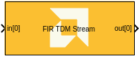
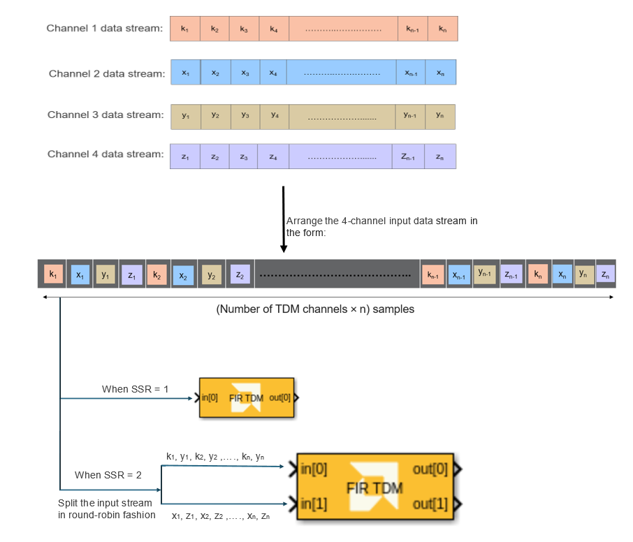
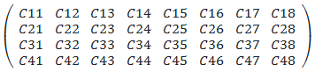
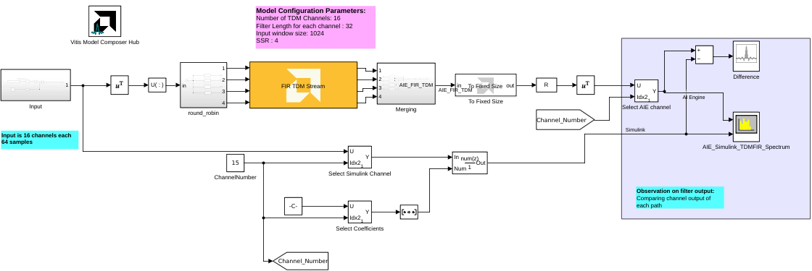

# FIR TDM Stream
Time-Division Multiplexing FIR Filter for AI Engines.
  
  

## Library

AI Engine/DSP/Stream IO

## Description

Time-Division Multiplexing FIR Filter for AI Engines.

## Input Data Samples - Organization

Input Data Samples to this filter must be in Time-Division Multiplexed (TDM) format.

For example, for a 4-channel FIR TDM, 

channel 1 data: k1,k2,....,kn-1,kn

channel 2 data: x1,x2,....,xn-1,xn

channel 3 data: y1,y2,....,yn-1,yn

channel 4 data: z1,z2,....,zn-1,zn

where 'n' represents the input window size divided by the number of channels. 

Then the input data stream would be ordered as: 

k1, x1, y1, z1, k2, x2, y2, z2, ......., kn-1, xn-1, yn-1, zn-1, kn, xn, yn, zn

In Simulink, you can also arrange the input as a matrix where the rows represent each channel's input. In this example, the matrix would have a size of 4xN.

When SSR > 1, this input data stream further split over multiple ports where each successive input sample is sent to a different input port in a round-robin fashion:

For example, SSR = 2 and 4-channel FIR TDM input array organization is explained in the figure below:

  

FIR TDM output data will be formatted in the same way.

## Parameters

### Main  
#### Input data type  
Set the data type of the block input. The data type of the input signal to the block must match this setting. Valid types are `cint16`, `cint32`, `cfloat`.

#### Output data type
Set the data type of the block output. Valid types are `cint16`, `cint32`, `cfloat`.

#### Filter coefficients data type  
Set the filter coefficients data type. This parameter's setting may be restricted based on the Input/Output data type. In particular, 

- Complex types are only supported when the Input/Output data type is
  also complex.
- 32-bit types are only supported when the Input/Output data type is
  also a 32-bit type.
- Filter coefficients data type must be an integer type if the
  Input/Output data type is an integer type.
- Filter coefficients data type must be a float type if the Input/Output
  data type is a float type.

#### Filter length
This field describes the number of taps (coefficients) in the filter.

#### Filter coefficients  
This field specifies the filter coefficients. 

Specify the coefficients as an NxM matrix, where `N` is the filter length and `M` is the number of TDM channels. 
For example, if filter length is 4 and number of TDM channels is 8 then the coefficient matrix would look like below:

 

Where each element `Cnm` represents a 'n-th' coefficient for a 'm-th' TDM channel. 

You could also define the coefficients as an array variable in the MATLAB workspace and specify the variable name in this field.

#### Scale output down by 2^  
Sets the power of 2 shift down applied to the accumulator of FIR before output. It must be in the range 0 to 61 inclusive.

#### Rounding mode
Describes the selection of rounding to be applied during the shift down stage of processing.

The following modes are available:
* **Floor:** Truncate LSB, always round down (towards negative infinity).
* **Ceiling:** Always round up (towards positive infinity).
* **Round to positive infinity:** Round halfway towards positive infinity.
* **Round to negative infinity:** Round halfway towards negative infinity.
* **Round symmetrical to infinity:** Round halfway towards infinity (away from zero).
* **Round symmetrical to zero:** Round halfway towards zero (away from infinity).
* **Round convergent to even:** Round halfway towards nearest even number.
* **Round convergent to odd:** Round halfway towards nearest odd number.

No rounding is performed on the **Floor** or **Ceiling** modes. Other modes round to the nearest integer. They differ only in how they round for values that are exactly between two integers.

#### Input window size (Number of samples)  
Describes the total number of samples (across all channels) used as an input to the filter function.

The number of input samples per channel is equal to this parameter, divided by the number of TDM channels.

#### Number of TDM channels 
Describes the number of Time-Division Multiplexed (TDM) channels processed by the FIR.

Each kernel requires storage for all taps and all channels it is required to operate on.

#### Saturation mode
Describes the selection of saturation to be applied during the shift down stage of processing.

The following modes are available:
* **None:** No saturation is performed and the value is truncated on the MSB side.
* **Asymmetric:** Rounds an n-bit signed value in the range `-2^(n-1)` to `2^(n-1)-1`.
* **Symmetric:** Rounds an n-bit signed value in the range `-2^(n-1)-1` to `2^(n-1)-1`.

#### Number of cascade stages  

This determines the number of kernels the FIR will be divided over to improve throughput.
For example, a 32 tap FIR split over 4 cascaded kernels will result in each operating on 8 taps.

#### SSR 
This parameter specifies the number of input (or output) paths and must
be of the form 2N, where N is a non-negative integer.
When a Super Sample Rate operation is used, then the input data channel must be split over multiple ports where each successive input sample is sent to a different input port in a round-robin fashion.

For example, for a input data stream that looks like: X = 1, 2, 3, 4, 5, 6, 7, 8, 9, ..., with an SSR parameter set to 2, input samples should be split over two ports accordingly:

In[1] = 1, 3, 5, 7, 9,...
In[2] = 2, 4, 6, 8, 10,...

The output data will be produced in the same way.

### Constraints
Click on the button given here to access the constraint manager and add or update constraints for each kernel. If you set the "Number of cascade stages" parameter to a value greater than one, multiple kernels will be used to process the input. You can use the constraint manager to optimize the performance of your design by setting specific constraints for each kernel (in this case, you need to first run your design). Adding constraints will not affect the functional simulation in Simulink. Constraints will only affect the generated graph code, cycle approximate AIE simulation (System C), and behavior in hardware.

If you are using non-default constraints for any of the kernels for the block, an asterisk (*) will be displayed next to the button.

## Examples

***Click on the images below to open each model.***

### References
This block uses the Vitis DSP library implementation of a TDM FIR filter. For more details on this implementation please click [here](https://docs.amd.com/r/en-US/Vitis_Libraries/dsp/user_guide/L2/func-fir-TDM.html).

--------------
Copyright (C) 2025 Advanced Micro Devices, Inc.
All rights reserved.

SPDX-License-Identifier: MIT
