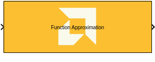
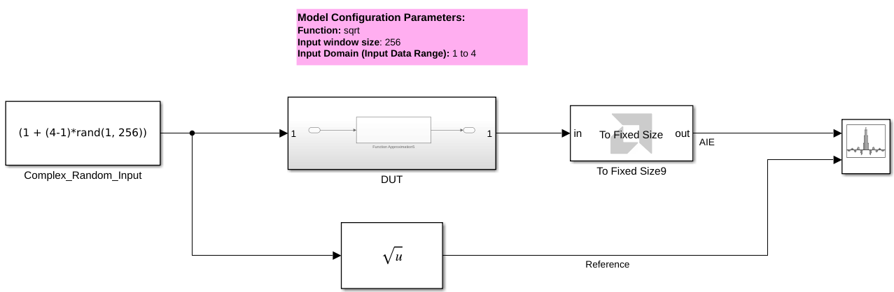
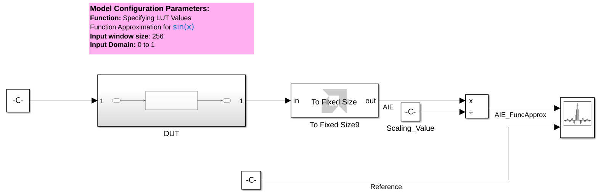
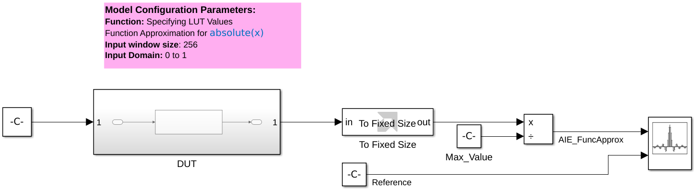
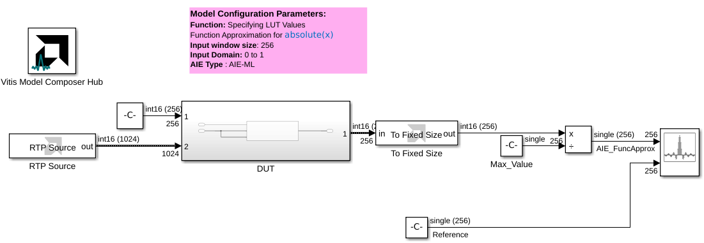
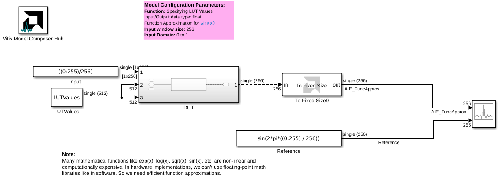

# Function Approximation

  
  

## Library

AI Engine/DSP/Buffer IO

## Description

The Function Approximation library element provides a vectorized linear approximation of a function, f(x), for a given input data, x, using a configured lookup table of slope and offset values that describe the function. 

## Parameters

### Main  

#### Function
Select preconfigured LUT values for the common functions `sqrt`, `invSqrt`, `log`, `exp`, `inv`, or select `<Specify LUT values>` to provide your own LUT values in the **Specify LookUp Values** field.

To achieve the expected results for a given function, data type, and input domain, it may be necessary to provide gain and bias to the Function Approximation block's input and output data. Refer to the table below. COARSE and FINE refer to the number of coarse and fine bits. Also refer to the [Examples](#examples).

| Function(s)              | Data Type     | Input Domain    | Input Gain                       | Input Bias                             | Scale output by 2^        | Output Gain                            |
|--------------------------|---------------|------------------|-----------------------------------|----------------------------------------|--------------------|----------------------------------------|
| **SQRT**                 | Int16, Int32  | 0 <= x < 1       | 2^(COARSE + FINE)                | –                                      | –                  | –                                      |
| **SQRT, LOG, INV, INVSQRT** | Int16, Int32  | 1 <= x < 2       | 2^(COARSE + FINE - 1)            | -2^(COARSE + FINE - 1)                 | –                  | –                                      |
| **SQRT, LOG, INV, INVSQRT** | Int16, Int32  | 1 <= x < 4       | 2^(COARSE + FINE - 2)            | –                                      | –                  | –                                      |
| **EXP**                  | Int16         | 0 <= x < 1       | 2^(COARSE + FINE)                | –                                      | 2                  | 2^(COARSE + FINE - 2)                  |
|                          | Int32         | 0 <= x < 1       | 2^(COARSE + FINE)                | –                                      | –                  | 2^(COARSE + FINE)                      |
| **EXP**                  | Int16         | 1 <= x < 2       | 2^(COARSE + FINE - 1)            | -2^(COARSE + FINE - 1)                 | 2                  | 2^(COARSE + FINE - 3)                  |
|                          | Int32         | 1 <= x < 2       | 2^(COARSE + FINE - 1)            | -2^(COARSE + FINE - 1)                 | –                  | 2^(COARSE + FINE - 1)                  |
| **EXP**                  | Int16         | 1 <= x < 4       | 2^(COARSE + FINE - 2)            | –                                      | 4                  | 2^(COARSE + FINE - 6)                  |
|                          | Int32         | 1 <= x < 4       | 2^(COARSE + FINE - 2)            | –                                      | –                  | 2^(COARSE + FINE - 2)                  |
| **SQRT, EXP**            | Float         | 0 <= x < 1       | –                                 | –                                      | –                  | -                       |
| **All**                | Float         | 1 <= x < 2       | –                                 | -1                              | –                  | –                                      |
| **All**                | Float         | 1 <= x < 4       | –                                 | –                                      | –                  | -                       |


#### Specify LookUp Values
Provide LUT values as a MATLAB vector or workspace variable name. The default values in this field will produce a sinusoidal function.

There will be `2^(Coarse bits)` locations in the lookup table. Each location will contain a slope value and an offset value which represent the linear approximation of the function at the corresponding location of the domain. Lookup tables for integer data types require the slope/offset values to be obtained using the point-slope form, whereas lookup tables for floating-point types require the slope-intercept form.

For example, slope-offset values for integer types (point-slope):
```
slope[i] = y[i+1] - y[i]
offset[i] = y[i]
```
Slope-offset values for floating-point types (slope-intercept):
```
slope[i] = (y[i + 1] - y[i]) / (x[i + 1] - x[i])
offset[i] = y[i] - slope[i] * x[i]
```
The provided lookup table should be populated as below:
```
slope[0], offset[0], slope[1], offset[1], ... slope[2^(Coarse bits) - 1], offset[2^(Coarse bits) - 1]
```

A single lookup will require `sizeof(Data type) * 2 * 2^(Coarse bits)` bytes of memory. For performance reasons, a duplicate of the lookup is created by the func_approx graph. Configurations for **AIE-ML** or **AIE-MLv2** devices with a data type of `int16` or `bfloat16` will use the AI Engine API for improved parallel lookups. However, this requires an additional duplication within each lookup table. This duplication will be done within the graph but must be accounted for when calculating the memory required for the provided lookup tables. Users must provide the lookup table, without any duplication, in the **Specify LookUp Values** field.

#### Specify LUT Values via input port
When this option is enabled, the tool allows you to specify LUT values via an [asynchronous Run Time Parameter (RTP)](https://github.com/Xilinx/Vitis_Model_Composer/blob/2025.2/Examples/AIENGINE/Run_Time_Parameters/rtp_vector_async) input port. When multiple LUT ports are exposed, they should receive the same RTP values.

For AIE-ML and AIE-MLv2 devices with a data type of `int16` or `bfloat16`, the LUT values must be repeated. For AIE-ML every 128 bits must be repeated; for AIE-MLv2 every 256 bits must be repeated.

For example, suppose the LUT values are `[1,2,3,4,5,6,7,8,9,10,11,12,13,14,15,16,...,256]`. The total number of LUT values is 256.

For AIE1, both RTP port 1 and RTP port 2 should receive these values.

In the case of AIE-ML for `int16` and `bfloat16` data types, both RTP port 1 and RTP port 2 should receive: `[1,2,3,4,5,6,7,8,1,2,3,4,5,6,7,8,9,10,11,12,13,14,15,16,9,10,11,12,13,14,15,16,..,241,242,243,244,245,246,247,248,241,242,243,244,245,246,247,248,249,250,251,252,253,254,255,256,249,250,251,252,253,254,255,256]`.

In the case of AIE-MLv2 for `int16` and `bfloat16` data types, both RTP port 1 and RTP port 2 should receive: `[1,2,3,4,5,6,7,8,9,10,11,12,13,14,15,16,1,2,3,4,5,6,7,8,9,10,11,12,13,14,15,16,..,241,242,243,244,245,246,247,248,249,250,251,252,253,254,255,256,241,242,243,244,245,246,247,248,249,250,251,252,253,254,255,256]`.

#### Input/Output data type
Describes the type of individual data samples input to the function. This must be one of the following:
* `int16`, `int32`, and `float` for AIE
* `int16`, `int32`, `float`, and `bfloat16` for AIE-ML and AIE-MLv2

#### Coarse bits
Describes the number of bits in a sample of input data that will be used to address the provided lookup table. It determines the total number of locations in the lookup table.

#### Fine bits
Describes the number of bits in an input data sample used for fine interpolation.

#### Input domain
Specifies a mode for the input domain of the chosen function for approximation.

There are three modes available:

* **0 to 1:** Domain of input, x, is from 0 to 1
* **1 to 2:** Domain of input, x, is from 1 to 2. (The most significant `(Coarse bits)` bit must be set to zero and will be ignored when addressing the lookup table. Refer to the Function Approximation User Guide for more information)
* **1 to 4:** Domain of input, x, is from 1 to 4

#### Input window size
Describes the number of samples to be processed in each call to this function.

#### Scale output down by 2^
Describes the number of bits to downshift the final output approximation.

#### Rounding mode
Describes the selection of rounding to be applied during the shift down stage of processing.

The following modes are available:
* **Floor:** Truncate LSB, always round down (towards negative infinity).
* **Ceiling:** Always round up (towards positive infinity).
* **Round to positive infinity:** Round halfway towards positive infinity.
* **Round to negative infinity:** Round halfway towards negative infinity.
* **Round symmetrical to infinity:** Round halfway towards infinity (away from zero).
* **Round symmetrical to zero:** Round halfway towards zero (away from infinity).
* **Round convergent to even:** Round halfway towards nearest even number.
* **Round convergent to odd:** Round halfway towards nearest odd number.

No rounding is performed on the **Floor** or **Ceiling** modes. Other modes round to the nearest integer. They differ only in how they round for values that are exactly between two integers.

#### Saturation mode
Describes the selection of saturation to be applied during the shift down stage of processing.

The following modes are available:
* **None:** No saturation is performed and the value is truncated on the MSB side.
* **Asymmetric:** Rounds an n-bit signed value in the range `-2^(n-1)` to `2^(n-1)-1`.
* **Symmetric:** Rounds an n-bit signed value in the range `-2^(n-1)-1` to `2^(n-1)-1`.

### Constraints
Click on the button given here to access the constraint manager and add or update constraints for each kernel. If you set the "Number of cascade stages" parameter to a value greater than one, multiple kernels will be used to process the input. You can use the constraint manager to optimize the performance of your design by setting specific constraints for each kernel (in this case, you need to first run your design). Adding constraints will not affect the functional simulation in Simulink. Constraints will only affect the generated graph code, cycle approximate AIE simulation (System C), and behavior in hardware.

<div class="noteBox">
If you are using non-default constraints for any of the kernels for the block, an asterisk (*) will be displayed next to the button.
</div>

## Examples

***Click on the images below to open each model.***

[](https://github.com/Xilinx/Vitis_Model_Composer/tree/2025.2/Examples/Block_Help/AIE/Function_Approximation_Ex1)

[](https://github.com/Xilinx/Vitis_Model_Composer/tree/2025.2/Examples/Block_Help/AIE/Function_Approximation_Ex2)

[](https://github.com/Xilinx/Vitis_Model_Composer/tree/2025.2/Examples/Block_Help/AIE/Function_Approximation_Ex3)

[](https://github.com/Xilinx/Vitis_Model_Composer/tree/2025.2/Examples/Block_Help/AIE/Function_Approximation_Ex4)

[](https://github.com/Xilinx/Vitis_Model_Composer/tree/2025.2/Examples/Block_Help/AIE/Function_Approximation_Ex5)

## References
This block uses the Vitis DSP library implementation of Function Approximation. For more details on this implementation please click [here](https://docs.amd.com/r/en-US/Vitis_Libraries/dsp/user_guide/L2/func-func-approx.html).

--------------
Copyright (C) 2025 Advanced Micro Devices, Inc.
All rights reserved.

SPDX-License-Identifier: MIT
