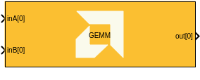
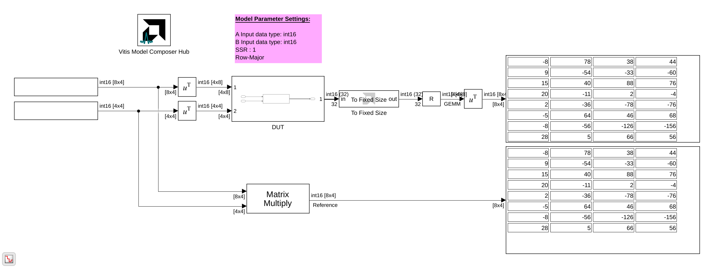
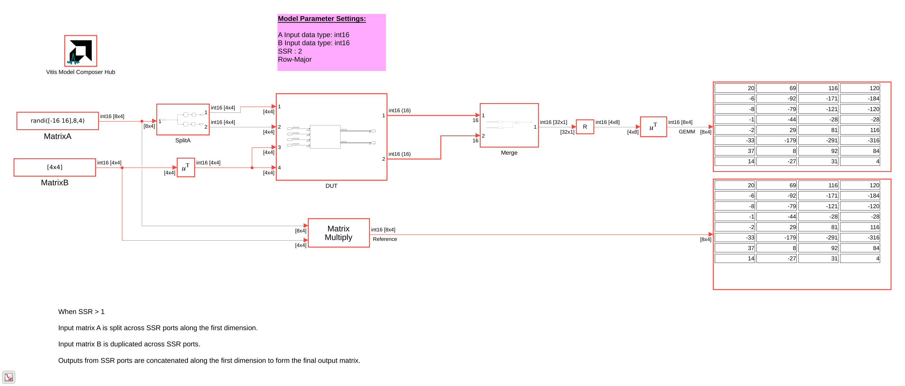

# GEMM

General Matrix Multiply (GEMM) implementation targeted for AI Engines.

## Library

AI Engine/DSP/Buffer IO

## Description

This block implements General Matrix Multiply (GEMM), which performs the matrix multiplication C = A × B, where A is an M×K matrix, B is a K×N matrix, and the resulting output C is an M×N matrix.

The GEMM block supports both row-major and column-major memory layouts for input and output matrices. When Super Sample Rate (SSR) is enabled, the computation is parallelized across multiple AI Engine tiles to improve throughput.

## Parameters

### Main

#### A input data type
Specifies the data type for the A input port. Supported types include `int16`, `int32`, `cint16`, `cint32`, `float`, and `cfloat`.

#### B input data type
Specifies the data type for the B input port. Supported types include `int16`, `int32`, `cint16`, `cint32`, `float`, and `cfloat`.

#### Output data type
Specifies the data type for the output port. Supported types include `int16`, `int32`, `cint16`, `cint32`, `float`, and `cfloat`.

#### Rows in input A
Specifies the number of rows (M) in matrix A. This determines the number of rows in the output matrix C.

#### Columns in input B
Specifies the number of columns (N) in matrix B. This determines the number of columns in the output matrix C.

#### Columns in input A, Rows in input B
Specifies the common dimension (K) - the number of columns in matrix A and the number of rows in matrix B. This dimension must match for matrix multiplication to be valid.

#### SSR (Super Sample Rate)
Specifies the number of parallel data paths processed by the block. Increasing SSR allows for higher throughput by distributing the computation across multiple AI Engine tiles.

When SSR > 1, the input matrices and output are split across multiple ports. The specific data distribution depends on the memory layout (row-major or column-major).

#### A input leading dimension
Specifies the memory layout for input matrix A:
* **Row-major(0):** Matrix elements are stored row by row in memory
* **Column-major(1):** Matrix elements are stored column by column in memory

#### B input leading dimension
Specifies the memory layout for input matrix B:
* **Row-major(0):** Matrix elements are stored row by row in memory
* **Column-major(1):** Matrix elements are stored column by column in memory

#### Output leading dimension
Specifies the memory layout for the output matrix:
* **Row-major(0):** Matrix elements are stored row by row in memory
* **Column-major(1):** Matrix elements are stored column by column in memory

#### Add tiling to input A, Add tiling to input B, Add detiling to output
These parameters control the inclusion of an additional pre-processing/post-processing kernel to perform the required data storage reordering. When used while selecting the input and/or output leading dimension, the matrix is also transposed in the tiling kernel.

If the additional kernels are not selected, then the matrix multiply kernels assume incoming data is in the correct format, as specified in the [function documentation](https://docs.amd.com/r/en-US/Vitis_Libraries/dsp/user_guide/L2/func-matmul.html_6_0).

#### Scale output down by 2^
Describes the power of 2 by which the output is scaled down (right-shifted) before output. For `float` and `cfloat` data types, this parameter must be zero.

#### Rounding mode
Describes the selection of rounding to be applied during the shift down stage of processing.

The following modes are available:
* **Floor:** Truncate LSB, always round down (towards negative infinity).
* **Ceiling:** Always round up (towards positive infinity).
* **Round to positive infinity:** Round halfway towards positive infinity.
* **Round to negative infinity:** Round halfway towards negative infinity.
* **Round symmetrical to infinity:** Round halfway towards infinity (away from zero).
* **Round symmetrical to zero:** Round halfway towards zero (away from infinity).
* **Round convergent to even:** Round halfway towards nearest even number.
* **Round convergent to odd:** Round halfway towards nearest odd number.

No rounding is performed on the **Floor** or **Ceiling** modes. Other modes round to the nearest integer. They differ only in how they round for values that are exactly between two integers.

#### Saturation mode
Describes the selection of saturation to be applied during the shift down stage of processing.

The following modes are available:
* **None:** No saturation is performed and the value is truncated on the MSB side.
* **Saturate:** Rounds an n-bit signed value in the range `-2^(n-1)` to `2^(n-1)-1`.
* **Symmetric:** Rounds an n-bit signed value in the range `-2^(n-1)-1` to `2^(n-1)-1`.

### Constraints
Click on the button given here to access the constraint manager and add or update constraints for each kernel. You can use the constraint manager to optimize the performance of your design by setting specific constraints for each kernel (in this case, you need to first run your design). Adding constraints will not affect the functional simulation in Simulink. Constraints will only affect the generated graph code, cycle approximate AIE simulation (System C), and behavior in hardware.

If you are using non-default constraints for any of the kernels for the block, an asterisk (*) will be displayed next to the button.

## Examples

***Click on the images below to open each model.***

**GEMM with SSR=1 (row-major mode):**

**GEMM with SSR=2 (row-major mode):**

## References
This block uses the Vitis DSP library implementation of GEMM. For more details on this implementation please click [here](https://docs.amd.com/r/en-US/Vitis_Libraries/dsp/user_guide/L2/func-gemm.html).

--------------
Copyright (C) 2026 Advanced Micro Devices, Inc.
All rights reserved.

SPDX-License-Identifier: MIT
