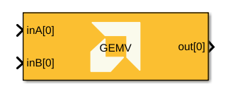
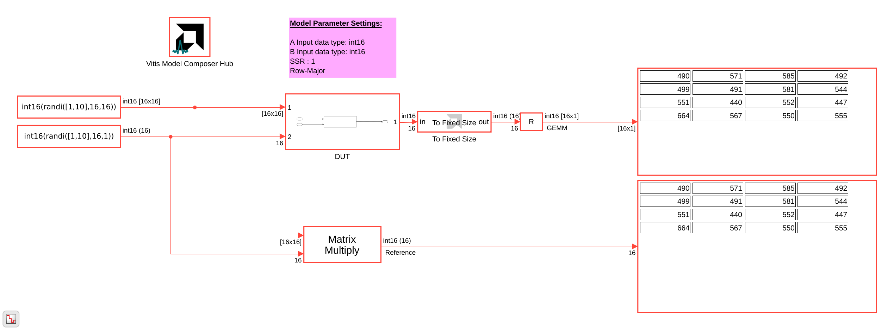
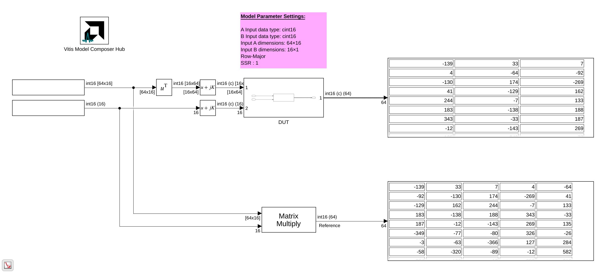

# GEMV (General Matrix-Vector Multiplication)

Implements General Matrix-Vector Multiplication targeted for AI Engines.

## Library

AI Engine/DSP/Buffer IO

## Description

This block implements General Matrix-Vector Multiplication (GEMV), which performs the operation: output = A*B, where matrix A is (m x k) and vector B is (k x 1), producing an output vector of (m x 1). The block supports configurable matrix and vector dimensions, multiple data types (int16, int32, cint16, cint32, float, cfloat), and flexible memory layouts (row-major or column-major). The matrix A can be provided either via input port or through Run-Time Parameterization (RTP). Super Sample Rate (SSR) enables parallel processing across multiple data paths for improved throughput, while cascading support allows distribution of computation across multiple kernels.

## Parameters

### Main

#### A input data type
Specifies the data type for the A input port. Supported types include `int16`, `int32`, `cint16`, `cint32`, `float`, and `cfloat`.

#### B input data type
Specifies the data type for the B input port (vector). Supported types include `int16`, `int32`, `cint16`, `cint32`, `float`, and `cfloat`.

#### Provide matrix A via RTP
When checked, matrix A is provided via Run-Time Parameterization (RTP) instead of through an input port. This allows the matrix to be updated dynamically at runtime without restarting the kernel.

#### Rows in input A
Specifies the number of rows (M dimension) in matrix A and the output vector.

#### Columns in input A, Length of vector B
Specifies the number of columns in matrix A and the length of vector B (K dimension). This is the reduction dimension in the GEMV operation.

#### SSR (Super Sample Rate)
Specifies the number of parallel data paths processed by the block. Increasing SSR allows for higher throughput by processing multiple samples in parallel.

**When SSR > 1:**
- Input matrix A is split across SSR ports along the first dimension.
- Input vector B is duplicated across SSR ports.
- Outputs from SSR ports are concatenated to form output vector.

#### Number of cascade stages
Specifies the number of cascaded kernel instances to be used. Cascading improves performance by distributing the computation across multiple kernels.

#### A input leading dimension
Specifies the memory layout for matrix A. Options include:
* **Row-major(0):** Elements are arranged in row-major order (rows are contiguous in memory).
* **Column-major(1):** Elements are arranged in column-major order (columns are contiguous in memory).

#### Scale output down by 2^
Describes the power of 2 by which the output is scaled down (right-shifted) before output. For `float` and `cfloat` data types, this parameter must be zero.

#### Rounding mode
Describes the selection of rounding to be applied during the shift down stage of processing.

The following modes are available:
* **Floor:** Truncate LSB, always round down (towards negative infinity).
* **Ceiling:** Always round up (towards positive infinity).
* **Round to positive infinity:** Round halfway towards positive infinity.
* **Round to negative infinity:** Round halfway towards negative infinity.
* **Round symmetrical to infinity:** Round halfway towards infinity (away from zero).
* **Round symmetrical to zero:** Round halfway towards zero (away from infinity).
* **Round convergent to even:** Round halfway towards nearest even number.
* **Round convergent to odd:** Round halfway towards nearest odd number.

No rounding is performed on the **Floor** or **Ceiling** modes. Other modes round to the nearest integer. They differ only in how they round for values that are exactly between two integers.

#### Saturation mode
Describes the selection of saturation to be applied during the shift down stage of processing.

The following modes are available:
* **None:** No saturation is performed and the value is truncated on the MSB side.
* **Asymmetric:** Rounds an n-bit signed value in the range `-2^(n-1)` to `2^(n-1)-1`.
* **Symmetric:** Rounds an n-bit signed value in the range `-2^(n-1)-1` to `2^(n-1)-1`.

### Constraints
Click on the button given here to access the constraint manager and add or update constraints for each kernel. You can use the constraint manager to optimize the performance of your design by setting specific constraints for each kernel (in this case, you need to first run your design). Adding constraints will not affect the functional simulation in Simulink. Constraints will only affect the generated graph code, cycle approximate AIE simulation (System C), and behavior in hardware.

If you are using non-default constraints for any of the kernels for the block, an asterisk (*) will be displayed next to the button.

## Examples

**Note:** Examples for this block are currently under development and will be available in a future release.

<!-- Examples under development
***Click on the images below to open each model.***

-->

--------------
Copyright (C) 2026 Advanced Micro Devices, Inc.
All rights reserved.

SPDX-License-Identifier: MIT

