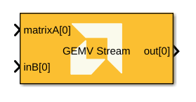
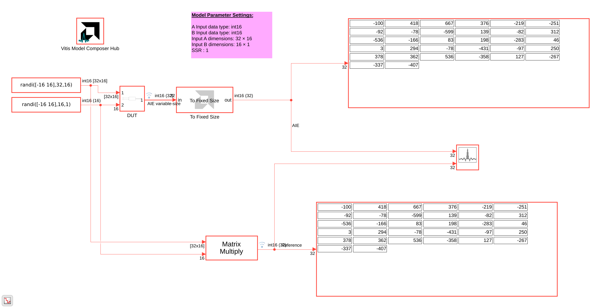
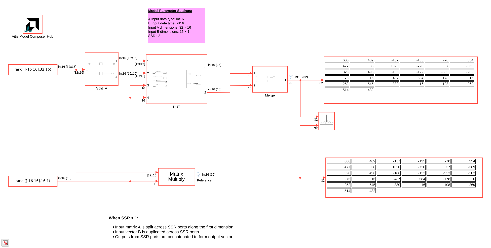
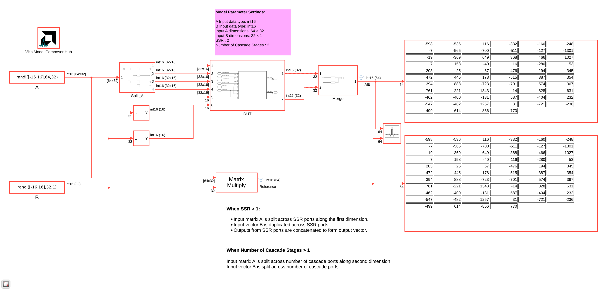
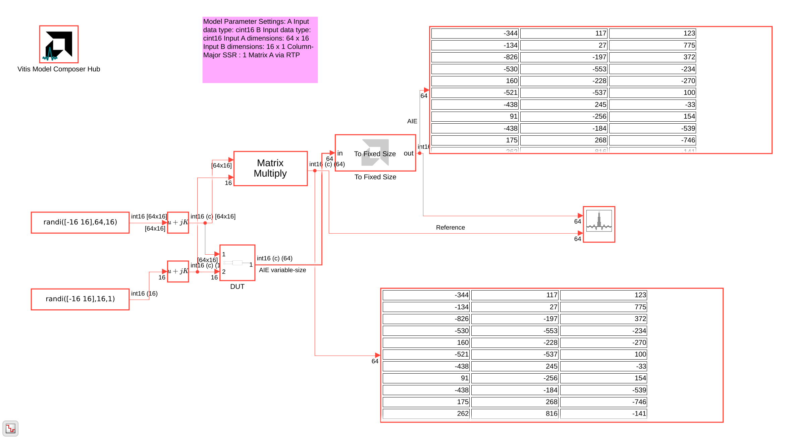
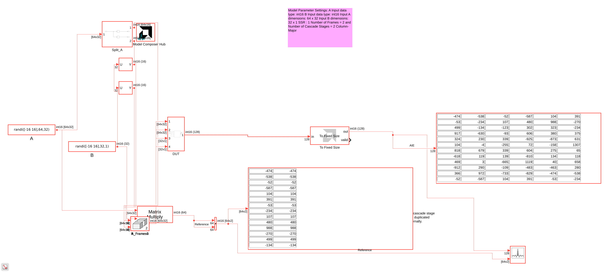

# GEMV Stream (General Matrix-Vector Multiplication)

Implements General Matrix-Vector Multiplication using stream interfaces on AI Engines.

## Library

AI Engine/DSP/Stream IO

## Description

This block performs GEMV (output = A×B) with stream IO, matching the functionality of the [buffer IO GEMV](../GEMV/README.md) block. Matrix A can be supplied through an input stream or via Run-Time Parameterization (RTP).

When RTP delivery of matrix A is enabled, the tool validates matrix dimensions and data types at configuration time and reports actionable design rule check messages if parameters are inconsistent.

## Parameters

### Main

Parameters match the [GEMV](../GEMV/README.md) block unless noted below.

#### Provide matrix A via RTP
When checked, matrix A is provided via RTP instead of an input stream.

#### A input data type / B input data type
Supported types include `int16`, `int32`, `cint16`, `cint32`, `float`, and `cfloat`.

#### Rows in input A / Columns in input A, Length of vector B
Define matrix and vector dimensions for the GEMV operation.

#### SSR (Super Sample Rate)
Number of parallel stream lanes. When SSR > 1, matrix A is split across lanes along the first dimension, vector B is duplicated, and outputs are concatenated.

#### Number of cascade stages
Number of cascaded kernel instances.

#### Provide second set of input ports
When this option is enabled, a second stream input port is added for vector B on each kernel, increasing available throughput. Vector B data should be organized in a 128-bit interleaved pattern across the two input streams. For example, for a `cint16` input, samples 0-3 should be sent over the first stream and samples 4-7 over the second stream.

This option is supported only on AIE devices with stream IO (not AIE-ML or AIE-ML V2).

#### Provide second set of output ports
When this option is enabled, a second stream output port is added per SSR rank. The two output streams are interleaved in a 128-bit pattern. For example, for `cint16` output data, samples 0-3 are sent on the first output stream and samples 4-7 on the second output stream.

This option is supported only on AIE devices with stream IO (not AIE-ML or AIE-ML V2).

#### A input leading dimension
Row-major (0) or column-major (1) layout for matrix A.

### Constraints
Use the constraint manager for per-kernel constraints.

## Examples

***Click on the images below to open each model.***

**GEMV Stream with a 32×16 int16 matrix, SSR = 1:**

**GEMV Stream with a 32×16 int16 matrix, SSR = 2:**

**GEMV Stream with a 64×32 int16 matrix, SSR = 2 and Number of Cascade Stages = 2:**

**GEMV Stream with a 32×16 int32 matrix, SSR = 1:**

**GEMV Stream with a 64×16 cint16 matrix, column-major, SSR = 1:**

**GEMV Stream with a 64×32 int16 matrix, Number of Frames = 2 and Number of Cascade Stages = 2:**

--------------
Copyright (C) 2026 Advanced Micro Devices, Inc.
All rights reserved.

SPDX-License-Identifier: MIT
