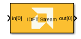
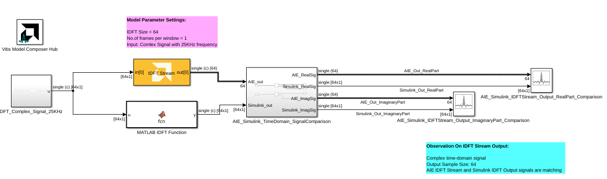
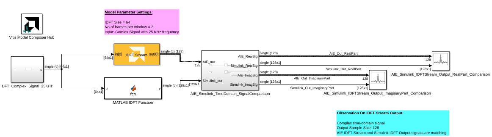

<!-- Library: aieDSP -->

# IDFT Stream
Stream-based IDFT implementation targeted for AI Engines.
  
  

## Library

AI Engine/DSP/Stream IO

## Description

Stream-based IDFT implementation targeted for AI Engines.
## Parameters

### Main  
#### Input/Output Data Type
Set the input/output data type.

#### Twiddle factor data type
Describes the data type of the twiddle factors of the transform. It must be `cint16`, `cint32`, or `cfloat` and must also satisfy the following rules:
* 32-bit twiddle factors are only supported when the input/output data type is also 32-bit.
* The twiddle factor data type must be an integer type if the input/output data type is an integer type.
* The twiddle factor data type must be `cfloat` if the input/output data type is a float type.

#### IDFT size
This is an unsigned integer which describes the point size of the transformation. This must be 2^N, where N is in the range 3 to 7 inclusive.

#### Number of frames per window
Describes the total number of frames used as an input to the IDFT block per window.

#### Scale output down by 2^
Describes the power of 2 shift down applied before output. For _cfloat_ data type, the value for this parameter must be zero. 

#### Rounding mode

Describes the selection of rounding to be applied during the shift down stage of processing.

The following modes are available:
* **Floor:** Truncate LSB, always round down (towards negative infinity).
* **Ceiling:** Always round up (towards positive infinity).
* **Round to positive infinity:** Round halfway towards positive infinity.
* **Round to negative infinity:** Round halfway towards negative infinity.
* **Round symmetrical to infinity:** Round halfway towards infinity (away from zero).
* **Round symmetrical to zero:** Round halfway towards zero (away from infinity).
* **Round convergent to even:** Round halfway towards nearest even number.
* **Round convergent to odd:** Round halfway towards nearest odd number.

No rounding is performed on the **Floor** or **Ceiling** modes. Other modes round to the nearest integer. They differ only in how they round for values that are exactly between two integers.

#### SSR

This parameter is intended to improve performance by parallelizing the DFT processing. When this parameter is N>1, the block will have N input ports and N output ports.

The DFT/IDFT blocks' behavior in SSR mode differs from that of the FFT/IFFT blocks. Each input port of the DFT/IDFT should receive the same input samples. This differs from the FFT/IFFT blocks, which expect the input samples to be split across the input ports.

#### Saturation mode

Describes the selection of saturation to be applied during the shift down stage of processing.

The following modes are available:
* **None:** No saturation is performed and the value is truncated on the MSB side.
* **Asymmetric:** Rounds an n-bit signed value in the range `-2^(n-1)` to `2^(n-1)-1`.
* **Symmetric:** Rounds an n-bit signed value in the range `-2^(n-1)-1` to `2^(n-1)-1`.

####  Number of Cascade Stages
This determines the number of kernels the DFT will be divided over in series to improve throughput. When cascaded, each kernel will operate on a subset of the input signal and pass a partial result to the next kernel. 

Increasing the number of cascade stages will increase the number of inputs to the DFT block. The input signal should be distributed among the input ports in a round-robin fashion. 

For example, for a cascade length of 2:
* `in[0]` should receive samples `1, 3, 5, ..., n-1` of the input signal 
* `in[1]` should receive samples `2, 4, 6, ..., n` of the input signal

The maximum cascade length is 11. 

### Zero Padding Data for Alignment

It is important to note that the IDFT requires that each frame of input data to be aligned and sized according to the following rules for maximal performance.

* **AIE:** The input frame must be a multiple of 256 bits.
* **AIE-ML and AIE-MLv2:** The input frame must be a multiple of 256 bits for `cint16` data and 512 bits for `cint32` or `cfloat` data.

This is also a requirement when using the cascading feature of the IDFT. Each cascaded kernel should receive a split of the frame that has a size corresponding to the above rules.

For more information, see the [Vitis DSP library documentation](https://docs.amd.com/r/en-US/Vitis_Libraries/dsp/user_guide/L2/func-dft.html_6_5).

When computing a IDFT size that does not follow these rules, it is necessary to do one of the following:

1. Zero-pad each input frame so that its size is one of the bit multiples described above. When zero-padding, there will be no impact on the final numerical result of the transform.
2. Buffer each input frame so that its size is one of the bit multiples described above. When not zero-padding, it is necessary to remove invalid samples from the output.

[This example]((https://github.com/Xilinx/Vitis_Model_Composer/tree/2025.2/Examples/Block_Help/AIE/DFT_Ex5)) illustrates the second approach.

### Constraints
Click on the button given here to access the constraint manager and add or update constraints for each kernel. If you set the "Number of cascade stages" parameter to a value greater than one, multiple kernels will be used to process the input. You can use the constraint manager to optimize the performance of your design by setting specific constraints for each kernel (in this case, you need to first run your design). Adding constraints will not affect the functional simulation in Simulink. Constraints will only affect the generated graph code, cycle approximate AIE simulation (System C), and behavior in hardware.

If you are using non-default constraints for any of the kernels for the block, an asterisk (*) will be displayed next to the button.

## Examples

***Click on the images below to open each model.***

<!--
DESCRIPTION:
Model: IDFT_Stream_Ex1
Generated: 09-Jan-2026 13:45:58

Vitis Model Composer Configuration:
  Target Device: xcvc1902-vsva2197-1LP-e-S

Vitis Model Composer Blocks:
  - AIE: IDFT Stream

Description:
This MATLAB script creates a Vitis Model Composer Simulink model that uses the AI Engine IDFT Stream block. A 25kHz complex input signal is provided to the block,  and the output is visualized for analysis.

-->

<!--
MATLAB CREATION SCRIPT:

% create_IDFT_Stream_Ex1_model.m
% Auto-generated script to recreate the IDFT_Stream_Ex1 Simulink model
% Generated on: 09-Jan-2026 13:45:58

%% Model Configuration
modelName = 'IDFT_Stream_Ex1_recreated';

%% Create New Model
if bdIsLoaded(modelName)
    close_system(modelName, 0);
end

new_system(modelName);
open_system(modelName);
fprintf('Created new model: %s\n', modelName);

%% Add Vitis Model Composer Hub Block
hubBlockPath = [modelName '/Vitis Model Composer Hub'];
add_block('vmcUtilities/Vitis Model Composer Hub', hubBlockPath, ...
    'Position', [77 123 132 176]);

hubBlk = xmcFindHubBlock(modelName);
vmchub_set_param(hubBlk, modelName, 'SelectHardware', 'xcvc1902-vsva2197-1LP-e-S');

%% Add Top-Level Blocks
add_block('built-in/ArrayPlot', [modelName '/AIE_Simulink_IDFTStream_Output_ImaginaryPart_Comparison '], ...
    'Position', [1005 277 1050 328]);
set_param([modelName '/AIE_Simulink_IDFTStream_Output_ImaginaryPart_Comparison '], ...
    'NumInputPorts', '2', ...
    'OpenAtSimulationStart', 'on', ...
    'WindowPosition', '[1.000000,37.000000,1280.000000,655.000000,]', ...
    'XDataMode', 'Sample increment and X-offset', ...
    'SampleIncrement', '1', ...
    'XOffset', '0', ...
    'CustomXData', '[]', ...
    'XScale', 'Linear', ...
    'YScale', 'Linear', ...
    'PlotType', 'Line', ...
    'PlotBaseValue', '0', ...
    'AxesScaling', 'Manual', ...
    'AxesScalingNumUpdates', '100', ...
    'MaximizeAxes', 'Auto', ...
    'LayoutDimensions', '[1,1]', ...
    'ActiveDisplay', '1', ...
    'PlotAsMagnitudePhase', 'off', ...
    'YLabel', 'Amplitude', ...
    'YLimits', '[-1800,1800]', ...
    'ShowGrid', 'on', ...
    'ShowLegend', 'on', ...
    'ChannelNames', '[]');
add_block('built-in/ArrayPlot', [modelName '/AIE_Simulink_IDFTStream_Output_RealPart_Comparison'], ...
    'Position', [1170 227 1215 278]);
set_param([modelName '/AIE_Simulink_IDFTStream_Output_RealPart_Comparison'], ...
    'NumInputPorts', '2', ...
    'OpenAtSimulationStart', 'on', ...
    'WindowPosition', '[1.000000,37.000000,1280.000000,655.000000,]', ...
    'XDataMode', 'Sample increment and X-offset', ...
    'SampleIncrement', '1', ...
    'XOffset', '0', ...
    'CustomXData', '[]', ...
    'XScale', 'Linear', ...
    'YScale', 'Linear', ...
    'PlotType', 'Line', ...
    'PlotBaseValue', '0', ...
    'AxesScaling', 'OnceAtStop', ...
    'AxesScalingNumUpdates', '100', ...
    'MaximizeAxes', 'Auto', ...
    'LayoutDimensions', '[1,1]', ...
    'ActiveDisplay', '1', ...
    'PlotAsMagnitudePhase', 'off', ...
    'YLabel', 'Amplitude', ...
    'YLimits', '[-800.0003,800]', ...
    'ShowGrid', 'on', ...
    'ShowLegend', 'on', ...
    'ChannelNames', '[]');
add_block('aieDSP/IDFT Stream', [modelName '/IDFT Stream'], ...
    'Position', [325 207 445 263]);
set_param([modelName '/IDFT Stream'], ...
    'data_type', 'cfloat', ...
    'twiddle_type', 'cfloat', ...
    'point_size', '64', ...
    'num_frames', '1', ...
    'shift_val', '0', ...
    'rnd_mode', 'Round symmetrical to infinity', ...
    'ssr', '1', ...
    'sat_mode', '0-None', ...
    'casc_length', '1', ...
    'TP_API', '0', ...
    'TP_FFT_NIFFT', '0');
add_block('vmcUtilities/Vitis Model Composer Hub', [modelName '/Vitis Model Composer Hub'], ...
    'Position', [77 123 132 176]);
set_param([modelName '/Vitis Model Composer Hub'], ...
    'CodeGeneration', 'off', ...
    'SubsystemName', 'AIE_Subsystem', ...
    'StartColumn', '1', ...
    'NumberOfColumns', '1', ...
    'TargetDirectory', './code', ...
    'exportDesign', 'off', ...
    'analyzeDesign', 'off', ...
    'validateDesignOnHw', 'off', ...
    'ExportType', 'AI Engines', ...
    'IpVendor', 'xilinx.com', ...
    'IpLibrary', 'hls', ...
    'IpVersion', '1.0', ...
    'IpHWLanguage', 'Verilog', ...
    'AieCompilerOptions', '{}', ...
    'CreateTestbench', 'off', ...
    'TestbenchStackSize', '10', ...
    'RunRtlSim', 'off', ...
    'RunCSim', 'off', ...
    'RunAieSim', 'off', ...
    'AieSimTimeout', '50000', ...
    'RunAieSimProfiling', 'off', ...
    'LaunchVitisAnalyzer', 'off', ...
    'PlotOutput', 'off', ...
    'GenHwImage', 'off', ...
    'GenLibadfXo', 'off', ...
    'GenHwValidationCode', 'off', ...
    'PlatformType', 'Not Specified', ...
    'HwSystemType', 'Baremetal', ...
    'HwValidationTarget', 'hw', ...
    'ProjDevice', 'xcvc1902-vsva2197-1LP-e-S', ...
    'SamplePeriod', '-1', ...
    'ClockFrequency', '200', ...
    'DataPathParallelism', '1', ...
    'xilinxfamily', 'versalaicore', ...
    'part', 'xcvc1902', ...
    'speed', '-1LP-e-S', ...
    'package', 'vsva2197', ...
    'directory', './netlist', ...
    'testbench', 'off', ...
    'incr_netlist', 'off', ...
    'synthesis_tool', 'Vivado', ...
    'clock_wrapper', 'Clock Enables', ...
    'dbl_ovrd', 'According to Block Masks', ...
    'dcm_input_clock_period', '10', ...
    'sysclk_period', '10', ...
    'simulink_period', '1', ...
    'eval_field', '0', ...
    'LogFileName', '/proj/xhdhdstaff5/sdegala/Head1/HEAD/AIE_Block_Examples/AIE/code/model_composer.log', ...
    'NThreads', '4');

%% Create AIE_Simulink_TimeDomain_SignalComparison Subsystem
add_block('built-in/SubSystem', [modelName '/AIE_Simulink_TimeDomain_SignalComparison'], ...
    'Position', [565 225 715 330]);

% Remove default blocks
defaultBlocks = find_system([modelName '/AIE_Simulink_TimeDomain_SignalComparison'], 'SearchDepth', 1, 'Type', 'block');
for i = 1:length(defaultBlocks)
    if ~strcmp(defaultBlocks{i}, [modelName '/AIE_Simulink_TimeDomain_SignalComparison'])
        delete_block(defaultBlocks{i});
    end
end

add_block('built-in/Inport', [[modelName '/AIE_Simulink_TimeDomain_SignalComparison'] '/AIE_out'], ...
    'Position', [80 168 110 182]);
set_param([[modelName '/AIE_Simulink_TimeDomain_SignalComparison'] '/AIE_out'], ...
    'Port', '1', ...
    'IconDisplay', 'Port number', ...
    'OutputFunctionCall', 'off', ...
    'OutMin', '[]', ...
    'OutMax', '[]', ...
    'OutDataTypeStr', 'Inherit: auto', ...
    'LockScale', 'off', ...
    'BusOutputAsStruct', 'off', ...
    'BusVirtuality', 'inherit', ...
    'Unit', 'inherit', ...
    'PortDimensions', '-1', ...
    'VarSizeSig', 'Inherit', ...
    'SampleTime', '-1', ...
    'SignalType', 'auto', ...
    'LatchByDelayingOutsideSignal', 'off', ...
    'LatchInputForFeedbackSignals', 'off', ...
    'Interpolate', 'on', ...
    'DataMode', 'inherit', ...
    'MessageQueueUseDefaultAttributes', 'on', ...
    'MessageQueueCapacity', '1', ...
    'MessageQueueType', 'LIFO', ...
    'MessageQueueOverwriting', 'on');
add_block('built-in/Inport', [[modelName '/AIE_Simulink_TimeDomain_SignalComparison'] '/Simulink_out'], ...
    'Position', [80 243 110 257]);
set_param([[modelName '/AIE_Simulink_TimeDomain_SignalComparison'] '/Simulink_out'], ...
    'Port', '2', ...
    'IconDisplay', 'Port number', ...
    'OutputFunctionCall', 'off', ...
    'OutMin', '[]', ...
    'OutMax', '[]', ...
    'OutDataTypeStr', 'Inherit: auto', ...
    'LockScale', 'off', ...
    'BusOutputAsStruct', 'off', ...
    'BusVirtuality', 'inherit', ...
    'Unit', 'inherit', ...
    'PortDimensions', '-1', ...
    'VarSizeSig', 'Inherit', ...
    'SampleTime', '-1', ...
    'SignalType', 'auto', ...
    'LatchByDelayingOutsideSignal', 'off', ...
    'LatchInputForFeedbackSignals', 'off', ...
    'Interpolate', 'on', ...
    'DataMode', 'inherit', ...
    'MessageQueueUseDefaultAttributes', 'on', ...
    'MessageQueueCapacity', '1', ...
    'MessageQueueType', 'LIFO', ...
    'MessageQueueOverwriting', 'on');
add_block('built-in/ComplexToRealImag', [[modelName '/AIE_Simulink_TimeDomain_SignalComparison'] '/Complex to Real-Imag'], ...
    'Position', [245 158 275 187]);
set_param([[modelName '/AIE_Simulink_TimeDomain_SignalComparison'] '/Complex to Real-Imag'], ...
    'Output', 'Real and imag', ...
    'SampleTime', '-1');
add_block('built-in/ComplexToRealImag', [[modelName '/AIE_Simulink_TimeDomain_SignalComparison'] '/Complex to Real-Imag1'], ...
    'Position', [245 233 275 262]);
set_param([[modelName '/AIE_Simulink_TimeDomain_SignalComparison'] '/Complex to Real-Imag1'], ...
    'Output', 'Real and imag', ...
    'SampleTime', '-1');
add_block('built-in/Outport', [[modelName '/AIE_Simulink_TimeDomain_SignalComparison'] '/AIE_RealSig'], ...
    'Position', [485 158 515 172]);
set_param([[modelName '/AIE_Simulink_TimeDomain_SignalComparison'] '/AIE_RealSig'], ...
    'Port', '1', ...
    'StorageClass', 'Auto', ...
    'IconDisplay', 'Port number', ...
    'OutputFunctionCall', 'off', ...
    'OutMin', '[]', ...
    'OutMax', '[]', ...
    'OutDataTypeStr', 'Inherit: auto', ...
    'LockScale', 'off', ...
    'BusOutputAsStruct', 'off', ...
    'BusVirtuality', 'inherit', ...
    'DataMode', 'inherit', ...
    'Unit', 'inherit', ...
    'PortDimensions', '-1', ...
    'VarSizeSig', 'Inherit', ...
    'SampleTime', '-1', ...
    'SignalType', 'auto', ...
    'EnsureOutportIsVirtual', 'off', ...
    'OutputWhenDisabled', 'held', ...
    'InitialOutput', '[]', ...
    'MustResolveToSignalObject', 'off', ...
    'OutputWhenUnConnected', 'off', ...
    'OutputWhenUnconnectedValue', '0', ...
    'VectorParamsAs1DForOutWhenUnconnected', 'on');
add_block('built-in/Outport', [[modelName '/AIE_Simulink_TimeDomain_SignalComparison'] '/Simulink_RealSig'], ...
    'Position', [485 233 515 247]);
set_param([[modelName '/AIE_Simulink_TimeDomain_SignalComparison'] '/Simulink_RealSig'], ...
    'Port', '2', ...
    'StorageClass', 'Auto', ...
    'IconDisplay', 'Port number', ...
    'OutputFunctionCall', 'off', ...
    'OutMin', '[]', ...
    'OutMax', '[]', ...
    'OutDataTypeStr', 'Inherit: auto', ...
    'LockScale', 'off', ...
    'BusOutputAsStruct', 'off', ...
    'BusVirtuality', 'inherit', ...
    'DataMode', 'inherit', ...
    'Unit', 'inherit', ...
    'PortDimensions', '-1', ...
    'VarSizeSig', 'Inherit', ...
    'SampleTime', '-1', ...
    'SignalType', 'auto', ...
    'EnsureOutportIsVirtual', 'off', ...
    'OutputWhenDisabled', 'held', ...
    'InitialOutput', '[]', ...
    'MustResolveToSignalObject', 'off', ...
    'OutputWhenUnConnected', 'off', ...
    'OutputWhenUnconnectedValue', '0', ...
    'VectorParamsAs1DForOutWhenUnconnected', 'on');
add_block('built-in/Outport', [[modelName '/AIE_Simulink_TimeDomain_SignalComparison'] '/AIE_ImagSig'], ...
    'Position', [485 193 515 207]);
set_param([[modelName '/AIE_Simulink_TimeDomain_SignalComparison'] '/AIE_ImagSig'], ...
    'Port', '3', ...
    'StorageClass', 'Auto', ...
    'IconDisplay', 'Port number', ...
    'OutputFunctionCall', 'off', ...
    'OutMin', '[]', ...
    'OutMax', '[]', ...
    'OutDataTypeStr', 'Inherit: auto', ...
    'LockScale', 'off', ...
    'BusOutputAsStruct', 'off', ...
    'BusVirtuality', 'inherit', ...
    'DataMode', 'inherit', ...
    'Unit', 'inherit', ...
    'PortDimensions', '-1', ...
    'VarSizeSig', 'Inherit', ...
    'SampleTime', '-1', ...
    'SignalType', 'auto', ...
    'EnsureOutportIsVirtual', 'off', ...
    'OutputWhenDisabled', 'held', ...
    'InitialOutput', '[]', ...
    'MustResolveToSignalObject', 'off', ...
    'OutputWhenUnConnected', 'off', ...
    'OutputWhenUnconnectedValue', '0', ...
    'VectorParamsAs1DForOutWhenUnconnected', 'on');
add_block('built-in/Outport', [[modelName '/AIE_Simulink_TimeDomain_SignalComparison'] '/Simulink_ImagSig'], ...
    'Position', [485 278 515 292]);
set_param([[modelName '/AIE_Simulink_TimeDomain_SignalComparison'] '/Simulink_ImagSig'], ...
    'Port', '4', ...
    'StorageClass', 'Auto', ...
    'IconDisplay', 'Port number', ...
    'OutputFunctionCall', 'off', ...
    'OutMin', '[]', ...
    'OutMax', '[]', ...
    'OutDataTypeStr', 'Inherit: auto', ...
    'LockScale', 'off', ...
    'BusOutputAsStruct', 'off', ...
    'BusVirtuality', 'inherit', ...
    'DataMode', 'inherit', ...
    'Unit', 'inherit', ...
    'PortDimensions', '-1', ...
    'VarSizeSig', 'Inherit', ...
    'SampleTime', '-1', ...
    'SignalType', 'auto', ...
    'EnsureOutportIsVirtual', 'off', ...
    'OutputWhenDisabled', 'held', ...
    'InitialOutput', '[]', ...
    'MustResolveToSignalObject', 'off', ...
    'OutputWhenUnConnected', 'off', ...
    'OutputWhenUnconnectedValue', '0', ...
    'VectorParamsAs1DForOutWhenUnconnected', 'on');

% Connect blocks in AIE_Simulink_TimeDomain_SignalComparison
add_line([modelName '/AIE_Simulink_TimeDomain_SignalComparison'], 'Simulink_out/2', 'Complex to Real-Imag1/2', 'autorouting', 'on');
add_line([modelName '/AIE_Simulink_TimeDomain_SignalComparison'], 'Complex to Real-Imag/3', 'AIE_ImagSig/2', 'autorouting', 'on');
add_line([modelName '/AIE_Simulink_TimeDomain_SignalComparison'], 'Complex to Real-Imag1/3', 'Simulink_ImagSig/2', 'autorouting', 'on');
add_line([modelName '/AIE_Simulink_TimeDomain_SignalComparison'], 'Complex to Real-Imag1/2', 'Simulink_RealSig/2', 'autorouting', 'on');
add_line([modelName '/AIE_Simulink_TimeDomain_SignalComparison'], 'Complex to Real-Imag/2', 'AIE_RealSig/2', 'autorouting', 'on');
add_line([modelName '/AIE_Simulink_TimeDomain_SignalComparison'], 'AIE_out/2', 'Complex to Real-Imag/2', 'autorouting', 'on');

%% Create DFT_Complex_Signal_25KHz Subsystem
add_block('built-in/SubSystem', [modelName '/DFT_Complex_Signal_25KHz'], ...
    'Position', [65 241 150 309]);

% Remove default blocks
defaultBlocks = find_system([modelName '/DFT_Complex_Signal_25KHz'], 'SearchDepth', 1, 'Type', 'block');
for i = 1:length(defaultBlocks)
    if ~strcmp(defaultBlocks{i}, [modelName '/DFT_Complex_Signal_25KHz'])
        delete_block(defaultBlocks{i});
    end
end

add_block('built-in/SubSystem', [[modelName '/DFT_Complex_Signal_25KHz'] '/MATLAB DFT Function'], ...
    'Position', [-100 17 50 73]);
set_param([[modelName '/DFT_Complex_Signal_25KHz'] '/MATLAB DFT Function'], ...
    'ShowPortLabels', 'FromPortIcon', ...
    'Permissions', 'ReadWrite', ...
    'ErrorFcn', 'Stateflow.Translate.translate', ...
    'PermitHierarchicalResolution', 'ExplicitOnly', ...
    'TreatAsAtomicUnit', 'on', ...
    'ShowSubsystemReinitializePorts', 'off', ...
    'MinAlgLoopOccurrences', 'off', ...
    'ScheduleAs', 'Sample time', ...
    'SystemSampleTime', '-1', ...
    'SetExecutionDomain', 'off', ...
    'ExecutionDomainType', 'Deduce', ...
    'RTWSystemCode', 'Auto', ...
    'RTWFcnNameOpts', 'Auto', ...
    'RTWFileNameOpts', 'Auto', ...
    'FunctionInterfaceSpec', 'void_void', ...
    'FunctionWithSeparateData', 'off', ...
    'RTWMemSecFuncInitTerm', 'Inherit from model', ...
    'RTWMemSecFuncExecute', 'Inherit from model', ...
    'RTWMemSecDataConstants', 'Inherit from model', ...
    'RTWMemSecDataInternal', 'Inherit from model', ...
    'RTWMemSecDataParameters', 'Inherit from model', ...
    'IsSubsystemVirtual', 'off', ...
    'Variant', 'off', ...
    'VariantControlMode', 'expression', ...
    'VariantActivationTime', 'update diagram', ...
    'EmptyChoice', 'off', ...
    'PassThrough', 'off', ...
    'PropagateVariantConditions', 'off', ...
    'AllowFlexibleInterface', 'on', ...
    'TreatAsGroupedWhenPropagatingVariantConditions', 'on', ...
    'Latency', '0', ...
    'AutoFrameSizeCalculation', 'off');
add_block('dspsrcs4/Sine Wave', [[modelName '/DFT_Complex_Signal_25KHz'] '/Sine Wave'], ...
    'Position', [-390 23 -345 67]);
set_param([[modelName '/DFT_Complex_Signal_25KHz'] '/Sine Wave'], ...
    'Amplitude', '10', ...
    'Frequency', '25e3', ...
    'Phase', '0', ...
    'SampleMode', 'Discrete', ...
    'OutComplex', 'Complex', ...
    'CompMethod', 'Trigonometric fcn', ...
    'TableSize', 'Speed', ...
    'SampleTime', '1/100e3', ...
    'SamplesPerFrame', '64', ...
    'ResetState', 'Restart at time zero', ...
    'OutputFrames', 'off', ...
    'additionalParams', 'off', ...
    'allowOverrides', 'on', ...
    'dataType', 'single', ...
    'wordLen', '16', ...
    'udDataType', 'sfix(16)', ...
    'fracBitsMode', 'Best precision', ...
    'numFracBits', '15', ...
    'OutDataTypeStr', 'single', ...
    'LastOutDataTypeStr', 'single');
add_block('built-in/Outport', [[modelName '/DFT_Complex_Signal_25KHz'] '/u'], ...
    'Position', [235 38 265 52]);
set_param([[modelName '/DFT_Complex_Signal_25KHz'] '/u'], ...
    'Port', '1', ...
    'StorageClass', 'Auto', ...
    'IconDisplay', 'Port number', ...
    'OutputFunctionCall', 'off', ...
    'OutMin', '[]', ...
    'OutMax', '[]', ...
    'OutDataTypeStr', 'Inherit: auto', ...
    'LockScale', 'off', ...
    'BusOutputAsStruct', 'off', ...
    'BusVirtuality', 'inherit', ...
    'DataMode', 'inherit', ...
    'Unit', 'inherit', ...
    'PortDimensions', '-1', ...
    'VarSizeSig', 'Inherit', ...
    'SampleTime', '-1', ...
    'SignalType', 'auto', ...
    'EnsureOutportIsVirtual', 'off', ...
    'OutputWhenDisabled', 'held', ...
    'InitialOutput', '[]', ...
    'MustResolveToSignalObject', 'off', ...
    'OutputWhenUnConnected', 'off', ...
    'OutputWhenUnconnectedValue', '0', ...
    'VectorParamsAs1DForOutWhenUnconnected', 'on');

% Connect blocks in DFT_Complex_Signal_25KHz
add_line([modelName '/DFT_Complex_Signal_25KHz'], 'MATLAB DFT Function/2', 'u/2', 'autorouting', 'on');
add_line([modelName '/DFT_Complex_Signal_25KHz'], 'Sine Wave/2', 'MATLAB DFT Function/2', 'autorouting', 'on');

%% Create MATLAB IDFT Function Subsystem
add_block('built-in/SubSystem', [modelName '/MATLAB IDFT Function'], ...
    'Position', [310 297 460 353]);

% Remove default blocks
defaultBlocks = find_system([modelName '/MATLAB IDFT Function'], 'SearchDepth', 1, 'Type', 'block');
for i = 1:length(defaultBlocks)
    if ~strcmp(defaultBlocks{i}, [modelName '/MATLAB IDFT Function'])
        delete_block(defaultBlocks{i});
    end
end

%% Connect Top-Level Blocks
add_line(modelName, 'IDFT Stream/2', 'AIE_Simulink_TimeDomain_SignalComparison/2', 'autorouting', 'on');
add_line(modelName, 'AIE_Simulink_TimeDomain_SignalComparison/2', 'AIE_Simulink_IDFTStream_Output_RealPart_Comparison/2', 'autorouting', 'on');
add_line(modelName, 'DFT_Complex_Signal_25KHz/2', 'IDFT Stream/2', 'autorouting', 'on');
add_line(modelName, 'DFT_Complex_Signal_25KHz/2', 'MATLAB IDFT Function/2', 'autorouting', 'on');
add_line(modelName, 'DFT_Complex_Signal_25KHz/2', 'MATLAB IDFT Function/2', 'autorouting', 'on');
add_line(modelName, 'AIE_Simulink_TimeDomain_SignalComparison/4', 'AIE_Simulink_IDFTStream_Output_ImaginaryPart_Comparison /2', 'autorouting', 'on');
add_line(modelName, 'AIE_Simulink_TimeDomain_SignalComparison/3', 'AIE_Simulink_IDFTStream_Output_RealPart_Comparison/3', 'autorouting', 'on');
add_line(modelName, 'MATLAB IDFT Function/2', 'AIE_Simulink_TimeDomain_SignalComparison/3', 'autorouting', 'on');
add_line(modelName, 'AIE_Simulink_TimeDomain_SignalComparison/5', 'AIE_Simulink_IDFTStream_Output_ImaginaryPart_Comparison /3', 'autorouting', 'on');

%% Save Model
save_system(modelName);
fprintf('\nModel saved: %s.slx\n', modelName);
-->

<!--
DESCRIPTION:
Model: IDFT_Stream_Ex2
Generated: 09-Jan-2026 13:46:02

Vitis Model Composer Configuration:
  Target Device: xcvc1902-vsva2197-1LP-e-S

Vitis Model Composer Blocks:
  - AIE: IDFT Stream

Description:
This MATLAB script creates a Vitis Model Composer Simulink model that uses the AI Engine IDFT Stream block. A 25kHz complex input signal is provided to the block,  and the output is visualized for analysis.

-->

<!--
MATLAB CREATION SCRIPT:

% create_IDFT_Stream_Ex2_model.m
% Auto-generated script to recreate the IDFT_Stream_Ex2 Simulink model
% Generated on: 09-Jan-2026 13:46:02

%% Model Configuration
modelName = 'IDFT_Stream_Ex2_recreated';

%% Create New Model
if bdIsLoaded(modelName)
    close_system(modelName, 0);
end

new_system(modelName);
open_system(modelName);
fprintf('Created new model: %s\n', modelName);

%% Add Vitis Model Composer Hub Block
hubBlockPath = [modelName '/Vitis Model Composer Hub'];
add_block('vmcUtilities/Vitis Model Composer Hub', hubBlockPath, ...
    'Position', [102 123 157 176]);

hubBlk = xmcFindHubBlock(modelName);
vmchub_set_param(hubBlk, modelName, 'SelectHardware', 'xcvc1902-vsva2197-1LP-e-S');

%% Add Top-Level Blocks
add_block('built-in/ArrayPlot', [modelName '/AIE_Simulink_IDFTStream_Output_ImaginaryPart_Comparison '], ...
    'Position', [1015 272 1060 323]);
set_param([modelName '/AIE_Simulink_IDFTStream_Output_ImaginaryPart_Comparison '], ...
    'NumInputPorts', '2', ...
    'OpenAtSimulationStart', 'on', ...
    'WindowPosition', '[1.000000,37.000000,1280.000000,655.000000,]', ...
    'XDataMode', 'Sample increment and X-offset', ...
    'SampleIncrement', '1', ...
    'XOffset', '0', ...
    'CustomXData', '[]', ...
    'XScale', 'Linear', ...
    'YScale', 'Linear', ...
    'PlotType', 'Line', ...
    'PlotBaseValue', '0', ...
    'AxesScaling', 'Manual', ...
    'AxesScalingNumUpdates', '100', ...
    'MaximizeAxes', 'Auto', ...
    'LayoutDimensions', '[1,1]', ...
    'ActiveDisplay', '1', ...
    'PlotAsMagnitudePhase', 'off', ...
    'YLabel', 'Amplitude', ...
    'YLimits', '[-1800,1800]', ...
    'ShowGrid', 'on', ...
    'ShowLegend', 'on', ...
    'ChannelNames', '[]');
add_block('built-in/ArrayPlot', [modelName '/AIE_Simulink_IDFTStream_Output_RealPart_Comparison'], ...
    'Position', [1180 222 1225 273]);
set_param([modelName '/AIE_Simulink_IDFTStream_Output_RealPart_Comparison'], ...
    'NumInputPorts', '2', ...
    'OpenAtSimulationStart', 'on', ...
    'WindowPosition', '[1.000000,37.000000,1280.000000,655.000000,]', ...
    'XDataMode', 'Sample increment and X-offset', ...
    'SampleIncrement', '1', ...
    'XOffset', '0', ...
    'CustomXData', '[]', ...
    'XScale', 'Linear', ...
    'YScale', 'Linear', ...
    'PlotType', 'Line', ...
    'PlotBaseValue', '0', ...
    'AxesScaling', 'OnceAtStop', ...
    'AxesScalingNumUpdates', '100', ...
    'MaximizeAxes', 'Auto', ...
    'LayoutDimensions', '[1,1]', ...
    'ActiveDisplay', '1', ...
    'PlotAsMagnitudePhase', 'off', ...
    'YLabel', 'Amplitude', ...
    'YLimits', '[-799.9711,799.9712]', ...
    'ShowGrid', 'on', ...
    'ShowLegend', 'on', ...
    'ChannelNames', '[]');
add_block('aieDSP/IDFT Stream', [modelName '/IDFT Stream'], ...
    'Position', [345 202 465 258]);
set_param([modelName '/IDFT Stream'], ...
    'data_type', 'cfloat', ...
    'twiddle_type', 'cfloat', ...
    'point_size', '64', ...
    'num_frames', '2', ...
    'shift_val', '0', ...
    'rnd_mode', 'Round symmetrical to infinity', ...
    'ssr', '1', ...
    'sat_mode', '0-None', ...
    'casc_length', '1', ...
    'TP_API', '0', ...
    'TP_FFT_NIFFT', '0');
add_block('vmcUtilities/Vitis Model Composer Hub', [modelName '/Vitis Model Composer Hub'], ...
    'Position', [102 123 157 176]);
set_param([modelName '/Vitis Model Composer Hub'], ...
    'CodeGeneration', 'off', ...
    'SubsystemName', 'AIE_Subsystem', ...
    'StartColumn', '1', ...
    'NumberOfColumns', '1', ...
    'TargetDirectory', './code', ...
    'exportDesign', 'off', ...
    'analyzeDesign', 'off', ...
    'validateDesignOnHw', 'off', ...
    'ExportType', 'AI Engines', ...
    'IpVendor', 'xilinx.com', ...
    'IpLibrary', 'hls', ...
    'IpVersion', '1.0', ...
    'IpHWLanguage', 'Verilog', ...
    'AieCompilerOptions', '{}', ...
    'CreateTestbench', 'off', ...
    'TestbenchStackSize', '10', ...
    'RunRtlSim', 'off', ...
    'RunCSim', 'off', ...
    'RunAieSim', 'off', ...
    'AieSimTimeout', '50000', ...
    'RunAieSimProfiling', 'off', ...
    'LaunchVitisAnalyzer', 'off', ...
    'PlotOutput', 'off', ...
    'GenHwImage', 'off', ...
    'GenLibadfXo', 'off', ...
    'GenHwValidationCode', 'off', ...
    'PlatformType', 'Not Specified', ...
    'HwSystemType', 'Baremetal', ...
    'HwValidationTarget', 'hw', ...
    'ProjDevice', 'xcvc1902-vsva2197-1LP-e-S', ...
    'SamplePeriod', '-1', ...
    'ClockFrequency', '200', ...
    'DataPathParallelism', '1', ...
    'xilinxfamily', 'versalaicore', ...
    'part', 'xcvc1902', ...
    'speed', '-1LP-e-S', ...
    'package', 'vsva2197', ...
    'directory', './netlist', ...
    'testbench', 'off', ...
    'incr_netlist', 'off', ...
    'synthesis_tool', 'Vivado', ...
    'clock_wrapper', 'Clock Enables', ...
    'dbl_ovrd', 'According to Block Masks', ...
    'dcm_input_clock_period', '10', ...
    'sysclk_period', '10', ...
    'simulink_period', '1', ...
    'eval_field', '0', ...
    'LogFileName', '/proj/xhdhdstaff5/sdegala/Head1/HEAD/AIE_Block_Examples/AIE/code/model_composer.log', ...
    'NThreads', '4');

%% Create AIE_Simulink_TimeDomain_SignalComparison Subsystem
add_block('built-in/SubSystem', [modelName '/AIE_Simulink_TimeDomain_SignalComparison'], ...
    'Position', [575 220 725 325]);

% Remove default blocks
defaultBlocks = find_system([modelName '/AIE_Simulink_TimeDomain_SignalComparison'], 'SearchDepth', 1, 'Type', 'block');
for i = 1:length(defaultBlocks)
    if ~strcmp(defaultBlocks{i}, [modelName '/AIE_Simulink_TimeDomain_SignalComparison'])
        delete_block(defaultBlocks{i});
    end
end

add_block('built-in/Inport', [[modelName '/AIE_Simulink_TimeDomain_SignalComparison'] '/AIE_out'], ...
    'Position', [80 168 110 182]);
set_param([[modelName '/AIE_Simulink_TimeDomain_SignalComparison'] '/AIE_out'], ...
    'Port', '1', ...
    'IconDisplay', 'Port number', ...
    'OutputFunctionCall', 'off', ...
    'OutMin', '[]', ...
    'OutMax', '[]', ...
    'OutDataTypeStr', 'Inherit: auto', ...
    'LockScale', 'off', ...
    'BusOutputAsStruct', 'off', ...
    'BusVirtuality', 'inherit', ...
    'Unit', 'inherit', ...
    'PortDimensions', '-1', ...
    'VarSizeSig', 'Inherit', ...
    'SampleTime', '-1', ...
    'SignalType', 'auto', ...
    'LatchByDelayingOutsideSignal', 'off', ...
    'LatchInputForFeedbackSignals', 'off', ...
    'Interpolate', 'on', ...
    'DataMode', 'inherit', ...
    'MessageQueueUseDefaultAttributes', 'on', ...
    'MessageQueueCapacity', '1', ...
    'MessageQueueType', 'LIFO', ...
    'MessageQueueOverwriting', 'on');
add_block('built-in/Inport', [[modelName '/AIE_Simulink_TimeDomain_SignalComparison'] '/Simulink_out'], ...
    'Position', [80 243 110 257]);
set_param([[modelName '/AIE_Simulink_TimeDomain_SignalComparison'] '/Simulink_out'], ...
    'Port', '2', ...
    'IconDisplay', 'Port number', ...
    'OutputFunctionCall', 'off', ...
    'OutMin', '[]', ...
    'OutMax', '[]', ...
    'OutDataTypeStr', 'Inherit: auto', ...
    'LockScale', 'off', ...
    'BusOutputAsStruct', 'off', ...
    'BusVirtuality', 'inherit', ...
    'Unit', 'inherit', ...
    'PortDimensions', '-1', ...
    'VarSizeSig', 'Inherit', ...
    'SampleTime', '-1', ...
    'SignalType', 'auto', ...
    'LatchByDelayingOutsideSignal', 'off', ...
    'LatchInputForFeedbackSignals', 'off', ...
    'Interpolate', 'on', ...
    'DataMode', 'inherit', ...
    'MessageQueueUseDefaultAttributes', 'on', ...
    'MessageQueueCapacity', '1', ...
    'MessageQueueType', 'LIFO', ...
    'MessageQueueOverwriting', 'on');
add_block('built-in/ComplexToRealImag', [[modelName '/AIE_Simulink_TimeDomain_SignalComparison'] '/Complex to Real-Imag'], ...
    'Position', [245 158 275 187]);
set_param([[modelName '/AIE_Simulink_TimeDomain_SignalComparison'] '/Complex to Real-Imag'], ...
    'Output', 'Real and imag', ...
    'SampleTime', '-1');
add_block('built-in/ComplexToRealImag', [[modelName '/AIE_Simulink_TimeDomain_SignalComparison'] '/Complex to Real-Imag1'], ...
    'Position', [245 233 275 262]);
set_param([[modelName '/AIE_Simulink_TimeDomain_SignalComparison'] '/Complex to Real-Imag1'], ...
    'Output', 'Real and imag', ...
    'SampleTime', '-1');
add_block('built-in/Outport', [[modelName '/AIE_Simulink_TimeDomain_SignalComparison'] '/AIE_RealSig'], ...
    'Position', [485 158 515 172]);
set_param([[modelName '/AIE_Simulink_TimeDomain_SignalComparison'] '/AIE_RealSig'], ...
    'Port', '1', ...
    'StorageClass', 'Auto', ...
    'IconDisplay', 'Port number', ...
    'OutputFunctionCall', 'off', ...
    'OutMin', '[]', ...
    'OutMax', '[]', ...
    'OutDataTypeStr', 'Inherit: auto', ...
    'LockScale', 'off', ...
    'BusOutputAsStruct', 'off', ...
    'BusVirtuality', 'inherit', ...
    'DataMode', 'inherit', ...
    'Unit', 'inherit', ...
    'PortDimensions', '-1', ...
    'VarSizeSig', 'Inherit', ...
    'SampleTime', '-1', ...
    'SignalType', 'auto', ...
    'EnsureOutportIsVirtual', 'off', ...
    'OutputWhenDisabled', 'held', ...
    'InitialOutput', '[]', ...
    'MustResolveToSignalObject', 'off', ...
    'OutputWhenUnConnected', 'off', ...
    'OutputWhenUnconnectedValue', '0', ...
    'VectorParamsAs1DForOutWhenUnconnected', 'on');
add_block('built-in/Outport', [[modelName '/AIE_Simulink_TimeDomain_SignalComparison'] '/Simulink_RealSig'], ...
    'Position', [485 233 515 247]);
set_param([[modelName '/AIE_Simulink_TimeDomain_SignalComparison'] '/Simulink_RealSig'], ...
    'Port', '2', ...
    'StorageClass', 'Auto', ...
    'IconDisplay', 'Port number', ...
    'OutputFunctionCall', 'off', ...
    'OutMin', '[]', ...
    'OutMax', '[]', ...
    'OutDataTypeStr', 'Inherit: auto', ...
    'LockScale', 'off', ...
    'BusOutputAsStruct', 'off', ...
    'BusVirtuality', 'inherit', ...
    'DataMode', 'inherit', ...
    'Unit', 'inherit', ...
    'PortDimensions', '-1', ...
    'VarSizeSig', 'Inherit', ...
    'SampleTime', '-1', ...
    'SignalType', 'auto', ...
    'EnsureOutportIsVirtual', 'off', ...
    'OutputWhenDisabled', 'held', ...
    'InitialOutput', '[]', ...
    'MustResolveToSignalObject', 'off', ...
    'OutputWhenUnConnected', 'off', ...
    'OutputWhenUnconnectedValue', '0', ...
    'VectorParamsAs1DForOutWhenUnconnected', 'on');
add_block('built-in/Outport', [[modelName '/AIE_Simulink_TimeDomain_SignalComparison'] '/AIE_ImagSig'], ...
    'Position', [485 193 515 207]);
set_param([[modelName '/AIE_Simulink_TimeDomain_SignalComparison'] '/AIE_ImagSig'], ...
    'Port', '3', ...
    'StorageClass', 'Auto', ...
    'IconDisplay', 'Port number', ...
    'OutputFunctionCall', 'off', ...
    'OutMin', '[]', ...
    'OutMax', '[]', ...
    'OutDataTypeStr', 'Inherit: auto', ...
    'LockScale', 'off', ...
    'BusOutputAsStruct', 'off', ...
    'BusVirtuality', 'inherit', ...
    'DataMode', 'inherit', ...
    'Unit', 'inherit', ...
    'PortDimensions', '-1', ...
    'VarSizeSig', 'Inherit', ...
    'SampleTime', '-1', ...
    'SignalType', 'auto', ...
    'EnsureOutportIsVirtual', 'off', ...
    'OutputWhenDisabled', 'held', ...
    'InitialOutput', '[]', ...
    'MustResolveToSignalObject', 'off', ...
    'OutputWhenUnConnected', 'off', ...
    'OutputWhenUnconnectedValue', '0', ...
    'VectorParamsAs1DForOutWhenUnconnected', 'on');
add_block('built-in/Outport', [[modelName '/AIE_Simulink_TimeDomain_SignalComparison'] '/Simulink_ImagSig'], ...
    'Position', [485 278 515 292]);
set_param([[modelName '/AIE_Simulink_TimeDomain_SignalComparison'] '/Simulink_ImagSig'], ...
    'Port', '4', ...
    'StorageClass', 'Auto', ...
    'IconDisplay', 'Port number', ...
    'OutputFunctionCall', 'off', ...
    'OutMin', '[]', ...
    'OutMax', '[]', ...
    'OutDataTypeStr', 'Inherit: auto', ...
    'LockScale', 'off', ...
    'BusOutputAsStruct', 'off', ...
    'BusVirtuality', 'inherit', ...
    'DataMode', 'inherit', ...
    'Unit', 'inherit', ...
    'PortDimensions', '-1', ...
    'VarSizeSig', 'Inherit', ...
    'SampleTime', '-1', ...
    'SignalType', 'auto', ...
    'EnsureOutportIsVirtual', 'off', ...
    'OutputWhenDisabled', 'held', ...
    'InitialOutput', '[]', ...
    'MustResolveToSignalObject', 'off', ...
    'OutputWhenUnConnected', 'off', ...
    'OutputWhenUnconnectedValue', '0', ...
    'VectorParamsAs1DForOutWhenUnconnected', 'on');

% Connect blocks in AIE_Simulink_TimeDomain_SignalComparison
add_line([modelName '/AIE_Simulink_TimeDomain_SignalComparison'], 'Simulink_out/2', 'Complex to Real-Imag1/2', 'autorouting', 'on');
add_line([modelName '/AIE_Simulink_TimeDomain_SignalComparison'], 'Complex to Real-Imag/3', 'AIE_ImagSig/2', 'autorouting', 'on');
add_line([modelName '/AIE_Simulink_TimeDomain_SignalComparison'], 'Complex to Real-Imag1/3', 'Simulink_ImagSig/2', 'autorouting', 'on');
add_line([modelName '/AIE_Simulink_TimeDomain_SignalComparison'], 'Complex to Real-Imag1/2', 'Simulink_RealSig/2', 'autorouting', 'on');
add_line([modelName '/AIE_Simulink_TimeDomain_SignalComparison'], 'Complex to Real-Imag/2', 'AIE_RealSig/2', 'autorouting', 'on');
add_line([modelName '/AIE_Simulink_TimeDomain_SignalComparison'], 'AIE_out/2', 'Complex to Real-Imag/2', 'autorouting', 'on');

%% Create DFT_Complex_Signal_25KHz Subsystem
add_block('built-in/SubSystem', [modelName '/DFT_Complex_Signal_25KHz'], ...
    'Position', [75 236 160 304]);

% Remove default blocks
defaultBlocks = find_system([modelName '/DFT_Complex_Signal_25KHz'], 'SearchDepth', 1, 'Type', 'block');
for i = 1:length(defaultBlocks)
    if ~strcmp(defaultBlocks{i}, [modelName '/DFT_Complex_Signal_25KHz'])
        delete_block(defaultBlocks{i});
    end
end

add_block('built-in/SubSystem', [[modelName '/DFT_Complex_Signal_25KHz'] '/MATLAB DFT Function'], ...
    'Position', [-100 17 50 73]);
set_param([[modelName '/DFT_Complex_Signal_25KHz'] '/MATLAB DFT Function'], ...
    'ShowPortLabels', 'FromPortIcon', ...
    'Permissions', 'ReadWrite', ...
    'ErrorFcn', 'Stateflow.Translate.translate', ...
    'PermitHierarchicalResolution', 'ExplicitOnly', ...
    'TreatAsAtomicUnit', 'on', ...
    'ShowSubsystemReinitializePorts', 'off', ...
    'MinAlgLoopOccurrences', 'off', ...
    'ScheduleAs', 'Sample time', ...
    'SystemSampleTime', '-1', ...
    'SetExecutionDomain', 'off', ...
    'ExecutionDomainType', 'Deduce', ...
    'RTWSystemCode', 'Auto', ...
    'RTWFcnNameOpts', 'Auto', ...
    'RTWFileNameOpts', 'Auto', ...
    'FunctionInterfaceSpec', 'void_void', ...
    'FunctionWithSeparateData', 'off', ...
    'RTWMemSecFuncInitTerm', 'Inherit from model', ...
    'RTWMemSecFuncExecute', 'Inherit from model', ...
    'RTWMemSecDataConstants', 'Inherit from model', ...
    'RTWMemSecDataInternal', 'Inherit from model', ...
    'RTWMemSecDataParameters', 'Inherit from model', ...
    'IsSubsystemVirtual', 'off', ...
    'Variant', 'off', ...
    'VariantControlMode', 'expression', ...
    'VariantActivationTime', 'update diagram', ...
    'EmptyChoice', 'off', ...
    'PassThrough', 'off', ...
    'PropagateVariantConditions', 'off', ...
    'AllowFlexibleInterface', 'on', ...
    'TreatAsGroupedWhenPropagatingVariantConditions', 'on', ...
    'Latency', '0', ...
    'AutoFrameSizeCalculation', 'off');
add_block('dspsrcs4/Sine Wave', [[modelName '/DFT_Complex_Signal_25KHz'] '/Sine Wave'], ...
    'Position', [-390 23 -345 67]);
set_param([[modelName '/DFT_Complex_Signal_25KHz'] '/Sine Wave'], ...
    'Amplitude', '10', ...
    'Frequency', '25e3', ...
    'Phase', '0', ...
    'SampleMode', 'Discrete', ...
    'OutComplex', 'Complex', ...
    'CompMethod', 'Trigonometric fcn', ...
    'TableSize', 'Speed', ...
    'SampleTime', '1/100e3', ...
    'SamplesPerFrame', '64', ...
    'ResetState', 'Restart at time zero', ...
    'OutputFrames', 'off', ...
    'additionalParams', 'off', ...
    'allowOverrides', 'on', ...
    'dataType', 'single', ...
    'wordLen', '16', ...
    'udDataType', 'sfix(16)', ...
    'fracBitsMode', 'Best precision', ...
    'numFracBits', '15', ...
    'OutDataTypeStr', 'single', ...
    'LastOutDataTypeStr', 'single');
add_block('built-in/Outport', [[modelName '/DFT_Complex_Signal_25KHz'] '/u'], ...
    'Position', [235 38 265 52]);
set_param([[modelName '/DFT_Complex_Signal_25KHz'] '/u'], ...
    'Port', '1', ...
    'StorageClass', 'Auto', ...
    'IconDisplay', 'Port number', ...
    'OutputFunctionCall', 'off', ...
    'OutMin', '[]', ...
    'OutMax', '[]', ...
    'OutDataTypeStr', 'Inherit: auto', ...
    'LockScale', 'off', ...
    'BusOutputAsStruct', 'off', ...
    'BusVirtuality', 'inherit', ...
    'DataMode', 'inherit', ...
    'Unit', 'inherit', ...
    'PortDimensions', '-1', ...
    'VarSizeSig', 'Inherit', ...
    'SampleTime', '-1', ...
    'SignalType', 'auto', ...
    'EnsureOutportIsVirtual', 'off', ...
    'OutputWhenDisabled', 'held', ...
    'InitialOutput', '[]', ...
    'MustResolveToSignalObject', 'off', ...
    'OutputWhenUnConnected', 'off', ...
    'OutputWhenUnconnectedValue', '0', ...
    'VectorParamsAs1DForOutWhenUnconnected', 'on');

% Connect blocks in DFT_Complex_Signal_25KHz
add_line([modelName '/DFT_Complex_Signal_25KHz'], 'MATLAB DFT Function/2', 'u/2', 'autorouting', 'on');
add_line([modelName '/DFT_Complex_Signal_25KHz'], 'Sine Wave/2', 'MATLAB DFT Function/2', 'autorouting', 'on');

%% Create MATLAB IDFT Function Subsystem
add_block('built-in/SubSystem', [modelName '/MATLAB IDFT Function'], ...
    'Position', [320 292 470 348]);

% Remove default blocks
defaultBlocks = find_system([modelName '/MATLAB IDFT Function'], 'SearchDepth', 1, 'Type', 'block');
for i = 1:length(defaultBlocks)
    if ~strcmp(defaultBlocks{i}, [modelName '/MATLAB IDFT Function'])
        delete_block(defaultBlocks{i});
    end
end

%% Connect Top-Level Blocks
add_line(modelName, 'MATLAB IDFT Function/2', 'AIE_Simulink_TimeDomain_SignalComparison/3', 'autorouting', 'on');
add_line(modelName, 'AIE_Simulink_TimeDomain_SignalComparison/3', 'AIE_Simulink_IDFTStream_Output_RealPart_Comparison/3', 'autorouting', 'on');
add_line(modelName, 'IDFT Stream/2', 'AIE_Simulink_TimeDomain_SignalComparison/2', 'autorouting', 'on');
add_line(modelName, 'DFT_Complex_Signal_25KHz/2', 'MATLAB IDFT Function/2', 'autorouting', 'on');
add_line(modelName, 'DFT_Complex_Signal_25KHz/2', 'IDFT Stream/2', 'autorouting', 'on');
add_line(modelName, 'DFT_Complex_Signal_25KHz/2', 'IDFT Stream/2', 'autorouting', 'on');
add_line(modelName, 'AIE_Simulink_TimeDomain_SignalComparison/4', 'AIE_Simulink_IDFTStream_Output_ImaginaryPart_Comparison /2', 'autorouting', 'on');
add_line(modelName, 'AIE_Simulink_TimeDomain_SignalComparison/2', 'AIE_Simulink_IDFTStream_Output_RealPart_Comparison/2', 'autorouting', 'on');
add_line(modelName, 'AIE_Simulink_TimeDomain_SignalComparison/5', 'AIE_Simulink_IDFTStream_Output_ImaginaryPart_Comparison /3', 'autorouting', 'on');

%% Save Model
save_system(modelName);
fprintf('\nModel saved: %s.slx\n', modelName);
-->

## References
This block uses the Vitis DSP library implementation of IDFT. For more details on this implementation please click [here](https://docs.xilinx.com/r/en-US/Vitis_Libraries/dsp/user_guide/L2/func-dft.html).

--------------
Copyright (C) 2025 Advanced Micro Devices, Inc.
All rights reserved.

SPDX-License-Identifier: MIT
