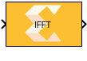
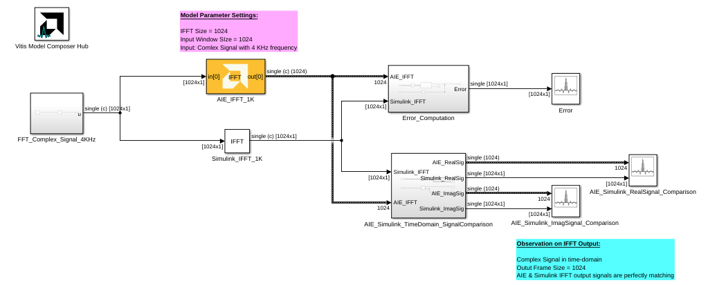
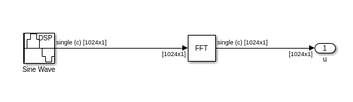
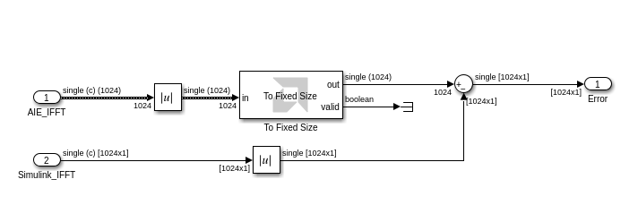
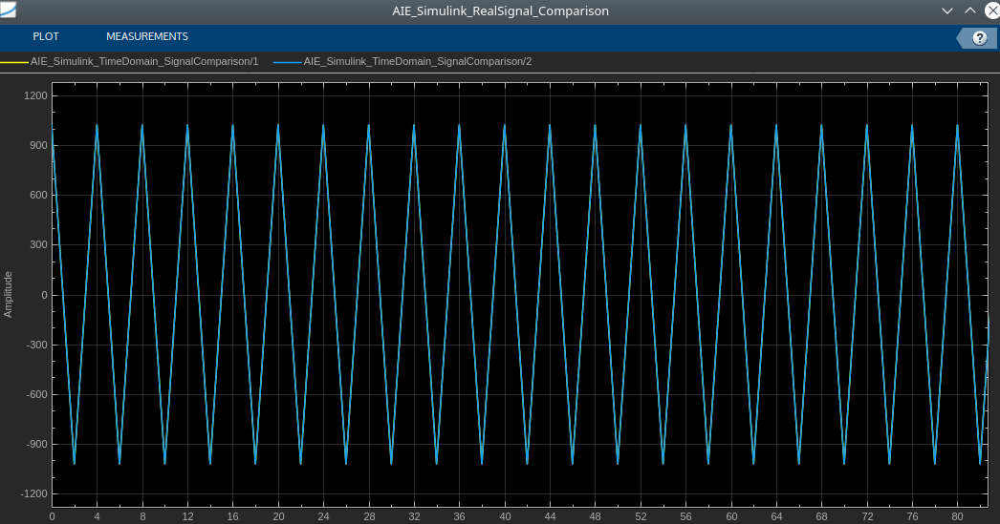
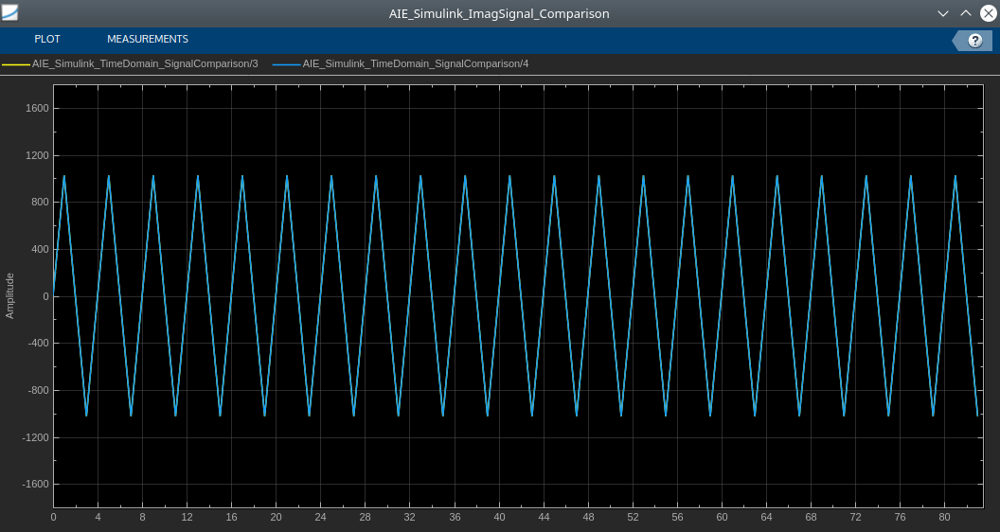

# IFFT

  
  

## Library

AI Engine/DSP/Buffer IO

## Description

This block implements the Inverse FFT targeted for AI Engines which use
the rounding method and saturates the output samples on overflow.

## Parameters

### Main  
#### Input/Output data type  
Describes the type of individual data samples input to and output from
the filter function. Supported types are cint16, cint32 and cfloat.

#### Twiddle factor data type
Describes the data type of the twiddle factors of the transform. It must be one of `cint16`, `cint32`, or `cfloat` and must also satisfy the following rules:
* 32-bit twiddle factors are only supported when the input/output data type is also 32-bit.
* The twiddle factor data type must be an integer type if the input/output data type is an integer type.
* The twiddle factor data type must be `cfloat` if the input/output data type is a float type.

#### IFFT size  
This is an unsigned integer which describes the point size of the
transformation. This must be 2^N, where N is in the range 4 to 16
inclusive. 

#### Input Window Size (Number of Samples)  
Describes the number of samples used as an input to the IFFT.

#### Scale output down by 2^  
Describes the power of 2 to scale the result by prior to output.

#### Rounding mode

Describes the selection of rounding to be applied during the shift down stage of processing.

The following modes are available:
* **Floor:** Truncate LSB, always round down (towards negative infinity).
* **Ceiling:** Always round up (towards positive infinity).
* **Round to positive infinity:** Round halfway towards positive infinity.
* **Round to negative infinity:** Round halfway towards negative infinity.
* **Round symmetrical to infinity:** Round halfway towards infinity (away from zero).
* **Round symmetrical to zero:** Round halfway towards zero (away from infinity).
* **Round convergent to even:** Round halfway towards nearest even number.
* **Round convergent to odd:** Round halfway towards nearest odd number.

No rounding is performed on the **Floor** or **Ceiling** modes. Other modes round to the nearest integer. They differ only in how they round for values that are exactly between two integers.

#### Saturation mode

Describes the selection of saturation to be applied during the shift down stage of processing.

The following modes are available:
* **None:** No saturation is performed and the value is truncated on the MSB side.
* **Asymmetric:** Rounds an n-bit signed value in the range `-2^(n-1)` to `2^(n-1)-1`.
* **Symmetric:** Rounds an n-bit signed value in the range `-2^(n-1)-1` to `2^(n-1)-1`.

####  Number of Cascade Stages
This determines the number of kernels the FFT will be divided over in series to improve throughput. For int data types, and FFT size of 2^N, the maximum cascade length is N/2 when N is even and (N+1)/2 when N is odd. For float data type, the maximum cascade length is N.

## IFFT Block Examples 

This example compares AI Engine IFFT block in Vitis Model Composer with the Simulink IFFT block.

**Example with 1024 IFFT size:**

**IFFT_Complex_Signal_4KHz Subsystem blocks:**

**Error_Computation Subsystem blocks:**
 

**IFFT Signal Real Part Comparison:**

**IFFT Signal Imaginary Part Comparison:**

**Difference between AIE IFFT and Simulink IFFT block outputs:**

