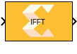
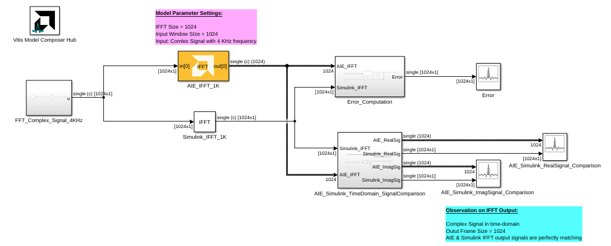

<!-- Library: aieDSP -->

# IFFT
IFFT implementation targeted for AI Engines.
  
  

## Library

AI Engine/DSP/Buffer IO

## Description

This block implements the Inverse FFT targeted for AI Engines which use
the rounding method and saturates the output samples on overflow.

## Parameters

### Main  
#### Input data type  
Set the data type of the block input. The data type of the input signal to the block must match this setting. Valid types are `cint16`, `cint32`, `cfloat`.

#### Output data type
Set the data type of the block output. Valid types are `cint16`, `cint32`, `cfloat`.

#### Twiddle factor data type
Describes the data type of the twiddle factors of the transform. It must be `cint16`, `cint32`, or `cfloat` and must also satisfy the following rules:
* 32-bit twiddle factors are only supported when the input/output data type is also 32-bit.
* The twiddle factor data type must be an integer type if the input/output data type is an integer type.
* The twiddle factor data type must be `cfloat` if the input/output data type is a float type.

#### IFFT size  
This is an unsigned integer which describes the point size of the
transformation. This must be 2^N, where N is in the range 4 to 16
inclusive. 

#### Input window size (Number of Samples)  
Describes the number of samples used as an input to the IFFT.

#### Scale output down by 2^  
Describes the power of 2 to scale the result by prior to output.

#### Rounding mode

Describes the selection of rounding to be applied during the shift down stage of processing.

The following modes are available:
* **Round to positive infinity:** Round halfway towards positive infinity.
* **Round to negative infinity:** Round halfway towards negative infinity.
* **Round symmetrical to infinity:** Round halfway towards infinity (away from zero).
* **Round symmetrical to zero:** Round halfway towards zero (away from infinity).
* **Round convergent to even:** Round halfway towards nearest even number.
* **Round convergent to odd:** Round halfway towards nearest odd number.

These modes round to the nearest integer. They differ only in how they round for values that are exactly between two integers.

#### Saturation mode

Describes the selection of saturation to be applied during the shift down stage of processing.

The following modes are available:
* **None:** No saturation is performed and the value is truncated on the MSB side.
* **Asymmetric:** Rounds an n-bit signed value in the range `-2^(n-1)` to `2^(n-1)-1`.
* **Symmetric:** Rounds an n-bit signed value in the range `-2^(n-1)-1` to `2^(n-1)-1`.

#### Twiddle Mode
This parameter controls the amplitude of the twiddle factors. It applies to `cint16` and `cint32` twiddle factors only; it does not apply to `cfloat` twiddle factors.

Twiddle mode 0 means use max amplitude twiddles which saturate at `2^(N-1)-1`, where N is the number of bits in the type (e.g. `cint16` has 16 bits per component).

Twiddle mode 1 means use 1/2 max magnitude twiddles, i.e. `2^(N-1)`. This avoids saturation, but loses 1 bit of precision and so noise overall will be higher.

#### Use Widget for SSR Kernels
This parameter is applicable to streaming and parallel (SSR>1) implementations of the FFT. These implementations require stream to window conversions on the hardware.

When this parameter is disabled, stream to window conversion will occur within the FFT kernels themselves.

When this parameter is enabled, stream to window conversion will occur on its own AI Engine tiles. This will improve performance at the expense of additional tiles being used.

####  Number of Cascade Stages
This determines the number of kernels the FFT will be divided over in series to improve throughput. For int data types, and FFT size of 2^N, the maximum cascade length is N/2 when N is even and (N+1)/2 when N is odd. For float data type, the maximum cascade length is N.

## Examples 

***Click on the images below to open each model.***

<!--
DESCRIPTION:
Model: IFFT_Ex1
Generated: 09-Jan-2026 13:46:05

Vitis Model Composer Configuration:
  Target Device: xcvc1902-vsva2197-1LP-e-S

Vitis Model Composer Blocks:
  - AIE: IFFT
  - AIE: To Fixed Size

Description:
This MATLAB script creates a Vitis Model Composer Simulink model that uses the AI Engine IFFT block. A 4kHz complex input signal is provided to the block,  and the block's output is compared to a Simulink golden reference.

-->

<!--
MATLAB CREATION SCRIPT:

% create_IFFT_Ex1_model.m
% Auto-generated script to recreate the IFFT_Ex1 Simulink model
% Generated on: 09-Jan-2026 13:46:05

%% Model Configuration
modelName = 'IFFT_Ex1_recreated';

%% Create New Model
if bdIsLoaded(modelName)
    close_system(modelName, 0);
end

new_system(modelName);
open_system(modelName);
fprintf('Created new model: %s\n', modelName);

%% Add Vitis Model Composer Hub Block
hubBlockPath = [modelName '/Vitis Model Composer Hub'];
add_block('vmcUtilities/Vitis Model Composer Hub', hubBlockPath, ...
    'Position', [87 23 142 76]);

hubBlk = xmcFindHubBlock(modelName);
vmchub_set_param(hubBlk, modelName, 'SelectHardware', 'xcvc1902-vsva2197-1LP-e-S');

%% Add Top-Level Blocks
add_block('aieDSP/IFFT', [modelName '/AIE_IFFT_1024'], ...
    'Position', [365 107 460 163]);
set_param([modelName '/AIE_IFFT_1024'], ...
    'data_type', 'cfloat', ...
    'data_out_type', 'cfloat', ...
    'twiddle_type', 'cfloat', ...
    'point_size', '1024', ...
    'input_window_size', '1024', ...
    'shift_val', '0', ...
    'rnd_mode', 'Round symmetrical to infinity', ...
    'sat_mode', '0-None', ...
    'ssr', '1', ...
    'twiddle_mode', '0', ...
    'use_ssr_widget_kernels', 'off', ...
    'casc_length', '1', ...
    'transform_fft_nifft', '0', ...
    'TP_API', '0', ...
    'TP_DYN_PT_SIZE', '0');
add_block('built-in/ArrayPlot', [modelName '/AIE_Simulink_ImagSignal_Comparison '], ...
    'Position', [925 312 970 363]);
set_param([modelName '/AIE_Simulink_ImagSignal_Comparison '], ...
    'NumInputPorts', '2', ...
    'OpenAtSimulationStart', 'on', ...
    'WindowPosition', '[5.000000,41.000000,1272.000000,651.000000,]', ...
    'XDataMode', 'Sample increment and X-offset', ...
    'SampleIncrement', '1', ...
    'XOffset', '0', ...
    'CustomXData', '[]', ...
    'XScale', 'Linear', ...
    'YScale', 'Linear', ...
    'PlotType', 'Line', ...
    'PlotBaseValue', '0', ...
    'AxesScaling', 'OnceAtStop', ...
    'AxesScalingNumUpdates', '100', ...
    'MaximizeAxes', 'Auto', ...
    'LayoutDimensions', '[1,1]', ...
    'ActiveDisplay', '1', ...
    'PlotAsMagnitudePhase', 'off', ...
    'YLabel', 'Amplitude', ...
    'YLimits', '[-0.0001,0]', ...
    'ShowGrid', 'on', ...
    'ShowLegend', 'on', ...
    'ChannelNames', '[]');
add_block('built-in/ArrayPlot', [modelName '/AIE_Simulink_RealSignal_Comparison'], ...
    'Position', [1050 262 1095 313]);
set_param([modelName '/AIE_Simulink_RealSignal_Comparison'], ...
    'NumInputPorts', '2', ...
    'OpenAtSimulationStart', 'on', ...
    'WindowPosition', '[5.000000,41.000000,1272.000000,651.000000,]', ...
    'XDataMode', 'Sample increment and X-offset', ...
    'SampleIncrement', '1', ...
    'XOffset', '0', ...
    'CustomXData', '[]', ...
    'XScale', 'Linear', ...
    'YScale', 'Linear', ...
    'PlotType', 'Line', ...
    'PlotBaseValue', '0', ...
    'AxesScaling', 'OnceAtStop', ...
    'AxesScalingNumUpdates', '100', ...
    'MaximizeAxes', 'Auto', ...
    'LayoutDimensions', '[1,1]', ...
    'ActiveDisplay', '1', ...
    'PlotAsMagnitudePhase', 'off', ...
    'YLabel', 'Amplitude', ...
    'YLimits', '[-1280,1280]', ...
    'ShowGrid', 'on', ...
    'ShowLegend', 'on', ...
    'ChannelNames', '[]');
add_block('built-in/ArrayPlot', [modelName '/Error'], ...
    'Position', [925 130 970 180]);
set_param([modelName '/Error'], ...
    'NumInputPorts', '1', ...
    'OpenAtSimulationStart', 'on', ...
    'WindowPosition', '[300.000000,93.000000,800.000000,500.000000,]', ...
    'XDataMode', 'Custom', ...
    'SampleIncrement', '1', ...
    'XOffset', '0', ...
    'CustomXData', '[]', ...
    'XScale', 'Linear', ...
    'YScale', 'Linear', ...
    'PlotType', 'Line', ...
    'PlotBaseValue', '0', ...
    'AxesScaling', 'OnceAtStop', ...
    'AxesScalingNumUpdates', '100', ...
    'MaximizeAxes', 'Auto', ...
    'LayoutDimensions', '[1,1]', ...
    'ActiveDisplay', '1', ...
    'PlotAsMagnitudePhase', 'off', ...
    'YLabel', 'Amplitude', ...
    'YLimits', '[-10,10]', ...
    'ShowGrid', 'on', ...
    'ShowLegend', 'on', ...
    'ChannelNames', '[]');
add_block('dspxfrm3/IFFT', [modelName '/Simulink_IFFT_1K'], ...
    'Position', [395 221 435 259]);
set_param([modelName '/Simulink_IFFT_1K'], ...
    'FFTImplementation', 'Auto', ...
    'CompMethod', 'Table lookup', ...
    'TableOpt', 'NEW', ...
    'TableOptActive', 'Speed', ...
    'BitRevOrder', 'off', ...
    'cs_in', 'off', ...
    'Normalize', 'off', ...
    'InheritFFTLength', 'off', ...
    'FFTLength', '1024', ...
    'WrapInput', 'on', ...
    'mode', 'Complex', ...
    'outSamplingMode', 'Sample based', ...
    'roundingMode', 'Floor', ...
    'overflowMode', 'off', ...
    'firstCoeffMode', 'Same word length as input', ...
    'firstCoeffWordLength', '16', ...
    'firstCoeffFracLength', '15', ...
    'firstCoeffDataTypeStr', 'Inherit: Same word length as input', ...
    'firstCoeffLastDataTypeStr', 'Inherit: Same word length as input', ...
    'prodOutputMode', 'Inherit via internal rule', ...
    'prodOutputWordLength', '32', ...
    'prodOutputFracLength', '30', ...
    'prodOutputDataTypeStr', 'Inherit: Inherit via internal rule', ...
    'prodOutputLastDataTypeStr', 'Inherit: Inherit via internal rule', ...
    'accumMode', 'Inherit via internal rule', ...
    'accumWordLength', '32', ...
    'accumFracLength', '30', ...
    'accumDataTypeStr', 'Inherit: Inherit via internal rule', ...
    'accumLastDataTypeStr', 'Inherit: Inherit via internal rule', ...
    'outputMode', 'Inherit via internal rule', ...
    'outputWordLength', '16', ...
    'outputFracLength', '15', ...
    'outputDataTypeStr', 'Inherit: Inherit via internal rule', ...
    'outputMin', '[]', ...
    'outputMax', '[]', ...
    'outputLastDataTypeStr', 'Inherit: Inherit via internal rule', ...
    'LockScale', 'off');
add_block('vmcUtilities/Vitis Model Composer Hub', [modelName '/Vitis Model Composer Hub'], ...
    'Position', [87 23 142 76]);
set_param([modelName '/Vitis Model Composer Hub'], ...
    'CodeGeneration', 'off', ...
    'StartColumn', '1', ...
    'NumberOfColumns', '1', ...
    'TargetDirectory', './code', ...
    'exportDesign', 'off', ...
    'analyzeDesign', 'off', ...
    'validateDesignOnHw', 'off', ...
    'ExportType', 'AI Engines', ...
    'IpVendor', 'xilinx.com', ...
    'IpLibrary', 'hls', ...
    'IpVersion', '1.0', ...
    'IpHWLanguage', 'Verilog', ...
    'AieCompilerOptions', '{}', ...
    'CreateTestbench', 'off', ...
    'TestbenchStackSize', '10', ...
    'RunRtlSim', 'off', ...
    'RunCSim', 'off', ...
    'RunAieSim', 'off', ...
    'AieSimTimeout', '50000', ...
    'RunAieSimProfiling', 'off', ...
    'LaunchVitisAnalyzer', 'off', ...
    'PlotOutput', 'off', ...
    'GenHwImage', 'off', ...
    'GenLibadfXo', 'off', ...
    'GenHwValidationCode', 'off', ...
    'PlatformType', 'Not Specified', ...
    'HwSystemType', 'Baremetal', ...
    'HwValidationTarget', 'hw', ...
    'ProjDevice', 'xcvc1902-vsva2197-1LP-e-S', ...
    'SamplePeriod', '-1', ...
    'ClockFrequency', '200', ...
    'DataPathParallelism', '1', ...
    'xilinxfamily', 'versalaicore', ...
    'part', 'xcvc1902', ...
    'speed', '-1LP-e-S', ...
    'package', 'vsva2197', ...
    'directory', './netlist', ...
    'testbench', 'off', ...
    'incr_netlist', 'off', ...
    'synthesis_tool', 'Vivado', ...
    'clock_wrapper', 'Clock Enables', ...
    'dbl_ovrd', 'According to Block Masks', ...
    'dcm_input_clock_period', '10', ...
    'sysclk_period', '10', ...
    'simulink_period', '1', ...
    'eval_field', '0', ...
    'LogFileName', '''''', ...
    'NThreads', '4');

%% Create AIE_Simulink_TimeDomain_SignalComparison Subsystem
add_block('built-in/SubSystem', [modelName '/AIE_Simulink_TimeDomain_SignalComparison'], ...
    'Position', [665 260 785 365]);

% Remove default blocks
defaultBlocks = find_system([modelName '/AIE_Simulink_TimeDomain_SignalComparison'], 'SearchDepth', 1, 'Type', 'block');
for i = 1:length(defaultBlocks)
    if ~strcmp(defaultBlocks{i}, [modelName '/AIE_Simulink_TimeDomain_SignalComparison'])
        delete_block(defaultBlocks{i});
    end
end

add_block('built-in/Inport', [[modelName '/AIE_Simulink_TimeDomain_SignalComparison'] '/Simulink_IFFT'], ...
    'Position', [80 243 110 257]);
set_param([[modelName '/AIE_Simulink_TimeDomain_SignalComparison'] '/Simulink_IFFT'], ...
    'Port', '1', ...
    'IconDisplay', 'Port number', ...
    'OutputFunctionCall', 'off', ...
    'OutMin', '[]', ...
    'OutMax', '[]', ...
    'OutDataTypeStr', 'Inherit: auto', ...
    'LockScale', 'off', ...
    'BusOutputAsStruct', 'off', ...
    'BusVirtuality', 'inherit', ...
    'Unit', 'inherit', ...
    'PortDimensions', '-1', ...
    'VarSizeSig', 'Inherit', ...
    'SampleTime', '-1', ...
    'SignalType', 'auto', ...
    'LatchByDelayingOutsideSignal', 'off', ...
    'LatchInputForFeedbackSignals', 'off', ...
    'Interpolate', 'on', ...
    'DataMode', 'inherit', ...
    'MessageQueueUseDefaultAttributes', 'on', ...
    'MessageQueueCapacity', '1', ...
    'MessageQueueType', 'LIFO', ...
    'MessageQueueOverwriting', 'on');
add_block('built-in/Inport', [[modelName '/AIE_Simulink_TimeDomain_SignalComparison'] '/AIE_IFFT'], ...
    'Position', [80 168 110 182]);
set_param([[modelName '/AIE_Simulink_TimeDomain_SignalComparison'] '/AIE_IFFT'], ...
    'Port', '2', ...
    'IconDisplay', 'Port number', ...
    'OutputFunctionCall', 'off', ...
    'OutMin', '[]', ...
    'OutMax', '[]', ...
    'OutDataTypeStr', 'Inherit: auto', ...
    'LockScale', 'off', ...
    'BusOutputAsStruct', 'off', ...
    'BusVirtuality', 'inherit', ...
    'Unit', 'inherit', ...
    'PortDimensions', '-1', ...
    'VarSizeSig', 'Inherit', ...
    'SampleTime', '-1', ...
    'SignalType', 'auto', ...
    'LatchByDelayingOutsideSignal', 'off', ...
    'LatchInputForFeedbackSignals', 'off', ...
    'Interpolate', 'on', ...
    'DataMode', 'inherit', ...
    'MessageQueueUseDefaultAttributes', 'on', ...
    'MessageQueueCapacity', '1', ...
    'MessageQueueType', 'LIFO', ...
    'MessageQueueOverwriting', 'on');
add_block('built-in/ComplexToRealImag', [[modelName '/AIE_Simulink_TimeDomain_SignalComparison'] '/Complex to Real-Imag'], ...
    'Position', [245 158 275 187]);
set_param([[modelName '/AIE_Simulink_TimeDomain_SignalComparison'] '/Complex to Real-Imag'], ...
    'Output', 'Real and imag', ...
    'SampleTime', '-1');
add_block('built-in/ComplexToRealImag', [[modelName '/AIE_Simulink_TimeDomain_SignalComparison'] '/Complex to Real-Imag1'], ...
    'Position', [245 233 275 262]);
set_param([[modelName '/AIE_Simulink_TimeDomain_SignalComparison'] '/Complex to Real-Imag1'], ...
    'Output', 'Real and imag', ...
    'SampleTime', '-1');
add_block('built-in/Outport', [[modelName '/AIE_Simulink_TimeDomain_SignalComparison'] '/AIE_RealSig'], ...
    'Position', [485 158 515 172]);
set_param([[modelName '/AIE_Simulink_TimeDomain_SignalComparison'] '/AIE_RealSig'], ...
    'Port', '1', ...
    'StorageClass', 'Auto', ...
    'IconDisplay', 'Port number', ...
    'OutputFunctionCall', 'off', ...
    'OutMin', '[]', ...
    'OutMax', '[]', ...
    'OutDataTypeStr', 'Inherit: auto', ...
    'LockScale', 'off', ...
    'BusOutputAsStruct', 'off', ...
    'BusVirtuality', 'inherit', ...
    'DataMode', 'inherit', ...
    'Unit', 'inherit', ...
    'PortDimensions', '-1', ...
    'VarSizeSig', 'Inherit', ...
    'SampleTime', '-1', ...
    'SignalType', 'auto', ...
    'EnsureOutportIsVirtual', 'off', ...
    'OutputWhenDisabled', 'held', ...
    'InitialOutput', '[]', ...
    'MustResolveToSignalObject', 'off', ...
    'OutputWhenUnConnected', 'off', ...
    'OutputWhenUnconnectedValue', '0', ...
    'VectorParamsAs1DForOutWhenUnconnected', 'on');
add_block('built-in/Outport', [[modelName '/AIE_Simulink_TimeDomain_SignalComparison'] '/Simulink_RealSig'], ...
    'Position', [485 233 515 247]);
set_param([[modelName '/AIE_Simulink_TimeDomain_SignalComparison'] '/Simulink_RealSig'], ...
    'Port', '2', ...
    'StorageClass', 'Auto', ...
    'IconDisplay', 'Port number', ...
    'OutputFunctionCall', 'off', ...
    'OutMin', '[]', ...
    'OutMax', '[]', ...
    'OutDataTypeStr', 'Inherit: auto', ...
    'LockScale', 'off', ...
    'BusOutputAsStruct', 'off', ...
    'BusVirtuality', 'inherit', ...
    'DataMode', 'inherit', ...
    'Unit', 'inherit', ...
    'PortDimensions', '-1', ...
    'VarSizeSig', 'Inherit', ...
    'SampleTime', '-1', ...
    'SignalType', 'auto', ...
    'EnsureOutportIsVirtual', 'off', ...
    'OutputWhenDisabled', 'held', ...
    'InitialOutput', '[]', ...
    'MustResolveToSignalObject', 'off', ...
    'OutputWhenUnConnected', 'off', ...
    'OutputWhenUnconnectedValue', '0', ...
    'VectorParamsAs1DForOutWhenUnconnected', 'on');
add_block('built-in/Outport', [[modelName '/AIE_Simulink_TimeDomain_SignalComparison'] '/AIE_ImagSig'], ...
    'Position', [485 193 515 207]);
set_param([[modelName '/AIE_Simulink_TimeDomain_SignalComparison'] '/AIE_ImagSig'], ...
    'Port', '3', ...
    'StorageClass', 'Auto', ...
    'IconDisplay', 'Port number', ...
    'OutputFunctionCall', 'off', ...
    'OutMin', '[]', ...
    'OutMax', '[]', ...
    'OutDataTypeStr', 'Inherit: auto', ...
    'LockScale', 'off', ...
    'BusOutputAsStruct', 'off', ...
    'BusVirtuality', 'inherit', ...
    'DataMode', 'inherit', ...
    'Unit', 'inherit', ...
    'PortDimensions', '-1', ...
    'VarSizeSig', 'Inherit', ...
    'SampleTime', '-1', ...
    'SignalType', 'auto', ...
    'EnsureOutportIsVirtual', 'off', ...
    'OutputWhenDisabled', 'held', ...
    'InitialOutput', '[]', ...
    'MustResolveToSignalObject', 'off', ...
    'OutputWhenUnConnected', 'off', ...
    'OutputWhenUnconnectedValue', '0', ...
    'VectorParamsAs1DForOutWhenUnconnected', 'on');
add_block('built-in/Outport', [[modelName '/AIE_Simulink_TimeDomain_SignalComparison'] '/Simulink_ImagSig'], ...
    'Position', [485 278 515 292]);
set_param([[modelName '/AIE_Simulink_TimeDomain_SignalComparison'] '/Simulink_ImagSig'], ...
    'Port', '4', ...
    'StorageClass', 'Auto', ...
    'IconDisplay', 'Port number', ...
    'OutputFunctionCall', 'off', ...
    'OutMin', '[]', ...
    'OutMax', '[]', ...
    'OutDataTypeStr', 'Inherit: auto', ...
    'LockScale', 'off', ...
    'BusOutputAsStruct', 'off', ...
    'BusVirtuality', 'inherit', ...
    'DataMode', 'inherit', ...
    'Unit', 'inherit', ...
    'PortDimensions', '-1', ...
    'VarSizeSig', 'Inherit', ...
    'SampleTime', '-1', ...
    'SignalType', 'auto', ...
    'EnsureOutportIsVirtual', 'off', ...
    'OutputWhenDisabled', 'held', ...
    'InitialOutput', '[]', ...
    'MustResolveToSignalObject', 'off', ...
    'OutputWhenUnConnected', 'off', ...
    'OutputWhenUnconnectedValue', '0', ...
    'VectorParamsAs1DForOutWhenUnconnected', 'on');

% Connect blocks in AIE_Simulink_TimeDomain_SignalComparison
add_line([modelName '/AIE_Simulink_TimeDomain_SignalComparison'], 'Simulink_IFFT/2', 'Complex to Real-Imag1/2', 'autorouting', 'on');
add_line([modelName '/AIE_Simulink_TimeDomain_SignalComparison'], 'Complex to Real-Imag/3', 'AIE_ImagSig/2', 'autorouting', 'on');
add_line([modelName '/AIE_Simulink_TimeDomain_SignalComparison'], 'Complex to Real-Imag1/3', 'Simulink_ImagSig/2', 'autorouting', 'on');
add_line([modelName '/AIE_Simulink_TimeDomain_SignalComparison'], 'Complex to Real-Imag1/2', 'Simulink_RealSig/2', 'autorouting', 'on');
add_line([modelName '/AIE_Simulink_TimeDomain_SignalComparison'], 'Complex to Real-Imag/2', 'AIE_RealSig/2', 'autorouting', 'on');
add_line([modelName '/AIE_Simulink_TimeDomain_SignalComparison'], 'AIE_IFFT/2', 'Complex to Real-Imag/2', 'autorouting', 'on');

%% Create Error_Computation Subsystem
add_block('built-in/SubSystem', [modelName '/Error_Computation'], ...
    'Position', [660 117 790 193]);

% Remove default blocks
defaultBlocks = find_system([modelName '/Error_Computation'], 'SearchDepth', 1, 'Type', 'block');
for i = 1:length(defaultBlocks)
    if ~strcmp(defaultBlocks{i}, [modelName '/Error_Computation'])
        delete_block(defaultBlocks{i});
    end
end

add_block('built-in/Inport', [[modelName '/Error_Computation'] '/AIE_IFFT'], ...
    'Position', [-110 28 -80 42]);
set_param([[modelName '/Error_Computation'] '/AIE_IFFT'], ...
    'Port', '1', ...
    'IconDisplay', 'Port number', ...
    'OutputFunctionCall', 'off', ...
    'OutMin', '[]', ...
    'OutMax', '[]', ...
    'OutDataTypeStr', 'Inherit: auto', ...
    'LockScale', 'off', ...
    'BusOutputAsStruct', 'off', ...
    'BusVirtuality', 'inherit', ...
    'Unit', 'inherit', ...
    'PortDimensions', '-1', ...
    'VarSizeSig', 'Inherit', ...
    'SampleTime', '-1', ...
    'SignalType', 'auto', ...
    'LatchByDelayingOutsideSignal', 'off', ...
    'LatchInputForFeedbackSignals', 'off', ...
    'Interpolate', 'on', ...
    'DataMode', 'inherit', ...
    'MessageQueueUseDefaultAttributes', 'on', ...
    'MessageQueueCapacity', '1', ...
    'MessageQueueType', 'LIFO', ...
    'MessageQueueOverwriting', 'on');
add_block('built-in/Inport', [[modelName '/Error_Computation'] '/Simulink_IFFT'], ...
    'Position', [0 98 30 112]);
set_param([[modelName '/Error_Computation'] '/Simulink_IFFT'], ...
    'Port', '2', ...
    'IconDisplay', 'Port number', ...
    'OutputFunctionCall', 'off', ...
    'OutMin', '[]', ...
    'OutMax', '[]', ...
    'OutDataTypeStr', 'Inherit: auto', ...
    'LockScale', 'off', ...
    'BusOutputAsStruct', 'off', ...
    'BusVirtuality', 'inherit', ...
    'Unit', 'inherit', ...
    'PortDimensions', '-1', ...
    'VarSizeSig', 'Inherit', ...
    'SampleTime', '-1', ...
    'SignalType', 'auto', ...
    'LatchByDelayingOutsideSignal', 'off', ...
    'LatchInputForFeedbackSignals', 'off', ...
    'Interpolate', 'on', ...
    'DataMode', 'inherit', ...
    'MessageQueueUseDefaultAttributes', 'on', ...
    'MessageQueueCapacity', '1', ...
    'MessageQueueType', 'LIFO', ...
    'MessageQueueOverwriting', 'on');
add_block('built-in/Abs', [[modelName '/Error_Computation'] '/Abs'], ...
    'Position', [25 20 55 50]);
set_param([[modelName '/Error_Computation'] '/Abs'], ...
    'ZeroCross', 'on', ...
    'SampleTime', '-1', ...
    'OutMin', '[]', ...
    'OutMax', '[]', ...
    'OutDataTypeStr', 'Inherit: Same as input', ...
    'LockScale', 'off', ...
    'RndMeth', 'Floor', ...
    'SaturateOnIntegerOverflow', 'off');
add_block('built-in/Abs', [[modelName '/Error_Computation'] '/Abs1'], ...
    'Position', [135 90 165 120]);
set_param([[modelName '/Error_Computation'] '/Abs1'], ...
    'ZeroCross', 'on', ...
    'SampleTime', '-1', ...
    'OutMin', '[]', ...
    'OutMax', '[]', ...
    'OutDataTypeStr', 'Inherit: Same as input', ...
    'LockScale', 'off', ...
    'RndMeth', 'Floor', ...
    'SaturateOnIntegerOverflow', 'off');
add_block('built-in/Sum', [[modelName '/Error_Computation'] '/Sum'], ...
    'Position', [360 10 380 30]);
set_param([[modelName '/Error_Computation'] '/Sum'], ...
    'IconShape', 'round', ...
    'Inputs', '|+-', ...
    'CollapseMode', 'All dimensions', ...
    'CollapseDim', '1', ...
    'OutMin', '[]', ...
    'OutMax', '[]', ...
    'OutDataTypeStr', 'Inherit: Inherit via internal rule', ...
    'AccumDataTypeStr', 'Inherit: Inherit via internal rule', ...
    'InputSameDT', 'off', ...
    'LockScale', 'off', ...
    'RndMeth', 'Floor', ...
    'SaturateOnIntegerOverflow', 'off', ...
    'SampleTime', '-1');
add_block('built-in/Terminator', [[modelName '/Error_Computation'] '/Terminator'], ...
    'Position', [300 35 320 55]);
add_block('aieUtilities/To Fixed Size', [[modelName '/Error_Computation'] '/To Fixed Size'], ...
    'Position', [120 17 235 73]);
set_param([[modelName '/Error_Computation'] '/To Fixed Size'], ...
    'Mode', 'Produce a valid output signal', ...
    'OutputSize', '1024*1', ...
    'CopyMethod', 'Buffer samples to form output', ...
    'HasStatusOutput', 'on');
add_block('built-in/Outport', [[modelName '/Error_Computation'] '/Error'], ...
    'Position', [505 13 535 27]);
set_param([[modelName '/Error_Computation'] '/Error'], ...
    'Port', '1', ...
    'StorageClass', 'Auto', ...
    'IconDisplay', 'Port number', ...
    'OutputFunctionCall', 'off', ...
    'OutMin', '[]', ...
    'OutMax', '[]', ...
    'OutDataTypeStr', 'Inherit: auto', ...
    'LockScale', 'off', ...
    'BusOutputAsStruct', 'off', ...
    'BusVirtuality', 'inherit', ...
    'DataMode', 'inherit', ...
    'Unit', 'inherit', ...
    'PortDimensions', '-1', ...
    'VarSizeSig', 'Inherit', ...
    'SampleTime', '-1', ...
    'SignalType', 'auto', ...
    'EnsureOutportIsVirtual', 'off', ...
    'OutputWhenDisabled', 'held', ...
    'InitialOutput', '[]', ...
    'MustResolveToSignalObject', 'off', ...
    'OutputWhenUnConnected', 'off', ...
    'OutputWhenUnconnectedValue', '0', ...
    'VectorParamsAs1DForOutWhenUnconnected', 'on');

% Connect blocks in Error_Computation
add_line([modelName '/Error_Computation'], 'To Fixed Size/2', 'Sum/2', 'autorouting', 'on');
add_line([modelName '/Error_Computation'], 'Abs/2', 'To Fixed Size/2', 'autorouting', 'on');
add_line([modelName '/Error_Computation'], 'To Fixed Size/3', 'Terminator/2', 'autorouting', 'on');
add_line([modelName '/Error_Computation'], 'Sum/2', 'Error/2', 'autorouting', 'on');
add_line([modelName '/Error_Computation'], 'AIE_IFFT/2', 'Abs/2', 'autorouting', 'on');
add_line([modelName '/Error_Computation'], 'Simulink_IFFT/2', 'Abs1/2', 'autorouting', 'on');
add_line([modelName '/Error_Computation'], 'Abs1/2', 'Sum/3', 'autorouting', 'on');

%% Create FFT_Complex_Signal_4KHz Subsystem
add_block('built-in/SubSystem', [modelName '/FFT_Complex_Signal_4KHz'], ...
    'Position', [80 162 165 228]);

% Remove default blocks
defaultBlocks = find_system([modelName '/FFT_Complex_Signal_4KHz'], 'SearchDepth', 1, 'Type', 'block');
for i = 1:length(defaultBlocks)
    if ~strcmp(defaultBlocks{i}, [modelName '/FFT_Complex_Signal_4KHz'])
        delete_block(defaultBlocks{i});
    end
end

add_block('dspxfrm3/FFT', [[modelName '/FFT_Complex_Signal_4KHz'] '/FFT'], ...
    'Position', [50 26 90 64]);
set_param([[modelName '/FFT_Complex_Signal_4KHz'] '/FFT'], ...
    'FFTImplementation', 'Auto', ...
    'CompMethod', 'Table lookup', ...
    'TableOpt', 'NEW', ...
    'TableOptActive', 'Speed', ...
    'BitRevOrder', 'off', ...
    'Normalize', 'off', ...
    'InheritFFTLength', 'on', ...
    'FFTLength', '64', ...
    'WrapInput', 'on', ...
    'roundingMode', 'Floor', ...
    'overflowMode', 'off', ...
    'firstCoeffMode', 'Same word length as input', ...
    'firstCoeffWordLength', '16', ...
    'firstCoeffFracLength', '15', ...
    'firstCoeffDataTypeStr', 'Inherit: Same word length as input', ...
    'firstCoeffLastDataTypeStr', 'Inherit: Same word length as input', ...
    'prodOutputMode', 'Inherit via internal rule', ...
    'prodOutputWordLength', '32', ...
    'prodOutputFracLength', '30', ...
    'prodOutputDataTypeStr', 'Inherit: Inherit via internal rule', ...
    'prodOutputLastDataTypeStr', 'Inherit: Inherit via internal rule', ...
    'accumMode', 'Inherit via internal rule', ...
    'accumWordLength', '32', ...
    'accumFracLength', '30', ...
    'accumDataTypeStr', 'Inherit: Inherit via internal rule', ...
    'accumLastDataTypeStr', 'Inherit: Inherit via internal rule', ...
    'outputMode', 'Inherit via internal rule', ...
    'outputWordLength', '16', ...
    'outputFracLength', '15', ...
    'outputDataTypeStr', 'Inherit: Inherit via internal rule', ...
    'outputMin', '[]', ...
    'outputMax', '[]', ...
    'outputLastDataTypeStr', 'Inherit: Inherit via internal rule', ...
    'LockScale', 'off');
add_block('dspsrcs4/Sine Wave', [[modelName '/FFT_Complex_Signal_4KHz'] '/Sine Wave'], ...
    'Position', [-190 23 -145 67]);
set_param([[modelName '/FFT_Complex_Signal_4KHz'] '/Sine Wave'], ...
    'Amplitude', '1', ...
    'Frequency', '4e3', ...
    'Phase', '0', ...
    'SampleMode', 'Discrete', ...
    'OutComplex', 'Complex', ...
    'CompMethod', 'Trigonometric fcn', ...
    'TableSize', 'Speed', ...
    'SampleTime', '1/8e3', ...
    'SamplesPerFrame', '1024', ...
    'ResetState', 'Restart at time zero', ...
    'OutputFrames', 'off', ...
    'additionalParams', 'off', ...
    'allowOverrides', 'on', ...
    'dataType', 'single', ...
    'wordLen', '16', ...
    'udDataType', 'sfix(16)', ...
    'fracBitsMode', 'Best precision', ...
    'numFracBits', '15', ...
    'OutDataTypeStr', 'single', ...
    'LastOutDataTypeStr', 'single');
add_block('built-in/Outport', [[modelName '/FFT_Complex_Signal_4KHz'] '/u'], ...
    'Position', [235 38 265 52]);
set_param([[modelName '/FFT_Complex_Signal_4KHz'] '/u'], ...
    'Port', '1', ...
    'StorageClass', 'Auto', ...
    'IconDisplay', 'Port number', ...
    'OutputFunctionCall', 'off', ...
    'OutMin', '[]', ...
    'OutMax', '[]', ...
    'OutDataTypeStr', 'Inherit: auto', ...
    'LockScale', 'off', ...
    'BusOutputAsStruct', 'off', ...
    'BusVirtuality', 'inherit', ...
    'DataMode', 'inherit', ...
    'Unit', 'inherit', ...
    'PortDimensions', '-1', ...
    'VarSizeSig', 'Inherit', ...
    'SampleTime', '-1', ...
    'SignalType', 'auto', ...
    'EnsureOutportIsVirtual', 'off', ...
    'OutputWhenDisabled', 'held', ...
    'InitialOutput', '[]', ...
    'MustResolveToSignalObject', 'off', ...
    'OutputWhenUnConnected', 'off', ...
    'OutputWhenUnconnectedValue', '0', ...
    'VectorParamsAs1DForOutWhenUnconnected', 'on');

% Connect blocks in FFT_Complex_Signal_4KHz
add_line([modelName '/FFT_Complex_Signal_4KHz'], 'FFT/2', 'u/2', 'autorouting', 'on');
add_line([modelName '/FFT_Complex_Signal_4KHz'], 'Sine Wave/2', 'FFT/2', 'autorouting', 'on');

%% Connect Top-Level Blocks
add_line(modelName, 'AIE_Simulink_TimeDomain_SignalComparison/5', 'AIE_Simulink_ImagSignal_Comparison /3', 'autorouting', 'on');
add_line(modelName, 'AIE_Simulink_TimeDomain_SignalComparison/4', 'AIE_Simulink_ImagSignal_Comparison /2', 'autorouting', 'on');
add_line(modelName, 'AIE_Simulink_TimeDomain_SignalComparison/3', 'AIE_Simulink_RealSignal_Comparison/3', 'autorouting', 'on');
add_line(modelName, 'AIE_Simulink_TimeDomain_SignalComparison/2', 'AIE_Simulink_RealSignal_Comparison/2', 'autorouting', 'on');
add_line(modelName, 'Error_Computation/2', 'Error/2', 'autorouting', 'on');
add_line(modelName, 'Simulink_IFFT_1K/2', 'AIE_Simulink_TimeDomain_SignalComparison/2', 'autorouting', 'on');
add_line(modelName, 'Simulink_IFFT_1K/2', 'Error_Computation/3', 'autorouting', 'on');
add_line(modelName, 'Simulink_IFFT_1K/2', 'Error_Computation/3', 'autorouting', 'on');
add_line(modelName, 'AIE_IFFT_1024/2', 'Error_Computation/2', 'autorouting', 'on');
add_line(modelName, 'AIE_IFFT_1024/2', 'AIE_Simulink_TimeDomain_SignalComparison/3', 'autorouting', 'on');
add_line(modelName, 'AIE_IFFT_1024/2', 'AIE_Simulink_TimeDomain_SignalComparison/3', 'autorouting', 'on');
add_line(modelName, 'FFT_Complex_Signal_4KHz/2', 'Simulink_IFFT_1K/2', 'autorouting', 'on');
add_line(modelName, 'FFT_Complex_Signal_4KHz/2', 'AIE_IFFT_1024/2', 'autorouting', 'on');
add_line(modelName, 'FFT_Complex_Signal_4KHz/2', 'AIE_IFFT_1024/2', 'autorouting', 'on');

%% Save Model
save_system(modelName);
fprintf('\nModel saved: %s.slx\n', modelName);
-->

## References
This block uses the Vitis DSP library implementation of IFFT. For more details on this implementation please click [here](https://docs.xilinx.com/r/en-US/Vitis_Libraries/dsp/user_guide/L2/func-fft-ifft-aie-only.html).

--------------
Copyright (C) 2025 Advanced Micro Devices, Inc.
All rights reserved.

SPDX-License-Identifier: MIT
